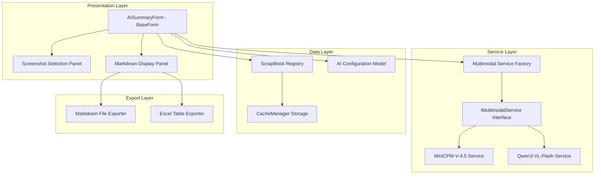
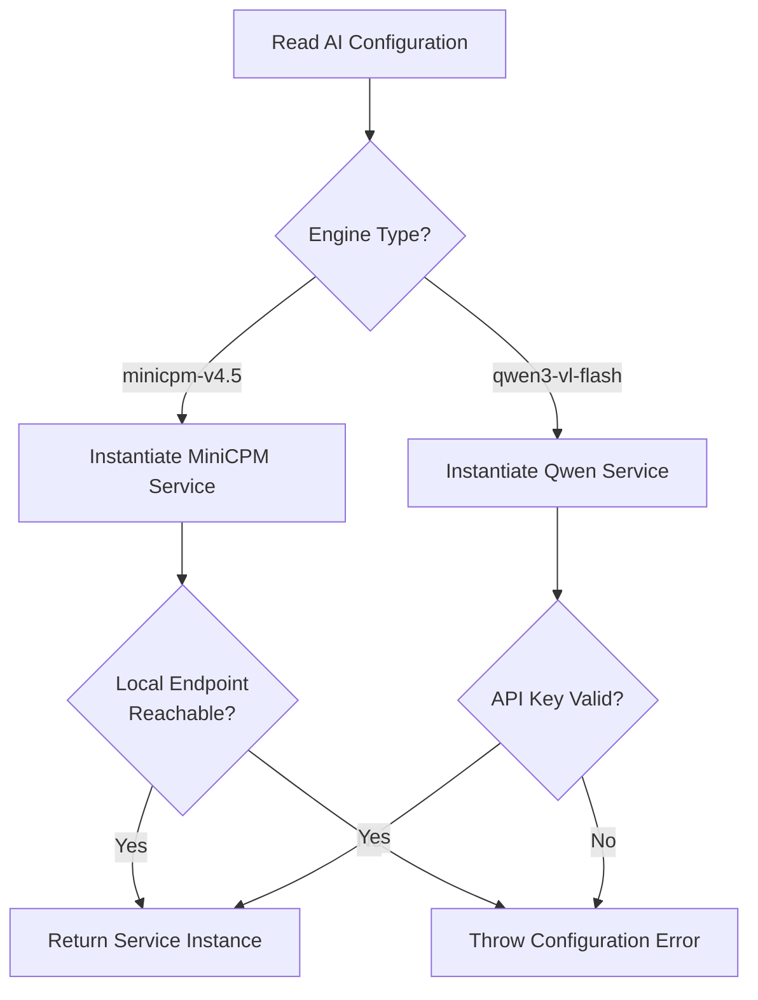
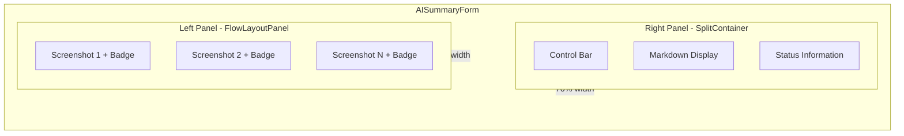
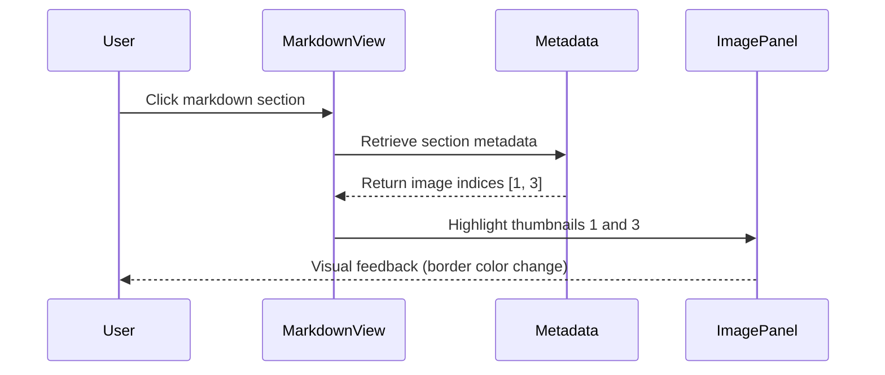
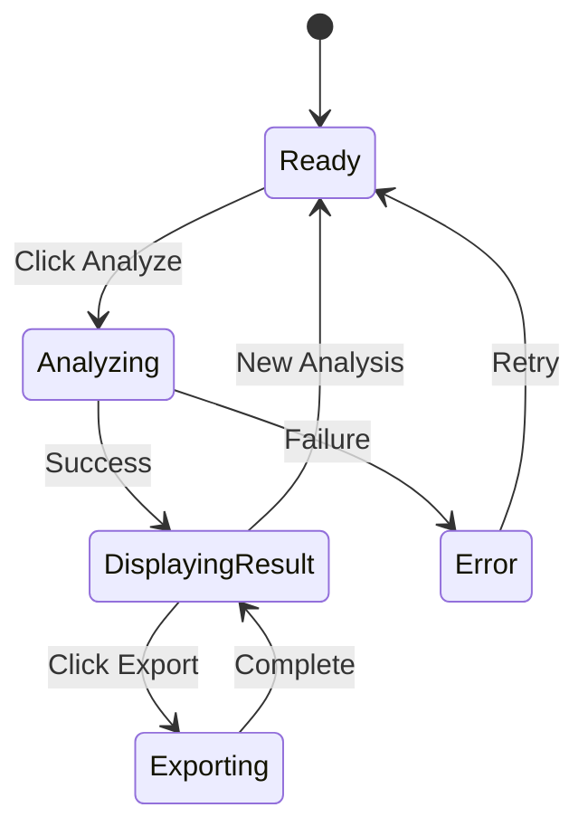
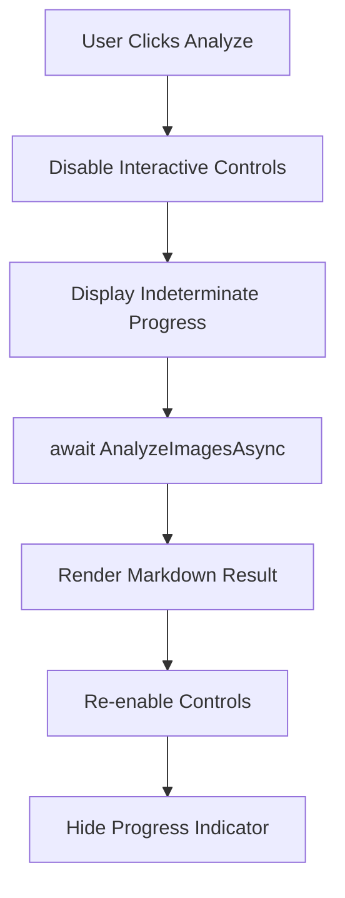
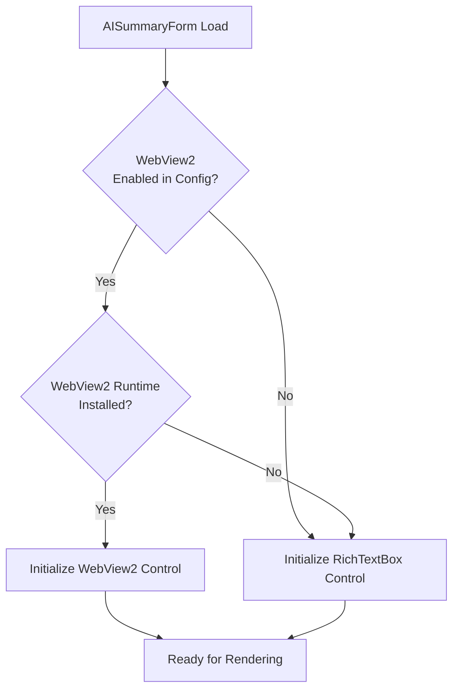
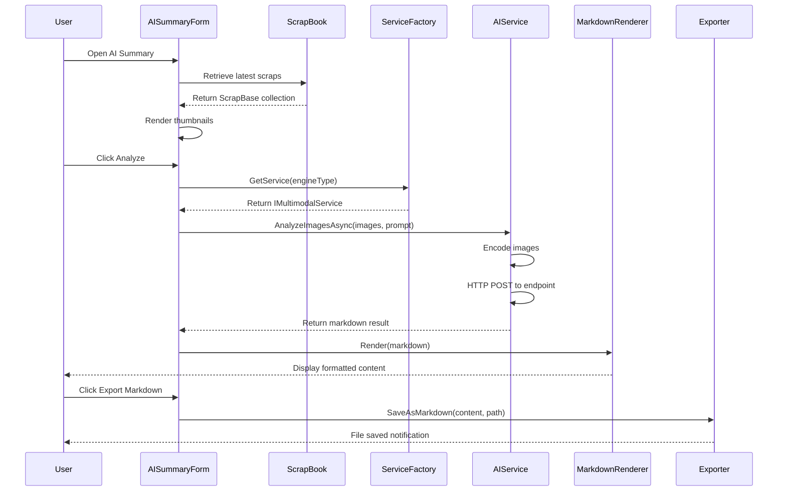

# AI-Powered Screenshot Summary Feature

## Feature Overview

Enable users to generate structured, Markdown-formatted summaries from recent screenshots using multimodal AI models, supporting both local inference and cloud-based services, while maintaining Setuna's lightweight Windows Forms architecture.

## Strategic Goals

- Provide AI-powered analysis of multiple screenshots to extract structured information
- Support flexible model deployment (local offline inference and cloud API)
- Maintain zero breaking changes to existing screenshot workflow
- Preserve single-executable deployment model with optional dependencies
- Deliver responsive UI experience with memory efficiency

## System Architecture

### Component Structure



## Core Design Specifications

### Multimodal AI Service Architecture

#### Service Abstraction

The system defines a unified interface for multimodal AI interactions:

**IMultimodalService Contract**

| Member | Type | Purpose |
|--------|------|---------|
| AnalyzeImagesAsync | Method | Accepts image collection and prompt, returns markdown summary |
| IsAvailable | Method | Health check for service readiness |
| ModelName | Property | Identifies the underlying model |
| MaxImageCount | Property | Reports batch size limitation |

**Request Data Model**

| Field | Type | Description |
|-------|------|-------------|
| Images | List of Image | Screenshot bitmap data |
| Prompt | String | Analysis instruction template |
| MaxTokens | Integer | Response length limit |
| Temperature | Float | Randomness control parameter |

**Response Data Model**

| Field | Type | Description |
|-------|------|-------------|
| MarkdownContent | String | Generated summary in markdown format |
| Success | Boolean | Operation status indicator |
| ErrorMessage | String | Failure reason description |

#### Implementation Strategy

**Local Model Service (MiniCPM-V-4.5)**

- Communicates with local HTTP endpoint (default: http://localhost:8080)
- Encodes images as base64 data URIs
- Sends multi-image payloads in single request
- Implements timeout handling (30 seconds default)
- Provides offline capability without API key dependency

**Cloud API Service (Qwen3-VL-Flash)**

- Targets DashScope OpenAI-compatible endpoint: https://dashscope.aliyuncs.com/compatible-mode/v1
- Authenticates using API key from configuration
- Leverages vision-capable chat completion format
- Handles rate limiting with exponential backoff
- Implements request retry logic (3 attempts maximum)

**Service Factory Pattern**

The factory instantiates the appropriate service based on configuration:



### Configuration Management

#### Configuration Schema

The AI summary feature extends SetunaOption.xml with a new section:

**XML Structure**

| Element | Attributes | Type | Default | Description |
|---------|-----------|------|---------|-------------|
| AISummary | - | Container | - | Root configuration node |
| Enabled | - | Boolean | false | Feature toggle |
| Engine | - | Enumeration | minicpm-v4.5 | Model selection (minicpm-v4.5, qwen3-vl-flash) |
| LocalEndpoint | - | String | http://localhost:8080 | Local inference server URL |
| ApiKey | - | String | (empty) | Cloud service authentication token |
| MaxImages | - | Integer | 5 | Concurrent screenshot limit |
| PromptTemplate | - | String | (default prompt) | Analysis instruction customization |

**Default Prompt Template**

The system prompt instructs the AI to analyze screenshots and output structured markdown:

"Analyze the provided screenshots and generate a comprehensive summary in markdown format. Include: 1) Overview section describing the main content, 2) Detailed findings organized with headings and bullet points, 3) Tables for any structured data observed, 4) Key observations section. Use clear hierarchical structure with H1-H3 headings."

#### Persistence Strategy

**Extension of SetunaOption Class**

The existing SetunaOption class gains a new property:

| Property Name | Type | XML Element Name |
|---------------|------|------------------|
| AISummary | AISummaryConfig | AISummary |

**Serialization Integration**

The GetAllType method includes AISummaryConfig in the type array for XmlSerializer compatibility, ensuring seamless persistence alongside existing configuration data.

### User Interface Design

#### Form Architecture

**AISummaryForm : BaseForm**

The main window inherits from BaseForm to maintain consistency with Setuna's form management system. Key characteristics:

- Modal dialog presentation
- StartPosition: CenterParent
- FormBorderStyle: Sizable
- Minimum size: 800x600 pixels
- Initial size: 1200x700 pixels

**Layout Organization**



#### Screenshot Selection Panel

**Visual Design**

- FlowLayoutPanel with vertical flow direction
- Auto-scroll when content exceeds viewport
- Each screenshot presented as:
  - PictureBox with thumbnail (150x150 max, aspect preserved)
  - Semi-transparent badge overlay in bottom-right corner
  - Badge displays sequential number (1, 2, 3, ...)
  - Badge styling: White circular background (opacity 85%), bold black text

**Interaction Behavior**

| User Action | System Response |
|-------------|-----------------|
| Click thumbnail | Highlight corresponding markdown section in right panel |
| Double-click thumbnail | Open full-size preview window |
| Right-click thumbnail | Show context menu (Remove, View Full Size) |
| Hover thumbnail | Display tooltip with timestamp and dimensions |

**Data Binding**

The panel retrieves screenshots through ScrapBook enumeration:

1. Query ScrapBook for all active scraps
2. Sort by DateTime property (descending order)
3. Limit to MaxImages configuration value
4. Extract Image property from each ScrapBase
5. Generate thumbnails with proportional scaling

#### Markdown Display Panel

**Rendering Strategy**

The system provides dual rendering modes based on availability and user preference:

**Mode 1: RichTextBox-based Rendering (Default)**

- Leverages native Windows Forms RichTextBox control
- Parses markdown syntax for basic formatting:
  - H1-H3 headers: Bold font with scaled sizes
  - Bold markers (**text**): FontStyle.Bold application
  - Tables: Monospace font with tab-aligned columns
  - Bullet lists: Indented paragraphs with bullet characters
- Paragraph-level selection for copy operations
- Lightweight with zero external dependencies

**Mode 2: WebView2-based Rendering (Optional)**

- Requires Microsoft.Web.WebView2.WinForms NuGet package
- Enabled only when:
  - WebView2 runtime detected on system
  - User explicitly enables in configuration
- Provides enhanced rendering:
  - Full markdown spec support via markdown-it.js
  - Liquid Glass–inspired CSS styling
  - Syntax highlighting for code blocks
  - Responsive table layouts
- Fallback to Mode 1 if initialization fails

**Markdown-to-Scrap Correlation**

Each markdown section maintains metadata linking it to source screenshots:



The AI service response includes structured metadata indicating which screenshots contributed to each content section, enabling bidirectional navigation.

#### Control Bar Components

| Component | Type | Function |
|-----------|------|----------|
| Engine Selector | ComboBox | Switch between local/cloud models |
| Analyze Button | Button | Trigger AI summary generation |
| Export to Markdown | Button | Save content as .md file |
| Export Tables to Excel | Button | Extract tables to .xlsx format |
| Progress Indicator | ProgressBar | Display processing status |
| Status Label | Label | Show current operation message |

**State Management**



### Data Retrieval Strategy

#### Screenshot Access Pattern

**Integration with ScrapBook**

The system queries the central ScrapBook registry without modifying persistence logic:

1. Access Mainform.Instance.scrapBook reference
2. Enumerate ScrapBase instances via GetEnumerator
3. Filter for valid image data (Image property not null)
4. Sort by DateTime descending to prioritize recent captures
5. Apply MaxImages limit from configuration

**Image Extraction**

| Source | Method | Notes |
|--------|--------|-------|
| ScrapBase.Image | Direct property access | Returns original bitmap |
| CacheItem.ReadImage | File system read | Alternative for disposed scraps |
| GetViewImage | Styled representation | Includes applied transformations |

The system prefers ScrapBase.Image for raw screenshot data without style transformations.

#### Memory Optimization

To maintain memory footprint below 100 MB during processing:

**Image Compression Strategy**

- Resize images exceeding 1920x1080 to fit within bounds
- Use JPEG encoding at 85% quality for API transmission
- Dispose temporary bitmaps immediately after encoding
- Implement IDisposable pattern for service classes

**Async/Await Architecture**

All AI service calls execute asynchronously to prevent UI blocking:



### Export Functionality

#### Markdown File Export

**Output Format**

- Plain text file with .md extension
- UTF-8 encoding without BOM
- Preserves original markdown structure from AI response
- Includes metadata header:
  - Generation timestamp
  - Model identifier
  - Screenshot count

**File Dialog Behavior**

| Property | Value |
|----------|-------|
| Filter | Markdown Files (*.md) | All Files (*.*) |
| DefaultExt | .md |
| InitialDirectory | User's Documents folder |
| FileName | Summary_[timestamp].md |

#### Excel Table Export

**Extraction Logic**

The system parses markdown tables using delimiter detection:

1. Identify table blocks (lines containing pipe characters)
2. Parse header row and separator row
3. Extract data rows into structured collection
4. Validate column alignment

**Excel Generation with EPPlus**

- Each table exported as separate worksheet
- Worksheet naming: "Table 1", "Table 2", etc.
- Formatting applied:
  - Header row: Bold font, light gray background
  - Auto-fit column widths
  - Border styling for all cells
  - Freeze header row

**Dependency Handling**

EPPlus (v5.x or later) introduced as NuGet package dependency. License compliance note: Commercial use requires EPPlus license or use of EPPlus 4.x (LGPL).

### Integration Points

#### Non-Breaking Integration

The feature integrates without modifying existing components:

**Isolation Strategy**

| Existing Component | Integration Method | Change Type |
|--------------------|-------------------|-------------|
| ScrapBook | Read-only enumeration | No modification |
| CacheManager | Observer pattern (existing listeners) | No modification |
| SetunaOption | XML schema extension | Additive property |
| Mainform | Menu item addition | Additive UI element |

**Menu Integration**

A new menu item appears in the main context menu:

- Location: Between "Scrap List" and "Dustbox"
- Label: "AI Summary..."
- Hotkey: Ctrl+Alt+S (configurable)
- Enabled when: ScrapBook contains at least 1 scrap
- Action: Opens AISummaryForm as modal dialog

#### WebView2 Optional Dependency

**Runtime Detection**

The system checks for WebView2 availability at form initialization:



**Deployment Strategy**

- WebView2 NuGet package reference marked as optional
- Build configuration excludes from single-executable embedding
- User receives notification if WebView2 enabled but runtime missing
- Graceful degradation to RichTextBox with no feature loss

## Data Flow Architecture

### End-to-End Processing Flow



### Error Handling Strategy

The system implements comprehensive error recovery:

**Error Categories**

| Error Type | Detection Point | Recovery Action |
|-----------|----------------|-----------------|
| Configuration Invalid | Service factory initialization | Display error dialog, disable AI features |
| Network Timeout | AI service HTTP call | Retry with exponential backoff, then fail gracefully |
| API Authentication Failure | Cloud service response | Prompt for API key update |
| Local Endpoint Unreachable | MiniCPM service health check | Suggest starting local server, allow retry |
| Response Parsing Error | Markdown extraction | Display raw response, log error |
| Memory Allocation Failure | Image processing | Reduce image resolution, retry |

**User Notification Design**

Errors present through non-modal notification bar above the summary panel:

- Red background for critical errors
- Yellow background for warnings
- Retry button when applicable
- Auto-dismiss after 10 seconds for non-critical issues

## Performance Specifications

### Response Time Targets

| Operation | Target Duration | Maximum Acceptable |
|-----------|----------------|-------------------|
| Form initialization | < 500ms | 1 second |
| Thumbnail generation | < 100ms per image | 200ms per image |
| Local AI inference (5 images) | < 15 seconds | 30 seconds |
| Cloud API call (5 images) | < 8 seconds | 20 seconds |
| Markdown rendering | < 300ms | 1 second |
| Excel export | < 2 seconds | 5 seconds |

### Resource Constraints

**Memory Budget**

- Base form overhead: ~15 MB
- Thumbnail cache: ~5 MB (for 10 thumbnails at 150x150)
- AI processing: ~60 MB peak (image encoding + service overhead)
- WebView2 renderer: ~40 MB additional (when enabled)
- Total target: < 100 MB without WebView2, < 150 MB with WebView2

**Concurrent Operations**

The system enforces single-threaded AI analysis:

- Only one AnalyzeImagesAsync call active at a time
- Analyze button disabled during processing
- Progress indicator shows indeterminate state
- Cancel button allows user to abort long-running operations

## Security Considerations

### API Key Management

**Storage Strategy**

- API keys stored in SetunaConfig.xml with base64 obfuscation
- Not encrypted (user responsible for file system permissions)
- Never logged or transmitted except to configured endpoint
- Redacted in error messages (show only first 6 characters)

**Transmission Security**

- Cloud API calls enforced over HTTPS
- Local endpoint supports both HTTP and HTTPS
- TLS 1.2 minimum for cloud connections
- Certificate validation enabled (no override option)

### Data Privacy

**Screenshot Handling**

- Screenshots transmitted to AI services contain user-visible content
- No persistent storage of API request/response on disk
- Images disposed from memory after processing completes
- User informed of data transmission through configuration UI

**Consent Mechanism**

First-time usage displays one-time disclosure:

"AI Summary feature transmits screenshot data to configured AI service. For local models, data remains on your machine. For cloud services, data is sent to third-party providers. Review privacy policies before proceeding."

## Compatibility Requirements

### Platform Support

| Component | Minimum Version | Recommended Version |
|-----------|----------------|---------------------|
| Windows OS | Windows 10 Build 14393 | Windows 11 |
| .NET Framework | 4.7 | 4.8 |
| WebView2 Runtime | 95.0.x (optional) | Latest stable |

### Browser Engine (WebView2 Mode)

- Chromium-based rendering engine
- Markdown-it.js library bundled in HTML resources
- CSS styling embedded (no external CDN dependencies)
- JavaScript enabled required for interactive features

## Testing Strategy

### Functional Test Scenarios

**Configuration Management**

- Verify XML serialization of AISummary settings
- Validate default value initialization
- Test configuration migration from versions without AI support

**Service Integration**

- Mock local endpoint responses for MiniCPM service
- Mock DashScope API responses for Qwen service
- Test timeout and retry logic with deliberate delays
- Verify error handling for malformed responses

**UI Interaction**

- Validate thumbnail rendering with varied image sizes
- Test markdown rendering with complex nested structures
- Verify bidirectional highlighting between images and content
- Validate export dialogs with various file paths

**Memory Management**

- Monitor memory usage during 10-image processing
- Verify proper disposal of Image objects
- Test with long-running operations (30+ seconds)

### Integration Test Cases

| Test Case | Setup | Expected Outcome |
|-----------|-------|------------------|
| Local model offline | Stop local inference server | Graceful error with retry option |
| Invalid API key | Configure incorrect cloud key | Authentication error message displayed |
| Empty ScrapBook | Open form with no screenshots | UI shows empty state, analyze disabled |
| Large image batch | Select 10+ screenshots | Only MaxImages processed with notification |
| WebView2 unavailable | Uninstall runtime, enable WebView2 | Fallback to RichTextBox with warning |

## Maintenance and Extensibility

### Future Enhancement Hooks

The design allows for future capabilities without architectural changes:

**Model Plugin System**

The IMultimodalService interface can support additional implementations:

- Anthropic Claude Vision (cloud)
- Google Gemini Pro Vision (cloud)
- LLaVA variants (local)
- Custom HTTP endpoint providers

**Advanced Rendering**

The markdown display panel can evolve to support:

- Real-time collaborative editing
- Inline image annotation with markup tools
- Export to additional formats (PDF, DOCX)
- Custom CSS theme selection

**Workflow Automation**

Future integration points for automated workflows:

- Scheduled summary generation
- Auto-export to cloud storage
- Email delivery of summaries
- Integration with project management tools

### Deprecation Strategy

If the feature requires removal or major refactoring:

1. Configuration remains backward compatible (ignored if removed)
2. Menu item conditional on feature flag in SetunaOption
3. AISummaryForm assembly can be excluded from build
4. Zero impact on core screenshot functionality

## Configuration Reference

### Complete XML Example

```xml
<SetunaOption>
  <!-- Existing configuration sections -->
  
  <AISummary>
    <Enabled>true</Enabled>
    <Engine>qwen3-vl-flash</Engine>
    <LocalEndpoint>http://localhost:8080</LocalEndpoint>
    <ApiKey>sk-abc123def456...</ApiKey>
    <MaxImages>5</MaxImages>
    <PromptTemplate>Analyze these screenshots and provide a structured markdown summary.</PromptTemplate>
    <UseWebView2>false</UseWebView2>
    <TimeoutSeconds>30</TimeoutSeconds>
  </AISummary>
</SetunaOption>
```

### Configuration Parameter Details

| Parameter | Type | Validation Rules | Default Behavior |
|-----------|------|------------------|------------------|
| Enabled | Boolean | true or false | false (feature hidden) |
| Engine | String | minicpm-v4.5 or qwen3-vl-flash | minicpm-v4.5 |
| LocalEndpoint | URL | Valid HTTP/HTTPS URL | http://localhost:8080 |
| ApiKey | String | Min 8 characters | Empty (cloud service unavailable) |
| MaxImages | Integer | 1 to 10 | 5 |
| PromptTemplate | String | Max 2000 characters | Built-in default prompt |
| UseWebView2 | Boolean | true or false | false |
| TimeoutSeconds | Integer | 10 to 120 | 30 |

## Deployment Checklist

### Build Configuration

- Add NuGet packages: EPPlus (required), Microsoft.Web.WebView2.WinForms (optional)
- Update AssemblyInfo.cs with feature version increment
- Configure ILMerge to embed EPPlus (exclude WebView2)
- Test single-executable output with AI features

### User Communication

**Documentation Updates**

- Add AI Summary section to user manual
- Document model setup instructions for local deployment
- Provide DashScope API key acquisition guide
- Include troubleshooting guide for common errors

**Release Notes**

"New AI Summary feature enables automated analysis of screenshot batches. Supports local MiniCPM-V-4.5 inference and Qwen3-VL-Flash cloud API. Access via context menu or Ctrl+Alt+S. Configure in Options dialog under AI section."

## Risk Assessment and Mitigation

### Technical Risks

| Risk | Probability | Impact | Mitigation |
|------|-------------|--------|------------|
| Cloud API service discontinuation | Medium | High | Support multiple cloud providers, local fallback |
| WebView2 incompatibility | Low | Medium | Mandatory RichTextBox fallback implemented |
| Memory leak in long sessions | Low | High | Implement aggressive disposal, memory profiling |
| Slow local inference | High | Medium | Display progress, allow cancellation, document hardware requirements |

### User Experience Risks

| Risk | Impact | Mitigation Strategy |
|------|--------|-------------------|
| Confusing AI-generated content | Medium | Provide clear disclaimers, allow editing |
| Unexpected API costs | High | Document cloud service pricing, suggest local option |
| Privacy concerns | High | Explicit consent dialog, clear data flow documentation |
| Complex configuration | Medium | Sensible defaults, configuration wizard |

## Success Criteria

### Functional Completeness

- Users can generate markdown summaries from 1-10 screenshots
- Both local and cloud AI models produce valid output
- Export functions create usable .md and .xlsx files
- UI remains responsive during processing
- Configuration persists across application restarts

### Quality Metrics

- Memory usage stays below 100 MB for typical operations
- Processing completes within timeout limits
- No crashes or data loss during error conditions
- Accessibility: keyboard navigation fully functional
- Visual consistency with existing Setuna UI patterns

### User Acceptance

- Feature discoverability: Users find AI Summary menu within first 3 uses of capture
- Task completion: 90% of users successfully generate their first summary
- Error recovery: Users can recover from configuration errors without external help
- Performance perception: Processing time feels acceptable (not frustratingly slow)

---

**Confidence Assessment**: Medium

**Confidence Basis**:
- Requirements are comprehensive and technically specific
- Integration approach is sound (non-breaking, isolated components)
- Known uncertainties: Local model performance variability, cloud API stability
- Complexity manageable within WinForms architecture
- Primary risks identified with mitigation strategies
