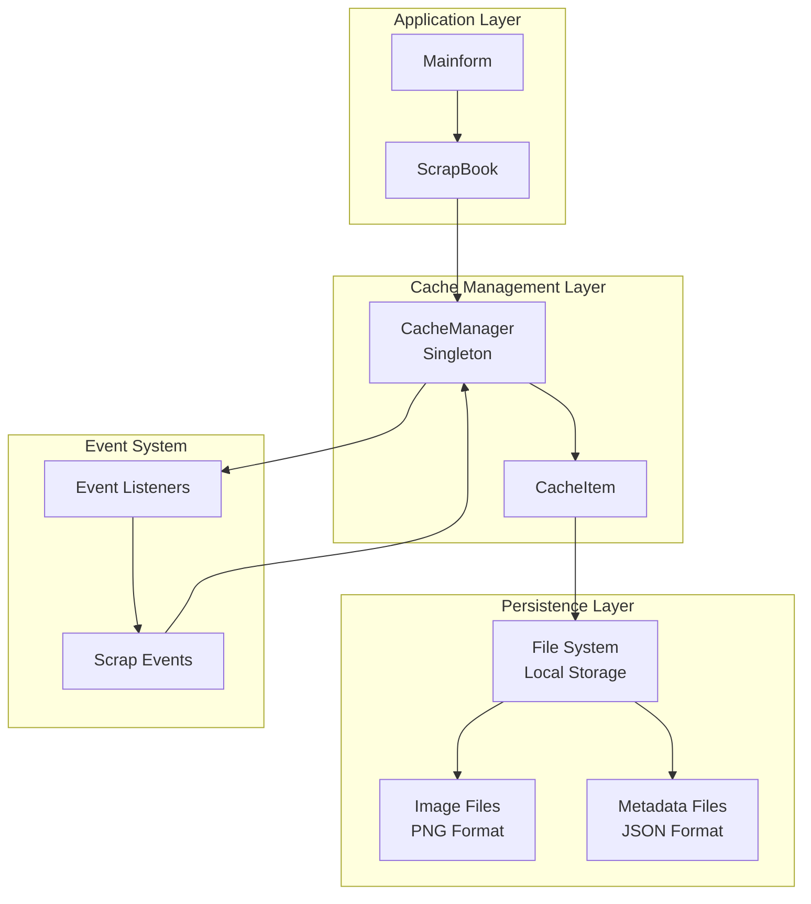
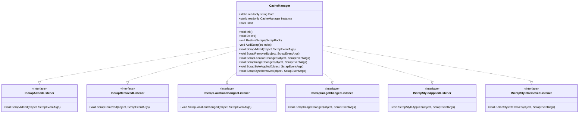
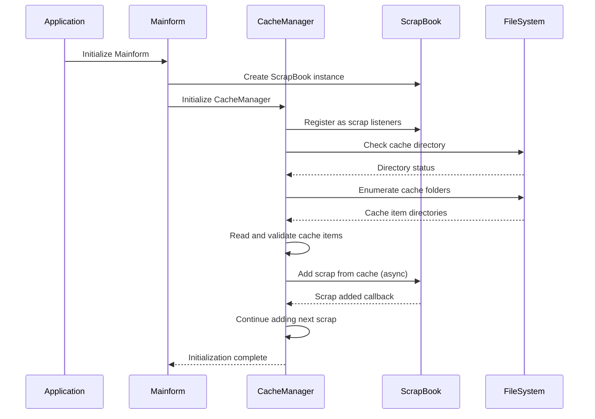
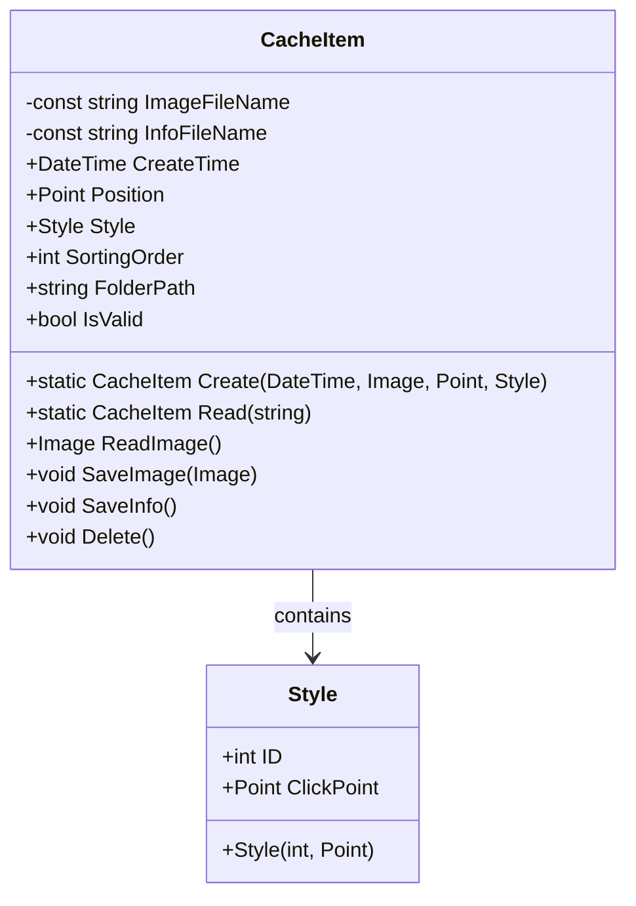
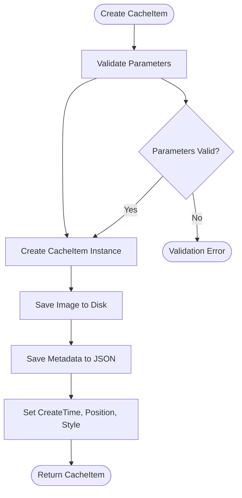
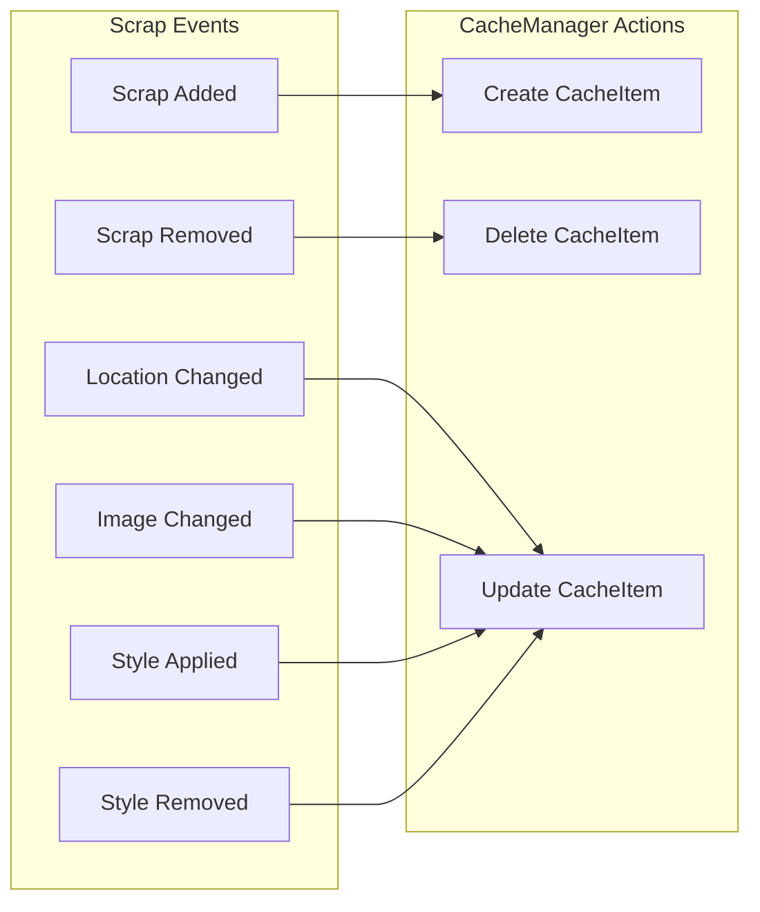
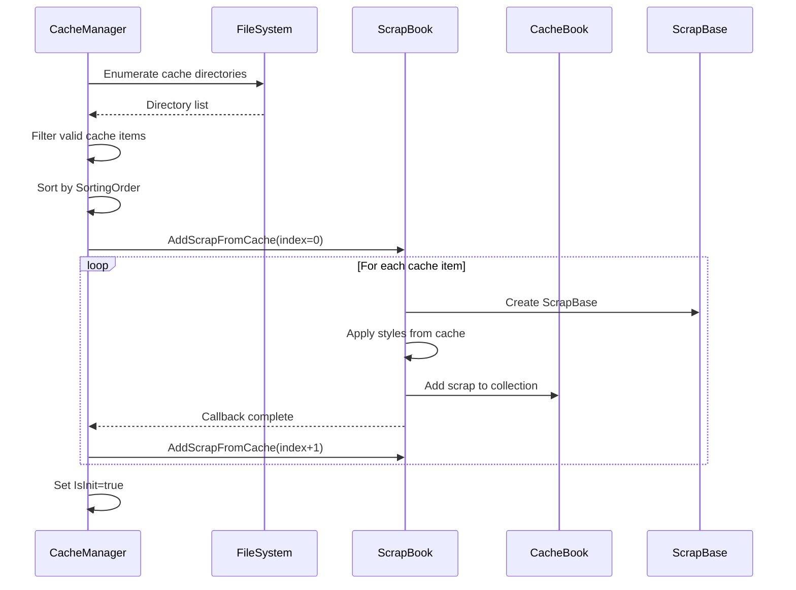
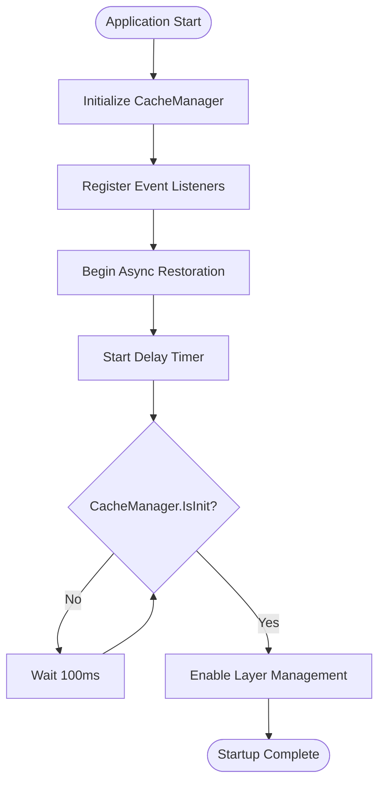
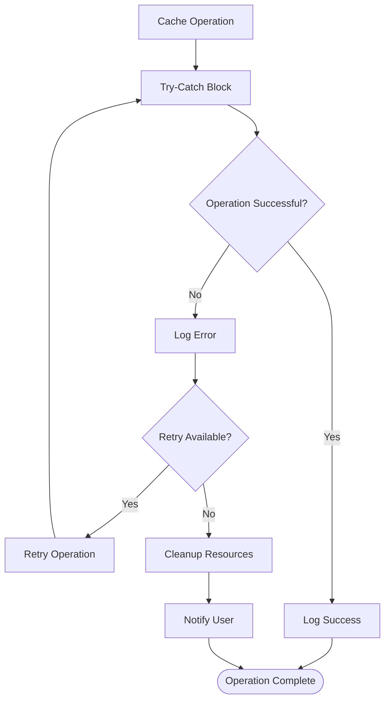
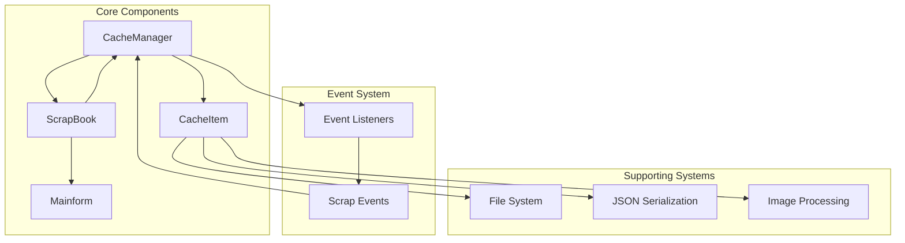

# Cache Architecture

<cite>
**Referenced Files in This Document**
- [CacheManager.cs](file://SETUNA/Main/Cache/CacheManager.cs)
- [CacheItem.cs](file://SETUNA/Main/Cache/CacheItem.cs)
- [ScrapBook.cs](file://SETUNA/Main/ScrapBook.cs)
- [ScrapBase.cs](file://SETUNA/Main/ScrapBase.cs)
- [Mainform.cs](file://SETUNA/Mainform.cs)
- [Program.cs](file://SETUNA/Program.cs)
- [IScrapAddedListener.cs](file://SETUNA/Main/IScrapAddedListener.cs)
- [IScrapRemovedListener.cs](file://SETUNA/Main/IScrapRemovedListener.cs)
- [IScrapLocationChangedListener.cs](file://SETUNA/Main/IScrapLocationChangedListener.cs)
- [IScrapImageChangedListener.cs](file://SETUNA/Main/IScrapImageChangedListener.cs)
- [IScrapStyleAppliedListener.cs](file://SETUNA/Main/IScrapStyleAppliedListener.cs)
- [IScrapStyleRemovedListener.cs](file://SETUNA/Main/IScrapStyleRemovedListener.cs)
</cite>

## Table of Contents
1. [Introduction](#introduction)
2. [System Architecture Overview](#system-architecture-overview)
3. [CacheManager Singleton Pattern](#cachemanager-singleton-pattern)
4. [CacheItem Data Persistence](#cacheitem-data-persistence)
5. [Event Listener Architecture](#event-listener-architecture)
6. [Application Startup and Restoration](#application-startup-and-restoration)
7. [Thread Safety and Error Handling](#thread-safety-and-error-handling)
8. [Performance Implications](#performance-implications)
9. [Component Relationships](#component-relationships)
10. [Conclusion](#conclusion)

## Introduction

The Cache architecture in SETUNA provides a sophisticated system for persisting and restoring screenshot scraps across application sessions. It consists of two primary components: the CacheManager singleton that orchestrates cache operations and the CacheItem class that handles individual scrap data persistence. This architecture ensures seamless user experience by maintaining scrap state, images, and styling information across application restarts while providing robust error handling and performance optimization.

## System Architecture Overview

The cache system follows a layered architecture with clear separation of concerns:

**Diagram sources**
- [CacheManager.cs](file://SETUNA/Main/Cache/CacheManager.cs#L7-L160)
- [CacheItem.cs](file://SETUNA/Main/Cache/CacheItem.cs#L9-L157)
- [ScrapBook.cs](file://SETUNA/Main/ScrapBook.cs#L1-L373)

## CacheManager Singleton Pattern

### Singleton Implementation

The CacheManager implements the classic singleton pattern with thread-safe initialization and global accessibility:

**Diagram sources**
- [CacheManager.cs](file://SETUNA/Main/Cache/CacheManager.cs#L7-L160)
- [IScrapAddedListener.cs](file://SETUNA/Main/IScrapAddedListener.cs#L4-L8)
- [IScrapRemovedListener.cs](file://SETUNA/Main/IScrapRemovedListener.cs#L4-L8)

### Initialization Process

The CacheManager follows a specific initialization sequence during application startup:

**Diagram sources**
- [CacheManager.cs](file://SETUNA/Main/Cache/CacheManager.cs#L17-L25)
- [Mainform.cs](file://SETUNA/Mainform.cs#L23-L40)
- [ScrapBook.cs](file://SETUNA/Main/ScrapBook.cs#L134-L166)

**Section sources**
- [CacheManager.cs](file://SETUNA/Main/Cache/CacheManager.cs#L7-L25)
- [Mainform.cs](file://SETUNA/Mainform.cs#L23-L40)

## CacheItem Data Persistence

### Data Structure and Storage

CacheItem manages individual scrap persistence with a structured approach:

**Diagram sources**
- [CacheItem.cs](file://SETUNA/Main/Cache/CacheItem.cs#L9-L157)

### Storage Format

Each CacheItem creates a dedicated directory structure:

| Component | Purpose | File Format |
|-----------|---------|-------------|
| **Directory** | `{LocalAppData}/SETUNA/{DateTime}` | Folder structure |
| **Image File** | PNG representation of scrap content | `Image.png` |
| **Metadata File** | JSON containing position, style, and ordering | `Info.json` |

### Creation and Validation

The CacheItem creation process ensures data integrity and proper storage:

**Diagram sources**
- [CacheItem.cs](file://SETUNA/Main/Cache/CacheItem.cs#L43-L56)

**Section sources**
- [CacheItem.cs](file://SETUNA/Main/Cache/CacheItem.cs#L9-L157)

## Event Listener Architecture

### Scrap Lifecycle Events

CacheManager implements multiple event listener interfaces to track scrap modifications:

**Diagram sources**
- [CacheManager.cs](file://SETUNA/Main/Cache/CacheManager.cs#L74-L158)

### Event Handling Implementation

Each event type triggers specific cache operations:

| Event Type | Trigger Condition | Cache Operation |
|------------|-------------------|-----------------|
| **ScrapAdded** | New scrap created | Create CacheItem, bind to scrap |
| **ScrapRemoved** | Scrap deleted | Unbind from scrap, delete cache |
| **ScrapLocationChanged** | Scrap moved | Update position in cache |
| **ScrapImageChanged** | Scrap content modified | Update image in cache |
| **ScrapStyleApplied** | Style applied | Update style metadata |
| **ScrapStyleRemoved** | Style removed | Clear style metadata |

**Section sources**
- [CacheManager.cs](file://SETUNA/Main/Cache/CacheManager.cs#L74-L158)

## Application Startup and Restoration

### Asynchronous Restoration Process

The cache restoration follows a carefully orchestrated asynchronous pattern:

**Diagram sources**
- [CacheManager.cs](file://SETUNA/Main/Cache/CacheManager.cs#L31-L71)
- [ScrapBook.cs](file://SETUNA/Main/ScrapBook.cs#L134-L166)

### Startup Synchronization

The application uses a timer-based synchronization mechanism to ensure cache restoration completes before layer management initialization:

**Diagram sources**
- [Mainform.cs](file://SETUNA/Mainform.cs#L936-L943)

**Section sources**
- [CacheManager.cs](file://SETUNA/Main/Cache/CacheManager.cs#L31-L71)
- [Mainform.cs](file://SETUNA/Mainform.cs#L936-L943)

## Thread Safety and Error Handling

### Thread Safety Considerations

The cache system implements several thread safety mechanisms:

1. **Singleton Pattern**: CacheManager uses a static readonly instance ensuring thread-safe access
2. **Sequential Restoration**: Cache restoration occurs in a single-threaded sequence to prevent conflicts
3. **File System Operations**: Individual cache operations are atomic and self-contained

### Error Handling Strategies

The system employs multiple error handling approaches:

### Performance Error Handling

Critical operations implement graceful degradation:

- **Invalid Cache Items**: Skipped during restoration with logging
- **File Access Errors**: Handled with fallback mechanisms
- **Memory Constraints**: Managed through lazy loading patterns

**Section sources**
- [CacheManager.cs](file://SETUNA/Main/Cache/CacheManager.cs#L31-L71)
- [CacheItem.cs](file://SETUNA/Main/Cache/CacheItem.cs#L59-L71)

## Performance Implications

### Sequential Restoration Impact

The current implementation uses sequential restoration which has both advantages and disadvantages:

**Advantages:**
- Predictable memory usage patterns
- Simplified error handling
- Consistent user experience

**Disadvantages:**
- Longer startup times with many scraps
- Potential UI blocking during restoration
- Limited parallelism for large datasets

### Performance Optimization Opportunities

Several areas offer potential performance improvements:

| Optimization Area | Current Approach | Recommended Enhancement |
|-------------------|------------------|------------------------|
| **Parallel Restoration** | Sequential processing | Parallel cache item loading |
| **Lazy Loading** | Load all at startup | Load on demand |
| **Batch Operations** | Individual file writes | Batch metadata updates |
| **Memory Management** | Hold all items in memory | Stream-based processing |

### Memory Usage Patterns

The cache system exhibits predictable memory usage:

- **Initialization Phase**: Linear growth proportional to cache size
- **Runtime Phase**: Minimal memory overhead after restoration
- **Cleanup Phase**: Automatic garbage collection of unused items

## Component Relationships

### Dependency Graph

The cache components form a tightly integrated dependency network:

**Diagram sources**
- [CacheManager.cs](file://SETUNA/Main/Cache/CacheManager.cs#L7-L160)
- [ScrapBook.cs](file://SETUNA/Main/ScrapBook.cs#L1-L373)
- [Mainform.cs](file://SETUNA/Mainform.cs#L23-L40)

### Interaction Patterns

The components interact through well-defined patterns:

1. **Observer Pattern**: CacheManager observes scrap lifecycle events
2. **Factory Pattern**: CacheItem creation through static factory methods
3. **Strategy Pattern**: Different serialization strategies for various data types
4. **Template Method**: Standardized cache operation templates

**Section sources**
- [CacheManager.cs](file://SETUNA/Main/Cache/CacheManager.cs#L7-L160)
- [ScrapBook.cs](file://SETUNA/Main/ScrapBook.cs#L134-L166)

## Conclusion

The Cache architecture in SETUNA demonstrates a well-designed system for persistent scrap management. The singleton CacheManager effectively orchestrates cache operations while maintaining thread safety through careful design patterns. The CacheItem class provides robust data persistence with clear separation of concerns between metadata and binary content.

The asynchronous restoration process ensures reliable startup behavior, though sequential processing presents opportunities for performance optimization. The event-driven architecture enables responsive cache updates while maintaining data consistency.

Key strengths of this architecture include:
- **Robust Error Handling**: Graceful degradation and logging
- **Clear Separation of Concerns**: Distinct responsibilities for each component
- **Thread-Safe Design**: Proper synchronization mechanisms
- **Extensible Architecture**: Well-defined interfaces for future enhancements

Future enhancements could focus on parallel processing capabilities and lazy loading mechanisms to improve performance with large cache datasets while maintaining the system's reliability and user experience quality.