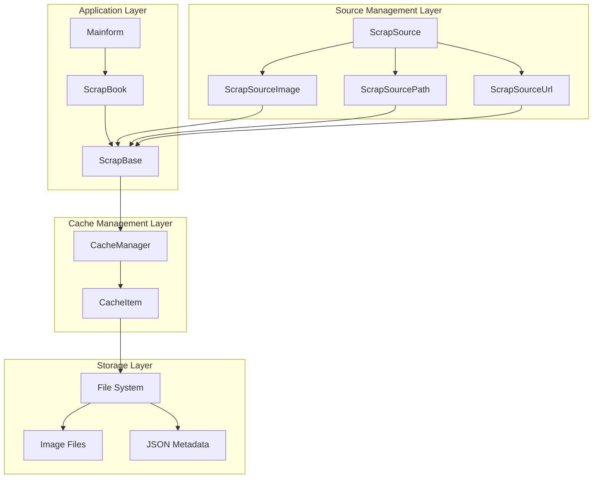
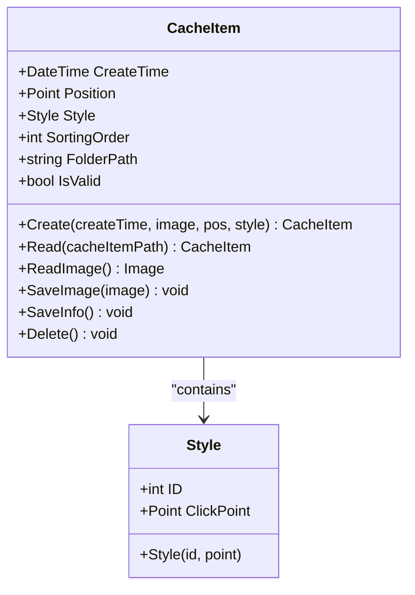
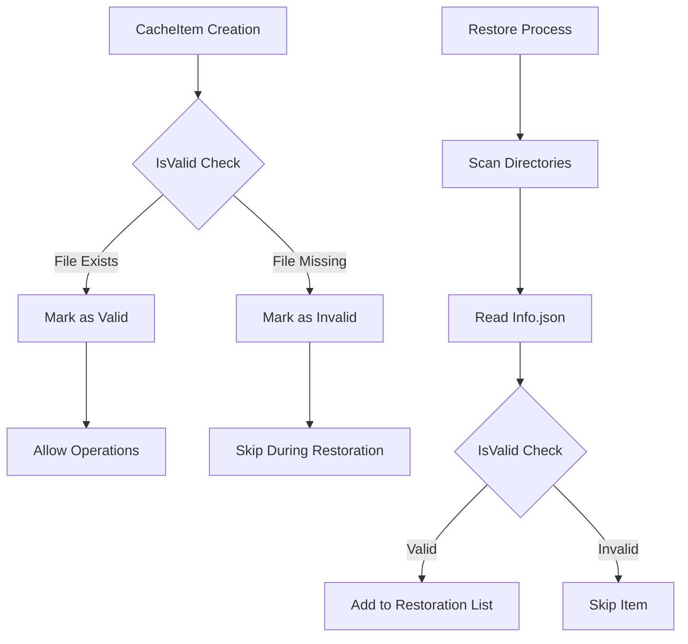
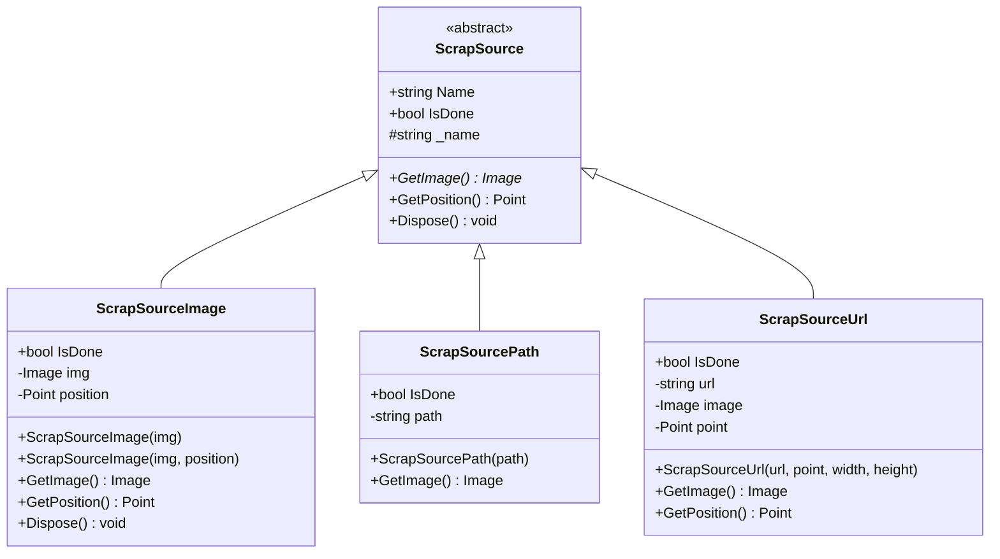
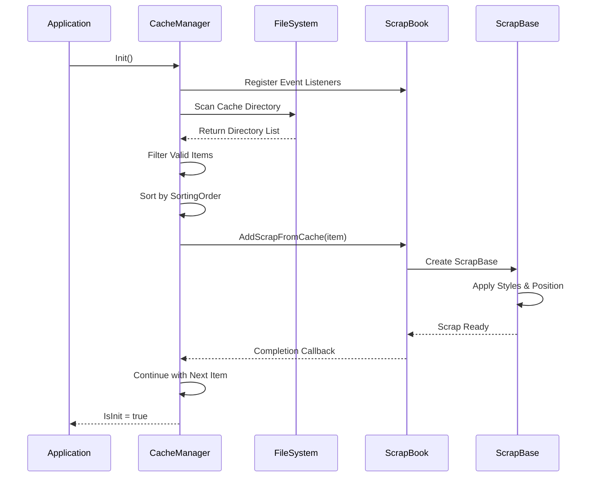
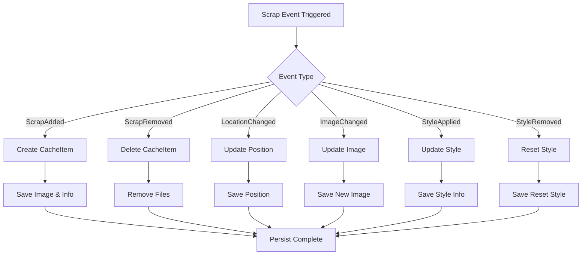
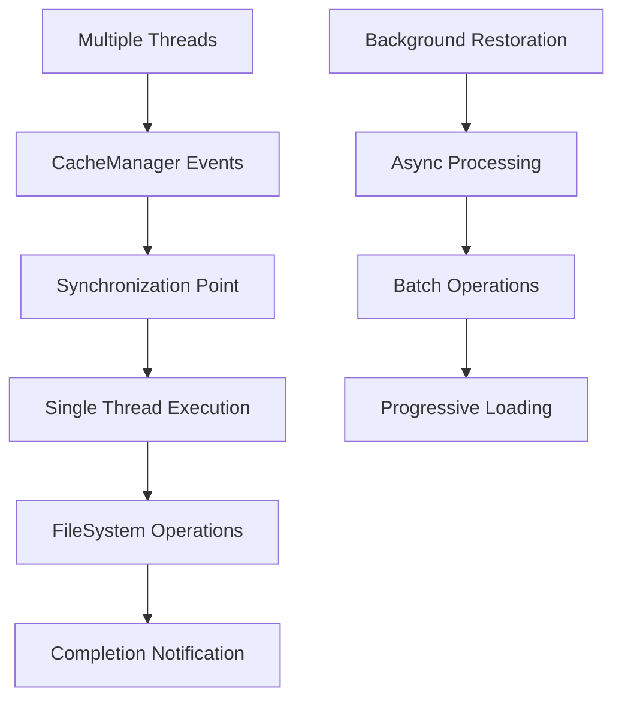
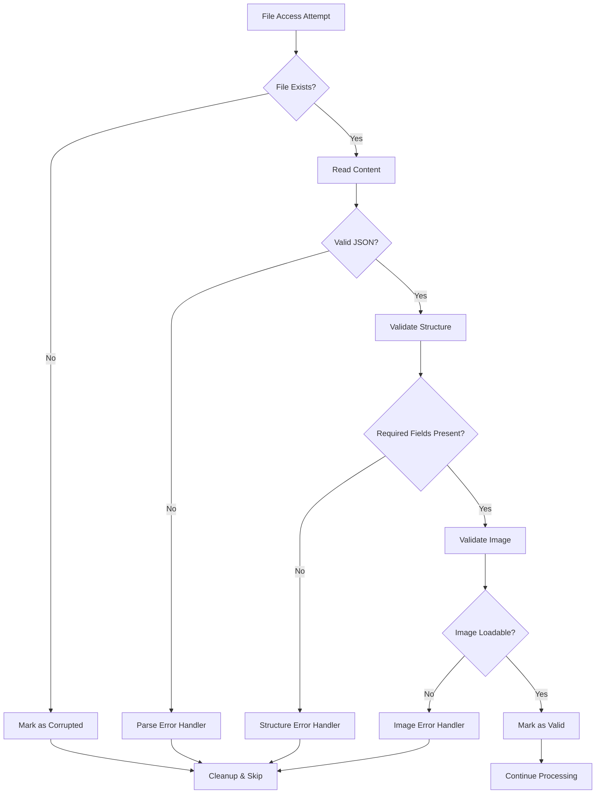
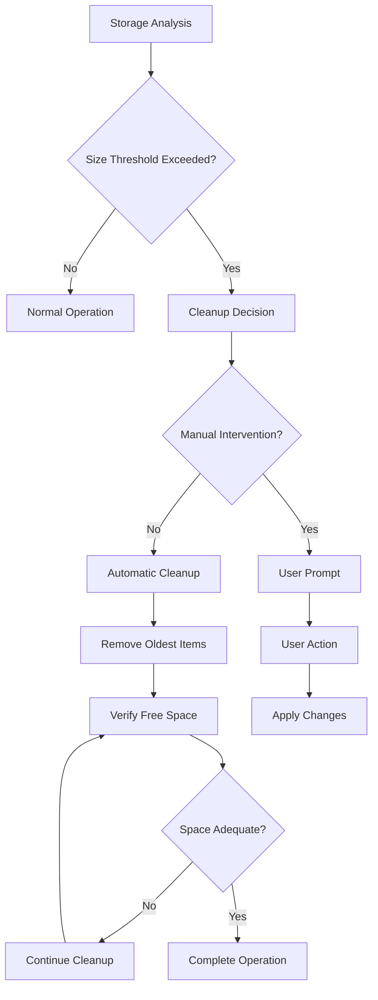

# Cache and Persistence System Documentation

<cite>
**Referenced Files in This Document**
- [CacheManager.cs](file://SETUNA/Main/Cache/CacheManager.cs)
- [CacheItem.cs](file://SETUNA/Main/Cache/CacheItem.cs)
- [ScrapSource.cs](file://SETUNA/Main/ScrapSource.cs)
- [ScrapSourceImage.cs](file://SETUNA/Main/ScrapSourceImage.cs)
- [ScrapSourcePath.cs](file://SETUNA/Main/ScrapSourcePath.cs)
- [ScrapSourceUrl.cs](file://SETUNA/Main/ScrapSourceUrl.cs)
- [ScrapBase.cs](file://SETUNA/Main/ScrapBase.cs)
- [ScrapBook.cs](file://SETUNA/Main/ScrapBook.cs)
- [Extensions.cs](file://SETUNA/Main/Extensions/Extensions.cs)
- [Utils.cs](file://SETUNA/Main/Common/Utils.cs)
- [Mainform.cs](file://SETUNA/Mainform.cs)
</cite>

## Table of Contents
1. [Introduction](#introduction)
2. [System Architecture](#system-architecture)
3. [Core Data Models](#core-data-models)
4. [Cache Management Lifecycle](#cache-management-lifecycle)
5. [Scrap Source System](#scrap-source-system)
6. [Persistence Schema](#persistence-schema)
7. [Data Access Patterns](#data-access-patterns)
8. [Performance Considerations](#performance-considerations)
9. [Error Handling and Data Integrity](#error-handling-and-data-integrity)
10. [Data Retention Policies](#data-retention-policies)
11. [Troubleshooting Guide](#troubleshooting-guide)

## Introduction

The Screenshot2Doc application implements a sophisticated cache and persistence system designed to maintain scrap data across application sessions. The system ensures that user-created screenshots (scrap items) along with their associated metadata survive application restarts while providing efficient access patterns for large numbers of cached items.

The cache system operates on a listener-based architecture where scrap events trigger automatic persistence operations, maintaining data consistency between memory and disk storage. This design enables seamless restoration of the complete scrap collection upon application startup.

## System Architecture

The cache and persistence system follows a layered architecture with clear separation of concerns:



**Diagram sources**
- [Mainform.cs](file://SETUNA/Mainform.cs#L22-L45)
- [ScrapBook.cs](file://SETUNA/Main/ScrapBook.cs#L9-L370)
- [CacheManager.cs](file://SETUNA/Main/Cache/CacheManager.cs#L7-L160)

**Section sources**
- [Mainform.cs](file://SETUNA/Mainform.cs#L22-L45)
- [ScrapBook.cs](file://SETUNA/Main/ScrapBook.cs#L9-L370)
- [CacheManager.cs](file://SETUNA/Main/Cache/CacheManager.cs#L7-L160)

## Core Data Models

### CacheItem Model

The CacheItem serves as the primary data container for persisted scrap information, encapsulating all necessary metadata and providing serialization capabilities.



**Diagram sources**
- [CacheItem.cs](file://SETUNA/Main/Cache/CacheItem.cs#L10-L157)

#### Key Properties

| Property | Type | Description | Purpose |
|----------|------|-------------|---------|
| CreateTime | DateTime | Timestamp of scrap creation | Used for folder naming and sorting |
| Position | Point | Screen coordinates of scrap | Maintains spatial positioning |
| Style | Style | Applied visual styling information | Preserves appearance customization |
| SortingOrder | int | Numeric sort priority | Enables ordered restoration |
| FolderPath | string | Disk location for cache files | Provides organized storage structure |

#### Validation Mechanism

The system implements a robust validation mechanism to ensure data integrity:



**Diagram sources**
- [CacheItem.cs](file://SETUNA/Main/Cache/CacheItem.cs#L27-L34)
- [CacheManager.cs](file://SETUNA/Main/Cache/CacheManager.cs#L43-L47)

**Section sources**
- [CacheItem.cs](file://SETUNA/Main/Cache/CacheItem.cs#L10-L157)

### ScrapSource Hierarchy

The ScrapSource system maintains image provenance and provides flexible image loading mechanisms:



**Diagram sources**
- [ScrapSource.cs](file://SETUNA/Main/ScrapSource.cs#L7-L34)
- [ScrapSourceImage.cs](file://SETUNA/Main/ScrapSourceImage.cs#L6-L55)
- [ScrapSourcePath.cs](file://SETUNA/Main/ScrapSourcePath.cs#L8-L57)
- [ScrapSourceUrl.cs](file://SETUNA/Main/ScrapSourceUrl.cs#L6-L45)

**Section sources**
- [ScrapSource.cs](file://SETUNA/Main/ScrapSource.cs#L7-L34)
- [ScrapSourceImage.cs](file://SETUNA/Main/ScrapSourceImage.cs#L6-L55)
- [ScrapSourcePath.cs](file://SETUNA/Main/ScrapSourcePath.cs#L8-L57)
- [ScrapSourceUrl.cs](file://SETUNA/Main/ScrapSourceUrl.cs#L6-L45)

## Cache Management Lifecycle

### Initialization and Restoration Process

The cache restoration process follows a structured initialization sequence:



**Diagram sources**
- [CacheManager.cs](file://SETUNA/Main/Cache/CacheManager.cs#L17-L71)
- [ScrapBook.cs](file://SETUNA/Main/ScrapBook.cs#L133-L191)

### Event-Driven Persistence

The system employs a listener pattern for automatic cache updates:



**Diagram sources**
- [CacheManager.cs](file://SETUNA/Main/Cache/CacheManager.cs#L74-L158)

**Section sources**
- [CacheManager.cs](file://SETUNA/Main/Cache/CacheManager.cs#L17-L71)
- [CacheManager.cs](file://SETUNA/Main/Cache/CacheManager.cs#L74-L158)

## Persistence Schema

### Directory Structure

The cache system organizes data in a hierarchical directory structure:

```
%LocalAppData%/SETUNA/
├── 2024-01-15 10-30-45-123/
│   ├── Image.png          # PNG-encoded screenshot
│   └── Info.json          # JSON metadata
├── 2024-01-15 10-35-22-456/
│   ├── Image.png
│   └── Info.json
└── ...
```

### JSON Schema Structure

Each cache item maintains metadata in a standardized JSON format:

```json
{
  "CreateTime": "2024-01-15T10:30:45.1234567",
  "Position": {
    "X": 1920,
    "Y": 1080
  },
  "Style": {
    "ID": 123,
    "ClickPoint": {
      "X": 50,
      "Y": 50
    }
  },
  "SortingOrder": 1
}
```

### File Naming Conventions

| File Type | Pattern | Purpose |
|-----------|---------|---------|
| Image File | `Image.png` | Compressed PNG representation |
| Metadata File | `Info.json` | Structured metadata storage |
| Temporary Files | `TEMP_timestamp_hash.png` | Download temporary storage |

**Section sources**
- [CacheItem.cs](file://SETUNA/Main/Cache/CacheItem.cs#L11-L12)
- [CacheItem.cs](file://SETUNA/Main/Cache/CacheItem.cs#L123-L131)

## Data Access Patterns

### Concurrent Access Handling

The system implements thread-safe access patterns for cache operations:



### Memory Management Strategies

The system employs several strategies to manage memory efficiently:

1. **Lazy Loading**: Images are loaded only when needed
2. **Resource Disposal**: Automatic cleanup of cached resources
3. **Garbage Collection**: Strategic triggering after large operations
4. **Memory Monitoring**: Tracking of resource usage patterns

**Section sources**
- [CacheManager.cs](file://SETUNA/Main/Cache/CacheManager.cs#L56-L71)
- [ScrapBook.cs](file://SETUNA/Main/ScrapBook.cs#L133-L191)

## Performance Considerations

### Large Dataset Optimization

For applications handling numerous cached scraps, the system implements several optimization strategies:

#### Indexing and Sorting
- **SortingOrder Field**: Enables efficient chronological ordering
- **Directory Enumeration**: Optimized scanning of cache directories
- **Batch Processing**: Grouped operations reduce I/O overhead

#### Memory Efficiency
- **Streaming Operations**: Large images processed in chunks
- **Selective Loading**: Only required data loaded into memory
- **Resource Pooling**: Reuse of expensive objects

#### I/O Optimization
- **Asynchronous Operations**: Non-blocking file system access
- **Buffer Management**: Optimized read/write buffers
- **Compression**: PNG format reduces storage requirements

### Performance Metrics

| Operation | Typical Time | Optimization Strategy |
|-----------|--------------|----------------------|
| Cache Restoration | 100-500ms per item | Async batch processing |
| Image Loading | 10-50ms per image | Lazy loading with caching |
| Metadata Access | 1-5ms per item | JSON deserialization caching |
| Directory Scanning | 50-200ms total | Efficient enumeration |

**Section sources**
- [CacheManager.cs](file://SETUNA/Main/Cache/CacheManager.cs#L39-L50)
- [CacheItem.cs](file://SETUNA/Main/Cache/CacheItem.cs#L74-L111)

## Error Handling and Data Integrity

### Corruption Detection

The system implements multiple layers of corruption detection:



**Diagram sources**
- [CacheItem.cs](file://SETUNA/Main/Cache/CacheItem.cs#L27-L34)
- [CacheManager.cs](file://SETUNA/Main/Cache/CacheManager.cs#L43-L47)

### Error Recovery Mechanisms

#### Automatic Cleanup
- **Orphaned Files**: Detected and removed during restoration
- **Incomplete Downloads**: Temporary files cleaned up automatically
- **Corrupted Metadata**: Invalid entries excluded from processing

#### Graceful Degradation
- **Partial Restoration**: Successful items restored even with failures
- **Fallback Loading**: Alternative loading strategies for problematic files
- **User Notification**: Clear indication of recovery attempts

### Data Integrity Measures

| Protection Level | Implementation | Purpose |
|------------------|----------------|---------|
| Structural Validation | JSON schema checking | Ensures proper format |
| Content Verification | Image format validation | Confirms data integrity |
| Reference Checking | Cross-referencing files | Validates relationships |
| Transaction Safety | Atomic operations | Prevents partial writes |

**Section sources**
- [CacheManager.cs](file://SETUNA/Main/Cache/CacheManager.cs#L43-L47)
- [CacheItem.cs](file://SETUNA/Main/Cache/CacheItem.cs#L60-L71)
- [Utils.cs](file://SETUNA/Main/Common/Utils.cs#L115-L143)

## Data Retention Policies

### Storage Management

The system implements configurable retention policies:

#### Automatic Cleanup
- **Temporary Files**: Removed after successful download completion
- **Orphaned Directories**: Cleaned during startup scans
- **Empty Directories**: Automatically deleted post-cleanup

#### Manual Management
- **User-Controlled**: Options for manual cache clearing
- **Size Monitoring**: Alerts for excessive storage usage
- **Age-Based Cleanup**: Configurable retention periods

### Storage Optimization



**Section sources**
- [Utils.cs](file://SETUNA/Main/Common/Utils.cs#L115-L143)
- [CacheManager.cs](file://SETUNA/Main/Cache/CacheManager.cs#L33-L37)

## Troubleshooting Guide

### Common Issues and Solutions

#### Cache Restoration Failures

**Symptom**: Scraps not appearing after restart
**Diagnosis Steps**:
1. Verify cache directory exists: `%LocalAppData%\SETUNA\`
2. Check for corrupted JSON files
3. Validate image file integrity
4. Review application logs for errors

**Resolution**:
- Delete corrupted cache items manually
- Restart application to rebuild cache
- Check disk space availability

#### Performance Issues

**Symptom**: Slow startup with many cached scraps
**Optimization Strategies**:
- Reduce number of cached items
- Enable async loading options
- Increase available system memory
- Optimize disk I/O performance

#### Memory Leaks

**Symptom**: Increasing memory usage over time
**Investigation**:
- Monitor cache item count
- Check for undisposed image resources
- Verify proper event listener cleanup
- Analyze garbage collection patterns

### Diagnostic Tools

#### Cache Directory Analysis
```bash
# Check cache directory structure
dir "%LocalAppData%\SETUNA\" /s

# Count cache items
findstr /c:"CreateTime" "%LocalAppData%\SETUNA\*\Info.json" | wc -l
```

#### Log Analysis
Monitor application logs for cache-related errors and warnings during startup and operation.

**Section sources**
- [CacheManager.cs](file://SETUNA/Main/Cache/CacheManager.cs#L33-L37)
- [CacheItem.cs](file://SETUNA/Main/Cache/CacheItem.cs#L60-L71)

## Conclusion

The Screenshot2Doc cache and persistence system provides a robust foundation for maintaining scrap data across application sessions. Through careful design of data models, efficient access patterns, and comprehensive error handling, the system ensures reliable operation even under challenging conditions.

Key strengths of the implementation include:
- **Event-driven architecture** enabling automatic persistence
- **Robust validation mechanisms** ensuring data integrity
- **Performance optimization** for large-scale operations
- **Flexible source management** supporting various image origins
- **Comprehensive error handling** with graceful degradation

The system's modular design facilitates future enhancements while maintaining backward compatibility and operational stability.