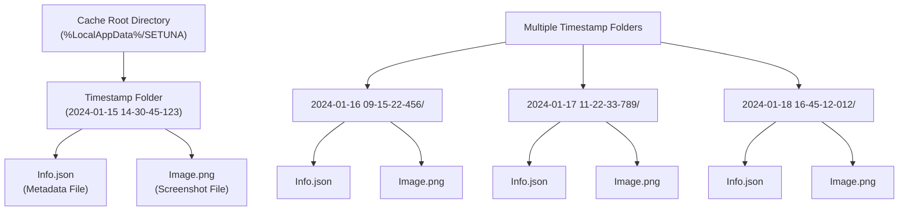
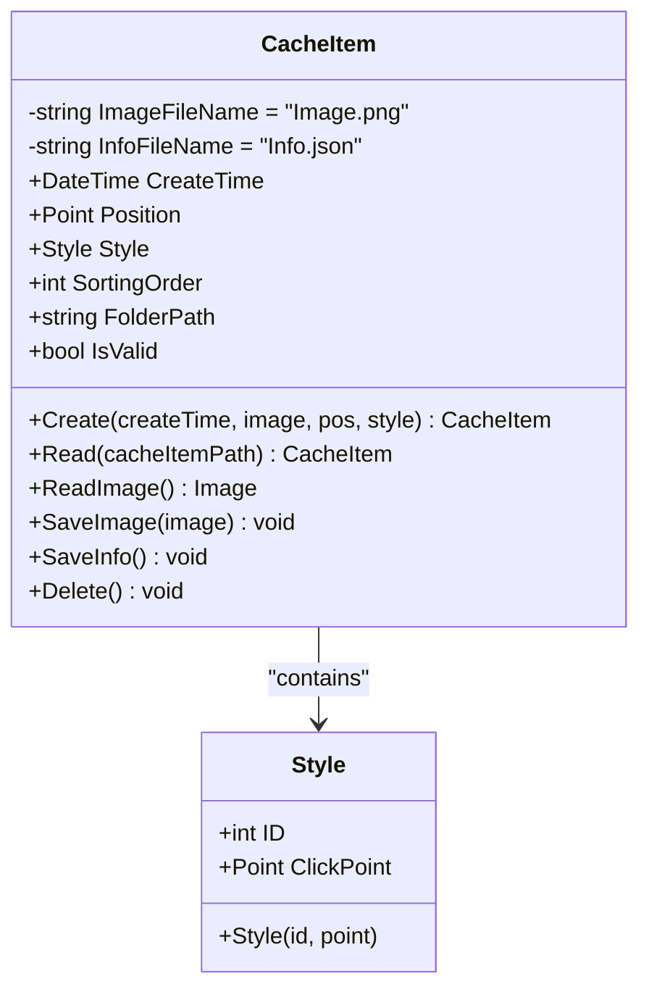
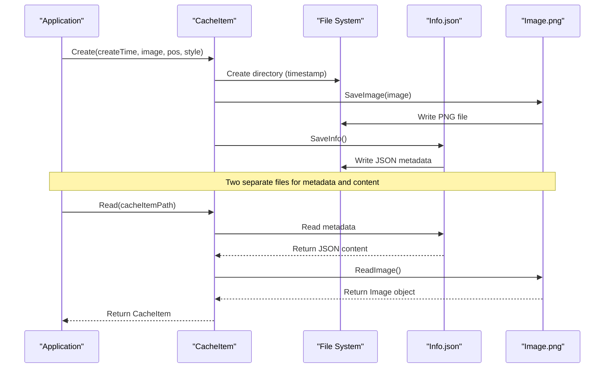
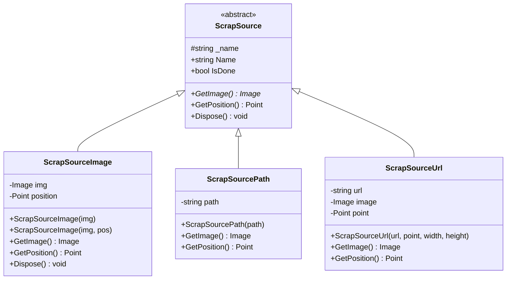
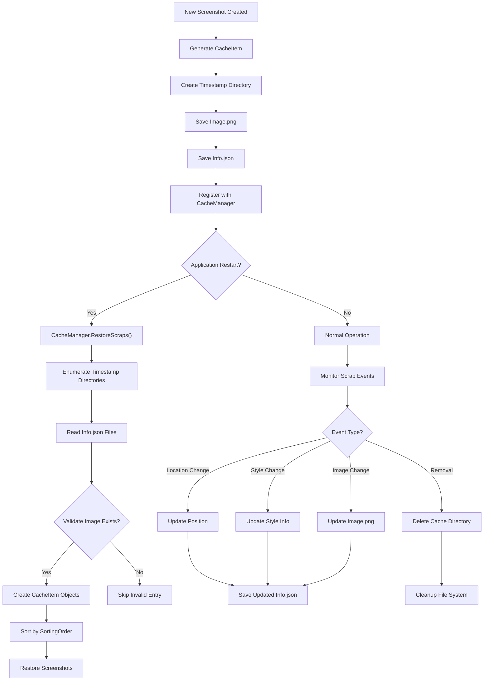

# Data Storage Format

<cite>
**Referenced Files in This Document**
- [CacheItem.cs](file://SETUNA/Main/Cache/CacheItem.cs)
- [CacheManager.cs](file://SETUNA/Main/Cache/CacheManager.cs)
- [ScrapSource.cs](file://SETUNA/Main/ScrapSource.cs)
- [ScrapSourceImage.cs](file://SETUNA/Main/ScrapSourceImage.cs)
- [ScrapSourcePath.cs](file://SETUNA/Main/ScrapSourcePath.cs)
- [ScrapSourceUrl.cs](file://SETUNA/Main/ScrapSourceUrl.cs)
- [Extensions.cs](file://SETUNA/Main/Extensions/Extensions.cs)
- [Utils.cs](file://SETUNA/Main/Common/Utils.cs)
- [ScrapBase.cs](file://SETUNA/Main/ScrapBase.cs)
- [ScrapBook.cs](file://SETUNA/Main/ScrapBook.cs)
</cite>

## Table of Contents
1. [Introduction](#introduction)
2. [Cache Directory Structure](#cache-directory-structure)
3. [CacheItem Data Model](#cacheitem-data-model)
4. [Two-File Persistence Mechanism](#two-file-persistence-mechanism)
5. [JSON Schema Definition](#json-schema-definition)
6. [ScrapSource Architecture](#scrapsource-architecture)
7. [File System Layout Examples](#file-system-layout-examples)
8. [Data Flow and Operations](#data-flow-and-operations)
9. [Future Extensibility](#future-extensibility)
10. [Best Practices](#best-practices)

## Introduction

The SETUNA screenshot application implements a sophisticated caching system that persists screenshot data across application sessions. The cache storage format is designed around a hierarchical directory structure organized by creation timestamps, utilizing a two-file persistence mechanism for optimal data separation and retrieval efficiency.

This documentation provides comprehensive coverage of the CacheItem data storage format, including the directory organization strategy, JSON metadata structure, image file storage, and the extensible ScrapSource architecture that maintains image provenance information.

## Cache Directory Structure

The cache system organizes screenshot data in a time-based directory hierarchy that enables efficient browsing and management of cached content.



**Diagram sources**
- [CacheManager.cs](file://SETUNA/Main/Cache/CacheManager.cs#L9)
- [CacheItem.cs](file://SETUNA/Main/Cache/CacheItem.cs#L24)

### Directory Naming Convention

The cache directory structure follows a strict timestamp-based naming convention using the `ToCustomString()` extension method, which formats DateTime values as:

```
yyyy-MM-dd HH-mm-ss-ff
```

Where:
- `yyyy`: Four-digit year
- `MM`: Two-digit month (01-12)
- `dd`: Two-digit day (01-31)
- `HH`: Two-digit hour (00-23)
- `mm`: Two-digit minutes (00-59)
- `ss`: Two-digit seconds (00-59)
- `ff`: Two-digit milliseconds (00-99)

**Section sources**
- [Extensions.cs](file://SETUNA/Main/Extensions/Extensions.cs#L6-L10)
- [CacheItem.cs](file://SETUNA/Main/Cache/CacheItem.cs#L24)

## CacheItem Data Model

The CacheItem class serves as the primary data container for cached screenshot information, encapsulating both metadata and image data while maintaining referential integrity.



**Diagram sources**
- [CacheItem.cs](file://SETUNA/Main/Cache/CacheItem.cs#L10-L157)

### Core Properties

| Property | Type | Description | Constraints |
|----------|------|-------------|-------------|
| `CreateTime` | DateTime | Original creation timestamp | Required, determines directory location |
| `Position` | Point | Screen coordinates (X, Y) | Required, specifies window position |
| `Style` | Style | Applied visual styling information | Required, contains ID and click point |
| `SortingOrder` | int | Numeric sort priority | Required, affects display order |

### Derived Properties

| Property | Type | Description | Calculation Method |
|----------|------|-------------|-------------------|
| `FolderPath` | string | Complete directory path | `{CacheManager.Path}/{CreateTime.ToCustomString()}` |
| `IsValid` | bool | Validation status indicator | Checks existence of Image.png file |

**Section sources**
- [CacheItem.cs](file://SETUNA/Main/Cache/CacheItem.cs#L15-L35)

## Two-File Persistence Mechanism

The cache system employs a dual-file architecture that separates metadata from binary content, optimizing both storage efficiency and data integrity.



**Diagram sources**
- [CacheItem.cs](file://SETUNA/Main/Cache/CacheItem.cs#L42-L56)
- [CacheItem.cs](file://SETUNA/Main/Cache/CacheItem.cs#L74-L86)

### File Responsibilities

#### Info.json - Metadata Container
Stores structured metadata using Newtonsoft.Json serialization with the following schema:

```json
{
  "CreateTime": "2024-01-15T14:30:45.1234567",
  "Position": {
    "X": 100,
    "Y": 200
  },
  "Style": {
    "ID": 1,
    "ClickPoint": {
      "X": 50,
      "Y": 30
    }
  },
  "SortingOrder": 1
}
```

#### Image.png - Binary Content Store
Contains the actual screenshot image as a PNG file with lossless compression, ensuring optimal quality preservation for various content types including text, graphics, and photographs.

**Section sources**
- [CacheItem.cs](file://SETUNA/Main/Cache/CacheItem.cs#L11-L12)
- [CacheItem.cs](file://SETUNA/Main/Cache/CacheItem.cs#L113-L131)

## JSON Schema Definition

The Info.json file follows a well-defined schema that ensures consistent data representation and facilitates future extensions.

### Complete Schema Specification

```json
{
  "$schema": "http://json-schema.org/draft-07/schema#",
  "title": "CacheItem Metadata",
  "type": "object",
  "required": ["CreateTime", "Position", "Style", "SortingOrder"],
  "properties": {
    "CreateTime": {
      "type": "string",
      "format": "date-time",
      "description": "UTC timestamp of cache creation"
    },
    "Position": {
      "type": "object",
      "required": ["X", "Y"],
      "properties": {
        "X": {
          "type": "integer",
          "minimum": -32768,
          "maximum": 32767,
          "description": "Horizontal screen coordinate"
        },
        "Y": {
          "type": "integer",
          "minimum": -32768,
          "maximum": 32767,
          "description": "Vertical screen coordinate"
        }
      }
    },
    "Style": {
      "type": "object",
      "required": ["ID", "ClickPoint"],
      "properties": {
        "ID": {
          "type": "integer",
          "minimum": 0,
          "description": "Style identifier from style collection"
        },
        "ClickPoint": {
          "type": "object",
          "required": ["X", "Y"],
          "properties": {
            "X": {
              "type": "integer",
              "minimum": 0,
              "description": "Relative horizontal position within styled element"
            },
            "Y": {
              "type": "integer",
              "minimum": 0,
              "description": "Relative vertical position within styled element"
            }
          }
        }
      }
    },
    "SortingOrder": {
      "type": "integer",
      "description": "Numeric priority for display ordering"
    }
  }
}
```

### Field Type Specifications

| Field | Type | Range/Format | Description |
|-------|------|--------------|-------------|
| `CreateTime` | string | ISO 8601 datetime | UTC timestamp with millisecond precision |
| `Position.X` | integer | -32768 to 32767 | Screen X coordinate |
| `Position.Y` | integer | -32768 to 32767 | Screen Y coordinate |
| `Style.ID` | integer | 0+ | Style template identifier |
| `Style.ClickPoint.X` | integer | 0+ | Relative X within styled element |
| `Style.ClickPoint.Y` | integer | 0+ | Relative Y within styled element |
| `SortingOrder` | integer | 0+ | Display priority value |

**Section sources**
- [CacheItem.cs](file://SETUNA/Main/Cache/CacheItem.cs#L123-L129)

## ScrapSource Architecture

The ScrapSource class hierarchy provides extensible provenance tracking for different image sources, enabling the system to maintain origin information for various capture methods.



**Diagram sources**
- [ScrapSource.cs](file://SETUNA/Main/ScrapSource.cs#L7-L34)
- [ScrapSourceImage.cs](file://SETUNA/Main/ScrapSourceImage.cs#L6-L55)
- [ScrapSourcePath.cs](file://SETUNA/Main/ScrapSourcePath.cs#L8-L57)
- [ScrapSourceUrl.cs](file://SETUNA/Main/ScrapSourceUrl.cs#L6-L45)

### Source Type Implementations

#### ScrapSourceImage
Direct image capture from memory-based image objects:

```csharp
// Constructor variants
public ScrapSourceImage(Image img)
public ScrapSourceImage(Image img, Point position)
```

Features:
- Clones input images to prevent external modifications
- Supports explicit positioning specification
- Automatic resource cleanup through Dispose()

#### ScrapSourcePath
File-based image loading with format detection:

```csharp
public ScrapSourcePath(string path)
```

Supported formats include:
- PNG, JPEG, WEBP, GIF, BMP
- SVG vector graphics
- PSD Photoshop files
- ICO icon files
- TGA texture files

#### ScrapSourceUrl
Network-based image acquisition with asynchronous processing:

```csharp
public ScrapSourceUrl(string url, Point point, int width = 0, int height = 0)
```

Capabilities:
- Asynchronous download with progress tracking
- Automatic format conversion and scaling
- Temporary file management
- Error handling for network failures

**Section sources**
- [ScrapSourceImage.cs](file://SETUNA/Main/ScrapSourceImage.cs#L12-L23)
- [ScrapSourcePath.cs](file://SETUNA/Main/ScrapSourcePath.cs#L14-L17)
- [ScrapSourceUrl.cs](file://SETUNA/Main/ScrapSourceUrl.cs#L9-L23)

## File System Layout Examples

### Example 1: Basic Screenshot Cache

```
%LocalAppData%/SETUNA/
├── 2024-01-15 14-30-45-123/
│   ├── Info.json
│   └── Image.png
├── 2024-01-15 14-31-15-456/
│   ├── Info.json
│   └── Image.png
└── 2024-01-15 14-32-22-789/
    ├── Info.json
    └── Image.png
```

### Example 2: Styled Screenshot with Provenance

```
%LocalAppData%/SETUNA/
└── 2024-01-16 09-15-22-456/
    ├── Info.json
    └── Image.png
```

**Info.json Content:**
```json
{
  "CreateTime": "2024-01-16T09:15:22.4567890",
  "Position": {
    "X": 100,
    "Y": 200
  },
  "Style": {
    "ID": 5,
    "ClickPoint": {
      "X": 25,
      "Y": 15
    }
  },
  "SortingOrder": 3
}
```

### Example 3: Network-Downloaded Image

```
%LocalAppData%/SETUNA/
└── 2024-01-17 11-22-33-789/
    ├── Info.json
    └── Image.png
```

**Info.json Content:**
```json
{
  "CreateTime": "2024-01-17T11:22:33.7890123",
  "Position": {
    "X": 300,
    "Y": 400
  },
  "Style": {
    "ID": 0,
    "ClickPoint": {
      "X": 0,
      "Y": 0
    }
  },
  "SortingOrder": 1
}
```

**Section sources**
- [CacheManager.cs](file://SETUNA/Main/Cache/CacheManager.cs#L32-L51)

## Data Flow and Operations

The cache system implements comprehensive lifecycle management for cached items, ensuring data integrity and efficient resource utilization.



**Diagram sources**
- [CacheManager.cs](file://SETUNA/Main/Cache/CacheManager.cs#L17-L71)
- [CacheItem.cs](file://SETUNA/Main/Cache/CacheItem.cs#L42-L56)

### Event-Driven Updates

The CacheManager implements multiple event listeners that automatically update cache entries when associated scrap objects change:

| Event Type | Trigger Condition | Update Action | File Modified |
|------------|-------------------|---------------|---------------|
| Location Changed | Scrap moved on screen | Update Position in Info.json | Info.json |
| Style Applied | Visual style applied | Update Style ID and ClickPoint | Info.json |
| Image Changed | Scrap image updated | Replace Image.png | Image.png |
| Scrap Removed | Scrap deleted | Delete entire cache directory | Both files |

**Section sources**
- [CacheManager.cs](file://SETUNA/Main/Cache/CacheManager.cs#L74-L158)

## Future Extensibility

The cache system architecture is designed with extensibility in mind, allowing for future enhancements while maintaining backward compatibility.

### Current Extensibility Points

#### ScrapSource Derivatives
The abstract ScrapSource base class enables new image source types:

```csharp
public abstract class ScrapSource : IDisposable
{
    public abstract Image GetImage();
    public virtual Point GetPosition() { return Point.Empty; }
    // Additional virtual methods for future expansion
}
```

Potential future implementations:
- Video frame capture
- Clipboard content parsing
- Cloud storage integration
- OCR text extraction

#### CacheItem Enhancements
The CacheItem class provides hooks for additional metadata:

```csharp
// Future property additions
public string SourceUrl { get; set; }    // For web-originated content
public string FileName { get; set; }     // Original file name
public Dictionary<string, object> Tags { get; set; } // User-defined tags
```

#### Serialization Flexibility
Newtonsoft.Json provides robust serialization capabilities that support:
- Versioning through optional properties
- Custom converters for specialized types
- Compression for large metadata payloads

### Migration Strategies

For future schema changes, the system supports gradual migration:

1. **Backward Compatibility**: New fields marked as optional
2. **Schema Validation**: Runtime validation of cache integrity
3. **Automatic Repair**: Fallback mechanisms for corrupted entries
4. **Incremental Updates**: Non-destructive schema evolution

**Section sources**
- [ScrapSource.cs](file://SETUNA/Main/ScrapSource.cs#L7-L34)
- [CacheItem.cs](file://SETUNA/Main/Cache/CacheItem.cs#L123-L129)

## Best Practices

### Performance Optimization

1. **Lazy Loading**: Images loaded only when accessed
2. **Memory Management**: Proper disposal of image resources
3. **Directory Organization**: Efficient timestamp-based indexing
4. **Atomic Operations**: File system operations protected against corruption

### Data Integrity

1. **Validation**: `IsValid` property ensures file existence
2. **Error Handling**: Graceful degradation for missing files
3. **Backup Strategy**: Separate metadata and content files
4. **Cleanup**: Automatic removal of orphaned cache entries

### Scalability Considerations

1. **Storage Limits**: Configurable cache size restrictions
2. **Indexing**: Efficient timestamp-based directory traversal
3. **Concurrent Access**: Thread-safe operations for multi-threaded environments
4. **Resource Cleanup**: Automatic disposal of unused resources

### Security Measures

1. **Path Validation**: Sanitization of file paths
2. **Memory Protection**: Secure handling of sensitive image data
3. **Access Control**: Application-specific cache isolation
4. **Integrity Checking**: Verification of cached content validity

**Section sources**
- [CacheItem.cs](file://SETUNA/Main/Cache/CacheItem.cs#L27-L35)
- [CacheManager.cs](file://SETUNA/Main/Cache/CacheManager.cs#L32-L51)