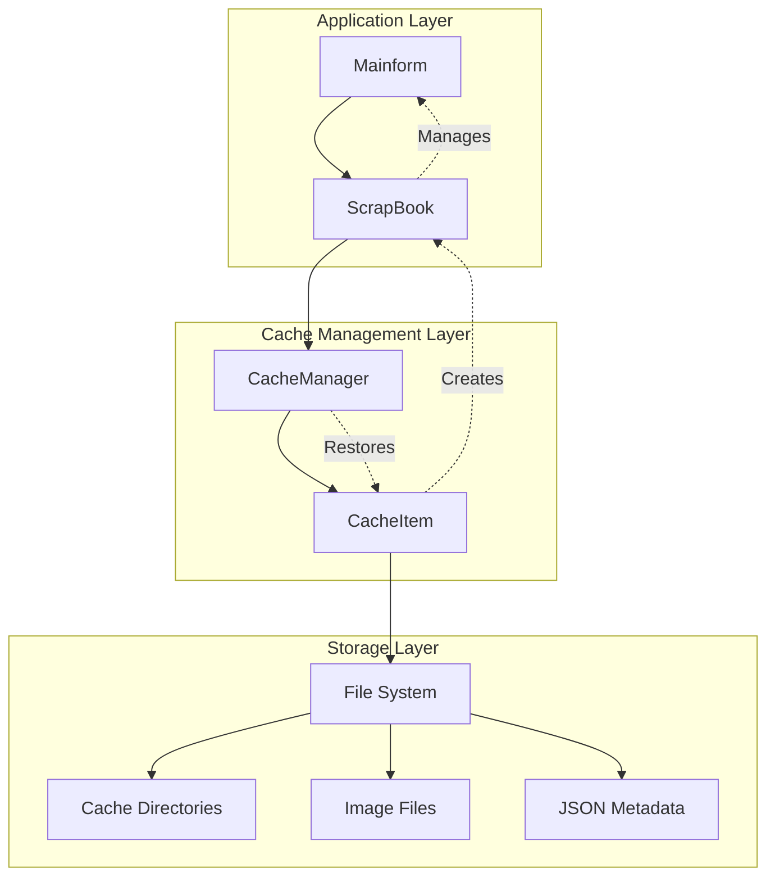
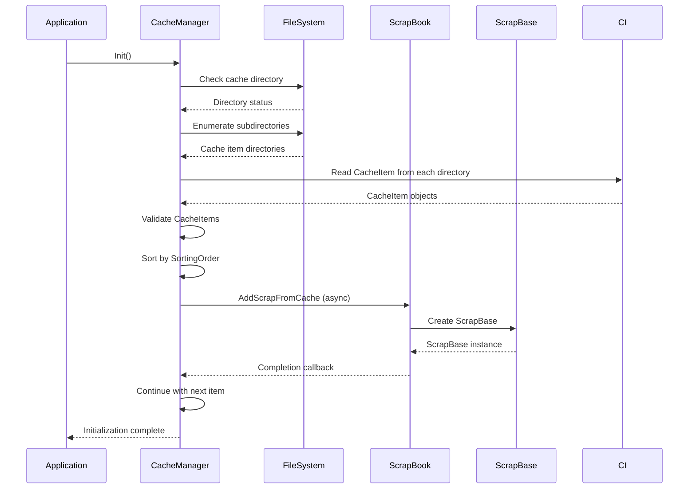
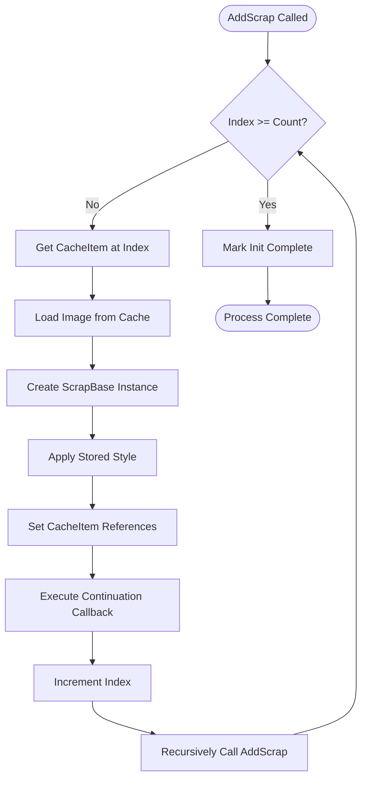
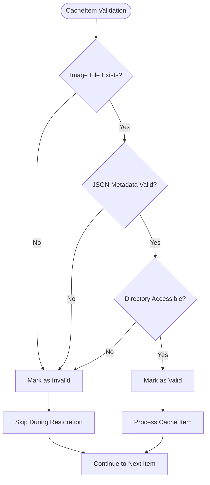
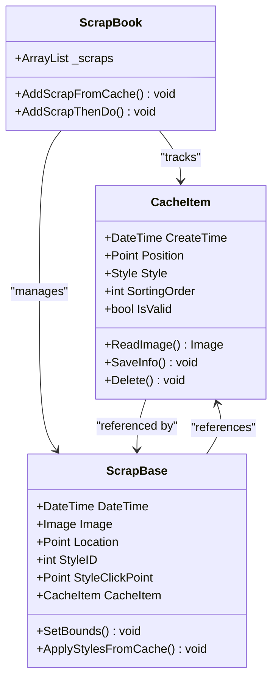

# Restore Mechanism

<cite>
**Referenced Files in This Document**
- [CacheManager.cs](file://SETUNA/Main/Cache/CacheManager.cs)
- [CacheItem.cs](file://SETUNA/Main/Cache/CacheItem.cs)
- [ScrapBook.cs](file://SETUNA/Main/ScrapBook.cs)
- [ScrapBase.cs](file://SETUNA/Main/ScrapBase.cs)
- [Mainform.cs](file://SETUNA/Mainform.cs)
- [Extensions.cs](file://SETUNA/Main/Extensions/Extensions.cs)
- [Utils.cs](file://SETUNA/Main/Common/Utils.cs)
</cite>

## Table of Contents
1. [Introduction](#introduction)
2. [System Architecture](#system-architecture)
3. [Cache Restoration Process](#cache-restoration-process)
4. [Init Method Sequence](#init-method-sequence)
5. [Recursive Loading Mechanism](#recursive-loading-mechanism)
6. [Validation and Error Handling](#validation-and-error-handling)
7. [Integration with Scrap Lifecycle](#integration-with-scrap-lifecycle)
8. [Performance Considerations](#performance-considerations)
9. [Edge Cases and Troubleshooting](#edge-cases-and-troubleshooting)
10. [Optimization Strategies](#optimization-strategies)

## Introduction

The cache restoration mechanism in SETUNA is a sophisticated system designed to persist and restore screenshot scraps across application sessions. This mechanism ensures that users can resume their work seamlessly after restarting the application, maintaining the position, style, and visual state of previously captured screenshots.

The restoration process operates through a multi-layered architecture involving the CacheManager, CacheItem, and ScrapBook components, working together to provide a robust and efficient caching solution that handles various edge cases and performance considerations.

## System Architecture

The cache restoration system follows a layered architecture with clear separation of concerns:

**Diagram sources**
- [CacheManager.cs](file://SETUNA/Main/Cache/CacheManager.cs#L7-L160)
- [ScrapBook.cs](file://SETUNA/Main/ScrapBook.cs#L10-L373)

**Section sources**
- [CacheManager.cs](file://SETUNA/Main/Cache/CacheManager.cs#L7-L160)
- [ScrapBook.cs](file://SETUNA/Main/ScrapBook.cs#L10-L373)

## Cache Restoration Process

The cache restoration process follows a carefully orchestrated sequence that ensures data integrity and optimal performance:

**Diagram sources**
- [CacheManager.cs](file://SETUNA/Main/Cache/CacheManager.cs#L17-L71)
- [ScrapBook.cs](file://SETUNA/Main/ScrapBook.cs#L134-L166)

## Init Method Sequence

The `Init()` method serves as the entry point for the cache restoration process, orchestrating a series of operations that ensure comprehensive cache recovery:

### Step 1: Initialization Setup
The method begins by setting up the cache manager instance and establishing event listeners for scrap lifecycle events. This creates the foundation for monitoring and managing scrap additions and removals.

### Step 2: Directory Creation and Validation
The system checks for the existence of the cache directory and creates it if necessary. This ensures that the cache storage location is always available regardless of previous application state.

### Step 3: Cache Item Discovery
The restoration process enumerates all subdirectories within the cache directory, treating each as a potential cache item. This approach allows for flexible cache organization while maintaining backward compatibility.

### Step 4: Cache Item Reading and Validation
Each discovered directory is processed through the CacheItem.Read() method, which attempts to deserialize JSON metadata and validate the associated image file. Invalid or corrupted entries are automatically filtered out.

### Step 5: Sorting and Preparation
Valid cache items are sorted by their `SortingOrder` property, ensuring that scraps are restored in the intended order. This sorting operation is crucial for maintaining user interface consistency.

### Step 6: Asynchronous Processing
The final step initiates the recursive loading process through the `AddScrap()` method, which prevents UI blocking by processing items asynchronously with continuation callbacks.

**Section sources**
- [CacheManager.cs](file://SETUNA/Main/Cache/CacheManager.cs#L17-L71)

## Recursive Loading Mechanism

The recursive `AddScrap()` method implements a sophisticated asynchronous loading strategy that prevents UI blocking during startup:

**Diagram sources**
- [CacheManager.cs](file://SETUNA/Main/Cache/CacheManager.cs#L57-L70)

### Key Features of the Recursive Approach

1. **Non-blocking UI**: By using continuation callbacks, the method processes cache items one at a time, allowing the UI thread to remain responsive throughout the restoration process.

2. **Progress Tracking**: The recursive nature enables natural progress indication as each item completes loading, providing users with feedback on the restoration status.

3. **Error Isolation**: Individual cache item failures don't affect the overall restoration process, ensuring that valid items are still loaded even if some entries are corrupted.

4. **Memory Efficiency**: Items are processed sequentially rather than all at once, reducing memory pressure during startup.

**Section sources**
- [CacheManager.cs](file://SETUNA/Main/Cache/CacheManager.cs#L57-L70)

## Validation and Error Handling

The cache restoration system implements comprehensive validation mechanisms to handle various edge cases and ensure data integrity:

### CacheItem Validation Process

The `IsValid` property serves as the primary validation mechanism, checking for the presence of essential cache files:

**Diagram sources**
- [CacheItem.cs](file://SETUNA/Main/Cache/CacheItem.cs#L27-L34)

### Edge Case Handling

The system gracefully handles several common edge cases:

1. **Corrupted Cache Directories**: Missing or inaccessible directories are skipped without interrupting the restoration process.

2. **Missing Image Files**: Cache items without associated image files are marked as invalid and excluded from restoration.

3. **Invalid JSON Data**: Malformed or corrupted metadata files trigger automatic exclusion of the affected cache item.

4. **File Access Issues**: Permission problems or locked files are handled gracefully without affecting other cache items.

5. **Incomplete Cache Entries**: Partially written cache files are detected and ignored to prevent data corruption.

**Section sources**
- [CacheItem.cs](file://SETUNA/Main/Cache/CacheItem.cs#L27-L34)
- [CacheManager.cs](file://SETUNA/Main/Cache/CacheManager.cs#L42-L47)

## Integration with Scrap Lifecycle

The cache restoration mechanism integrates seamlessly with the scrap lifecycle, ensuring proper state management and event coordination:

### CacheItem Reference Management

During restoration, the system establishes bidirectional references between cache items and scrap instances:

**Diagram sources**
- [CacheItem.cs](file://SETUNA/Main/Cache/CacheItem.cs#L15-L23)
- [ScrapBase.cs](file://SETUNA/Main/ScrapBase.cs#L15-L200)
- [ScrapBook.cs](file://SETUNA/Main/ScrapBook.cs#L10-L373)

### Event Integration

The cache manager implements multiple scrap event listeners that maintain cache synchronization:

1. **Scrap Added Events**: Automatically create cache entries when new scraps are added
2. **Scrap Removed Events**: Clean up cache entries when scraps are deleted
3. **Location Changed Events**: Update cache metadata when scrap positions change
4. **Image Changed Events**: Refresh cached images when scrap content is modified
5. **Style Applied Events**: Update style information in cache entries

**Section sources**
- [CacheManager.cs](file://SETUNA/Main/Cache/CacheManager.cs#L74-L158)
- [ScrapBook.cs](file://SETUNA/Main/ScrapBook.cs#L134-L166)

## Performance Considerations

The cache restoration mechanism incorporates several performance optimizations to handle large cache sizes efficiently:

### Memory Management Strategies

1. **Lazy Loading**: Images are loaded on-demand rather than preloading all cache items into memory simultaneously.

2. **Sequential Processing**: The recursive loading approach minimizes memory footprint by processing items one at a time.

3. **Resource Disposal**: Proper disposal patterns ensure that image resources are released promptly after use.

### I/O Optimization

1. **Batch Operations**: Related cache operations (metadata and image files) are grouped to minimize file system access.

2. **Efficient Serialization**: JSON serialization is optimized for cache metadata to reduce I/O overhead.

3. **Directory Enumeration**: Efficient directory scanning algorithms minimize filesystem traversal time.

### Scalability Factors

The system is designed to handle varying cache sizes effectively:

- **Small Caches (< 100 items)**: Near-instantaneous restoration with minimal UI impact
- **Medium Caches (100-1000 items)**: Acceptable restoration time with smooth UI progression
- **Large Caches (> 1000 items)**: Extended restoration time with proper progress indication

**Section sources**
- [CacheManager.cs](file://SETUNA/Main/Cache/CacheManager.cs#L57-L70)
- [CacheItem.cs](file://SETUNA/Main/Cache/CacheItem.cs#L74-L132)

## Edge Cases and Troubleshooting

The cache restoration system addresses numerous edge cases that can occur in real-world usage scenarios:

### Common Issues and Solutions

| Issue | Cause | Solution | Prevention |
|-------|-------|----------|------------|
| Missing Image Files | Storage corruption or manual deletion | Skip corrupted entries, restore remaining valid items | Regular backup verification |
| Invalid JSON Metadata | Manual editing or corruption | Automatic validation excludes malformed entries | Read-only cache access |
| Permission Denied | Insufficient file system permissions | Graceful error handling with user notification | Run with appropriate privileges |
| Out of Disk Space | Insufficient storage capacity | Early detection and graceful degradation | Monitor disk space availability |
| Corrupted Cache Directory | Unexpected application termination | Directory recreation with selective restoration | Robust error handling |

### Diagnostic Information

The system provides several diagnostic capabilities for troubleshooting cache issues:

1. **Validation Logging**: Invalid cache items are logged with specific error details
2. **Progress Tracking**: Restoration progress is monitored and reported
3. **Error Isolation**: Individual item failures don't affect overall restoration
4. **Recovery Mechanisms**: Automatic recovery from common failure modes

**Section sources**
- [CacheManager.cs](file://SETUNA/Main/Cache/CacheManager.cs#L42-L47)
- [CacheItem.cs](file://SETUNA/Main/Cache/CacheItem.cs#L61-L71)

## Optimization Strategies

Several optimization strategies can enhance the cache restoration performance and user experience:

### Parallel Loading Options

While the current implementation uses sequential loading for UI responsiveness, parallel loading could be considered for:

- **Multi-core CPU utilization**: Distributing image loading across multiple threads
- **I/O parallelization**: Concurrent file system operations where safe
- **Asynchronous processing**: Using async/await patterns for improved scalability

### Progress Indication Enhancement

Current progress indication could be enhanced through:

- **Visual Progress Bars**: Graphical representation of restoration completion
- **ETA Calculation**: Estimated time remaining for restoration process
- **Detailed Status Messages**: Specific information about current and total items

### Memory Optimization

Additional memory optimization techniques include:

- **Image Compression**: Reducing memory footprint of loaded images
- **LRU Caching**: Implementing least-recently-used caching for frequently accessed items
- **Streaming Loads**: Loading large images in chunks rather than whole

### Future Enhancement Opportunities

Potential future improvements include:

- **Incremental Restoration**: Restoring only recently modified cache items
- **Intelligent Prefetching**: Preloading likely-to-be-accessed cache items
- **Adaptive Loading**: Adjusting loading strategy based on system resources

**Section sources**
- [CacheManager.cs](file://SETUNA/Main/Cache/CacheManager.cs#L57-L70)
- [CacheItem.cs](file://SETUNA/Main/Cache/CacheItem.cs#L74-L132)