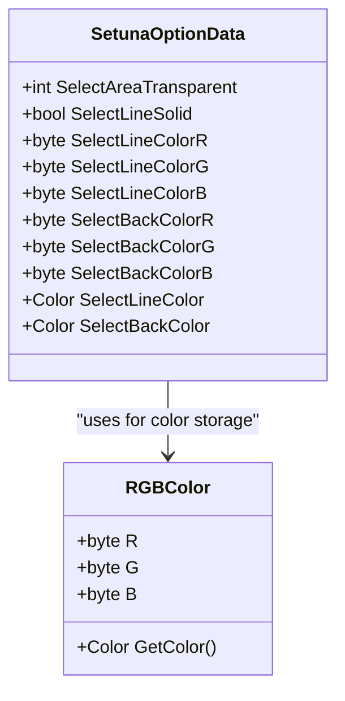
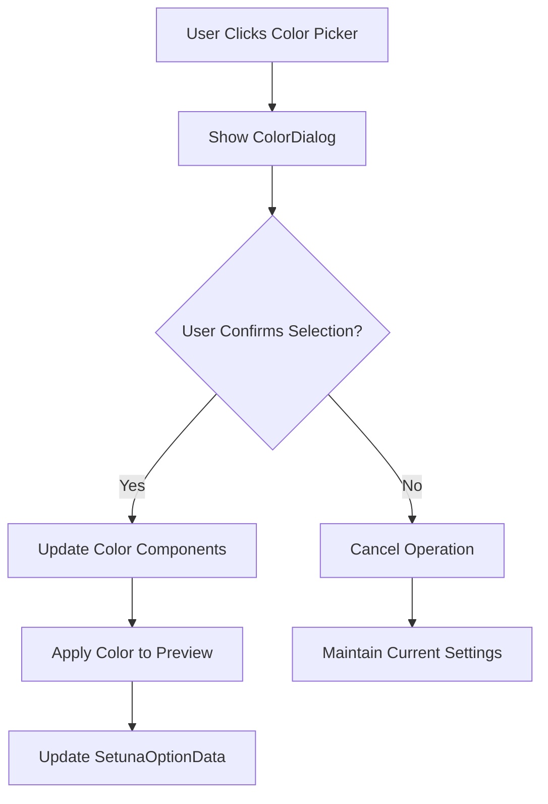
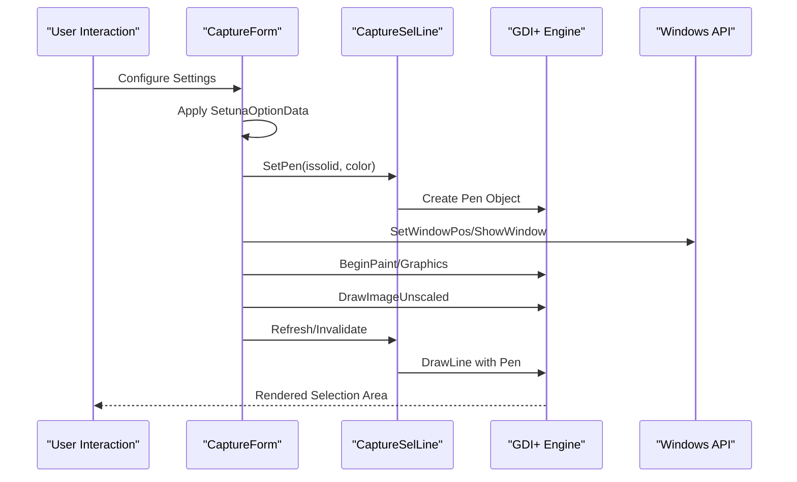
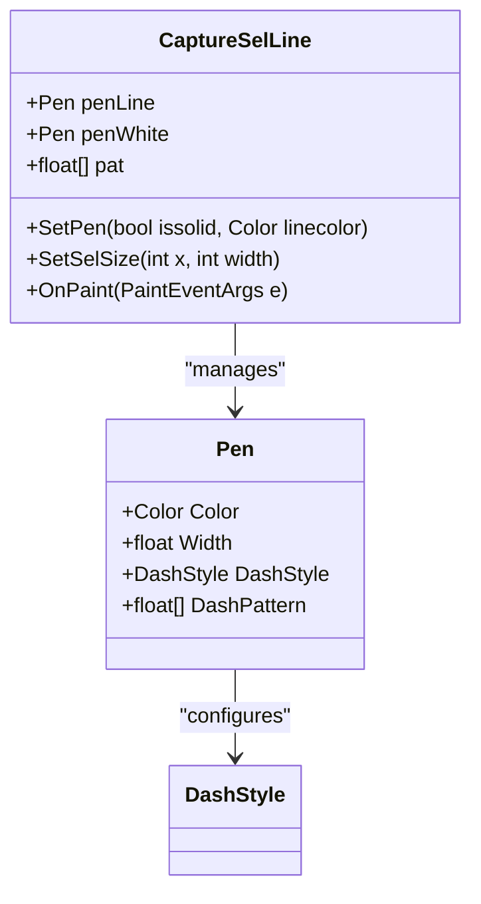
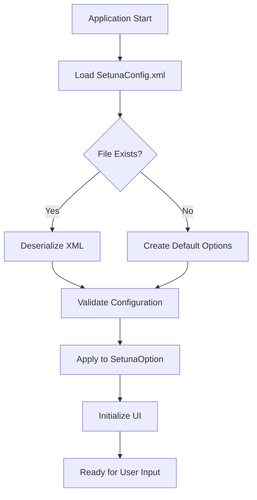
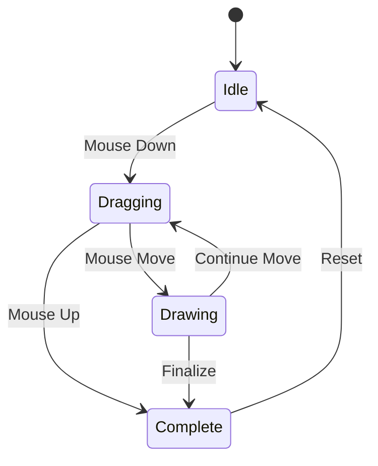

# Capture Settings

<cite>
**Referenced Files in This Document**
- [SetunaOption.cs](file://SETUNA/Main/Option/SetunaOption.cs)
- [OptionForm.cs](file://SETUNA/Main/Option/OptionForm.cs)
- [OptionForm.Designer.cs](file://SETUNA/Main/Option/OptionForm.Designer.cs)
- [CaptureForm.cs](file://SETUNA/Main/CaptureForm.cs)
- [CaptureSelLine.cs](file://SETUNA/Main/CaptureSelLine.cs)
- [SetunaOptionData.cs](file://SETUNA/Main/Option/SetunaOption.cs)
- [SelLineType.cs](file://SETUNA/Main/SelLineType.cs)
- [RGBColor.cs](file://SETUNA/Main/RGBColor.cs)
- [Mainform.cs](file://SETUNA\Mainform.cs)
</cite>

## Table of Contents
1. [Introduction](#introduction)
2. [Core Properties Overview](#core-properties-overview)
3. [UI Implementation in OptionForm](#ui-implementation-in-optionform)
4. [GDI+ Rendering Architecture](#gdi-rendering-architecture)
5. [Default Values and Configuration](#default-values-and-configuration)
6. [Persistence and Data Flow](#persistence-and-data-flow)
7. [Common Issues and Solutions](#common-issues-and-solutions)
8. [Advanced Implementation Details](#advanced-implementation-details)
9. [Best Practices](#best-practices)
10. [Troubleshooting Guide](#troubleshooting-guide)

## Introduction

The capture settings sub-component in SETUNA provides comprehensive visual customization for the screenshot selection interface. This system allows users to configure selection area transparency, line styles, background colors, and other visual elements through the '截取设置' (Capture Settings) tab in the OptionForm. The implementation leverages GDI+ for rendering and maintains persistence through XML configuration files.

The capture settings system consists of several interconnected components:
- **SetunaOptionData**: Core property container with SelectAreaTransparent, SelectLineSolid, and color components
- **OptionForm**: User interface for configuration with numeric up-down controls, color pickers, and radio buttons
- **CaptureForm**: Main screenshot capture window that applies visual settings during selection
- **CaptureSelLine**: Specialized line rendering component for selection borders
- **GDI+ Rendering Pipeline**: Low-level graphics rendering using Windows API calls

## Core Properties Overview

The capture settings are primarily managed through the `SetunaOptionData` class, which contains four key properties that control visual appearance:

### Selection Area Transparency

The `SelectAreaTransparent` property controls the opacity of the selection area background, ranging from 0% (completely opaque) to 100% (fully transparent). This property directly affects rendering performance and visual feedback.



**Diagram sources**
- [SetunaOption.cs](file://SETUNA/Main/Option/SetunaOption.cs#L983-L1152)
- [RGBColor.cs](file://SETUNA/Main/RGBColor.cs#L6-L67)

### Line Style Configuration

The `SelectLineSolid` boolean property determines whether selection borders use solid or dotted line patterns. This setting affects the visual appearance of the selection frame during screenshot capture.

### Color Components

The system uses separate RGB components for both selection line and background colors:
- **SelectLineColor**: Controls the border color of the selection area
- **SelectBackColor**: Controls the fill color of the selection area

Each color component is stored as a byte value (0-255) and can be accessed through the corresponding getter properties that combine these components into Color objects.

**Section sources**
- [SetunaOption.cs](file://SETUNA/Main/Option/SetunaOption.cs#L983-L1152)
- [RGBColor.cs](file://SETUNA/Main/RGBColor.cs#L6-L67)

## UI Implementation in OptionForm

The '截取设置' (Capture Settings) tab in OptionForm provides a comprehensive interface for configuring capture visual settings. The implementation uses standard Windows Forms controls arranged in a logical grouping structure.

### Numeric Up-Down Controls

The transparency level is configured through a numeric up-down control (`numSelectAreaTrans`) that allows users to specify values from 0 to 100. This control directly maps to the `SelectAreaTransparent` property and provides immediate visual feedback.

### Color Picker Implementation

Color selection utilizes PictureBox controls with click handlers that trigger the standard Windows ColorDialog. Each color picker maintains its own state and updates the corresponding color components in real-time.



**Diagram sources**
- [OptionForm.cs](file://SETUNA/Main/Option/OptionForm.cs#L504-L514)

### Radio Button Controls

Line style selection uses two radio buttons:
- **Solid Lines**: `rdoSelLineTypeSolid` - Creates continuous border lines
- **Dotted Lines**: `rdoSelLineTypeDotted` - Creates dashed border lines

These controls directly modify the `SelectLineSolid` property and immediately update the preview display.

### Layout Architecture

The UI follows a grouped layout pattern with clear visual separation:

| Group | Controls | Purpose |
|-------|----------|---------|
| Line Style | Radio buttons for solid/dotted | Determines selection border appearance |
| Transparency | Numeric up-down control | Sets selection area opacity (0-100%) |
| Line Color | Color picker PictureBox | Configures selection border color |
| Fill Color | Color picker PictureBox | Configures selection area fill color |

**Section sources**
- [OptionForm.Designer.cs](file://SETUNA/Main/Option/OptionForm.Designer.cs#L657-L790)
- [OptionForm.cs](file://SETUNA/Main/Option/OptionForm.cs#L504-L514)

## GDI+ Rendering Architecture

The capture settings implementation relies heavily on GDI+ for low-level graphics rendering. The system uses a combination of Windows API calls and managed GDI+ objects to achieve optimal performance and visual quality.

### CaptureForm Rendering Pipeline

The main rendering pipeline operates through several key components:



**Diagram sources**
- [CaptureForm.cs](file://SETUNA/Main/CaptureForm.cs#L180-L285)
- [CaptureSelLine.cs](file://SETUNA/Main/CaptureSelLine.cs#L61-L75)

### Pen Creation and Management

The `CaptureSelLine` class manages pen creation and style application:



**Diagram sources**
- [CaptureSelLine.cs](file://SETUNA/Main/CaptureSelLine.cs#L61-L75)

### Transparency Implementation

Transparency is implemented through alpha blending calculations:

```csharp
// Transparency calculation in CaptureForm.ShowCapture
blAreaVisible = (opt.SelectAreaTransparent != 100);
CaptureForm.selArea.Opacity = 1f - opt.SelectAreaTransparent / 100f;
```

This calculation converts the percentage-based transparency setting into a floating-point opacity value suitable for GDI+ rendering.

**Section sources**
- [CaptureForm.cs](file://SETUNA/Main/CaptureForm.cs#L224-L226)
- [CaptureSelLine.cs](file://SETUNA/Main/CaptureSelLine.cs#L61-L75)

## Default Values and Configuration

The system initializes with carefully chosen default values that balance usability and performance:

### Initial Configuration

| Property | Default Value | Rationale |
|----------|---------------|-----------|
| SelectAreaTransparent | 80% | Provides good visual feedback while maintaining performance |
| SelectBackColor | DarkBlue | High contrast against typical backgrounds |
| SelectLineColor | Blue | Standard selection indicator color |
| SelectLineSolid | true | Clear, unambiguous selection boundaries |

### Color Defaults

The default colors are established through the `SetunaOption.GetDefaultOption()` method:

```csharp
// Default background color - DarkBlue
setunaOption.Setuna.SelectBackColorR = Color.DarkBlue.R;
setunaOption.Setuna.SelectBackColorG = Color.DarkBlue.G;
setunaOption.Setuna.SelectBackColorB = Color.DarkBlue.B;

// Default line color - Blue  
setunaOption.Setuna.SelectLineColorR = Color.Blue.R;
setunaOption.Setuna.SelectLineColorG = Color.Blue.G;
setunaOption.Setuna.SelectLineColorB = Color.Blue.B;
```

### Performance Considerations

The default transparency setting of 80% provides an optimal balance between visual feedback and rendering performance. Higher transparency values (closer to 100%) significantly improve performance by reducing the amount of pixel manipulation required.

**Section sources**
- [SetunaOption.cs](file://SETUNA/Main/Option/SetunaOption.cs#L18-L35)
- [SetunaOption.cs](file://SETUNA/Main/Option/SetunaOption.cs#L1006-L1028)

## Persistence and Data Flow

The capture settings follow a structured persistence model that ensures configuration integrity and provides rollback capabilities.

### Configuration Loading

The loading process follows this sequence:



**Diagram sources**
- [OptionForm.cs](file://SETUNA/Main/Option/OptionForm.cs#L44-L85)

### Data Synchronization

Changes in the OptionForm are synchronized with the SetunaOptionData through the `WriteSetunaOption()` method:

```csharp
private void WriteSetunaOption()
{
    _so.Setuna.SelectLineSolid = rdoSelLineTypeSolid.Checked;
    _so.Setuna.SelectLineColorR = picSelectAreaLineColor.BackColor.R;
    _so.Setuna.SelectLineColorG = picSelectAreaLineColor.BackColor.G;
    _so.Setuna.SelectLineColorB = picSelectAreaLineColor.BackColor.B;
    _so.Setuna.SelectBackColorR = picSelectAreaBackColor.BackColor.R;
    _so.Setuna.SelectBackColorG = picSelectAreaBackColor.BackColor.G;
    _so.Setuna.SelectBackColorB = picSelectAreaBackColor.BackColor.B;
    _so.Setuna.SelectAreaTransparent = (int)numSelectAreaTrans.Value;
    // ... additional properties
}
```

### XML Serialization

The configuration is serialized to XML using standard .NET serialization mechanisms, ensuring cross-platform compatibility and human-readable configuration files.

**Section sources**
- [OptionForm.cs](file://SETUNA/Main/Option/OptionForm.cs#L86-L167)
- [OptionForm.cs](file://SETUNA/Main/Option/OptionForm.cs#L44-L85)

## Common Issues and Solutions

### Color Picker Functionality

**Issue**: Color picker dialog not responding or crashing
**Solution**: Ensure proper disposal of ColorDialog resources and validate color values before assignment.

**Code Reference**: [OptionForm.cs](file://SETUNA/Main/Option/OptionForm.cs#L504-L514)

### Transparency Level Constraints

**Issue**: Transparency values outside 0-100 range causing rendering artifacts
**Solution**: Implement input validation and clamping in the numeric up-down control.

**Code Reference**: [OptionForm.cs](file://SETUNA/Main/Option/OptionForm.cs#L117-L118)

### GDI+ Resource Management

**Issue**: Memory leaks from improper pen and brush disposal
**Solution**: Implement proper resource cleanup using using statements and IDisposable patterns.

**Code Reference**: [CaptureSelLine.cs](file://SETUNA/Main/CaptureSelLine.cs#L61-L75)

### Duplicate Instance Behavior

**Issue**: Multiple capture forms interfering with each other's visual settings
**Solution**: Ensure singleton pattern implementation and proper option synchronization.

**Code Reference**: [Mainform.cs](file://SETUNA\Mainform.cs#L629)

## Advanced Implementation Details

### Mouse Event Handling

The capture system implements sophisticated mouse event handling for real-time visual feedback:



**Diagram sources**
- [CaptureForm.cs](file://SETUNA/Main/CaptureForm.cs#L525-L594)

### Performance Optimizations

Several optimization techniques are employed to maintain smooth performance:

1. **Selective Redrawing**: Only affected areas are redrawn during mouse movement
2. **Double Buffering**: Prevents flicker during rapid updates
3. **Resource Pooling**: Reuse of pen and brush objects where possible
4. **Lazy Initialization**: Components are created only when needed

### Cross-Platform Considerations

While primarily designed for Windows, the architecture includes considerations for potential cross-platform compatibility:

- GDI+ abstraction layer
- Platform-specific API calls isolated in dedicated methods
- Color representation using standard .NET types

**Section sources**
- [CaptureForm.cs](file://SETUNA/Main/CaptureForm.cs#L525-L594)
- [CaptureSelLine.cs](file://SETUNA/Main/CaptureSelLine.cs#L61-L75)

## Best Practices

### Configuration Management

1. **Always validate user input** before applying settings
2. **Provide sensible defaults** that work across different hardware configurations
3. **Implement undo/redo functionality** for complex changes
4. **Test with various screen resolutions** to ensure visual consistency

### Performance Guidelines

1. **Minimize GDI+ object creation** during runtime
2. **Use appropriate transparency levels** based on system capabilities
3. **Implement efficient invalidation regions** for partial redraws
4. **Monitor memory usage** during extended capture sessions

### User Experience

1. **Provide immediate visual feedback** for all setting changes
2. **Use descriptive tooltips** for complex configuration options
3. **Implement keyboard shortcuts** for frequently used settings
4. **Maintain consistent color schemes** across the application

## Troubleshooting Guide

### Rendering Issues

**Problem**: Selection area not visible or partially obscured
**Diagnosis Steps**:
1. Check transparency settings (100% transparency hides selection)
2. Verify color contrast against background
3. Test with different background images
4. Examine GDI+ resource availability

**Solution**: Adjust transparency to 99% or lower, change colors for better contrast, or restart the application.

### Performance Problems

**Problem**: Slow response during selection dragging
**Diagnosis Steps**:
1. Monitor CPU usage during operation
2. Check for excessive invalidation calls
3. Verify GDI+ resource limits
4. Test with reduced transparency settings

**Solution**: Increase transparency to reduce pixel manipulation, optimize invalidation regions, or disable unnecessary visual effects.

### Configuration Corruption

**Problem**: Settings not persisting or loading incorrectly
**Diagnosis Steps**:
1. Check XML configuration file integrity
2. Verify file permissions for configuration directory
3. Test with clean configuration file
4. Review application logs for errors

**Solution**: Restore from backup configuration, reset to defaults, or repair file permissions.

**Section sources**
- [OptionForm.cs](file://SETUNA/Main/Option/OptionForm.cs#L653-L656)
- [CaptureForm.cs](file://SETUNA/Main/CaptureForm.cs#L224-L226)