# Configuration System

<cite>
**Referenced Files in This Document**
- [SetunaOption.cs](file://SETUNA/Main/Option/SetunaOption.cs)
- [OptionForm.cs](file://SETUNA/Main/Option/OptionForm.cs)
- [OptionForm.Designer.cs](file://SETUNA/Main/Option/OptionForm.Designer.cs)
- [StyleEditForm.cs](file://SETUNA/Main/Option/StyleEditForm.cs)
- [HotkeyControl.cs](file://SETUNA/Main/HotkeyControl.cs)
- [AutoStartup.cs](file://SETUNA/Main/Startup/AutoStartup.cs)
- [Mainform.cs](file://SETUNA/Mainform.cs)
- [Settings.Designer.cs](file://SETUNA/Properties/Settings.Designer.cs)
</cite>

## Table of Contents
1. [Introduction](#introduction)
2. [Configuration Architecture](#configuration-architecture)
3. [SetunaOption Class](#setunaoption-class)
4. [UI Implementation](#ui-implementation)
5. [XML Serialization](#xml-serialization)
6. [Hotkey Management](#hotkey-management)
7. [Startup Behavior](#startup-behavior)
8. [Configuration Persistence](#configuration-persistence)
9. [Common Issues and Solutions](#common-issues-and-solutions)
10. [Practical Examples](#practical-examples)
11. [Migration and Versioning](#migration-and-versioning)
12. [Troubleshooting Guide](#troubleshooting-guide)

## Introduction

The SETUNA configuration system provides comprehensive user preference management through a sophisticated XML-based serialization mechanism. The system handles everything from basic application settings to complex hotkey assignments and style configurations, ensuring that user preferences persist across application sessions while maintaining backward compatibility during version migrations.

The configuration system is built around the `SetunaOption` class, which serves as the central repository for all user settings. It utilizes `System.Xml.Serialization` for data persistence and provides a rich UI through the `OptionForm` class with specialized tabs for different configuration categories.

## Configuration Architecture

The configuration system follows a layered architecture that separates concerns between data storage, UI presentation, and business logic:

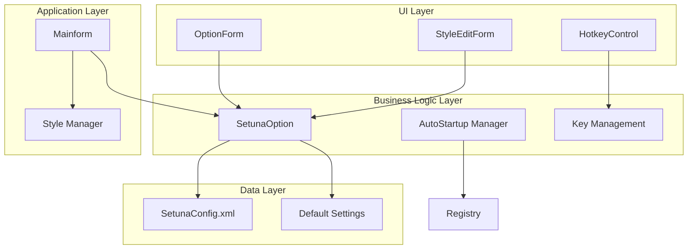

**Diagram sources**
- [SetunaOption.cs](file://SETUNA/Main/Option/SetunaOption.cs#L15-L1156)
- [OptionForm.cs](file://SETUNA/Main/Option/OptionForm.cs#L12-L813)
- [Mainform.cs](file://SETUNA/Mainform.cs#L400-L450)

**Section sources**
- [SetunaOption.cs](file://SETUNA/Main/Option/SetunaOption.cs#L15-L1156)
- [OptionForm.cs](file://SETUNA/Main/Option/OptionForm.cs#L12-L813)

## SetunaOption Class

The `SetunaOption` class serves as the core configuration container, implementing the `ICloneable` interface for deep copying capabilities. It manages two primary configuration sections: `SetunaOptionData` for general application settings and `ScrapOptionData` for reference image behavior.

### Core Properties and Structure

The class maintains several key data structures:

| Property Category | Purpose | Data Type |
|------------------|---------|-----------|
| Application Type | Mode of operation (Application vs Resident) | `ApplicationType` enum |
| Hotkey Settings | Global and function hotkeys | `Keys[]` array |
| Display Options | Selection area appearance | Color and transparency settings |
| Scrap Behavior | Reference image management | `ScrapOptionData` |
| Style Collection | Automatic operation definitions | `List<CStyle>` |

### Default Configuration Generation

The system automatically generates default configurations through the `GetDefaultOption()` method, which initializes predefined styles and hotkey combinations:

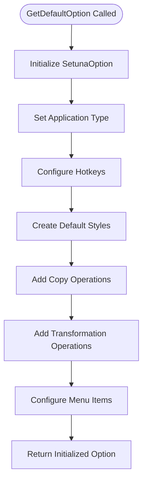

**Diagram sources**
- [SetunaOption.cs](file://SETUNA/Main/Option/SetunaOption.cs#L18-L569)

### Configuration Categories

The `SetunaOption` class organizes settings into logical categories:

#### Application Settings (`SetunaOptionData`)
- Execution mode (application or resident)
- Startup behavior and window management
- Display preferences for selection areas
- Dust box configuration for temporary storage

#### Scrap Settings (`ScrapOptionData`)
- Image drag and drop behavior
- Alpha transparency settings for active/inactive states
- Mouse hover effects and line styling
- Menu customization for right-click context

**Section sources**
- [SetunaOption.cs](file://SETUNA/Main/Option/SetunaOption.cs#L15-L1156)

## UI Implementation

The configuration interface is implemented through the `OptionForm` class, which provides a tabbed interface for organizing different configuration categories. The form dynamically loads and saves settings while maintaining user-friendly controls.

### Tab Organization

The UI is structured into six main tabs:

| Tab Name | Purpose | Controls |
|----------|---------|----------|
| General | Basic application settings | Radio buttons, checkboxes, dropdowns |
| Capture | Screenshot capture behavior | Hotkey controls, radio buttons |
| Scrap | Reference image settings | Color pickers, numeric up/down controls |
| Style | Automatic operation creation | List boxes, style editors |
| Menu | Context menu customization | Drag-and-drop list management |
| Miscellaneous | Advanced features | Specialized controls for cursor, magnifier |

### Dynamic Control Population

The form dynamically populates controls based on the current configuration state:

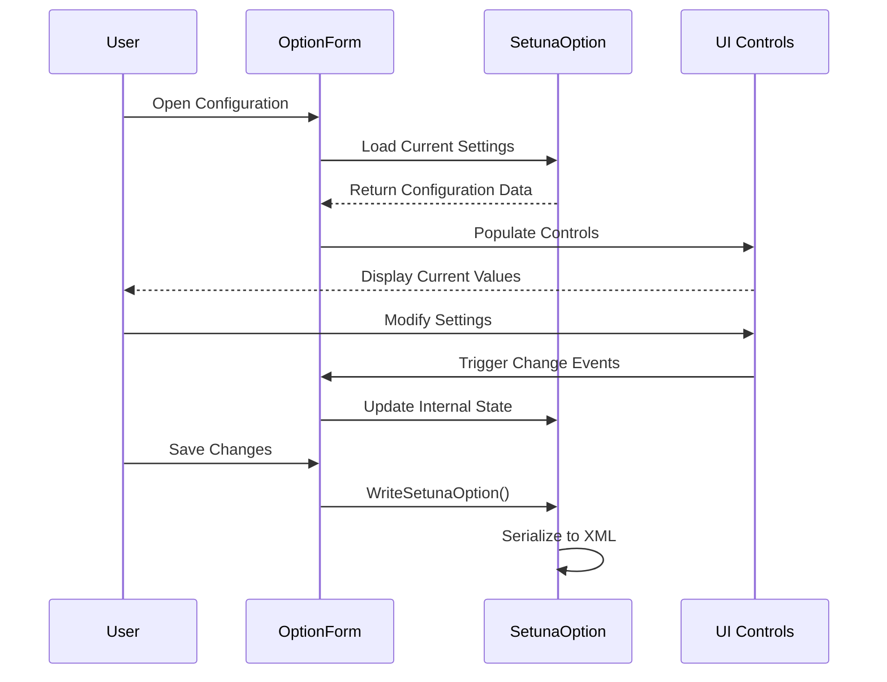

**Diagram sources**
- [OptionForm.cs](file://SETUNA/Main/Option/OptionForm.cs#L45-L165)

### Style Management Interface

The Style tab provides sophisticated editing capabilities through the `StyleEditForm` class:

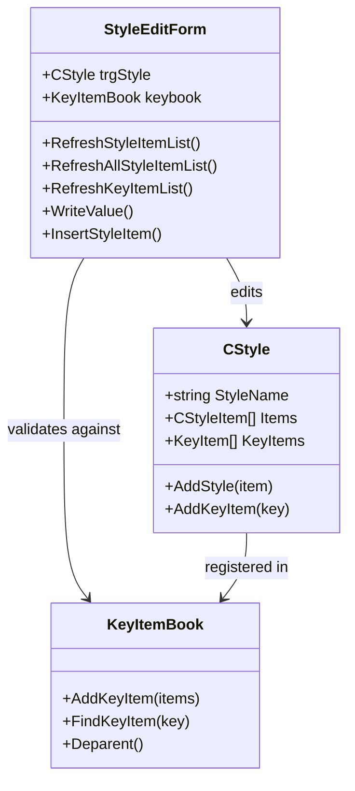

**Diagram sources**
- [StyleEditForm.cs](file://SETUNA/Main/Option/StyleEditForm.cs#L11-L293)

**Section sources**
- [OptionForm.cs](file://SETUNA/Main/Option/OptionForm.cs#L12-L813)
- [StyleEditForm.cs](file://SETUNA/Main/Option/StyleEditForm.cs#L11-L293)

## XML Serialization

The configuration system uses `System.Xml.Serialization` for persisting settings to XML format. This approach ensures human-readable configuration files and robust data integrity.

### Serialization Process

The serialization process involves several key steps:

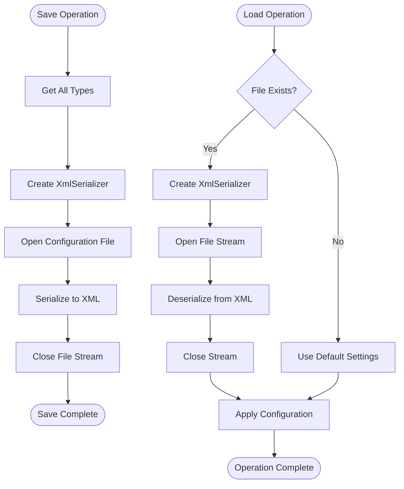

**Diagram sources**
- [Mainform.cs](file://SETUNA/Mainform.cs#L403-L417)
- [Mainform.cs](file://SETUNA/Mainform.cs#L421-L447)

### Type Registration

The system registers all necessary types for proper serialization:

| Type Category | Registered Types |
|---------------|------------------|
| Core Types | `SetunaOption`, `CStyle`, `Color` |
| Style Items | All derived classes from `CStyleItem` |
| Enums | `ApplicationType`, `OpeningType` |
| Collections | `List<CStyle>`, `List<int>` |

### Configuration File Location

The configuration file is stored in the application's startup directory with the filename `SetunaConfig.xml`. The system automatically creates the directory if it doesn't exist.

**Section sources**
- [SetunaOption.cs](file://SETUNA/Main/Option/SetunaOption.cs#L574-L584)
- [Mainform.cs](file://SETUNA/Mainform.cs#L403-L447)

## Hotkey Management

The hotkey system provides comprehensive keyboard shortcut management with conflict detection and automatic registration with the Windows operating system.

### Hotkey Architecture

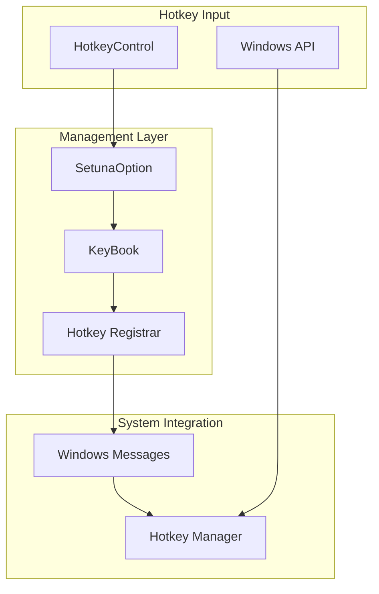

**Diagram sources**
- [SetunaOption.cs](file://SETUNA/Main/Option/SetunaOption.cs#L707-L740)
- [HotkeyControl.cs](file://SETUNA/Main/HotkeyControl.cs#L1-L83)

### Hotkey Registration Process

The system handles hotkey registration through native Windows API calls:

| Step | Action | Error Handling |
|------|--------|----------------|
| 1 | Unregister Existing | Silent failure |
| 2 | Parse Modifier Keys | Shift, Ctrl, Alt |
| 3 | Extract Key Code | Virtual key codes |
| 4 | Register with OS | Display error dialog |
| 5 | Validate Success | Revert if failed |

### Conflict Detection

The `StyleEditForm` provides real-time conflict detection when assigning hotkeys:

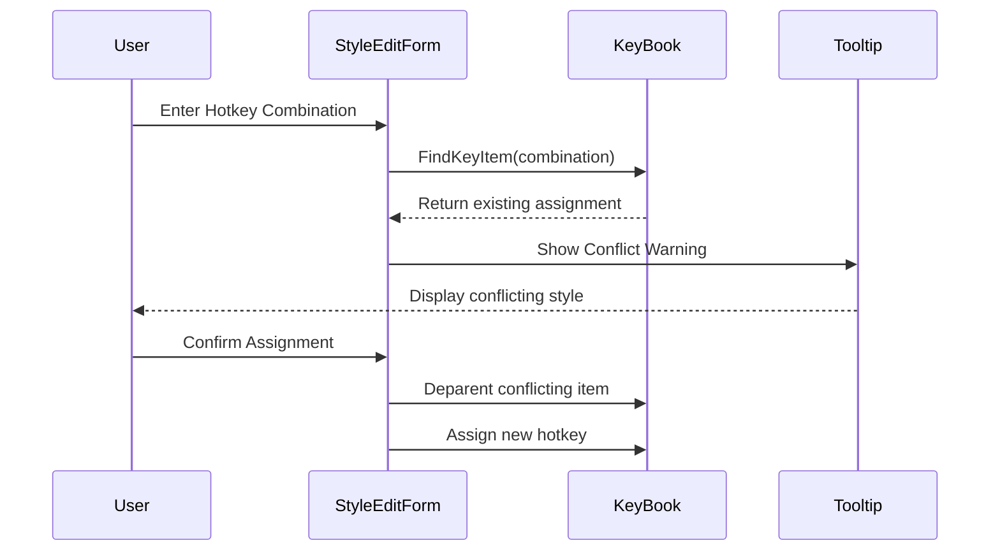

**Diagram sources**
- [StyleEditForm.cs](file://SETUNA/Main/Option/StyleEditForm.cs#L255-L272)

**Section sources**
- [SetunaOption.cs](file://SETUNA/Main/Option/SetunaOption.cs#L707-L740)
- [HotkeyControl.cs](file://SETUNA/Main/HotkeyControl.cs#L1-L83)
- [StyleEditForm.cs](file://SETUNA/Main/Option/StyleEditForm.cs#L255-L272)

## Startup Behavior

The startup system manages application initialization and provides options for controlling how SETUNA behaves when Windows starts.

### AutoStartup Implementation

The `AutoStartup` class manages Windows registry entries for automatic startup:

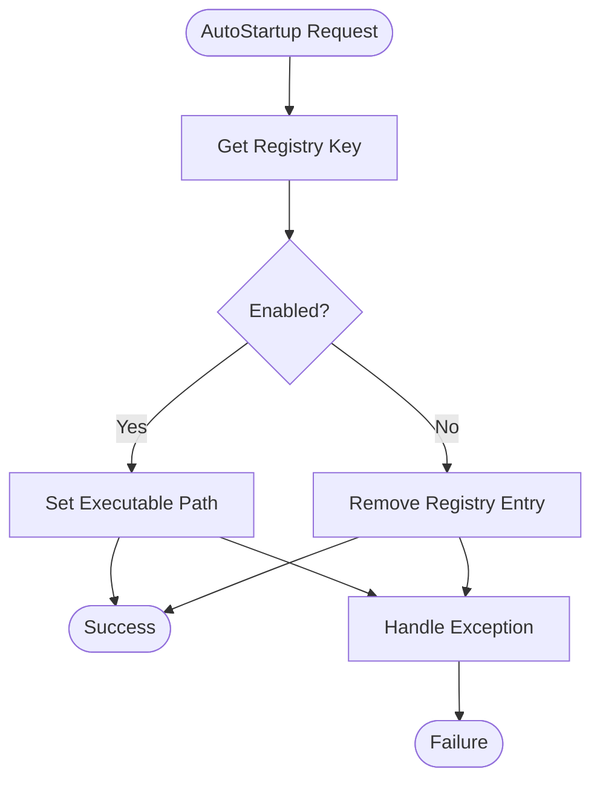

**Diagram sources**
- [AutoStartup.cs](file://SETUNA/Main/Startup/AutoStartup.cs#L11-L51)

### Startup Modes

The application supports two distinct startup modes:

| Mode | Behavior | Use Case |
|------|----------|----------|
| Application Mode | Shows main window, minimizes to tray | Traditional desktop applications |
| Resident Mode | Runs minimized to system tray | Background services, monitoring tools |

### DPI Awareness

The system automatically handles DPI scaling issues for older Windows versions:

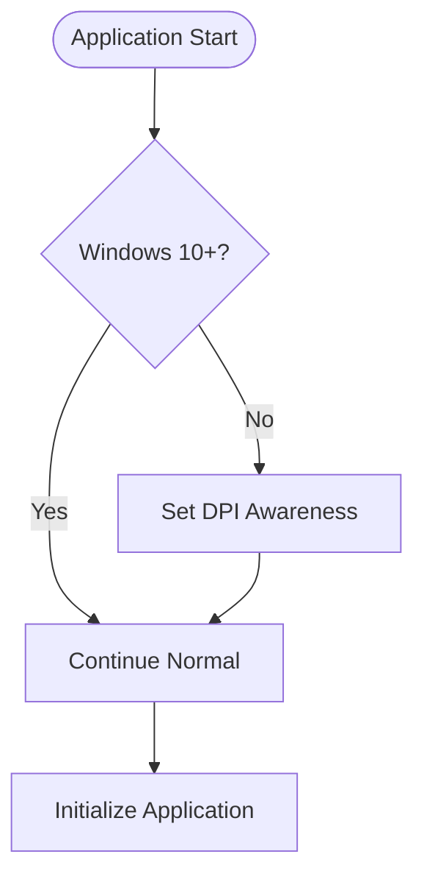

**Diagram sources**
- [Program.cs](file://SETUNA/Program.cs#L14-L19)

**Section sources**
- [AutoStartup.cs](file://SETUNA/Main/Startup/AutoStartup.cs#L11-L51)
- [Program.cs](file://SETUNA/Program.cs#L14-L19)

## Configuration Persistence

The persistence layer ensures that user configurations survive application restarts and system reboots through a robust file-based storage system.

### Load/Save Operations

The configuration loading and saving process follows a fail-safe pattern:

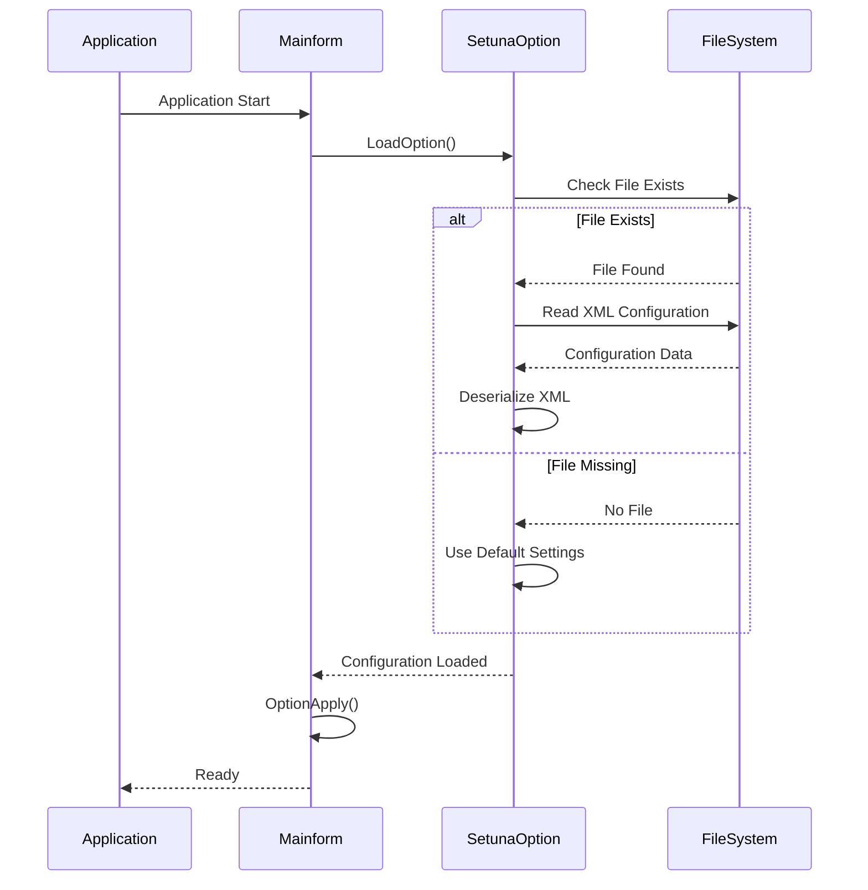

**Diagram sources**
- [Mainform.cs](file://SETUNA/Mainform.cs#L421-L447)

### Error Handling

The system implements comprehensive error handling for configuration operations:

| Scenario | Action | Recovery Strategy |
|----------|--------|-------------------|
| File Not Found | Use defaults | Create new configuration |
| XML Parsing Error | Use defaults | Log error, show warning |
| Permission Denied | Show error | Allow manual save location |
| Corrupted Data | Use defaults | Notify user of corruption |

### Atomic Operations

Configuration changes are applied atomically to prevent partial updates:

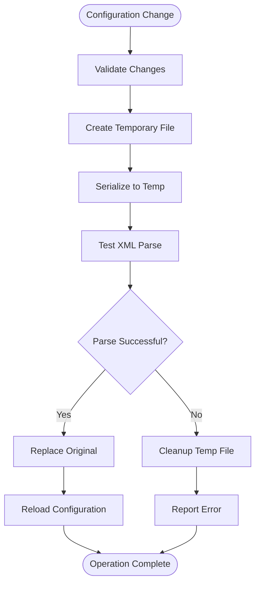

**Section sources**
- [Mainform.cs](file://SETUNA/Mainform.cs#L403-L447)

## Common Issues and Solutions

### Settings Not Persisting

**Symptoms**: Configuration changes revert after application restart
**Causes**: 
- Insufficient write permissions to application directory
- Antivirus software blocking file writes
- Disk space limitations

**Solutions**:
1. Run application as administrator
2. Add application to antivirus exclusions
3. Check available disk space
4. Verify file permissions on configuration directory

### Hotkey Conflicts

**Symptoms**: Hotkeys not responding or triggering wrong actions
**Causes**:
- Duplicate hotkey assignments
- Conflicts with system shortcuts
- Windows hotkey restrictions

**Solutions**:
1. Use the built-in conflict detection in StyleEditForm
2. Choose less common key combinations
3. Disable conflicting system shortcuts
4. Test hotkeys immediately after assignment

### Migration Between Versions

**Symptoms**: Settings lost or corrupted after update
**Causes**:
- Schema changes between versions
- Missing migration scripts
- File permission issues

**Solutions**:
1. Backup configuration before updating
2. Use the "Initialize Settings" option in OptionForm
3. Manually copy settings from backup
4. Contact support for version-specific migration assistance

**Section sources**
- [Mainform.cs](file://SETUNA/Mainform.cs#L438-L442)
- [StyleEditForm.cs](file://SETUNA/Main/Option/StyleEditForm.cs#L255-L272)

## Practical Examples

### Configuring Hotkeys for Quick Actions

To configure custom hotkeys for frequently used operations:

1. **Open Configuration**: Access via Tools → Options
2. **Navigate to Capture Tab**: Contains global hotkey settings
3. **Assign Hotkeys**: Use HotkeyControl components for key combinations
4. **Test Immediately**: Hotkeys take effect instantly upon assignment

### Setting Up DPI-Aware Display

For users with high-DPI displays:

1. **Access General Tab**: Contains display settings
2. **Adjust Transparency**: Modify selection area opacity
3. **Configure Colors**: Set custom border and fill colors
4. **Apply Changes**: Settings take effect immediately

### Creating Custom Automatic Operations

To define complex sequences of actions:

1. **Go to Style Tab**: Open style management interface
2. **Create New Style**: Use the "New Style" button
3. **Add Operations**: Drag operations from available list
4. **Assign Hotkey**: Set a unique key combination
5. **Test Operation**: Verify functionality works as expected

### Managing Startup Behavior

To control application startup:

1. **Open General Tab**: Navigate to startup settings
2. **Choose Mode**: Select Application or Resident mode
3. **Configure Auto-start**: Toggle auto-start checkbox
4. **Window Visibility**: Set main window visibility preferences

**Section sources**
- [OptionForm.cs](file://SETUNA/Main/Option/OptionForm.cs#L45-L165)
- [StyleEditForm.cs](file://SETUNA/Main/Option/StyleEditForm.cs#L14-L293)

## Migration and Versioning

The configuration system includes mechanisms for handling version differences and migrating settings between application versions.

### Version Compatibility

The system maintains version information for configuration files:

| Component | Version Tracking | Migration Strategy |
|-----------|------------------|-------------------|
| Configuration | `OptionVersion` property | Automatic conversion |
| Application | `ApplicationVersion` | Manual intervention |
| File Format | XML schema versioning | Backward compatibility |

### Migration Process

When upgrading to a new version:

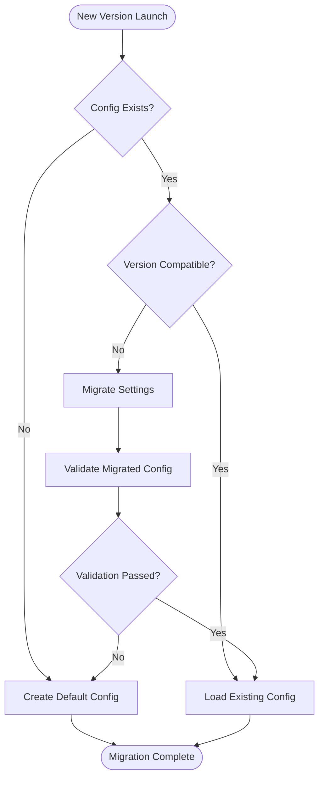

### Backup and Recovery

The system supports configuration backup and restoration:

1. **Automatic Backup**: Previous configuration preserved during migration
2. **Manual Export**: Configuration can be saved to external files
3. **Reset to Defaults**: Clean installation of default settings
4. **Selective Restoration**: Individual setting groups can be restored

**Section sources**
- [SetunaOption.cs](file://SETUNA/Main/Option/SetunaOption.cs#L618-L624)
- [Mainform.cs](file://SETUNA/Mainform.cs#L438-L442)

## Troubleshooting Guide

### Configuration Issues

**Problem**: Settings not saving properly
**Diagnosis Steps**:
1. Check file permissions on application directory
2. Verify available disk space
3. Look for antivirus interference
4. Review Windows Event Logs

**Solution**: 
- Run as administrator
- Exclude from antivirus scanning
- Check disk space availability

**Problem**: Hotkeys not registering
**Diagnosis Steps**:
1. Verify hotkey combinations aren't reserved
2. Check for conflicts with other applications
3. Test with different key combinations
4. Review Windows hotkey settings

**Solution**:
- Use less common key combinations
- Disable conflicting applications
- Test with minimal key combinations

### Performance Issues

**Problem**: Slow application startup
**Possible Causes**:
- Large configuration file
- Network drive for configuration
- Antivirus scanning configuration

**Solutions**:
- Move configuration to local drive
- Exclude from network scanning
- Optimize antivirus exclusions

**Problem**: Memory usage increasing over time
**Possible Causes**:
- Configuration caching issues
- Style collection growth
- Hotkey registration leaks

**Solutions**:
- Restart application periodically
- Clear unused styles
- Monitor hotkey registrations

### UI Problems

**Problem**: Configuration dialog not displaying correctly
**Possible Causes**:
- DPI scaling issues
- Missing font resources
- Theme conflicts

**Solutions**:
- Adjust DPI settings
- Install missing fonts
- Reset theme settings

**Problem**: Controls not responding
**Possible Causes**:
- Focus issues
- Event handler conflicts
- Control state corruption

**Solutions**:
- Restart application
- Reset control states
- Clear temporary files

**Section sources**
- [Mainform.cs](file://SETUNA/Mainform.cs#L438-L442)
- [OptionForm.cs](file://SETUNA/Main/Option/OptionForm.cs#L45-L165)