# General Settings

<cite>
**Referenced Files in This Document**   
- [SetunaOption.cs](file://SETUNA/Main/Option/SetunaOption.cs)
- [OptionForm.cs](file://SETUNA/Main/Option/OptionForm.cs)
- [OptionForm.Designer.cs](file://SETUNA/Main/Option/OptionForm.Designer.cs)
- [AutoStartup.cs](file://SETUNA/Main/Startup/AutoStartup.cs)
- [Mainform.cs](file://SETUNA/Mainform.cs)
- [SplashForm.cs](file://SETUNA/Main/SplashForm.cs)
</cite>

## Table of Contents
1. [Introduction](#introduction)
2. [SetunaOption Class Architecture](#setunaoption-class-architecture)
3. [General Settings UI Implementation](#general-settings-ui-implementation)
4. [Application Mode Configuration](#application-mode-configuration)
5. [Window and Splash Screen Settings](#window-and-splash-screen-settings)
6. [Startup Management](#startup-management)
7. [Settings Persistence and Lifecycle](#settings-persistence-and-lifecycle)
8. [Common Configuration Scenarios](#common-configuration-scenarios)
9. [Troubleshooting](#troubleshooting)
10. [Conclusion](#conclusion)

## Introduction
The General Settings configuration in SETUNA provides comprehensive control over application-wide behavior and startup configuration. This document details how the SetunaOption class manages core application settings through its inner classes, the UI implementation in the OptionForm's 'General' tab, and the integration with system-level features like Windows startup entries. The settings system controls fundamental aspects of the application including operation type (ApplicationMode vs ResidentMode), window visibility, splash screen preferences, and top-most behavior. These configurations directly affect how the application integrates with the user's workflow, from system tray presence to window management behavior.

**Section sources**
- [SetunaOption.cs](file://SETUNA/Main/Option/SetunaOption.cs#L15-L1156)
- [OptionForm.cs](file://SETUNA/Main/Option/OptionForm.cs#L12-L813)

## SetunaOption Class Architecture
The SetunaOption class serves as the central configuration manager for the application, organizing settings into logical groups through inner classes. The primary configuration data is stored in the SetunaOptionData inner class, which contains properties for application type, window visibility, and splash screen preferences. This class uses a nested structure to separate concerns, with the ScrapOptionData class handling reference image-specific settings.

The SetunaOptionData class defines two key enumeration types for application behavior: ApplicationType (with ApplicationMode and ResidentMode values) and OpeningType (Normal and Capture). These enumerations control fundamental application behavior, with ApplicationMode displaying a main window and ResidentMode minimizing to the system tray. The class also manages visual elements like selection line color (SelectLineColor), selection background color (SelectBackColor), and selection area transparency (SelectAreaTransparent).

Default configuration values are established through the GetDefaultOption() static method, which initializes a new SetunaOption instance with predefined settings. This includes setting the application type to ApplicationMode, enabling the main window display, configuring the dust box capacity to 5 items, and setting the splash window to be visible. The configuration file path is determined by the ConfigFile property, which resolves to "SetunaConfig.xml" in the application's startup directory.


**Diagram sources**
- [SetunaOption.cs](file://SETUNA/Main/Option/SetunaOption.cs#L15-L1156)

**Section sources**
- [SetunaOption.cs](file://SETUNA/Main/Option/SetunaOption.cs#L15-L1156)

## General Settings UI Implementation
The 'General' tab in the OptionForm provides a user-friendly interface for configuring the core application settings managed by the SetunaOption class. The UI is organized into logical groups usingGroupBox controls, with the primary configuration section labeled "操作类型" (Operation Type) containing radio buttons for selecting between ApplicationMode and ResidentMode.

The operation type selection directly controls the application's behavior at startup and during execution. When ApplicationMode is selected, the application displays a main window and minimizes to the taskbar when minimized. In ResidentMode, the application minimizes to the system tray, with the main window visibility controlled by the "显示主窗口" (Show Main Window) checkbox. This checkbox is disabled when ApplicationMode is selected, as the main window is always visible in this mode.

Additional settings in the General tab include:
- "显示启动界面" (Show Splash Window): Controls whether the splash screen appears during application startup
- "始终置顶截图" (Always Top-most Screenshots): When enabled, keeps screenshots above other windows
- "开机自启动" (Auto Startup): Configures whether the application starts automatically with Windows
- "使用回收站" (Use Dust Box): Enables the temporary storage feature for screenshots
- "张为上限" (Maximum Count): Sets the capacity limit for the dust box

The UI implementation in OptionForm.cs handles the loading and saving of these settings through the LoadSetunaOption() and WriteSetunaOption() methods. These methods synchronize the UI controls with the underlying SetunaOption instance, ensuring that changes made in the interface are properly reflected in the configuration object.


**Diagram sources**
- [OptionForm.cs](file://SETUNA/Main/Option/OptionForm.cs#L12-L813)
- [OptionForm.Designer.cs](file://SETUNA/Main/Option/OptionForm.Designer.cs#L1-L1985)

**Section sources**
- [OptionForm.cs](file://SETUNA/Main/Option/OptionForm.cs#L12-L813)
- [OptionForm.Designer.cs](file://SETUNA/Main/Option/OptionForm.Designer.cs#L1-L1985)

## Application Mode Configuration
The application mode setting in SETUNA determines the fundamental behavior of the application at startup and during normal operation. Two distinct modes are available: ApplicationMode and ResidentMode, each serving different user workflows and preferences.

In ApplicationMode (selected by default), the application behaves like a traditional desktop application. It displays a main window at startup, appears in the taskbar, and minimizes to the taskbar when the minimize button is clicked. This mode is ideal for users who frequently interact with the application's main interface and prefer visible application presence. The main window provides access to all application features and serves as the central control point.

ResidentMode transforms the application into a system tray utility. When launched, the application minimizes directly to the system tray, with no main window visible by default. Users can configure whether the main window should be displayed initially through the "显示主窗口" (Show Main Window) checkbox, which is only enabled in this mode. This mode is particularly useful for users who want a minimal footprint and primarily interact with the application through its system tray icon and context menu.

The transition between these modes is handled in the OptionApply() method in Mainform.cs, which adjusts the form's properties based on the selected mode:
- For ApplicationMode: ShowInTaskbar is set to true, the system tray icon is hidden, and the main window is made visible
- For ResidentMode: ShowInTaskbar is set to false, the system tray icon is made visible, and the main window visibility follows the ShowMainWindow setting

This configuration significantly impacts the user experience, with ApplicationMode providing immediate access to application features and ResidentMode offering a more streamlined, background-oriented workflow. Users migrating between modes should be aware that their workflow patterns may need adjustment, particularly when accessing the application's main features.

```mermaid
stateDiagram-v2
[*] --> InitialState
InitialState --> ApplicationMode : "AppType = ApplicationMode"
InitialState --> ResidentMode : "AppType = ResidentMode"
ApplicationMode --> Running : "Form Load"
Running --> Visible : "ShowInTaskbar = true"
Visible --> Taskbar : "Minimize"
Taskbar --> Visible : "Restore"
ResidentMode --> Running : "Form Load"
Running --> TrayIcon : "ShowInTaskbar = false"
TrayIcon --> MainWindow : "ShowMainWindow = true"
TrayIcon --> Hidden : "ShowMainWindow = false"
MainWindow --> TrayIcon : "Minimize"
Hidden --> MainWindow : "Show from Tray"
state "ApplicationMode" as AppMode {
[*] --> VisibleWindow
VisibleWindow --> MinimizedToTaskbar
MinimizedToTaskbar --> VisibleWindow
}
state "ResidentMode" as ResMode {
[*] --> SystemTray
SystemTray --> OptionalMainWindow
OptionalMainWindow --> SystemTray
}
```



**Diagram sources**
- [SetunaOption.cs](file://SETUNA/Main/Option/SetunaOption.cs#L15-L1156)
- [Mainform.cs](file://SETUNA/Mainform.cs#L18-L992)

**Section sources**
- [SetunaOption.cs](file://SETUNA/Main/Option/SetunaOption.cs#L15-L1156)
- [Mainform.cs](file://SETUNA/Mainform.cs#L18-L992)

## Window and Splash Screen Settings
The window management settings in SETUNA provide fine-grained control over the application's visual behavior and user interface elements. These settings, accessible through the General tab in the OptionForm, allow users to customize how screenshots and the application itself interact with other windows on the desktop.

The "始终置顶截图" (Always Top-most Screenshots) setting controls whether captured screenshots remain above other application windows. When enabled, this feature ensures that reference images are always visible, which is particularly useful for design and development workflows where constant visual reference is needed. This setting is implemented through a timer (windowTimer) that periodically brings all screenshot windows to the front, maintaining their top-most status even when other applications are activated.

The splash screen functionality is managed through the "显示启动界面" (Show Splash Window) checkbox, which controls the ShowSplashWindow property in the SetunaOptionData class. When enabled, the application displays a splash form during startup that shows the application name and version. This splash window automatically closes after a brief delay, providing visual feedback during application initialization. The SplashForm class implements this functionality with a timer that closes the form after a set duration, though users can click on the splash screen to close it immediately.

Additional window-related settings include:
- Top-most behavior for screenshots
- System tray presence and behavior
- Main window visibility in ResidentMode
- Window refresh behavior

These settings are applied during application startup and when configuration changes are saved. The OptionApply() method in Mainform.cs handles the activation of the top-most timer based on the TopMostEnabled setting, ensuring that the window management behavior matches the user's preferences. The splash screen setting is checked during the application's initialization sequence, with the splash form only being displayed when the setting is enabled.

```mermaid
sequenceDiagram
participant App as Application
participant Option as SetunaOption
participant Form as Mainform
participant Splash as SplashForm
App->>Form : Main()
Form->>Form : LoadOption()
Form->>Option : GetDefaultOption() or Deserialize
Option-->>Form : SetunaOption instance
Form->>Form : OptionApply()
Form->>Form : Check ShowSplashWindow
alt Splash Enabled
Form->>Splash : new SplashForm()
Splash->>Splash : Show()
Splash->>Splash : Start Timer
alt User Interaction
User->>Splash : Click
Splash->>Splash : Close Immediately
else Timer Expires
Splash->>Splash : Close()
end
end
Form->>Form : Configure Window Behavior
Form->>Form : Set TopMost Timer
Form->>Form : Configure System Tray
Form->>App : Application.Run()
```

**Diagram sources**
- [SetunaOption.cs](file://SETUNA/Main/Option/SetunaOption.cs#L15-L1156)
- [Mainform.cs](file://SETUNA/Mainform.cs#L18-L992)
- [SplashForm.cs](file://SETUNA/Main/SplashForm.cs#L1-L37)

**Section sources**
- [SetunaOption.cs](file://SETUNA/Main/Option/SetunaOption.cs#L15-L1156)
- [Mainform.cs](file://SETUNA/Mainform.cs#L18-L992)
- [SplashForm.cs](file://SETUNA/Main/SplashForm.cs#L1-L37)

## Startup Management
The startup management system in SETUNA provides integration with Windows startup mechanisms through the AutoStartup class. This functionality allows users to configure whether the application launches automatically when Windows starts, providing convenience for users who regularly use the screenshot tool.

The AutoStartup class implements a static interface with two primary methods: Set(bool enabled) and IsSetup(). The Set method controls the Windows registry entry for application startup, adding or removing the application from the "Run" key in the current user's registry hive (HKEY_CURRENT_USER\Software\Microsoft\Windows\CurrentVersion\Run). When enabled, the application's executable path is stored in the registry with a key name of "SETUNA_AutoStartup", ensuring the application launches with Windows.

The IsSetup() method checks for the existence of this registry entry, returning true if the application is configured for automatic startup and false otherwise. This method is used by the OptionForm to initialize the state of the "开机自启动" (Auto Startup) checkbox when the settings dialog is opened. The UI implementation in OptionForm.cs calls AutoStartup.IsSetup() during initialization to synchronize the checkbox state with the actual registry configuration.

The integration between the UI and the startup management system occurs in the WriteSetunaOption() method, where the checkbox state is used to call AutoStartup.Set():


This startup management system provides a reliable way to ensure the application is available when needed, particularly for users who rely on SETUNA as part of their daily workflow. The implementation handles potential exceptions during registry operations, displaying error messages to the user if startup configuration fails.

**Diagram sources**
- [AutoStartup.cs](file://SETUNA/Main/Startup/AutoStartup.cs#L1-L81)
- [OptionForm.cs](file://SETUNA/Main/Option/OptionForm.cs#L12-L813)

**Section sources**
- [AutoStartup.cs](file://SETUNA/Main/Startup/AutoStartup.cs#L1-L81)
- [OptionForm.cs](file://SETUNA/Main/Option/OptionForm.cs#L12-L813)

## Settings Persistence and Lifecycle
The settings persistence system in SETUNA ensures that user configurations are maintained across application sessions through XML serialization. The configuration lifecycle begins at application startup with the LoadOption() method in Mainform.cs, which attempts to deserialize the SetunaConfig.xml file from the application directory. If the file doesn't exist or cannot be read, default settings are applied using the GetDefaultOption() method.

The serialization process uses .NET's XmlSerializer class with type metadata provided by the GetAllType() method in SetunaOption. This method returns an array of all types that may be included in the serialized configuration, ensuring that complex objects like CStyle instances are properly serialized and deserialized. The configuration file path is determined by the static ConfigFile property, which resolves to the application's startup directory.

Settings are saved to disk in two scenarios:
1. When the user closes the application normally, triggering the SaveOption() method
2. When the user applies changes in the OptionForm and clicks OK

The SaveOption() method creates a new FileStream for the configuration file and uses XmlSerializer to write the current SetunaOption instance to XML format. Error handling is implemented to display user-friendly messages if the save operation fails, preventing data loss while informing the user of the issue.

The configuration lifecycle is tightly integrated with the application's event flow:
- On startup: LoadOption() → Deserialize configuration → OptionApply() → Apply settings
- On shutdown: SaveOption() → Serialize configuration → Write to file
- On settings change: WriteSetunaOption() → Update configuration → SaveOption()

```mermaid
sequenceDiagram
participant App as Application
participant Main as Mainform
participant Option as SetunaOption
participant Serializer as XmlSerializer
participant File as FileStream
App->>Main : Application Start
Main->>Main : LoadOption()
alt Config File Exists
Main->>File : Open SetunaConfig.xml
File-->>Main : FileStream
Main->>Serializer : Deserialize(FileStream)
Serializer-->>Option : SetunaOption instance
else Config File Missing/Error
Main->>Option : GetDefaultOption()
Option-->>Main : Default Settings
end
Main->>Main : OptionApply()
Main->>App : Run Application
App->>Main : Application Close
Main->>Main : SaveOption()
Main->>Serializer : Create XmlSerializer
Serializer-->>Main : Serializer instance
Main->>File : Create FileStream (Write)
File-->>Main : Write Stream
Main->>Serializer : Serialize(SetunaOption)
Serializer->>File : Write XML
File->>Main : Close Stream
alt Save Failed
Main->>User : Show Error Message
end
```

The cloning mechanism implemented in the Clone() method of SetunaOption ensures that settings modifications in the OptionForm do not affect the running application until the user confirms the changes. This creates a temporary copy of the configuration that is only applied when the user clicks OK, providing a safe way to experiment with settings without affecting the current session.

**Diagram sources**
- [SetunaOption.cs](file://SETUNA/Main/Option/SetunaOption.cs#L15-L1156)
- [Mainform.cs](file://SETUNA/Mainform.cs#L18-L992)

**Section sources**
- [SetunaOption.cs](file://SETUNA/Main/Option/SetunaOption.cs#L15-L1156)
- [Mainform.cs](file://SETUNA/Mainform.cs#L18-L992)

## Common Configuration Scenarios
This section provides practical examples of configuring SETUNA for common use cases, addressing specific settings combinations and their effects on application behavior.

### Top-most Behavior Configuration
To configure screenshots to always stay on top of other windows:
1. Open the OptionForm and navigate to the General tab
2. Check the "始终置顶截图" (Always Top-most Screenshots) checkbox
3. Click OK to apply the settings

This setting activates the windowTimer in Mainform.cs, which periodically calls methods to bring all screenshot windows to the front. The timer ensures that even if another application becomes active, the screenshots will briefly regain top position, maintaining visibility for reference purposes.

### Application Mode Migration
When migrating from ApplicationMode to ResidentMode:
1. In the General tab, select "常驻任务栏" (Resident Mode)
2. Configure the "显示主窗口" (Show Main Window) checkbox based on preference
3. Click OK to apply changes

After migration, the application will minimize to the system tray instead of the taskbar. Users should note that the main window can still be accessed through the system tray icon's context menu. The reverse migration (ResidentMode to ApplicationMode) follows the same process but selects "应用软件" (Application Mode) instead.

### Cache Directory Access
To access the cache directory where screenshots are stored:
1. Open the OptionForm and navigate to the General tab
2. Click the "打开缓存目录" (Open Cache Directory) button
3. Windows Explorer will open, showing the cache folder

The cache directory path is managed by the CacheManager class, which determines the appropriate location for temporary file storage. This feature provides quick access to captured images for manual management or backup purposes.

### Startup Type Configuration
To configure SETUNA to start automatically with Windows:
1. In the General tab, check the "开机自启动" (Auto Startup) checkbox
2. Click OK to apply settings

This action adds a registry entry that launches SETUNA when the user logs into Windows. The AutoStartup class handles the registry operations, ensuring the application is properly registered for automatic startup.

Each of these scenarios demonstrates how the General Settings interface provides direct control over fundamental application behaviors, allowing users to tailor SETUNA to their specific workflow requirements.

**Section sources**
- [OptionForm.cs](file://SETUNA/Main/Option/OptionForm.cs#L12-L813)
- [AutoStartup.cs](file://SETUNA/Main/Startup/AutoStartup.cs#L1-L81)
- [Mainform.cs](file://SETUNA/Mainform.cs#L18-L992)

## Troubleshooting
This section addresses common issues users may encounter with the General Settings configuration and provides solutions for resolving them.

### Settings Not Persisting After Restart
If settings changes do not persist after restarting SETUNA:
1. Verify write permissions to the application directory
2. Check if the SetunaConfig.xml file is being created/updated
3. Ensure the application has permission to write to its installation folder

This issue typically occurs when the application lacks write permissions to its directory. Running SETUNA as administrator temporarily can help diagnose permission issues. The SaveOption() method includes error handling that displays a message if the configuration file cannot be saved, helping users identify this problem.

### Migration Between Application Modes
When migrating between ApplicationMode and ResidentMode, users may experience:
- System tray icon not appearing
- Main window visibility issues
- Taskbar presence inconsistencies

To resolve these issues:
1. Completely close and restart SETUNA after changing modes
2. Verify the settings are properly saved by checking the SetunaConfig.xml file
3. Ensure no other instances of SETUNA are running

The OptionApply() method in Mainform.cs handles mode transitions, but requires a clean application restart to properly initialize all UI elements according to the new mode.

### Splash Screen Issues
If the splash screen does not appear or behaves incorrectly:
1. Verify the "显示启动界面" setting is enabled
2. Check if the SplashForm is being instantiated in the startup sequence
3. Ensure no exceptions occur during splash screen initialization

The splash screen functionality depends on proper timing and UI thread execution. Issues may arise if the application startup process is interrupted or if there are delays in form creation.

### Auto Startup Configuration Problems
When the auto-startup feature doesn't work:
1. Verify the registry entry exists in HKEY_CURRENT_USER\Software\Microsoft\Windows\CurrentVersion\Run
2. Check if the executable path in the registry is correct
3. Ensure Windows startup programs are not disabled by system policies

The AutoStartup class includes error handling that displays exceptions if registry operations fail, helping diagnose permission or access issues.

These troubleshooting steps address the most common configuration issues, ensuring users can effectively manage their SETUNA settings for optimal performance.

**Section sources**
- [SetunaOption.cs](file://SETUNA/Main/Option/SetunaOption.cs#L15-L1156)
- [OptionForm.cs](file://SETUNA/Main/Option/OptionForm.cs#L12-L813)
- [Mainform.cs](file://SETUNA/Mainform.cs#L18-L992)
- [AutoStartup.cs](file://SETUNA/Main/Startup/AutoStartup.cs#L1-L81)

## Conclusion
The General Settings system in SETUNA provides comprehensive control over application-wide behavior and startup configuration through a well-structured architecture. The SetunaOption class, with its SetunaOptionData and ScrapOptionData inner classes, serves as the central configuration manager, organizing settings into logical groups that control fundamental application behavior. The UI implementation in OptionForm's 'General' tab provides an intuitive interface for configuring operation type, window visibility, and splash screen preferences, with radio buttons for ApplicationMode vs ResidentMode, a checkbox for main window visibility, and a toggle for splash window display.

The integration with AutoStartup.cs enables management of Windows startup entries, allowing users to configure automatic application launch. Settings persistence is handled through XML serialization to the SetunaConfig.xml file, ensuring configuration continuity across sessions. The system effectively manages core application behaviors including system tray presence, window management, and top-most functionality, providing users with flexible control over how SETUNA integrates with their workflow. Understanding these settings and their interactions is essential for optimizing the application's behavior to match individual user preferences and requirements.

**Section sources**
- [SetunaOption.cs](file://SETUNA/Main/Option/SetunaOption.cs#L15-L1156)
- [OptionForm.cs](file://SETUNA/Main/Option/OptionForm.cs#L12-L813)
- [Mainform.cs](file://SETUNA/Mainform.cs#L18-L992)
- [AutoStartup.cs](file://SETUNA/Main/Startup/AutoStartup.cs#L1-L81)