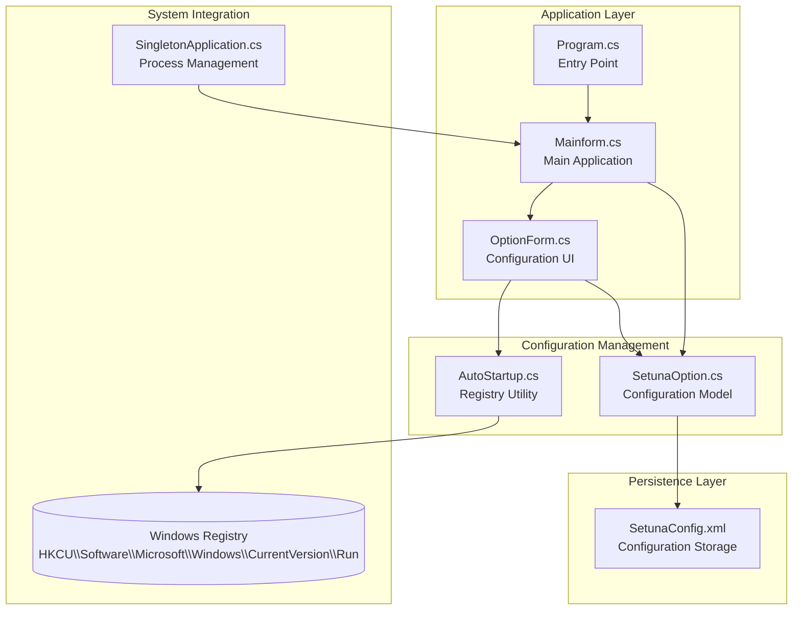
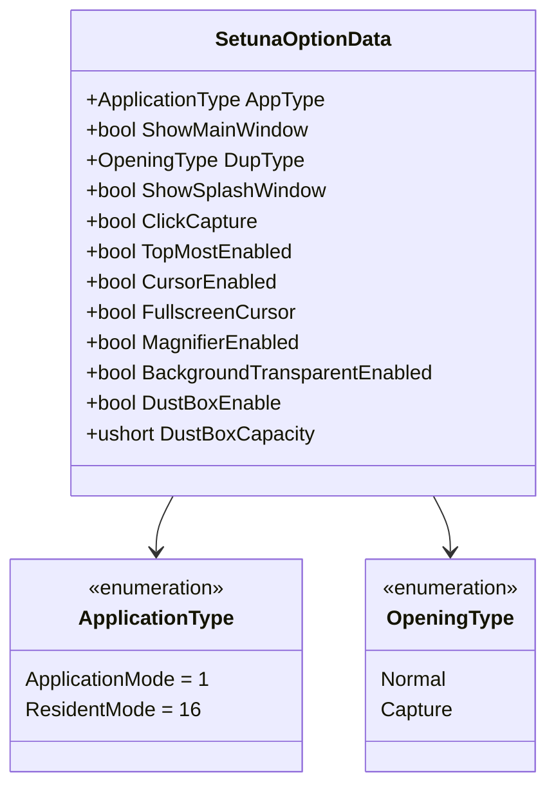
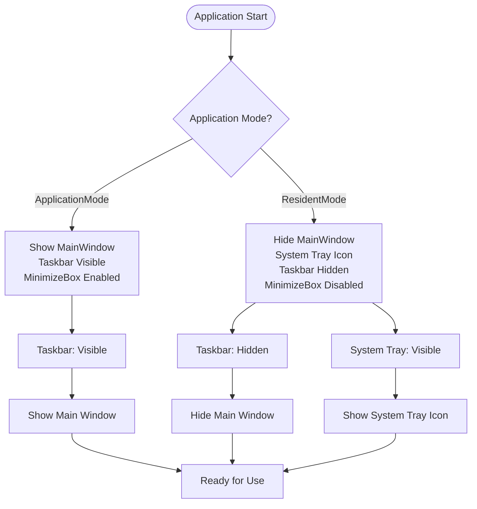
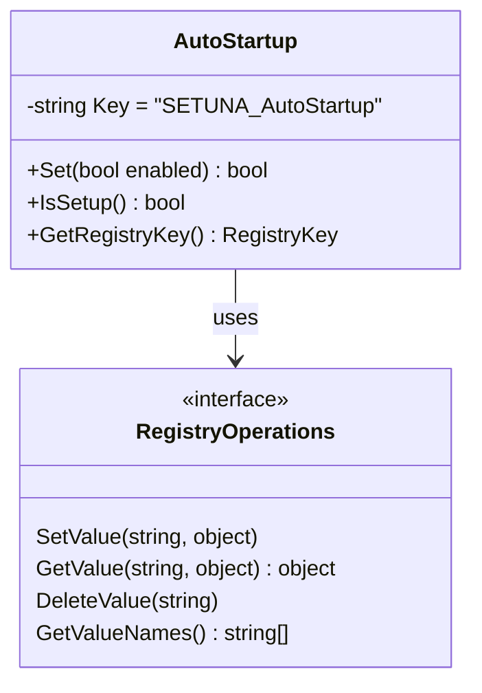
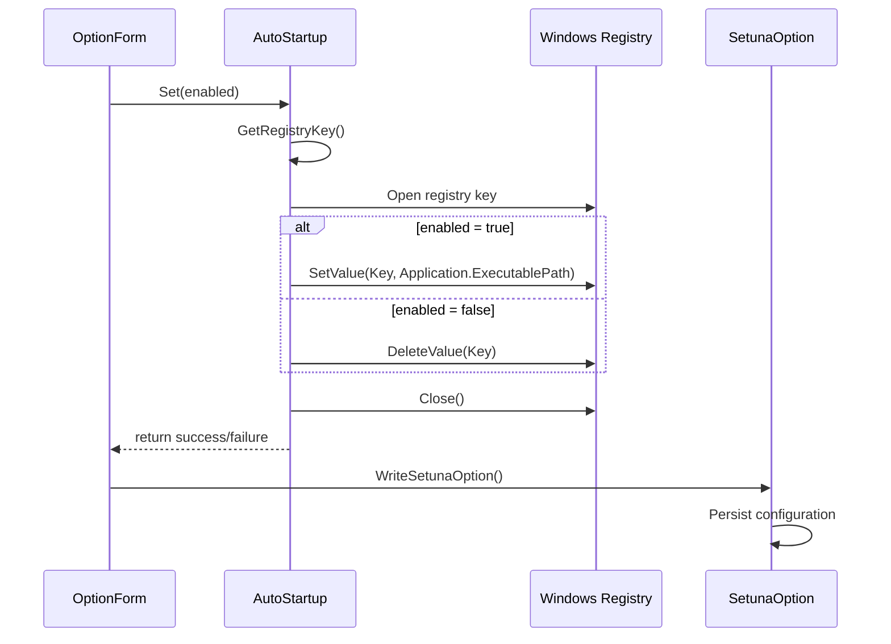
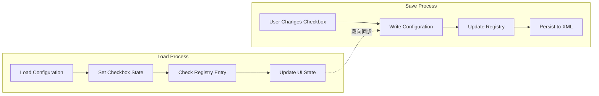
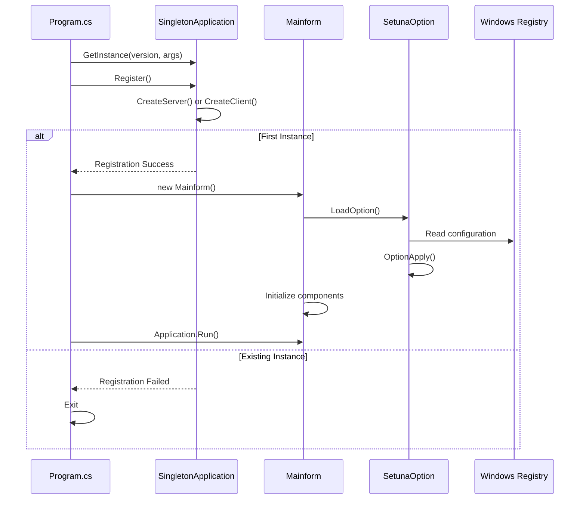
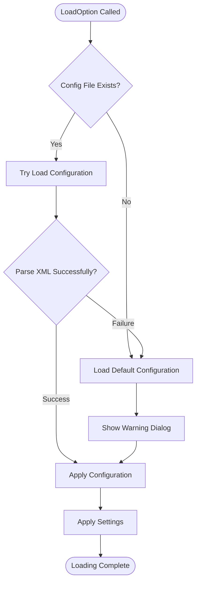
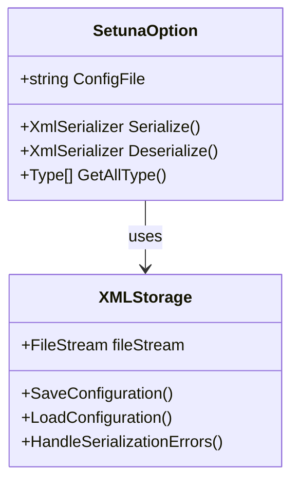
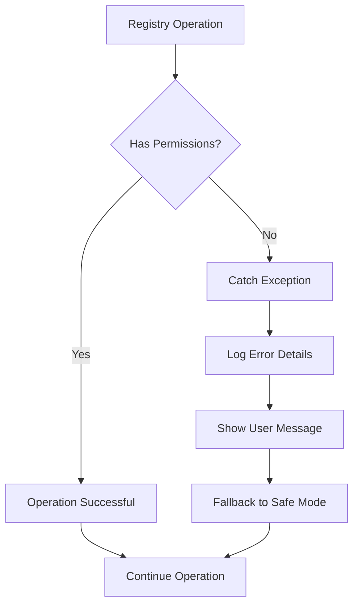

# Startup Configuration

<cite>
**Referenced Files in This Document**
- [SetunaOption.cs](file://SETUNA/Main/Option/SetunaOption.cs)
- [AutoStartup.cs](file://SETUNA/Main/Startup/AutoStartup.cs)
- [OptionForm.cs](file://SETUNA/Main/Option/OptionForm.cs)
- [Program.cs](file://SETUNA/Program.cs)
- [Mainform.cs](file://SETUNA/Mainform.cs)
- [SingletonApplication.cs](file://SETUNA/com/clearunit/SingletonApplication.cs)
</cite>

## Table of Contents
1. [Introduction](#introduction)
2. [System Architecture](#system-architecture)
3. [SetunaOption Class Configuration](#setunaoption-class-configuration)
4. [AutoStartup Utility Implementation](#autostartup-utility-implementation)
5. [UI Implementation in OptionForm](#ui-implementation-in-optionform)
6. [Application Initialization Process](#application-initialization-process)
7. [Configuration Persistence](#configuration-persistence)
8. [Common Issues and Debugging](#common-issues-and-debugging)
9. [Best Practices](#best-practices)
10. [Troubleshooting Guide](#troubleshooting-guide)

## Introduction

The startup configuration system in SETUNA manages how the application initializes and integrates with the Windows operating system during system boot. This comprehensive system handles automatic startup functionality through Windows Registry modifications, application mode selection (ApplicationMode vs ResidentMode), and main window visibility settings. The configuration is persisted to XML files and synchronized across application sessions.

The system consists of several interconnected components that work together to provide seamless startup behavior customization while maintaining system stability and user experience quality.

## System Architecture

The startup configuration system follows a layered architecture with clear separation of concerns:

**Diagram sources**
- [Program.cs](file://SETUNA/Program.cs#L11-L30)
- [Mainform.cs](file://SETUNA/Mainform.cs#L23-L46)
- [SetunaOption.cs](file://SETUNA/Main/Option/SetunaOption.cs#L15-L16)
- [AutoStartup.cs](file://SETUNA/Main/Startup/AutoStartup.cs#L7-L81)

## SetunaOption Class Configuration

The SetunaOption class serves as the central configuration model that manages all startup-related settings through the SetunaOptionData nested class.

### Application Mode Enumeration

The system defines two primary application modes through the ApplicationType enumeration:

**Diagram sources**
- [SetunaOption.cs](file://SETUNA/Main/Option/SetunaOption.cs#L1136-L1142)
- [SetunaOption.cs](file://SETUNA/Main/Option/SetunaOption.cs#L1145-L1151)

### Configuration Properties

The SetunaOptionData class contains numerous properties that control startup behavior:

| Property | Type | Description | Default Value |
|----------|------|-------------|---------------|
| AppType | ApplicationType | Application execution mode | ApplicationMode |
| ShowMainWindow | bool | Display main window on startup | true |
| DupType | OpeningType | Duplicate instance handling | Normal |
| ShowSplashWindow | bool | Show splash screen | true |
| TopMostEnabled | bool | Enable topmost window behavior | false |
| CursorEnabled | bool | Enable custom cursor | false |
| FullscreenCursor | bool | Enable fullscreen cursor mode | false |
| MagnifierEnabled | bool | Enable magnifier functionality | false |
| BackgroundTransparentEnabled | bool | Enable transparent background | false |

**Section sources**
- [SetunaOption.cs](file://SETUNA/Main/Option/SetunaOption.cs#L1006-L1132)

### Startup Behavior Logic

The application mode affects several aspects of startup behavior:

**Diagram sources**
- [Mainform.cs](file://SETUNA/Mainform.cs#L292-L306)

**Section sources**
- [Mainform.cs](file://SETUNA/Mainform.cs#L292-L306)

## AutoStartup Utility Implementation

The AutoStartup utility provides centralized Windows Registry management for automatic startup functionality.

### Registry Management Functions

The utility exposes three primary methods for registry manipulation:

**Diagram sources**
- [AutoStartup.cs](file://SETUNA/Main/Startup/AutoStartup.cs#L7-L81)

### Registry Key Structure

The utility modifies the Windows Registry at the following location:
- **Registry Path**: `HKCU\Software\Microsoft\Windows\CurrentVersion\Run`
- **Value Name**: `SETUNA_AutoStartup`
- **Value Data**: Full executable path of the application

### Implementation Details

The SetunaOption class manages the relationship between UI checkboxes and registry operations:

**Diagram sources**
- [AutoStartup.cs](file://SETUNA/Main/Startup/AutoStartup.cs#L11-L42)
- [OptionForm.cs](file://SETUNA/Main/Option/OptionForm.cs#L148-L149)

**Section sources**
- [AutoStartup.cs](file://SETUNA/Main/Startup/AutoStartup.cs#L11-L81)

## UI Implementation in OptionForm

The OptionForm provides the user interface for configuring startup behavior through the '开机自启动' (Auto Startup) checkbox.

### Checkbox Integration

The checkbox synchronization works bidirectionally:

**Diagram sources**
- [OptionForm.cs](file://SETUNA/Main/Option/OptionForm.cs#L74-L149)

### Event Handling

The OptionForm implements proper event handling for startup configuration:

| Event | Handler | Purpose |
|-------|---------|---------|
| LoadSetunaOption | Checkbox initialization | Synchronize UI with current registry state |
| WriteSetunaOption | Registry update | Apply checkbox changes to registry |
| Form Closing | Configuration persistence | Save all settings including startup preferences |

**Section sources**
- [OptionForm.cs](file://SETUNA/Main/Option/OptionForm.cs#L45-L165)

## Application Initialization Process

The application startup process follows a specific sequence that ensures proper configuration loading and initialization.

### Startup Sequence

**Diagram sources**
- [Program.cs](file://SETUNA/Program.cs#L11-L30)
- [SingletonApplication.cs](file://SETUNA/com/clearunit/SingletonApplication.cs#L42-L49)

### Configuration Loading

The Mainform.LoadOption method handles configuration loading with fallback to defaults:

**Diagram sources**
- [Mainform.cs](file://SETUNA/Mainform.cs#L421-L448)

**Section sources**
- [Mainform.cs](file://SETUNA/Mainform.cs#L421-L448)

## Configuration Persistence

The configuration system uses XML serialization for persistent storage with robust error handling.

### XML Serialization Process

**Diagram sources**
- [SetunaOption.cs](file://SETUNA/Main/Option/SetunaOption.cs#L574-L585)
- [Mainform.cs](file://SETUNA/Mainform.cs#L403-L418)

### Configuration File Location

The configuration file is stored in the application's startup directory:
- **Path**: `{Application.StartupPath}\SetunaConfig.xml`
- **Creation**: Automatically creates directory if it doesn't exist
- **Permissions**: Requires write access to application directory

**Section sources**
- [SetunaOption.cs](file://SETUNA/Main/Option/SetunaOption.cs#L574-L585)
- [Mainform.cs](file://SETUNA/Mainform.cs#L403-L418)

## Common Issues and Debugging

### Permission Errors During Registry Modification

Registry modification failures are common and require proper error handling:

**Diagram sources**
- [AutoStartup.cs](file://SETUNA/Main/Startup/AutoStartup.cs#L31-L34)

### Startup Script Conflicts

Potential conflicts include:
- **Multiple Instances**: Singleton pattern prevents multiple instances
- **Conflicting Registry Entries**: Unique key naming prevents collisions
- **Permission Issues**: UAC elevation requirements for certain registry locations

### Debugging Startup Behavior

Key debugging approaches:

| Issue Category | Debugging Method | Tools |
|----------------|------------------|-------|
| Registry Access | Check registry permissions | regedit, Process Monitor |
| Configuration Loading | Verify XML file existence | File Explorer, Debugger |
| Singleton Behavior | Monitor IPC channels | Network Monitor, Debug Output |
| Application Mode | Check form properties | Visual Studio Debugger |

**Section sources**
- [AutoStartup.cs](file://SETUNA/Main/Startup/AutoStartup.cs#L31-L42)
- [SingletonApplication.cs](file://SETUNA/com/clearunit/SingletonApplication.cs#L53-L68)

## Best Practices

### Configuration Management

1. **Always Backup Current Settings**: Before modifying registry entries, verify current state
2. **Implement Proper Error Handling**: Catch and log exceptions during registry operations
3. **Validate Configuration Data**: Ensure configuration values fall within acceptable ranges
4. **Provide User Feedback**: Inform users of successful/unsuccessful operations

### Security Considerations

1. **Registry Permissions**: Check write permissions before attempting modifications
2. **Path Validation**: Validate executable paths to prevent malicious injection
3. **Access Control**: Respect user privacy and system security policies
4. **Error Reporting**: Provide meaningful error messages without exposing sensitive information

### Performance Optimization

1. **Lazy Loading**: Load configuration only when needed
2. **Efficient Serialization**: Use appropriate XML serialization settings
3. **Minimal Registry Access**: Batch registry operations when possible
4. **Resource Cleanup**: Properly dispose of registry keys and streams

## Troubleshooting Guide

### Automatic Startup Not Working

**Symptoms**: Application doesn't start automatically on system boot

**Diagnosis Steps**:
1. Check registry entry: `HKCU\Software\Microsoft\Windows\CurrentVersion\Run`
2. Verify executable path is correct and accessible
3. Test manual execution of the startup command
4. Check Windows Task Manager for startup processes

**Resolution**:
- Recreate registry entry using the AutoStartup utility
- Verify application file permissions
- Check Windows startup settings

### Configuration File Corruption

**Symptoms**: Application loads default settings despite saved configuration

**Diagnosis Steps**:
1. Verify XML file syntax validity
2. Check file permissions and accessibility
3. Compare with backup configurations if available
4. Test with clean configuration file

**Resolution**:
- Restore from backup configuration
- Recreate configuration file manually
- Reset to default configuration

### UI Checkbox Synchronization Issues

**Symptoms**: Checkbox state doesn't match actual registry configuration

**Diagnosis Steps**:
1. Verify registry entry exists and is correct
2. Check OptionForm.LoadSetunaOption implementation
3. Validate AutoStartup.IsSetup() method
4. Test configuration persistence

**Resolution**:
- Force reload configuration from registry
- Clear and recreate UI state
- Verify event handler connections

**Section sources**
- [AutoStartup.cs](file://SETUNA/Main/Startup/AutoStartup.cs#L45-L72)
- [OptionForm.cs](file://SETUNA/Main/Option/OptionForm.cs#L74-L75)