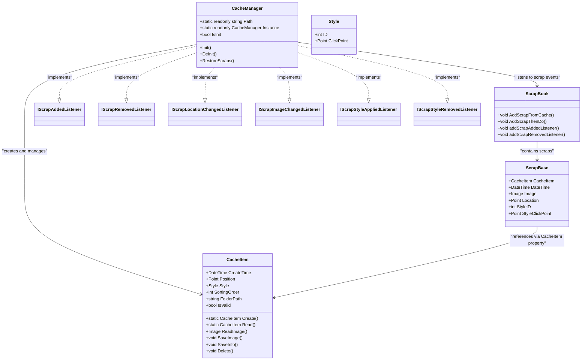

# CacheManager - Persistent Storage System

<cite>
**Referenced Files in This Document**   
- [CacheManager.cs](file://SETUNA/Main/Cache/CacheManager.cs)
- [CacheItem.cs](file://SETUNA/Main/Cache/CacheItem.cs)
- [ScrapBase.cs](file://SETUNA/Main/ScrapBase.cs)
- [ScrapBook.cs](file://SETUNA/Main/ScrapBook.cs)
</cite>

## Table of Contents
1. [Introduction](#introduction)
2. [Architecture Overview](#architecture-overview)
3. [Core Components](#core-components)
4. [Initialization and Restoration Process](#initialization-and-restoration-process)
5. [Event-Driven Persistence Mechanism](#event-driven-persistence-mechanism)
6. [Directory Structure and Serialization](#directory-structure-and-serialization)
7. [Data Integrity and Recovery](#data-integrity-and-recovery)
8. [Lifecycle Management](#lifecycle-management)
9. [Conclusion](#conclusion)

## Introduction

The CacheManager class provides a persistent storage system for scraps in the SETUNA application, ensuring that user-created content survives application restarts. This documentation details the architecture and implementation of the caching system, focusing on its event-driven design, asynchronous restoration process, and integration with the application's core components. The system automatically persists scrap state changes to disk through multiple listener interfaces and restores previously saved scraps during initialization.

## Architecture Overview

The persistent storage system is built around the CacheManager singleton that implements multiple listener interfaces to capture scrap state changes. The architecture follows a clean separation between the in-memory representation of scraps and their persistent storage on disk.

**Diagram sources**
- [CacheManager.cs](file://SETUNA/Main/Cache/CacheManager.cs#L7-L160)
- [CacheItem.cs](file://SETUNA/Main/Cache/CacheItem.cs#L9-L157)
- [ScrapBase.cs](file://SETUNA/Main/ScrapBase.cs#L16-L594)
- [ScrapBook.cs](file://SETUNA/Main/ScrapBook.cs#L10-L373)

**Section sources**
- [CacheManager.cs](file://SETUNA/Main/Cache/CacheManager.cs#L7-L160)
- [CacheItem.cs](file://SETUNA/Main/Cache/CacheItem.cs#L9-L157)

## Core Components

The persistent storage system consists of two primary components: CacheManager and CacheItem. The CacheManager acts as the central coordinator, implementing listener interfaces to respond to scrap lifecycle events, while CacheItem represents the serialized state of a scrap on disk.

The CacheManager is implemented as a singleton with a static Instance property, ensuring a single point of control for cache operations across the application. It maintains an IsInit flag to track initialization status and provides methods for initialization and cleanup.

The CacheItem class encapsulates all persistent data for a scrap, including creation time, position, applied style, and sorting order. It provides methods for reading and writing both image data and metadata to the file system.

**Section sources**
- [CacheManager.cs](file://SETUNA/Main/Cache/CacheManager.cs#L7-L160)
- [CacheItem.cs](file://SETUNA/Main/Cache/CacheItem.cs#L9-L157)

## Initialization and Restoration Process

The initialization process begins when the CacheManager's Init method is called, typically during application startup. This process restores previously saved scraps from the local application data directory in a way that prevents UI blocking.

**Diagram sources**
- [CacheManager.cs](file://SETUNA/Main/Cache/CacheManager.cs#L17-L71)
- [ScrapBook.cs](file://SETUNA/Main/ScrapBook.cs#L133-L165)

**Section sources**
- [CacheManager.cs](file://SETUNA/Main/Cache/CacheManager.cs#L17-L71)
- [ScrapBook.cs](file://SETUNA/Main/ScrapBook.cs#L133-L165)

The restoration process uses recursive callbacks to achieve asynchronous loading, preventing the UI from becoming unresponsive during startup. The RestoreScraps method reads all cache item directories, creates CacheItem objects by reading their JSON metadata, sorts them by creation time, and then adds them to the scrap book one by one using a recursive callback pattern. This ensures that each scrap is fully initialized before the next one begins loading.

## Event-Driven Persistence Mechanism

The CacheManager implements multiple listener interfaces to automatically persist scrap state changes to disk. This event-driven approach ensures that all modifications to scraps are immediately reflected in the persistent storage.

**Diagram sources**
- [CacheManager.cs](file://SETUNA/Main/Cache/CacheManager.cs#L74-L158)

**Section sources**
- [CacheManager.cs](file://SETUNA/Main/Cache/CacheManager.cs#L74-L158)

The CacheManager implements the following listener interfaces:
- IScrapAddedListener: Creates a new CacheItem when a scrap is added
- IScrapRemovedListener: Deletes the corresponding CacheItem when a scrap is removed
- IScrapLocationChangedListener: Updates the position in the cache when a scrap is moved
- IScrapImageChangedListener: Saves the new image to disk when a scrap's image changes
- IScrapStyleAppliedListener: Updates the style information when a style is applied
- IScrapStyleRemovedListener: Clears the style information when a style is removed

Each event handler performs the necessary persistence operations to keep the disk storage synchronized with the in-memory state of the scraps.

## Directory Structure and Serialization

The persistent storage system uses a structured directory layout under the user's local application data directory to store cached scraps. Each scrap is stored in its own subdirectory with a unique name based on its creation time.

**Diagram sources**
- [CacheManager.cs](file://SETUNA/Main/Cache/CacheManager.cs#L9-L10)
- [CacheItem.cs](file://SETUNA/Main/Cache/CacheItem.cs#L25-L34)

**Section sources**
- [CacheManager.cs](file://SETUNA/Main/Cache/CacheManager.cs#L9-L10)
- [CacheItem.cs](file://SETUNA/Main/Cache/CacheItem.cs#L25-L34)

The cache root directory is located at `%LocalAppData%\SETUNA`, created using Environment.SpecialFolder.LocalApplicationData. Each cache item is stored in a subdirectory named with a custom string representation of its creation time (CreateTime.ToCustomString()). Within each cache item directory, two files are stored:
- Image.png: The scrap's image data in PNG format
- Info.json: Metadata including position, style information, and sorting order in JSON format

The serialization mechanism uses Newtonsoft.Json for JSON serialization of metadata and System.Drawing for PNG image encoding. The CacheItem class provides dedicated methods for saving and loading both image and metadata, ensuring consistent serialization across the application.

## Data Integrity and Recovery

The persistent storage system includes several mechanisms to ensure data integrity and handle potential corruption scenarios.

**Diagram sources**
- [CacheManager.cs](file://SETUNA/Main/Cache/CacheManager.cs#L31-L53)
- [CacheItem.cs](file://SETUNA/Main/Cache/CacheItem.cs#L27-L34)

**Section sources**
- [CacheManager.cs](file://SETUNA/Main/Cache/CacheManager.cs#L31-L53)
- [CacheItem.cs](file://SETUNA/Main/Cache/CacheItem.cs#L27-L34)

The system employs the following data integrity measures:
1. Directory existence check: The cache directory is created if it doesn't exist
2. Item validation: Each cache item is validated by checking if its image file exists
3. Error handling: Invalid cache items are skipped during restoration
4. Atomic operations: Image and metadata are saved separately but consistently

The IsValid property of CacheItem checks for the existence of the image file, providing a simple mechanism to identify corrupted or incomplete cache entries. During initialization, invalid items are simply skipped, allowing the application to continue with valid data.

## Lifecycle Management

The lifecycle of cache items is tightly integrated with the lifecycle of scraps through the CacheItem property in the ScrapBase class. This integration ensures that cache items are created when scraps are added and deleted when scraps are removed.

**Diagram sources**
- [CacheManager.cs](file://SETUNA/Main/Cache/CacheManager.cs#L74-L131)
- [ScrapBase.cs](file://SETUNA/Main/ScrapBase.cs#L566-L577)

**Section sources**
- [CacheManager.cs](file://SETUNA/Main/Cache/CacheManager.cs#L74-L131)
- [ScrapBase.cs](file://SETUNA/Main/ScrapBase.cs#L566-L577)

The lifecycle management follows these principles:
1. Creation: When a scrap is added, a new CacheItem is created and associated with the scrap
2. Association: The CacheItem reference is stored in the scrap's CacheItem property
3. Synchronization: All state changes are automatically persisted through event handlers
4. Cleanup: When a scrap is removed, its CacheItem is deleted from disk and the reference is cleared

This approach ensures that the persistent storage accurately reflects the current state of the application's scraps while maintaining data consistency across sessions.

## Conclusion

The CacheManager class provides a robust persistent storage system for the SETUNA application, ensuring that user-created scraps are preserved across application sessions. Through its implementation of multiple listener interfaces, the system automatically captures and persists all state changes to scraps, including location, image, and style modifications.

The initialization process uses an asynchronous, recursive callback approach to restore previously saved scraps without blocking the UI, while the directory structure under %LocalAppData%\SETUNA provides organized storage with clear separation between image data and metadata. The integration with ScrapBase through the CacheItem property ensures proper lifecycle management, with cache items being created on scrap addition and deleted on removal.

Data integrity is maintained through validation checks and error handling, allowing the system to gracefully handle corrupted cache entries. The overall architecture demonstrates a clean separation of concerns, with the CacheManager handling coordination and persistence, while CacheItem manages the serialization details.

This persistent storage system effectively balances performance, reliability, and maintainability, providing a seamless experience for users who expect their created content to persist across application restarts.