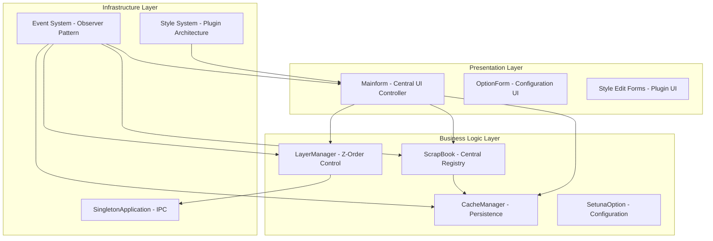
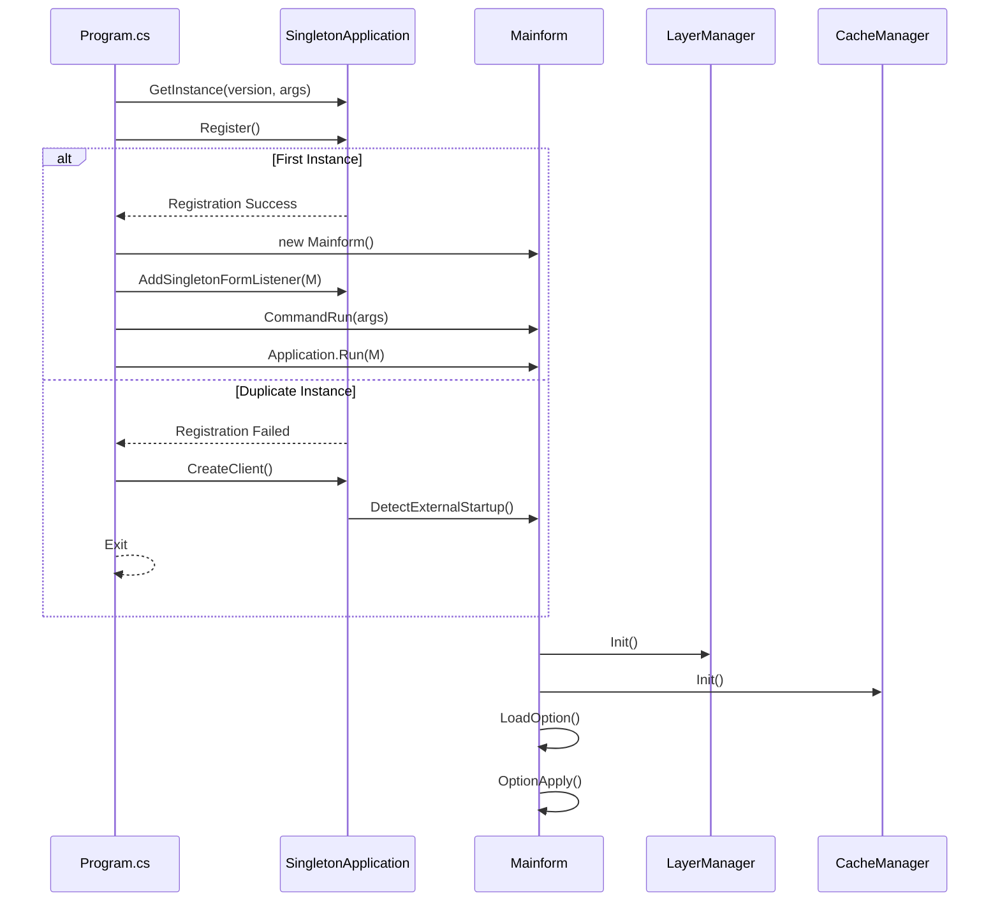
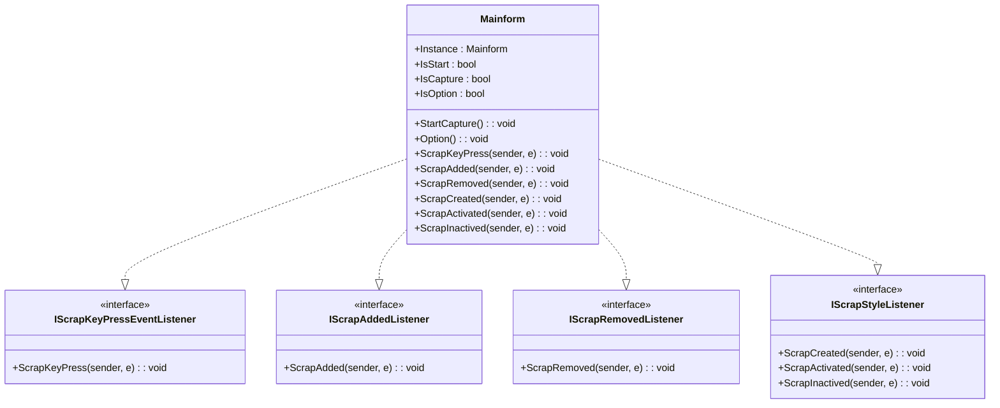
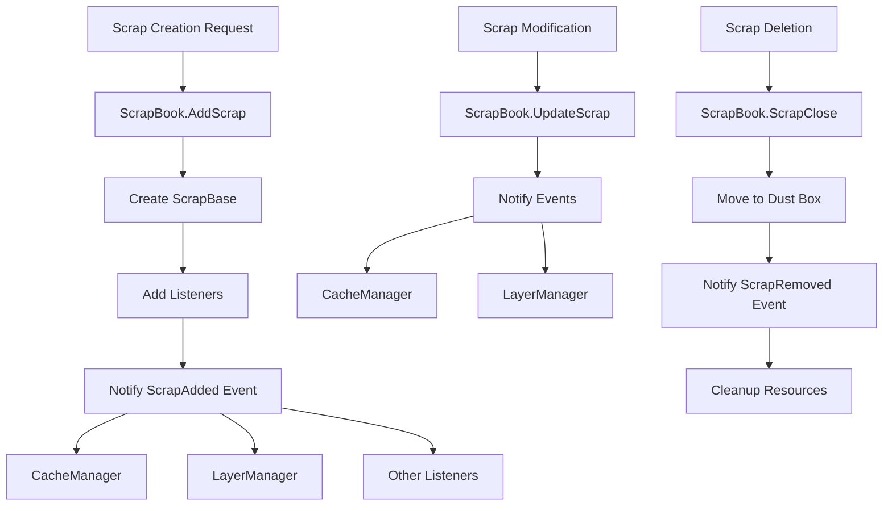
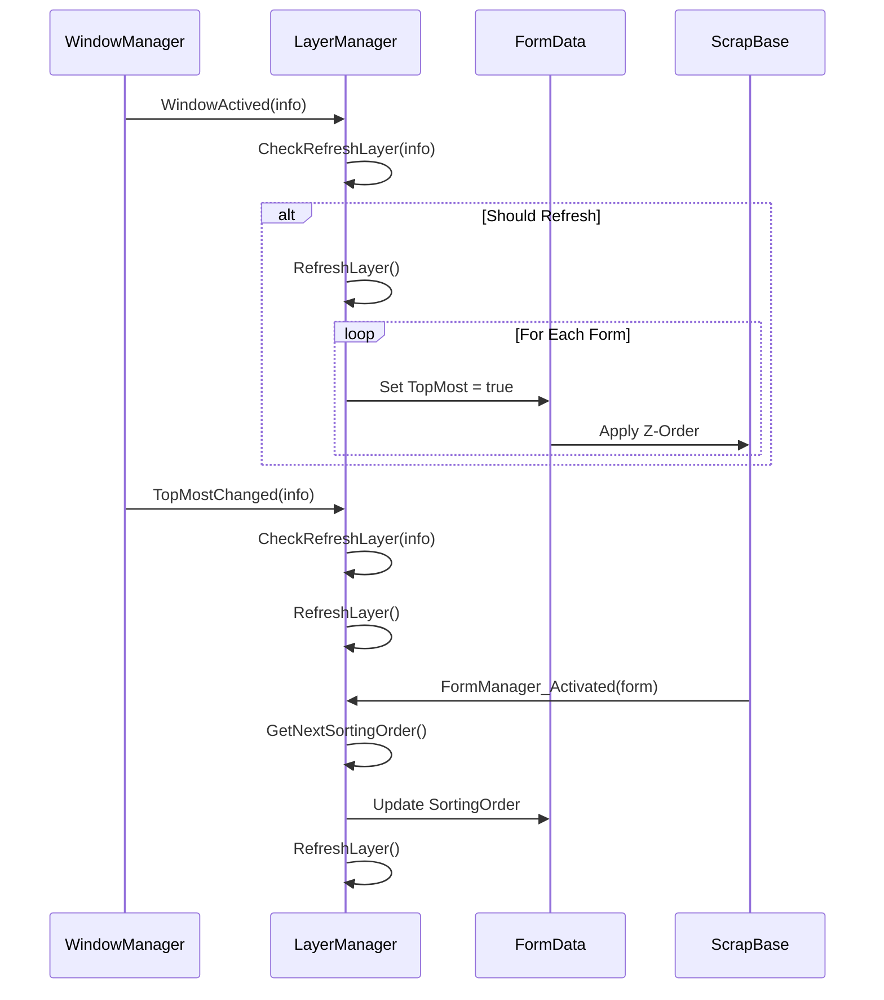
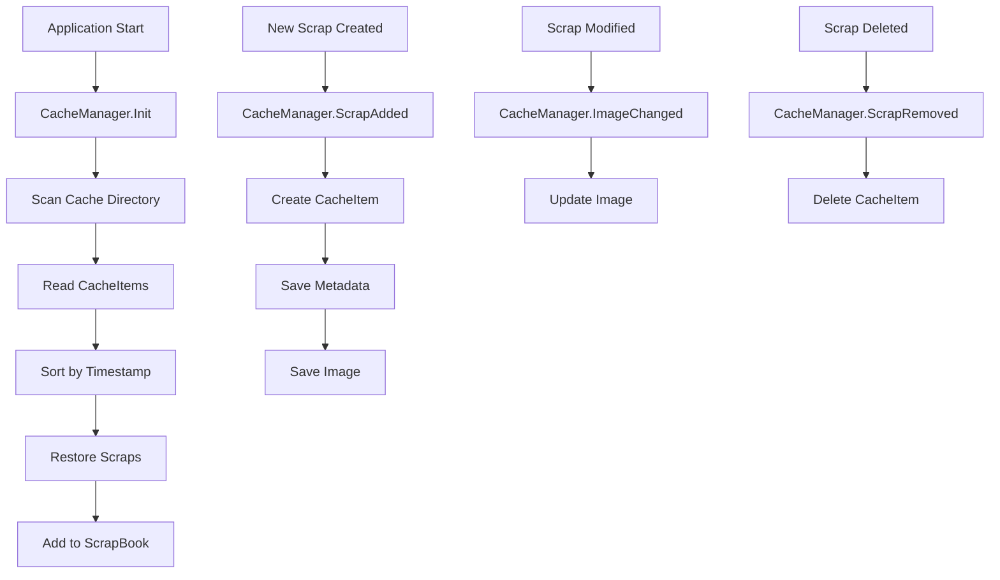
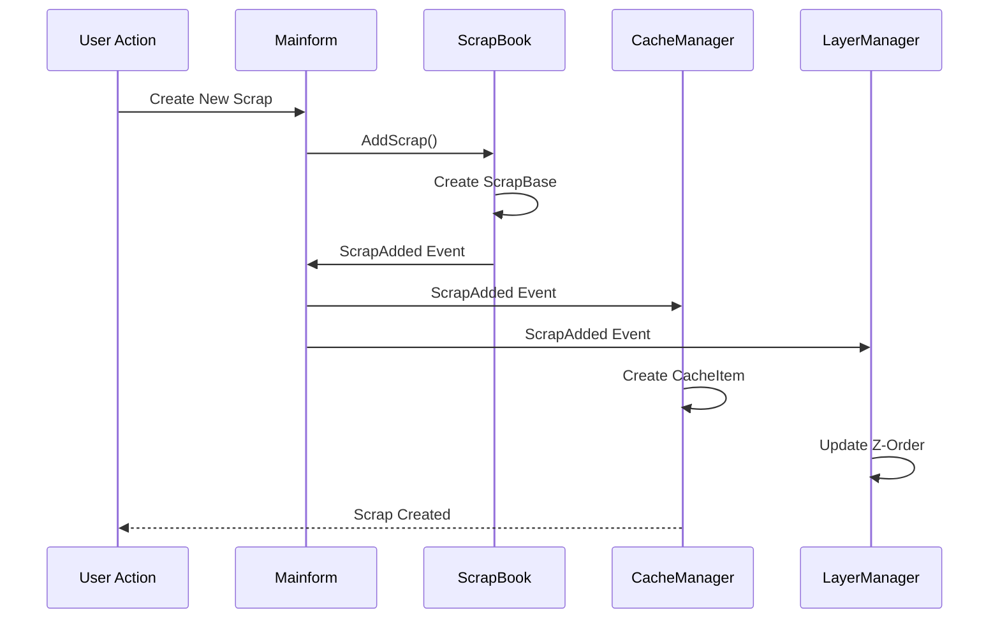
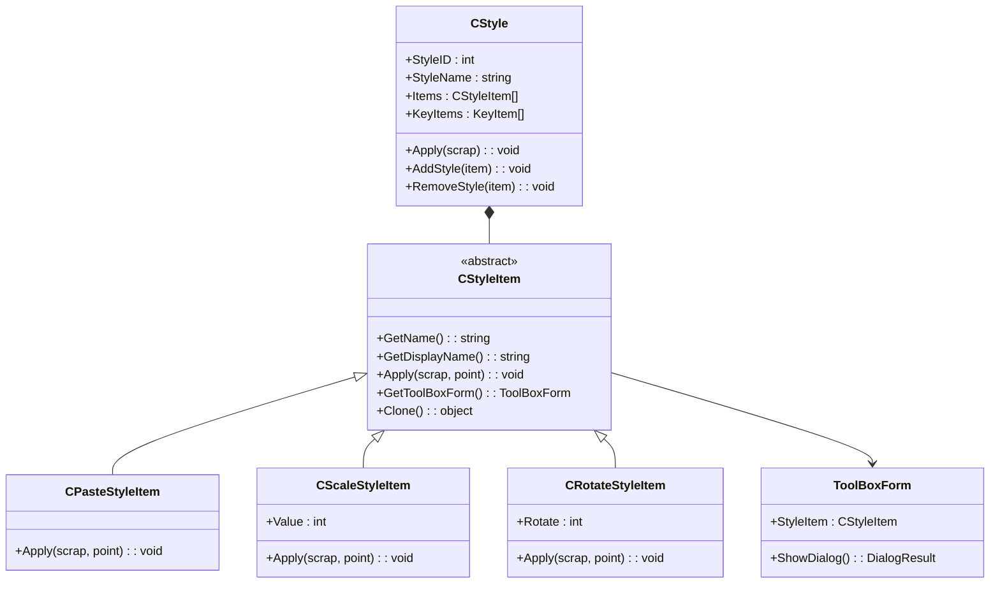
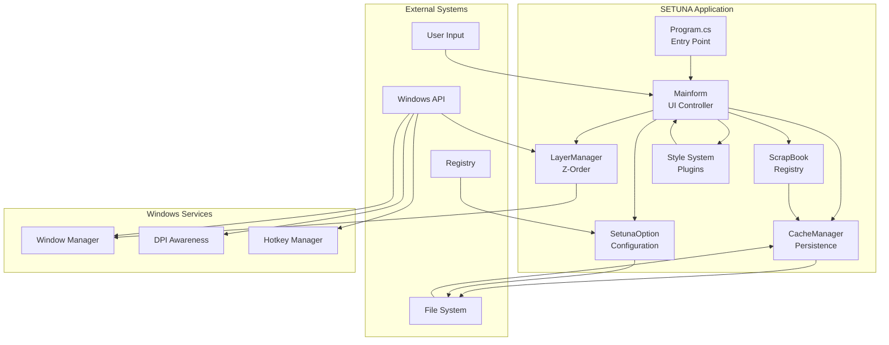

# Core Architecture

<cite>
**Referenced Files in This Document**
- [Program.cs](file://SETUNA/Program.cs)
- [Mainform.cs](file://SETUNA/Mainform.cs)
- [ScrapBook.cs](file://SETUNA/Main/ScrapBook.cs)
- [LayerManager.cs](file://SETUNA/Main/Layer/LayerManager.cs)
- [CacheManager.cs](file://SETUNA/Main/Cache/CacheManager.cs)
- [SingletonApplication.cs](file://SETUNA/com/clearunit/SingletonApplication.cs)
- [SetunaOption.cs](file://SETUNA/Main/Option/SetunaOption.cs)
- [CStyle.cs](file://SETUNA/Main/Style/CStyle.cs)
- [CStyleItem.cs](file://SETUNA/Main/StyleItems/CStyleItem.cs)
- [BaseForm.cs](file://SETUNA/Main/Common/BaseForm.cs)
- [IFormActivatedListener.cs](file://SETUNA/Main/IFormActivatedListener.cs)
- [IScrapStyleListener.cs](file://SETUNA/Main/IScrapStyleListener.cs)
</cite>

## Table of Contents
1. [Introduction](#introduction)
2. [System Overview](#system-overview)
3. [Entry Point Architecture](#entry-point-architecture)
4. [Central UI Controller](#central-ui-controller)
5. [Component Registry System](#component-registry-system)
6. [Z-Order Management](#z-order-management)
7. [Persistence Layer](#persistence-layer)
8. [Event-Driven Architecture](#event-driven-architecture)
9. [Plugin-Style Architecture](#plugin-style-architecture)
10. [Cross-Cutting Concerns](#cross-cutting-concerns)
11. [Technology Stack](#technology-stack)
12. [System Context Diagram](#system-context-diagram)
13. [Conclusion](#conclusion)

## Introduction

SETUNA is a sophisticated screenshot management application built on Windows Forms with a robust event-driven architecture. The system employs singleton managers, plugin-style components, and MVC-like separation to create a modular and extensible desktop application. The architecture emphasizes loose coupling through interface-based design patterns while maintaining high cohesion within specialized subsystems.

The application serves as a clipboard replacement for screenshots, providing advanced manipulation capabilities, persistent storage, and intelligent z-order management across multiple monitors with varying DPI settings.

## System Overview

The SETUNA architecture follows a layered approach with clear separation of concerns:

**Diagram sources**
- [Mainform.cs](file://SETUNA/Mainform.cs#L18-L42)
- [ScrapBook.cs](file://SETUNA/Main/ScrapBook.cs#L10-L68)
- [LayerManager.cs](file://SETUNA/Main/Layer/LayerManager.cs#L8-L35)
- [CacheManager.cs](file://SETUNA/Main/Cache/CacheManager.cs#L7-L30)

## Entry Point Architecture

The application initialization follows a structured startup sequence managed by the Program.cs entry point:

**Diagram sources**
- [Program.cs](file://SETUNA/Program.cs#L11-L30)
- [SingletonApplication.cs](file://SETUNA/com/clearunit/SingletonApplication.cs#L18-L49)

**Section sources**
- [Program.cs](file://SETUNA/Program.cs#L11-L30)
- [SingletonApplication.cs](file://SETUNA/com/clearunit/SingletonApplication.cs#L18-L49)

## Central UI Controller

Mainform serves as the central orchestrator of the application, implementing multiple listener interfaces and acting as the primary event hub:

### Key Responsibilities:
- **UI Coordination**: Manages the main application window and taskbar icon
- **Event Aggregation**: Coordinates events between UI components and business logic
- **Command Processing**: Handles command-line arguments and external startup requests
- **Configuration Management**: Integrates with SetunaOption for runtime settings
- **Form Lifecycle**: Manages the creation and destruction of scrap windows

### Event Listener Implementation:
The Mainform implements numerous interfaces for comprehensive event coverage:

**Diagram sources**
- [Mainform.cs](file://SETUNA/Mainform.cs#L18-L25)
- [IScrapKeyPressEventListener.cs](file://SETUNA/Main/IScrapKeyPressEventListener.cs#L4-L8)
- [IScrapAddedListener.cs](file://SETUNA/Main/IScrapAddedListener.cs#L4-L8)
- [IScrapRemovedListener.cs](file://SETUNA/Main/IScrapRemovedListener.cs#L4-L8)
- [IScrapStyleListener.cs](file://SETUNA/Main/IScrapStyleListener.cs#L4-L21)

**Section sources**
- [Mainform.cs](file://SETUNA/Mainform.cs#L18-L42)
- [IScrapKeyPressEventListener.cs](file://SETUNA/Main/IScrapKeyPressEventListener.cs#L4-L8)

## Component Registry System

ScrapBook acts as the central registry for all scrap objects, implementing the observer pattern for event distribution:

### Core Architecture:
- **Collection Management**: Maintains lists of active and deleted scraps
- **Event Broadcasting**: Distributes events to registered listeners
- **Lifecycle Management**: Coordinates scrap creation, modification, and deletion
- **Dust Box Integration**: Provides temporary storage for deleted scraps

### Event Flow Architecture:

**Diagram sources**
- [ScrapBook.cs](file://SETUNA/Main/ScrapBook.cs#L115-L191)
- [CacheManager.cs](file://SETUNA/Main/Cache/CacheManager.cs#L74-L105)

**Section sources**
- [ScrapBook.cs](file://SETUNA/Main/ScrapBook.cs#L10-L68)
- [ScrapBook.cs](file://SETUNA/Main/ScrapBook.cs#L115-L191)

## Z-Order Management

LayerManager provides sophisticated z-order control across multiple monitors and applications:

### Architecture Components:
- **Window Tracking**: Monitors window activation and z-order changes
- **Sorting System**: Implements intelligent layer ordering based on user interaction
- **Filter System**: Applies filters to determine which windows to manage
- **Optimization Engine**: Prevents z-order counter overflow through periodic cleanup

### Z-Order Control Flow:

**Diagram sources**
- [LayerManager.cs](file://SETUNA/Main/Layer/LayerManager.cs#L124-L190)
- [LayerManager.cs](file://SETUNA/Main/Layer/LayerManager.cs#L244-L271)

**Section sources**
- [LayerManager.cs](file://SETUNA/Main/Layer/LayerManager.cs#L8-L35)
- [LayerManager.cs](file://SETUNA/Main/Layer/LayerManager.cs#L80-L120)

## Persistence Layer

CacheManager handles the persistence of scrap data across application sessions:

### Storage Architecture:
- **Directory Structure**: Organizes cached scraps in timestamp-based directories
- **Metadata Management**: Stores position, style, and creation information
- **Image Persistence**: Manages bitmap storage with compression optimization
- **Recovery System**: Restores cached scraps during application startup

### Persistence Workflow:

**Diagram sources**
- [CacheManager.cs](file://SETUNA/Main/Cache/CacheManager.cs#L17-L71)
- [CacheManager.cs](file://SETUNA/Main/Cache/CacheManager.cs#L74-L105)

**Section sources**
- [CacheManager.cs](file://SETUNA/Main/Cache/CacheManager.cs#L7-L30)
- [CacheManager.cs](file://SETUNA/Main/Cache/CacheManager.cs#L31-L71)

## Event-Driven Architecture

The system employs a comprehensive event-driven architecture with multiple listener interfaces:

### Event System Design:
- **Observer Pattern**: Multiple interfaces for different event types
- **Decoupled Communication**: Listeners register for specific events
- **Event Aggregation**: Mainform coordinates cross-component events
- **Thread Safety**: Event handlers execute in appropriate contexts

### Event Types and Interfaces:
| Interface | Purpose | Event Handlers |
|-----------|---------|----------------|
| IScrapAddedListener | New scrap creation | ScrapAdded |
| IScrapRemovedListener | Scrap deletion | ScrapRemoved |
| IScrapStyleListener | Style changes | ScrapCreated, ScrapActivated, ScrapInactived |
| IScrapKeyPressEventListener | Keyboard shortcuts | ScrapKeyPress |
| IScrapLocationChangedListener | Position changes | ScrapLocationChanged |
| IScrapImageChangedListener | Content modifications | ScrapImageChanged |

### Event Flow Example:

**Diagram sources**
- [Mainform.cs](file://SETUNA/Mainform.cs#L512-L518)
- [ScrapBook.cs](file://SETUNA/Main/ScrapBook.cs#L182-L185)
- [CacheManager.cs](file://SETUNA/Main/Cache/CacheManager.cs#L74-L82)

**Section sources**
- [Mainform.cs](file://SETUNA/Mainform.cs#L512-L518)
- [ScrapBook.cs](file://SETUNA/Main/ScrapBook.cs#L302-L318)

## Plugin-Style Architecture

The style system implements a plugin-like architecture through CStyle and CStyleItem components:

### Style System Architecture:
- **CStyle**: Container for multiple style items with keyboard shortcuts
- **CStyleItem**: Individual manipulations (crop, rotate, scale, etc.)
- **ToolBox Forms**: UI panels for style configuration
- **Extensible Design**: New styles can be added without modifying core code

### Plugin Integration Flow:

**Diagram sources**
- [CStyle.cs](file://SETUNA/Main/Style/CStyle.cs#L11-L94)
- [CStyleItem.cs](file://SETUNA/Main/StyleItems/CStyleItem.cs#L8-L71)

**Section sources**
- [CStyle.cs](file://SETUNA/Main/Style/CStyle.cs#L11-L94)
- [CStyleItem.cs](file://SETUNA/Main/StyleItems/CStyleItem.cs#L8-L71)

## Cross-Cutting Concerns

### Configuration Management
SetunaOption provides centralized configuration management with XML serialization:

- **Persistent Storage**: Configuration saved as XML file
- **Default Values**: Comprehensive default configuration
- **Validation**: Runtime validation of configuration values
- **Hot Reload**: Dynamic configuration updates without restart

### Inter-Process Communication
SingletonApplication enables single-instance enforcement with IPC:

- **Named Pipes**: Uses .NET Remoting for cross-process communication
- **Startup Detection**: Detects and handles duplicate application instances
- **Command Forwarding**: Forwards command-line arguments to existing instance
- **Version Checking**: Ensures compatibility between instances

**Section sources**
- [SetunaOption.cs](file://SETUNA/Main/Option/SetunaOption.cs#L18-L800)
- [SingletonApplication.cs](file://SETUNA/com/clearunit/SingletonApplication.cs#L18-L113)

## Technology Stack

The application leverages the following technologies:

### Core Frameworks:
- **System.Windows.Forms**: Primary UI framework for Windows desktop applications
- **System.Drawing**: Graphics and imaging capabilities
- **System.Runtime.Remoting**: Inter-process communication infrastructure
- **Newtonsoft.Json**: JSON serialization for configuration data

### Platform Dependencies:
- **.NET Framework 4.7+**: Minimum runtime requirement
- **Windows 10 14393+**: Target operating system
- **High DPI Support**: Native support for multiple monitor configurations

### Design Patterns:
- **Singleton Pattern**: Global managers (LayerManager, CacheManager)
- **Observer Pattern**: Event-driven communication
- **Strategy Pattern**: Plugin-style style items
- **Factory Pattern**: Style item creation and management

## System Context Diagram

**Diagram sources**
- [Program.cs](file://SETUNA/Program.cs#L11-L30)
- [Mainform.cs](file://SETUNA/Mainform.cs#L18-L42)
- [ScrapBook.cs](file://SETUNA/Main/ScrapBook.cs#L10-L68)
- [LayerManager.cs](file://SETUNA/Main/Layer/LayerManager.cs#L8-L35)
- [CacheManager.cs](file://SETUNA/Main/Cache/CacheManager.cs#L7-L30)

## Conclusion

The SETUNA architecture demonstrates a well-designed Windows Forms application with sophisticated architectural patterns. The system successfully achieves:

- **Modularity**: Clear separation between UI, business logic, and infrastructure
- **Extensibility**: Plugin-style architecture allows easy addition of new features
- **Maintainability**: Interface-based design promotes loose coupling
- **Reliability**: Robust error handling and resource management
- **Performance**: Efficient z-order management and caching systems

The event-driven architecture ensures responsive user interactions while maintaining clean separation of concerns. The singleton managers provide centralized control over critical system resources, while the plugin-style architecture enables flexible feature development. This design makes SETUNA a robust foundation for screenshot management with room for future enhancements.