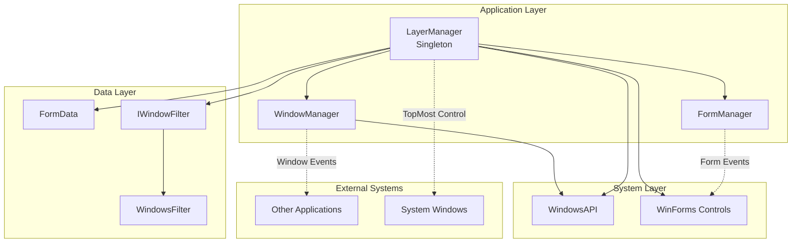
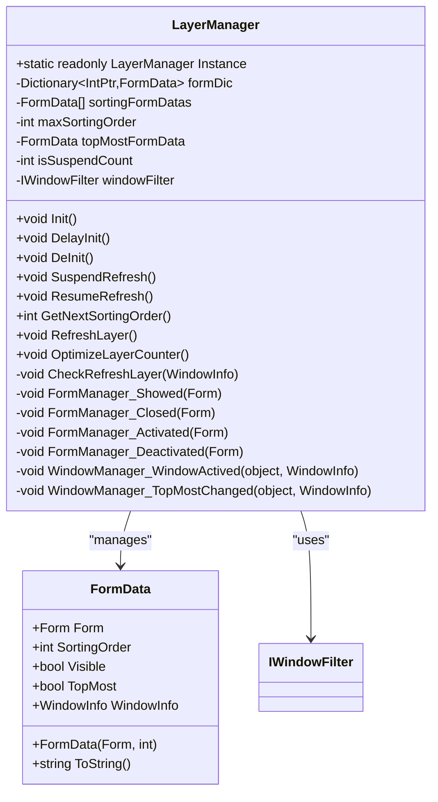
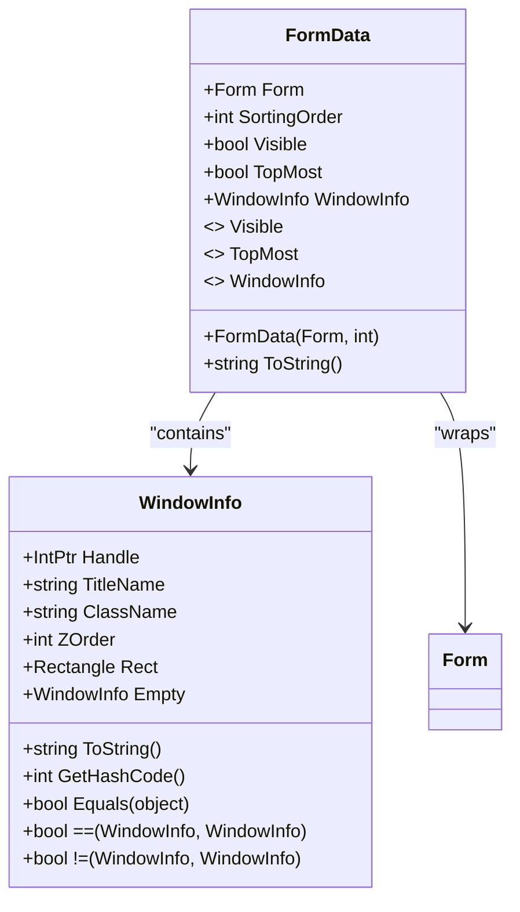
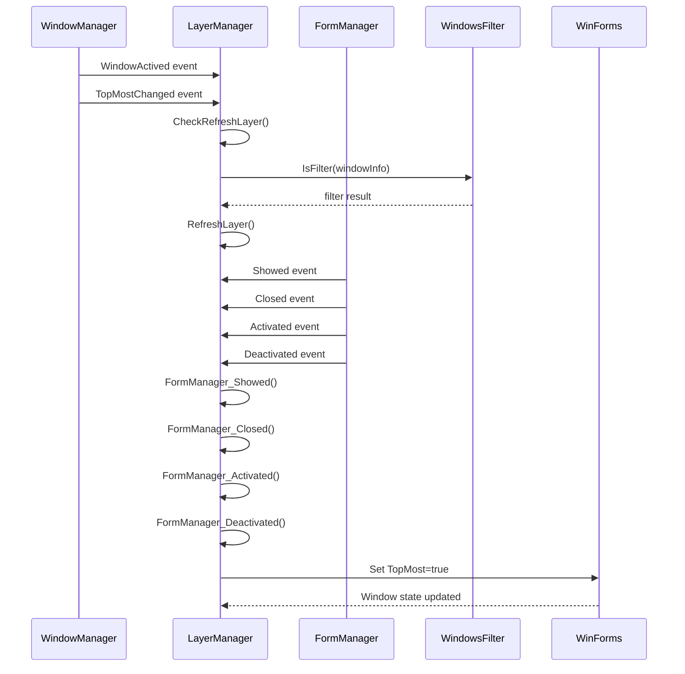
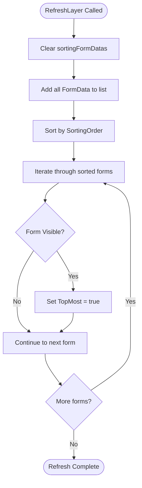
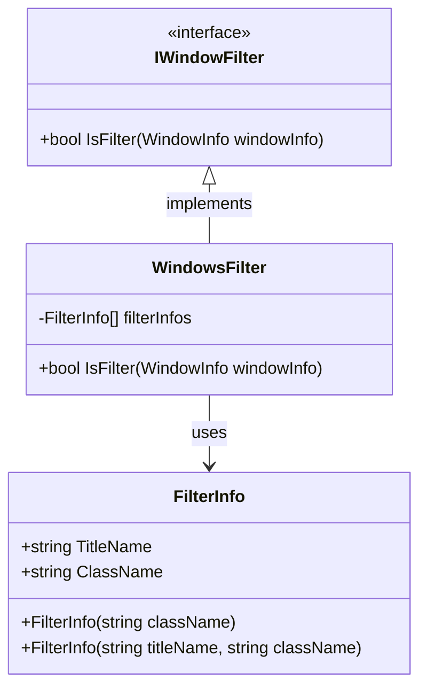
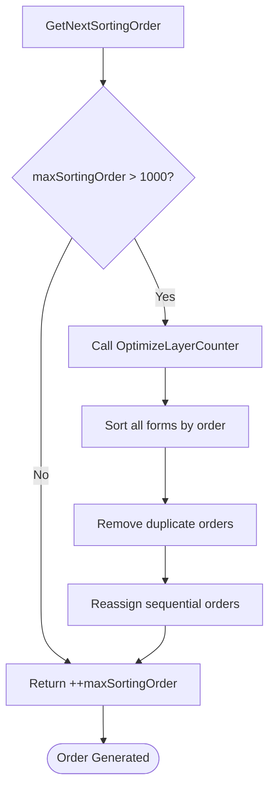

# LayerManager - Window Z-Order Control

<cite>
**Referenced Files in This Document**
- [LayerManager.cs](file://SETUNA/Main/Layer/LayerManager.cs)
- [FormManager.cs](file://SETUNA/Main/Window/FormManager.cs)
- [WindowManager.cs](file://SETUNA/Main/Window/WindowManager.cs)
- [WindowsAPI.cs](file://SETUNA/Main/Common/WindowsAPI.cs)
- [IWindowFilter.cs](file://SETUNA/Main/Layer/IWindowFilter.cs)
- [WindowsFilter.cs](file://SETUNA/Main/Layer/WindowsFilter.cs)
- [LayerManagerTests.cs](file://SETUNATests/Main/Layer/LayerManagerTests.cs)
</cite>

## Table of Contents
1. [Introduction](#introduction)
2. [System Architecture Overview](#system-architecture-overview)
3. [Singleton Pattern Implementation](#singleton-pattern-implementation)
4. [Core Data Structures](#core-data-structures)
5. [Event-Driven Architecture](#event-driven-architecture)
6. [Layer Management Algorithm](#layer-management-algorithm)
7. [Window Filtering System](#window-filtering-system)
8. [Performance Optimization](#performance-optimization)
9. [Integration Patterns](#integration-patterns)
10. [Troubleshooting and Best Practices](#troubleshooting-and-best-practices)
11. [Conclusion](#conclusion)

## Introduction

The LayerManager class serves as the central orchestrator for managing the z-order (stacking order) of application windows in SETUNA, a screenshot capture and management application. Its primary responsibility is to ensure that scrap windows (captured images and annotations) remain on top of other applications while maintaining proper visual hierarchy and preventing conflicts with system windows.

The LayerManager implements a sophisticated event-driven architecture that responds to window activation changes, form lifecycle events, and system-wide window management updates. It maintains strict control over the stacking order through a combination of sorting algorithms, filtering mechanisms, and optimization routines designed to handle high-frequency refresh operations efficiently.

## System Architecture Overview

The LayerManager operates within a multi-layered architecture that integrates with several key subsystems to achieve comprehensive window management:

**Diagram sources**
- [LayerManager.cs](file://SETUNA/Main/Layer/LayerManager.cs#L8-L320)
- [FormManager.cs](file://SETUNA/Main/Window/FormManager.cs#L7-L54)
- [WindowManager.cs](file://SETUNA/Main/Window/WindowManager.cs#L7-L106)

**Section sources**
- [LayerManager.cs](file://SETUNA/Main/Layer/LayerManager.cs#L1-L320)
- [FormManager.cs](file://SETUNA/Main/Window/FormManager.cs#L1-L54)
- [WindowManager.cs](file://SETUNA/Main/Window/WindowManager.cs#L1-L106)

## Singleton Pattern Implementation

The LayerManager implements a classic singleton pattern with thread-safe initialization and lifecycle management. The singleton instance is created eagerly during class definition, ensuring immediate availability throughout the application lifecycle.

**Diagram sources**
- [LayerManager.cs](file://SETUNA/Main/Layer/LayerManager.cs#L8-L319)
- [LayerManager.cs](file://SETUNA/Main/Layer/LayerManager.cs#L280-L319)

The singleton implementation provides several key benefits:
- **Global Accessibility**: The static Instance property ensures consistent access across all application components
- **Resource Efficiency**: Single instance prevents memory duplication and resource contention
- **Lifecycle Control**: Explicit Init() and DeInit() methods enable controlled initialization and cleanup
- **Thread Safety**: Eager initialization eliminates race conditions during concurrent access

**Section sources**
- [LayerManager.cs](file://SETUNA/Main/Layer/LayerManager.cs#L10-L57)

## Core Data Structures

The LayerManager relies on several specialized data structures to maintain window state and manage the z-order effectively:

### formDic - Window Handle Tracking

The `formDic` dictionary serves as the primary registry for all managed windows, mapping window handles (IntPtr) to their corresponding FormData objects. This structure enables O(1) lookup operations for window state queries and modifications.

### sortingFormDatas - Display Order Maintenance

The `sortingFormDatas` list maintains a sorted collection of FormData objects based on their SortingOrder values. This list is rebuilt and resorted during each RefreshLayer operation to ensure proper visual stacking.

### FormData Class - Window State Encapsulation

The FormData class encapsulates comprehensive window state information and provides a clean abstraction layer between the LayerManager and individual windows:

**Diagram sources**
- [LayerManager.cs](file://SETUNA/Main/Layer/LayerManager.cs#L280-L319)
- [WindowManager.cs](file://SETUNA/Main/Window/WindowManager.cs#L64-L105)

### SortingOrder Management

The SortingOrder system implements a hierarchical numbering scheme that enables precise control over window stacking. The system automatically manages order values and provides optimization capabilities to prevent integer overflow and maintain performance.

**Section sources**
- [LayerManager.cs](file://SETUNA/Main/Layer/LayerManager.cs#L12-L18)
- [LayerManager.cs](file://SETUNA/Main/Layer/LayerManager.cs#L280-L319)

## Event-Driven Architecture

The LayerManager implements a comprehensive event-driven architecture that responds to various window management events from multiple sources:

**Diagram sources**
- [LayerManager.cs](file://SETUNA/Main/Layer/LayerManager.cs#L29-L57)
- [FormManager.cs](file://SETUNA/Main/Window/FormManager.cs#L16-L51)
- [WindowManager.cs](file://SETUNA/Main/Window/WindowManager.cs#L11-L12)

### Event Subscription Strategy

The LayerManager subscribes to events from two primary sources:

1. **WindowManager Events**: Responds to global window activation and topmost changes
2. **FormManager Events**: Tracks individual form lifecycle events (show, close, activate, deactivate)

### Event Filtering and Validation

Each event triggers a comprehensive validation process that determines whether a layer refresh is necessary:

- **Suspension Check**: Prevents refresh operations when suspended
- **Window Handle Validation**: Ensures the event applies to managed windows
- **Filter Evaluation**: Applies window filtering logic to exclude system windows
- **Intersection Analysis**: Determines if window interactions require reordering

**Section sources**
- [LayerManager.cs](file://SETUNA/Main/Layer/LayerManager.cs#L29-L57)
- [LayerManager.cs](file://SETUNA/Main/Layer/LayerManager.cs#L124-L192)

## Layer Management Algorithm

The RefreshLayer method implements the core algorithm for maintaining proper window stacking order:

**Diagram sources**
- [LayerManager.cs](file://SETUNA/Main/Layer/LayerManager.cs#L80-L97)

### Sorting Algorithm Details

The sorting algorithm uses a stable sort based on the SortingOrder property, ensuring consistent ordering across refresh cycles. The algorithm processes forms in the following sequence:

1. **Data Collection**: Extract all FormData objects from formDic
2. **Sorting Operation**: Apply stable sort using SortingOrder comparison
3. **Topmost Enforcement**: Set TopMost property to true for each visible form
4. **Visual Update**: Windows automatically reorder based on TopMost property

### Suspension Mechanism

The LayerManager implements a suspension mechanism to prevent unnecessary refresh operations during batch operations:

- **SuspendRefresh()**: Increments the isSuspendCount counter
- **ResumeRefresh()**: Decrements the counter, allowing refreshes when count reaches zero
- **Nested Operations**: Supports nested suspension calls

**Section sources**
- [LayerManager.cs](file://SETUNA/Main/Layer/LayerManager.cs#L80-L97)
- [LayerManager.cs](file://SETUNA/Main/Layer/LayerManager.cs#L60-L68)

## Window Filtering System

The LayerManager incorporates a sophisticated filtering system to distinguish between application windows and system/windows that should not trigger layer refreshes:

**Diagram sources**
- [IWindowFilter.cs](file://SETUNA/Main/Layer/IWindowFilter.cs#L3-L7)
- [WindowsFilter.cs](file://SETUNA/Main/Layer/WindowsFilter.cs#L3-L75)

### Filter Configuration

The WindowsFilter maintains a predefined list of window classes and titles that should be excluded from layer management:

| Application | Title Pattern | Class Pattern | Purpose |
|-------------|---------------|---------------|---------|
| QQ | Empty | TXGuiFoundation | Instant messaging |
| QQ Menu | TXMenuWindow | TXGuiFoundation | Context menus |
| Youdu | ScreenShotWnd | - | Screenshot tool |
| WeChat | SnapshotWnd | CToolBarWnd | Messaging app |

### Filtering Algorithm

The filtering process evaluates each window against the filter criteria using a logical OR approach for title and class matching. This ensures comprehensive coverage of similar window types while maintaining flexibility for future additions.

**Section sources**
- [WindowsFilter.cs](file://SETUNA/Main/Layer/WindowsFilter.cs#L24-L72)
- [IWindowFilter.cs](file://SETUNA/Main/Layer/IWindowFilter.cs#L1-L8)

## Performance Optimization

The LayerManager implements several optimization strategies to maintain performance under high-frequency refresh scenarios:

### Integer Overflow Prevention

The GetNextSortingOrder method implements automatic optimization when the maxSortingOrder exceeds 1000:

**Diagram sources**
- [LayerManager.cs](file://SETUNA/Main/Layer/LayerManager.cs#L70-L78)
- [LayerManager.cs](file://SETUNA/Main/Layer/LayerManager.cs#L99-L122)

### Optimization Algorithm Details

The OptimizeLayerCounter method performs the following operations:

1. **Sorting**: Sort all FormData objects by current SortingOrder
2. **Deduplication**: Remove duplicate order values
3. **Reassignment**: Assign sequential order values starting from 0
4. **Cleanup**: Update maxSortingOrder to reflect new range

### Memory Management Strategies

- **Dictionary Capacity**: Pre-allocated dictionaries with capacity hints (50 initial capacity)
- **List Resizing**: Dynamic resizing with growth strategies
- **Event Unsubscription**: Proper cleanup during DeInit() to prevent memory leaks

**Section sources**
- [LayerManager.cs](file://SETUNA/Main/Layer/LayerManager.cs#L70-L122)

## Integration Patterns

The LayerManager integrates seamlessly with other SETUNA components through well-defined interfaces and event patterns:

### FormManager Integration

FormManager provides centralized form lifecycle event management, with LayerManager subscribing to four key events:

| Event | Purpose | Impact on Layer |
|-------|---------|----------------|
| Showed | New form creation | Adds FormData to registry |
| Closed | Form destruction | Removes FormData from registry |
| Activated | Form focus change | Updates SortingOrder and topmost |
| Deactivated | Form loss focus | No immediate layer impact |

### WindowManager Integration

WindowManager provides system-wide window information and change notifications:

| Event | Trigger Condition | Layer Response |
|-------|-------------------|----------------|
| WindowActived | Foreground window change | CheckRefreshLayer() evaluation |
| TopMostChanged | Topmost window change | CheckRefreshLayer() evaluation |

### WindowsAPI Integration

The LayerManager relies on WindowsAPI for low-level window operations:

- **GetForegroundWindow()**: Identifies currently active window
- **GetWindowRect()**: Retrieves window bounds for intersection calculations
- **GetWindowZOrder()**: Determines window stacking position

**Section sources**
- [LayerManager.cs](file://SETUNA/Main/Layer/LayerManager.cs#L29-L57)
- [FormManager.cs](file://SETUNA/Main/Window/FormManager.cs#L16-L51)
- [WindowManager.cs](file://SETUNA/Main/Window/WindowManager.cs#L24-L42)
- [WindowsAPI.cs](file://SETUNA/Main/Common/WindowsAPI.cs#L23-L126)

## Troubleshooting and Best Practices

### Common Issues and Solutions

#### Visual Flicker During Refreshes

**Problem**: Windows momentarily lose their topmost status during RefreshLayer operations
**Solution**: The suspension mechanism prevents flicker during batch operations
**Implementation**: Use SuspendRefresh() before batch operations, ResumeRefresh() afterward

#### Performance Degradation with Many Windows

**Problem**: Slow refresh times with large numbers of managed windows
**Solution**: The filtering system reduces unnecessary processing
**Best Practice**: Regularly call OptimizeLayerCounter() to maintain optimal order ranges

#### Memory Leaks During Long Sessions

**Problem**: formDic grows indefinitely with window lifecycle
**Solution**: Proper event unsubscription in DeInit()
**Prevention**: Always call DeInit() during application shutdown

### Monitoring and Debugging

The LayerManager includes debug output capabilities for development and troubleshooting:

- **DEBUG Conditional Compilation**: Console output only in debug builds
- **Window Information Logging**: Detailed window state information
- **Filter Evaluation Tracing**: Filter decision logging

### Performance Tuning Guidelines

1. **Batch Operations**: Use suspension mechanism for multiple form operations
2. **Filter Optimization**: Maintain efficient filter lists
3. **Memory Monitoring**: Monitor formDic size growth
4. **Refresh Frequency**: Balance responsiveness with performance

**Section sources**
- [LayerManager.cs](file://SETUNA/Main/Layer/LayerManager.cs#L154-L192)
- [LayerManager.cs](file://SETUNA/Main/Layer/LayerManager.cs#L60-L68)

## Conclusion

The LayerManager class represents a sophisticated solution for managing window z-order in complex desktop applications. Its combination of singleton pattern implementation, event-driven architecture, and performance optimization strategies creates a robust foundation for maintaining proper window stacking order.

Key architectural strengths include:

- **Reliability**: Thread-safe singleton with proper lifecycle management
- **Performance**: Efficient data structures and optimization algorithms
- **Flexibility**: Extensible filtering system and event-driven design
- **Maintainability**: Clean separation of concerns and comprehensive testing

The LayerManager successfully addresses the challenging requirements of maintaining scrap window visibility while respecting system window hierarchy and minimizing visual artifacts. Its design demonstrates best practices for window management in complex desktop applications, providing a model for similar systems requiring precise control over window stacking order.