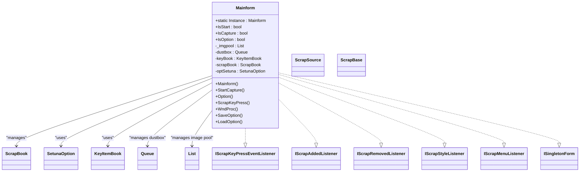
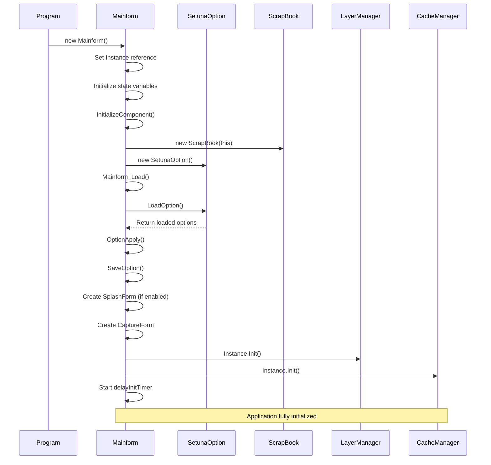
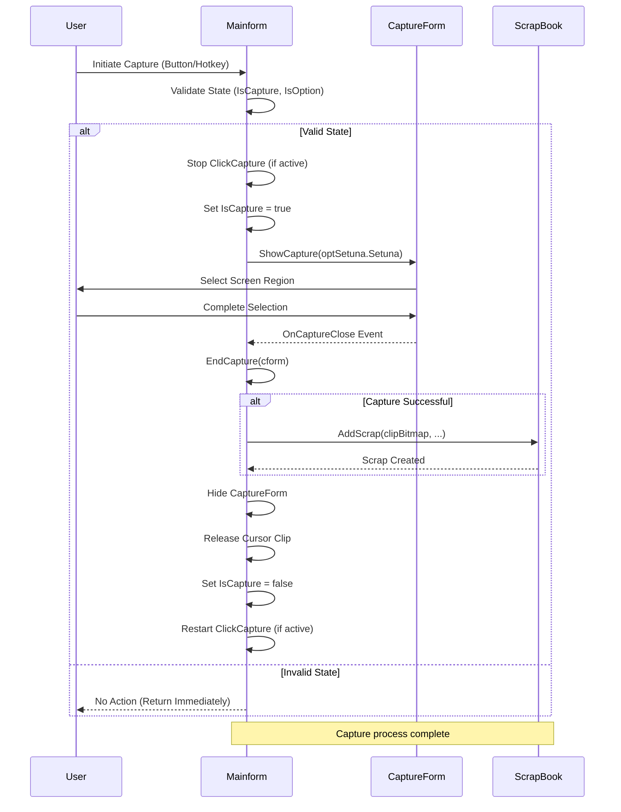
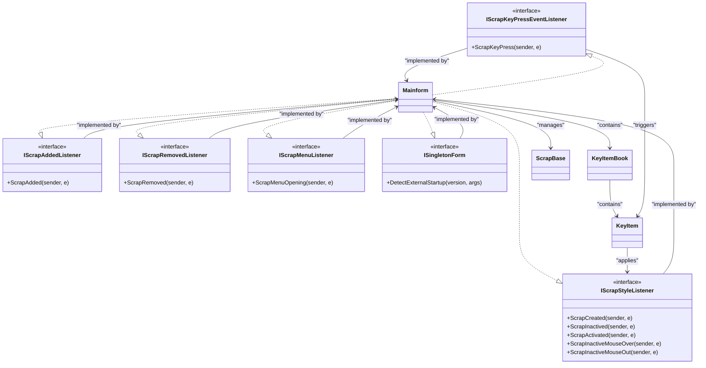

# Mainform - Central UI Controller

<cite>
**Referenced Files in This Document**   
- [Mainform.cs](file://SETUNA/Mainform.cs)
- [Mainform.Designer.cs](file://SETUNA/Mainform.Designer.cs)
- [Program.cs](file://SETUNA/Program.cs)
- [ScrapBook.cs](file://SETUNA/Main/ScrapBook.cs)
- [IScrapKeyPressEventListener.cs](file://SETUNA/Main/IScrapKeyPressEventListener.cs)
- [IScrapAddedListener.cs](file://SETUNA/Main/IScrapAddedListener.cs)
- [IScrapRemovedListener.cs](file://SETUNA/Main/IScrapRemovedListener.cs)
- [IScrapStyleListener.cs](file://SETUNA/Main/IScrapStyleListener.cs)
- [IScrapMenuListener.cs](file://SETUNA/Main/IScrapMenuListener.cs)
- [ISingletonForm.cs](file://SETUNA/com/clearunit/ISingletonForm.cs)
- [SetunaOption.cs](file://SETUNA/Main/Option/SetunaOption.cs)
- [HotKeyID.cs](file://SETUNA/HotKeyID.cs)
</cite>

## Table of Contents
1. [Introduction](#introduction)
2. [Core Responsibilities](#core-responsibilities)
3. [Initialization Sequence](#initialization-sequence)
4. [System Tray Integration](#system-tray-integration)
5. [Capture Management](#capture-management)
6. [Option Management](#option-management)
7. [Hotkey Processing](#hotkey-processing)
8. [Event Listener Implementation](#event-listener-implementation)
9. [Scrap Lifecycle Coordination](#scrap-lifecycle-coordination)
10. [Singleton Application Integration](#singleton-application-integration)
11. [Component Integration](#component-integration)
12. [Troubleshooting Guide](#troubleshooting-guide)

## Introduction
The Mainform class serves as the central UI controller for the SETUNA application, functioning as the primary Windows Form that orchestrates user interactions, system tray operations, and coordination between core components. As the main entry point of the application, Mainform manages the lifecycle of screen captures, handles user preferences, and integrates with various backend services to provide a seamless screenshot and annotation experience. This documentation details the architectural role of Mainform, its implementation patterns, and its interactions with other components in the system.

**Section sources**
- [Mainform.cs](file://SETUNA/Mainform.cs#L18-L19)

## Core Responsibilities
The Mainform class has several key responsibilities that make it the central coordination point for the SETUNA application:

1. **UI Controller**: Manages the primary user interface elements including buttons for capture and options
2. **System Tray Manager**: Handles the system tray icon and its associated context menu
3. **Capture Coordinator**: Initiates and manages the screen capture process
4. **Option Handler**: Provides access to application settings and preferences
5. **Event Hub**: Implements multiple listener interfaces to respond to scrap events
6. **Singleton Enforcement**: Integrates with SingletonApplication to ensure only one instance runs
7. **Component Integrator**: Coordinates between CacheManager, LayerManager, and other services

The class maintains state flags for different operational modes (IsStart, IsCapture, IsOption) and manages collections of pending image sources and deleted scraps (dustbox).



**Diagram sources**
- [Mainform.cs](file://SETUNA/Mainform.cs#L18-L19)
- [ScrapBook.cs](file://SETUNA/Main/ScrapBook.cs#L43)
- [SetunaOption.cs](file://SETUNA/Main/Option/SetunaOption.cs)

**Section sources**
- [Mainform.cs](file://SETUNA/Mainform.cs#L18-L19)

## Initialization Sequence
The Mainform initialization process follows a specific sequence to ensure proper setup of all components and services. The constructor begins by setting the static Instance property to enable global access, then initializes key state variables and components.

The initialization sequence continues in the Load event handler, which orchestrates the following steps:
1. Loads saved application options from configuration file
2. Applies the loaded options to configure the UI and behavior
3. Saves the current options (potentially updating the configuration)
4. Shows the splash screen if enabled in options
5. Creates the CaptureForm instance for screen capture operations
6. Sets IsStart to true to indicate the application is fully initialized
7. Initializes the LayerManager and CacheManager singletons
8. Starts the delayInitTimer for deferred initialization tasks

This phased initialization ensures that components are created in the correct order and that the user interface is responsive during startup.



**Diagram sources**
- [Mainform.cs](file://SETUNA/Mainform.cs#L23-L45)
- [Mainform.cs](file://SETUNA/Mainform.cs#L616-L636)
- [Program.cs](file://SETUNA/Program.cs#L26-L29)

**Section sources**
- [Mainform.cs](file://SETUNA/Mainform.cs#L23-L45)
- [Mainform.cs](file://SETUNA/Mainform.cs#L616-L636)

## System Tray Integration
Mainform provides comprehensive system tray integration through the NotifyIcon component (setunaIcon). This integration allows users to interact with the application even when the main window is hidden, which is the default behavior for SETUNA's minimalist design.

The system tray functionality includes:
- Displaying the SETUNA icon in the system tray
- Handling left-click to activate the application and refresh layers
- Handling double-click to open the options dialog
- Providing a context menu with key application functions
- Managing visibility based on application mode settings

The context menu (setunaIconMenu) is dynamically constructed during initialization to include options for viewing active scraps, accessing the dustbox, initiating captures, and managing application settings. This menu serves as the primary interface for users when the main window is not visible.

```mermaid
flowchart TD
A[System Tray Icon] --> B{User Interaction}
B --> C[Left Click]
B --> D[Double Click]
B --> E[Right Click]
C --> F[Activate Mainform]
C --> G[Refresh LayerManager]
D --> H[Open Options Dialog]
E --> I[Show Context Menu]
I --> J[Scrap List]
I --> K[Dustbox]
I --> L[Dust Erase]
I --> M[Dust Scrap]
I --> N[Separator]
I --> O[Capture]
I --> P[Paste]
I --> Q[Separator]
I --> R[Show Version]
I --> S[Options]
I --> T[Separator]
U[Shutdown]
J --> V[Activate Specific Scrap]
K --> W[View Deleted Scraps]
O --> X[StartCapture()]
S --> Y[Option()]
U --> Z[CloseSetuna()]
```

**Diagram sources**
- [Mainform.cs](file://SETUNA/Mainform.cs#L97-L113)
- [Mainform.cs](file://SETUNA/Mainform.cs#L639-L646)
- [Mainform.Designer.cs](file://SETUNA/Mainform.Designer.cs#L74-L80)

**Section sources**
- [Mainform.cs](file://SETUNA/Mainform.cs#L97-L113)
- [Mainform.cs](file://SETUNA/Mainform.cs#L639-L651)

## Capture Management
The Mainform class provides the primary interface for managing screen captures through the StartCapture and EndCapture methods. This functionality represents the core purpose of the SETUNA application - capturing screen regions and converting them into interactive "scraps" that users can manipulate.

The capture process follows this sequence:
1. Validation checks to ensure no conflicting operations are in progress
2. Creation and display of the CaptureForm for selecting screen regions
3. Handling of the capture result and creation of new scraps
4. Cleanup and state management after capture completion

The StartCapture method performs prerequisite checks to ensure the application is not already capturing or in the options dialog. It then initializes the CaptureForm with the current options and displays it. The EndCapture method processes the captured bitmap, adds it to the ScrapBook if successful, and handles cleanup operations including hiding the capture form and releasing cursor constraints.



**Diagram sources**
- [Mainform.cs](file://SETUNA/Mainform.cs#L116-L156)
- [Mainform.cs](file://SETUNA/Mainform.cs#L159-L189)
- [Mainform.Designer.cs](file://SETUNA/Mainform.Designer.cs#L46-L48)

**Section sources**
- [Mainform.cs](file://SETUNA/Mainform.cs#L116-L189)

## Option Management
Mainform provides comprehensive option management through the Option and OptionApply methods, which handle the display, application, and persistence of user preferences. The options system allows users to customize various aspects of the application's behavior, appearance, and functionality.

The option management workflow includes:
1. Displaying the options dialog (OptionForm) in a modal fashion
2. Applying changes to the runtime configuration
3. Handling hotkey registration for capture and function keys
4. Persisting options to an XML configuration file
5. Managing UI state during option changes

When users access the options dialog, Mainform temporarily modifies its appearance and behavior to ensure a consistent user experience. It lowers its topmost status and that of all active scraps to prevent the options dialog from being obscured. After the dialog closes, these states are restored.

The OptionApply method is particularly important as it synchronizes the current options with various system components, including hotkey registration, click capture functionality, and window management settings.

```mermaid
flowchart TD
A[User Requests Options] --> B{IsCapture Active?}
B --> |Yes| C[Return Immediately]
B --> |No| D[Set IsOption = true]
D --> E[Store Topmost States]
E --> F[Lower Topmost Priority]
F --> G[Stop ClickCapture]
G --> H[Show OptionForm]
H --> I{Dialog Result}
I --> |OK| J[Apply Options]
I --> |Cancel| K[Restore States]
J --> L[Update optSetuna]
L --> M[Call OptionApply()]
M --> N[Update KeyItemBook]
N --> O[Configure DustBox Capacity]
O --> P[Register Hotkeys]
P --> Q[Configure UI Mode]
Q --> R[Update Submenu]
R --> S[Configure ClickCapture]
S --> T[Enable/Disable windowTimer]
T --> U[Save Options to File]
K --> V[Restore Topmost States]
U --> V
V --> W[Set IsOption = false]
W --> X[Restart ClickCapture if needed]
Note: Option management ensures consistent application state
```

**Diagram sources**
- [Mainform.cs](file://SETUNA/Mainform.cs#L193-L260)
- [Mainform.cs](file://SETUNA/Mainform.cs#L263-L358)
- [Mainform.Designer.cs](file://SETUNA/Mainform.Designer.cs#L59-L62)

**Section sources**
- [Mainform.cs](file://SETUNA/Mainform.cs#L193-L358)

## Hotkey Processing
Mainform implements low-level hotkey processing through the WndProc method override, which intercepts Windows messages to handle registered hotkeys. This approach allows the application to respond to global hotkeys even when it is not the active window.

The hotkey system supports at least two primary functions:
1. Capture hotkey (HotKeyID.Capture): Initiates the screen capture process
2. Function1 hotkey (HotKeyID.Function1): Toggles the active state of all scraps

The WndProc method checks for the WM_HOTKEY message (0x0312) and extracts the hotkey identifier from the WParam parameter. Based on this identifier, it dispatches to the appropriate handler method. This message-based approach is efficient and reliable for global hotkey handling in Windows applications.

Hotkey registration and unregistration are managed through the SetunaOption component, with Mainform ensuring proper cleanup in the FormClosing event handler to prevent resource leaks.

```mermaid
sequenceDiagram
participant OS
participant Mainform
participant SetunaOption
participant Capture
OS->>Mainform : WM_HOTKEY Message
Mainform->>Mainform : WndProc(ref Message m)
Mainform->>Mainform : Check m.Msg == 0x0312
alt Hotkey Message
Mainform->>Mainform : Extract HotKeyID from m.WParam
Mainform->>Mainform : Switch on HotKeyID
alt HotKeyID.Capture
Mainform->>Mainform : StartCapture()
Mainform->>Capture : Initiate capture process
else HotKeyID.Function1
Mainform->>Mainform : SetAllScrapsActive(!allScrapActive)
Mainform->>ScrapBase : Toggle activation state
end
else Other Message
Mainform->>Mainform : base.WndProc(ref m)
end
Note over Mainform,Capture : Hotkey processing completes
Mainform->>Mainform : Mainform_FormClosing()
Mainform->>SetunaOption : UnregistHotKey(Handle, item)
loop For all HotKeyID values
SetunaOption-->>Mainform : Hotkey unregistered
end
Note : Proper hotkey cleanup prevents system resource leaks
```

**Diagram sources**
- [Mainform.cs](file://SETUNA/Mainform.cs#L384-L399)
- [Mainform.cs](file://SETUNA/Mainform.cs#L607-L613)
- [HotKeyID.cs](file://SETUNA/HotKeyID.cs)

**Section sources**
- [Mainform.cs](file://SETUNA/Mainform.cs#L384-L399)

## Event Listener Implementation
Mainform implements several event listener interfaces to participate in the application's event-driven architecture. These interfaces allow Mainform to respond to various scrap-related events and maintain synchronization between the UI and the underlying data model.

The implemented listener interfaces include:
- **IScrapKeyPressEventListener**: Responds to keyboard input on scraps
- **IScrapAddedListener**: Notified when new scraps are added
- **IScrapRemovedListener**: Notified when scraps are removed
- **IScrapStyleListener**: Responds to style application on scraps
- **IScrapMenuListener**: Handles scrap context menu operations
- **ISingletonForm**: Integrates with singleton application enforcement

The most significant implementation is IScrapKeyPressEventListener, which processes keyboard shortcuts on scraps. When a key press event occurs, Mainform looks up the corresponding KeyItem in the KeyItemBook and applies the associated style to the scrap. This enables the application's powerful keyboard-driven workflow for manipulating screenshots.



**Diagram sources**
- [Mainform.cs](file://SETUNA/Mainform.cs#L18)
- [IScrapKeyPressEventListener.cs](file://SETUNA/Main/IScrapKeyPressEventListener.cs)
- [IScrapAddedListener.cs](file://SETUNA/Main/IScrapAddedListener.cs)
- [IScrapRemovedListener.cs](file://SETUNA/Main/IScrapRemovedListener.cs)

**Section sources**
- [Mainform.cs](file://SETUNA/Mainform.cs#L18)
- [Mainform.cs](file://SETUNA/Mainform.cs#L373-L381)

## Scrap Lifecycle Coordination
Mainform plays a crucial role in coordinating the lifecycle of scraps within the SETUNA application. It manages the creation, modification, and deletion of scraps through integration with the ScrapBook component and various event handlers.

Key aspects of scrap lifecycle management include:
- **Creation**: Processing captured images and converting them into scraps
- **Pool Management**: Handling delayed image processing through the _imgpool collection
- **Deletion Management**: Maintaining a dustbox for recently deleted scraps
- **Restoration**: Allowing users to restore scraps from the dustbox
- **Event Propagation**: Notifying listeners of scrap state changes

The timPool timer is central to the asynchronous processing of image sources. When images are added to the system (via AddImageList), they are placed in the _imgpool and processed incrementally by the timPool_Tick handler. This prevents UI freezing during bulk image operations.

```mermaid
flowchart TD
A[Image Source] --> B{Added to System}
B --> C[AddImageList(ScrapSource)]
C --> D[Add to _imgpool]
D --> E[timPool.Start()]
F[timPool_Tick] --> G{Has Items?}
G --> |Yes| H[Process First Completed Item]
H --> I[CreateScrapFromsource()]
I --> J[CreateScrapFromImage()]
J --> K[AddScrap to ScrapBook]
K --> L[Scrap Created]
L --> M[ScrapBook triggers events]
M --> N[Mainform handles events]
G --> |No| O[Stop timPool]
P[User Deletes Scrap] --> Q[Move to Dustbox]
Q --> R{Dustbox Full?}
R --> |Yes| S[Remove Oldest]
R --> |No| T[Add to Queue]
U[User Restores Scrap] --> V[RestoreScrap()]
V --> W[Find in Dustbox]
W --> X[Remove from Queue]
X --> Y[AddScrapThenDo()]
Y --> Z[Scrap Restored]
Note: Mainform coordinates the entire scrap lifecycle
```

**Diagram sources**
- [Mainform.cs](file://SETUNA/Mainform.cs#L704-L708)
- [Mainform.cs](file://SETUNA/Mainform.cs#L678-L684)
- [Mainform.cs](file://SETUNA/Mainform.cs#L450-L473)

**Section sources**
- [Mainform.cs](file://SETUNA/Mainform.cs#L704-L733)

## Singleton Application Integration
Mainform integrates with the singleton application pattern through the ISingletonForm interface and the SingletonApplication class. This ensures that only one instance of SETUNA runs at a time, which is critical for proper hotkey handling and system resource management.

The integration works as follows:
1. Program.cs creates a SingletonApplication instance with the current version and command-line arguments
2. If registration succeeds, it creates the Mainform instance and registers it as a listener
3. When a second instance is launched, it detects the existing instance and forwards its arguments
4. The existing instance receives the arguments through the DetectExternalStartup method
5. Mainform processes the external startup request in the ExternalStartup method

This pattern prevents multiple instances from conflicting with each other, particularly regarding global hotkey registration. It also enables command-line functionality where additional instances can pass arguments to the running instance.

```mermaid
sequenceDiagram
participant FirstInstance
participant SingletonApplication
participant Mainform
participant SecondInstance
FirstInstance->>SingletonApplication : GetInstance(version, args)
SingletonApplication->>SingletonApplication : Register()
SingletonApplication-->>FirstInstance : Success
FirstInstance->>Mainform : new Mainform()
FirstInstance->>SingletonApplication : AddSingletonFormListener(mainform)
FirstInstance->>Mainform : CommandRun(args)
FirstInstance->>Application : Run(mainform)
SecondInstance->>SingletonApplication : GetInstance(different_version, args)
SingletonApplication->>SingletonApplication : Register()
SingletonApplication-->>SecondInstance : Failure (already running)
SecondInstance->>FirstInstance : Send arguments to existing instance
FirstInstance->>Mainform : DetectExternalStartup(version, args)
Mainform->>Mainform : ExternalStartup(version, args)
alt Version Match
Mainform->>Mainform : Process CommandRun(args)
alt No Args
Mainform->>Mainform : Handle DupType (Capture)
end
else Version Mismatch
Mainform->>User : Show Version Warning
end
Note : Singleton pattern ensures single instance operation
```

**Diagram sources**
- [Program.cs](file://SETUNA/Program.cs#L21-L30)
- [Mainform.cs](file://SETUNA/Mainform.cs#L736-L762)
- [ISingletonForm.cs](file://SETUNA/com/clearunit/ISingletonForm.cs)

**Section sources**
- [Program.cs](file://SETUNA/Program.cs#L21-L30)
- [Mainform.cs](file://SETUNA/Mainform.cs#L736-L762)

## Component Integration
Mainform serves as the integration point for several key components in the SETUNA application, coordinating between UI elements and backend services. This integration enables the application's core functionality by connecting user actions with system responses.

Key integrations include:
- **ScrapBook**: Central repository for all scraps and their management
- **SetunaOption**: Configuration and preferences management
- **LayerManager**: Window layer management for visual effects
- **CacheManager**: Image caching for performance optimization
- **KeyItemBook**: Keyboard shortcut and style mapping
- **ClickCapture**: Alternative capture method via mouse clicks

The constructor establishes these integrations by creating instances of ScrapBook and SetunaOption, while the Load event initializes the LayerManager and CacheManager singletons. Throughout its lifecycle, Mainform coordinates between these components to provide a cohesive user experience.

```mermaid
graph TD
A[Mainform] --> B[ScrapBook]
A --> C[SetunaOption]
A --> D[LayerManager]
A --> E[CacheManager]
A --> F[KeyItemBook]
A --> G[ClickCapture]
B --> H[Scrap Management]
B --> I[Event Distribution]
B --> J[Dustbox Operations]
C --> K[Configuration Storage]
C --> L[Hotkey Registration]
C --> M[UI Settings]
D --> N[Window Layering]
D --> O[Visual Effects]
D --> P[Z-Order Management]
E --> Q[Image Caching]
E --> R[Memory Management]
E --> S[Performance Optimization]
F --> T[Keyboard Shortcuts]
F --> U[Style Mapping]
F --> V[Action Binding]
G --> W[Mouse Click Capture]
G --> X[Alternative Input]
G --> Y[User Convenience]
A --> Z[Central Coordination]
Z --> AA[Capture Initiation]
Z --> AB[Option Management]
Z --> AC[Hotkey Processing]
Z --> AD[Event Handling]
Z --> AE[State Management]
style A fill:#f9f,stroke:#333
style Z fill:#ff9,stroke:#333
Note: Mainform acts as the central hub connecting all components
```

**Diagram sources**
- [Mainform.cs](file://SETUNA/Mainform.cs#L30-L38)
- [Mainform.cs](file://SETUNA/Mainform.cs#L633-L635)
- [Mainform.cs](file://SETUNA/Mainform.cs#L333-L350)

**Section sources**
- [Mainform.cs](file://SETUNA/Mainform.cs#L30-L38)
- [Mainform.cs](file://SETUNA/Mainform.cs#L633-L635)

## Troubleshooting Guide
This section addresses common issues related to the Mainform class and provides troubleshooting guidance for users and developers.

### Hotkey Registration Failures
**Symptom**: Hotkeys for capture or function keys do not work.
**Causes**:
- Another application is using the same hotkey combination
- Insufficient permissions to register global hotkeys
- Hotkey registration failed during startup
- Multiple instances of SETUNA running

**Solutions**:
1. Check the HotkeyMsg dialog that appears when registration fails
2. Change the hotkey combination in the Options dialog
3. Ensure only one instance of SETUNA is running
4. Run SETUNA with administrator privileges if necessary
5. Verify no other applications are using the same hotkey

### Capture Functionality Issues
**Symptom**: Capture process does not start or completes incorrectly.
**Causes**:
- IsCapture or IsOption flags are set, blocking new captures
- CaptureForm initialization failure
- Graphics resource issues
- Screen capture permissions

**Solutions**:
1. Ensure no other capture or option dialogs are open
2. Check application logs for error messages
3. Restart SETUNA to reset state
4. Verify graphics drivers are up to date
5. Test with different capture methods (hotkey vs. button)

### Option Management Problems
**Symptom**: Options do not save or are not applied correctly.
**Causes**:
- Configuration file permissions
- XML serialization errors
- Invalid option values
- File system access issues

**Solutions**:
1. Check that the configuration directory is writable
2. Look for "无法保存配置文件" error messages
3. Reset to default options using the reset button
4. Manually delete the configuration file to force recreation
5. Run SETUNA with appropriate file system permissions

### Memory and Performance Issues
**Symptom**: Application becomes slow or consumes excessive memory.
**Causes**:
- Large number of scraps in memory
- Image cache growing too large
- Memory leaks in scrap management
- Timer events firing too frequently

**Solutions**:
1. Use the garbage collection button (if available)
2. Limit the number of active scraps
3. Adjust cache settings in options
4. Monitor the _imgpool collection size
5. Restart SETUNA periodically for long sessions

### Singleton Instance Conflicts
**Symptom**: Second instance shows version warning or fails to start.
**Causes**:
- Different SETUNA versions running simultaneously
- Singleton registration failure
- Communication issues between instances

**Solutions**:
1. Ensure all instances use the same version
2. Check that only one instance is running
3. Restart both instances if communication fails
4. Verify network-level singleton mechanisms are working

**Section sources**
- [Mainform.cs](file://SETUNA/Mainform.cs#L230-L237)
- [Mainform.cs](file://SETUNA/Mainform.cs#L238-L245)
- [Mainform.cs](file://SETUNA/Mainform.cs#L414-L417)
- [Mainform.cs](file://SETUNA/Mainform.cs#L440-L443)
- [Mainform.cs](file://SETUNA/Mainform.cs#L749-L751)