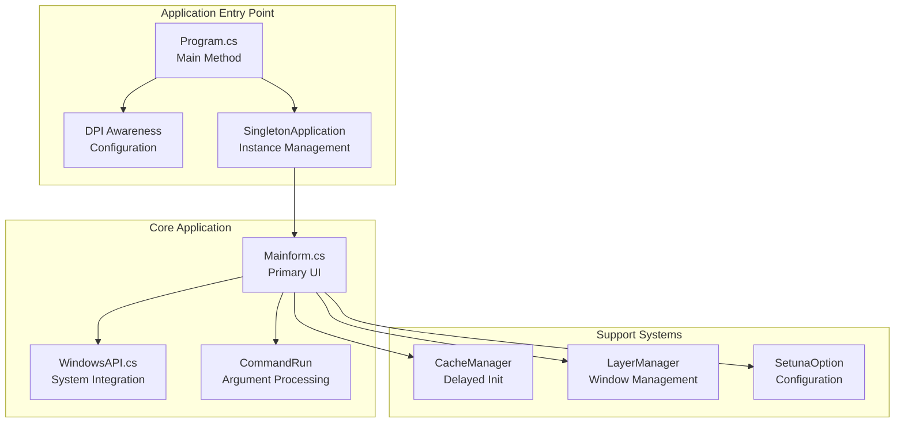
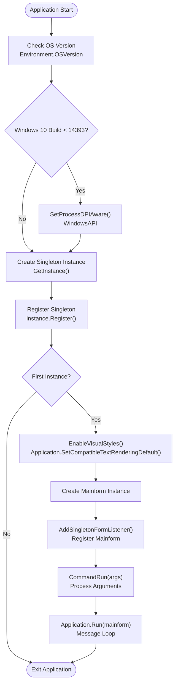
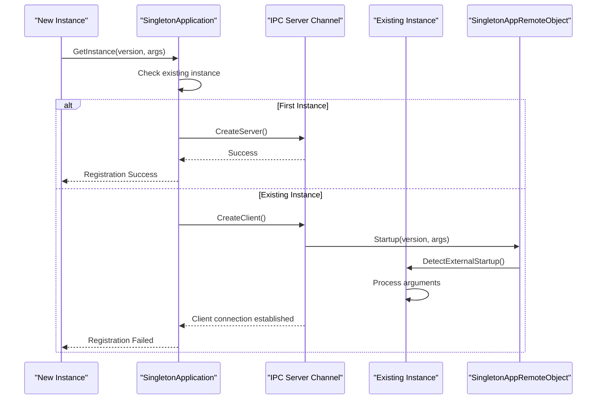
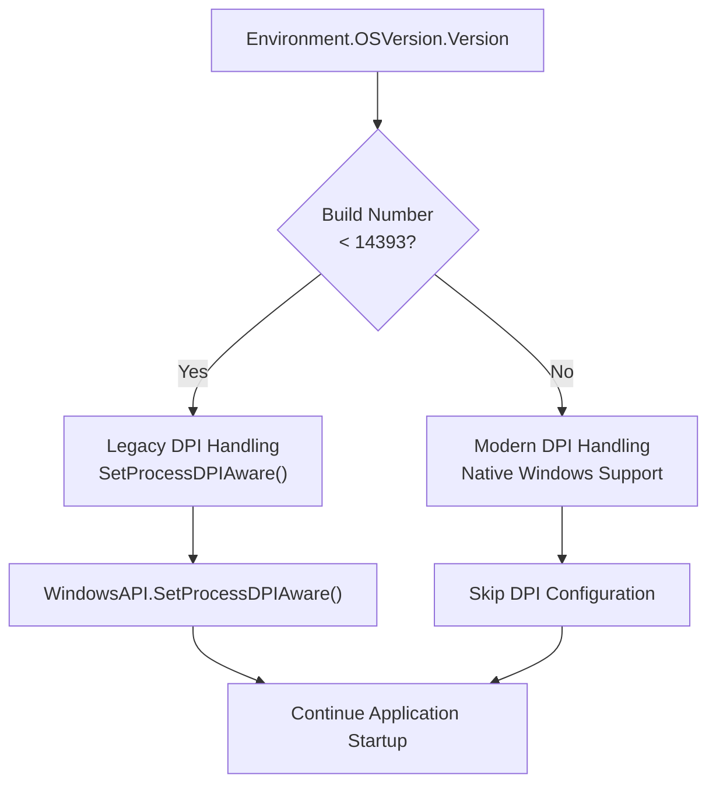
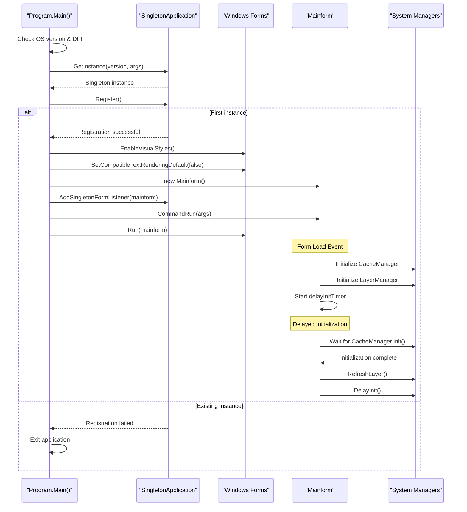
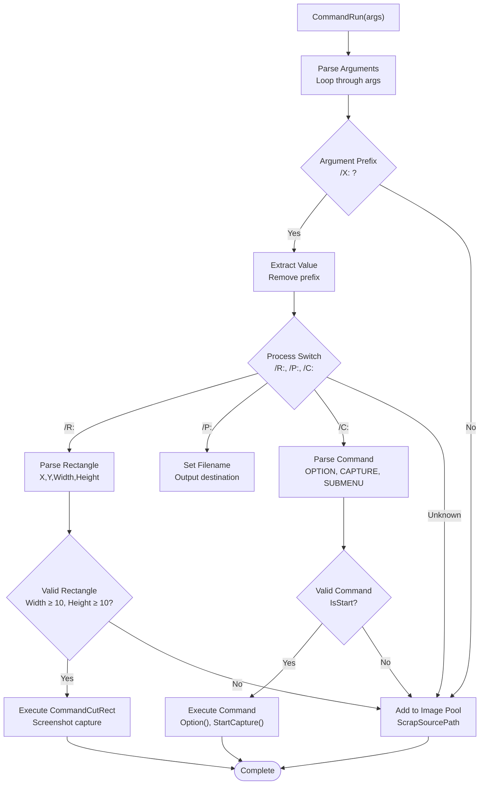
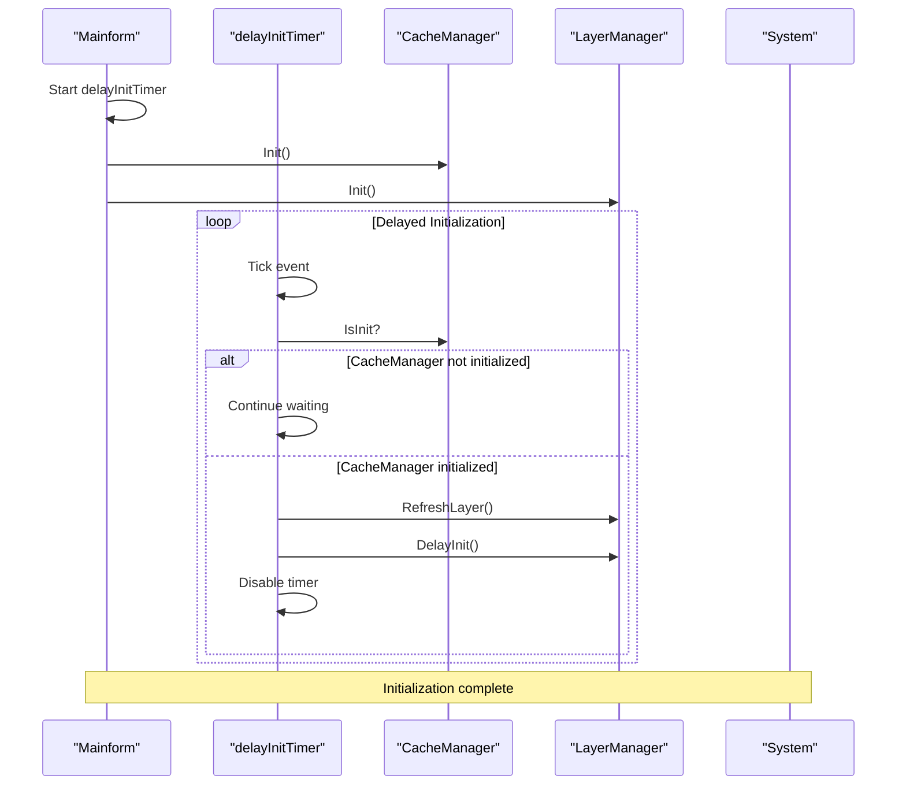

# Program Entry Point and Application Initialization

<cite>
**Referenced Files in This Document**
- [Program.cs](file://SETUNA/Program.cs)
- [SingletonApplication.cs](file://SETUNA/com/clearunit/SingletonApplication.cs)
- [ISingletonForm.cs](file://SETUNA/com/clearunit/ISingletonForm.cs)
- [SingletonAppRemoteObject.cs](file://SETUNA/com/clearunit/SingletonAppRemoteObject.cs)
- [Mainform.cs](file://SETUNA/Mainform.cs)
- [WindowsAPI.cs](file://SETUNA/Main/Common/WindowsAPI.cs)
</cite>

## Table of Contents
1. [Introduction](#introduction)
2. [Application Architecture Overview](#application-architecture-overview)
3. [Program Class Analysis](#program-class-analysis)
4. [Singleton Application Pattern](#singleton-application-pattern)
5. [DPI Awareness and Compatibility](#dpi-awareness-and-compatibility)
6. [Initialization Sequence](#initialization-sequence)
7. [Command-Line Argument Processing](#command-line-argument-processing)
8. [Windows API Integration](#windows-api-integration)
9. [Delayed Initialization Pattern](#delayed-initialization-pattern)
10. [Deployment Considerations](#deployment-considerations)
11. [Troubleshooting Guide](#troubleshooting-guide)
12. [Conclusion](#conclusion)

## Introduction

The SETUNA application's entry point is implemented through the Program class, which serves as the primary startup controller for the screenshot management system. This class orchestrates the entire application lifecycle, from initial DPI awareness configuration to form instantiation and command-line processing. The architecture emphasizes single-instance execution, Windows API integration for compatibility, and robust initialization sequences that handle various deployment scenarios.

The Program class demonstrates sophisticated patterns for Windows desktop application development, including singleton application enforcement, DPI scaling compatibility, and seamless command-line integration. These design decisions address common deployment challenges while maintaining the application's core functionality as a screenshot management tool.

## Application Architecture Overview

The SETUNA application follows a layered architecture with clear separation of concerns between the entry point, singleton management, form handling, and Windows API integration.

**Diagram sources**
- [Program.cs](file://SETUNA/Program.cs#L11-L31)
- [SingletonApplication.cs](file://SETUNA/com/clearunit/SingletonApplication.cs#L18-L49)
- [Mainform.cs](file://SETUNA/Mainform.cs#L23-L46)

## Program Class Analysis

The Program class serves as the application's main entry point, implementing a static Main method that handles the complete startup sequence. This class demonstrates several key architectural patterns and design decisions.

**Diagram sources**
- [Program.cs](file://SETUNA/Program.cs#L11-L31)

The Program class implements several critical responsibilities:

### Static Main Method Implementation
The Main method is decorated with the `[STAThread]` attribute, indicating Single-Threaded Apartment model usage required for Windows Forms applications. This ensures thread-safe UI operations and COM interoperability.

### Entry Point Responsibilities
The Program class handles three primary startup phases:
1. **Compatibility Checking**: OS version detection for DPI awareness requirements
2. **Instance Management**: Singleton application enforcement
3. **Resource Initialization**: Visual styles and form creation

**Section sources**
- [Program.cs](file://SETUNA/Program.cs#L11-L31)

## Singleton Application Pattern

The SingletonApplication class implements a sophisticated inter-process communication (IPC) mechanism to ensure only one instance of SETUNA runs simultaneously. This pattern prevents resource conflicts and maintains consistent application state.

**Diagram sources**
- [SingletonApplication.cs](file://SETUNA/com/clearunit/SingletonApplication.cs#L42-L49)
- [SingletonAppRemoteObject.cs](file://SETUNA/com/clearunit/SingletonAppRemoteObject.cs#L9-L14)

### Singleton Implementation Details

The SingletonApplication class employs a thread-safe singleton pattern with lazy initialization:

#### Thread-Safe Instantiation
The GetInstance method uses double-checked locking to ensure thread-safe singleton creation while minimizing synchronization overhead.

#### IPC Communication Protocol
The singleton mechanism utilizes Windows IPC channels for cross-process communication:
- **Server Mode**: Creates named IPC channels for incoming connections
- **Client Mode**: Connects to existing server instances for argument forwarding
- **Remote Object**: Handles startup notifications through delegate invocation

#### External Startup Detection
The ISingletonForm interface enables forms to respond to external startup events, allowing the main form to process command-line arguments or activate existing instances.

**Section sources**
- [SingletonApplication.cs](file://SETUNA/com/clearunit/SingletonApplication.cs#L18-L98)
- [ISingletonForm.cs](file://SETUNA/com/clearunit/ISingletonForm.cs#L6-L7)
- [SingletonAppRemoteObject.cs](file://SETUNA/com/clearunit/SingletonAppRemoteObject.cs#L9-L14)

## DPI Awareness and Compatibility

The application implements comprehensive DPI awareness handling to ensure compatibility across different Windows versions and display configurations.

### OS Version Detection
The Program class performs runtime OS version checking to determine appropriate DPI handling strategies:

**Diagram sources**
- [Program.cs](file://SETUNA/Program.cs#L15-L19)
- [WindowsAPI.cs](file://SETUNA/Main/Common/WindowsAPI.cs#L19-L20)

### DPI Compatibility Strategies

#### Windows 10 Anniversary Update (Build 14393) and Later
Modern Windows versions natively support DPI awareness, eliminating the need for explicit DPI configuration. The application relies on Windows' built-in scaling mechanisms.

#### Pre-Windows 10 Anniversary Update
Legacy systems require explicit DPI awareness configuration through the Windows API. The SetProcessDPIAware() function informs Windows that the application handles DPI scaling internally.

#### High-DPI Display Support
The application architecture accommodates multiple high-DPI displays through:
- **Per-Monitor DPI Awareness**: Native Windows support for mixed DPI environments
- **Fallback Scaling**: Graceful degradation for unsupported configurations
- **Resource Scaling**: Dynamic adjustment of UI elements and images

**Section sources**
- [Program.cs](file://SETUNA/Program.cs#L14-L19)
- [WindowsAPI.cs](file://SETUNA/Main/Common/WindowsAPI.cs#L19-L20)

## Initialization Sequence

The application follows a carefully orchestrated initialization sequence that ensures proper resource allocation and dependency resolution.

**Diagram sources**
- [Program.cs](file://SETUNA/Program.cs#L21-L30)
- [Mainform.cs](file://SETUNA/Mainform.cs#L630-L635)

### Initialization Phases

#### Phase 1: Basic Setup (Program.cs)
1. **DPI Configuration**: OS version detection and DPI awareness setup
2. **Singleton Registration**: Attempt to establish singleton instance
3. **Visual Styles**: Enable Windows Forms visual styles for modern appearance
4. **Form Creation**: Instantiate the main application form

#### Phase 2: Form Initialization (Mainform.cs)
1. **Component Setup**: Initialize scrap book, options, and key bindings
2. **Event Registration**: Establish listener relationships for various events
3. **Configuration Loading**: Load saved preferences and settings
4. **Splash Screen**: Display optional splash screen during startup

#### Phase 3: System Manager Initialization
1. **Cache Manager**: Initialize image caching system
2. **Layer Manager**: Set up window layer management
3. **Delayed Startup**: Use timer-based initialization for resource-intensive operations

**Section sources**
- [Program.cs](file://SETUNA/Program.cs#L24-L30)
- [Mainform.cs](file://SETUNA/Mainform.cs#L23-L46)
- [Mainform.cs](file://SETUNA/Mainform.cs#L630-L635)

## Command-Line Argument Processing

The CommandRun method provides comprehensive command-line argument processing capabilities, enabling external applications to control SETUNA's behavior programmatically.

**Diagram sources**
- [Mainform.cs](file://SETUNA/Mainform.cs#L764-L866)

### Supported Command-Line Options

#### Rectangle Capture (/R:)
Captures a specific screen region defined by coordinates and dimensions:
- **Format**: `/R:X,Y,Width,Height`
- **Example**: `/R:100,100,800,600`
- **Validation**: Minimum dimensions of 10x10 pixels

#### Path Addition (/P:)
Adds local file paths to the image processing queue:
- **Format**: `/P:filepath`
- **Supported Formats**: JPEG, PNG, PSD, GIF, BMP, ICO, TIFF, WEBP, SVG, TGA
- **Processing**: Automatic image loading and scrap creation

#### Command Execution (/C:)
Executes predefined commands based on string parameters:
- **OPTION**: Opens the options dialog
- **CAPTURE**: Initiates screenshot capture mode
- **SUBMENU**: Shows the context menu

### Argument Processing Logic

The command processing implements robust error handling and validation:
1. **Prefix Detection**: Identifies argument prefixes and extracts values
2. **Format Validation**: Ensures proper argument formatting
3. **Command Routing**: Routes processed arguments to appropriate handlers
4. **Error Recovery**: Continues processing despite individual argument failures

**Section sources**
- [Mainform.cs](file://SETUNA/Mainform.cs#L764-L866)

## Windows API Integration

The application integrates extensively with Windows APIs to ensure compatibility and optimal performance across different Windows versions and configurations.

### Core Windows API Functions

The WindowsAPI class provides essential Windows system integration:

#### DPI Awareness Management
- **SetProcessDPIAware()**: Enables per-monitor DPI awareness for legacy systems
- **GetSystemMetrics()**: Retrieves system DPI scaling factors
- **Monitor Information**: Access to multi-monitor DPI configurations

#### Window Management
- **GetForegroundWindow()**: Determines active window for focus management
- **GetWindowRect()**: Retrieves window positioning and sizing information
- **Window Enumeration**: Iterates through window hierarchy for layer management

#### System Information
- **GetWindowText()**: Retrieves window titles for identification
- **GetClassName()**: Obtains window class names for filtering
- **GetWindowModuleFileName()**: Identifies application modules

### API Integration Patterns

The Windows API integration follows several established patterns:

#### P/Invoke Declarations
Native function declarations use structured P/Invoke signatures with appropriate marshaling attributes for safe interoperability.

#### Error Handling
Windows API calls implement comprehensive error handling with fallback mechanisms for unsupported features or permission restrictions.

#### Resource Management
Proper cleanup and resource disposal prevent memory leaks and handle unmanaged resources appropriately.

**Section sources**
- [WindowsAPI.cs](file://SETUNA/Main/Common/WindowsAPI.cs#L19-L20)
- [WindowsAPI.cs](file://SETUNA/Main/Common/WindowsAPI.cs#L23-L169)

## Delayed Initialization Pattern

The application employs a sophisticated delayed initialization pattern to optimize startup performance and manage resource-intensive operations effectively.

**Diagram sources**
- [Mainform.cs](file://SETUNA/Mainform.cs#L630-L635)
- [Mainform.cs](file://SETUNA/Mainform.cs#L936-L943)

### Delayed Initialization Benefits

#### Performance Optimization
- **Quick Startup**: Essential UI components load immediately
- **Background Processing**: Resource-intensive operations occur after UI responsiveness
- **Progressive Enhancement**: Features load as dependencies become available

#### Resource Management
- **Memory Efficiency**: Prevents premature allocation of large resources
- **CPU Utilization**: Distributes processing load across multiple frames
- **I/O Optimization**: Network and disk operations occur asynchronously

#### Reliability Improvements
- **Graceful Degradation**: Non-critical features fail silently
- **Timeout Handling**: Prevents infinite waits for unavailable resources
- **Error Recovery**: Failed initialization attempts can be retried

### Implementation Details

The delayed initialization system consists of:
1. **Timer-Based Monitoring**: Periodic checks for initialization completion
2. **Dependency Tracking**: Coordination between multiple initialization systems
3. **Completion Callbacks**: Notification mechanisms for dependent systems
4. **Cleanup Procedures**: Proper resource disposal and state management

**Section sources**
- [Mainform.cs](file://SETUNA/Mainform.cs#L630-L635)
- [Mainform.cs](file://SETUNA/Mainform.cs#L936-L943)

## Deployment Considerations

The SETUNA application architecture addresses several deployment challenges commonly encountered in Windows desktop applications.

### DPI Scaling Issues

#### Common Problems and Solutions
1. **High-DPI Screens**: Automatic DPI awareness configuration for legacy systems
2. **Mixed DPI Environments**: Per-monitor DPI support through Windows native APIs
3. **Legacy Display Drivers**: Fallback scaling mechanisms for older hardware
4. **Multi-Monitor Configurations**: Coordinate scaling across different display characteristics

#### Deployment Recommendations
- **Windows 10 Build 14393+**: Native DPI support eliminates compatibility concerns
- **Legacy Systems**: Ensure proper DPI awareness configuration through SetProcessDPIAware()
- **Testing Scenarios**: Verify functionality across various DPI configurations and monitor setups

### Multiple Instance Prevention

#### Singleton Enforcement Mechanisms
The singleton pattern prevents multiple concurrent instances through:
1. **IPC Channels**: Named pipes for inter-process communication
2. **Registry Keys**: Alternative coordination mechanisms for restricted environments
3. **File Locking**: Fallback mechanisms for IPC failures
4. **Process Detection**: Active monitoring of existing instances

#### Security Considerations
- **Privilege Escalation**: Minimal elevation requirements for singleton enforcement
- **Network Restrictions**: IPC channel security in corporate environments
- **Antivirus Interference**: Proper handling of security software blocking IPC

### Installation and Distribution

#### Prerequisites
- **.NET Framework**: Version 4.7 for modern features, 2.0 for legacy compatibility
- **Windows Version**: Windows 10 build 14393+ for optimal experience
- **Administrative Rights**: Optional for registry modifications and system integration

#### Packaging Considerations
- **Self-Contained Deployment**: Minimize external dependencies
- **Update Mechanisms**: Support for automatic and manual updates
- **Configuration Persistence**: Robust settings storage and migration

## Troubleshooting Guide

### Common Startup Issues

#### DPI Scaling Problems
**Symptoms**: Application appears tiny or incorrectly scaled on high-DPI displays
**Solutions**:
1. Verify Windows 10 build version (≥ 14393)
2. Check .NET Framework version compatibility
3. Test with different DPI settings
4. Review Windows display scaling configuration

#### Multiple Instance Issues
**Symptoms**: Multiple SETUNA windows appear when launching
**Solutions**:
1. Check for orphaned IPC channels
2. Verify Windows service permissions
3. Clear temporary files and cache
4. Restart Windows Explorer process

#### Command-Line Processing Failures
**Symptoms**: Arguments not recognized or processed incorrectly
**Solutions**:
1. Verify argument format compliance
2. Check file path accessibility
3. Validate rectangle coordinate ranges
4. Test with simplified argument sets

### Performance Issues

#### Slow Startup Times
**Causes**: Resource-intensive initialization, network timeouts, disk I/O
**Solutions**: Enable delayed initialization, optimize resource loading, reduce startup dependencies

#### Memory Consumption
**Causes**: Large image caches, unclosed resources, memory leaks
**Solutions**: Implement proper disposal patterns, configure cache limits, monitor resource usage

### Debugging Techniques

#### Logging and Diagnostics
- **Console Output**: Monitor command-line argument processing
- **Event Logs**: Track singleton registration and IPC communication
- **Performance Counters**: Measure initialization timing and resource usage

#### Development Tools
- **Process Monitor**: Track file and registry access patterns
- **Dependency Walker**: Verify DLL dependencies and loading order
- **Memory Profilers**: Identify memory leaks and excessive allocations

## Conclusion

The SETUNA application's Program class exemplifies robust Windows desktop application architecture through its sophisticated initialization sequence, singleton enforcement, and compatibility handling. The implementation demonstrates several key architectural principles:

### Design Excellence
- **Separation of Concerns**: Clear division between entry point logic, singleton management, and form handling
- **Platform Compatibility**: Comprehensive DPI awareness and Windows API integration
- **Resource Management**: Efficient initialization patterns and graceful degradation

### Technical Sophistication
- **Inter-Process Communication**: Secure and reliable singleton enforcement through IPC channels
- **Delayed Initialization**: Performance-optimized resource loading with dependency coordination
- **Error Handling**: Comprehensive fallback mechanisms and graceful failure recovery

### Practical Benefits
- **User Experience**: Seamless startup with immediate UI responsiveness
- **System Integration**: Native Windows compatibility across diverse environments
- **Maintainability**: Clean architecture supporting future enhancements and bug fixes

The Program class serves as an excellent example of how to architect a Windows desktop application that balances functionality, performance, and compatibility while maintaining clean, maintainable code structure. Its design patterns and implementation strategies provide valuable insights for developers working on similar desktop application projects.