# ScrapBook - Central Registry

<cite>
**Referenced Files in This Document**
- [ScrapBook.cs](file://SETUNA/Main/ScrapBook.cs)
- [ScrapBase.cs](file://SETUNA/Main/ScrapBase.cs)
- [ScrapEventArgs.cs](file://SETUNA/Main/ScrapEventArgs.cs)
- [ScrapKeyPressEventArgs.cs](file://SETUNA/Main/ScrapKeyPressEventArgs.cs)
- [IScrapAddedListener.cs](file://SETUNA/Main/IScrapAddedListener.cs)
- [IScrapRemovedListener.cs](file://SETUNA/Main/IScrapRemovedListener.cs)
- [IScrapKeyPressEventListener.cs](file://SETUNA/Main/IScrapKeyPressEventListener.cs)
- [Mainform.cs](file://SETUNA/Mainform.cs)
- [CacheManager.cs](file://SETUNA/Main/Cache/CacheManager.cs)
</cite>

## Table of Contents
1. [Introduction](#introduction)
2. [Architecture Overview](#architecture-overview)
3. [Core Components](#core-components)
4. [Event-Driven Architecture](#event-driven-architecture)
5. [Scrap Lifecycle Management](#scrap-lifecycle-management)
6. [Dustbox Management](#dustbox-management)
7. [Integration with CacheManager](#integration-with-cachemanager)
8. [Performance Considerations](#performance-considerations)
9. [Memory Management](#memory-management)
10. [Practical Examples](#practical-examples)
11. [Best Practices](#best-practices)

## Introduction

The ScrapBook class serves as the central registry and manager for all captured image scraps in the SETUNA application. It acts as a container that maintains collections of ScrapBase instances, managing both active scraps and those in the dustbox (recycle bin). The class implements a sophisticated event-driven architecture that enables loose coupling between components while providing comprehensive scrap lifecycle management capabilities.

As the primary orchestrator of scrap operations, ScrapBook handles everything from basic scrap creation and addition to complex operations like dustbox management, event broadcasting, and integration with persistent storage through CacheManager. Its design emphasizes modularity, performance, and extensibility while maintaining clean separation of concerns.

## Architecture Overview

The ScrapBook class follows a centralized registry pattern with clear boundaries between its core responsibilities and external integrations. The architecture demonstrates several key design principles:

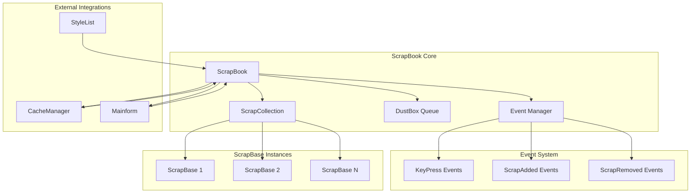
```mermaid
graph TB
subgraph "ScrapBook Core"
SB[ScrapBook]
SC[ScrapCollection]
DB[DustBox Queue]
EM[Event Manager]
end
subgraph "External Integrations"
CM[CacheManager]
MF[Mainform]
SL[StyleList]
end
subgraph "Event System"
KE[KeyPress Events]
AE[ScrapAdded Events]
RE[ScrapRemoved Events]
end
subgraph "ScrapBase Instances"
S1[ScrapBase 1]
S2[ScrapBase 2]
SN[ScrapBase N]
end
SB --> SC
SB --> DB
SB --> EM
SB --> CM
SB --> MF
EM --> KE
EM --> AE
EM --> RE
SC --> S1
SC --> S2
SC --> SN
MF --> SB
CM --> SB
SL --> SB
```

**Diagram sources**
- [ScrapBook.cs](file://SETUNA/Main/ScrapBook.cs#L9-L370)
- [Mainform.cs](file://SETUNA/Mainform.cs#L18-L46)
- [CacheManager.cs](file://SETUNA/Main/Cache/CacheManager.cs#L7-L160)

**Section sources**
- [ScrapBook.cs](file://SETUNA/Main/ScrapBook.cs#L9-L370)
- [Mainform.cs](file://SETUNA/Mainform.cs#L18-L46)

## Core Components

### Scrap Collection Management

The ScrapBook maintains two primary collections: the active scrap collection and the dustbox queue. These collections serve distinct purposes in the scrap lifecycle management:

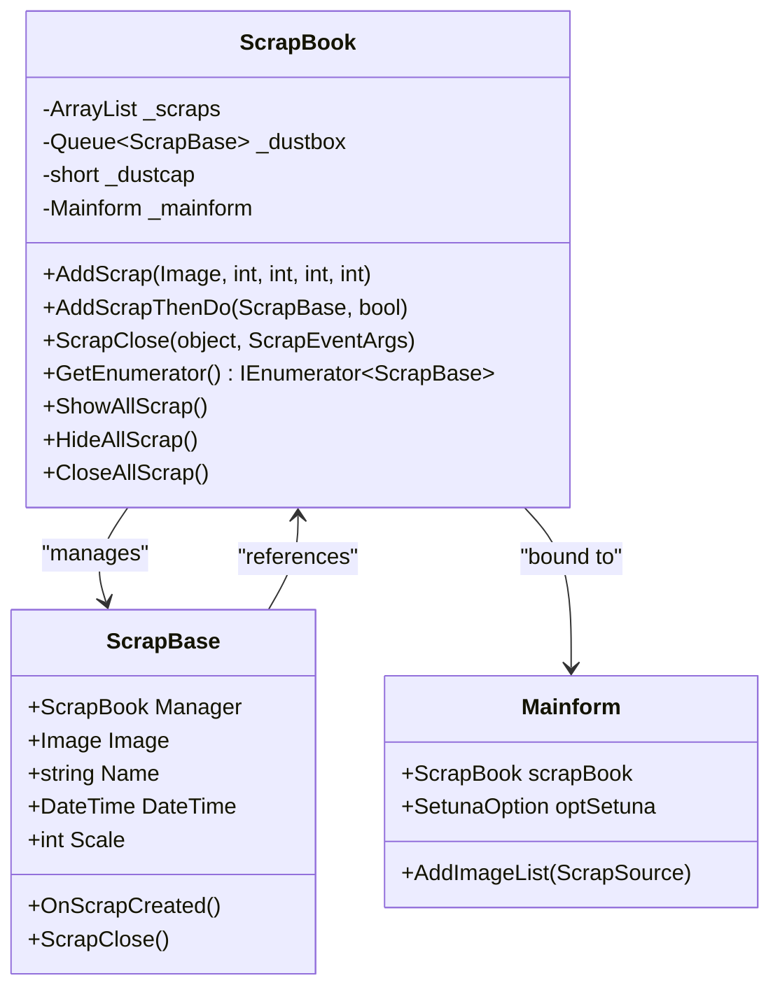
```mermaid
classDiagram
class ScrapBook {
-ArrayList _scraps
-Queue~ScrapBase~ _dustbox
-short _dustcap
-Mainform _mainform
+AddScrap(Image, int, int, int, int)
+AddScrapThenDo(ScrapBase, bool)
+ScrapClose(object, ScrapEventArgs)
+GetEnumerator() IEnumerator~ScrapBase~
+ShowAllScrap()
+HideAllScrap()
+CloseAllScrap()
}
class ScrapBase {
+ScrapBook Manager
+Image Image
+string Name
+DateTime DateTime
+int Scale
+OnScrapCreated()
+ScrapClose()
}
class Mainform {
+ScrapBook scrapBook
+SetunaOption optSetuna
+AddImageList(ScrapSource)
}
ScrapBook --> ScrapBase : "manages"
ScrapBook --> Mainform : "bound to"
ScrapBase --> ScrapBook : "references"
```

**Diagram sources**
- [ScrapBook.cs](file://SETUNA/Main/ScrapBook.cs#L357-L358)
- [ScrapBase.cs](file://SETUNA/Main/ScrapBase.cs#L565-L577)
- [Mainform.cs](file://SETUNA/Mainform.cs#L21-L22)

### Property Exposures

The ScrapBook exposes several key properties that provide access to its internal state:

| Property | Type | Purpose | Description |
|----------|------|---------|-------------|
| `DustBox` | `Queue<ScrapBase>` | Access | Provides direct access to the dustbox queue for external manipulation |
| `DustBoxArray` | `ArrayList` | Enumeration | Returns a copy of dustbox contents as an ArrayList for safe iteration |
| `DustBoxCapacity` | `short` | Configuration | Controls the maximum number of scraps in the dustbox |
| `BindForm` | `Mainform` | Reference | Maintains a reference to the associated Mainform instance |
| `ScrapCount` | `int` | Monitoring | Current count of active scraps in the collection |
| `DustCount` | `int` | Monitoring | Current count of scraps in the dustbox |

**Section sources**
- [ScrapBook.cs](file://SETUNA/Main/ScrapBook.cs#L15-L284)

## Event-Driven Architecture

The ScrapBook implements a comprehensive event-driven architecture that enables loose coupling between components. This design allows various parts of the application to respond to scrap-related events without direct dependencies.

### Event Types and Handlers

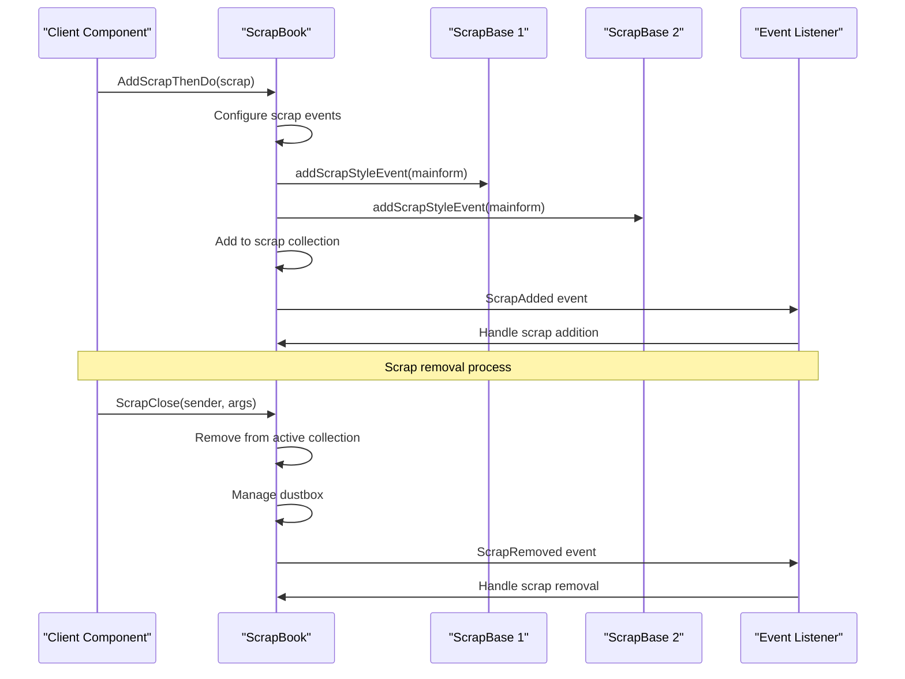
```mermaid
sequenceDiagram
participant Client as "Client Component"
participant SB as "ScrapBook"
participant S1 as "ScrapBase 1"
participant S2 as "ScrapBase 2"
participant Listener as "Event Listener"
Client->>SB : AddScrapThenDo(scrap)
SB->>SB : Configure scrap events
SB->>S1 : addScrapStyleEvent(mainform)
SB->>S2 : addScrapStyleEvent(mainform)
SB->>SB : Add to scrap collection
SB->>Listener : ScrapAdded event
Listener->>SB : Handle scrap addition
Note over Client,Listener : Scrap removal process
Client->>SB : ScrapClose(sender, args)
SB->>SB : Remove from active collection
SB->>SB : Manage dustbox
SB->>Listener : ScrapRemoved event
Listener->>SB : Handle scrap removal
```

**Diagram sources**
- [ScrapBook.cs](file://SETUNA/Main/ScrapBook.cs#L168-L191)
- [ScrapBook.cs](file://SETUNA/Main/ScrapBook.cs#L203-L225)

### Event Handler Delegates

The ScrapBook defines three primary event handler delegates:

| Event | Delegate | Purpose | Trigger Conditions |
|-------|----------|---------|-------------------|
| `KeyPress` | `KeyPressHandler` | Keyboard input processing | Key press events from bound forms |
| `ScrapAdded` | `ScrapAddedHandler` | Scrap creation notification | New scrap successfully added to collection |
| `ScrapRemoved` | `ScrapRemovedHandler` | Scrap deletion notification | Scrap removed from collection (dustbox or direct) |

### Event Listener Integration

Components register for events through dedicated methods that handle delegate combination:

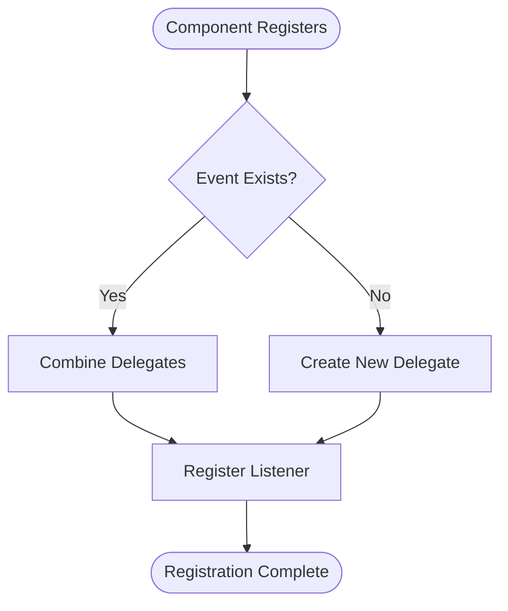
```mermaid
flowchart TD
Start([Component Registers]) --> Check{Event Exists?}
Check --> |Yes| Combine[Combine Delegates]
Check --> |No| Create[Create New Delegate]
Combine --> Register[Register Listener]
Create --> Register
Register --> End([Registration Complete])
```

**Diagram sources**
- [ScrapBook.cs](file://SETUNA/Main/ScrapBook.cs#L301-L317)

**Section sources**
- [ScrapBook.cs](file://SETUNA/Main/ScrapBook.cs#L46-L59)
- [ScrapBook.cs](file://SETUNA/Main/ScrapBook.cs#L301-L317)

## Scrap Lifecycle Management

The ScrapBook manages the complete lifecycle of scraps through carefully orchestrated methods that handle creation, modification, and disposal phases.

### Scrap Creation Methods

The ScrapBook provides multiple pathways for adding scraps to the collection:

#### Basic Scrap Addition
The `AddScrap` method provides a straightforward way to create new scraps with minimal configuration:

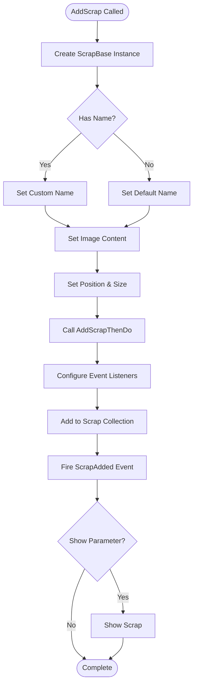
```mermaid
flowchart TD
Start([AddScrap Called]) --> Create[Create ScrapBase Instance]
Create --> SetName{Has Name?}
SetName --> |Yes| SetCustomName[Set Custom Name]
SetName --> |No| SetDefaultName[Set Default Name]
SetCustomName --> SetImage[Set Image Content]
SetDefaultName --> SetImage
SetImage --> SetBounds[Set Position & Size]
SetBounds --> CallAddThenDo[Call AddScrapThenDo]
CallAddThenDo --> ConfigureEvents[Configure Event Listeners]
ConfigureEvents --> AddToCollection[Add to Scrap Collection]
AddToCollection --> FireEvents[Fire ScrapAdded Event]
FireEvents --> Show{Show Parameter?}
Show --> |Yes| ShowScrap[Show Scrap]
Show --> |No| End([Complete])
ShowScrap --> End
```

**Diagram sources**
- [ScrapBook.cs](file://SETUNA/Main/ScrapBook.cs#L119-L131)

#### Advanced Scrap Addition with Cache Integration
The `AddScrapFromCache` method handles restoration of previously saved scraps with full style and position preservation:

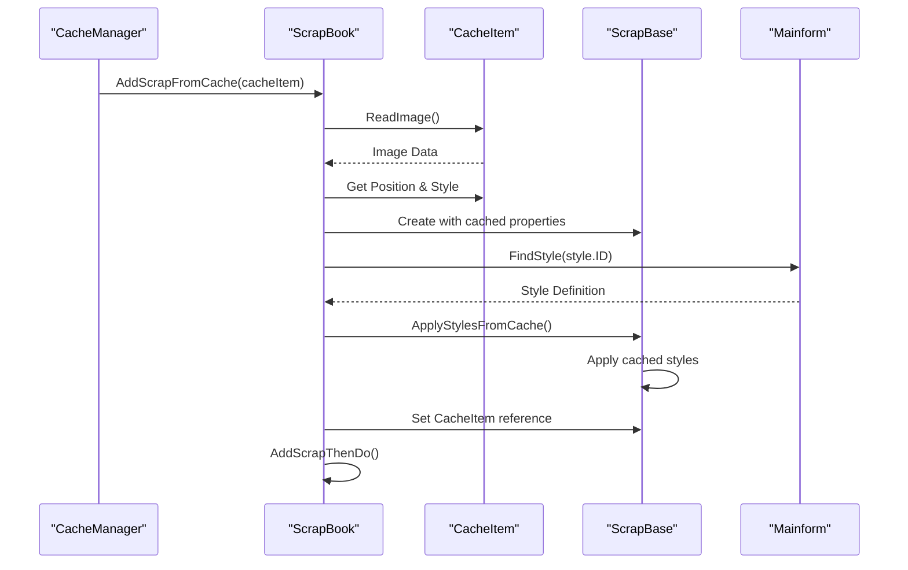
```mermaid
sequenceDiagram
participant CM as "CacheManager"
participant SB as "ScrapBook"
participant CI as "CacheItem"
participant S as "ScrapBase"
participant MF as "Mainform"
CM->>SB : AddScrapFromCache(cacheItem)
SB->>CI : ReadImage()
CI-->>SB : Image Data
SB->>CI : Get Position & Style
SB->>S : Create with cached properties
SB->>MF : FindStyle(style.ID)
MF-->>SB : Style Definition
SB->>S : ApplyStylesFromCache()
S->>S : Apply cached styles
SB->>S : Set CacheItem reference
SB->>SB : AddScrapThenDo()
```

**Diagram sources**
- [ScrapBook.cs](file://SETUNA/Main/ScrapBook.cs#L133-L166)

### Scrap Removal and Dustbox Management

The `ScrapClose` method implements sophisticated dustbox management with configurable capacity limits:

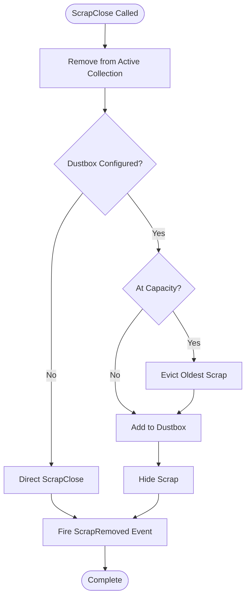
```mermaid
flowchart TD
Start([ScrapClose Called]) --> RemoveFromActive[Remove from Active Collection]
RemoveFromActive --> CheckDustbox{Dustbox Configured?}
CheckDustbox --> |No| DirectClose[Direct ScrapClose]
CheckDustbox --> |Yes| CheckCapacity{At Capacity?}
CheckCapacity --> |Yes| EvictOldest[Evict Oldest Scrap]
CheckCapacity --> |No| AddToDustbox[Add to Dustbox]
EvictOldest --> AddToDustbox
AddToDustbox --> HideScrap[Hide Scrap]
DirectClose --> FireRemoved[Fire ScrapRemoved Event]
HideScrap --> FireRemoved
FireRemoved --> End([Complete])
```

**Diagram sources**
- [ScrapBook.cs](file://SETUNA/Main/ScrapBook.cs#L203-L225)

**Section sources**
- [ScrapBook.cs](file://SETUNA/Main/ScrapBook.cs#L119-L166)
- [ScrapBook.cs](file://SETUNA/Main/ScrapBook.cs#L203-L225)

## Dustbox Management

The dustbox serves as a temporary holding area for deleted scraps, implementing a First-In-First-Out (FIFO) eviction policy with configurable capacity limits.

### Dustbox Configuration

The dustbox capacity is managed through the `DustBoxCapacity` property, which automatically handles overflow scenarios:

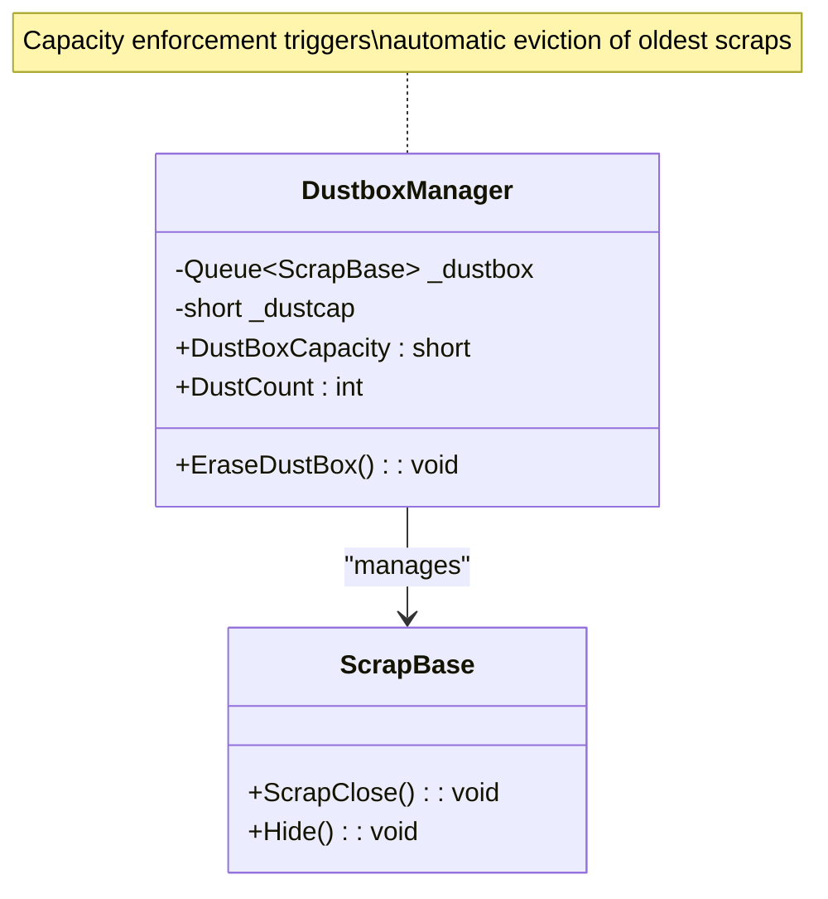
```mermaid
classDiagram
class DustboxManager {
-Queue~ScrapBase~ _dustbox
-short _dustcap
+DustBoxCapacity : short
+EraseDustBox() : void
+DustCount : int
}
class ScrapBase {
+ScrapClose() : void
+Hide() : void
}
DustboxManager --> ScrapBase : "manages"
note for DustboxManager "Capacity enforcement triggers\nautomatic eviction of oldest scraps"
```

**Diagram sources**
- [ScrapBook.cs](file://SETUNA/Main/ScrapBook.cs#L27-L40)

### Capacity Management Algorithm

When the dustbox capacity is reduced, the system automatically evicts the oldest scraps to maintain compliance:

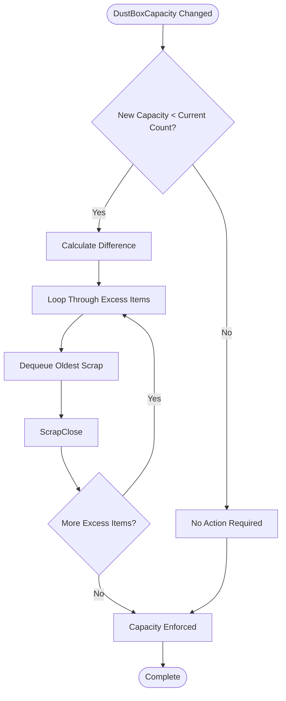
```mermaid
flowchart TD
Start([DustBoxCapacity Changed]) --> CheckNewCap{New Capacity < Current Count?}
CheckNewCap --> |No| NoAction[No Action Required]
CheckNewCap --> |Yes| CalculateDiff[Calculate Difference]
CalculateDiff --> Loop[Loop Through Excess Items]
Loop --> Dequeue[Dequeue Oldest Scrap]
Dequeue --> CloseScrap[ScrapClose]
CloseScrap --> CheckMore{More Excess Items?}
CheckMore --> |Yes| Loop
CheckMore --> |No| Complete[Capacity Enforced]
NoAction --> Complete
Complete --> End([Complete])
```

**Diagram sources**
- [ScrapBook.cs](file://SETUNA/Main/ScrapBook.cs#L32-L40)

**Section sources**
- [ScrapBook.cs](file://SETUNA/Main/ScrapBook.cs#L27-L40)
- [ScrapBook.cs](file://SETUNA/Main/ScrapBook.cs#L89-L101)

## Integration with CacheManager

The ScrapBook integrates seamlessly with CacheManager to provide persistent storage and retrieval of scrap data, enabling application restart recovery and long-term storage capabilities.

### Cache Integration Points

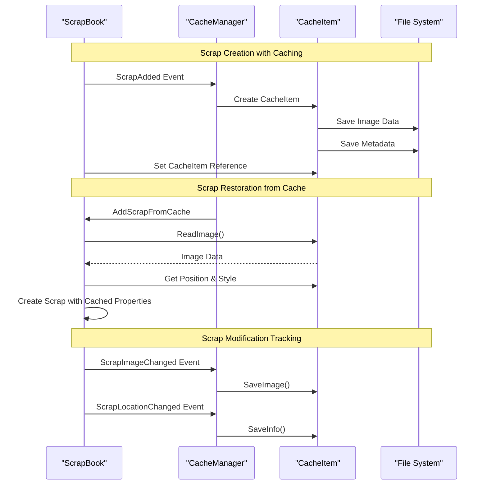
```mermaid
sequenceDiagram
participant SB as "ScrapBook"
participant CM as "CacheManager"
participant CI as "CacheItem"
participant FS as "File System"
Note over SB,FS : Scrap Creation with Caching
SB->>CM : ScrapAdded Event
CM->>CI : Create CacheItem
CI->>FS : Save Image Data
CI->>FS : Save Metadata
SB->>CI : Set CacheItem Reference
Note over SB,FS : Scrap Restoration from Cache
CM->>SB : AddScrapFromCache
SB->>CI : ReadImage()
CI-->>SB : Image Data
SB->>CI : Get Position & Style
SB->>SB : Create Scrap with Cached Properties
Note over SB,FS : Scrap Modification Tracking
SB->>CM : ScrapImageChanged Event
CM->>CI : SaveImage()
SB->>CM : ScrapLocationChanged Event
CM->>CI : SaveInfo()
```

**Diagram sources**
- [ScrapBook.cs](file://SETUNA/Main/ScrapBook.cs#L133-L166)
- [CacheManager.cs](file://SETUNA/Main/Cache/CacheManager.cs#L74-L158)

### Event-Based Persistence

CacheManager listens for various scrap events to maintain synchronization between in-memory state and persistent storage:

| Event | Purpose | Cache Operation |
|-------|---------|----------------|
| `ScrapAdded` | Track new scraps | Create CacheItem with image and metadata |
| `ScrapRemoved` | Clean up deleted scraps | Delete CacheItem from filesystem |
| `ScrapImageChanged` | Update image content | Replace cached image data |
| `ScrapLocationChanged` | Update position data | Save new position coordinates |
| `ScrapStyleApplied` | Track style changes | Update cached style information |
| `ScrapStyleRemoved` | Clear style data | Reset style to default in cache |

**Section sources**
- [ScrapBook.cs](file://SETUNA/Main/ScrapBook.cs#L133-L166)
- [CacheManager.cs](file://SETUNA/Main/Cache/CacheManager.cs#L74-L158)

## Performance Considerations

The ScrapBook is designed to handle large numbers of scraps efficiently through several optimization strategies and architectural decisions.

### Memory Management Strategies

#### Collection Type Selection
The ScrapBook uses `ArrayList` for active scraps and `Queue<T>` for dustbox items, each chosen for optimal performance characteristics:

- **ArrayList**: Provides fast indexed access and dynamic resizing for the active scrap collection
- **Queue**: Offers efficient FIFO operations for dustbox management with O(1) enqueue/dequeue operations

#### Event Handler Optimization
Event handlers are combined using delegate chaining rather than maintaining separate lists, reducing memory overhead and improving performance during event firing.

### Scalability Considerations

#### Dustbox Capacity Limits
Configurable dustbox capacity prevents unbounded memory growth while maintaining user experience quality. The automatic eviction mechanism ensures predictable memory usage patterns.

#### Lazy Loading Patterns
The `AddScrapFromCache` method implements lazy loading for image data, only loading images when needed for display operations.

### Performance Monitoring

The ScrapBook exposes monitoring properties for tracking collection sizes:

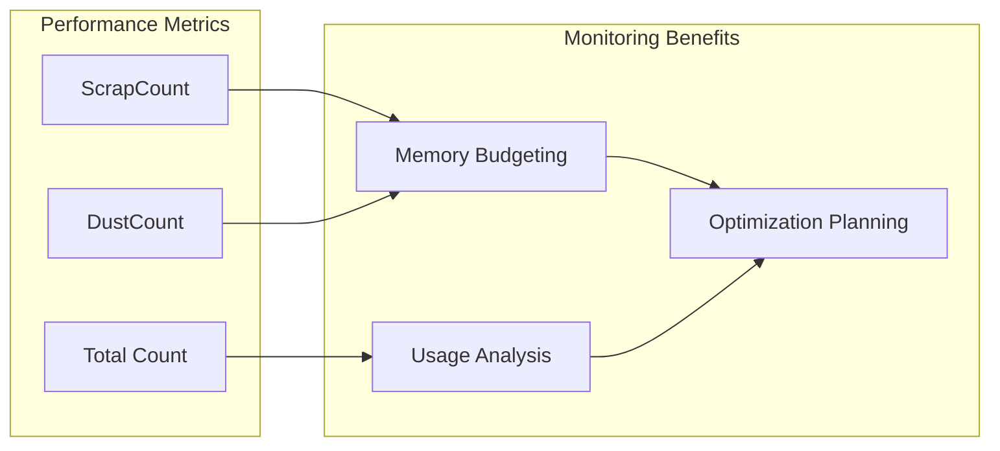
```mermaid
graph LR
subgraph "Performance Metrics"
SC[ScrapCount]
DC[DustCount]
TC[Total Count]
end
subgraph "Monitoring Benefits"
MB[Memory Budgeting]
UB[Usage Analysis]
OP[Optimization Planning]
end
SC --> MB
DC --> MB
TC --> UB
MB --> OP
UB --> OP
```

**Section sources**
- [ScrapBook.cs](file://SETUNA/Main/ScrapBook.cs#L261-L284)

## Memory Management

The ScrapBook implements comprehensive memory management strategies to prevent leaks and optimize resource utilization throughout the application lifecycle.

### Disposal Pattern Implementation

The class implements proper disposal patterns through both constructor initialization and finalizer cleanup:

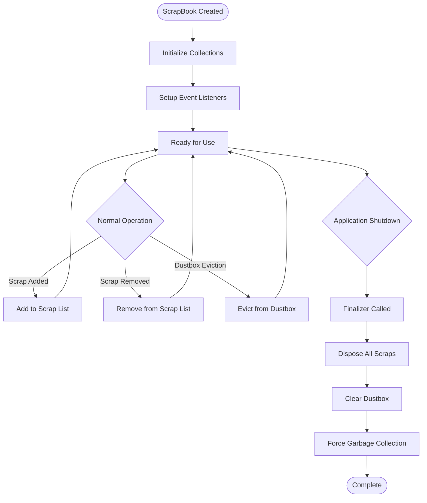
```mermaid
flowchart TD
Start([ScrapBook Created]) --> InitCollections[Initialize Collections]
InitCollections --> SetupListeners[Setup Event Listeners]
SetupListeners --> Ready[Ready for Use]
Ready --> NormalOp{Normal Operation}
NormalOp --> |Scrap Added| AddToList[Add to Scrap List]
NormalOp --> |Scrap Removed| RemoveFromList[Remove from Scrap List]
NormalOp --> |Dustbox Eviction| EvictFromDustbox[Evict from Dustbox]
AddToList --> Ready
RemoveFromList --> Ready
EvictFromDustbox --> Ready
Ready --> Cleanup{Application Shutdown}
Cleanup --> Finalizer[Finalizer Called]
Finalizer --> DisposeScraps[Dispose All Scraps]
DisposeScraps --> ClearDustbox[Clear Dustbox]
ClearDustbox --> CollectGC[Force Garbage Collection]
CollectGC --> End([Complete])
```

**Diagram sources**
- [ScrapBook.cs](file://SETUNA/Main/ScrapBook.cs#L61-L87)

### Automatic Resource Cleanup

The `EraseDustBox` method provides explicit cleanup of dustbox contents:

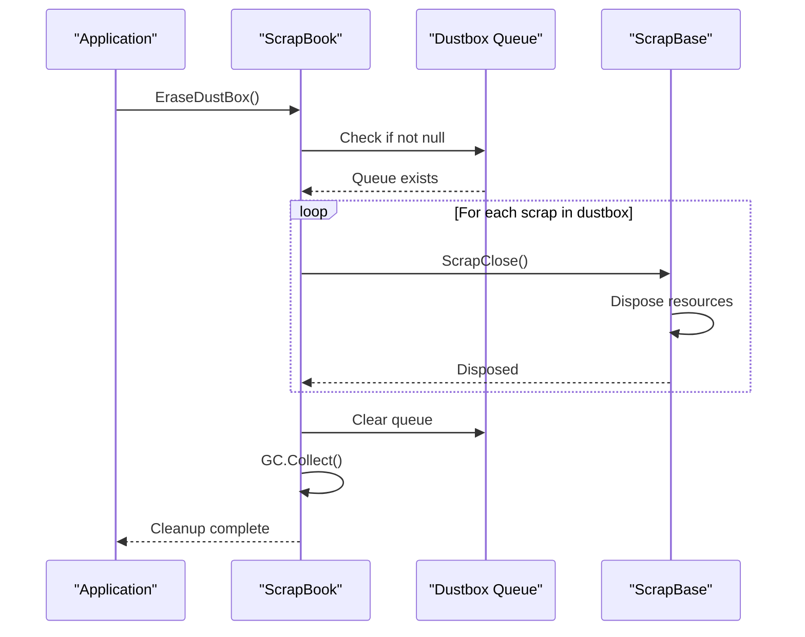
```mermaid
sequenceDiagram
participant App as "Application"
participant SB as "ScrapBook"
participant DB as "Dustbox Queue"
participant S as "ScrapBase"
App->>SB : EraseDustBox()
SB->>DB : Check if not null
DB-->>SB : Queue exists
loop For each scrap in dustbox
SB->>S : ScrapClose()
S->>S : Dispose resources
S-->>SB : Disposed
end
SB->>DB : Clear queue
SB->>SB : GC.Collect()
SB-->>App : Cleanup complete
```

**Diagram sources**
- [ScrapBook.cs](file://SETUNA/Main/ScrapBook.cs#L89-L101)

### Memory Leak Prevention

Several mechanisms prevent memory leaks:

1. **Proper Event Unsubscription**: Event handlers are properly combined and maintained
2. **Automatic Scrap Disposal**: Scraps are automatically disposed when removed from collections
3. **Dustbox Management**: Automatic eviction prevents accumulation of unused scraps
4. **Finalizer Implementation**: Ensures cleanup even if garbage collected prematurely

**Section sources**
- [ScrapBook.cs](file://SETUNA/Main/ScrapBook.cs#L61-L101)

## Practical Examples

### Basic Scrap Creation Workflow

Here's how a typical scrap creation workflow operates:

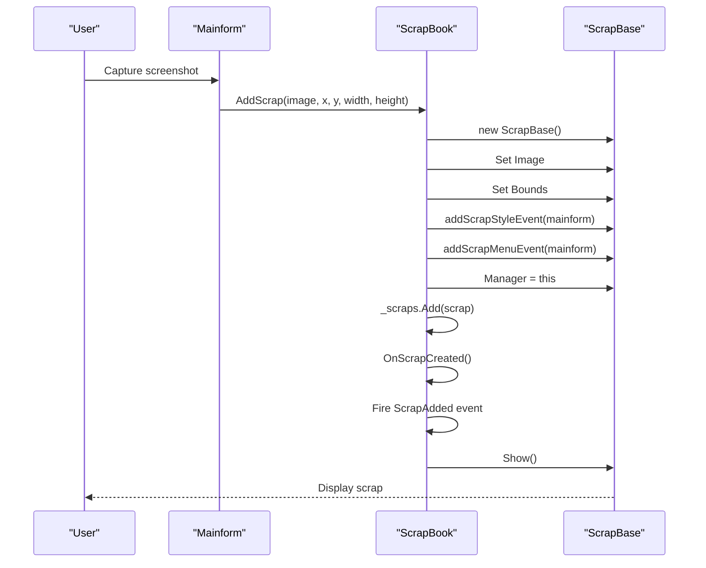
```mermaid
sequenceDiagram
participant User as "User"
participant MF as "Mainform"
participant SB as "ScrapBook"
participant S as "ScrapBase"
User->>MF : Capture screenshot
MF->>SB : AddScrap(image, x, y, width, height)
SB->>S : new ScrapBase()
SB->>S : Set Image
SB->>S : Set Bounds
SB->>S : addScrapStyleEvent(mainform)
SB->>S : addScrapMenuEvent(mainform)
SB->>S : Manager = this
SB->>SB : _scraps.Add(scrap)
SB->>SB : OnScrapCreated()
SB->>SB : Fire ScrapAdded event
SB->>S : Show()
S-->>User : Display scrap
```

**Diagram sources**
- [ScrapBook.cs](file://SETUNA/Main/ScrapBook.cs#L119-L131)
- [ScrapBook.cs](file://SETUNA/Main/ScrapBook.cs#L168-L191)

### WClickStyle Application Example

The `WClickStyle` method demonstrates how default styles are applied to newly created scraps:

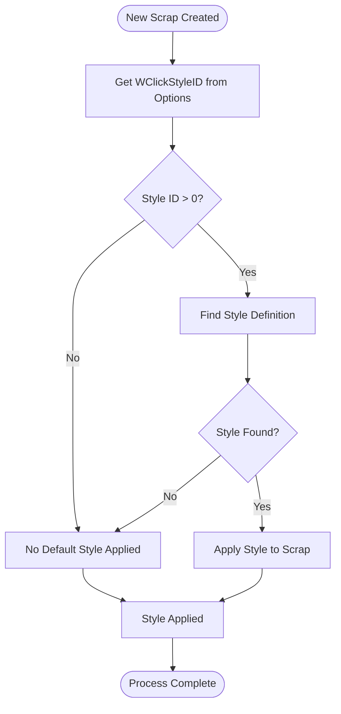
```mermaid
flowchart TD
Start([New Scrap Created]) --> GetStyleID[Get WClickStyleID from Options]
GetStyleID --> CheckID{Style ID > 0?}
CheckID --> |No| NoStyle[No Default Style Applied]
CheckID --> |Yes| FindStyle[Find Style Definition]
FindStyle --> StyleExists{Style Found?}
StyleExists --> |No| NoStyle
StyleExists --> |Yes| ApplyStyle[Apply Style to Scrap]
ApplyStyle --> Complete[Style Applied]
NoStyle --> Complete
Complete --> End([Process Complete])
```

**Diagram sources**
- [ScrapBook.cs](file://SETUNA/Main/ScrapBook.cs#L319-L330)

### Dustbox Management Scenario

When a scrap is closed, the dustbox management process handles capacity constraints:

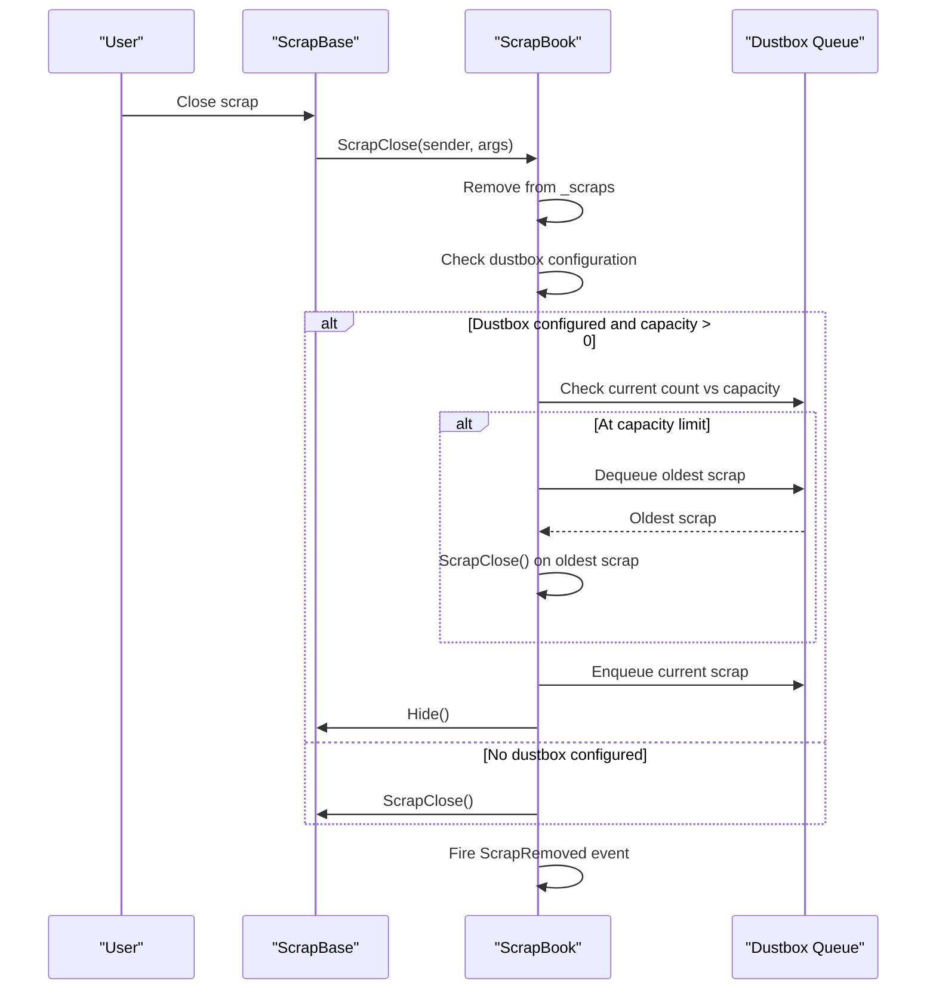
```mermaid
sequenceDiagram
participant User as "User"
participant S as "ScrapBase"
participant SB as "ScrapBook"
participant DB as "Dustbox Queue"
User->>S : Close scrap
S->>SB : ScrapClose(sender, args)
SB->>SB : Remove from _scraps
SB->>SB : Check dustbox configuration
alt Dustbox configured and capacity > 0
SB->>DB : Check current count vs capacity
alt At capacity limit
SB->>DB : Dequeue oldest scrap
DB-->>SB : Oldest scrap
SB->>SB : ScrapClose() on oldest scrap
end
SB->>DB : Enqueue current scrap
SB->>S : Hide()
else No dustbox configured
SB->>S : ScrapClose()
end
SB->>SB : Fire ScrapRemoved event
```

**Diagram sources**
- [ScrapBook.cs](file://SETUNA/Main/ScrapBook.cs#L203-L225)

**Section sources**
- [ScrapBook.cs](file://SETUNA/Main/ScrapBook.cs#L119-L131)
- [ScrapBook.cs](file://SETUNA/Main/ScrapBook.cs#L319-L330)
- [ScrapBook.cs](file://SETUNA/Main/ScrapBook.cs#L203-L225)

## Best Practices

### Scrap Management Guidelines

1. **Always Use Proper Disposal**: Rely on the automatic disposal mechanisms rather than manual cleanup
2. **Monitor Collection Sizes**: Regularly check `ScrapCount` and `DustCount` for performance monitoring
3. **Configure Appropriate Dustbox Capacity**: Balance between memory usage and user convenience
4. **Handle Event Subscriptions Carefully**: Ensure proper event handler registration and cleanup

### Performance Optimization Tips

1. **Batch Operations**: Use `ShowAllScrap()`, `HideAllScrap()`, and `CloseAllScrap()` for bulk operations
2. **Lazy Loading**: Leverage the cache system for deferred image loading
3. **Memory Pressure**: Monitor memory usage and consider reducing dustbox capacity under memory pressure
4. **Event Filtering**: Implement selective event handling to reduce unnecessary processing

### Integration Patterns

1. **Event-Driven Architecture**: Design components to respond to ScrapBook events rather than direct references
2. **Cache-Aware Operations**: Always consider cache implications when modifying scrap properties
3. **Thread Safety**: While not explicitly thread-safe, design concurrent access patterns carefully
4. **Resource Cleanup**: Implement proper cleanup in derived classes and custom scrap types

The ScrapBook class exemplifies robust architectural design through its comprehensive event system, efficient collection management, and seamless integration with persistence mechanisms. Its careful balance of functionality, performance, and maintainability makes it a cornerstone of the SETUNA application's architecture.