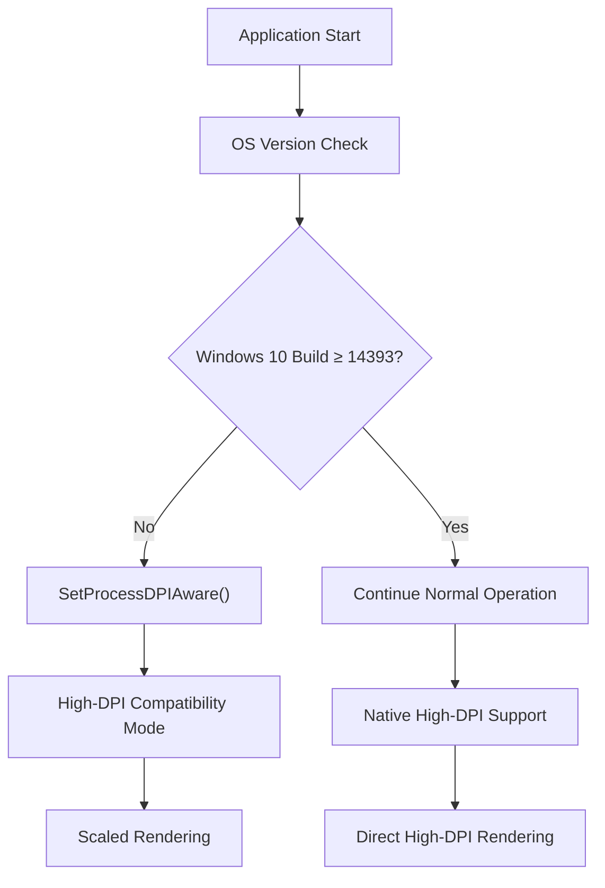
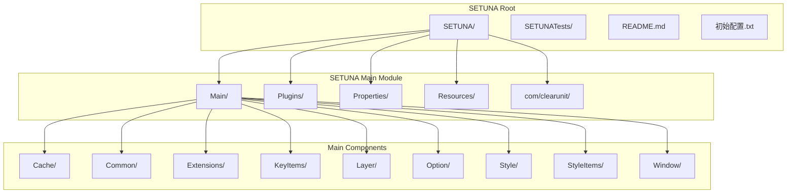
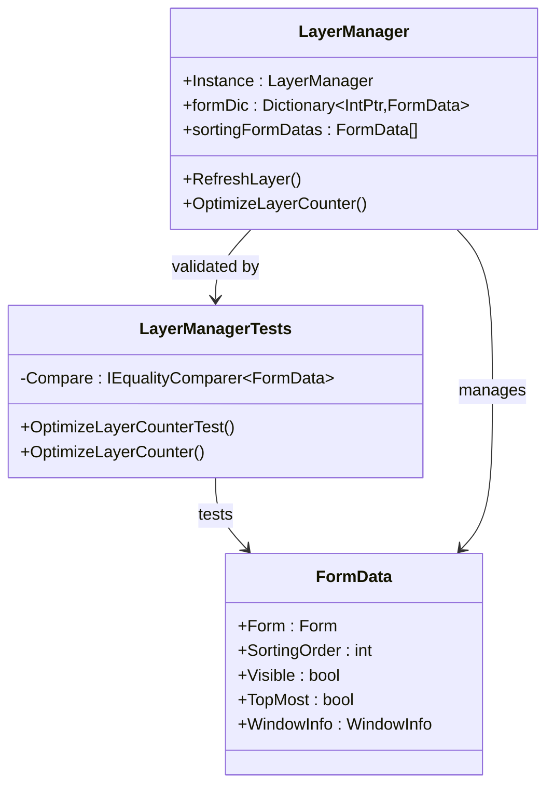
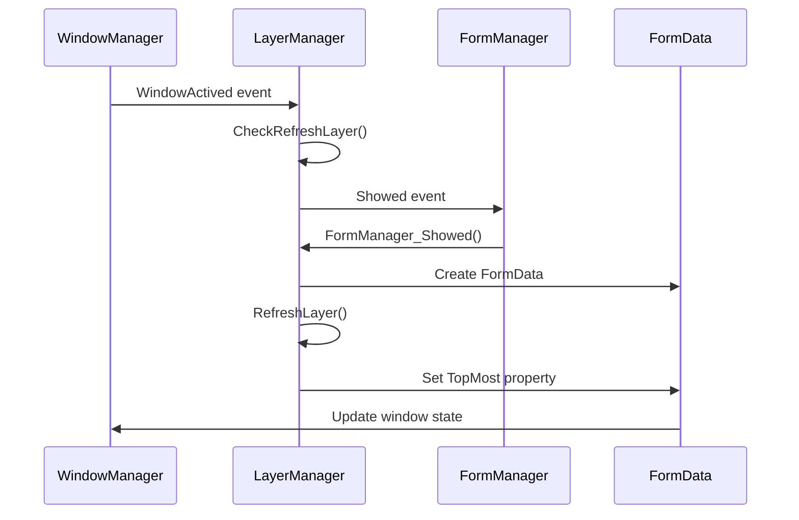
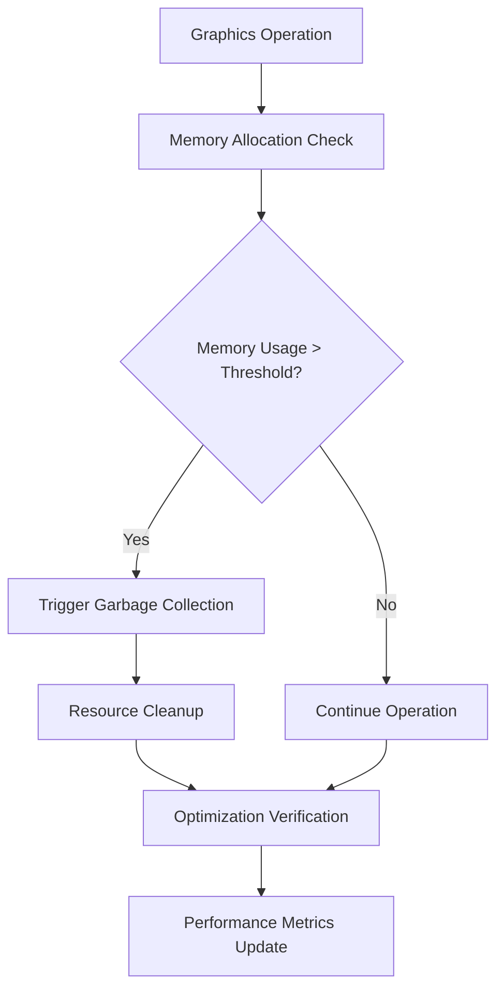

# Development Guide

<cite>
**Referenced Files in This Document**
- [README.md](file://README.md)
- [SETUNA.csproj](file://SETUNA/SETUNA.csproj)
- [SETUNATests.csproj](file://SETUNATests/SETUNATests.csproj)
- [LayerManager.cs](file://SETUNA/Main/Layer/LayerManager.cs)
- [Program.cs](file://SETUNA/Program.cs)
- [LayerManagerTests.cs](file://SETUNATests/Main/Layer/LayerManagerTests.cs)
- [FodyWeavers.xml](file://SETUNA/FodyWeavers.xml)
- [packages.config](file://SETUNA/packages.config)
- [AssemblyInfo.cs](file://SETUNA/Properties/AssemblyInfo.cs)
- [SingletonApplication.cs](file://SETUNA/com/clearunit/SingletonApplication.cs)
- [WindowsAPI.cs](file://SETUNA/Main/Common/WindowsAPI.cs)
- [初始配置.txt](file://初始配置.txt)
- [WebPWrapper.cs](file://SETUNA/Plugins/WebPWrapper.cs)
</cite>

## Table of Contents
1. [Introduction](#introduction)
2. [Project Overview](#project-overview)
3. [Development Environment Setup](#development-environment-setup)
4. [Build Process and Platform Requirements](#build-process-and-platform-requirements)
5. [Project Structure](#project-structure)
6. [Dependencies and Libraries](#dependencies-and-libraries)
7. [Testing Framework](#testing-framework)
8. [Contribution Workflow](#contribution-workflow)
9. [Development Guidelines](#development-guidelines)
10. [Performance Optimization](#performance-optimization)
11. [Troubleshooting](#troubleshooting)
12. [Best Practices](#best-practices)

## Introduction

SETUNA is a sophisticated screenshot capture and editing tool built with .NET Framework 4.7. This development guide provides comprehensive instructions for setting up the development environment, understanding the project structure, building the application, and contributing to the codebase. The project emphasizes high-DPI support and cross-platform compatibility while maintaining efficient graphics operations.

## Project Overview

SETUNA is a Windows desktop application designed for capturing, editing, and managing screenshots with advanced features including layer management, style applications, and multi-format image support. The application supports various image formats (JPEG, PNG, PSD, GIF, BMP, ICO, TIFF, WEBP, SVG, TGA) and provides extensive customization options through a plugin architecture.

### Key Features
- High-DPI screenshot support across multiple monitors
- Layer-based image editing with Z-order management
- Extensible style system for image effects
- Plugin architecture for format support
- Cross-platform compatibility with automatic DPI detection
- Memory-efficient graphics operations

**Section sources**
- [README.md](file://README.md#L1-L89)
- [AssemblyInfo.cs](file://SETUNA/Properties/AssemblyInfo.cs#L1-L17)

## Development Environment Setup

### Prerequisites

Before starting development, ensure your environment meets the following requirements:

#### System Requirements
- **Operating System**: Windows 10 Build 14393 or higher
- **Visual Studio**: Visual Studio 2019 or later with .NET Framework 4.7 development tools
- **.NET Framework**: .NET Framework 4.7 installed
- **Memory**: Minimum 4GB RAM (8GB recommended for debugging)

#### Initial Configuration Steps

Follow these essential steps to prepare your development environment:

1. **Platform Selection**: Switch the build platform to x86 before first debugging session
2. **First Debug Launch**: Run the application using F5 to initialize the singleton application
3. **Resource Loading**: Ensure all embedded resources are properly loaded during initialization

**Section sources**
- [初始配置.txt](file://初始配置.txt#L1-L1)
- [Program.cs](file://SETUNA/Program.cs#L14-L30)

## Build Process and Platform Requirements

### Platform Architecture

SETUNA requires specific platform targeting for optimal functionality:

#### x86 Platform Requirement
The application mandates x86 platform targeting due to:
- Native library dependencies (libwebp_x86.dll)
- Memory management optimizations
- Graphics API compatibility
- Singleton application architecture constraints

#### Build Configurations

The project supports multiple build configurations:

| Configuration | Platform | Purpose | Output Path |
|---------------|----------|---------|-------------|
| Debug | x86 | Development debugging | bin\x86\Debug\ |
| Debug | x64 | 64-bit development | bin\x64\Debug\ |
| Release | x86 | Production build | bin\x86\Release\ |
| Release | x64 | 64-bit production | bin\x64\Release\ |

#### High-DPI Awareness Configuration

The application automatically handles high-DPI scenarios:

**Diagram sources**
- [Program.cs](file://SETUNA/Program.cs#L14-L19)
- [WindowsAPI.cs](file://SETUNA/Main/Common/WindowsAPI.cs#L19-L20)

**Section sources**
- [SETUNA.csproj](file://SETUNA/SETUNA.csproj#L79-L99)
- [Program.cs](file://SETUNA/Program.cs#L14-L19)

## Project Structure

### Directory Organization

The project follows a modular architecture with clear separation of concerns:

**Diagram sources**
- [SETUNA.csproj](file://SETUNA/SETUNA.csproj#L1-L50)

### Core Modules

#### Main Application Module (`SETUNA/Main/`)
Contains the primary application logic organized into specialized submodules:

- **Cache**: Memory management and caching mechanisms
- **Common**: Utility classes and shared functionality
- **Extensions**: Plugin and extension system
- **KeyItems**: Keyboard shortcut management
- **Layer**: Window and layer management system
- **Option**: Configuration and settings management
- **Style**: Image effect and styling system
- **StyleItems**: Individual style implementations
- **Window**: Window management and positioning

#### Testing Module (`SETUNATests/`)
Unit testing framework for validating core functionality:

- **Layer**: Tests for layer management and Z-order operations
- **Integration**: End-to-end testing scenarios

**Section sources**
- [SETUNA.csproj](file://SETUNA/SETUNA.csproj#L130-L534)
- [SETUNATests.csproj](file://SETUNATests/SETUNATests.csproj#L60-L61)

## Dependencies and Libraries

### Core Dependencies

SETUNA relies on several key libraries for functionality:

#### Newtonsoft.Json
- **Purpose**: JSON serialization for configuration and data persistence
- **Version**: 12.0.3
- **Usage**: Configuration storage, cache management, data interchange
- **Integration**: Automatic deserialization of application settings

#### System.Drawing
- **Purpose**: Core graphics operations and image manipulation
- **Usage**: Screen capture, image processing, rendering operations
- **Features**: Multi-format image support, graphics contexts, drawing operations

#### Additional Libraries

| Library | Purpose | Version | Integration |
|---------|---------|---------|-------------|
| Svg | SVG image format support | 2.2.1 | Vector graphics rendering |
| System.Drawing.PSD | Photoshop PSD format support | 0.1.0 | Professional image editing |
| TgaLib | Truevision TGA format support | 1.0.2 | Game and professional graphics |
| Costura.Fody | Assembly embedding | 4.1.0 | Single-file deployment |

#### Native Dependencies

The project includes platform-specific native libraries:

- **libwebp_x86.dll**: WebP format compression (x86)
- **libwebp_x64.dll**: WebP format compression (x64)

**Section sources**
- [packages.config](file://SETUNA/packages.config#L1-L9)
- [SETUNA.csproj](file://SETUNA/SETUNA.csproj#L105-L123)

## Testing Framework

### Unit Testing Architecture

SETUNA employs Microsoft MSTest for comprehensive unit testing:

#### Test Project Structure
- **SETUNATests**: Contains all unit test assemblies
- **LayerManagerTests**: Focuses on layer management functionality
- **Integration Tests**: End-to-end scenario validation

#### Testing Capabilities

**Diagram sources**
- [LayerManagerTests.cs](file://SETUNATests/Main/Layer/LayerManagerTests.cs#L1-L80)
- [LayerManager.cs](file://SETUNA/Main/Layer/LayerManager.cs#L1-L320)

#### Test Execution Guidelines

1. **Setup**: Ensure LayerManager is initialized before tests
2. **Mocking**: Use realistic FormData collections for testing
3. **Validation**: Verify sorting order optimization and memory efficiency
4. **Performance**: Monitor optimization performance with large datasets

**Section sources**
- [SETUNATests.csproj](file://SETUNATests/SETUNATests.csproj#L1-L107)
- [LayerManagerTests.cs](file://SETUNATests/Main/Layer/LayerManagerTests.cs#L1-L80)

## Contribution Workflow

### Development Process

#### Pre-Development Setup
1. **Environment Configuration**: Switch to x86 platform and run initial debug session
2. **Dependency Management**: Restore NuGet packages using Package Manager
3. **Resource Validation**: Verify all embedded resources are accessible

#### Coding Standards

##### Naming Conventions
- **Classes**: PascalCase (e.g., `LayerManager`, `FormData`)
- **Methods**: PascalCase (e.g., `RefreshLayer`, `OptimizeLayerCounter`)
- **Variables**: camelCase (e.g., `formDic`, `sortingFormDatas`)
- **Constants**: UPPER_CASE (e.g., `CURSOR_SHOWING`)

##### Code Organization
- **Separation of Concerns**: Each module handles specific functionality
- **Dependency Injection**: Use interfaces for loose coupling
- **Exception Handling**: Implement proper error handling with meaningful messages

#### Pull Request Process

1. **Feature Branch**: Create feature branch from develop
2. **Implementation**: Follow coding standards and add tests
3. **Testing**: Ensure all tests pass and add new tests for new functionality
4. **Documentation**: Update relevant documentation
5. **Pull Request**: Submit PR with clear description and testing results

### Quality Assurance

#### Code Review Criteria
- **Functionality**: Correct implementation of requirements
- **Performance**: Efficient algorithms and memory usage
- **Maintainability**: Clean, readable code with proper comments
- **Compatibility**: Backward compatibility and cross-platform support

**Section sources**
- [LayerManager.cs](file://SETUNA/Main/Layer/LayerManager.cs#L1-L320)

## Development Guidelines

### Layer Management System

The LayerManager serves as the central coordination hub for window management:

#### Core Responsibilities
- **Window Tracking**: Monitor all application windows and their states
- **Z-Order Management**: Maintain proper layer ordering for visual hierarchy
- **Performance Optimization**: Efficient handling of large numbers of windows
- **Event Coordination**: Synchronize window events across the application

#### Implementation Patterns

**Diagram sources**
- [LayerManager.cs](file://SETUNA/Main/Layer/LayerManager.cs#L35-L52)

### Singleton Application Pattern

The application implements a singleton pattern for single-instance enforcement:

#### Architecture Benefits
- **Resource Efficiency**: Prevents multiple instances consuming resources
- **State Consistency**: Maintains consistent application state
- **IPC Communication**: Enables inter-process communication for startup commands

**Section sources**
- [SingletonApplication.cs](file://SETUNA/com/clearunit/SingletonApplication.cs#L1-L113)
- [LayerManager.cs](file://SETUNA/Main/Layer/LayerManager.cs#L29-L57)

## Performance Optimization

### Graphics Operations Optimization

#### Memory Management Strategies

The application implements several optimization techniques for graphics operations:

##### WebP Compression Optimization
- **Platform-Specific Libraries**: Separate x86/x64 native libraries for optimal performance
- **Memory Pooling**: Reuse WebPPicture structures for batch operations
- **Efficient Encoding**: Lossless compression with minimal memory overhead

##### Image Processing Pipeline
- **Lazy Loading**: Load images only when needed
- **Caching Strategy**: Intelligent caching of frequently accessed images
- **Resource Cleanup**: Proper disposal of graphics resources

#### Performance Monitoring

**Diagram sources**
- [WebPWrapper.cs](file://SETUNA/Plugins/WebPWrapper.cs#L813-L2073)

### Layer Management Performance

#### Optimization Techniques
- **Batch Processing**: Group layer operations for efficiency
- **Indexing**: Use dictionaries for O(1) window lookup
- **Lazy Initialization**: Initialize components only when needed
- **Event Throttling**: Limit refresh frequency during rapid changes

**Section sources**
- [LayerManager.cs](file://SETUNA/Main/Layer/LayerManager.cs#L60-L122)
- [WebPWrapper.cs](file://SETUNA/Plugins/WebPWrapper.cs#L1552-L1567)

## Troubleshooting

### Common Development Issues

#### High-DPI Debugging Challenges
- **Symptom**: Screenshots appear scaled incorrectly during debugging
- **Solution**: Ensure proper DPI awareness configuration and test on actual high-DPI displays
- **Prevention**: Use virtual machines with high-DPI settings for testing

#### Resource Embedding Problems
- **Symptom**: Embedded resources not loading during development
- **Solution**: Verify Costura.Fody configuration and rebuild project
- **Prevention**: Regularly clean and rebuild solution

#### Memory Management Issues
- **Symptom**: Out-of-memory errors with large images
- **Solution**: Implement proper disposal patterns and memory pooling
- **Prevention**: Monitor memory usage during development and testing

### Debugging Strategies

#### Layer Management Debugging
1. **Enable Debug Logging**: Use console output for layer state tracking
2. **Visual Inspection**: Monitor window Z-order visually
3. **Performance Profiling**: Use memory profilers to identify leaks

#### Graphics Operations Debugging
1. **Resource Tracking**: Monitor bitmap and graphics object lifecycle
2. **Format Validation**: Verify image format compatibility
3. **Memory Monitoring**: Track memory usage during operations

**Section sources**
- [LayerManager.cs](file://SETUNA/Main/Layer/LayerManager.cs#L154-L191)
- [WindowsAPI.cs](file://SETUNA/Main/Common/WindowsAPI.cs#L1-L170)

## Best Practices

### Development Standards

#### Code Quality
- **Unit Testing**: Every major component should have corresponding unit tests
- **Documentation**: Include XML documentation for public APIs
- **Error Handling**: Implement comprehensive exception handling
- **Performance**: Profile critical paths regularly

#### Security Considerations
- **Resource Access**: Validate all external resource access
- **Memory Safety**: Use safe disposal patterns for unmanaged resources
- **Input Validation**: Sanitize all user inputs and external data

#### Maintenance Guidelines
- **Dependency Updates**: Regularly update NuGet packages
- **Code Refactoring**: Continuously improve code structure
- **Performance Monitoring**: Track application performance metrics
- **Compatibility Testing**: Verify functionality across supported platforms

### Extension Development

#### Plugin Architecture
- **Interface Design**: Define clear interfaces for plugin development
- **Resource Management**: Handle plugin resources efficiently
- **Error Isolation**: Prevent plugin failures from affecting core functionality

#### Style System Development
- **Modular Design**: Create reusable style components
- **Performance Optimization**: Minimize rendering overhead
- **User Experience**: Provide intuitive configuration interfaces

**Section sources**
- [FodyWeavers.xml](file://SETUNA/FodyWeavers.xml#L1-L3)
- [AssemblyInfo.cs](file://SETUNA/Properties/AssemblyInfo.cs#L1-L17)