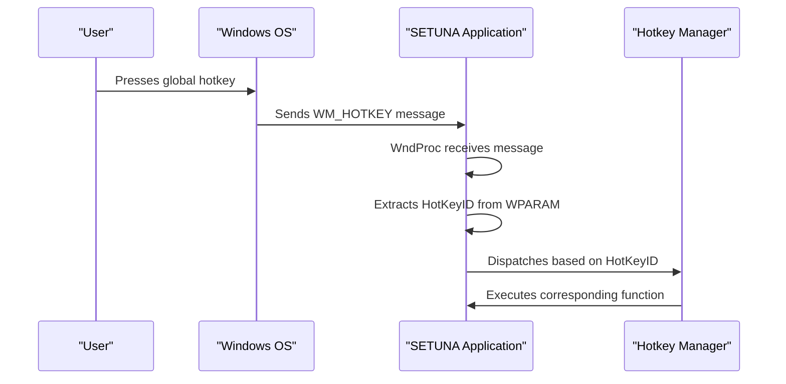

# Hotkey IDs and Mapping

<cite>
**Referenced Files in This Document**   
- [HotKeyID.cs](file://SETUNA/Main/HotKeyID.cs)
- [Mainform.cs](file://SETUNA/Mainform.cs)
- [SetunaOption.cs](file://SETUNA/Main/Option/SetunaOption.cs)
- [HotkeyControl.cs](file://SETUNA/Main/HotkeyControl.cs)
- [WindowsAPI.cs](file://SETUNA/Main/Common/WindowsAPI.cs)
</cite>

## Table of Contents
1. [Introduction](#introduction)
2. [HotKeyID Enumeration Structure](#hotkeyid-enumeration-structure)
3. [Role in Hotkey System Architecture](#role-in-hotkey-system-architecture)
4. [Integration with Main Application Logic](#integration-with-main-application-logic)
5. [Extending the Hotkey System](#extending-the-hotkey-system)
6. [Type Safety and Design Benefits](#type-safety-and-design-benefits)
7. [Limitations of Current Design](#limitations-of-current-design)
8. [Maintaining Backward Compatibility](#maintaining-backward-compatibility)
9. [Conclusion](#conclusion)

## Introduction
The HotKeyID enumeration serves as a central component in the SETUNA application's global hotkey system, providing a type-safe mechanism for mapping keyboard shortcuts to specific application functions. This document details the architecture and implementation of the hotkey system, focusing on how the HotKeyID enum enables reliable dispatching of hotkey events to appropriate handlers within the application. The system leverages Windows API messaging to capture global keyboard events and uses the enumeration values as identifiers to route these events to their corresponding functionality.

**Section sources**
- [HotKeyID.cs](file://SETUNA/Main/HotKeyID.cs#L3-L9)

## HotKeyID Enumeration Structure
The HotKeyID enumeration defines two primary hotkey identifiers and a sentinel value for array sizing:

```csharp
public enum HotKeyID
{
    Capture = 0,
    Function1,
    __Count__ = 2,
}
```

The enumeration contains two functional hotkey IDs: `Capture` (assigned value 0) and `Function1` (assigned value 1, following standard C# enum increment rules). The `__Count__` member serves as a sentinel value with an explicit value of 2, which represents the total number of hotkey entries. This pattern allows for convenient array sizing and bounds checking in hotkey management code, as the `__Count__` value can be used to determine the size of arrays that store hotkey configurations or states.

**Section sources**
- [HotKeyID.cs](file://SETUNA/Main/HotKeyID.cs#L3-L9)

## Role in Hotkey System Architecture
The HotKeyID enumeration plays a critical role in the hotkey system architecture by serving as the bridge between Windows API hotkey messages and application functionality. When a registered global hotkey is pressed, the Windows operating system sends a WM_HOTKEY message to the application, with the hotkey identifier passed in the WPARAM parameter. The application uses the HotKeyID enum to interpret this identifier and dispatch the appropriate action.

The hotkey registration process in the SetunaOption class uses the HotKeyID values as parameters when registering hotkeys with the Windows API. The `RegistHotKey` method takes a HotKeyID parameter and uses its integer value as the hotkey identifier when calling the Windows API `RegisterHotKey` function. This creates a direct mapping between the enum values and the system-level hotkey identifiers.



**Diagram sources**
- [HotKeyID.cs](file://SETUNA/Main/HotKeyID.cs#L3-L9)
- [Mainform.cs](file://SETUNA/Mainform.cs#L383-L397)
- [SetunaOption.cs](file://SETUNA/Main/Option/SetunaOption.cs#L707-L734)

**Section sources**
- [HotKeyID.cs](file://SETUNA/Main/HotKeyID.cs#L3-L9)
- [SetunaOption.cs](file://SETUNA/Main/Option/SetunaOption.cs#L707-L734)

## Integration with Main Application Logic
The integration of HotKeyID with the main application logic occurs primarily in the Mainform.cs file through the WndProc method override, which handles Windows messages including hotkey events. When a WM_HOTKEY message is received, the method extracts the HotKeyID from the WPARAM parameter and uses a switch statement to dispatch the appropriate action.

The WndProc method processes hotkey messages by casting the WPARAM value to the HotKeyID enum type, enabling type-safe comparison in the switch statement. For the `Capture` hotkey, the application initiates the screenshot capture process by calling `StartCapture()`. For the `Function1` hotkey, it performs the corresponding function (implementation details would be in the specific handler logic).

During application initialization and configuration changes, the Mainform registers the hotkeys by calling the `RegistHotKey` method on the SetunaOption instance, passing the appropriate HotKeyID values. If registration fails, the application provides feedback through the HotkeyMsg form, which displays information about the hotkey configuration.

```mermaid
flowchart TD
A[WM_HOTKEY Message] --> B{Extract HotKeyID<br/>from WPARAM}
B --> C[Switch on HotKeyID]
C --> D[Capture: StartCapture()]
C --> E[Function1: Execute Function]
D --> F[Initiate Screenshot Process]
E --> G[Perform Assigned Function]
```

**Diagram sources**
- [Mainform.cs](file://SETUNA/Mainform.cs#L383-L397)
- [SetunaOption.cs](file://SETUNA/Main/Option/SetunaOption.cs#L707-L734)

**Section sources**
- [Mainform.cs](file://SETUNA/Mainform.cs#L383-L397)
- [SetunaOption.cs](file://SETUNA/Main/Option/SetunaOption.cs#L707-L734)

## Extending the Hotkey System
Extending the hotkey system requires modifications to both the HotKeyID enumeration and the corresponding handler logic. To add a new hotkey function, developers must:

1. Add a new enum member to HotKeyID (e.g., `Function2`)
2. Update the `__Count__` sentinel value to reflect the new total
3. Register the new hotkey in the application initialization code
4. Add a new case to the WndProc switch statement to handle the new hotkey

When adding new hotkey functions, the array sizing pattern using `__Count__` ensures that any arrays used for storing hotkey configurations automatically accommodate the new entry. For example, the `hkScrap` array in SetunaOption is initialized using `(int)HotKeyID.__Count__`, which will automatically adjust to the correct size when new hotkeys are added.

The HotkeyControl class provides a user interface component for configuring hotkeys, which can be extended to support additional hotkey entries. The control uses Windows API messages (1025 for setting and 1026 for getting hotkey values) to interact with the native hotkey control, ensuring consistent behavior with standard Windows hotkey controls.

**Section sources**
- [HotKeyID.cs](file://SETUNA/Main/HotKeyID.cs#L3-L9)
- [Mainform.cs](file://SETUNA/Mainform.cs#L383-L397)
- [HotkeyControl.cs](file://SETUNA/Main/HotkeyControl.cs#L38-L75)

## Type Safety and Design Benefits
The use of the HotKeyID enumeration provides significant type safety benefits over using magic numbers or string identifiers for hotkey management. By defining hotkey identifiers as enum members, the system ensures compile-time checking of hotkey references, preventing errors from misspelled or invalid identifiers.

The enumeration pattern eliminates the risk of using incorrect integer values when registering or handling hotkeys, as the compiler will catch any attempts to use values that are not defined in the enum. This approach also improves code readability and maintainability, as the intent of each hotkey identifier is clear from its name rather than requiring comments to explain magic numbers.

The `__Count__` sentinel value demonstrates a common C-style pattern adapted for C# enums, providing a convenient way to determine the number of enum members for array sizing and iteration purposes. This pattern enables foreach loops over all hotkey IDs using `Enum.GetValues(typeof(HotKeyID))`, which is used in various parts of the codebase for initializing or validating hotkey configurations.

**Section sources**
- [HotKeyID.cs](file://SETUNA/Main/HotKeyID.cs#L3-L9)
- [Mainform.cs](file://SETUNA/Mainform.cs#L608)

## Limitations of Current Design
The current two-entry design of the HotKeyID enumeration presents several limitations that may impact future extensibility. With only two functional hotkeys (`Capture` and `Function1`), the system has limited capacity for additional global shortcuts without modifying the core enumeration.

The hard-coded switch statement in WndProc must be manually updated each time a new hotkey is added, creating a maintenance burden and potential for errors. A more scalable approach might use a dictionary-based dispatch system that maps HotKeyID values to action delegates, allowing for more dynamic registration of hotkey handlers.

The current design assumes that all hotkeys are managed through the same registration process and handled in the main form, which may not accommodate more complex scenarios where different components need to register their own hotkeys. The tight coupling between the HotKeyID enum and the main application logic could make it difficult to modularize the application in the future.

Additionally, the use of a sentinel value (`__Count__`) with an explicit numeric assignment requires careful maintenance to ensure it remains accurate as new enum members are added, creating a potential source of bugs if developers forget to update it.

**Section sources**
- [HotKeyID.cs](file://SETUNA/Main/HotKeyID.cs#L3-L9)
- [Mainform.cs](file://SETUNA/Mainform.cs#L383-L397)

## Maintaining Backward Compatibility
When modifying the hotkey ID system, maintaining backward compatibility is crucial to ensure existing user configurations continue to work. The current design provides some inherent backward compatibility through the use of numeric enum values that correspond to the Windows API hotkey identifiers.

When adding new hotkeys, developers should append them to the end of the enumeration to preserve the numeric values of existing entries. This ensures that saved configurations that store hotkey IDs as integers remain valid. The `__Count__` sentinel value should be updated to reflect the new total number of entries, but existing code that relies on this value for array sizing will continue to function correctly.

For configuration storage, the system should continue to use the integer representation of the enum values when persisting hotkey settings, as this provides the most stable format across application updates. Migration strategies should be implemented for any changes to the hotkey system, including version checking of configuration files and automatic conversion of old format settings to new formats when possible.

The hotkey registration process should include error handling that gracefully degrades when hotkey registration fails, allowing the application to continue functioning even if global hotkeys cannot be established.

**Section sources**
- [HotKeyID.cs](file://SETUNA/Main/HotKeyID.cs#L3-L9)
- [SetunaOption.cs](file://SETUNA/Main/Option/SetunaOption.cs#L707-L734)

## Conclusion
The HotKeyID enumeration is a fundamental component of the SETUNA application's hotkey system, providing a type-safe mechanism for mapping global keyboard shortcuts to specific application functions. By using enum values as identifiers, the system achieves improved reliability and maintainability compared to using magic numbers. The integration with Windows API messaging through the WndProc method enables efficient dispatching of hotkey events to appropriate handlers.

While the current two-entry design serves the application's immediate needs, considerations for future extensibility should be addressed, potentially through a more dynamic dispatch mechanism. The type safety benefits of the enum approach outweigh the limitations of the current implementation, and careful attention to backward compatibility will ensure smooth evolution of the hotkey system as new features are added.