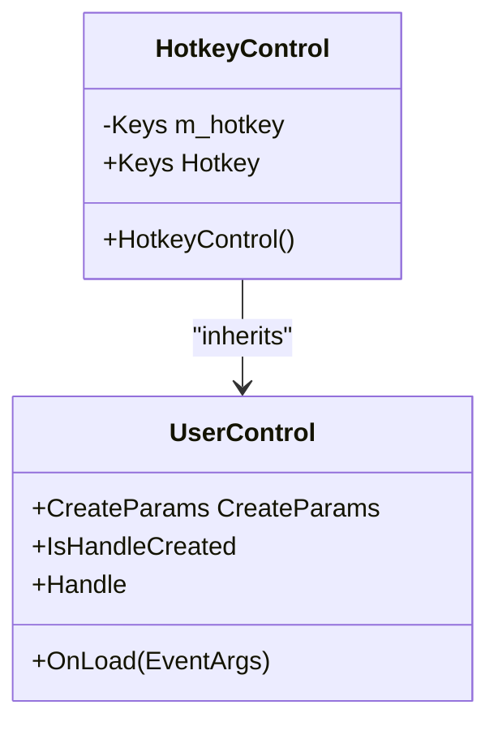
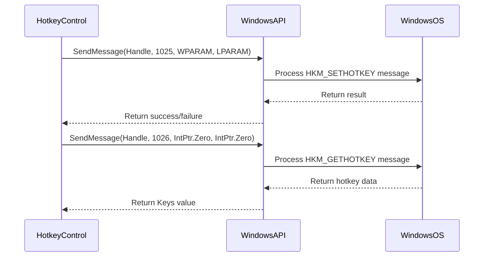
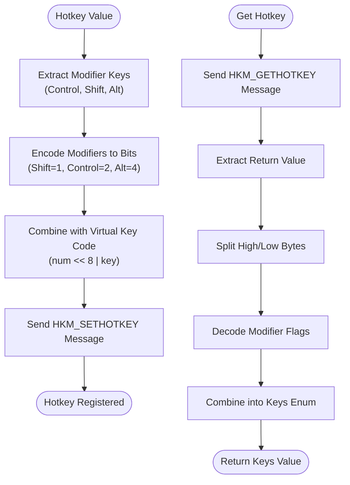
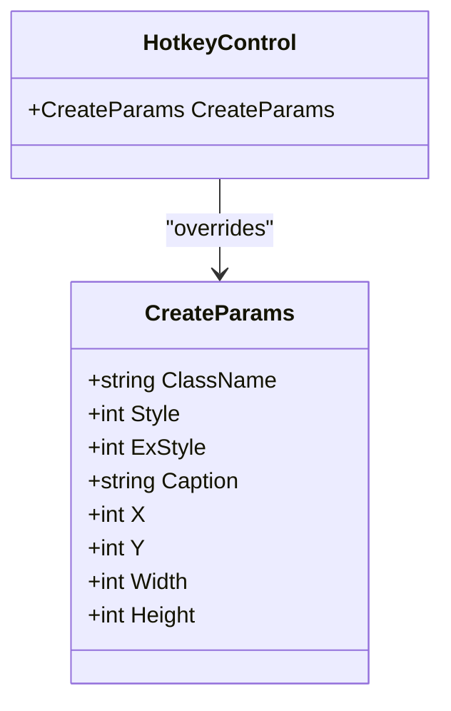
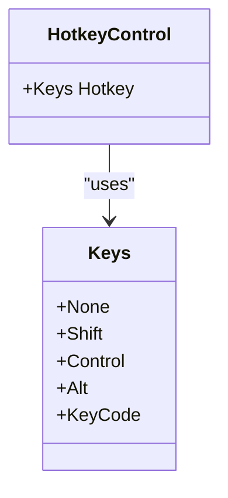
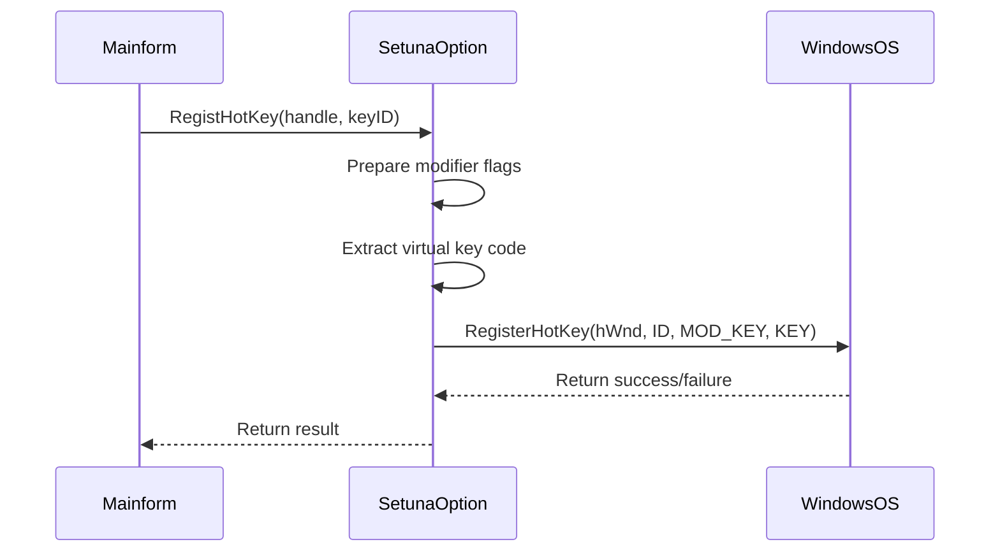
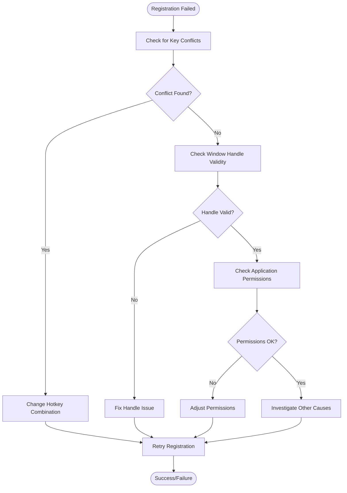

# Hotkey Registration

<cite>
**Referenced Files in This Document**   
- [HotkeyControl.cs](file://SETUNA/Main/HotkeyControl.cs)
- [HotkeyControl.Designer.cs](file://SETUNA/Main/HotkeyControl.Designer.cs)
- [WindowsAPI.cs](file://SETUNA/Main/Common/WindowsAPI.cs)
- [SetunaOption.cs](file://SETUNA/Main/Option/SetunaOption.cs)
- [HotKeyID.cs](file://SETUNA/Main/HotKeyID.cs)
- [Mainform.cs](file://SETUNA/Mainform.cs)
</cite>

## Table of Contents
1. [Introduction](#introduction)
2. [HotkeyControl Implementation](#hotkeycontrol-implementation)
3. [Windows API Integration](#windows-api-integration)
4. [Bit Manipulation Logic](#bit-manipulation-logic)
5. [CreateParams Override](#createparams-override)
6. [Hotkey Property Accessors](#hotkey-property-accessors)
7. [Global Hotkey Registration](#global-hotkey-registration)
8. [Common Issues and Troubleshooting](#common-issues-and-troubleshooting)
9. [Performance Considerations](#performance-considerations)
10. [Best Practices](#best-practices)

## Introduction
The hotkey registration mechanism in SETUNA enables users to define global keyboard shortcuts for application functionality. This document details how the HotkeyControl class leverages Windows API functionality through SendMessage calls to register and manage global hotkeys using the HKCOMB and HKM_SETHOTKEY messages. The implementation involves sophisticated bit manipulation to encode modifier keys and virtual key codes, with careful integration of Windows native controls through the msctls_hotkey32 window class.

**Section sources**
- [HotkeyControl.cs](file://SETUNA/Main/HotkeyControl.cs#L1-L82)
- [HotKeyID.cs](file://SETUNA/Main/HotKeyID.cs#L1-L10)

## HotkeyControl Implementation
The HotkeyControl class extends UserControl to provide a specialized interface for hotkey registration. It encapsulates the complexity of Windows API interactions behind a simple .NET property interface. The control manages both the visual representation of hotkey inputs and the underlying Windows message processing required for global hotkey registration.

**Diagram sources**
- [HotkeyControl.cs](file://SETUNA/Main/HotkeyControl.cs#L6-L82)

**Section sources**
- [HotkeyControl.cs](file://SETUNA/Main/HotkeyControl.cs#L6-L82)

## Windows API Integration
The hotkey mechanism relies on Windows API functions exposed through the WindowsAPI class. The SendMessage function is used to communicate with the native hotkey control, with specific message identifiers corresponding to hotkey operations.

**Diagram sources**
- [HotkeyControl.cs](file://SETUNA/Main/HotkeyControl.cs#L38-L39)
- [WindowsAPI.cs](file://SETUNA/Main/Common/WindowsAPI.cs#L13-L14)

**Section sources**
- [HotkeyControl.cs](file://SETUNA/Main/HotkeyControl.cs#L38-L39)
- [WindowsAPI.cs](file://SETUNA/Main/Common/WindowsAPI.cs#L13-L14)

## Bit Manipulation Logic
The implementation uses bit manipulation to encode modifier keys and virtual key codes into the WPARAM parameter. This encoding follows the Windows hotkey control specification, where the high byte contains modifier flags and the low byte contains the virtual key code.

**Diagram sources**
- [HotkeyControl.cs](file://SETUNA/Main/HotkeyControl.cs#L62-L75)

**Section sources**
- [HotkeyControl.cs](file://SETUNA/Main/HotkeyControl.cs#L62-L75)

## CreateParams Override
The CreateParams override is crucial for integrating the native Windows hotkey control. By setting the ClassName property to "msctls_hotkey32", the UserControl is transformed into a native hotkey control, enabling access to Windows hotkey functionality.

**Diagram sources**
- [HotkeyControl.cs](file://SETUNA/Main/HotkeyControl.cs#L17-L24)

**Section sources**
- [HotkeyControl.cs](file://SETUNA/Main/HotkeyControl.cs#L17-L24)

## Hotkey Property Accessors
The Hotkey property provides a clean interface for getting and setting hotkey values. The getter and setter methods handle the translation between .NET Keys enumeration and the Windows API hotkey format.

**Diagram sources**
- [HotkeyControl.cs](file://SETUNA/Main/HotkeyControl.cs#L32-L80)

**Section sources**
- [HotkeyControl.cs](file://SETUNA/Main/HotkeyControl.cs#L32-L80)

## Global Hotkey Registration
The global hotkey registration process involves coordination between multiple components. The SetunaOption class manages the registration of hotkeys with the Windows operating system using the RegisterHotKey API function.

**Diagram sources**
- [SetunaOption.cs](file://SETUNA/Main/Option/SetunaOption.cs#L707-L734)
- [Mainform.cs](file://SETUNA/Mainform.cs#L23-L200)

**Section sources**
- [SetunaOption.cs](file://SETUNA/Main/Option/SetunaOption.cs#L707-L734)

## Common Issues and Troubleshooting
Several common issues can occur during hotkey registration, primarily related to key conflicts and system limitations.

### Key Conflicts
When a hotkey combination is already registered by another application, the registration will fail. This is a common source of registration failures.

### Troubleshooting Steps
1. Verify the hotkey combination is not already in use by another application
2. Check that the application has the necessary permissions to register global hotkeys
3. Ensure the window handle is valid when calling RegisterHotKey
4. Validate that the hotkey ID is unique within the application

**Section sources**
- [SetunaOption.cs](file://SETUNA/Main/Option/SetunaOption.cs#L728-L730)
- [HotkeyControl.cs](file://SETUNA/Main/HotkeyControl.cs#L38-L39)

## Performance Considerations
Global hotkey registration has minimal performance impact when implemented correctly. The Windows operating system efficiently manages hotkey detection, with the application only being notified when its registered hotkeys are pressed.

### Resource Usage
- Memory: Minimal overhead for storing hotkey registrations
- CPU: Negligible impact as hotkey detection is handled by the OS
- System Integration: Uses standard Windows messaging system

### Optimization Recommendations
1. Register hotkeys only when necessary
2. Unregister hotkeys when they are no longer needed
3. Use unique hotkey IDs to prevent conflicts
4. Batch hotkey operations when possible

**Section sources**
- [SetunaOption.cs](file://SETUNA/Main/Option/SetunaOption.cs#L707-L734)
- [HotkeyControl.cs](file://SETUNA/Main/HotkeyControl.cs#L62-L75)

## Best Practices
To ensure reliable hotkey functionality, follow these best practices:

### Implementation Guidelines
- Always check if a handle is created before sending Windows messages
- Use the OnLoad method to initialize hotkey values
- Properly dispose of resources in the Dispose method
- Handle registration failures gracefully

### User Experience
- Provide clear feedback when hotkeys are registered or fail
- Allow users to easily modify hotkey assignments
- Document default hotkey combinations
- Avoid using common system hotkeys that may conflict

**Section sources**
- [HotkeyControl.cs](file://SETUNA/Main/HotkeyControl.cs#L27-L30)
- [HotkeyControl.Designer.cs](file://SETUNA/Main/HotkeyControl.Designer.cs#L14-L21)