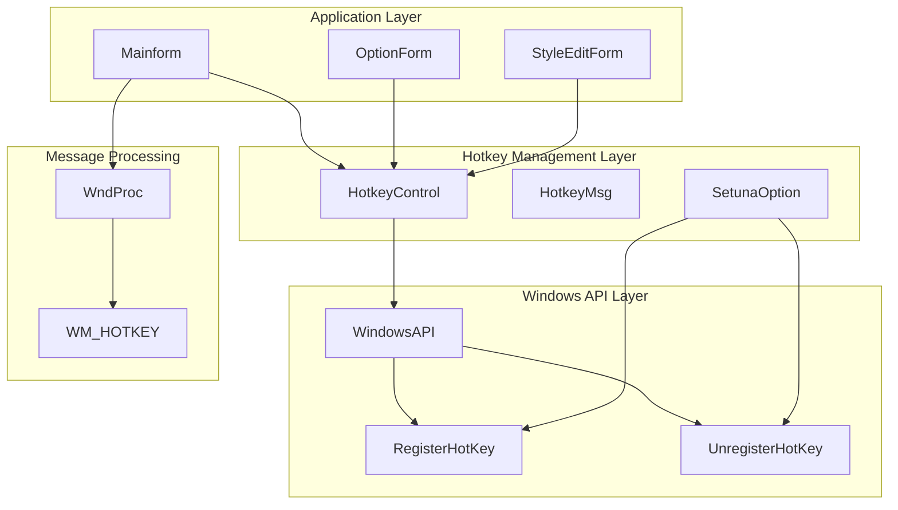
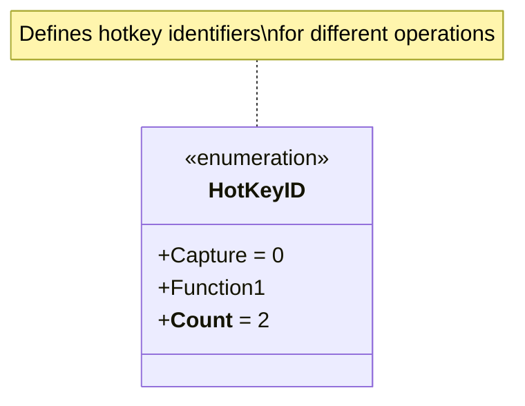
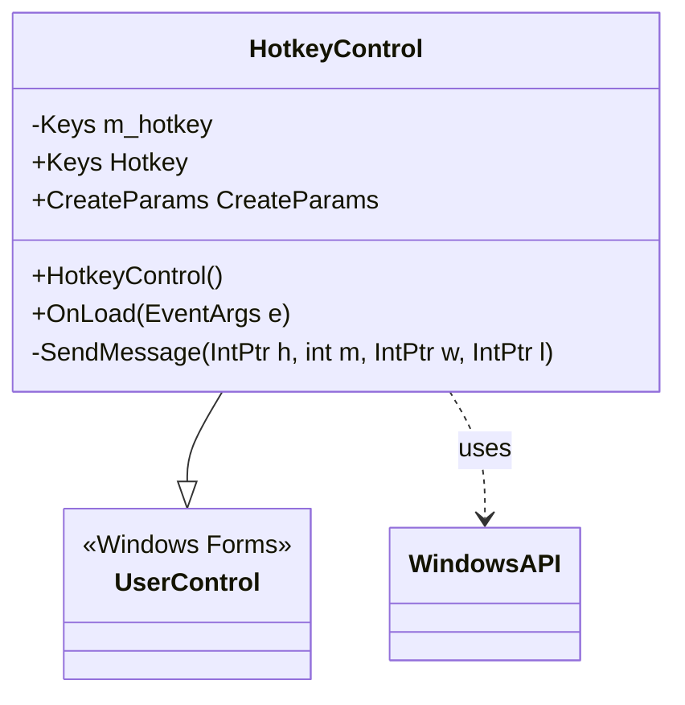
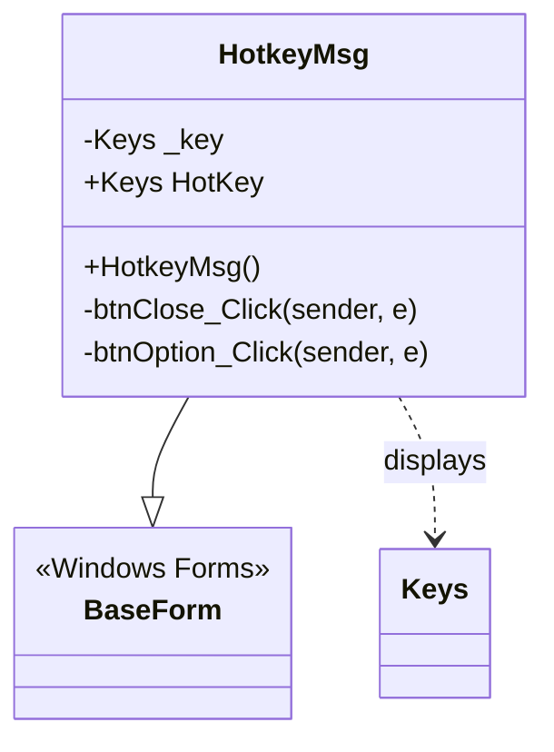
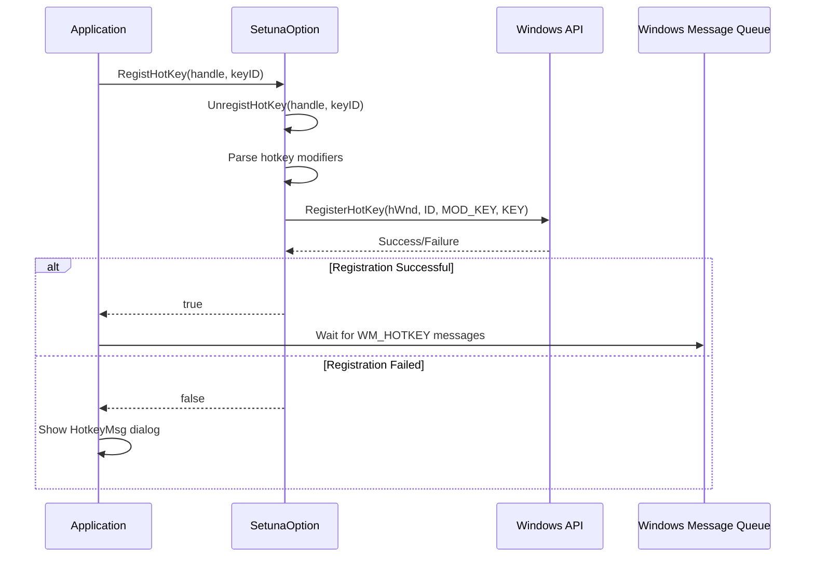
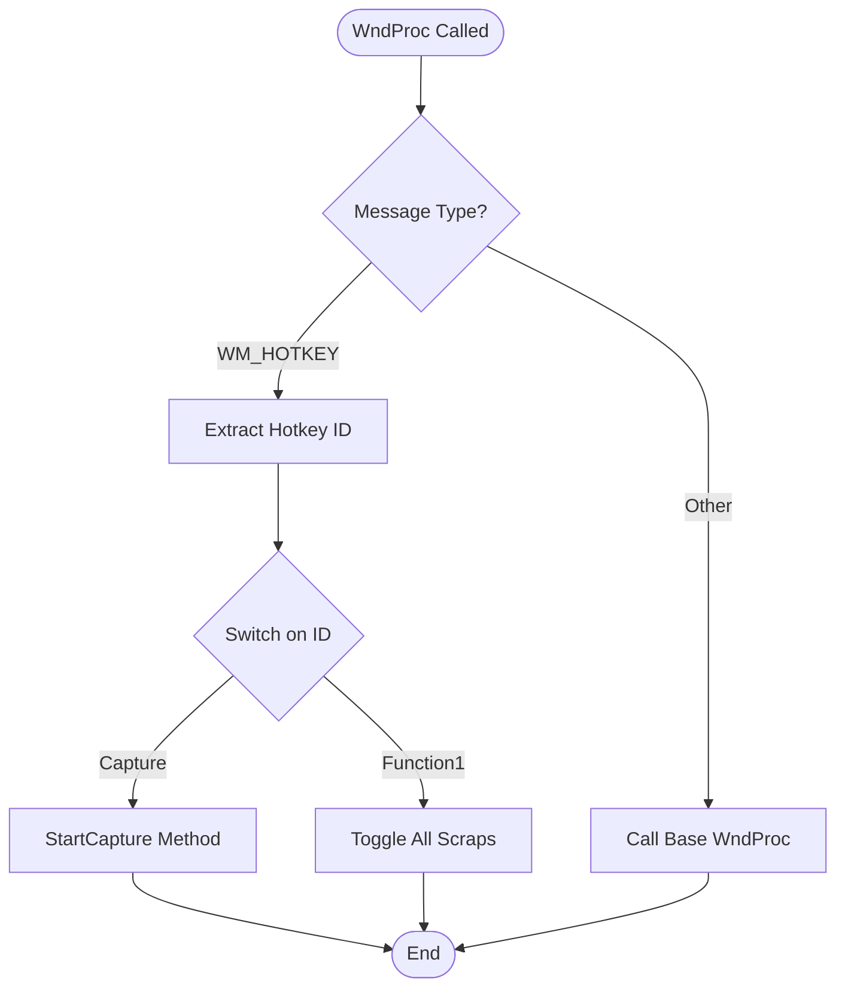
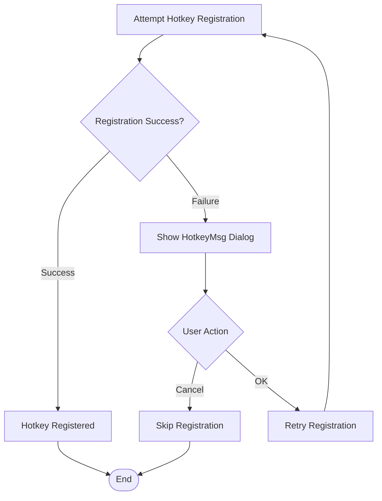
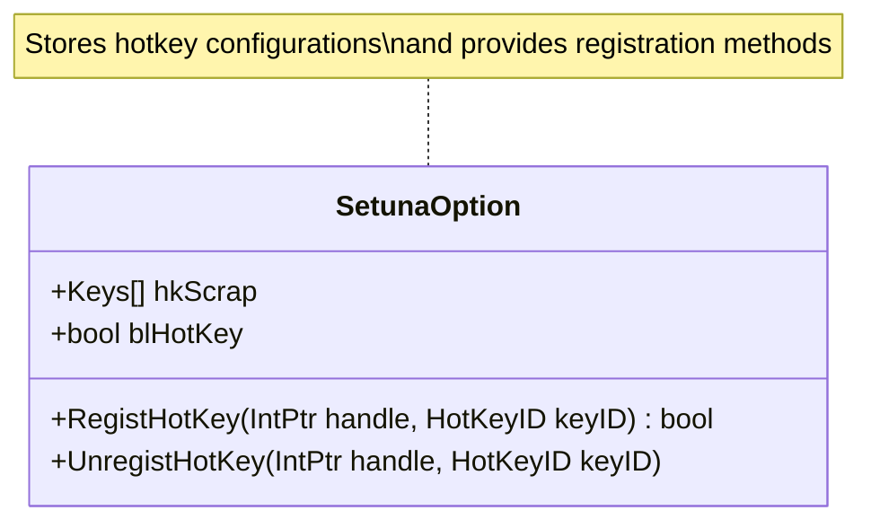
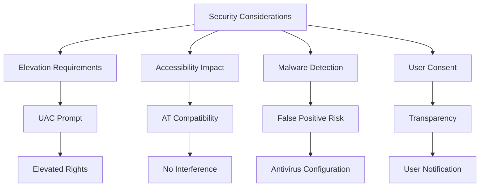
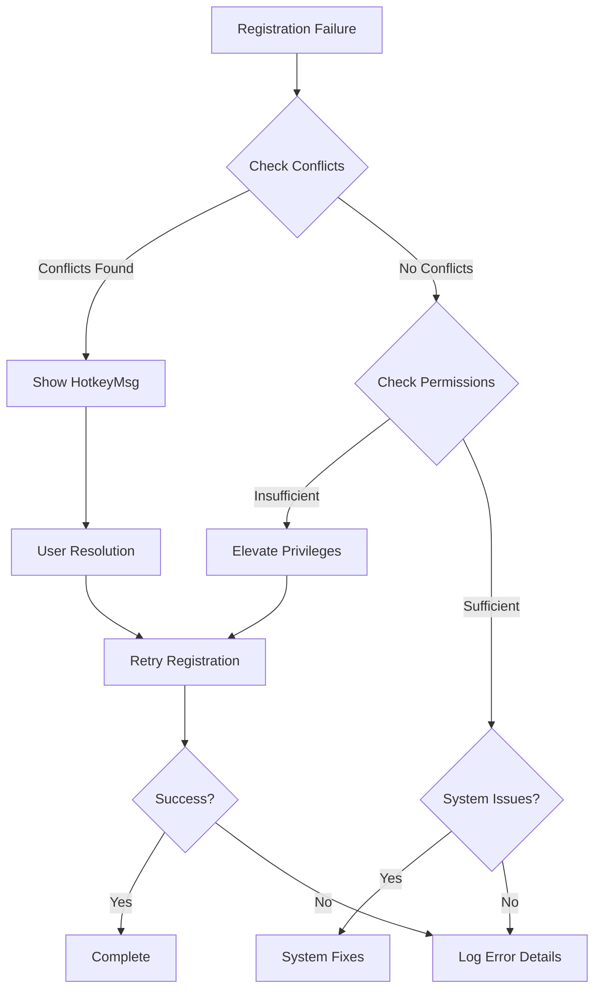

# Hotkey System API Documentation

<cite>
**Referenced Files in This Document**
- [HotKeyID.cs](file://SETUNA/Main/HotKeyID.cs)
- [HotkeyControl.cs](file://SETUNA/Main/HotkeyControl.cs)
- [HotkeyControl.Designer.cs](file://SETUNA/Main/HotkeyControl.Designer.cs)
- [HotkeyMsg.cs](file://SETUNA/Main/HotkeyMsg.cs)
- [HotkeyMsg.Designer.cs](file://SETUNA/Main/HotkeyMsg.Designer.cs)
- [WindowsAPI.cs](file://SETUNA/Main/Common/WindowsAPI.cs)
- [SetunaOption.cs](file://SETUNA/Main/Option/SetunaOption.cs)
- [Mainform.cs](file://SETUNA/Mainform.cs)
- [OptionForm.cs](file://SETUNA/Main/Option/OptionForm.cs)
- [OptionForm.Designer.cs](file://SETUNA/Main/Option/OptionForm.Designer.cs)
</cite>

## Table of Contents
1. [Introduction](#introduction)
2. [System Architecture](#system-architecture)
3. [Core Components](#core-components)
4. [Hotkey Registration Lifecycle](#hotkey-registration-lifecycle)
5. [Message Handling](#message-handling)
6. [Conflict Resolution](#conflict-resolution)
7. [Default Hotkeys](#default-hotkeys)
8. [Client Implementation Guidelines](#client-implementation-guidelines)
9. [Security Considerations](#security-considerations)
10. [Performance Implications](#performance-implications)
11. [Troubleshooting Guide](#troubleshooting-guide)
12. [Best Practices](#best-practices)

## Introduction

The SETUNA hotkey system provides a comprehensive framework for registering and managing global keyboard shortcuts using Windows API calls. The system enables applications to capture keyboard input globally, regardless of which application currently has focus, making it ideal for screenshot and clipboard management utilities.

The hotkey system consists of several key components that work together to register, manage, and process global hotkeys while providing conflict detection and resolution mechanisms.

## System Architecture

The hotkey system follows a layered architecture with clear separation of concerns:



**Diagram sources**
- [Mainform.cs](file://SETUNA/Mainform.cs#L230-L245)
- [HotkeyControl.cs](file://SETUNA/Main/HotkeyControl.cs#L1-L82)
- [SetunaOption.cs](file://SETUNA/Main/Option/SetunaOption.cs#L707-L734)

## Core Components

### HotKeyID Enumeration

The [`HotKeyID`](file://SETUNA/Main/HotKeyID.cs#L3-L9) enumeration defines the available hotkey identifiers:



**Diagram sources**
- [HotKeyID.cs](file://SETUNA/Main/HotKeyID.cs#L3-L9)

### HotkeyControl Component

The [`HotkeyControl`](file://SETUNA/Main/HotkeyControl.cs#L6-L82) class provides a Windows Forms control for hotkey configuration:



**Diagram sources**
- [HotkeyControl.cs](file://SETUNA/Main/HotkeyControl.cs#L6-L82)
- [WindowsAPI.cs](file://SETUNA/Main/Common/WindowsAPI.cs#L11-L13)

### HotkeyMsg Dialog

The [`HotkeyMsg`](file://SETUNA/Main/HotkeyMsg.cs#L7-L57) dialog provides visual feedback for hotkey conflicts:



**Diagram sources**
- [HotkeyMsg.cs](file://SETUNA/Main/HotkeyMsg.cs#L7-L57)

**Section sources**
- [HotKeyID.cs](file://SETUNA/Main/HotKeyID.cs#L1-L11)
- [HotkeyControl.cs](file://SETUNA/Main/HotkeyControl.cs#L1-L82)
- [HotkeyMsg.cs](file://SETUNA/Main/HotkeyMsg.cs#L1-L57)

## Hotkey Registration Lifecycle

The hotkey registration process follows a specific lifecycle with proper cleanup and validation:



**Diagram sources**
- [SetunaOption.cs](file://SETUNA/Main/Option/SetunaOption.cs#L707-L734)
- [Mainform.cs](file://SETUNA/Mainform.cs#L230-L245)

### Registration Process

The registration process involves several steps:

1. **Cleanup Previous Registration**: [`UnregistHotKey`](file://SETUNA/Main/Option/SetunaOption.cs#L737-L739) removes any existing hotkey registrations
2. **Parse Modifier Keys**: Extract Shift, Alt, and Control modifiers from the hotkey combination
3. **Call Windows API**: Use [`RegisterHotKey`](file://SETUNA/Main/Option/SetunaOption.cs#L744-L745) with appropriate parameters
4. **Validation**: Check return value for success/failure

### Unregistration Process

Hotkeys are automatically unregistered during:
- Application shutdown
- Configuration changes
- Hotkey conflicts resolution

**Section sources**
- [SetunaOption.cs](file://SETUNA/Main/Option/SetunaOption.cs#L707-L740)

## Message Handling

The hotkey system processes Windows messages through the [`WndProc`](file://SETUNA/Mainform.cs#L384-L400) method:



**Diagram sources**
- [Mainform.cs](file://SETUNA/Mainform.cs#L384-L400)

### WM_HOTKEY Message Processing

The system handles the following hotkey operations:

| Hotkey ID | Operation | Triggered By |
|-----------|-----------|--------------|
| Capture (0) | Start screen capture | Global hotkey activation |
| Function1 (1) | Toggle all scraps visibility | Global hotkey activation |

**Section sources**
- [Mainform.cs](file://SETUNA/Mainform.cs#L384-L400)

## Conflict Resolution

The hotkey system implements automatic conflict resolution:



**Diagram sources**
- [Mainform.cs](file://SETUNA/Mainform.cs#L230-L245)
- [HotkeyMsg.cs](file://SETUNA/Main/HotkeyMsg.cs#L41-L52)

### Conflict Detection

The system detects conflicts through:
- Windows API return values (0 indicates failure)
- HotkeyMsg dialog presentation
- User choice for resolution

### Resolution Strategies

1. **Automatic Retry**: User can retry registration with the same hotkey
2. **Alternative Selection**: User can choose a different hotkey
3. **Skip Registration**: User can disable the hotkey entirely

**Section sources**
- [Mainform.cs](file://SETUNA/Mainform.cs#L230-L245)
- [HotkeyMsg.cs](file://SETUNA/Main/HotkeyMsg.cs#L1-L57)

## Default Hotkeys

The system provides predefined hotkeys for core operations:

| Operation | Default Hotkey | HotKeyID | Purpose |
|-----------|----------------|----------|---------|
| Screen Capture | Ctrl+D1 | Capture | Initiates screenshot capture |
| Show/Hide All Scraps | Not Assigned | Function1 | Toggles visibility of all scrap items |

### Configuration Storage

Hotkey configurations are stored in the [`SetunaOption`](file://SETUNA/Main/Option/SetunaOption.cs#L790) class:



**Diagram sources**
- [SetunaOption.cs](file://SETUNA/Main/Option/SetunaOption.cs#L790-L791)

**Section sources**
- [HotKeyID.cs](file://SETUNA/Main/HotKeyID.cs#L1-L11)
- [SetunaOption.cs](file://SETUNA/Main/Option/SetunaOption.cs#L790-L791)

## Client Implementation Guidelines

### Adding Custom Hotkeys

To implement custom hotkeys in your application:

1. **Define Hotkey ID**: Extend the [`HotKeyID`](file://SETUNA/Main/HotKeyID.cs#L3-L9) enumeration
2. **Register Hotkey**: Call [`RegistHotKey`](file://SETUNA/Main/Option/SetunaOption.cs#L707-L734) with appropriate parameters
3. **Handle Messages**: Override [`WndProc`](file://SETUNA/Mainform.cs#L384-L400) to process hotkey events
4. **Provide UI**: Create configuration interface using [`HotkeyControl`](file://SETUNA/Main/HotkeyControl.cs#L6-L82)

### Implementation Example Pattern

```csharp
// Define new hotkey ID
public enum CustomHotKeyID
{
    Capture = 0,
    Function1,
    CustomAction = 2
}

// Registration method
public bool RegisterCustomHotkey(IntPtr handle, Keys hotkey)
{
    // Parse modifiers
    int modifiers = 0;
    if (hotkey.HasFlag(Keys.Shift)) modifiers |= 4;
    if (hotkey.HasFlag(Keys.Alt)) modifiers |= 1;
    if (hotkey.HasFlag(Keys.Control)) modifiers |= 2;
    
    // Register with Windows API
    return SetunaOption.RegisterHotKey(handle, 2, modifiers, (int)(hotkey & Keys.KeyCode)) != 0;
}
```

### Best Practices for Custom Implementation

1. **Unique Identifiers**: Use distinct IDs to avoid conflicts
2. **Modifier Combinations**: Prefer modifier combinations over single keys
3. **User Feedback**: Provide visual feedback for hotkey registration
4. **Error Handling**: Gracefully handle registration failures
5. **Resource Cleanup**: Always unregister hotkeys during cleanup

**Section sources**
- [HotKeyID.cs](file://SETUNA/Main/HotKeyID.cs#L1-L11)
- [SetunaOption.cs](file://SETUNA/Main/Option/SetunaOption.cs#L707-L734)
- [Mainform.cs](file://SETUNA/Mainform.cs#L384-L400)

## Security Considerations

### Global Input Hooks

The hotkey system operates as a global input hook, which has several security implications:

1. **Administrator Privileges**: May require elevated permissions on modern Windows systems
2. **Accessibility Concerns**: Can interfere with accessibility tools
3. **Malware Detection**: May trigger security software alerts
4. **User Consent**: Should inform users about global input monitoring

### Mitigation Strategies



### Security Recommendations

1. **Minimal Permissions**: Request only necessary privileges
2. **Graceful Degradation**: Provide functionality without global hooks when possible
3. **User Notification**: Clearly indicate global input monitoring
4. **Documentation**: Document security implications in user guides
5. **Testing**: Test with various security software configurations

## Performance Implications

### Frequency of Hotkey Checks

The hotkey system operates efficiently through:

1. **Event-Driven Architecture**: Hotkeys are processed only when triggered
2. **Minimal CPU Overhead**: Windows API handles low-level input processing
3. **Memory Efficiency**: Minimal memory footprint for hotkey storage
4. **Message Queue Processing**: Leverages Windows message queue for efficiency

### Performance Metrics

| Operation | CPU Impact | Memory Impact | I/O Impact |
|-----------|------------|---------------|------------|
| Hotkey Registration | Low | Minimal | None |
| Hotkey Unregistration | Low | Minimal | None |
| Message Processing | Very Low | Minimal | None |
| Conflict Detection | Low | Minimal | None |

### Optimization Strategies

1. **Lazy Initialization**: Initialize hotkeys only when needed
2. **Batch Operations**: Group hotkey operations when possible
3. **Efficient Parsing**: Minimize hotkey parsing overhead
4. **Resource Pooling**: Reuse hotkey resources where appropriate

## Troubleshooting Guide

### Common Issues and Solutions

#### Issue: Hotkeys Not Responding

**Symptoms**: Hotkeys registered but not triggering actions

**Possible Causes**:
- Application not in foreground
- Hotkey conflicts with other applications
- Insufficient permissions
- Message queue blocking

**Solutions**:
1. Verify application has focus
2. Check for conflicting hotkeys
3. Run as administrator if necessary
4. Restart application to reset message queue

#### Issue: Registration Failures

**Symptoms**: Hotkey registration returns false

**Diagnostic Steps**:


**Diagram sources**
- [Mainform.cs](file://SETUNA/Mainform.cs#L230-L245)

#### Issue: HotkeyMsg Dialog Appears Frequently

**Symptoms**: Conflicting hotkey dialogs appear regularly

**Solutions**:
1. Change conflicting hotkey assignments
2. Disable conflicting applications
3. Use different modifier combinations
4. Contact support for persistent conflicts

### Debugging Tools

1. **Event Logging**: Monitor hotkey registration events
2. **Conflict Detection**: Track hotkey conflicts
3. **Permission Verification**: Check application privileges
4. **Message Queue Analysis**: Examine Windows message flow

**Section sources**
- [Mainform.cs](file://SETUNA/Mainform.cs#L230-L245)
- [HotkeyMsg.cs](file://SETUNA/Main/HotkeyMsg.cs#L1-L57)

## Best Practices

### Development Guidelines

1. **Follow Naming Conventions**: Use consistent naming for hotkey identifiers
2. **Document Hotkeys**: Maintain documentation of all hotkey assignments
3. **Test Thoroughly**: Verify hotkey functionality across different scenarios
4. **Handle Edge Cases**: Account for system shutdown and unexpected termination
5. **User Experience**: Provide clear feedback for hotkey operations

### Maintenance Recommendations

1. **Regular Testing**: Periodically test hotkey functionality
2. **Update Documentation**: Keep hotkey documentation current
3. **Monitor Conflicts**: Track hotkey conflicts in production
4. **Performance Monitoring**: Monitor hotkey system performance
5. **User Feedback**: Collect and address user hotkey issues

### Integration Guidelines

1. **Compatibility Testing**: Test with popular applications
2. **Accessibility Compliance**: Ensure compatibility with assistive technologies
3. **Security Review**: Regular security assessment of hotkey functionality
4. **Performance Profiling**: Profile hotkey system impact
5. **User Training**: Provide hotkey training materials

The hotkey system provides a robust foundation for global keyboard shortcut management while maintaining security, performance, and usability standards. Proper implementation and maintenance ensure reliable operation across diverse computing environments.