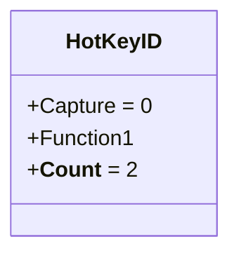
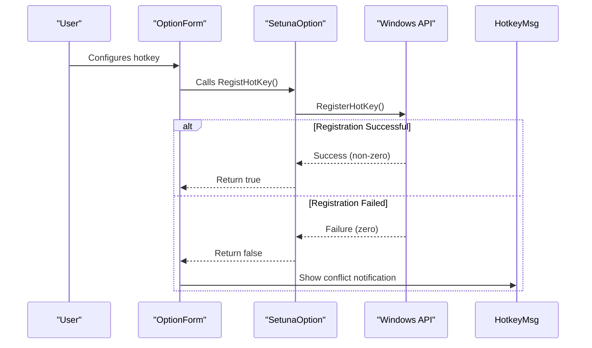
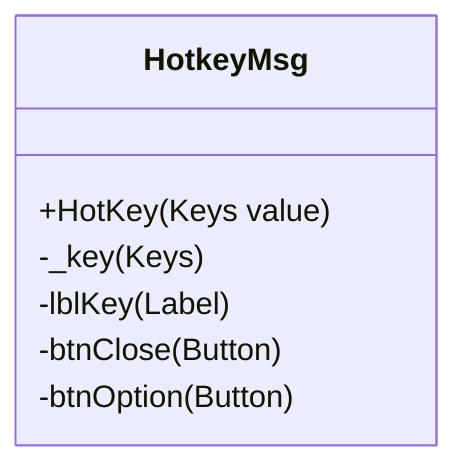
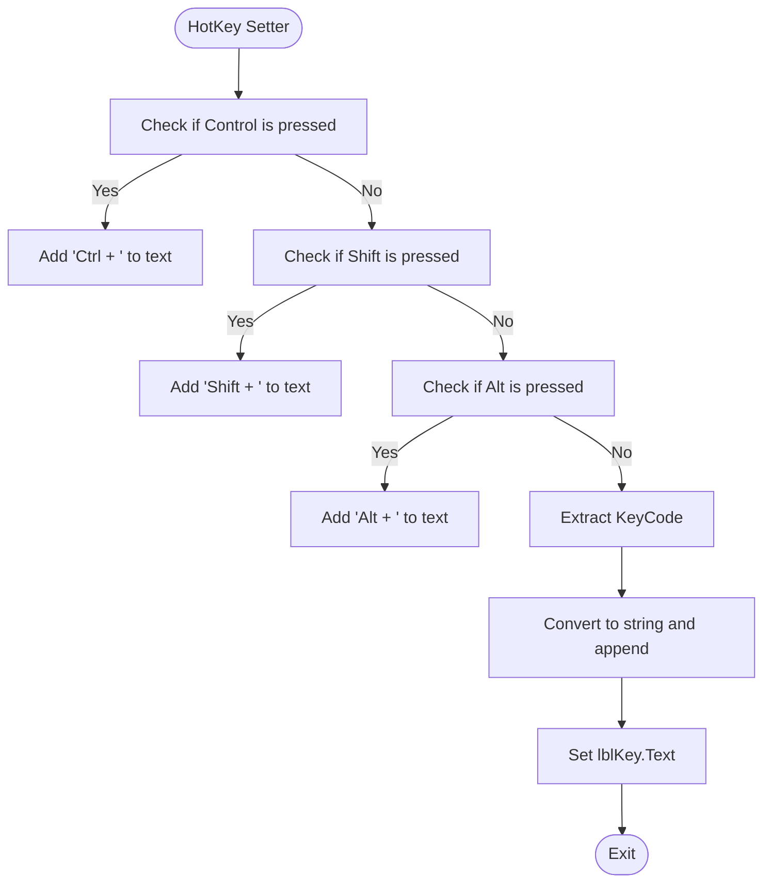
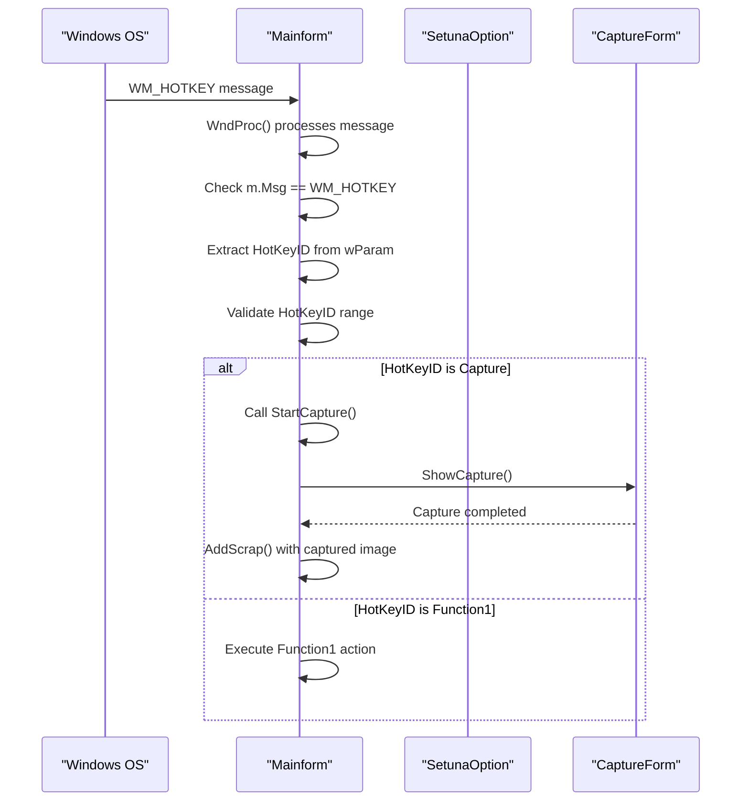

# Message Handling

<cite>
**Referenced Files in This Document**   
- [HotKeyID.cs](file://SETUNA/Main/HotKeyID.cs)
- [HotkeyControl.cs](file://SETUNA/Main/HotkeyControl.cs)
- [HotkeyMsg.cs](file://SETUNA/Main/HotkeyMsg.cs)
- [Mainform.cs](file://SETUNA/Mainform.cs)
- [SetunaOption.cs](file://SETUNA/Main/Option/SetunaOption.cs)
- [WindowsAPI.cs](file://SETUNA/Main/Common/WindowsAPI.cs)
</cite>

## Table of Contents
1. [Introduction](#introduction)
2. [Hotkey Message Handling Architecture](#hotkey-message-handling-architecture)
3. [HotKeyID Enumeration and Message Mapping](#hotkeyid-enumeration-and-message-mapping)
4. [Hotkey Registration and Conflict Detection](#hotkey-registration-and-conflict-detection)
5. [HotkeyMsg Form Implementation](#hotkeymsg-form-implementation)
6. [Event Flow from Message Receipt to Action Invocation](#event-flow-from-message-receipt-to-action-invocation)
7. [Security Implications of Global Message Handling](#security-implications-of-global-message-handling)
8. [Debugging Techniques for Hotkey Message Delivery](#debugging-techniques-for-hotkey-message-delivery)
9. [Conclusion](#conclusion)

## Introduction
The application implements a comprehensive hotkey message handling system that intercepts WM_HOTKEY messages through the Windows message loop and maps them to specific functionality. This document details the architecture, implementation, and operational characteristics of this system, focusing on how global hotkeys are registered, monitored for conflicts, and translated into application actions. The system enables users to trigger screenshot operations and other functions through customizable keyboard shortcuts while providing feedback when conflicts occur with other applications.

## Hotkey Message Handling Architecture

The hotkey message handling system follows a layered architecture that integrates Windows API messaging with .NET Windows Forms components. At its core, the system uses the Windows message loop to intercept WM_HOTKEY messages, which are generated when registered hotkeys are pressed. The Mainform class overrides the WndProc method to handle these messages, creating a direct communication channel between the operating system and application logic.

The architecture consists of several key components:
- **HotkeyControl**: A specialized UserControl that provides a UI for selecting and displaying hotkey combinations
- **HotkeyMsg**: A notification form that displays conflict information when hotkey registration fails
- **SetunaOption**: Manages hotkey registration and unregistration through Windows API calls
- **Mainform**: Processes WM_HOTKEY messages and dispatches appropriate actions

This design separates concerns between UI presentation, message handling, and system integration, allowing for maintainable and extensible hotkey functionality.

**Section sources**
- [Mainform.cs](file://SETUNA/Mainform.cs#L383-L385)
- [SetunaOption.cs](file://SETUNA/Main/Option/SetunaOption.cs#L780)

## HotKeyID Enumeration and Message Mapping

The HotKeyID enumeration defines the available hotkey identifiers that can be registered and handled by the application. This strongly-typed approach ensures type safety and provides a clear contract between the registration system and message handlers.

**Diagram sources**
- [HotKeyID.cs](file://SETUNA/Main/HotKeyID.cs#L3-L9)

The enumeration contains two primary values:
- **Capture**: Maps to the screenshot capture functionality
- **Function1**: Reserved for additional functionality

The __Count__ value serves as a sentinel for iteration and validation purposes. When a WM_HOTKEY message is received, the wParam parameter contains the HotKeyID value, allowing the application to determine which action to invoke. This direct mapping between enumeration values and message parameters simplifies the dispatch logic and reduces the potential for errors.

**Section sources**
- [HotKeyID.cs](file://SETUNA/Main/HotKeyID.cs#L3-L9)
- [Mainform.cs](file://SETUNA/Mainform.cs#L383-L385)

## Hotkey Registration and Conflict Detection

The hotkey registration process is managed by the SetunaOption class, which provides methods for registering and unregistering hotkeys with the Windows operating system. The RegistHotKey method attempts to register a hotkey for a specific HotKeyID and handles the case where the registration fails due to conflicts with other applications.

**Diagram sources**
- [SetunaOption.cs](file://SETUNA/Main/Option/SetunaOption.cs#L707-L734)
- [HotkeyMsg.cs](file://SETUNA/Main/HotkeyMsg.cs#L11-L31)

The registration process follows these steps:
1. Unregister any existing hotkey for the specified HotKeyID
2. Extract the key code and modifier flags (Ctrl, Alt, Shift) from the hotkey value
3. Call the Windows API RegisterHotKey function with the appropriate parameters
4. Return success or failure based on the API result

When registration fails (typically due to a conflict with another application), the system displays the HotkeyMsg form to notify the user of the conflicting key combination.

**Section sources**
- [SetunaOption.cs](file://SETUNA/Main/Option/SetunaOption.cs#L707-L734)
- [HotkeyControl.cs](file://SETUNA/Main/HotkeyControl.cs#L32-L80)

## HotkeyMsg Form Implementation

The HotkeyMsg form serves as a user notification mechanism when hotkey registration fails due to conflicts with other applications. The form's primary responsibility is to display the conflicting key combination in a user-friendly format.

**Diagram sources**
- [HotkeyMsg.cs](file://SETUNA/Main/HotkeyMsg.cs#L7-L56)
- [HotkeyMsg.Designer.cs](file://SETUNA/Main/HotkeyMsg.Designer.cs#L118-L134)

The HotKey property setter implements the key formatting logic:

**Diagram sources**
- [HotkeyMsg.cs](file://SETUNA/Main/HotkeyMsg.cs#L13-L31)

The implementation extracts the individual components of the Keys enumeration (Ctrl, Alt, Shift, and the base key) and constructs a human-readable string representation. This formatted text is then displayed in the lblKey label, providing clear feedback to the user about which key combination is causing the conflict.

**Section sources**
- [HotkeyMsg.cs](file://SETUNA/Main/HotkeyMsg.cs#L11-L31)
- [HotkeyMsg.Designer.cs](file://SETUNA/Main/HotkeyMsg.Designer.cs#L130-L131)

## Event Flow from Message Receipt to Action Invocation

The event flow from low-level Windows message receipt to high-level application action invocation follows a well-defined sequence that ensures reliable hotkey processing:

**Diagram sources**
- [Mainform.cs](file://SETUNA/Mainform.cs#L383-L385)
- [Mainform.cs](file://SETUNA/Mainform.cs#L116-L156)

The process begins when the Windows operating system sends a WM_HOTKEY message to the application window. The Mainform's WndProc method intercepts this message and checks if it matches the WM_HOTKEY constant. If so, it extracts the HotKeyID from the wParam parameter and validates that it falls within the expected range.

For the Capture hotkey, this triggers the screenshot capture workflow:
1. The StartCapture method is called
2. The CaptureForm is displayed to allow the user to select a region
3. Upon completion, the captured image is added to the ScrapBook
4. The image becomes available for further processing or saving

This event flow demonstrates how low-level system messages are translated into meaningful application functionality through a series of well-defined steps.

**Section sources**
- [Mainform.cs](file://SETUNA/Mainform.cs#L383-L385)
- [Mainform.cs](file://SETUNA/Mainform.cs#L116-L156)

## Security Implications of Global Message Handling

The implementation of global hotkey message handling introduces several security considerations that the application addresses through its design:

1. **Input Interception**: The application only registers for specific hotkey combinations rather than intercepting all keyboard input, minimizing the potential for unauthorized input capture.

2. **Message Validation**: All WM_HOTKEY messages are validated against the HotKeyID enumeration to ensure only expected messages are processed.

3. **Scope Limitation**: Hotkeys are registered with the application window handle, limiting their scope to the application's message processing.

4. **User Control**: Users can enable or disable hotkey functionality through the application settings, providing control over the feature.

The system avoids common security pitfalls by:
- Not capturing individual keystrokes outside of hotkey combinations
- Not monitoring keyboard input when hotkeys are disabled
- Using the Windows API's built-in hotkey registration rather than low-level keyboard hooks
- Providing clear user feedback when conflicts occur

These design choices balance functionality with security, ensuring that the hotkey system enhances usability without compromising system security.

**Section sources**
- [SetunaOption.cs](file://SETUNA/Main/Option/SetunaOption.cs#L707-L734)
- [Mainform.cs](file://SETUNA/Mainform.cs#L383-L385)

## Debugging Techniques for Hotkey Message Delivery

Several debugging techniques can be employed to trace hotkey message delivery issues:

1. **Message Loop Monitoring**: The WndProc method can be instrumented to log all messages received by the application, allowing developers to verify that WM_HOTKEY messages are being received.

2. **Registration Validation**: The return value of RegisterHotKey can be checked to determine if registration succeeded or failed, with appropriate logging for troubleshooting.

3. **Hotkey State Inspection**: The current hotkey configuration can be inspected through the SetunaOption instance to verify that the expected hotkeys are properly configured.

4. **Conflict Detection**: When registration fails, the system can query which application currently holds the hotkey registration, though this requires additional Windows API calls.

Common issues and their solutions include:
- **Hotkey not triggering**: Verify that the hotkey is properly registered and that no other application is consuming the same combination
- **Intermittent failures**: Check for race conditions in the registration/unregistration process
- **Modifier key issues**: Ensure that the modifier flags (Ctrl, Alt, Shift) are properly encoded in the registration call

The application's modular design facilitates debugging by isolating the message handling, registration, and UI components, allowing developers to test each layer independently.

**Section sources**
- [Mainform.cs](file://SETUNA/Mainform.cs#L383-L385)
- [SetunaOption.cs](file://SETUNA/Main/Option/SetunaOption.cs#L707-L734)

## Conclusion
The hotkey message handling system in this application demonstrates a robust implementation of global hotkey functionality. By leveraging the Windows message loop and the RegisterHotKey API, the system provides reliable hotkey support while maintaining security and usability. The architecture effectively separates concerns between message handling, registration management, and user feedback, resulting in a maintainable and extensible design. The HotkeyMsg form provides valuable user feedback when conflicts occur, and the event flow from message receipt to action invocation is well-defined and reliable. This implementation serves as a model for applications requiring global hotkey functionality with proper error handling and user communication.