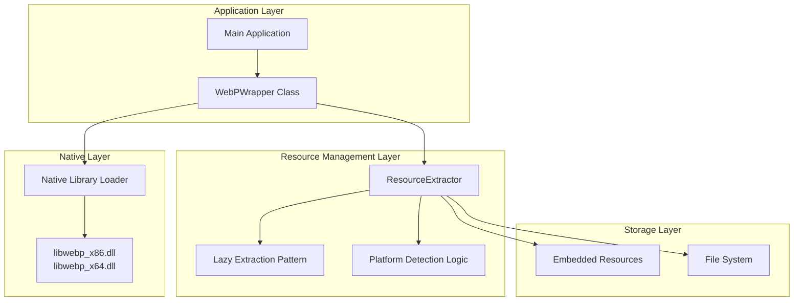
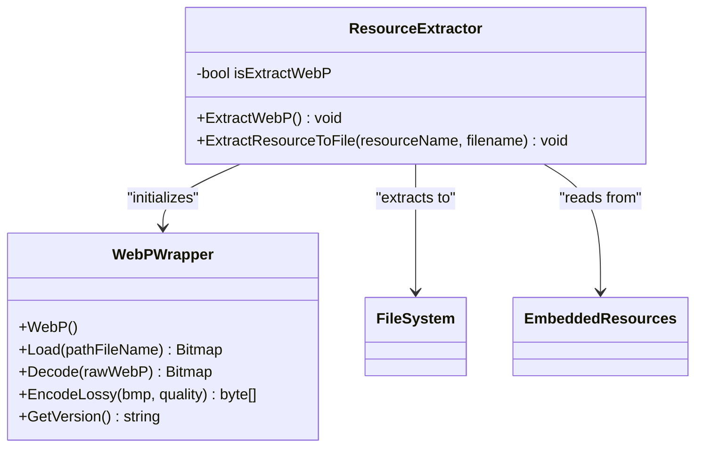
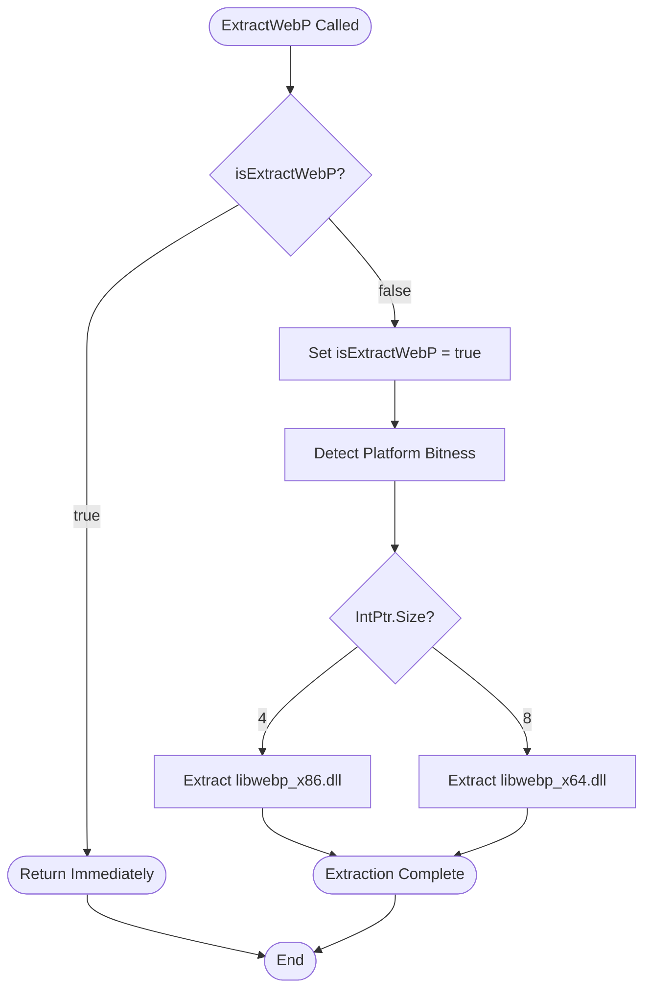
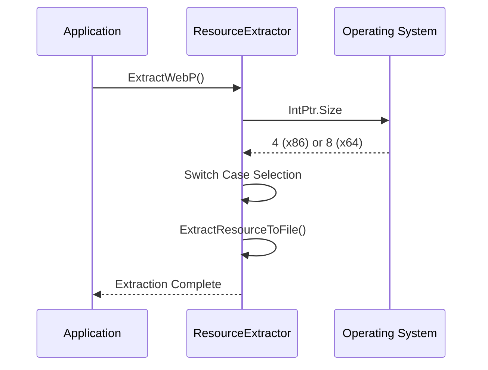
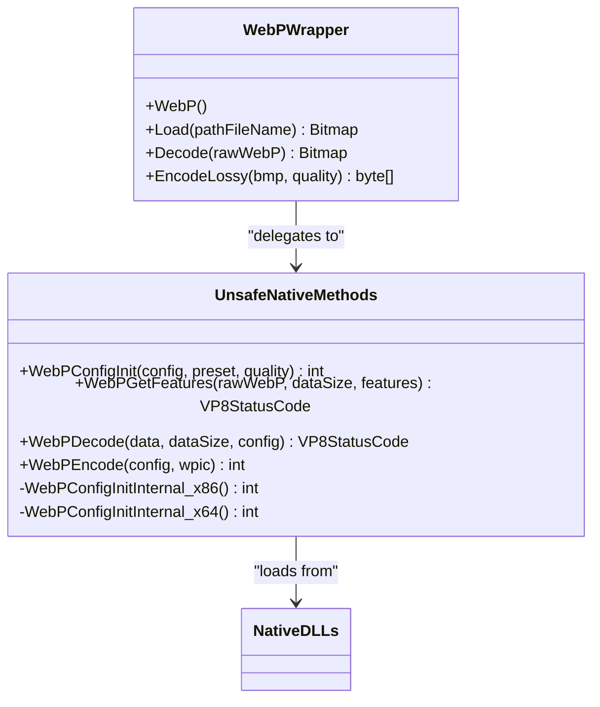
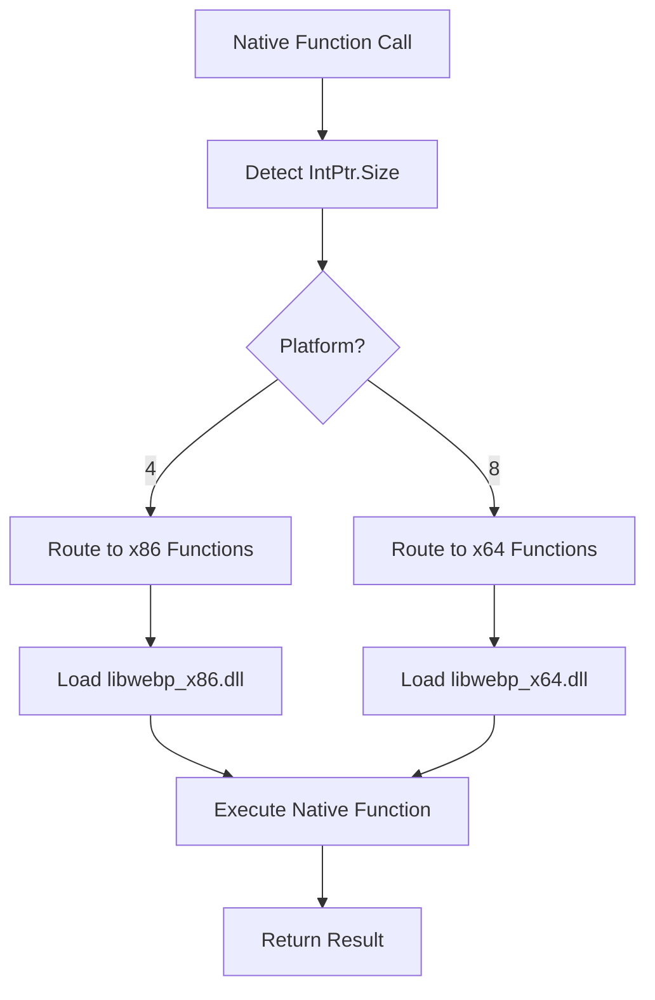
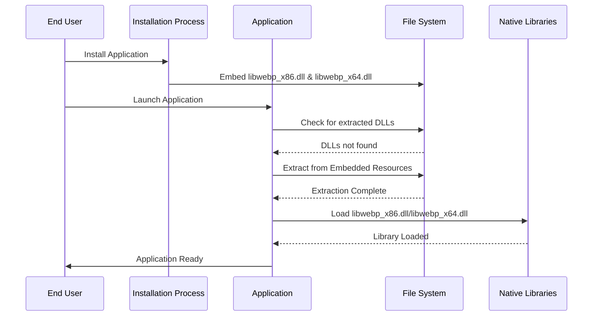
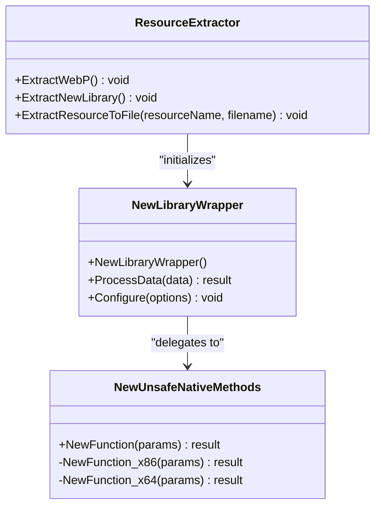

# Embedded Resource Management

<cite>
**Referenced Files in This Document**
- [ResourceExtractor.cs](file://SETUNA/Plugins/ResourceExtractor.cs)
- [WebPWrapper.cs](file://SETUNA/Plugins/WebPWrapper.cs)
- [Program.cs](file://SETUNA/Program.cs)
- [SETUNA.csproj](file://SETUNA/SETUNA.csproj)
- [SingletonApplication.cs](file://SETUNA/com/clearunit/SingletonApplication.cs)
- [AutoStartup.cs](file://SETUNA/Main/Startup/AutoStartup.cs)
</cite>

## Table of Contents
1. [Introduction](#introduction)
2. [System Architecture](#system-architecture)
3. [ResourceExtractor Implementation](#resourceextractor-implementation)
4. [Lazy Extraction Pattern](#lazy-extraction-pattern)
5. [Platform Detection Logic](#platform-detection-logic)
6. [Native Library Loading](#native-library-loading)
7. [Zero-Configuration Deployment](#zero-configuration-deployment)
8. [Common Issues and Solutions](#common-issues-and-solutions)
9. [Extending the System](#extending-the-system)
10. [Best Practices](#best-practices)

## Introduction

The SETUNA project implements a sophisticated embedded native library management system that enables seamless deployment of native dependencies without requiring manual installation or configuration. At the core of this system is the ResourceExtractor class, which handles the extraction of libwebp_x86.dll and libwebp_x64.dll from assembly resources to the filesystem, enabling zero-configuration deployment of WebP image format support.

This system demonstrates several key architectural patterns including lazy initialization, platform detection, resource management, and native library abstraction. The implementation showcases how managed code can effectively interface with native libraries while maintaining simplicity for end users.

## System Architecture

The embedded resource management system follows a layered architecture that separates concerns between resource extraction, platform detection, and native library loading:

**Diagram sources**
- [ResourceExtractor.cs](file://SETUNA/Plugins/ResourceExtractor.cs#L1-L44)
- [WebPWrapper.cs](file://SETUNA/Plugins/WebPWrapper.cs#L32-L43)

**Section sources**
- [ResourceExtractor.cs](file://SETUNA/Plugins/ResourceExtractor.cs#L1-L44)
- [WebPWrapper.cs](file://SETUNA/Plugins/WebPWrapper.cs#L1-L50)

## ResourceExtractor Implementation

The ResourceExtractor class serves as the central component for managing embedded native library extraction. It implements a static utility pattern with thread-safe lazy initialization capabilities.

### Core Architecture

The ResourceExtractor class consists of two primary methods that handle the complete lifecycle of embedded resource deployment:

**Diagram sources**
- [ResourceExtractor.cs](file://SETUNA/Plugins/ResourceExtractor.cs#L5-L43)
- [WebPWrapper.cs](file://SETUNA/Plugins/WebPWrapper.cs#L32-L43)

### ExtractWebP Method

The ExtractWebP method implements the main extraction logic with platform detection and lazy initialization:

**Diagram sources**
- [ResourceExtractor.cs](file://SETUNA/Plugins/ResourceExtractor.cs#L9-L26)

**Section sources**
- [ResourceExtractor.cs](file://SETUNA/Plugins/ResourceExtractor.cs#L9-L26)

## Lazy Extraction Pattern

The system implements a sophisticated lazy extraction pattern that prevents redundant file operations and ensures optimal performance during application startup.

### Implementation Details

The lazy pattern is implemented through a static boolean flag that tracks extraction state:

| Component | Purpose | Thread Safety |
|-----------|---------|---------------|
| `isExtractWebP` | Tracks extraction completion | Static field |
| Early Return | Prevents re-execution | Automatic |
| Atomic Operations | Ensures consistency | Implicit |

### Benefits of Lazy Pattern

- **Performance Optimization**: Reduces startup time by avoiding unnecessary file operations
- **Resource Efficiency**: Prevents duplicate extraction attempts
- **Thread Safety**: Uses static initialization for guaranteed thread safety
- **Memory Conservation**: Minimizes memory footprint during idle periods

**Section sources**
- [ResourceExtractor.cs](file://SETUNA/Plugins/ResourceExtractor.cs#L7-L16)

## Platform Detection Logic

The platform detection mechanism uses `IntPtr.Size` to determine the target architecture, providing a reliable and efficient approach to native library selection.

### Architecture Detection Process

**Diagram sources**
- [ResourceExtractor.cs](file://SETUNA/Plugins/ResourceExtractor.cs#L17-L25)

### Platform-Specific Resource Mapping

| Platform | Resource Name | Target Filename | Use Case |
|----------|---------------|-----------------|----------|
| x86 | `SETUNA.Plugins.libwebp_x86.dll` | `libwebp_x86.dll` | 32-bit systems |
| x64 | `SETUNA.Plugins.libwebp_x64.dll` | `libwebp_x64.dll` | 64-bit systems |

**Section sources**
- [ResourceExtractor.cs](file://SETUNA/Plugins/ResourceExtractor.cs#L17-L25)

## Native Library Loading

The WebPWrapper class demonstrates how extracted native libraries are loaded and utilized through P/Invoke declarations and architecture-specific function routing.

### P/Invoke Architecture

The native library loading system employs a dual-function approach that routes calls to appropriate native implementations based on platform detection:

**Diagram sources**
- [WebPWrapper.cs](file://SETUNA/Plugins/WebPWrapper.cs#L1087-L1590)

### Dynamic Function Routing

The system implements dynamic function routing that automatically selects the appropriate native function based on platform architecture:

**Diagram sources**
- [WebPWrapper.cs](file://SETUNA/Plugins/WebPWrapper.cs#L1104-L1112)

**Section sources**
- [WebPWrapper.cs](file://SETUNA/Plugins/WebPWrapper.cs#L1087-L1590)

## Zero-Configuration Deployment

The embedded resource management system enables true zero-configuration deployment by automatically handling all aspects of native library distribution and loading.

### Deployment Workflow

**Diagram sources**
- [ResourceExtractor.cs](file://SETUNA/Plugins/ResourceExtractor.cs#L29-L41)
- [WebPWrapper.cs](file://SETUNA/Plugins/WebPWrapper.cs#L38-L40)

### Configuration Requirements

The system requires minimal configuration:

| Requirement | Status | Description |
|-------------|--------|-------------|
| Manual DLL Placement | Not Required | Automatically handled |
| Registry Entries | Not Required | No registry modifications |
| PATH Environment | Not Required | DLLs extracted to local directory |
| Administrative Rights | Optional | Extraction to user-accessible locations |

**Section sources**
- [ResourceExtractor.cs](file://SETUNA/Plugins/ResourceExtractor.cs#L29-L41)
- [WebPWrapper.cs](file://SETUNA/Plugins/WebPWrapper.cs#L38-L40)

## Common Issues and Solutions

### File Permission Errors

**Problem**: Applications fail to extract native libraries due to insufficient file system permissions.

**Solution**: The system checks for file existence before attempting extraction, preventing overwrite conflicts and handling permission-denied scenarios gracefully.

**Implementation**: [`ExtractResourceToFile`](file://SETUNA/Plugins/ResourceExtractor.cs#L31-L40) method includes existence checking and safe file creation.

### Antivirus Interference

**Problem**: Security software may quarantine extracted native libraries during runtime.

**Mitigation Strategies**:
- Extract libraries to temporary directories with appropriate permissions
- Implement digital signatures for embedded resources
- Provide whitelist instructions for common security software
- Use secure extraction patterns that minimize security alerts

### Path Resolution Issues

**Problem**: Different execution contexts may resolve relative paths differently.

**Solution**: The system extracts libraries to the current working directory, ensuring consistent accessibility regardless of execution context.

**Implementation**: Libraries are extracted with simple filenames (`libwebp_x86.dll`, `libwebp_x64.dll`) that work across various execution environments.

### Memory Management Concerns

**Problem**: Improper cleanup of native resources can lead to memory leaks.

**Solution**: The WebPWrapper class implements proper disposal patterns and uses `GCHandle` for safe memory management during native interop operations.

**Section sources**
- [ResourceExtractor.cs](file://SETUNA/Plugins/ResourceExtractor.cs#L31-L40)
- [WebPWrapper.cs](file://SETUNA/Plugins/WebPWrapper.cs#L65-L118)

## Extending the System

### Adding New Native Libraries

To extend the system for additional native libraries, follow these steps:

1. **Embed the Native Library**: Add the new DLL as an embedded resource in the project
2. **Update ResourceExtractor**: Add extraction logic for the new library
3. **Create Wrapper Class**: Implement a wrapper class similar to WebPWrapper
4. **Add P/Invoke Declarations**: Define native function signatures
5. **Implement Platform Routing**: Add architecture-specific function routing

### Extension Architecture Example

### Best Practices for Extensions

| Practice | Implementation | Benefit |
|----------|----------------|---------|
| Consistent Naming | Use `lib{library}_{arch}.dll` pattern | Predictable extraction paths |
| Lazy Initialization | Implement extraction flags | Performance optimization |
| Error Handling | Wrap native calls in try-catch blocks | Robust error reporting |
| Resource Cleanup | Implement IDisposable pattern | Memory leak prevention |

## Best Practices

### Resource Management

- **Minimize Embedded Resources**: Only embed essential native libraries to reduce assembly size
- **Use Compression**: Enable compression for large embedded resources
- **Version Control**: Include version information in embedded resources
- **Integrity Checking**: Implement checksum verification for critical resources

### Performance Optimization

- **Lazy Loading**: Defer extraction until first use
- **Caching**: Cache extracted libraries for subsequent runs
- **Parallel Extraction**: Consider parallel extraction for multiple libraries
- **Memory Mapping**: Use memory-mapped files for large resources

### Security Considerations

- **Digital Signatures**: Sign embedded resources to prevent tampering
- **Access Controls**: Restrict file system access to necessary directories
- **Sandboxing**: Consider sandboxing native library execution
- **Audit Logging**: Log extraction and loading events for security monitoring

### Maintenance Guidelines

- **Documentation**: Maintain comprehensive documentation for each embedded library
- **Testing**: Test extraction logic across different platforms and configurations
- **Monitoring**: Implement monitoring for extraction failures
- **Fallback Mechanisms**: Provide fallback options for extraction failures

**Section sources**
- [ResourceExtractor.cs](file://SETUNA/Plugins/ResourceExtractor.cs#L1-L44)
- [WebPWrapper.cs](file://SETUNA/Plugins/WebPWrapper.cs#L1-L2141)