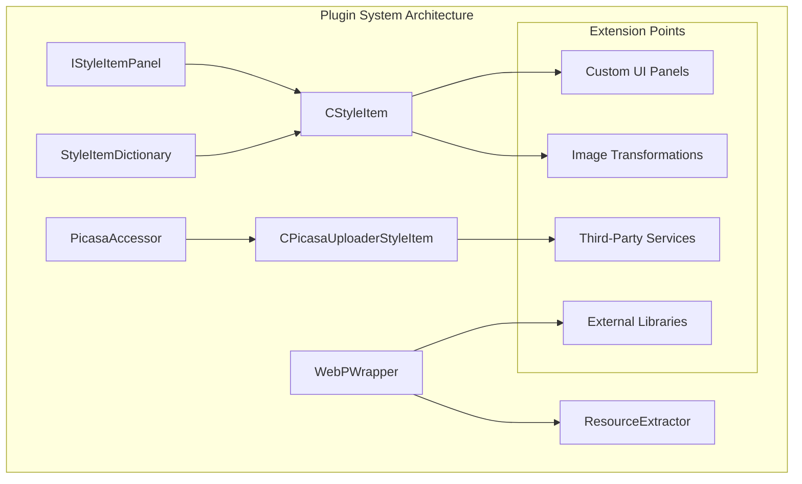
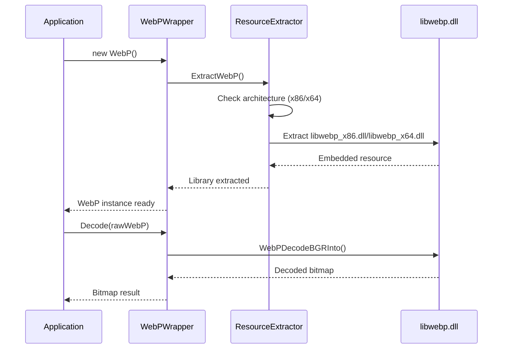
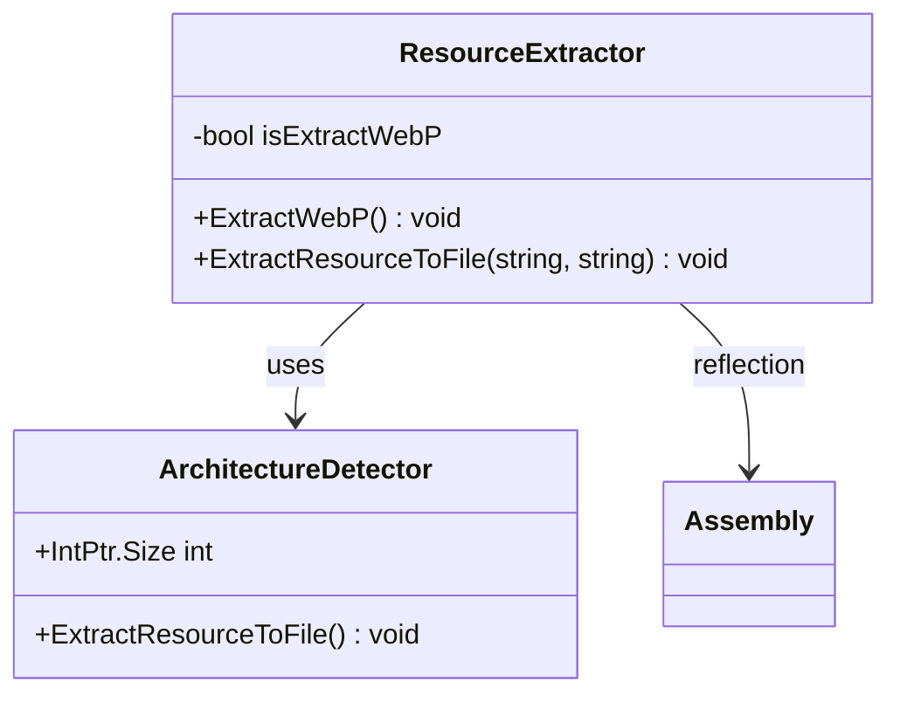
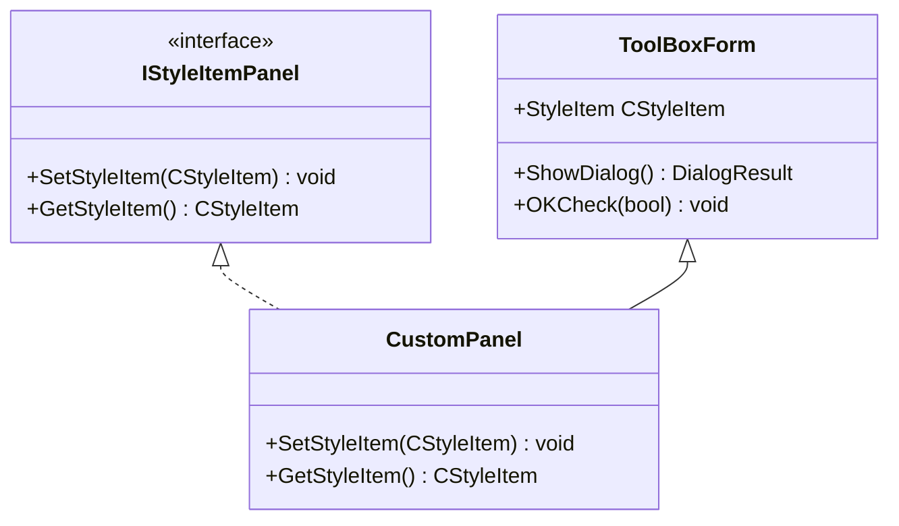
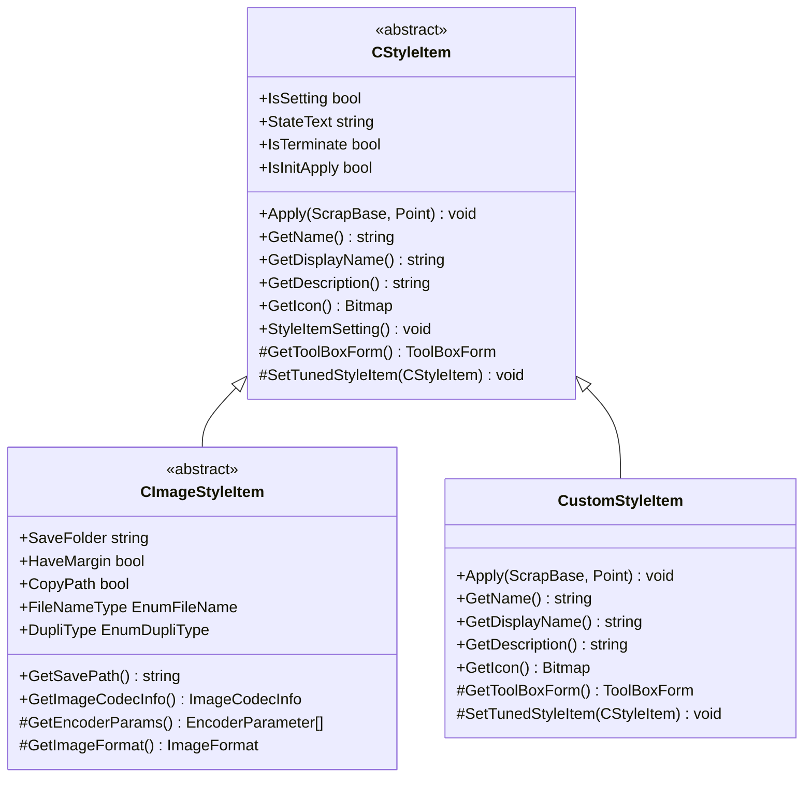
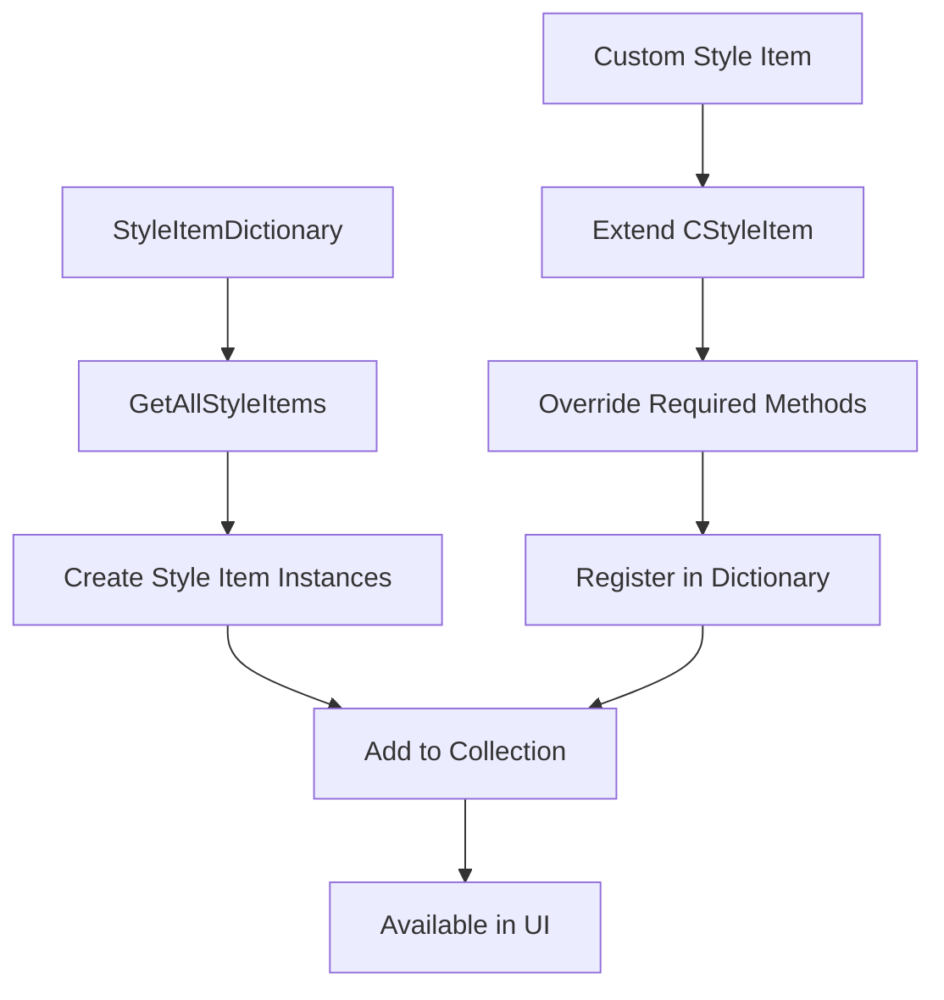
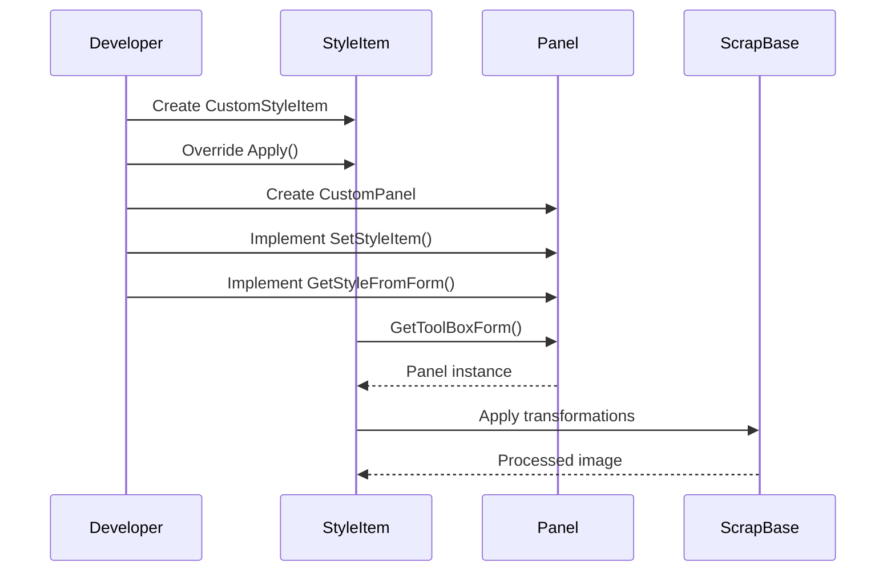
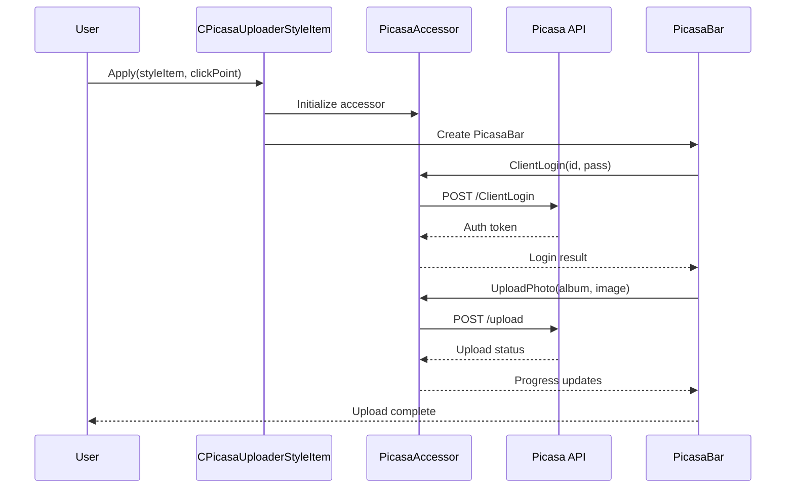
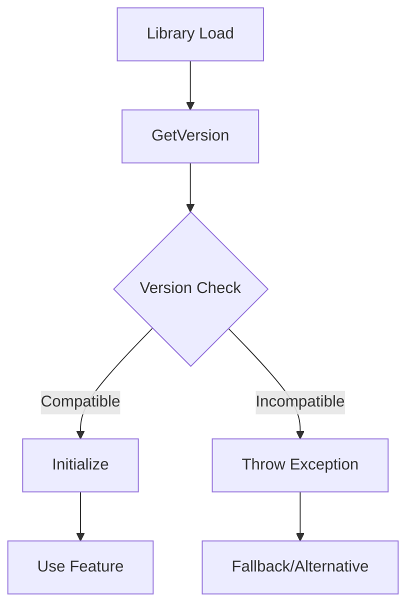

# Plugin System

<cite>
**Referenced Files in This Document**
- [WebPWrapper.cs](file://SETUNA/Plugins/WebPWrapper.cs)
- [ResourceExtractor.cs](file://SETUNA/Plugins/ResourceExtractor.cs)
- [IStyleItemPanel.cs](file://SETUNA/Main/StyleItems/IStyleItemPanel.cs)
- [CStyleItem.cs](file://SETUNA/Main/StyleItems/CStyleItem.cs)
- [CPicasaUploaderStyleItem.cs](file://SETUNA/Main/StyleItems/CPicasaUploaderStyleItem.cs)
- [CImageStyleItem.cs](file://SETUNA/Main/StyleItems/CImageStyleItem.cs)
- [PicasaAccessor.cs](file://SETUNA/com/clearunit/PicasaAccessor.cs)
- [StyleItemDictionary.cs](file://SETUNA/Main/StyleItems/StyleItemDictionary.cs)
- [Extensions.cs](file://SETUNA/Main/Extensions/Extensions.cs)
- [ExtensionAttribute.cs](file://SETUNA/Main/Extensions/ExtensionAttribute.cs)
- [ImageBmpStyleItemPanel.cs](file://SETUNA/Main/StyleItems/ImageBmpStyleItemPanel.cs)
- [ImageJpegStyleItemPanel.cs](file://SETUNA/Main/StyleItems/ImageJpegStyleItemPanel.cs)
</cite>

## Table of Contents
1. [Introduction](#introduction)
2. [Plugin Architecture Overview](#plugin-architecture-overview)
3. [WebPWrapper - External Library Integration](#webpwrapper---external-library-integration)
4. [ResourceExtractor - Embedded Resource Management](#resourceextractor---embedded-resource-management)
5. [Extension Points for Developers](#extension-points-for-developers)
6. [Style Item System](#style-item-system)
7. [Third-Party Service Integration](#third-party-service-integration)
8. [Common Issues and Solutions](#common-issues-and-solutions)
9. [Creating and Distributing Plugins](#creating-and-distributing-plugins)
10. [Best Practices](#best-practices)

## Introduction

SETUNA's plugin system provides a comprehensive framework for extending the application's functionality through external libraries, custom UI panels, and third-party service integrations. The system is built around several key components that enable developers to create powerful extensions while maintaining compatibility and stability.

The plugin architecture supports multiple extension points including:
- **External library integration** for format support (WebP)
- **Custom UI panels** for style item configuration
- **Third-party service integrations** (Picasa upload)
- **Custom image transformations** and processing
- **Embedded resource extraction** for portable deployments

## Plugin Architecture Overview

The plugin system is structured around several core components that work together to provide extensibility:



**Diagram sources**
- [WebPWrapper.cs](file://SETUNA/Plugins/WebPWrapper.cs#L32-L40)
- [ResourceExtractor.cs](file://SETUNA/Plugins/ResourceExtractor.cs#L5-L44)
- [IStyleItemPanel.cs](file://SETUNA/Main/StyleItems/IStyleItemPanel.cs#L4-L12)
- [CStyleItem.cs](file://SETUNA/Main/StyleItems/CStyleItem.cs#L8-L101)

**Section sources**
- [WebPWrapper.cs](file://SETUNA/Plugins/WebPWrapper.cs#L1-L50)
- [ResourceExtractor.cs](file://SETUNA/Plugins/ResourceExtractor.cs#L1-L44)
- [StyleItemDictionary.cs](file://SETUNA/Main/StyleItems/StyleItemDictionary.cs#L1-L40)

## WebPWrapper - External Library Integration

The WebPWrapper serves as a prime example of how SETUNA integrates external libraries to extend functionality. It provides comprehensive support for the WebP image format through native library integration.

### Core Features

The WebPWrapper offers extensive functionality for WebP image processing:

#### Decoding Capabilities
- **Basic Decoding**: Load WebP files and decode raw WebP data to Bitmap objects
- **Advanced Options**: Support for custom decoding options including scaling, cropping, and threading
- **Thumbnail Generation**: Fast and quality modes for creating thumbnails
- **Format Detection**: Automatic detection of WebP format characteristics

#### Encoding Capabilities  
- **Lossy Compression**: Configurable quality settings with speed optimization
- **Lossless Compression**: Bit-perfect preservation of original data
- **Near Lossless**: Quality compromise with perceptual improvements
- **Metadata Preservation**: Support for alpha channels and animation detection

### Implementation Details

The wrapper handles complex memory management and native library integration:



**Diagram sources**
- [WebPWrapper.cs](file://SETUNA/Plugins/WebPWrapper.cs#L36-L40)
- [ResourceExtractor.cs](file://SETUNA/Plugins/ResourceExtractor.cs#L9-L26)

### Memory Management

The WebPWrapper implements sophisticated memory management to handle native resources safely:

- **Pinned Memory**: Uses GCHandle for safe native memory access
- **Automatic Cleanup**: Implements IDisposable pattern with proper resource cleanup
- **Exception Safety**: Comprehensive error handling with meaningful error messages
- **Version Compatibility**: Runtime version checking for library compatibility

**Section sources**
- [WebPWrapper.cs](file://SETUNA/Plugins/WebPWrapper.cs#L32-L800)

## ResourceExtractor - Embedded Resource Management

The ResourceExtractor provides a robust mechanism for managing embedded resources, particularly useful for portable applications that need to extract native libraries at runtime.

### Architecture and Design

The ResourceExtractor follows a singleton-like pattern with thread-safe resource extraction:



**Diagram sources**
- [ResourceExtractor.cs](file://SETUNA/Plugins/ResourceExtractor.cs#L5-L44)

### Key Features

#### Automatic Architecture Detection
The extractor automatically detects the target platform architecture and extracts the appropriate native library:

- **x86 Detection**: Uses `IntPtr.Size == 4` to identify 32-bit systems
- **x64 Detection**: Uses `IntPtr.Size == 8` to identify 64-bit systems  
- **Conditional Extraction**: Prevents redundant extraction attempts

#### Portable Deployment Support
- **Embedded Resources**: Libraries are embedded as assembly resources
- **Runtime Extraction**: Extracts to local filesystem when needed
- **Cleanup Prevention**: Ensures libraries are extracted only once

#### Security and Reliability
- **Existence Checking**: Verifies file existence before extraction
- **Stream Management**: Proper disposal of resource streams
- **Error Handling**: Graceful fallback for extraction failures

**Section sources**
- [ResourceExtractor.cs](file://SETUNA/Plugins/ResourceExtractor.cs#L1-L44)

## Extension Points for Developers

SETUNA provides several well-defined extension points that allow developers to customize and extend the application's functionality.

### IStyleItemPanel Interface

The IStyleItemPanel interface defines the contract for custom UI panels that configure style items:



**Diagram sources**
- [IStyleItemPanel.cs](file://SETUNA/Main/StyleItems/IStyleItemPanel.cs#L4-L12)

#### Implementation Requirements

Custom panels must implement:
- **SetStyleItem**: Configure panel controls from style item properties
- **GetStyleItem**: Create new style item from panel configuration
- **Validation**: Override OKCheck for input validation
- **Dialog Behavior**: Handle ShowDialog and DialogResult patterns

### CStyleItem Base Class

The CStyleItem abstract class provides the foundation for all style item implementations:



**Diagram sources**
- [CStyleItem.cs](file://SETUNA/Main/StyleItems/CStyleItem.cs#L8-L101)
- [CImageStyleItem.cs](file://SETUNA/Main/StyleItems/CImageStyleItem.cs#L10-L276)

#### Extension Patterns

Developers can extend CStyleItem in several ways:

1. **Direct Implementation**: Create custom style items from scratch
2. **Inheritance**: Extend CImageStyleItem for image processing
3. **Composition**: Build complex behaviors from existing components

**Section sources**
- [IStyleItemPanel.cs](file://SETUNA/Main/StyleItems/IStyleItemPanel.cs#L1-L13)
- [CStyleItem.cs](file://SETUNA/Main/StyleItems/CStyleItem.cs#L1-L101)

## Style Item System

The style item system provides a flexible framework for applying various transformations and operations to captured screenshots.

### Style Item Registration

New style items are registered through the StyleItemDictionary:



**Diagram sources**
- [StyleItemDictionary.cs](file://SETUNA/Main/StyleItems/StyleItemDictionary.cs#L15-L33)

### Built-in Style Items

The system includes numerous built-in style items:

| Style Item | Purpose | Configuration Options |
|------------|---------|----------------------|
| CImageBmpStyleItem | BMP image saving | Quality, margins, file naming |
| CImageJpegStyleItem | JPEG image saving | Quality slider, preview options |
| CImagePngStyleItem | PNG image saving | Transparency support |
| CPicasaUploaderStyleItem | Picasa upload | Authentication, album selection |
| CMoveStyleItem | Position adjustment | Coordinates, snap settings |
| CScaleStyleItem | Size transformation | Scaling factors, aspect ratio |
| CRotateStyleItem | Rotation effects | Angle settings, interpolation |

### Custom Style Item Example

Here's how to create a custom style item:



**Section sources**
- [StyleItemDictionary.cs](file://SETUNA/Main/StyleItems/StyleItemDictionary.cs#L1-L40)
- [CPicasaUploaderStyleItem.cs](file://SETUNA/Main/StyleItems/CPicasaUploaderStyleItem.cs#L1-L147)

## Third-Party Service Integration

SETUNA demonstrates third-party service integration through the PicasaUploader, which showcases how to connect with external APIs and services.

### Picasa Integration Architecture



**Diagram sources**
- [CPicasaUploaderStyleItem.cs](file://SETUNA/Main/StyleItems/CPicasaUploaderStyleItem.cs#L78-L96)
- [PicasaAccessor.cs](file://SETUNA/com/clearunit/PicasaAccessor.cs#L38-L160)

### Service Integration Patterns

The Picasa integration demonstrates several important patterns:

#### Authentication Management
- **Credential Storage**: Secure handling of user credentials
- **Token Management**: OAuth-style authentication tokens
- **Error Handling**: Comprehensive error reporting for authentication failures

#### API Communication
- **HTTP Requests**: Standard HTTP communication patterns
- **XML Processing**: Atom feed parsing for album management
- **Progress Reporting**: Background worker integration for long operations

#### User Experience
- **Modal Dialogs**: Blocking UI during operations
- **Visual Feedback**: Progress indicators and status messages
- **Error Recovery**: Graceful handling of network failures

**Section sources**
- [CPicasaUploaderStyleItem.cs](file://SETUNA/Main/StyleItems/CPicasaUploaderStyleItem.cs#L1-L147)
- [PicasaAccessor.cs](file://SETUNA/com/clearunit/PicasaAccessor.cs#L1-L375)

## Common Issues and Solutions

### DLL Loading Failures

DLL loading issues are among the most common problems encountered with plugin systems:

#### Symptoms
- **AccessViolationException**: Native library access violations
- **DllNotFoundException**: Missing native libraries
- **EntryPointNotFoundException**: Incorrect function signatures
- **BadImageFormatException**: Architecture mismatches

#### Solutions

1. **Architecture Verification**
   ```csharp
   // Check target architecture
   if (IntPtr.Size == 4)
   {
       // Load x86 library
   }
   else
   {
       // Load x64 library
   }
   ```

2. **Dependency Resolution**
   - Ensure all dependencies are available
   - Use dependency walker to identify missing dependencies
   - Verify .NET Framework version compatibility

3. **Memory Management**
   - Properly dispose of native resources
   - Use try-finally blocks for cleanup
   - Implement IDisposable pattern correctly

### Version Compatibility Issues

#### Runtime Version Checking
The WebPWrapper demonstrates proper version compatibility handling:



**Diagram sources**
- [WebPWrapper.cs](file://SETUNA/Plugins/WebPWrapper.cs#L662-L676)

#### Best Practices for Version Compatibility
- **Graceful Degradation**: Provide fallback functionality
- **Feature Detection**: Test for specific capabilities
- **Documentation**: Clearly document version requirements
- **Testing**: Comprehensive testing across supported versions

### Resource Extraction Problems

#### Common Extraction Issues
- **Permission Denied**: Insufficient file system permissions
- **File Lock Conflicts**: Concurrent access to resources
- **Missing Resources**: Embedded resources not included in assembly

#### Solutions
- **Temporary Directory**: Use AppData or temporary folders
- **Atomic Operations**: Extract to temporary location first
- **Retry Logic**: Implement exponential backoff for transient failures

**Section sources**
- [WebPWrapper.cs](file://SETUNA/Plugins/WebPWrapper.cs#L662-L676)
- [ResourceExtractor.cs](file://SETUNA/Plugins/ResourceExtractor.cs#L28-L41)

## Creating and Distributing Plugins

### Plugin Development Guidelines

#### 1. Architecture Planning
- **Separation of Concerns**: Keep UI logic separate from business logic
- **Interface Contracts**: Define clear interfaces for extension points
- **Dependency Management**: Minimize external dependencies

#### 2. Implementation Steps

```mermaid
flowchart TD
A[Define Requirements] --> B[Choose Extension Point]
B --> C[Implement Interface/Inherit Base Class]
C --> D[Add UI Panel (Optional)]
D --> E[Register in StyleItemDictionary]
E --> F[Test Thoroughly]
F --> G[Package Distribution]
```

#### 3. Code Organization
- **Namespace Structure**: Use logical namespaces
- **File Organization**: Group related classes together
- **Documentation**: Include XML comments and usage examples

### Distribution Strategies

#### Portable Plugins
- **Embedded Resources**: Package dependencies as embedded resources
- **Self-Extracting**: Use ResourceExtractor for automatic extraction
- **Version Management**: Include version information for compatibility

#### Installable Plugins
- **Assembly Deployment**: Deploy to application directory
- **GAC Registration**: Register in Global Assembly Cache (optional)
- **Configuration Files**: Use app.config for plugin settings

### Packaging Considerations

#### File Structure
```
PluginName/
├── PluginName.dll          # Main assembly
├── Dependencies/           # Embedded dependencies
│   ├── libwebp_x86.dll
│   └── libwebp_x64.dll
├── PluginName.xml          # Metadata/configuration
└── README.md              # Documentation
```

#### Manifest Information
- **Version Numbers**: Semantic versioning
- **Dependencies**: List of required assemblies
- **Compatibility**: Supported framework versions
- **License**: License information

**Section sources**
- [StyleItemDictionary.cs](file://SETUNA/Main/StyleItems/StyleItemDictionary.cs#L15-L33)
- [ResourceExtractor.cs](file://SETUNA/Plugins/ResourceExtractor.cs#L1-L44)

## Best Practices

### Performance Optimization

#### Memory Management
- **Dispose Pattern**: Implement IDisposable correctly
- **Resource Pooling**: Reuse expensive resources when possible
- **Lazy Loading**: Load resources only when needed

#### Threading Considerations
- **UI Thread Affinity**: Keep UI updates on main thread
- **Background Processing**: Use BackgroundWorker for long operations
- **Thread Safety**: Ensure thread-safe access to shared resources

### Error Handling

#### Defensive Programming
- **Input Validation**: Validate all inputs thoroughly
- **Exception Wrapping**: Provide meaningful error messages
- **Graceful Degradation**: Maintain functionality when parts fail

#### Logging and Diagnostics
- **Structured Logging**: Use consistent logging patterns
- **Debug Information**: Include debug builds with detailed information
- **Error Reporting**: Collect and report errors appropriately

### Testing Strategies

#### Unit Testing
- **Mock Dependencies**: Mock external libraries and services
- **Isolation**: Test individual components in isolation
- **Edge Cases**: Test boundary conditions and error scenarios

#### Integration Testing
- **End-to-End Scenarios**: Test complete workflows
- **Cross-Platform**: Test on different architectures and OS versions
- **Performance**: Measure and optimize performance-critical paths

### Security Considerations

#### Credential Management
- **Secure Storage**: Never store credentials in plain text
- **Encryption**: Encrypt sensitive data when storage is required
- **Access Control**: Limit access to credential storage

#### Resource Access
- **Sandboxing**: Run plugins in restricted environments when possible
- **Validation**: Validate all external inputs
- **Permissions**: Request minimal required permissions

**Section sources**
- [WebPWrapper.cs](file://SETUNA/Plugins/WebPWrapper.cs#L1-L50)
- [CStyleItem.cs](file://SETUNA/Main/StyleItems/CStyleItem.cs#L1-L101)