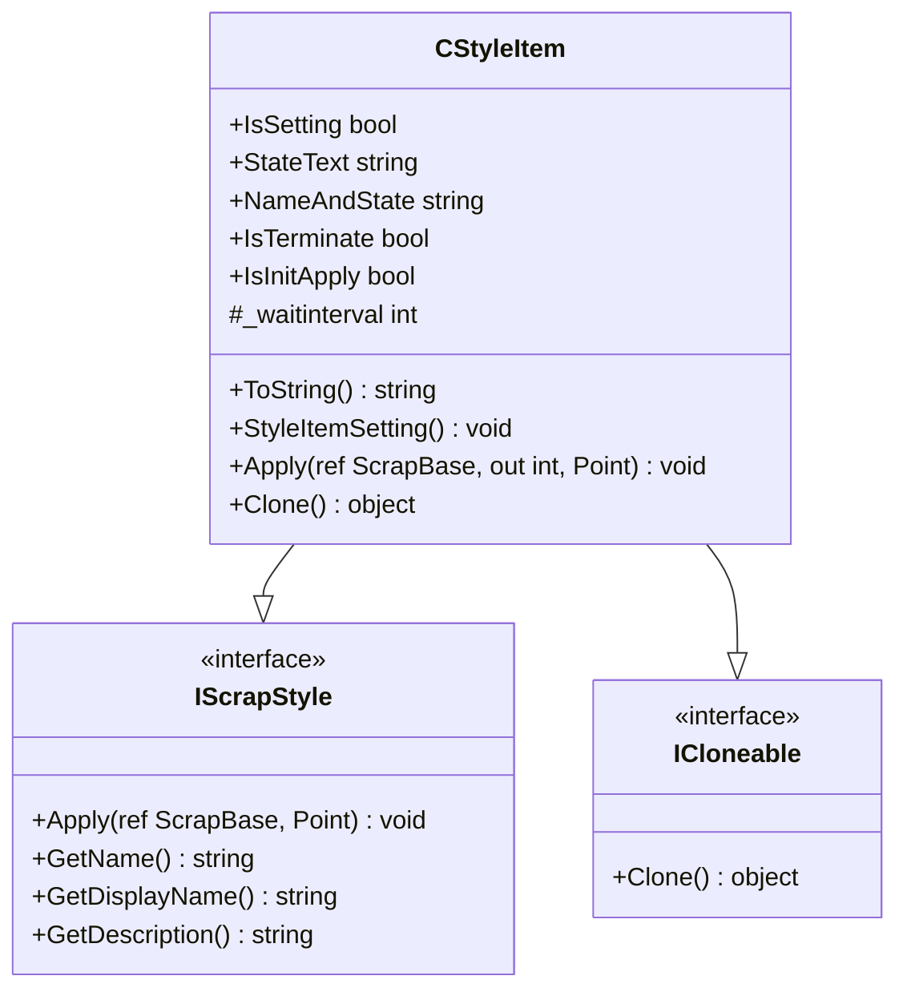
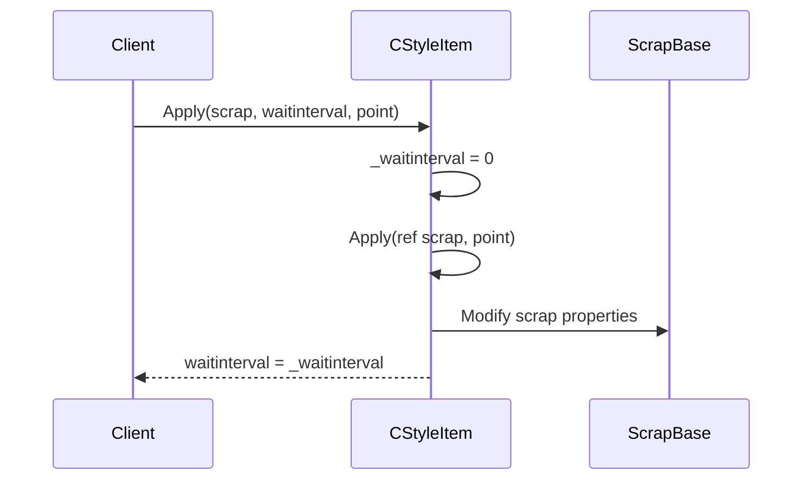
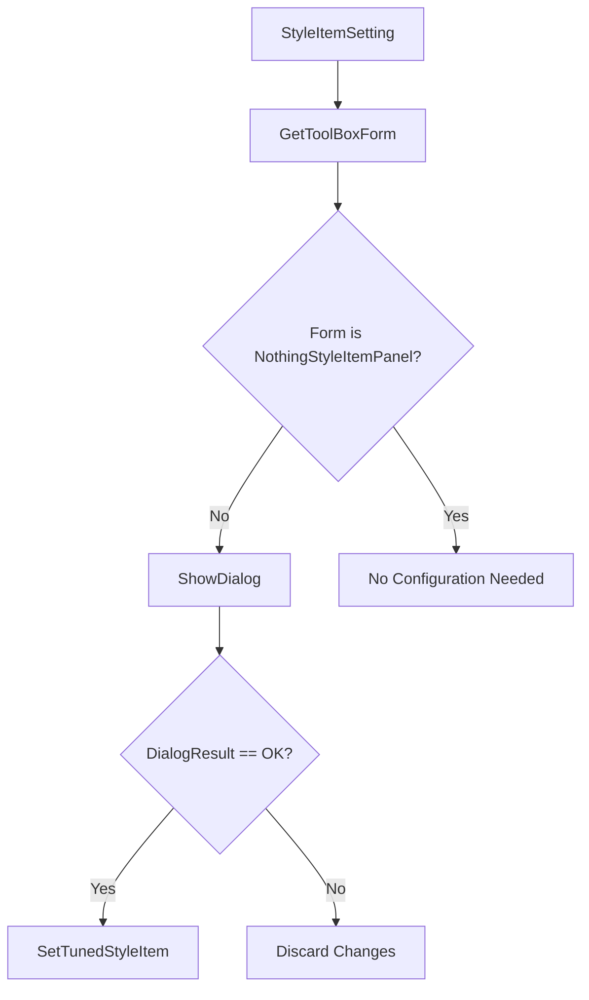
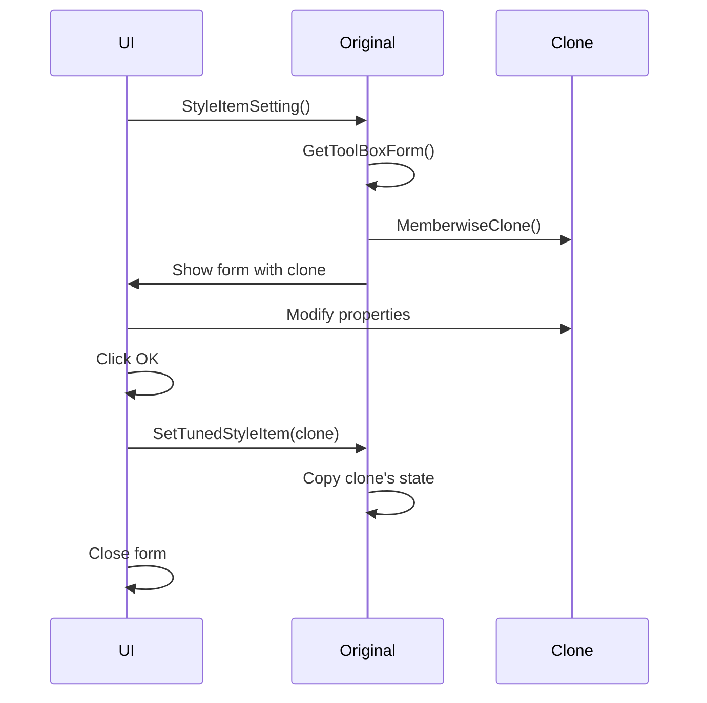
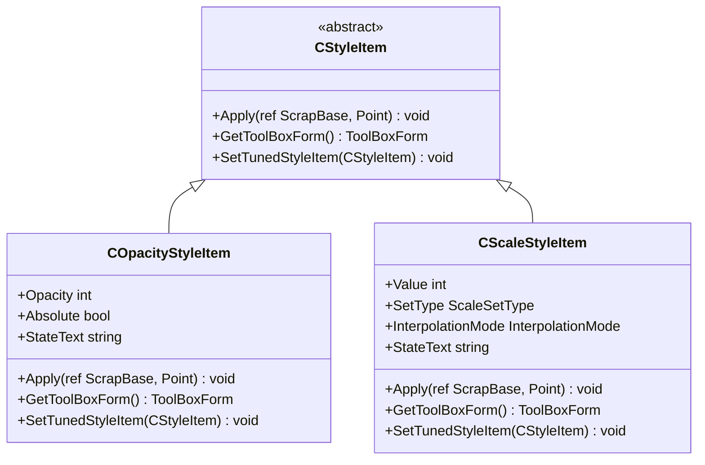

# CStyleItem Base Class

<cite>
**Referenced Files in This Document**   
- [CStyleItem.cs](file://SETUNA/Main/StyleItems/CStyleItem.cs)
- [IScrapStyle.cs](file://SETUNA/Main/StyleItems/IScrapStyle.cs)
- [COpacityStyleItem.cs](file://SETUNA/Main/StyleItems/COpacityStyleItem.cs)
- [CScaleStyleItem.cs](file://SETUNA/Main/StyleItems/CScaleStyleItem.cs)
- [CImageStyleItem.cs](file://SETUNA/Main/StyleItems/CImageStyleItem.cs)
- [OpacityStyleItemPanel.cs](file://SETUNA/Main/StyleItems/OpacityStyleItemPanel.cs)
- [ScaleStyleItemPanel.cs](file://SETUNA/Main/StyleItems/ScaleStyleItemPanel.cs)
- [NothingStyleItemPanel.cs](file://SETUNA/Main/StyleItems/NothingStyleItemPanel.cs)
- [ToolBoxForm.cs](file://SETUNA/Main/StyleItems/ToolBoxForm.cs)
- [ScrapBase.cs](file://SETUNA/Main/ScrapBase.cs)
</cite>

## Table of Contents
1. [Introduction](#introduction)
2. [Core Interface Implementation](#core-interface-implementation)
3. [Key Properties](#key-properties)
4. [Core Apply Methods](#core-apply-methods)
5. [Lifecycle and UI Integration Methods](#lifecycle-and-ui-integration-methods)
6. [Cloning Mechanism](#cloning-mechanism)
7. [Derived Class Implementation Patterns](#derived-class-implementation-patterns)
8. [Common Issues and Best Practices](#common-issues-and-best-practices)
9. [Performance Considerations](#performance-considerations)

## Introduction
The CStyleItem abstract base class serves as the foundation for all style item plugins in the SETUNA application. It provides a standardized interface and implementation framework for image transformation operations applied to ScrapBase instances. This class implements both IScrapStyle and ICloneable interfaces, enabling consistent style application and duplication across the application. The architecture supports extensibility through abstract methods that derived classes must implement, while providing common functionality for state management, UI integration, and operation sequencing.

**Section sources**
- [CStyleItem.cs](file://SETUNA/Main/StyleItems/CStyleItem.cs#L7-L98)

## Core Interface Implementation
The CStyleItem class implements two critical interfaces: IScrapStyle and ICloneable. The IScrapStyle interface defines the contract for style application operations, requiring implementations of GetName, GetDisplayName, GetDescription, and Apply methods. This interface ensures all style items provide consistent metadata and transformation capabilities. The ICloneable interface enables duplication of style items, which is essential for configuration persistence and user interface operations. The base class provides a default implementation of Clone using MemberwiseClone, which creates shallow copies of style item instances.



**Diagram sources**
- [CStyleItem.cs](file://SETUNA/Main/StyleItems/CStyleItem.cs#L7-L98)
- [IScrapStyle.cs](file://SETUNA/Main/StyleItems/IScrapStyle.cs#L6-L20)

**Section sources**
- [CStyleItem.cs](file://SETUNA/Main/StyleItems/CStyleItem.cs#L7-L98)
- [IScrapStyle.cs](file://SETUNA/Main/StyleItems/IScrapStyle.cs#L6-L20)

## Key Properties
The CStyleItem class exposes several key properties that provide information about the style item's state and behavior. The IsSetting property determines whether the style item requires user configuration by checking if GetToolBoxForm returns a NothingStyleItemPanel instance. The StateText property (virtual, defaulting to empty string) provides a textual representation of the current configuration state, which is used in the NameAndState property to create a combined display name. The IsTerminate property (virtual, defaulting to false) indicates whether the style application should terminate further processing, while IsInitApply (virtual, defaulting to true) specifies whether the style should be applied immediately upon creation.

```mermaid
classDiagram
class CStyleItem {
+IsSetting bool
+StateText string
+NameAndState string
+IsTerminate bool
+IsInitApply bool
}
note right of CStyleItem : : IsSetting
Returns true if the style item
has configurable settings
end note
note right of CStyleItem : : StateText
Virtual property that returns
current configuration state
as text
end note
note right of CStyleItem : : NameAndState
Combines display name with
state text in parentheses
when state is not empty
end note
```

**Diagram sources**
- [CStyleItem.cs](file://SETUNA/Main/StyleItems/CStyleItem.cs#L21-L68)

**Section sources**
- [CStyleItem.cs](file://SETUNA/Main/StyleItems/CStyleItem.cs#L21-L68)

## Core Apply Methods
The CStyleItem class defines two overloads of the Apply method to handle image transformations on ScrapBase instances. The primary abstract method Apply(ref ScrapBase, Point) must be implemented by derived classes and performs the actual transformation logic. The concrete overload Apply(ref ScrapBase, out int, Point) provides a wrapper that manages operation delay control through the _waitinterval field. This pattern uses ref parameters to allow modification of the ScrapBase instance and out parameters to communicate delay intervals to the calling code, enabling sequential execution of style operations with controlled timing.



**Diagram sources**
- [CStyleItem.cs](file://SETUNA/Main/StyleItems/CStyleItem.cs#L35-L42)
- [CStyleItem.cs](file://SETUNA/Main/StyleItems/CStyleItem.cs#L70-L71)

**Section sources**
- [CStyleItem.cs](file://SETUNA/Main/StyleItems/CStyleItem.cs#L35-L71)

## Lifecycle and UI Integration Methods
The CStyleItem class provides a framework for UI integration and configuration persistence through the GetToolBoxForm and SetTunedStyleItem methods. The abstract GetToolBoxForm method returns a ToolBoxForm instance for user configuration, enabling visual editing of style parameters. The StyleItemSetting method orchestrates the configuration workflow by showing the form as a dialog and applying changes through SetTunedStyleItem when the user confirms. This lifecycle pattern allows for consistent user interface behavior across all style items, with derived classes implementing the specific form creation and state transfer logic.



**Diagram sources**
- [CStyleItem.cs](file://SETUNA/Main/StyleItems/CStyleItem.cs#L25-L34)
- [CStyleItem.cs](file://SETUNA/Main/StyleItems/CStyleItem.cs#L83-L86)

**Section sources**
- [CStyleItem.cs](file://SETUNA/Main/StyleItems/CStyleItem.cs#L25-L86)

## Cloning Mechanism
The CStyleItem class implements the ICloneable interface with a Clone method that uses MemberwiseClone to create shallow copies of style item instances. This cloning mechanism is essential for preserving configuration state when users modify style items through the UI. The pattern ensures that changes can be previewed and confirmed without affecting the original configuration. When a user confirms changes in the configuration form, the new state is transferred to the original instance through SetTunedStyleItem, maintaining consistency across the application.



**Diagram sources**
- [CStyleItem.cs](file://SETUNA/Main/StyleItems/CStyleItem.cs#L91-L95)
- [COpacityStyleItem.cs](file://SETUNA/Main/StyleItems/COpacityStyleItem.cs#L86-L91)
- [CScaleStyleItem.cs](file://SETUNA/Main/StyleItems/CScaleStyleItem.cs#L124-L129)

**Section sources**
- [CStyleItem.cs](file://SETUNA/Main/StyleItems/CStyleItem.cs#L91-L95)

## Derived Class Implementation Patterns
Derived classes such as COpacityStyleItem and CScaleStyleItem demonstrate consistent implementation patterns for extending the CStyleItem base class. These classes implement the abstract methods to provide specific transformation logic, with Apply methods that modify ScrapBase properties like ActiveOpacity or Scale. They override StateText to provide meaningful configuration summaries and implement GetToolBoxForm to return appropriate configuration panels. The SetTunedStyleItem method transfers state from cloned instances, ensuring configuration changes are properly applied.



**Diagram sources**
- [COpacityStyleItem.cs](file://SETUNA/Main/StyleItems/COpacityStyleItem.cs#L8-L123)
- [CScaleStyleItem.cs](file://SETUNA/Main/StyleItems/CScaleStyleItem.cs#L10-L210)
- [OpacityStyleItemPanel.cs](file://SETUNA/Main/StyleItems/OpacityStyleItemPanel.cs#L9-L217)
- [ScaleStyleItemPanel.cs](file://SETUNA/Main/StyleItems/ScaleStyleItemPanel.cs#L7-L152)

**Section sources**
- [COpacityStyleItem.cs](file://SETUNA/Main/StyleItems/COpacityStyleItem.cs#L8-L123)
- [CScaleStyleItem.cs](file://SETUNA/Main/StyleItems/CScaleStyleItem.cs#L10-L210)

## Common Issues and Best Practices
When implementing derived classes of CStyleItem, several common issues should be addressed. State management across clones requires careful implementation of SetTunedStyleItem to ensure all relevant properties are transferred. Derived classes should properly handle unmanaged resources, particularly when working with graphics objects, by implementing IDisposable if necessary. The StateText property should provide meaningful information about the current configuration to enhance user experience. When implementing Apply methods, developers should validate input parameters and handle exceptions appropriately to maintain application stability.

**Section sources**
- [COpacityStyleItem.cs](file://SETUNA/Main/StyleItems/COpacityStyleItem.cs#L27-L58)
- [CScaleStyleItem.cs](file://SETUNA/Main/StyleItems/CScaleStyleItem.cs#L74-L83)
- [OpacityStyleItemPanel.cs](file://SETUNA/Main/StyleItems/OpacityStyleItemPanel.cs#L186-L190)
- [CImageStyleItem.cs](file://SETUNA/Main/StyleItems/CImageStyleItem.cs#L91-L98)

## Performance Considerations
When applying transformations to multiple scraps, performance considerations are crucial. The _waitinterval field allows for controlled sequencing of operations, preventing UI freezing during intensive processing. Derived classes should optimize their Apply methods to minimize processing time, particularly when dealing with image manipulation. Caching frequently used resources and reusing graphics objects can significantly improve performance. The ref parameter pattern enables direct modification of ScrapBase instances without unnecessary object creation, reducing memory allocation overhead during batch operations.

**Section sources**
- [CStyleItem.cs](file://SETUNA/Main/StyleItems/CStyleItem.cs#L37-L41)
- [CScaleStyleItem.cs](file://SETUNA/Main/StyleItems/CScaleStyleItem.cs#L74-L83)
- [CImageStyleItem.cs](file://SETUNA/Main/StyleItems/CImageStyleItem.cs#L25-L48)