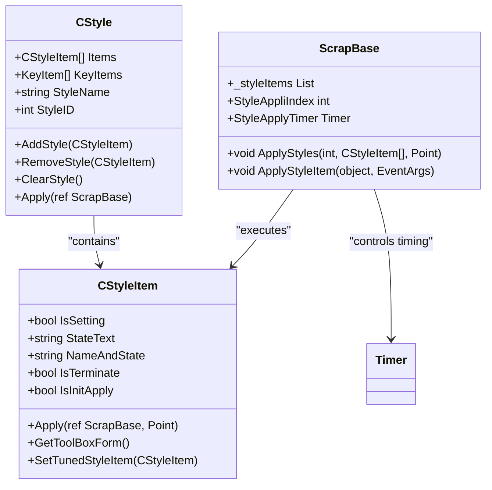
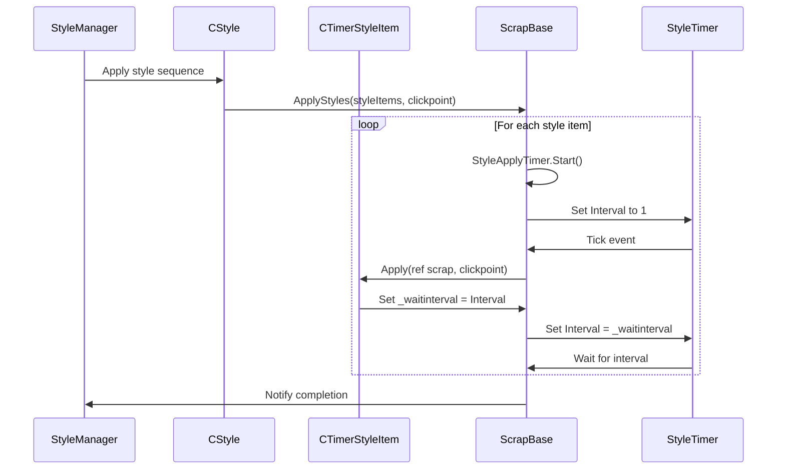
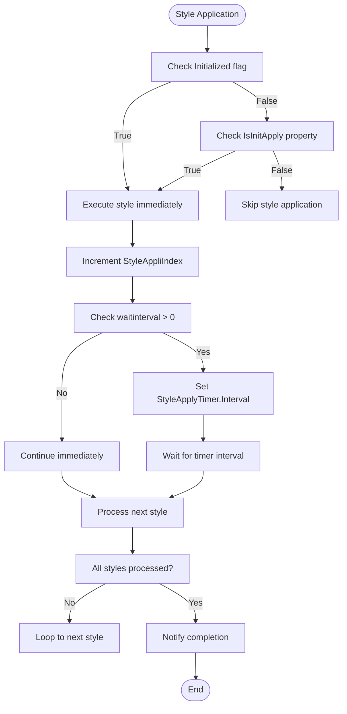
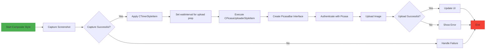
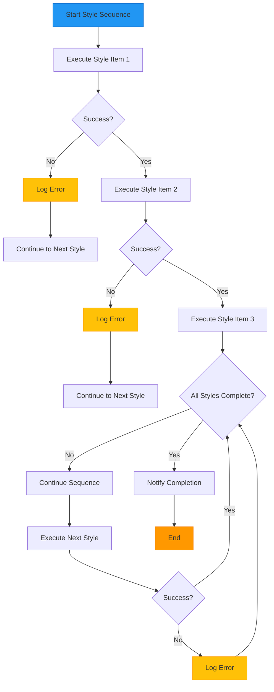
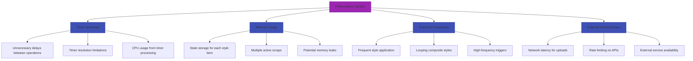

# Composite and Delayed Operation Styles

<cite>
**Referenced Files in This Document**   
- [CStyle.cs](file://SETUNA/Main/Style/CStyle.cs)
- [CStyleItem.cs](file://SETUNA/Main/StyleItems/CStyleItem.cs)
- [CTimerStyleItem.cs](file://SETUNA/Main/StyleItems/CTimerStyleItem.cs)
- [TimerStyleItemPanel.cs](file://SETUNA/Main/StyleItems/TimerStyleItemPanel.cs)
- [ScrapBase.cs](file://SETUNA/Main/ScrapBase.cs)
- [StyleItemDictionary.cs](file://SETUNA/Main/StyleItems/StyleItemDictionary.cs)
- [CPicasaUploaderStyleItem.cs](file://SETUNA/Main/StyleItems/CPicasaUploaderStyleItem.cs)
- [CCopyStyleItem.cs](file://SETUNA/Main/StyleItems/CCopyStyleItem.cs)
- [CPasteStyleItem.cs](file://SETUNA/Main/StyleItems/CPasteStyleItem.cs)
</cite>

## Table of Contents
1. [Introduction](#introduction)
2. [Composite Style Architecture](#composite-style-architecture)
3. [Delayed Operations with CTimerStyleItem](#delayed-operations-with-ctimerstyleitem)
4. [Immediate Application Control](#immediate-application-control)
5. [Style Registration and Instantiation](#style-registration-and-instantiation)
6. [Composite Style Example: Capture & Upload](#composite-style-example-capture--upload)
7. [Configuration Panels for Complex State](#configuration-panels-for-complex-state)
8. [Execution Order and Failure Handling](#execution-order-and-failure-handling)
9. [Performance Considerations](#performance-considerations)

## Introduction
This document details the advanced style implementation patterns in the SETUNA application, focusing on composite styles and time-delayed operations. The system enables sophisticated workflows through chaining multiple style operations with precise timing control. Key components include the CStyle container for grouping style items, CTimerStyleItem for introducing delays, and the underlying execution engine in ScrapBase that manages the application sequence. These mechanisms allow users to create complex automation sequences such as screenshot capture followed by cloud upload, with configurable timing between steps.

## Composite Style Architecture

The composite style system is built around the CStyle class, which acts as a container for multiple CStyleItem instances. This design enables batch transformations by chaining individual style operations into a single executable workflow. The CStyle class maintains a collection of CStyleItem objects in its _styles field, which can be accessed and modified through the Items property.

When a composite style is applied, the system iterates through each CStyleItem in sequence, executing their Apply methods in order. This sequential execution model ensures that transformations are applied in the intended order, allowing for complex multi-step operations. The CStyle class provides methods to add, remove, and replace individual style items, enabling dynamic composition of style workflows at runtime.



**Diagram sources**
- [CStyle.cs](file://SETUNA/Main/Style/CStyle.cs#L11-L276)
- [CStyleItem.cs](file://SETUNA/Main/StyleItems/CStyleItem.cs#L8-L100)
- [ScrapBase.cs](file://SETUNA/Main/ScrapBase.cs#L32-L943)

**Section sources**
- [CStyle.cs](file://SETUNA/Main/Style/CStyle.cs#L11-L276)
- [CStyleItem.cs](file://SETUNA/Main/StyleItems/CStyleItem.cs#L8-L100)

## Delayed Operations with CTimerStyleItem

The CTimerStyleItem class implements time-delayed operations within style sequences, enabling animation effects and timed workflows. It utilizes the _waitinterval field inherited from CStyleItem to introduce pauses between consecutive style applications. When applied, CTimerStyleItem sets this interval to its Interval property value, which determines the duration of the delay in milliseconds.

The timing mechanism is controlled by a Timer object in the ScrapBase class, which processes style items sequentially. After applying a CTimerStyleItem, the timer is configured with the specified interval before proceeding to the next style item. This allows for precise control over the timing of style sequences, enabling effects such as gradual transformations or staggered operations.

CTimerStyleItem enforces minimum and maximum interval constraints through static constants MIN_INTERVAL (100ms) and MAX_INTERVAL (60000ms). These limits prevent excessively short delays that could cause performance issues and prohibit extremely long delays that might confuse users. The Interval property automatically constrains values within this range, ensuring consistent behavior across different configurations.



**Diagram sources**
- [CTimerStyleItem.cs](file://SETUNA/Main/StyleItems/CTimerStyleItem.cs#L6-L103)
- [ScrapBase.cs](file://SETUNA/Main/ScrapBase.cs#L844-L915)
- [CStyleItem.cs](file://SETUNA/Main/StyleItems/CStyleItem.cs#L37-L41)

**Section sources**
- [CTimerStyleItem.cs](file://SETUNA/Main/StyleItems/CTimerStyleItem.cs#L6-L103)
- [ScrapBase.cs](file://SETUNA/Main/ScrapBase.cs#L844-L915)

## Immediate Application Control

The IsInitApply property in CStyleItem controls whether a style applies immediately upon scrap creation. This boolean property, which defaults to true, determines the initial application behavior of style items when a new scrap is created. Styles with IsInitApply set to false are deferred until explicitly triggered, allowing for on-demand operations rather than automatic application.

This mechanism is particularly useful for interactive operations that should not execute automatically. For example, the CPasteStyleItem class overrides IsInitApply to return false, preventing automatic pasting when a scrap is created. This ensures that paste operations occur only when explicitly requested by the user, avoiding unintended side effects.

The control flow for immediate application is implemented in the ApplyStyleItem method of ScrapBase, which checks both the Initialized flag and the IsInitApply property before executing a style item. This conditional logic enables fine-grained control over the execution timeline, allowing some styles to run immediately while others wait for specific conditions or user actions.



**Diagram sources**
- [CStyleItem.cs](file://SETUNA/Main/StyleItems/CStyleItem.cs#L68-L69)
- [ScrapBase.cs](file://SETUNA/Main/ScrapBase.cs#L879-L888)
- [CPasteStyleItem.cs](file://SETUNA/Main/StyleItems/CPasteStyleItem.cs#L82-L83)

**Section sources**
- [CStyleItem.cs](file://SETUNA/Main/StyleItems/CStyleItem.cs#L68-L69)
- [ScrapBase.cs](file://SETUNA/Main/ScrapBase.cs#L879-L888)

## Style Registration and Instantiation

Style items are registered and instantiated through the StyleItemDictionary class, which provides a centralized mechanism for managing available style types. The GetAllStyleItems method returns a collection of all available style items by creating instances of each supported CStyleItem type, while GetStyleType returns an array of the corresponding Type objects for reflection-based instantiation.

The registration system uses reflection to dynamically create style item instances, allowing for extensible architecture where new style types can be added without modifying core application code. This approach enables plugin-like behavior, where additional style functionality can be incorporated by simply adding new CStyleItem subclasses to the system.

The CanRestore method in StyleItemDictionary implements type validation and restoration logic, checking whether a given type can be restored from serialization. This method verifies that the type is a subclass of CStyleItem and is one of the supported types that can be persisted and recreated. This selective restoration capability ensures that only compatible and safe style types are reconstructed from saved configurations.

```mermaid
classDiagram
class StyleItemDictionary {
+GetAllStyleItems() CStyleItem[]
+GetStyleType() Type[]
+CanRestore(Type) bool
}
class CStyleItem {
+Clone()
+Apply(ref ScrapBase, Point)
+GetToolBoxForm()
}
class Reflection {
+Activator.CreateInstance(Type)
+GetType(string)
}
StyleItemDictionary --> CStyleItem : "creates instances"
StyleItemDictionary --> Reflection : "uses for instantiation"
CStyleItem <|-- CTimerStyleItem
CStyleItem <|-- CCopyStyleItem
CStyleItem <|-- CPasteStyleItem
CStyleItem <|-- CPicasaUploaderStyleItem
CStyleItem <|-- CMoveStyleItem
CStyleItem <|-- CScaleStyleItem
note right of StyleItemDictionary
Central registry for all
available style items
Enables reflection-based
instantiation and type
validation
end
```

**Diagram sources**
- [StyleItemDictionary.cs](file://SETUNA/Main/StyleItems/StyleItemDictionary.cs#L7-L83)
- [CStyleItem.cs](file://SETUNA/Main/StyleItems/CStyleItem.cs#L8-L100)

**Section sources**
- [StyleItemDictionary.cs](file://SETUNA/Main/StyleItems/StyleItemDictionary.cs#L7-L83)

## Composite Style Example: Capture & Upload

The 'Capture & Upload' composite style demonstrates the integration of screenshot capture with cloud upload functionality. This workflow combines multiple style items into a single sequence: first capturing a screenshot, then uploading the captured image to a cloud service like Picasa. The implementation leverages the composite style architecture to chain these operations together with appropriate timing.

The sequence begins with a capture operation (potentially using CCaptureStyle or similar), followed by a CTimerStyleItem to introduce a delay if needed, and concludes with a CPicasaUploaderStyleItem to handle the upload process. The CPicasaUploaderStyleItem creates a PicasaBar interface element that manages the upload workflow, including authentication and progress monitoring.

This composite style showcases several key features: the ability to chain disparate operations, the use of timing controls to manage workflow pacing, and the integration of external services through dedicated style items. The configuration would typically include settings for the target album, privacy settings, and authentication credentials, all managed through the associated configuration panel.



**Diagram sources**
- [CPicasaUploaderStyleItem.cs](file://SETUNA/Main/StyleItems/CPicasaUploaderStyleItem.cs#L79-L96)
- [CTimerStyleItem.cs](file://SETUNA/Main/StyleItems/CTimerStyleItem.cs#L37-L40)
- [CStyle.cs](file://SETUNA/Main/Style/CStyle.cs#L94-L103)

**Section sources**
- [CPicasaUploaderStyleItem.cs](file://SETUNA/Main/StyleItems/CPicasaUploaderStyleItem.cs#L79-L96)

## Configuration Panels for Complex State

Configuration panels, implemented through the IStyleItemPanel interface and ToolBoxForm base class, manage complex state for multi-step operations. Each style item type has an associated panel that provides a user interface for configuring its specific parameters. For example, TimerStyleItemPanel provides controls for setting the delay interval, while PicasaStyleItemPanel manages upload settings.

These panels follow a consistent pattern: they inherit from ToolBoxForm, accept a CStyleItem in their constructor, and implement methods to transfer state between the UI and the style item. The SetStyleToForm method initializes the UI with the current style item settings, while GetStyleFromForm creates a new style item instance with the configured values.

The configuration system handles validation and constraints, such as the minimum and maximum interval limits in TimerStyleItemPanel. This ensures that user inputs remain within acceptable ranges and prevents invalid configurations. The panels also manage persistent state like authentication credentials, storing them securely for subsequent use.

```mermaid
classDiagram
class IStyleItemPanel {
+SetStyleItem(CStyleItem)
+GetStyleItem() CStyleItem
}
class ToolBoxForm {
+StyleItem CStyleItem
+DialogResult DialogResult
+ShowDialog()
}
class TimerStyleItemPanel {
+numInterval NumericUpDown
+SetStyleToForm(object)
+GetStyleFromForm() object
}
class PicasaStyleItemPanel {
+txtAlbumName TextBox
+chkPublic CheckBox
+btnLogin Button
+SetStyleToForm(object)
+GetStyleFromForm() object
}
IStyleItemPanel <|-- ToolBoxForm
ToolBoxForm <|-- TimerStyleItemPanel
ToolBoxForm <|-- PicasaStyleItemPanel
TimerStyleItemPanel --> CTimerStyleItem
PicasaStyleItemPanel --> CPicasaUploaderStyleItem
note right of TimerStyleItemPanel
Configures delay interval
with min/max validation
Transfers state via
SetStyleToForm and
GetStyleFromForm
end
note right of PicasaStyleItemPanel
Manages upload settings
including authentication
Handles album configuration
and privacy settings
end
```

**Diagram sources**
- [TimerStyleItemPanel.cs](file://SETUNA/Main/StyleItems/TimerStyleItemPanel.cs#L4-L30)
- [IStyleItemPanel.cs](file://SETUNA/Main/StyleItems/IStyleItemPanel.cs#L4-L12)
- [CPicasaUploaderStyleItem.cs](file://SETUNA/Main/StyleItems/CPicasaUploaderStyleItem.cs#L117-L119)

**Section sources**
- [TimerStyleItemPanel.cs](file://SETUNA/Main/StyleItems/TimerStyleItemPanel.cs#L4-L30)
- [IStyleItemPanel.cs](file://SETUNA/Main/StyleItems/IStyleItemPanel.cs#L4-L12)

## Execution Order and Failure Handling

The system maintains execution order through a sequential processing model in the ApplyStyleItem method of ScrapBase. Style items are processed in the order they appear in the _styleItems collection, with each item completing (or failing) before the next begins. This linear execution ensures predictable behavior and prevents race conditions between operations.

Failure handling is implemented through try-catch blocks that wrap individual style applications. When an exception occurs during style application, the system logs the error and continues with subsequent styles rather than terminating the entire sequence. This fault-tolerant approach allows partial success in composite operations, where some steps may complete even if others fail.

The system faces challenges in managing partial failures, particularly when later operations depend on the successful completion of earlier ones. For example, an upload operation will fail if the preceding capture operation did not produce an image. The current implementation does not provide built-in dependency checking, requiring careful composition of style sequences to avoid such issues.

Debugging asynchronous style chains can be challenging due to the timer-driven execution model. The system lacks comprehensive logging or visualization tools for tracking the progress of style sequences, making it difficult to diagnose issues in complex workflows. Developers must rely on console output and manual inspection to understand the execution flow.



**Diagram sources**
- [ScrapBase.cs](file://SETUNA/Main/ScrapBase.cs#L869-L897)
- [CStyle.cs](file://SETUNA/Main/Style/CStyle.cs#L94-L103)

**Section sources**
- [ScrapBase.cs](file://SETUNA/Main/ScrapBase.cs#L869-L897)

## Performance Considerations

Long-running or frequently applied composite styles present several performance considerations. The timer-based execution model introduces overhead for each style item, as the system must wait for timer intervals even when no delay is needed. This can lead to unnecessary latency in style sequences, particularly when chaining multiple operations.

Memory usage is another concern, as each style item maintains its own state and configuration. Complex composite styles with many items can consume significant memory, especially when multiple scraps are active simultaneously. The system should implement resource cleanup mechanisms to prevent memory leaks during prolonged use.

The frequency of style application affects system responsiveness, particularly for operations that involve external services or file I/O. Repeated cloud uploads or disk writes can degrade performance and potentially trigger rate limiting on external services. Users should be cautioned against creating composite styles that perform expensive operations in tight loops.

Optimization opportunities exist in batching related operations and minimizing context switches between style items. For example, multiple image transformations could be combined into a single operation rather than executed sequentially. Additionally, implementing asynchronous operations for network requests would improve responsiveness by preventing UI blocking during uploads.



**Diagram sources**
- [ScrapBase.cs](file://SETUNA/Main/ScrapBase.cs#L844-L915)
- [CTimerStyleItem.cs](file://SETUNA/Main/StyleItems/CTimerStyleItem.cs#L11-L27)
- [CPicasaUploaderStyleItem.cs](file://SETUNA/Main/StyleItems/CPicasaUploaderStyleItem.cs#L79-L96)

**Section sources**
- [ScrapBase.cs](file://SETUNA/Main/ScrapBase.cs#L844-L915)
- [CTimerStyleItem.cs](file://SETUNA/Main/StyleItems/CTimerStyleItem.cs#L11-L27)