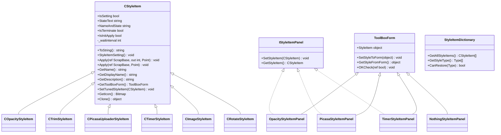
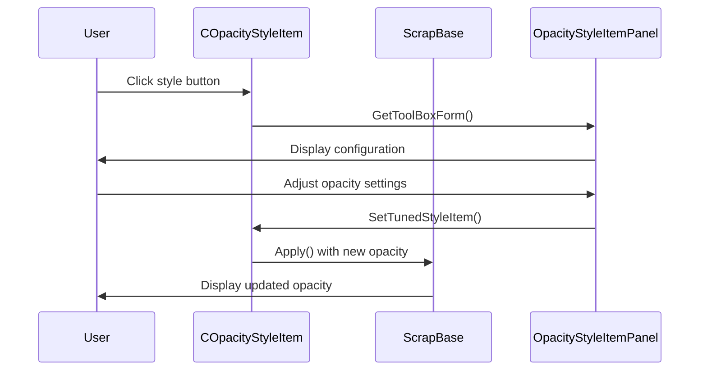
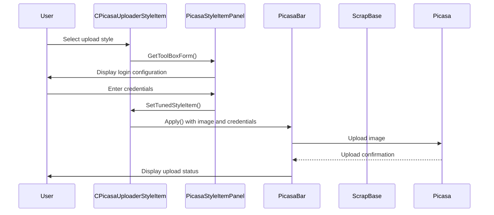
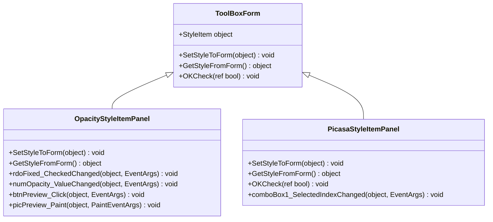
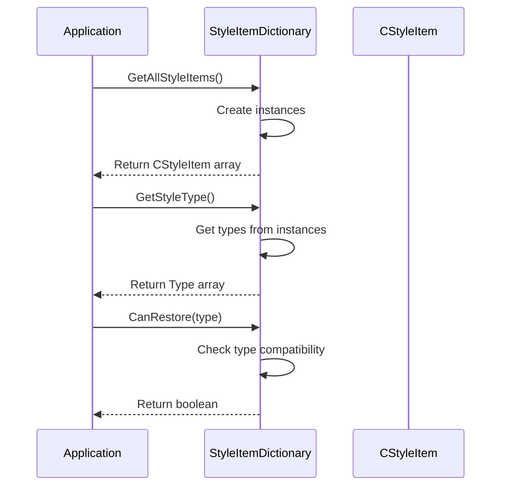
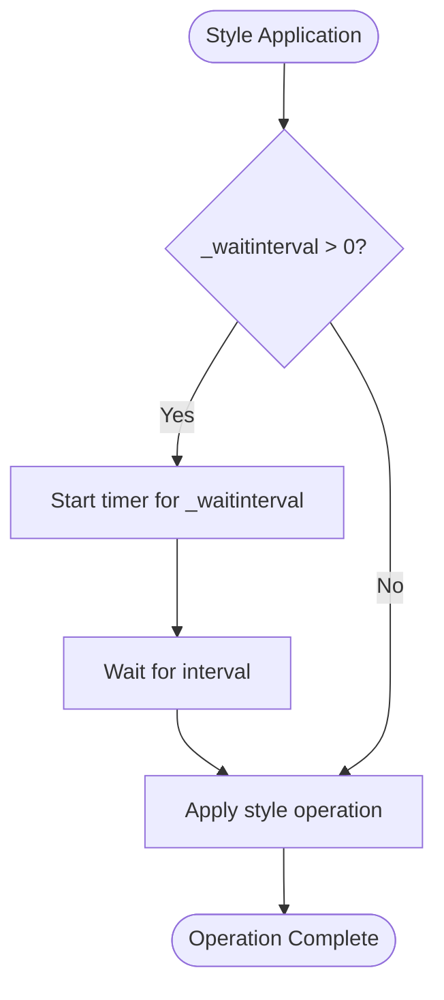

# Extension Implementation Patterns

<cite>
**Referenced Files in This Document**   
- [CStyleItem.cs](file://SETUNA/Main/StyleItems/CStyleItem.cs)
- [IStyleItemPanel.cs](file://SETUNA/Main/StyleItems/IStyleItemPanel.cs)
- [StyleItemDictionary.cs](file://SETUNA/Main/StyleItems/StyleItemDictionary.cs)
- [ToolBoxForm.cs](file://SETUNA/Main/StyleItems/ToolBoxForm.cs)
- [COpacityStyleItem.cs](file://SETUNA/Main/StyleItems/COpacityStyleItem.cs)
- [CTrimStyleItem.cs](file://SETUNA/Main/StyleItems/CTrimStyleItem.cs)
- [CPicasaUploaderStyleItem.cs](file://SETUNA/Main/StyleItems/CPicasaUploaderStyleItem.cs)
- [OpacityStyleItemPanel.cs](file://SETUNA/Main/StyleItems/OpacityStyleItemPanel.cs)
- [PicasaStyleItemPanel.cs](file://SETUNA/Main/StyleItems/PicasaStyleItemPanel.cs)
- [CTimerStyleItem.cs](file://SETUNA/Main/StyleItems/CTimerStyleItem.cs)
- [TimerStyleItemPanel.Designer.cs](file://SETUNA/Main/StyleItems/TimerStyleItemPanel.Designer.cs)
- [CImageStyleItem.cs](file://SETUNA/Main/StyleItems/CImageStyleItem.cs)
- [CRotateStyleItem.cs](file://SETUNA/Main/StyleItems/CRotateStyleItem.cs)
</cite>

## Table of Contents
1. [Introduction](#introduction)
2. [Core Architecture](#core-architecture)
3. [Base Class Structure](#base-class-structure)
4. [Implementation Patterns by Category](#implementation-patterns-by-category)
5. [Configuration Panel Implementation](#configuration-panel-implementation)
6. [Registration and Discovery](#registration-and-discovery)
7. [Advanced Patterns](#advanced-patterns)
8. [Step-by-Step Implementation Example](#step-by-step-implementation-example)
9. [Troubleshooting Common Issues](#troubleshooting-common-issues)
10. [Conclusion](#conclusion)

## Introduction

This document details the extension implementation patterns for the style item system in the SETUNA application. The system enables developers to create custom image transformation plugins by extending the `CStyleItem` base class and implementing required abstract methods. The architecture supports various categories of style items, including simple transformations, interactive tools, and service integrations. This documentation provides comprehensive guidance on creating new style items, implementing configuration panels, registering extensions, and addressing common development challenges.

**Section sources**
- [CStyleItem.cs](file://SETUNA/Main/StyleItems/CStyleItem.cs#L1-L101)

## Core Architecture

The style item system follows a plugin-based architecture where each style item represents a specific image transformation or operation. The core components include the abstract `CStyleItem` base class, the `IStyleItemPanel` interface for configuration, and the `StyleItemDictionary` for registration and discovery. Style items are applied to `ScrapBase` objects, which represent the image elements being manipulated. The system uses reflection for discovery and supports both immediate and delayed operations through the `_waitinterval` mechanism.



**Diagram sources**
- [CStyleItem.cs](file://SETUNA/Main/StyleItems/CStyleItem.cs#L1-L101)
- [IStyleItemPanel.cs](file://SETUNA/Main/StyleItems/IStyleItemPanel.cs#L1-L13)
- [ToolBoxForm.cs](file://SETUNA/Main/StyleItems/ToolBoxForm.cs#L1-L64)
- [StyleItemDictionary.cs](file://SETUNA/Main/StyleItems/StyleItemDictionary.cs#L1-L84)

**Section sources**
- [CStyleItem.cs](file://SETUNA/Main/StyleItems/CStyleItem.cs#L1-L101)
- [IStyleItemPanel.cs](file://SETUNA/Main/StyleItems/IStyleItemPanel.cs#L1-L13)
- [ToolBoxForm.cs](file://SETUNA/Main/StyleItems/ToolBoxForm.cs#L1-L64)
- [StyleItemDictionary.cs](file://SETUNA/Main/StyleItems/StyleItemDictionary.cs#L1-L84)

## Base Class Structure

The `CStyleItem` class serves as the foundation for all style item implementations, providing essential functionality and defining the contract for derived classes. It implements the `IScrapStyle` interface and supports cloning through `ICloneable`. The base class handles common operations such as string representation, setting management, and the application workflow. Key properties and methods include:

- **IsSetting**: Determines if the style item has a configuration panel by checking if the associated `ToolBoxForm` is not a `NothingStyleItemPanel`.
- **StyleItemSetting**: Manages the configuration workflow by displaying the tool box form and updating the style item with new settings.
- **Apply**: The primary method that orchestrates the application of the style, including setting up the wait interval and invoking the abstract `Apply` method.
- **StateText**: A virtual property that returns an empty string by default, allowing derived classes to provide state information.
- **NameAndState**: Combines the display name with state text when available.
- **IsTerminate**: Indicates whether the style should terminate the application chain.
- **IsInitApply**: Determines if the style should be applied during initialization.
- **_waitinterval**: A protected field that stores the delay interval for time-delayed operations.

Derived classes must implement the abstract methods `Apply`, `GetName`, `GetDisplayName`, `GetDescription`, `GetToolBoxForm`, `SetTunedStyleItem`, and `GetIcon` to provide specific functionality.

**Section sources**
- [CStyleItem.cs](file://SETUNA/Main/StyleItems/CStyleItem.cs#L1-L101)

## Implementation Patterns by Category

The style item system supports three main categories of extensions, each with distinct implementation patterns and use cases.

### Simple Transformations

Simple transformations apply immediate image modifications without requiring complex user interaction. The `COpacityStyleItem` serves as a prime example of this pattern. It modifies the opacity of a scrap element by adjusting the `ActiveOpacity` property. Key characteristics include:

- Direct property manipulation on the scrap object
- Configuration through a dedicated panel (`OpacityStyleItemPanel`)
- Support for both absolute and relative opacity adjustments
- Validation of input values within defined ranges



**Diagram sources**
- [COpacityStyleItem.cs](file://SETUNA/Main/StyleItems/COpacityStyleItem.cs#L1-L124)
- [OpacityStyleItemPanel.cs](file://SETUNA/Main/StyleItems/OpacityStyleItemPanel.cs#L1-L218)

**Section sources**
- [COpacityStyleItem.cs](file://SETUNA/Main/StyleItems/COpacityStyleItem.cs#L1-L124)

### Interactive Tools

Interactive tools provide user interfaces for complex operations that require input or selection. The `CTrimStyleItem` exemplifies this pattern, allowing users to select and remove portions of an image. Key characteristics include:

- Launching dedicated forms for user interaction (`TrimWindow`)
- Modal dialog execution to capture user input
- Image manipulation based on user-selected regions
- No persistent configuration panel (uses `NothingStyleItemPanel`)

The implementation creates a `TrimWindow` form, displays it modally, and applies the transformation only if the user confirms the operation. The resulting bitmap is created from the selected region, and the scrap's position is adjusted accordingly.

**Section sources**
- [CTrimStyleItem.cs](file://SETUNA/Main/StyleItems/CTrimStyleItem.cs#L1-L71)

### Service Integrations

Service integrations connect to external systems or services, such as cloud storage providers. The `CPicasaUploaderStyleItem` demonstrates this pattern by uploading images to Picasa Web Albums. Key characteristics include:

- Authentication and credential management
- Asynchronous operations with progress feedback
- External API integration
- Secure storage of sensitive information

The implementation manages user credentials through encrypted byte arrays and provides a configuration panel (`PicasaStyleItemPanel`) for setting up the upload parameters. When applied, it creates a `PicasaBar` form to handle the upload process, positioning it relative to the source scrap.



**Diagram sources**
- [CPicasaUploaderStyleItem.cs](file://SETUNA/Main/StyleItems/CPicasaUploaderStyleItem.cs#L1-L147)
- [PicasaStyleItemPanel.cs](file://SETUNA/Main/StyleItems/PicasaStyleItemPanel.cs#L1-L112)

**Section sources**
- [CPicasaUploaderStyleItem.cs](file://SETUNA/Main/StyleItems/CPicasaUploaderStyleItem.cs#L1-L147)

## Configuration Panel Implementation

Configuration panels are implemented by creating classes that inherit from `ToolBoxForm` and implement the `IStyleItemPanel` interface. The `ToolBoxForm` class provides the base functionality for configuration dialogs, including OK/Cancel buttons and the `StyleItem` property.

### Base Form Structure

The `ToolBoxForm` class defines the contract for configuration panels with three key virtual methods:

- **SetStyleToForm**: Initializes the form with the current style item settings
- **GetStyleFromForm**: Creates a new style item instance with the current form settings
- **OKCheck**: Validates user input before closing the dialog



**Diagram sources**
- [ToolBoxForm.cs](file://SETUNA/Main/StyleItems/ToolBoxForm.cs#L1-L64)
- [OpacityStyleItemPanel.cs](file://SETUNA/Main/StyleItems/OpacityStyleItemPanel.cs#L1-L218)
- [PicasaStyleItemPanel.cs](file://SETUNA/Main/StyleItems/PicasaStyleItemPanel.cs#L1-L112)

### Implementation Patterns

Configuration panels follow specific patterns based on their complexity:

#### Simple Value Panels

For style items with basic configuration needs, the panel directly maps form controls to style properties. The `OpacityStyleItemPanel` demonstrates this pattern with numeric up-down controls for opacity values and radio buttons for absolute/relative mode selection.

#### Complex Configuration Panels

For style items requiring authentication or multiple settings, panels include validation logic and special handling. The `PicasaStyleItemPanel` includes:
- Input validation in the `OKCheck` method
- Dynamic control enabling/disabling based on selection
- Secure credential handling through encryption

#### Preview Panels

Some panels provide visual feedback of the transformation effect. The `OpacityStyleItemPanel` includes a preview area that shows the effect of opacity changes on a sample image, using `ColorMatrix` and `ImageAttributes` to apply the transformation in real-time.

**Section sources**
- [ToolBoxForm.cs](file://SETUNA/Main/StyleItems/ToolBoxForm.cs#L1-L64)
- [OpacityStyleItemPanel.cs](file://SETUNA/Main/StyleItems/OpacityStyleItemPanel.cs#L1-L218)
- [PicasaStyleItemPanel.cs](file://SETUNA/Main/StyleItems/PicasaStyleItemPanel.cs#L1-L112)

## Registration and Discovery

Style items are registered and discovered through the `StyleItemDictionary` class, which serves as the central registry for all available style items.

### Registration Process

The `StyleItemDictionary` maintains a static list of all style items through the `GetAllStyleItems` method, which returns an array of instantiated style items:

```csharp
public static CStyleItem[] GetAllStyleItems()
{
    return new List<CStyleItem>
    {
        new CMoveStyleItem(),
        new CScaleStyleItem(),
        new CMarginStyleItem(),
        new COpacityStyleItem(),
        new CCloseStyleItem(),
        new CRotateStyleItem(),
        new CCopyStyleItem(),
        new CPasteStyleItem(),
        new CImageBmpStyleItem(),
        new CImageJpegStyleItem(),
        new CImagePngStyleItem(),
        new CCompactStyleItem(),
        new CTrimStyleItem(),
        new CPicasaUploaderStyleItem()
    }.ToArray();
}
```

This approach ensures that all style items are automatically available without requiring external configuration files or manual registration.

### Discovery Mechanism

The system uses reflection-based discovery to identify and instantiate style items. The `GetStyleType` method returns an array of `Type` objects for all registered style items, enabling dynamic creation and type checking:

```csharp
public static Type[] GetStyleType()
{
    var list = new List<Type>();
    var allStyleItems = StyleItemDictionary.GetAllStyleItems();
    for (var i = 0; i < allStyleItems.Length; i++)
    {
        list.Add(allStyleItems[i].GetType());
    }
    return list.ToArray();
}
```

### Restoration Support

The `CanRestore` method determines whether a style item can be restored from persistence, based on its type:

```csharp
public static bool CanRestore(Type styleType)
{
    if (!styleType?.IsSubclassOf(typeof(CStyleItem)) ?? false)
    {
        return false;
    }
    
    if (styleType == typeof(CScaleStyleItem))
    {
        return true;
    }
    // Additional type checks...
    return false;
}
```

This selective restoration mechanism ensures that only compatible style items are restored, maintaining system stability.



**Diagram sources**
- [StyleItemDictionary.cs](file://SETUNA/Main/StyleItems/StyleItemDictionary.cs#L1-L84)

**Section sources**
- [StyleItemDictionary.cs](file://SETUNA/Main/StyleItems/StyleItemDictionary.cs#L1-L84)

## Advanced Patterns

The style item system supports several advanced patterns for complex functionality and specialized use cases.

### Composite Styles

Composite styles apply multiple transformations in sequence. While not explicitly implemented in the provided code, the architecture supports this pattern through the style application chain in `ScrapBase`. The `_styleItems` collection and `StyleAppliIndex` field suggest that multiple style items can be applied sequentially to a scrap element.

### Conditional Application Logic

The `IsInitApply` property controls whether a style item should be applied during initialization. By default, it returns `true`, but derived classes can override this behavior to implement conditional application logic based on specific criteria.

### Time-Delayed Operations

The `_waitinterval` field and corresponding parameter in the `Apply` method enable time-delayed operations. The `CTimerStyleItem` demonstrates this pattern by setting the wait interval to the specified interval value:

```csharp
public override void Apply(ref ScrapBase scrap, Point clickpoint)
{
    _waitinterval = (int)Interval;
}
```

This mechanism allows for pauses between style applications, enabling timed sequences of operations.



**Diagram sources**
- [CTimerStyleItem.cs](file://SETUNA/Main/StyleItems/CTimerStyleItem.cs#L1-L104)
- [CStyleItem.cs](file://SETUNA/Main/StyleItems/CStyleItem.cs#L37-L42)

### Inheritance Hierarchies

The system employs inheritance hierarchies to share common functionality. The `CImageStyleItem` class serves as an abstract base for image format-specific style items, providing common functionality for file saving, path generation, and encoder parameter management. This reduces code duplication and ensures consistent behavior across related style items.

**Section sources**
- [CTimerStyleItem.cs](file://SETUNA/Main/StyleItems/CTimerStyleItem.cs#L1-L104)
- [CImageStyleItem.cs](file://SETUNA/Main/StyleItems/CImageStyleItem.cs#L1-L276)

## Step-by-Step Implementation Example

This section provides a step-by-step guide for implementing a custom style item for image filtering.

### Step 1: Create the Style Item Class

Create a new class that inherits from `CStyleItem`:

```csharp
public class CImageFilterStyleItem : CStyleItem
{
    // Implementation details
}
```

### Step 2: Implement Abstract Methods

Implement the required abstract methods:

```csharp
public override string GetName()
{
    return "ImageFilter";
}

public override string GetDisplayName()
{
    return "Image Filter";
}

public override string GetDescription()
{
    return "Apply filters to the image.";
}

public override Bitmap GetIcon()
{
    return Resources.Icon_Filter;
}
```

### Step 3: Define Configuration Properties

Add properties for filter settings:

```csharp
public enum FilterType
{
    Blur,
    Sharpen,
    Grayscale
}

public FilterType SelectedFilter { get; set; }
public int FilterIntensity { get; set; }
```

### Step 4: Implement the Apply Method

Implement the image transformation logic:

```csharp
public override void Apply(ref ScrapBase scrap, Point clickpoint)
{
    // Apply filter based on SelectedFilter and FilterIntensity
    // Modify scrap.Image accordingly
    scrap.Refresh();
}
```

### Step 5: Create the Configuration Panel

Create a panel that inherits from `ToolBoxForm`:

```csharp
internal partial class ImageFilterStyleItemPanel : ToolBoxForm
{
    protected override void SetStyleToForm(object style)
    {
        // Initialize form with style settings
    }
    
    protected override object GetStyleFromForm()
    {
        // Create new style item with form settings
    }
}
```

### Step 6: Implement GetToolBoxForm

Return the configuration panel:

```csharp
protected override ToolBoxForm GetToolBoxForm()
{
    return new ImageFilterStyleItemPanel(this);
}
```

### Step 7: Implement SetTunedStyleItem

Update the style item with new settings:

```csharp
protected override void SetTunedStyleItem(CStyleItem newOwn)
{
    var filterItem = (CImageFilterStyleItem)newOwn;
    SelectedFilter = filterItem.SelectedFilter;
    FilterIntensity = filterItem.FilterIntensity;
}
```

**Section sources**
- [CStyleItem.cs](file://SETUNA/Main/StyleItems/CStyleItem.cs#L1-L101)
- [ToolBoxForm.cs](file://SETUNA/Main/StyleItems/ToolBoxForm.cs#L1-L64)

## Troubleshooting Common Issues

This section addresses common issues encountered when developing style items and their solutions.

### UI Binding Failures

UI binding failures typically occur when the configuration panel cannot properly synchronize with the style item. Common causes and solutions:

- **Null reference exceptions**: Ensure the style item is properly initialized before calling `SetStyleToForm`
- **Type casting errors**: Verify that the object passed to `SetStyleToForm` is of the expected type
- **Event handler issues**: Ensure event handlers are properly attached and detached

### Configuration Persistence Problems

Issues with saving and restoring configuration settings:

- **Missing SetTunedStyleItem implementation**: Ensure `SetTunedStyleItem` properly copies all relevant properties
- **Value validation**: Implement proper validation in `OKCheck` to prevent invalid values
- **Default values**: Initialize properties with sensible defaults in the constructor

### Event Handling in Isolated Style Contexts

Challenges with event handling when style items operate in isolated contexts:

- **Memory leaks**: Always unsubscribe from events in form closing/disposal handlers
- **Cross-thread operations**: Use proper synchronization when updating UI from background operations
- **Event propagation**: Ensure events are properly propagated through the style application chain

### Performance Issues

Optimization considerations:

- **Image processing**: Use efficient algorithms and consider processing only visible regions
- **Memory management**: Dispose of bitmaps and graphics objects properly
- **UI updates**: Minimize UI updates during intensive operations

**Section sources**
- [OpacityStyleItemPanel.cs](file://SETUNA/Main/StyleItems/OpacityStyleItemPanel.cs#L1-L218)
- [PicasaStyleItemPanel.cs](file://SETUNA/Main/StyleItems/PicasaStyleItemPanel.cs#L1-L112)
- [ToolBoxForm.cs](file://SETUNA/Main/StyleItems/ToolBoxForm.cs#L1-L64)

## Conclusion

The style item system in SETUNA provides a flexible and extensible architecture for creating image transformation plugins. By extending the `CStyleItem` base class and implementing the required abstract methods, developers can create various types of extensions, from simple transformations to complex service integrations. The system supports configuration panels through the `ToolBoxForm` inheritance hierarchy and manages registration and discovery via the `StyleItemDictionary`. Advanced patterns such as composite styles, conditional application logic, and time-delayed operations enable sophisticated functionality. Following the implementation patterns and best practices outlined in this document ensures successful development of custom style items that integrate seamlessly with the application.