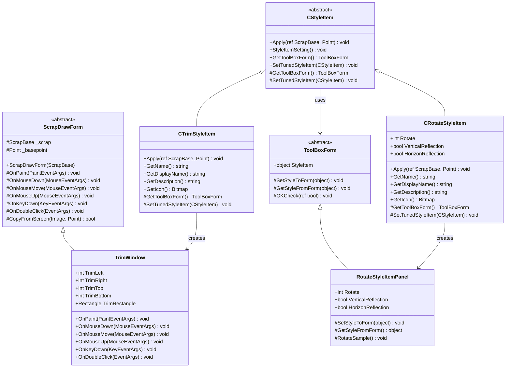
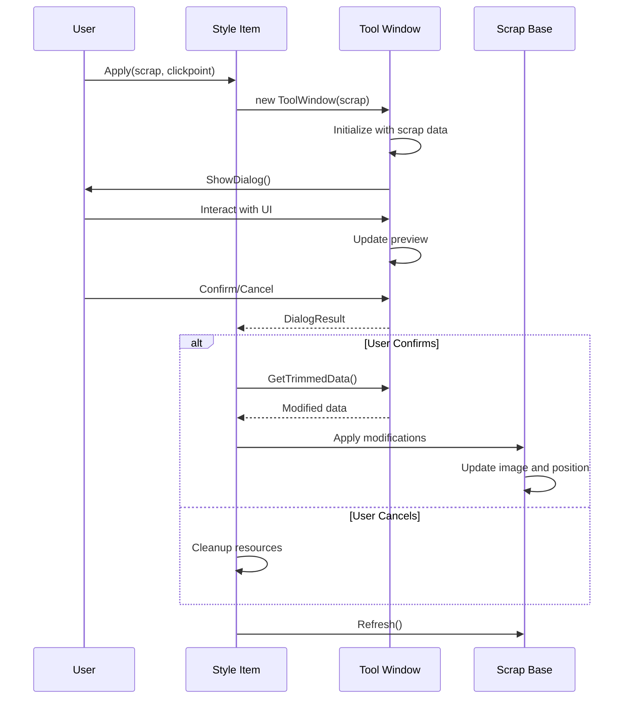

# Interactive Style Tools

<cite>
**Referenced Files in This Document**
- [CTrimStyleItem.cs](file://SETUNA/Main/StyleItems/CTrimStyleItem.cs)
- [TrimWindow.cs](file://SETUNA/Main/StyleItems/TrimWindow.cs)
- [CStyleItem.cs](file://SETUNA/Main/StyleItems/CStyleItem.cs)
- [IStyleItemPanel.cs](file://SETUNA/Main/StyleItems/IStyleItemPanel.cs)
- [ToolBoxForm.cs](file://SETUNA/Main/StyleItems/ToolBoxForm.cs)
- [NothingStyleItemPanel.cs](file://SETUNA/Main/StyleItems/NothingStyleItemPanel.cs)
- [RotateStyleItemPanel.cs](file://SETUNA/Main/StyleItems/RotateStyleItemPanel.cs)
- [CRotateStyleItem.cs](file://SETUNA/Main/StyleItems/CRotateStyleItem.cs)
- [ScrapDrawForm.cs](file://SETUNA/Main/StyleItems/ScrapDrawForm.cs)
- [BaseForm.cs](file://SETUNA/Main/Common/BaseForm.cs)
- [ScrapBase.cs](file://SETUNA/Main/ScrapBase.cs)
</cite>

## Table of Contents
1. [Introduction](#introduction)
2. [Architecture Overview](#architecture-overview)
3. [Core Components](#core-components)
4. [Interactive Tool Implementation](#interactive-tool-implementation)
5. [CTrimStyleItem Analysis](#ctrimstyleitem-analysis)
6. [CRotateStyleItem Analysis](#crotatestyleitem-analysis)
7. [ToolBoxForm Integration](#toolboxform-integration)
8. [Event Handling and State Management](#event-handling-and-state-management)
9. [UI Responsiveness and Disposal](#ui-responsiveness-and-disposal)
10. [Best Practices](#best-practices)
11. [Implementation Challenges](#implementation-challenges)
12. [Conclusion](#conclusion)

## Introduction

Interactive style tools in SETUNA provide users with dynamic, real-time editing capabilities for scrap images through modal dialog interfaces. These tools override the standard Apply() method to launch specialized UI elements that capture user input and modify scrap state accordingly. The system implements a sophisticated architecture combining base style items with specialized tool windows that provide immediate visual feedback during interaction.

The interactive tool system enables users to perform complex image manipulations such as trimming, rotating, scaling, and painting directly within the application workflow. Each tool maintains its own state and provides intuitive visual feedback while ensuring proper resource management and UI responsiveness.

## Architecture Overview

The interactive style tool architecture follows a hierarchical design pattern with clear separation of concerns between base functionality and specialized implementations.

**Diagram sources**
- [CStyleItem.cs](file://SETUNA/Main/StyleItems/CStyleItem.cs#L8-L101)
- [CTrimStyleItem.cs](file://SETUNA/Main/StyleItems/CTrimStyleItem.cs#L10-L71)
- [CRotateStyleItem.cs](file://SETUNA/Main/StyleItems/CRotateStyleItem.cs#L8-L116)
- [ScrapDrawForm.cs](file://SETUNA/Main/StyleItems/ScrapDrawForm.cs#L10-L147)
- [TrimWindow.cs](file://SETUNA/Main/StyleItems/TrimWindow.cs#L9-L406)
- [ToolBoxForm.cs](file://SETUNA/Main/StyleItems/ToolBoxForm.cs#L7-L64)
- [RotateStyleItemPanel.cs](file://SETUNA/Main/StyleItems/RotateStyleItemPanel.cs#L9-L156)

## Core Components

### CStyleItem Base Class

The CStyleItem abstract class serves as the foundation for all style items, providing the core interface and common functionality for interactive tools. It defines the essential methods that derived classes must implement while offering default implementations for shared behavior.

Key responsibilities include:
- Defining the Apply() method signature for style application
- Providing the StyleItemSetting() method for configuration dialogs
- Managing tool box form creation and lifecycle
- Handling state text display and termination conditions

### ScrapDrawForm Base Class

ScrapDrawForm extends BaseForm to provide specialized drawing capabilities for interactive tools. It manages screen capture, image rendering, and coordinate transformations necessary for precise user interaction.

Core features:
- Screen capture functionality for background images
- Coordinate system management with offset handling
- Double-buffered rendering for smooth visuals
- Event handling for mouse and keyboard input

### ToolBoxForm Infrastructure

ToolBoxForm provides the framework for configuration panels that allow users to customize style item parameters before applying them. It implements a standardized interface for form-based configuration with validation and state management.

**Section sources**
- [CStyleItem.cs](file://SETUNA/Main/StyleItems/CStyleItem.cs#L8-L101)
- [ScrapDrawForm.cs](file://SETUNA/Main/StyleItems/ScrapDrawForm.cs#L10-L147)
- [ToolBoxForm.cs](file://SETUNA/Main/StyleItems/ToolBoxForm.cs#L7-L64)

## Interactive Tool Implementation

Interactive style tools override the Apply() method to launch specialized UI elements rather than performing immediate modifications. This approach allows for real-time preview and user interaction before committing changes to the scrap state.

### Override Pattern

The Apply() method in interactive tools follows a specific pattern:

**Diagram sources**
- [CTrimStyleItem.cs](file://SETUNA/Main/StyleItems/CTrimStyleItem.cs#L13-L32)
- [TrimWindow.cs](file://SETUNA/Main/StyleItems/TrimWindow.cs#L12-L28)

### State Synchronization

Interactive tools maintain synchronization between the tool window and the underlying scrap state through careful event handling and property binding. Changes made in the tool window are immediately reflected in the preview while preserving the original scrap until the user confirms the changes.

**Section sources**
- [CTrimStyleItem.cs](file://SETUNA/Main/StyleItems/CTrimStyleItem.cs#L13-L32)
- [CStyleItem.cs](file://SETUNA/Main/StyleItems/CStyleItem.cs#L26-L33)

## CTrimStyleItem Analysis

CTrimStyleItem exemplifies the interactive tool pattern by providing image trimming functionality through the TrimWindow interface. It demonstrates the complete lifecycle from initialization to final application.

### Initialization and Setup

The Apply() method creates a TrimWindow instance and passes the current scrap as context. The clickpoint parameter is used to position the tool window appropriately relative to the user's interaction point.

### Temporary Visual Feedback

During interaction, TrimWindow provides immediate visual feedback through:
- Real-time selection rectangle updates
- Live preview of trimmed areas
- Dynamic cursor feedback for resize handles
- Keyboard navigation support for precise adjustments

### Coordinate System Management

TrimWindow manages a coordinate system that accounts for:
- Screen-to-client coordinate conversion
- Background image positioning with offset
- Selection rectangle calculations
- Boundary constraint enforcement

### Event Handling Implementation

The tool captures various input events:
- Mouse down for selection initiation
- Mouse move for live preview updates
- Mouse up for selection completion
- Keyboard events for fine-tuning
- Double-click for quick adjustments

**Section sources**
- [CTrimStyleItem.cs](file://SETUNA/Main/StyleItems/CTrimStyleItem.cs#L13-L32)
- [TrimWindow.cs](file://SETUNA/Main/StyleItems/TrimWindow.cs#L12-L406)

## CRotateStyleItem Analysis

CRotateStyleItem demonstrates configuration-based interactive tools that use ToolBoxForm for parameter setting. Unlike CTrimStyleItem, it doesn't require real-time preview during interaction.

### Configuration Panel Integration

CRotateStyleItem uses RotateStyleItemPanel to collect rotation and reflection parameters before applying them to the scrap. The panel provides:
- Radio button selection for rotation angles (0°, 90°, 180°, 270°)
- Checkbox options for horizontal and vertical reflections
- Live preview of the transformation effect
- Sample image demonstration

### State Persistence

The tool maintains configuration state through:
- Property-based storage of rotation and reflection settings
- Serialization of configuration to the style item
- Restoration of previous settings when reconfigured

### Transformation Application

The Apply() method performs the actual transformation using .NET's built-in RotateFlip functionality, ensuring high-quality image processing with minimal memory overhead.

**Section sources**
- [CRotateStyleItem.cs](file://SETUNA/Main/StyleItems/CRotateStyleItem.cs#L18-L65)
- [RotateStyleItemPanel.cs](file://SETUNA/Main/StyleItems/RotateStyleItemPanel.cs#L22-L84)

## ToolBoxForm Integration

ToolBoxForm provides a standardized framework for creating configuration panels that integrate seamlessly with the style item system.

### Interface Contract

IStyleItemPanel defines the contract for style item panels:
- SetStyleItem(): Configures the panel with current style item data
- GetStyleItem(): Retrieves updated style item configuration

### Form Lifecycle Management

ToolBoxForm manages the complete lifecycle of configuration dialogs:
- Initialization with style item data
- Validation and error checking
- State persistence on confirmation
- Resource cleanup on cancellation

### Validation and Error Handling

The framework includes built-in validation mechanisms:
- OKCheck() method for custom validation logic
- Automatic dialog result management
- Exception handling for invalid configurations

**Section sources**
- [IStyleItemPanel.cs](file://SETUNA/Main/StyleItems/IStyleItemPanel.cs#L4-L12)
- [ToolBoxForm.cs](file://SETUNA/Main/StyleItems/ToolBoxForm.cs#L7-L64)
- [NothingStyleItemPanel.cs](file://SETUNA/Main/StyleItems/NothingStyleItemPanel.cs#L4-L26)

## Event Handling and State Management

Interactive tools implement comprehensive event handling to provide responsive user interfaces and maintain state consistency.

### Mouse Event Coordination

Tools coordinate multiple mouse events:
- MouseDown for selection initiation and drag detection
- MouseMove for live updates and cursor feedback
- MouseUp for selection completion and finalization
- MouseDoubleClick for quick operations

### Keyboard Interaction Support

Keyboard events enable precise control:
- Arrow keys for incremental adjustments
- Escape key for cancellation
- Enter key for confirmation
- Tab navigation for form element focus

### State Synchronization Patterns

The system maintains state consistency through:
- Immediate property updates for live preview
- Batch updates for final application
- Undo capability through scrap state restoration
- Event-driven refresh mechanisms

**Section sources**
- [TrimWindow.cs](file://SETUNA/Main/StyleItems/TrimWindow.cs#L169-L352)
- [ScrapDrawForm.cs](file://SETUNA/Main/StyleItems/ScrapDrawForm.cs#L65-L71)

## UI Responsiveness and Disposal

Interactive tools implement careful resource management to ensure UI responsiveness and proper cleanup.

### Memory Management

The system employs several strategies for efficient memory usage:
- Using statements for automatic resource disposal
- Lazy loading of expensive resources
- Proper disposal of graphics objects and bitmaps
- Garbage collection optimization

### Thread Safety

UI operations are performed on the main thread to ensure:
- Consistent state updates
- Prevented race conditions
- Smooth animation and updates
- Proper event ordering

### Form Lifecycle Management

Proper form lifecycle management includes:
- Registration with FormManager for global tracking
- Automatic cleanup on form closure
- Resource disposal in destructors
- Exception handling for cleanup failures

**Section sources**
- [ScrapDrawForm.cs](file://SETUNA/Main/StyleItems/ScrapDrawForm.cs#L12-L18)
- [BaseForm.cs](file://SETUNA/Main/Common/BaseForm.cs#L3-L18)

## Best Practices

### Design Principles

Effective interactive style tools follow established design principles:

1. **Immediate Feedback**: Provide visual feedback for all user actions
2. **Intuitive Controls**: Use familiar interaction patterns
3. **Consistent Behavior**: Maintain predictable tool behavior
4. **Error Prevention**: Implement validation to prevent invalid states
5. **Resource Efficiency**: Minimize memory and CPU usage

### User Experience Guidelines

- **Clear Visual Indicators**: Use distinct colors and cursors for different interaction modes
- **Keyboard Accessibility**: Support keyboard navigation and shortcuts
- **Context Sensitivity**: Adapt tool behavior based on current context
- **Undo Capability**: Allow users to revert changes easily
- **Help Integration**: Provide contextual help and tooltips

### Implementation Standards

- **Interface Compliance**: Implement all required interfaces correctly
- **Exception Handling**: Handle exceptions gracefully with user-friendly messages
- **Code Organization**: Separate concerns into appropriate classes and methods
- **Documentation**: Document complex algorithms and state transitions
- **Testing**: Verify functionality across different scenarios and edge cases

## Implementation Challenges

### Maintaining UI Responsiveness

Interactive tools face challenges in maintaining responsive UI during intensive operations:

- **Long-running Operations**: Image processing can block the UI thread
- **Large Images**: High-resolution images require significant memory
- **Real-time Updates**: Frequent redraws can impact performance
- **Concurrent Access**: Multiple simultaneous interactions must be coordinated

### Handling Cancellation

Proper cancellation handling ensures data integrity:

- **Partial State**: Prevent saving partially completed operations
- **Resource Cleanup**: Dispose of temporary resources on cancellation
- **State Restoration**: Restore original state when cancelling
- **User Confirmation**: Warn users about unsaved changes

### Ensuring Proper Disposal

Resource leaks can occur in complex UI scenarios:

- **Graphics Objects**: Properly dispose of GDI+ objects
- **Memory Buffers**: Release large memory allocations
- **Event Handlers**: Unregister event handlers to prevent memory leaks
- **Form References**: Clean up form references and event subscriptions

### Cross-Platform Compatibility

While SETUNA targets Windows, considerations for broader compatibility include:

- **API Dependencies**: Minimize reliance on platform-specific APIs
- **File System Access**: Handle different file system characteristics
- **Display Scaling**: Account for different DPI settings
- **Input Devices**: Support various input device configurations

## Conclusion

The interactive style tool system in SETUNA demonstrates a sophisticated approach to providing dynamic image editing capabilities within a modal dialog framework. Through careful abstraction and separation of concerns, the system enables developers to create powerful interactive tools while maintaining code quality and user experience standards.

Key strengths of the architecture include:

- **Extensible Design**: Easy addition of new interactive tools
- **Consistent Interface**: Standardized patterns for tool implementation
- **Robust State Management**: Reliable handling of tool state and user interactions
- **Performance Optimization**: Efficient resource management and UI responsiveness
- **Error Resilience**: Comprehensive error handling and recovery mechanisms

The system successfully balances functionality with usability, providing users with powerful image editing capabilities while maintaining an intuitive and responsive interface. Future enhancements could include additional interactive tools, improved performance optimizations, and expanded customization options.