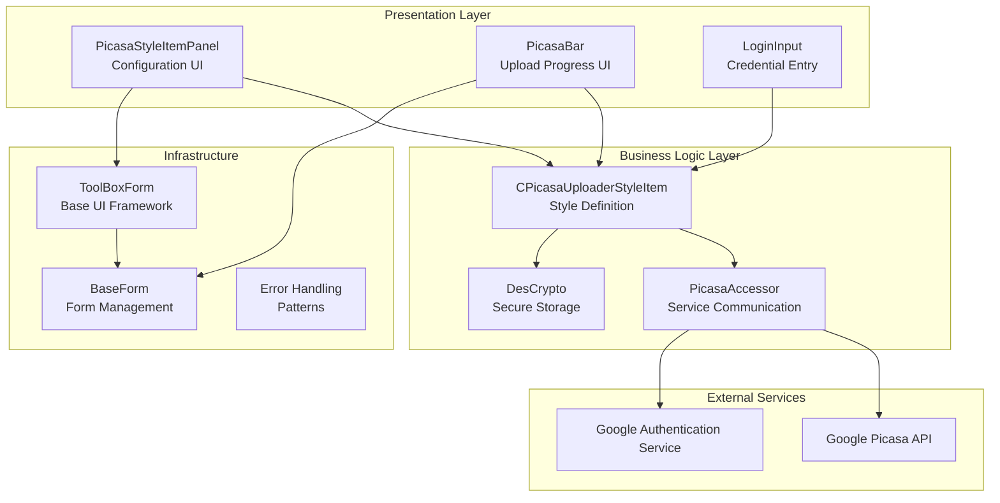
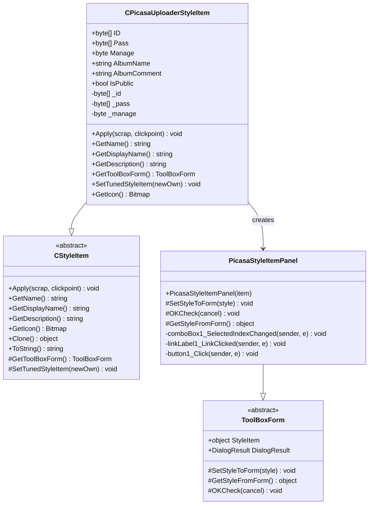
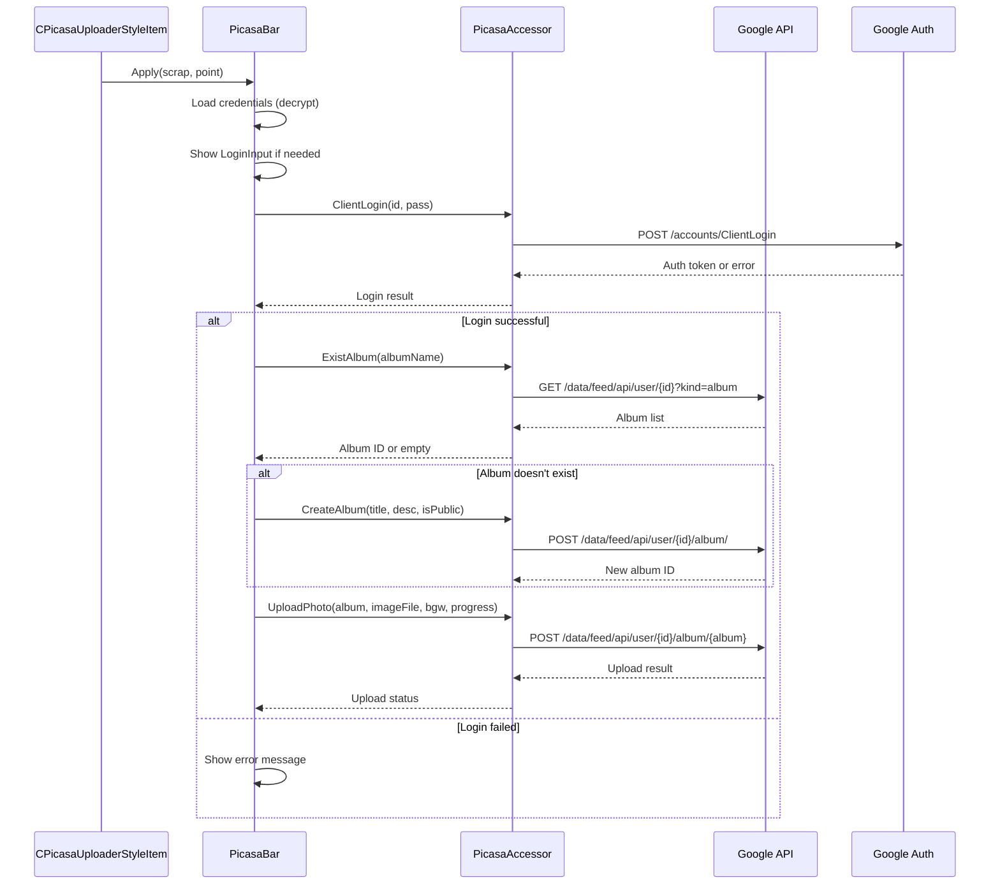
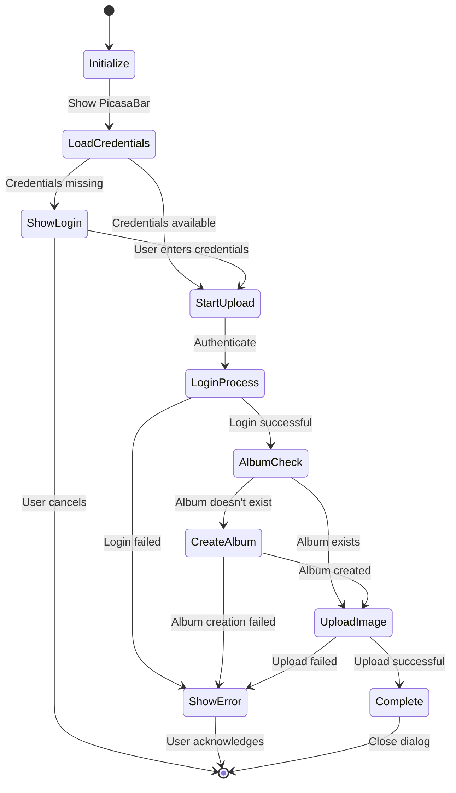
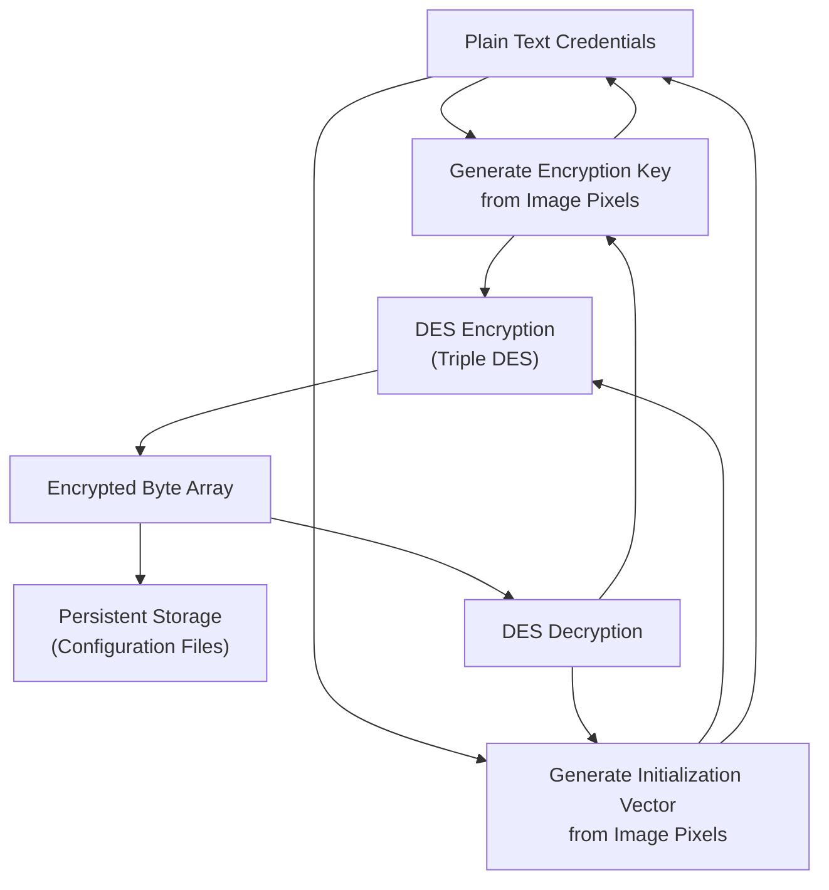
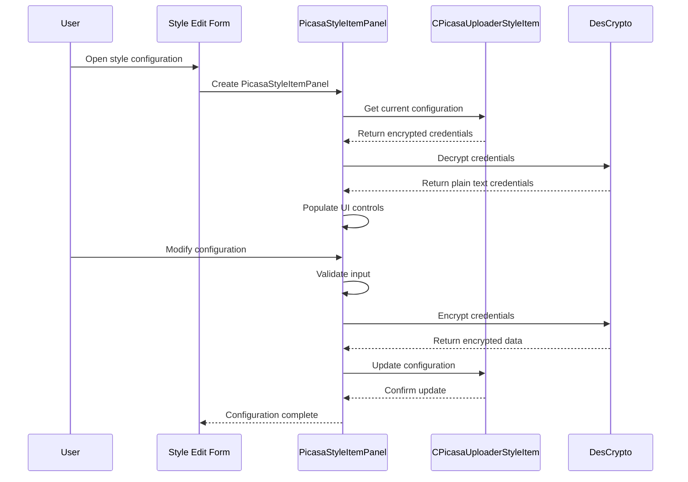
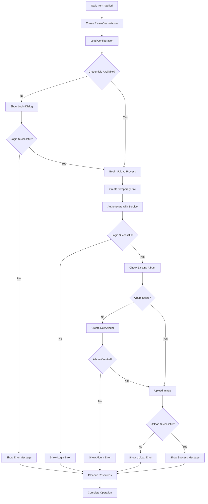
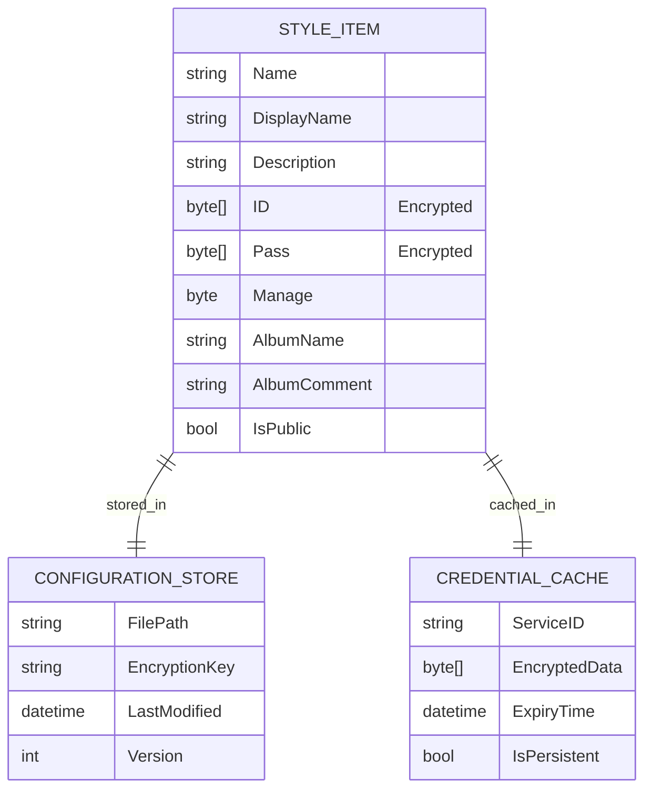

# Service Integration Styles

<cite>
**Referenced Files in This Document**
- [CPicasaUploaderStyleItem.cs](file://SETUNA/Main/StyleItems/CPicasaUploaderStyleItem.cs)
- [PicasaAccessor.cs](file://SETUNA/com/clearunit/PicasaAccessor.cs)
- [PicasaStyleItemPanel.cs](file://SETUNA/Main/StyleItems/PicasaStyleItemPanel.cs)
- [PicasaBar.cs](file://SETUNA/Main/StyleItems/PicasaBar.cs)
- [LoginInput.cs](file://SETUNA/Main/StyleItems/LoginInput.cs)
- [DesCrypto.cs](file://SETUNA/com/clearunit/DesCrypto.cs)
- [PicasaLoginError.cs](file://SETUNA/com/clearunit/PicasaLoginError.cs)
- [PicasaUploadError.cs](file://SETUNA/com/clearunit/PicasaUploadError.cs)
- [ToolBoxForm.cs](file://SETUNA/Main/StyleItems/ToolBoxForm.cs)
- [BaseForm.cs](file://SETUNA/Main/Common/BaseForm.cs)
- [CStyle.cs](file://SETUNA/Main/Style/CStyle.cs)
</cite>

## Table of Contents
1. [Introduction](#introduction)
2. [Architecture Overview](#architecture-overview)
3. [Core Components Analysis](#core-components-analysis)
4. [Security Implementation Patterns](#security-implementation-patterns)
5. [Service Integration Workflow](#service-integration-workflow)
6. [Error Handling and Recovery](#error-handling-and-recovery)
7. [Configuration Management](#configuration-management)
8. [Implementation Guidelines](#implementation-guidelines)
9. [Best Practices and Considerations](#best-practices-and-considerations)
10. [Troubleshooting Guide](#troubleshooting-guide)

## Introduction

Service Integration Styles represent a sophisticated architectural pattern within the SETUNA screenshot management application that enables seamless integration with external services while maintaining security, configurability, and extensibility. The CPicasaUploaderStyleItem serves as the primary exemplar, demonstrating how third-party service integrations can be encapsulated within a unified framework that handles authentication, configuration, secure data storage, and user interface presentation.

This documentation explores the comprehensive implementation of service integration styles, focusing on the CPicasaUploaderStyleItem as a representative example. The pattern demonstrates how external service connectivity can be abstracted into reusable, configurable components that provide consistent user experiences while handling the complexities of authentication, error management, and data persistence.

## Architecture Overview

The service integration architecture follows a layered approach that separates concerns between user interface presentation, business logic, and external service communication. The system is built around several key architectural principles:



**Diagram sources**
- [CPicasaUploaderStyleItem.cs](file://SETUNA/Main/StyleItems/CPicasaUploaderStyleItem.cs#L8-L147)
- [PicasaAccessor.cs](file://SETUNA/com/clearunit/PicasaAccessor.cs#L12-L375)
- [PicasaStyleItemPanel.cs](file://SETUNA/Main/StyleItems/PicasaStyleItemPanel.cs#L8-L112)
- [PicasaBar.cs](file://SETUNA/Main/StyleItems/PicasaBar.cs#L12-L346)

The architecture implements several critical design patterns:

- **Strategy Pattern**: Different service integrations can be plugged in through the same interface
- **Template Method Pattern**: Common workflows are defined in base classes with service-specific implementations
- **Factory Pattern**: Style items are instantiated through a standardized process
- **Observer Pattern**: Progress updates and error notifications are propagated through event handlers

## Core Components Analysis

### CPicasaUploaderStyleItem

The CPicasaUploaderStyleItem represents the central orchestrator for Picasa service integration, encapsulating all service-specific configuration and providing the primary interface for user interaction.



**Diagram sources**
- [CPicasaUploaderStyleItem.cs](file://SETUNA/Main/StyleItems/CPicasaUploaderStyleItem.cs#L8-L147)
- [ToolBoxForm.cs](file://SETUNA/Main/StyleItems/ToolBoxForm.cs#L7-L64)

The style item manages several critical aspects:

**Authentication Credentials Management**: Credentials are stored as encrypted byte arrays using the DES encryption algorithm, providing a secure mechanism for persisting sensitive information without exposing plain-text passwords.

**Service Configuration**: The style item encapsulates album settings including name, description, privacy settings, and management modes that control credential persistence behavior.

**UI Integration**: The Apply() method instantiates and displays the PicasaBar UI component, positioning it appropriately relative to the captured screenshot for optimal user experience.

**Section sources**
- [CPicasaUploaderStyleItem.cs](file://SETUNA/Main/StyleItems/CPicasaUploaderStyleItem.cs#L78-L96)
- [CPicasaUploaderStyleItem.cs](file://SETUNA/Main/StyleItems/CPicasaUploaderStyleItem.cs#L116-L129)

### PicasaAccessor

The PicasaAccessor serves as the primary service communication layer, implementing the Google Picasa API integration with comprehensive error handling and authentication management.



**Diagram sources**
- [PicasaAccessor.cs](file://SETUNA/com/clearunit/PicasaAccessor.cs#L38-L159)
- [PicasaBar.cs](file://SETUNA/Main/StyleItems/PicasaBar.cs#L138-L241)

The accessor implements comprehensive service communication with robust error handling:

**Authentication Flow**: Implements Google's ClientLogin protocol for obtaining authentication tokens, handling various authentication failure scenarios including bad credentials, account verification requirements, and service availability issues.

**Album Management**: Provides functionality for checking existing albums, creating new albums with proper metadata, and handling album creation errors.

**Image Upload**: Implements chunked upload with progress reporting, handling various HTTP status codes and providing meaningful error messages for different failure scenarios.

**Section sources**
- [PicasaAccessor.cs](file://SETUNA/com/clearunit/PicasaAccessor.cs#L38-L159)
- [PicasaAccessor.cs](file://SETUNA/com/clearunit/PicasaAccessor.cs#L162-L228)
- [PicasaAccessor.cs](file://SETUNA/com/clearunit/PicasaAccessor.cs#L274-L359)

### PicasaBar

The PicasaBar represents the service-specific UI component that handles the complete upload workflow, from credential management to progress reporting and error handling.



**Diagram sources**
- [PicasaBar.cs](file://SETUNA/Main/StyleItems/PicasaBar.cs#L280-L315)
- [PicasaBar.cs](file://SETUNA/Main/StyleItems/PicasaBar.cs#L138-L241)

The PicasaBar implements a sophisticated workflow with multiple stages:

**Credential Management**: Handles both cached credentials and interactive credential entry through the LoginInput dialog.

**Background Processing**: Utilizes BackgroundWorker for asynchronous operations, ensuring UI responsiveness during network operations.

**Progress Reporting**: Provides real-time progress updates through the BackgroundWorker's progress reporting mechanism.

**Error Recovery**: Implements comprehensive error handling with user-friendly error messages and graceful degradation.

**Section sources**
- [PicasaBar.cs](file://SETUNA/Main/StyleItems/PicasaBar.cs#L280-L315)
- [PicasaBar.cs](file://SETUNA/Main/StyleItems/PicasaBar.cs#L138-L241)

## Security Implementation Patterns

### Credential Encryption and Storage

The system implements a multi-layered security approach for managing sensitive authentication data:



**Diagram sources**
- [DesCrypto.cs](file://SETUNA/com/clearunit/DesCrypto.cs#L11-L18)
- [PicasaBar.cs](file://SETUNA/Main/StyleItems/PicasaBar.cs#L69-L116)

**Encryption Implementation**: The system uses Triple DES encryption with keys and initialization vectors derived from pixel data within embedded images, providing strong cryptographic protection without requiring external key management infrastructure.

**Memory Protection**: Sensitive data is cleared from memory immediately after use, and temporary files containing uploaded images are automatically deleted after processing.

**Configuration Isolation**: Credentials are stored separately from other configuration data, reducing exposure risk and enabling granular access controls.

**Section sources**
- [DesCrypto.cs](file://SETUNA/com/clearunit/DesCrypto.cs#L11-L63)
- [PicasaBar.cs](file://SETUNA/Main/StyleItems/PicasaBar.cs#L118-L129)

### Secure Communication Patterns

The service integration implements several security best practices for external communications:

**HTTPS Enforcement**: All communications with Google services use HTTPS to prevent man-in-the-middle attacks and ensure data confidentiality.

**Authentication Token Management**: Short-lived authentication tokens are used instead of storing long-term credentials, reducing the impact of credential compromise.

**Rate Limiting Compliance**: The system implements appropriate delays between requests to respect service rate limits and avoid service disruption.

**Error Information Sanitization**: Error messages are sanitized to prevent information disclosure while still providing useful diagnostic information to users.

## Service Integration Workflow

### Configuration Panel Integration

The configuration workflow demonstrates how service integration styles seamlessly integrate with the application's style editing system:



**Diagram sources**
- [PicasaStyleItemPanel.cs](file://SETUNA/Main/StyleItems/PicasaStyleItemPanel.cs#L21-L74)

The configuration panel implements several key features:

**Dynamic UI Control Management**: The panel dynamically enables/disables credential fields based on the selected management mode, providing intuitive user experience.

**Validation Logic**: Comprehensive input validation ensures that required fields are populated according to the selected management strategy.

**State Persistence**: Configuration changes are immediately reflected in the style item, ensuring consistency between the UI and underlying data model.

**Section sources**
- [PicasaStyleItemPanel.cs](file://SETUNA/Main/StyleItems/PicasaStyleItemPanel.cs#L21-L74)

### Service Operation Workflow

The service operation workflow illustrates the complete lifecycle of a service integration request:



**Diagram sources**
- [PicasaBar.cs](file://SETUNA/Main/StyleItems/PicasaBar.cs#L138-L241)

The workflow ensures robust handling of various operational scenarios:

**Asynchronous Processing**: All network operations are performed asynchronously to maintain UI responsiveness and provide progress feedback.

**Resource Management**: Temporary resources are properly managed and cleaned up regardless of operation outcome.

**User Feedback**: Comprehensive progress reporting and error messaging ensure users understand the operation status.

**Graceful Degradation**: The system gracefully handles various failure scenarios while providing meaningful feedback to users.

## Error Handling and Recovery

### Error Classification System

The system implements a comprehensive error classification system that enables targeted error handling and user feedback:

| Error Category | Specific Types | Handling Strategy |
|----------------|----------------|-------------------|
| **Authentication Errors** | BadAuthentication, NotVerified, CaptchaRequired, AccountDeleted, AccountDisabled, TermsNotAgreed, ServiceDisabled, ServiceUnavailable, ConnectionError | Credential re-entry, service availability checks |
| **Upload Errors** | BadRequest, Unauthorized, Forbidden, NotFound, Conflict, InternalServerError, Unknown | Retry logic, user notification, fallback options |
| **Network Errors** | Connection timeouts, DNS resolution failures, SSL/TLS errors | Network diagnostics, retry with exponential backoff |
| **Configuration Errors** | Invalid album names, permission issues, quota exceeded | User guidance, configuration validation |

**Section sources**
- [PicasaLoginError.cs](file://SETUNA/com/clearunit/PicasaLoginError.cs#L4-L29)
- [PicasaUploadError.cs](file://SETUNA/com/clearunit/PicasaUploadError.cs#L4-L23)

### Error Recovery Mechanisms

The system implements multiple layers of error recovery to ensure robust operation:

**Automatic Retry Logic**: Network failures trigger automatic retry attempts with exponential backoff to handle transient issues.

**User Intervention Points**: Critical errors that require user action provide clear guidance on next steps and alternative approaches.

**Graceful Degradation**: When service features are unavailable, the system continues operating with reduced functionality rather than failing completely.

**Logging and Diagnostics**: Comprehensive logging captures error details for debugging while protecting sensitive information.

**Section sources**
- [PicasaBar.cs](file://SETUNA/Main/StyleItems/PicasaBar.cs#L158-L179)
- [PicasaBar.cs](file://SETUNA/Main/StyleItems/PicasaBar.cs#L203-L222)

## Configuration Management

### Persistent Storage Patterns

The configuration management system implements secure, efficient storage of service integration settings:



**Diagram sources**
- [CPicasaUploaderStyleItem.cs](file://SETUNA/Main/StyleItems/CPicasaUploaderStyleItem.cs#L47-L60)

The configuration system provides several key capabilities:

**Selective Persistence**: Credentials can be configured for different persistence levels (always, session only, never), giving users control over security vs. convenience trade-offs.

**Atomic Updates**: Configuration changes are applied atomically to prevent corruption and ensure consistency.

**Migration Support**: The system supports configuration migration between versions while preserving user preferences and security settings.

**Backup and Restore**: Configuration data can be exported and imported, enabling user backup and system migration scenarios.

**Section sources**
- [PicasaStyleItemPanel.cs](file://SETUNA/Main/StyleItems/PicasaStyleItemPanel.cs#L61-L74)

### Runtime Configuration Management

During runtime, the system maintains configuration state with minimal overhead:

**Lazy Loading**: Configuration data is loaded only when needed, reducing startup time and memory usage.

**Change Detection**: The system monitors configuration changes and applies updates to running instances immediately.

**Validation**: Runtime configuration validation ensures that settings remain valid even after external modifications.

**Section sources**
- [PicasaStyleItemPanel.cs](file://SETUNA/Main/StyleItems/PicasaStyleItemPanel.cs#L23-L38)

## Implementation Guidelines

### Creating New Service Integrations

To implement new service integrations following the established patterns:

**Step 1: Define the Style Item Class**

Create a new class inheriting from CStyleItem that encapsulates the service-specific configuration and behavior:

```csharp
// Example template for new service integration
public class CNewServiceStyleItem : CStyleItem
{
    // Service-specific properties
    public string ServiceEndpoint { get; set; }
    public byte[] ApiKey { get; set; }
    public bool EnableCompression { get; set; }
    
    // Override required methods
    public override void Apply(ref ScrapBase scrap, Point clickpoint)
    {
        // Instantiate and show service-specific UI
    }
    
    protected override ToolBoxForm GetToolBoxForm()
    {
        return new NewServiceStyleItemPanel(this);
    }
}
```

**Step 2: Implement Configuration Panel**

Create a configuration panel that inherits from ToolBoxForm to provide user interface for service configuration:

```csharp
// Configuration panel template
internal partial class NewServiceStyleItemPanel : ToolBoxForm
{
    protected override void SetStyleToForm(object style)
    {
        // Populate UI from style item
    }
    
    protected override object GetStyleFromForm()
    {
        // Extract configuration from UI to style item
    }
    
    protected override void OKCheck(ref bool cancel)
    {
        // Validate configuration
    }
}
```

**Step 3: Implement Service Accessor**

Create a service accessor class that handles all external service communication:

```csharp
// Service accessor template
internal class NewServiceAccessor
{
    public bool Authenticate(string apiKey)
    {
        // Implement authentication logic
    }
    
    public bool UploadFile(string filePath)
    {
        // Implement upload logic
    }
    
    // Define appropriate error enums and properties
}
```

**Step 4: Implement Security Measures**

Ensure proper security implementation using established patterns:

- Use the same DES encryption for credential storage
- Implement proper resource cleanup and memory management
- Follow HTTPS enforcement guidelines
- Implement comprehensive error handling

### OAuth Considerations

For services requiring OAuth authentication:

**Authorization Code Flow**: Implement the standard OAuth 2.0 authorization code flow with PKCE for enhanced security.

**Token Refresh**: Implement automatic token refresh mechanisms to handle expired access tokens.

**Scope Management**: Request only necessary permissions to minimize security risks.

**State Parameter**: Use state parameters to prevent CSRF attacks during authorization.

### Rate Limiting and Throttling

Implement appropriate rate limiting to respect service quotas:

**Request Throttling**: Implement exponential backoff for rate-limited requests.

**Queue Management**: Use request queues to manage concurrent operations within service limits.

**Circuit Breaker Pattern**: Implement circuit breaker logic to handle service unavailability gracefully.

**Quota Monitoring**: Monitor service quota usage and provide user warnings when approaching limits.

## Best Practices and Considerations

### Cross-Thread UI Access

The system implements several patterns to handle cross-thread UI operations safely:

**Background Worker Usage**: All network operations are performed on background threads, with progress updates marshaled back to the UI thread.

**Synchronization Primitives**: Proper synchronization ensures thread-safe access to shared resources.

**Exception Handling**: UI operations are wrapped in try-catch blocks to prevent unhandled exceptions from crashing the application.

**Resource Disposal**: Proper resource disposal patterns ensure that UI resources are released promptly.

### Service API Version Compatibility

Maintaining compatibility with evolving service APIs:

**Interface Abstraction**: Service accessors abstract API differences, making version updates easier.

**Feature Detection**: Implement feature detection to adapt to different API versions.

**Graceful Degradation**: Older API versions receive reduced functionality rather than failing completely.

**Testing Strategy**: Comprehensive testing ensures compatibility across supported API versions.

### Performance Optimization

Several optimization strategies improve service integration performance:

**Connection Pooling**: Reuse HTTP connections to reduce connection establishment overhead.

**Compression**: Enable compression for network traffic when supported by the service.

**Caching**: Implement intelligent caching for frequently accessed data.

**Lazy Loading**: Load service-specific resources only when needed.

## Troubleshooting Guide

### Common Issues and Solutions

**Authentication Failures**

*Symptom*: Login attempts consistently fail with authentication errors
*Diagnosis*: Check network connectivity, verify credential format, examine error logs
*Solution*: Verify credentials manually, check service availability, review firewall settings

**Upload Timeout Issues**

*Symptom*: Upload operations hang or timeout for large files
*Diagnosis*: Monitor network bandwidth, check service quotas, examine error codes
*Solution*: Implement chunked uploads, increase timeout values, optimize file compression

**Configuration Corruption**

*Symptom*: Service integration stops working after application restart
*Diagnosis*: Examine configuration file integrity, check encryption/decryption processes
*Solution*: Reset configuration to defaults, verify encryption key validity

**Memory Leaks**

*Symptom*: Application memory usage increases over time
*Diagnosis*: Monitor resource allocation, check for undisposed objects
*Solution*: Review disposal patterns, implement proper cleanup in finally blocks

### Debugging Techniques

**Logging Enhancement**: Enable detailed logging for service operations to capture timing and error information.

**Network Monitoring**: Use network monitoring tools to observe service communication patterns.

**Memory Profiling**: Employ memory profiling tools to identify resource leaks and excessive memory usage.

**Unit Testing**: Implement comprehensive unit tests for service integration components to isolate issues.

**Section sources**
- [PicasaBar.cs](file://SETUNA/Main/StyleItems/PicasaBar.cs#L228-L232)
- [PicasaAccessor.cs](file://SETUNA/com/clearunit/PicasaAccessor.cs#L70-L77)

### Recovery Procedures

**Configuration Reset**: Provide users with the ability to reset service configurations to default values.

**Credential Reset**: Implement secure credential reset procedures that don't expose sensitive data.

**Service Health Checks**: Include health check functionality to verify service accessibility and authentication status.

**Backup and Restore**: Offer configuration backup and restore capabilities to recover from corruption or misconfiguration.

The service integration style pattern demonstrated by CPicasaUploaderStyleItem provides a robust, secure, and extensible foundation for integrating external services into desktop applications. By following the established patterns and best practices outlined in this documentation, developers can create reliable service integrations that provide excellent user experiences while maintaining security and performance standards.