# Simple Transformation Styles

<cite>
**Referenced Files in This Document**
- [CStyleItem.cs](file://SETUNA/Main/StyleItems/CStyleItem.cs)
- [COpacityStyleItem.cs](file://SETUNA/Main/StyleItems/COpacityStyleItem.cs)
- [CScaleStyleItem.cs](file://SETUNA/Main/StyleItems/CScaleStyleItem.cs)
- [StyleItemDictionary.cs](file://SETUNA/Main/StyleItems/StyleItemDictionary.cs)
- [OpacityStyleItemPanel.cs](file://SETUNA/Main/StyleItems/OpacityStyleItemPanel.cs)
- [ScaleStyleItemPanel.cs](file://SETUNA/Main/StyleItems/ScaleStyleItemPanel.cs)
- [ToolBoxForm.cs](file://SETUNA/Main/StyleItems/ToolBoxForm.cs)
- [IStyleItemPanel.cs](file://SETUNA/Main/StyleItems/IStyleItemPanel.cs)
- [CImageStyleItem.cs](file://SETUNA/Main/StyleItems/CImageStyleItem.cs)
- [ScrapBase.cs](file://SETUNA/Main/ScrapBase.cs)
</cite>

## Table of Contents
1. [Introduction](#introduction)
2. [Architecture Overview](#architecture-overview)
3. [Core Transformation Classes](#core-transformation-classes)
4. [Property Validation and State Management](#property-validation-and-state-management)
5. [UI Integration and Panels](#ui-integration-and-panels)
6. [Style Discovery and Registration](#style-discovery-and-registration)
7. [Thread Safety and Performance](#thread-safety-and-performance)
8. [Implementation Patterns](#implementation-patterns)
9. [Common Issues and Solutions](#common-issues-and-solutions)
10. [Best Practices](#best-practices)

## Introduction

Simple transformation styles in SETUNA provide fundamental image manipulation capabilities through opacity adjustment and scaling operations. These styles extend the base `CStyleItem` class and demonstrate the framework's approach to implementing straightforward, direct image transformations without requiring user interaction. The two primary transformation styles covered are `COpacityStyleItem` for transparency control and `CScaleStyleItem` for image resizing.

These styles exemplify the framework's pattern for creating reusable, configurable image processing components that can be combined and applied to screenshots through the style system. They showcase essential concepts including property validation, state reflection, thread-safe UI updates, and seamless integration with the broader style management infrastructure.

## Architecture Overview

The simple transformation styles follow a hierarchical class structure that demonstrates the framework's extensibility and modularity:

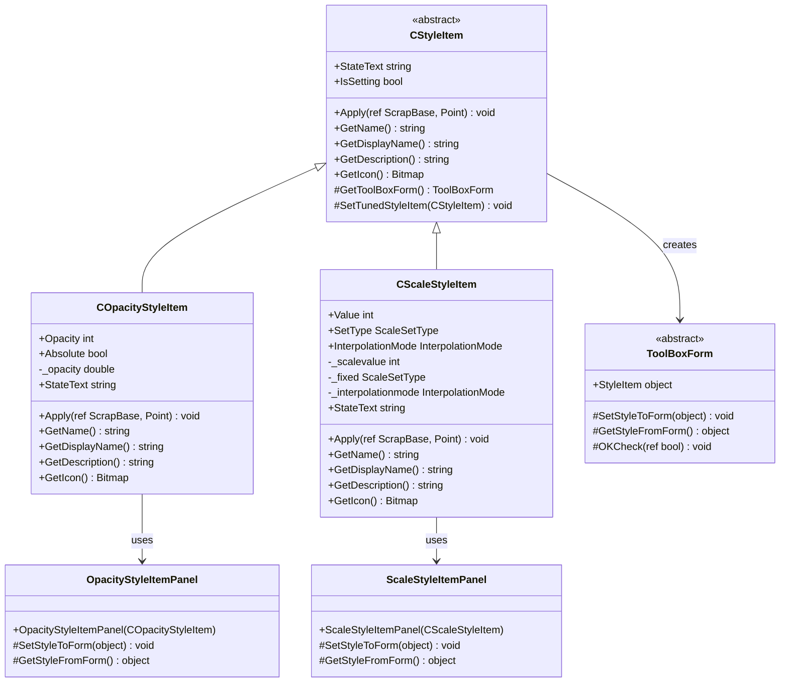

**Diagram sources**
- [CStyleItem.cs](file://SETUNA/Main/StyleItems/CStyleItem.cs#L8-L98)
- [COpacityStyleItem.cs](file://SETUNA/Main/StyleItems/COpacityStyleItem.cs#L8-L121)
- [CScaleStyleItem.cs](file://SETUNA/Main/StyleItems/CScaleStyleItem.cs#L9-L208)
- [ToolBoxForm.cs](file://SETUNA/Main/StyleItems/ToolBoxForm.cs#L7-L63)

**Section sources**
- [CStyleItem.cs](file://SETUNA/Main/StyleItems/CStyleItem.cs#L1-L101)
- [COpacityStyleItem.cs](file://SETUNA/Main/StyleItems/COpacityStyleItem.cs#L1-L124)
- [CScaleStyleItem.cs](file://SETUNA/Main/StyleItems/CScaleStyleItem.cs#L1-L211)

## Core Transformation Classes

### COpacityStyleItem Implementation

The `COpacityStyleItem` class demonstrates the pattern for implementing opacity-based transformations. It provides both absolute and relative opacity adjustment modes:

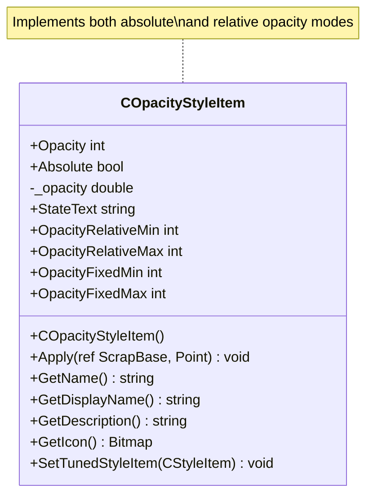

**Diagram sources**
- [COpacityStyleItem.cs](file://SETUNA/Main/StyleItems/COpacityStyleItem.cs#L8-L121)

The opacity property uses a clever conversion mechanism where the public `Opacity` property exposes a percentage value (0-100), while internally storing a normalized double value (0.0-1.0). This design pattern ensures intuitive user interaction while maintaining precision in calculations.

### CScaleStyleItem Implementation

The `CScaleStyleItem` class showcases scaling with interpolation mode support:

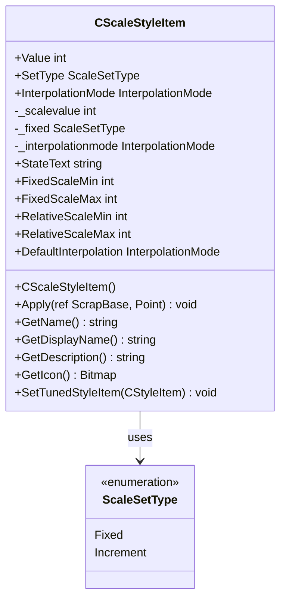

**Diagram sources**
- [CScaleStyleItem.cs](file://SETUNA/Main/StyleItems/CScaleStyleItem.cs#L9-L208)

**Section sources**
- [COpacityStyleItem.cs](file://SETUNA/Main/StyleItems/COpacityStyleItem.cs#L1-L124)
- [CScaleStyleItem.cs](file://SETUNA/Main/StyleItems/CScaleStyleItem.cs#L1-L211)

## Property Validation and State Management

### Basic Numeric Property Pattern

Both transformation styles demonstrate the framework's approach to property validation through basic numeric properties:

| Property | Type | Validation Range | Purpose |
|----------|------|------------------|---------|
| Opacity | int | 1-100 (Fixed), -99 to 99 (Relative) | Controls transparency level |
| Scale Value | int | 10-200 (Fixed), -190 to 190 (Relative) | Controls image scaling |
| Interpolation Mode | InterpolationMode | Various quality levels | Determines scaling quality |

### StateText Property Implementation

The `StateText` property provides dynamic state representation for UI display:

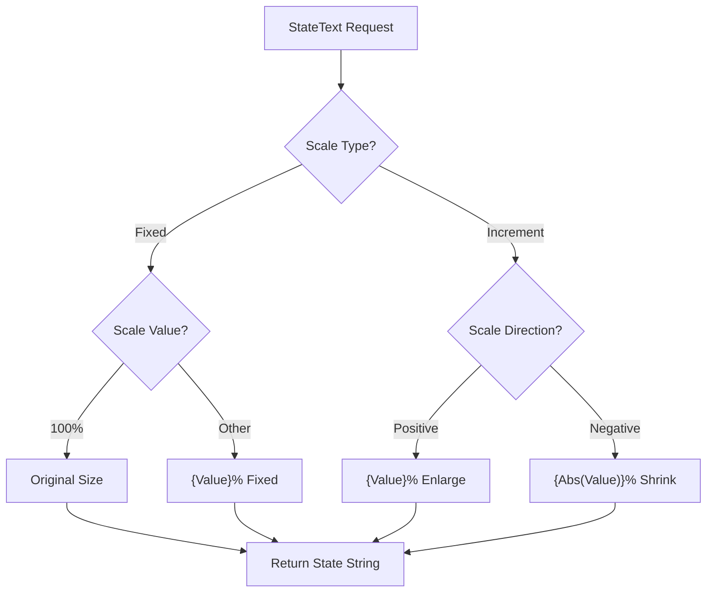

**Diagram sources**
- [CScaleStyleItem.cs](file://SETUNA/Main/StyleItems/CScaleStyleItem.cs#L133-L162)

### Property Setter Validation

The framework implements robust validation through property setters and Apply method logic:

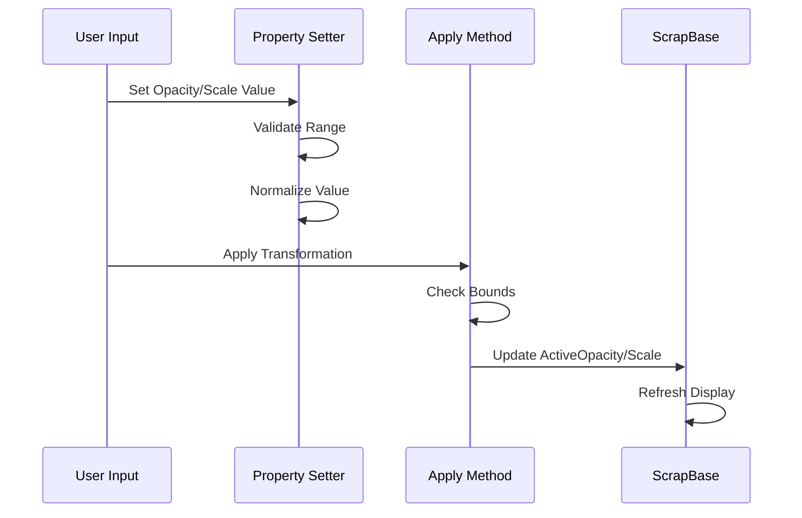

**Diagram sources**
- [COpacityStyleItem.cs](file://SETUNA/Main/StyleItems/COpacityStyleItem.cs#L26-L58)
- [CScaleStyleItem.cs](file://SETUNA/Main/StyleItems/CScaleStyleItem.cs#L73-L114)

**Section sources**
- [COpacityStyleItem.cs](file://SETUNA/Main/StyleItems/COpacityStyleItem.cs#L17-L45)
- [CScaleStyleItem.cs](file://SETUNA/Main/StyleItems/CScaleStyleItem.cs#L18-L52)

## UI Integration and Panels

### ToolBoxForm Architecture

The transformation styles integrate with the UI through the `ToolBoxForm` pattern, which provides standardized configuration interfaces:

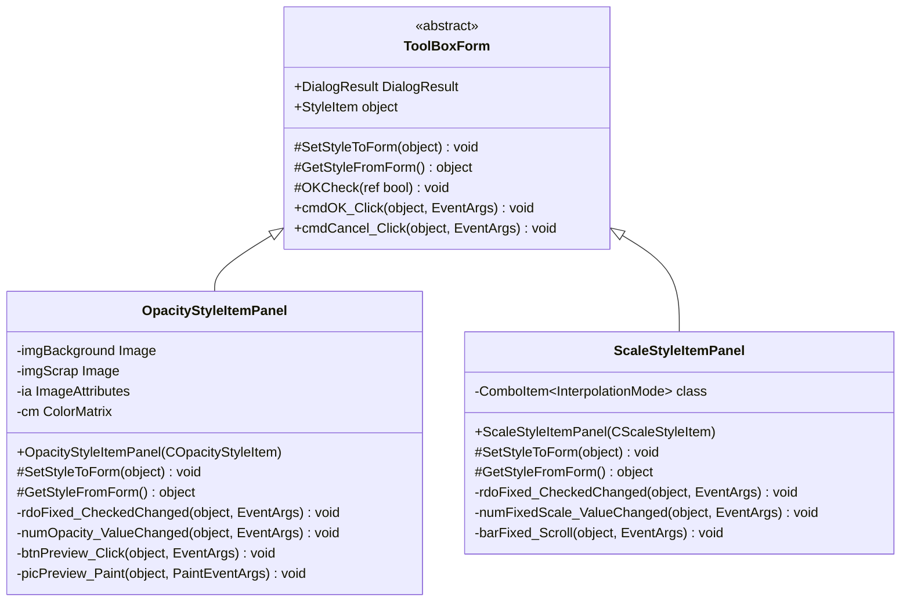

**Diagram sources**
- [ToolBoxForm.cs](file://SETUNA/Main/StyleItems/ToolBoxForm.cs#L7-L63)
- [OpacityStyleItemPanel.cs](file://SETUNA/Main/StyleItems/OpacityStyleItemPanel.cs#L9-L218)
- [ScaleStyleItemPanel.cs](file://SETUNA/Main/StyleItems/ScaleStyleItemPanel.cs#L7-L153)

### Real-time Preview System

The opacity panel implements a sophisticated real-time preview system using `ImageAttributes` and `ColorMatrix`:

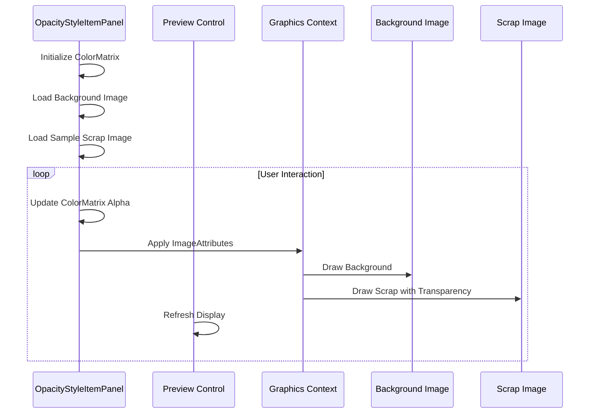

**Diagram sources**
- [OpacityStyleItemPanel.cs](file://SETUNA/Main/StyleItems/OpacityStyleItemPanel.cs#L170-L180)

**Section sources**
- [OpacityStyleItemPanel.cs](file://SETUNA/Main/StyleItems/OpacityStyleItemPanel.cs#L1-L218)
- [ScaleStyleItemPanel.cs](file://SETUNA/Main/StyleItems/ScaleStyleItemPanel.cs#L1-L153)

## Style Discovery and Registration

### StyleItemDictionary Integration

The transformation styles are automatically discovered and registered through the `StyleItemDictionary` system:

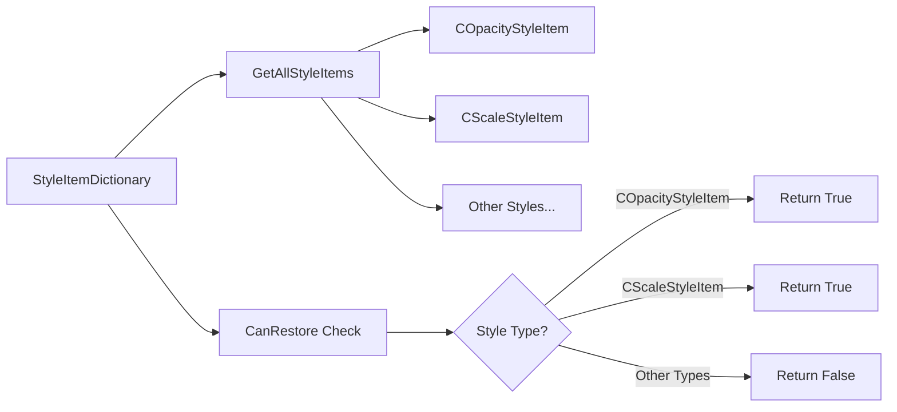

**Diagram sources**
- [StyleItemDictionary.cs](file://SETUNA/Main/StyleItems/StyleItemDictionary.cs#L15-L83)

### Registration Pattern

The framework follows a centralized registration pattern where all style items are enumerated in the `GetAllStyleItems` method:

| Style Class | Registration Index | Persistence Support |
|-------------|-------------------|-------------------|
| COpacityStyleItem | 4 | ✓ |
| CScaleStyleItem | 2 | ✓ |
| CMarginStyleItem | 3 | ✓ |
| CRotateStyleItem | 6 | ✓ |
| CCompactStyleItem | 13 | ✓ |

**Section sources**
- [StyleItemDictionary.cs](file://SETUNA/Main/StyleItems/StyleItemDictionary.cs#L15-L83)

## Thread Safety and Performance

### Thread-Safe UI Updates

The framework implements several patterns to ensure thread-safe UI updates during transformations:

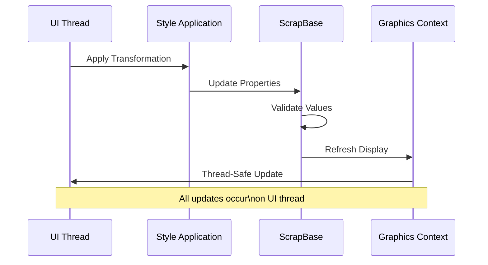

### Performance Optimization Strategies

1. **Lazy Initialization**: Images and graphics resources are initialized only when needed
2. **Resource Management**: Proper disposal of graphics objects and images
3. **Batch Updates**: Multiple property changes are batched to minimize refresh cycles
4. **Validation Caching**: Property validation results are cached to avoid redundant calculations

### Memory Management

The framework implements careful memory management for transformation operations:

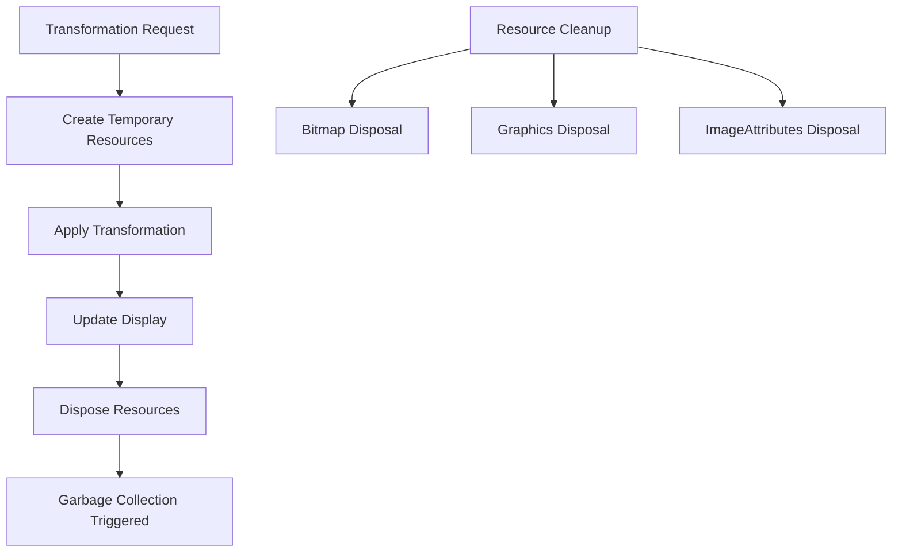

**Diagram sources**
- [OpacityStyleItemPanel.cs](file://SETUNA/Main/StyleItems/OpacityStyleItemPanel.cs#L183-L196)

**Section sources**
- [OpacityStyleItemPanel.cs](file://SETUNA/Main/StyleItems/OpacityStyleItemPanel.cs#L183-L196)

## Implementation Patterns

### Base Class Override Pattern

Both transformation styles follow the same implementation pattern when extending `CStyleItem`:

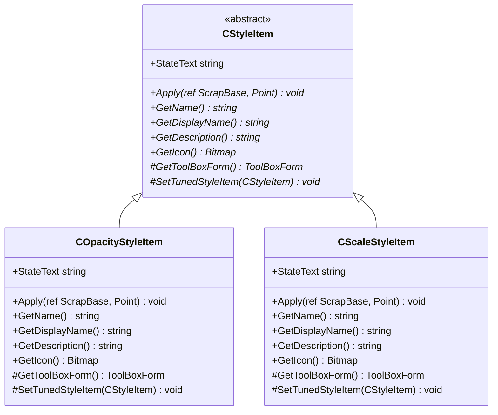

### Property Binding Pattern

The framework uses a consistent property binding pattern for UI synchronization:

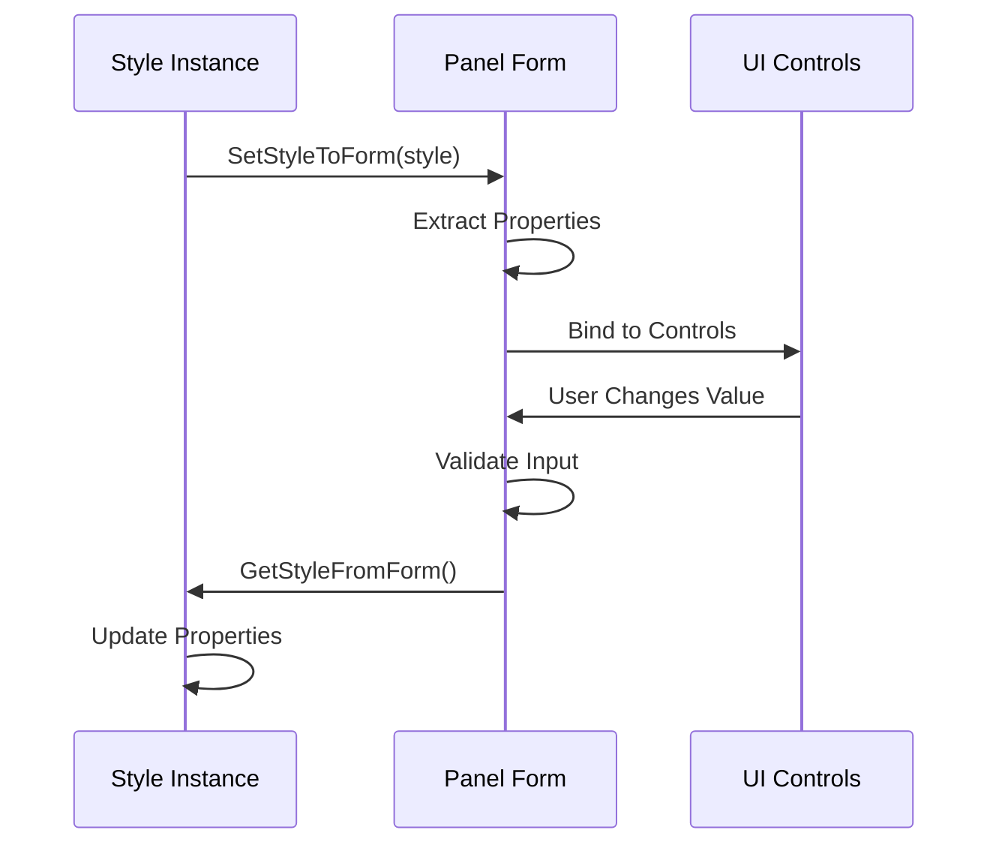

**Diagram sources**
- [OpacityStyleItemPanel.cs](file://SETUNA/Main/StyleItems/OpacityStyleItemPanel.cs#L22-L85)
- [ScaleStyleItemPanel.cs](file://SETUNA/Main/StyleItems/ScaleStyleItemPanel.cs#L15-L74)

**Section sources**
- [CStyleItem.cs](file://SETUNA/Main/StyleItems/CStyleItem.cs#L70-L88)
- [OpacityStyleItemPanel.cs](file://SETUNA/Main/StyleItems/OpacityStyleItemPanel.cs#L22-L85)

## Common Issues and Solutions

### Incorrect State Display

**Problem**: The `StateText` property may not reflect current configuration values accurately.

**Solution**: Ensure proper initialization and update logic in the Apply method and StateText getter:

```csharp
// Correct StateText implementation pattern
public override string StateText
{
    get
    {
        var result = "";
        if (_fixed == CScaleStyleItem.ScaleSetType.Fixed)
        {
            if (_scalevalue == 100)
            {
                result = "Original Size";
            }
            else
            {
                result = _scalevalue.ToString() + "% Fixed";
            }
        }
        else
        {
            if (_scalevalue > 0)
            {
                result = _scalevalue.ToString() + "% Enlarge";
            }
            if (_scalevalue < 0)
            {
                result = Math.Abs(_scalevalue).ToString() + "% Shrink";
            }
        }
        return result;
    }
}
```

### Property Persistence Bugs

**Problem**: Transformed values are not preserved correctly across sessions.

**Solution**: Implement proper serialization in the SetTunedStyleItem method:

```csharp
protected override void SetTunedStyleItem(CStyleItem newOwn)
{
    var cstyleItem = (CScaleStyleItem)newOwn;
    Value = cstyleItem.Value;
    SetType = cstyleItem.SetType;
    InterpolationMode = cstyleItem.InterpolationMode;
}
```

### Performance Impacts of Repeated Transformations

**Problem**: Frequent transformations cause UI lag and resource consumption.

**Solution**: Implement debouncing and batching mechanisms:

1. **Debounce UI Updates**: Limit refresh frequency to prevent excessive redraws
2. **Batch Property Changes**: Group multiple property updates into single refresh cycles
3. **Resource Pooling**: Reuse temporary graphics resources where possible

### Edge Case Handling

**Problem**: Invalid scale values cause unexpected behavior.

**Solution**: Implement comprehensive validation:

```csharp
// Scale validation pattern
public override void Apply(ref ScrapBase scrap, Point clickpoint)
{
    if (_fixed == CScaleStyleItem.ScaleSetType.Fixed)
    {
        scrap.Scale = Math.Max(FixedScaleMin, Math.Min(FixedScaleMax, _scalevalue));
    }
    else
    {
        scrap.Scale += Math.Max(RelativeScaleMin, Math.Min(RelativeScaleMax, _scalevalue));
    }
    
    // Handle interpolation mode validation
    if (_interpolationmode != InterpolationMode.Invalid)
    {
        // Apply interpolation mode with fallback
        scrap.InterpolationMode = _interpolationmode;
    }
}
```

**Section sources**
- [CScaleStyleItem.cs](file://SETUNA/Main/StyleItems/CScaleStyleItem.cs#L73-L114)
- [COpacityStyleItem.cs](file://SETUNA/Main/StyleItems/COpacityStyleItem.cs#L26-L58)

## Best Practices

### Property Validation Guidelines

1. **Range Validation**: Always validate property values against defined ranges
2. **Boundary Handling**: Implement proper boundary checking for min/max values
3. **Type Safety**: Use appropriate data types for property storage and exposure
4. **Normalization**: Convert between user-friendly and internal representations

### UI Integration Standards

1. **Consistent Naming**: Use `StateText` for dynamic UI feedback
2. **Real-time Preview**: Implement preview systems where appropriate
3. **Resource Management**: Dispose of graphics resources properly
4. **Thread Safety**: Ensure all UI updates occur on the main thread

### Performance Optimization

1. **Lazy Loading**: Initialize expensive resources only when needed
2. **Efficient Algorithms**: Use optimized algorithms for mathematical operations
3. **Memory Management**: Implement proper disposal patterns
4. **Batch Operations**: Group related operations to minimize overhead

### Error Handling Patterns

1. **Graceful Degradation**: Provide fallback values for invalid inputs
2. **User Feedback**: Display meaningful error messages to users
3. **Logging**: Implement comprehensive logging for debugging
4. **Recovery Mechanisms**: Provide ways to recover from error states

### Testing Strategies

1. **Unit Testing**: Test individual property setters and getters
2. **Integration Testing**: Verify UI panel interactions
3. **Performance Testing**: Measure transformation performance
4. **Edge Case Testing**: Test boundary conditions and invalid inputs

The simple transformation styles serve as excellent examples of the framework's design principles, demonstrating how to implement robust, maintainable, and performant image transformation capabilities while following established patterns and best practices.