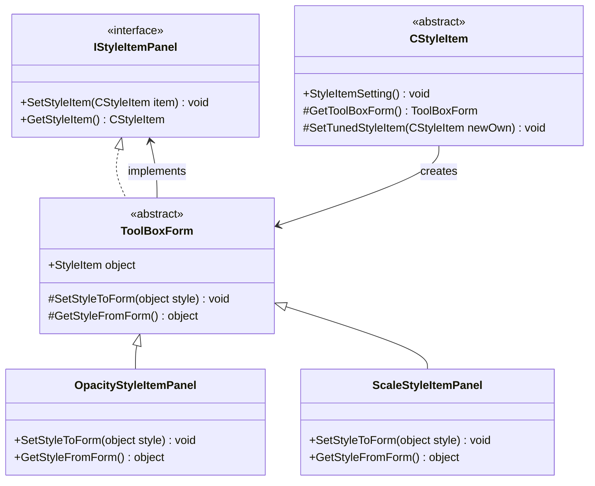
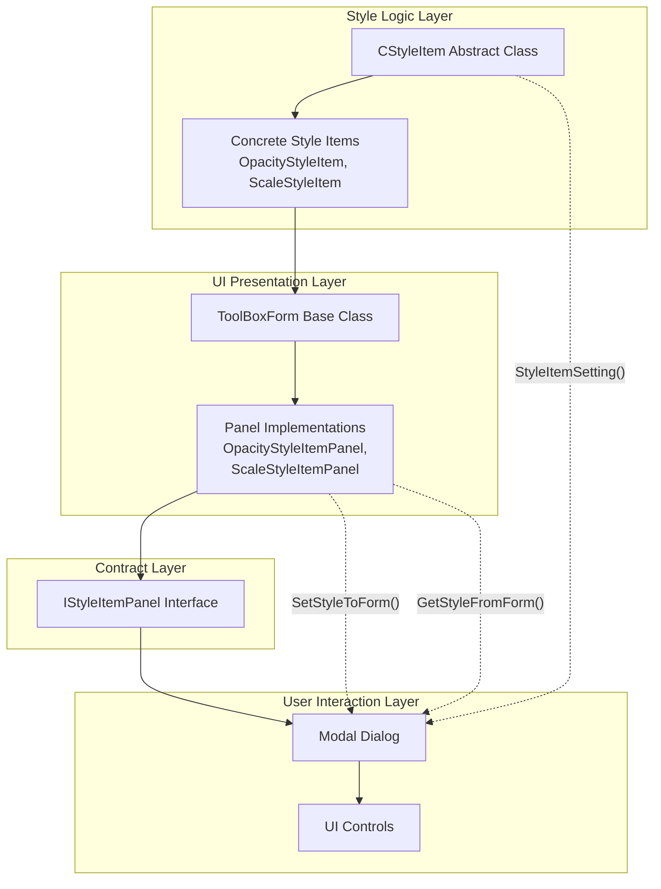
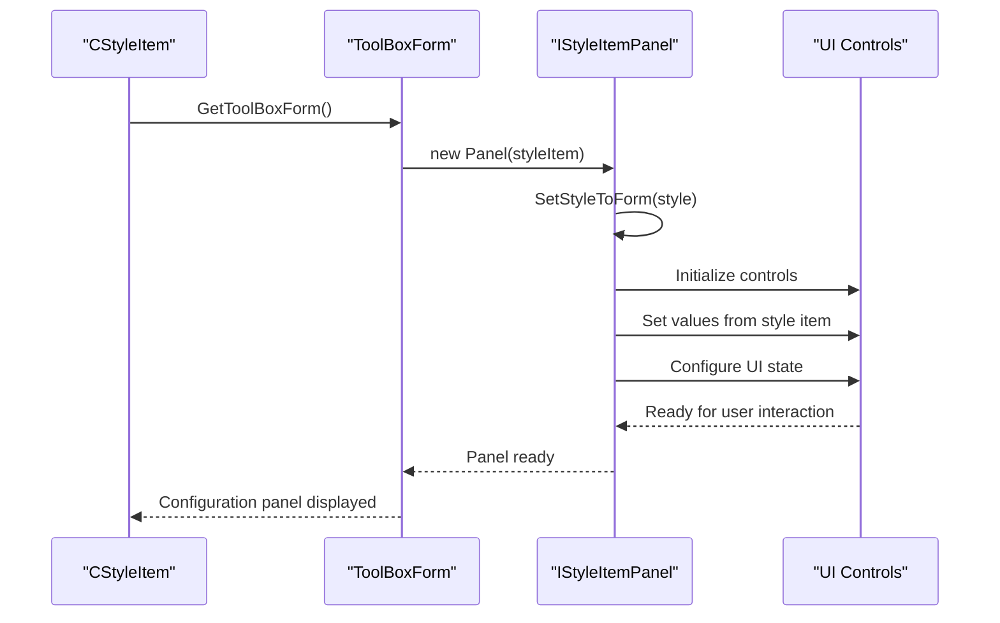
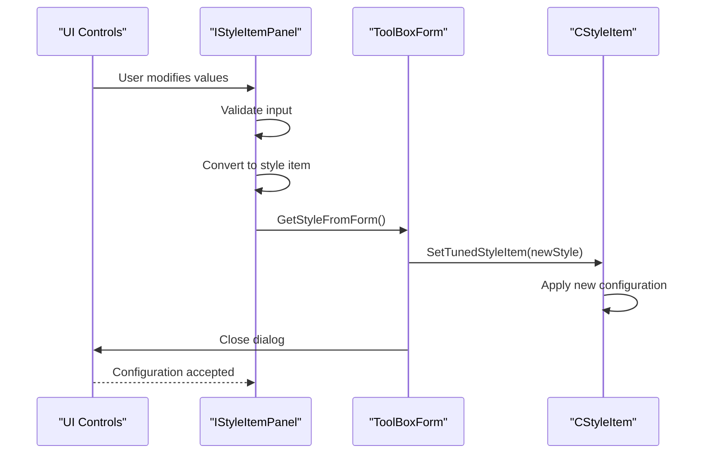
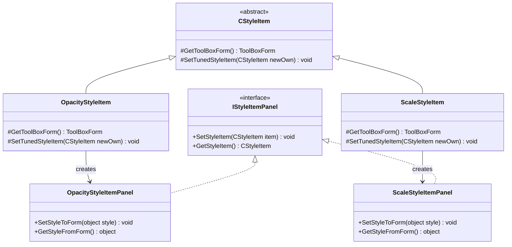
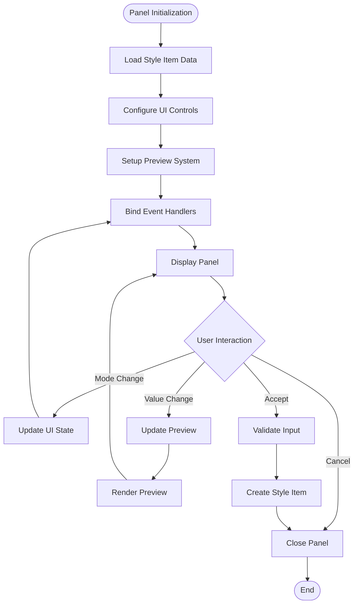
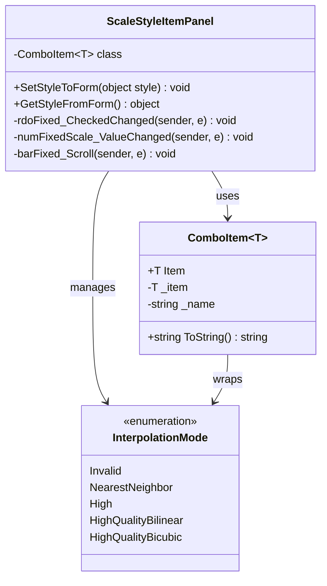
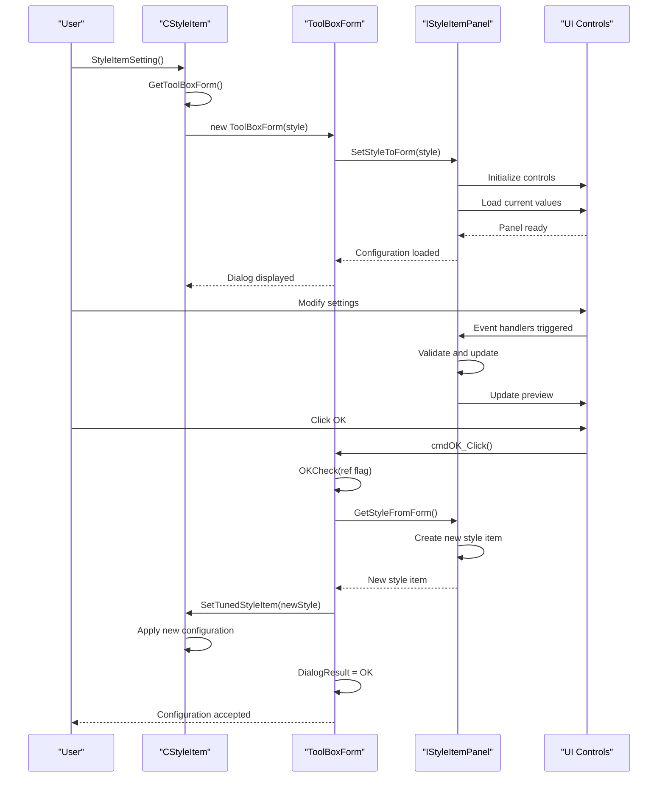
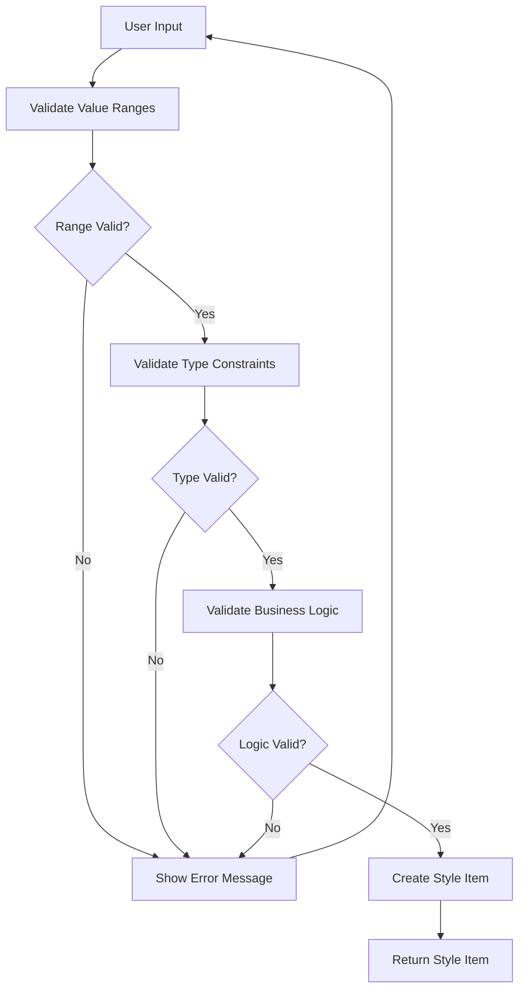
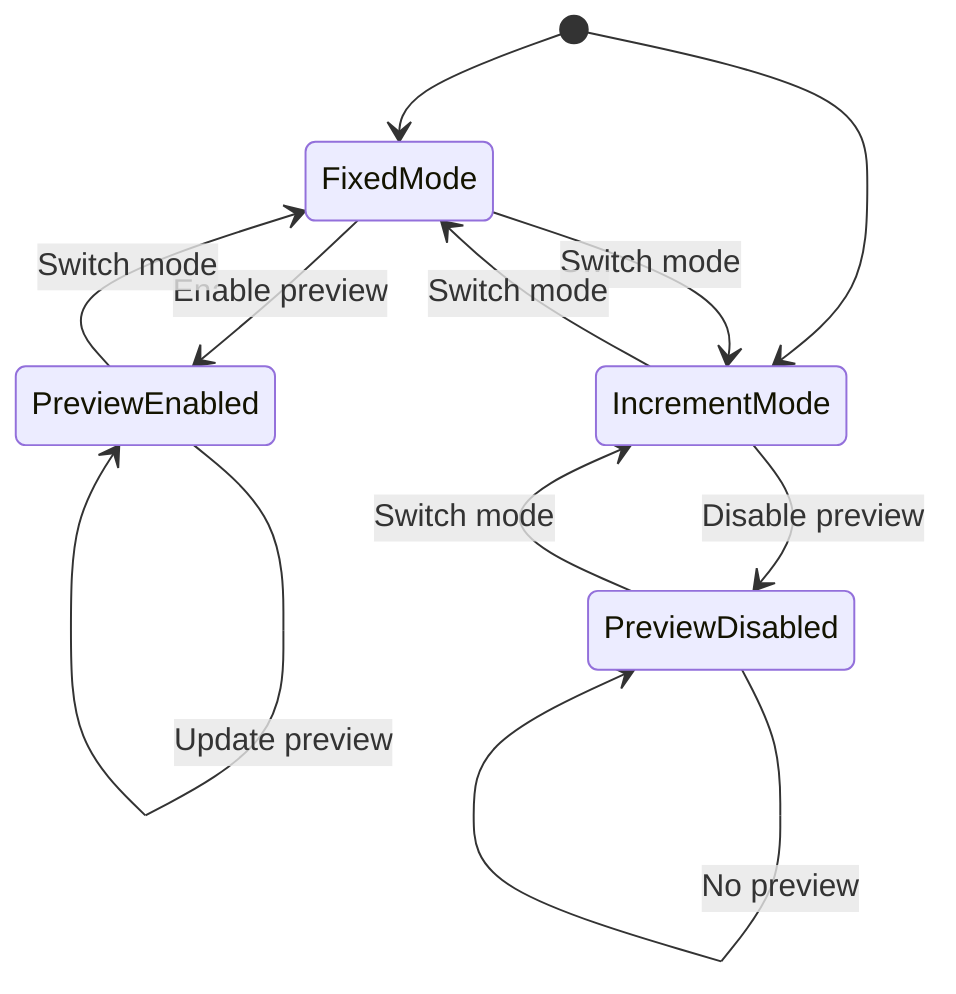

# IStyleItemPanel UI Interface

<cite>
**Referenced Files in This Document**
- [IStyleItemPanel.cs](file://SETUNA/Main/StyleItems/IStyleItemPanel.cs)
- [CStyleItem.cs](file://SETUNA/Main/StyleItems/CStyleItem.cs)
- [ToolBoxForm.cs](file://SETUNA/Main/StyleItems/ToolBoxForm.cs)
- [BaseForm.cs](file://SETUNA/Main/Common/BaseForm.cs)
- [COpacityStyleItem.cs](file://SETUNA/Main/StyleItems/COpacityStyleItem.cs)
- [CScaleStyleItem.cs](file://SETUNA/Main/StyleItems/CScaleStyleItem.cs)
- [OpacityStyleItemPanel.cs](file://SETUNA/Main/StyleItems/OpacityStyleItemPanel.cs)
- [ScaleStyleItemPanel.cs](file://SETUNA/Main/StyleItems/ScaleStyleItemPanel.cs)
- [MarginStyleItemPanel.cs](file://SETUNA/Main/StyleItems/MarginStyleItemPanel.cs)
- [NothingStyleItemPanel.cs](file://SETUNA/Main/StyleItems/NothingStyleItemPanel.cs)
</cite>

## Table of Contents
1. [Introduction](#introduction)
2. [Interface Definition](#interface-definition)
3. [Architecture Overview](#architecture-overview)
4. [Bidirectional Communication Pattern](#bidirectional-communication-pattern)
5. [Plugin Architecture Integration](#plugin-architecture-integration)
6. [Implementation Examples](#implementation-examples)
7. [Integration Flow](#integration-flow)
8. [Common Implementation Challenges](#common-implementation-challenges)
9. [Best Practices](#best-practices)
10. [Advanced Patterns](#advanced-patterns)
11. [Conclusion](#conclusion)

## Introduction

The IStyleItemPanel interface serves as a fundamental contract in the SETUNA screenshot application that enables seamless bidirectional communication between style items and their configuration UI components. This interface embodies a sophisticated plugin architecture pattern that decouples style logic from presentation, allowing for flexible and extensible configuration experiences.

The interface defines two essential methods that facilitate the transfer of style item data between the business logic layer and the user interface layer. Through this contract, developers can create responsive and accessible configuration panels that adapt to different style item types while maintaining consistent behavior patterns.

## Interface Definition

The IStyleItemPanel interface is a simple yet powerful abstraction that defines the contract for style item configuration panels. It consists of two primary methods that enable bidirectional data flow:



**Diagram sources**
- [IStyleItemPanel.cs](file://SETUNA/Main/StyleItems/IStyleItemPanel.cs#L4-L10)
- [CStyleItem.cs](file://SETUNA/Main/StyleItems/CStyleItem.cs#L8-L86)
- [ToolBoxForm.cs](file://SETUNA/Main/StyleItems/ToolBoxForm.cs#L7-L62)

**Section sources**
- [IStyleItemPanel.cs](file://SETUNA/Main/StyleItems/IStyleItemPanel.cs#L4-L10)

## Architecture Overview

The IStyleItemPanel interface operates within a layered architecture that separates concerns between style logic, UI presentation, and user interaction. This separation enables maintainable and extensible code while supporting the plugin architecture pattern.



**Diagram sources**
- [CStyleItem.cs](file://SETUNA/Main/StyleItems/CStyleItem.cs#L8-L101)
- [ToolBoxForm.cs](file://SETUNA/Main/StyleItems/ToolBoxForm.cs#L7-L62)
- [IStyleItemPanel.cs](file://SETUNA/Main/StyleItems/IStyleItemPanel.cs#L4-L10)

## Bidirectional Communication Pattern

The IStyleItemPanel interface implements a sophisticated bidirectional communication pattern that ensures data consistency between the style item and its configuration panel. This pattern involves two primary data flows:

### SetStyleItem Method Pattern

The SetStyleItem method transfers style item data from the business logic layer to the UI presentation layer. This method is responsible for populating UI controls with current style values and configuring the panel's initial state.



**Diagram sources**
- [ToolBoxForm.cs](file://SETUNA/Main/StyleItems/ToolBoxForm.cs#L15-L20)
- [OpacityStyleItemPanel.cs](file://SETUNA/Main/StyleItems/OpacityStyleItemPanel.cs#L21-L72)

### GetStyleItem Method Pattern

The GetStyleItem method transfers updated style item data from the UI presentation layer back to the business logic layer. This method captures user modifications and converts them into a new style item instance.



**Diagram sources**
- [ToolBoxForm.cs](file://SETUNA/Main/StyleItems/ToolBoxForm.cs#L42-L56)
- [OpacityStyleItemPanel.cs](file://SETUNA/Main/StyleItems/OpacityStyleItemPanel.cs#L72-L86)

**Section sources**
- [ToolBoxForm.cs](file://SETUNA/Main/StyleItems/ToolBoxForm.cs#L42-L56)
- [OpacityStyleItemPanel.cs](file://SETUNA/Main/StyleItems/OpacityStyleItemPanel.cs#L21-L86)

## Plugin Architecture Integration

The IStyleItemPanel interface plays a crucial role in the plugin architecture by providing a standardized way to integrate new style items with their corresponding configuration panels. This integration enables the system to support extensible functionality without requiring modifications to existing code.

### Decoupling Style Logic from Presentation

The interface achieves decoupling through several mechanisms:

1. **Abstract Factory Pattern**: Style items create their corresponding panels through the GetToolBoxForm method
2. **Interface Segregation**: The interface focuses solely on configuration data transfer
3. **Dependency Injection**: Panels receive style items through constructor parameters
4. **Polymorphic Behavior**: Different panel implementations handle type-specific UI requirements



**Diagram sources**
- [COpacityStyleItem.cs](file://SETUNA/Main/StyleItems/COpacityStyleItem.cs#L80-L83)
- [CScaleStyleItem.cs](file://SETUNA/Main/StyleItems/CScaleStyleItem.cs#L117-L121)
- [OpacityStyleItemPanel.cs](file://SETUNA/Main/StyleItems/OpacityStyleItemPanel.cs#L8-L10)
- [ScaleStyleItemPanel.cs](file://SETUNA/Main/StyleItems/ScaleStyleItemPanel.cs#L6-L8)

**Section sources**
- [COpacityStyleItem.cs](file://SETUNA/Main/StyleItems/COpacityStyleItem.cs#L80-L83)
- [CScaleStyleItem.cs](file://SETUNA/Main/StyleItems/CScaleStyleItem.cs#L117-L121)

## Implementation Examples

The framework provides several concrete implementations of the IStyleItemPanel interface, each demonstrating different patterns and capabilities for style item configuration.

### OpacityStyleItemPanel Implementation

The OpacityStyleItemPanel demonstrates comprehensive configuration capabilities including real-time preview, dual opacity modes (absolute and relative), and visual feedback systems.

Key features include:
- **Dual Mode Support**: Absolute (fixed percentage) and Relative (incremental) opacity modes
- **Real-time Preview**: Live rendering of opacity effects on sample images
- **Visual Feedback**: Dynamic color matrix transformations for immediate visual results
- **Data Validation**: Range checking and boundary enforcement for opacity values



**Diagram sources**
- [OpacityStyleItemPanel.cs](file://SETUNA/Main/StyleItems/OpacityStyleItemPanel.cs#L21-L72)

**Section sources**
- [OpacityStyleItemPanel.cs](file://SETUNA/Main/StyleItems/OpacityStyleItemPanel.cs#L8-L218)

### ScaleStyleItemPanel Implementation

The ScaleStyleItemPanel showcases advanced configuration patterns including interpolation mode selection, scale type differentiation, and mathematical precision handling.

Key features include:
- **Scale Type Management**: Fixed vs. incremental scaling modes
- **Interpolation Quality Control**: Multiple interpolation algorithm options
- **Mathematical Precision**: Careful handling of scale calculations
- **User Experience**: Intuitive slider and numeric input synchronization



**Diagram sources**
- [ScaleStyleItemPanel.cs](file://SETUNA/Main/StyleItems/ScaleStyleItemPanel.cs#L6-L153)
- [ScaleStyleItemPanel.cs](file://SETUNA/Main/StyleItems/ScaleStyleItemPanel.cs#L120-L153)

**Section sources**
- [ScaleStyleItemPanel.cs](file://SETUNA/Main/StyleItems/ScaleStyleItemPanel.cs#L6-L153)

### MarginStyleItemPanel Implementation

The MarginStyleItemPanel demonstrates complex UI scenarios including dynamic form creation, visual layout simulation, and real-time rendering capabilities.

Key features include:
- **Dynamic Form Creation**: Runtime creation of preview forms
- **Layout Simulation**: Real-time preview of margin effects
- **Visual Rendering**: Custom painting and composition
- **State Synchronization**: Complex UI state management

**Section sources**
- [MarginStyleItemPanel.cs](file://SETUNA/Main/StyleItems/MarginStyleItemPanel.cs#L8-L198)

## Integration Flow

The integration flow between StyleItemSetting, GetToolBoxForm, and IStyleItemPanel creates a seamless configuration experience that maintains data consistency and provides intuitive user interaction.

### Complete Integration Sequence



**Diagram sources**
- [CStyleItem.cs](file://SETUNA/Main/StyleItems/CStyleItem.cs#L25-L33)
- [ToolBoxForm.cs](file://SETUNA/Main/StyleItems/ToolBoxForm.cs#L22-L40)
- [OpacityStyleItemPanel.cs](file://SETUNA/Main/StyleItems/OpacityStyleItemPanel.cs#L21-L86)

### DialogResult Handling

The integration flow includes sophisticated DialogResult handling that ensures proper state management and user experience:

| DialogResult | Action | Impact |
|--------------|--------|---------|
| DialogResult.OK | Accept configuration | Calls SetTunedStyleItem with new style item |
| DialogResult.Cancel | Reject configuration | Discards changes, closes dialog |
| Validation Failure | Prevent OK button | Shows error messages, keeps dialog open |

**Section sources**
- [ToolBoxForm.cs](file://SETUNA/Main/StyleItems/ToolBoxForm.cs#L22-L40)
- [CStyleItem.cs](file://SETUNA/Main/StyleItems/CStyleItem.cs#L25-L33)

## Common Implementation Challenges

Implementing the IStyleItemPanel interface effectively requires addressing several common challenges that can impact user experience and system reliability.

### Data Validation Challenges

**Challenge**: Ensuring data integrity during bidirectional transfers
**Solution**: Implement comprehensive validation in GetStyleFromForm methods



### UI State Synchronization Challenges

**Challenge**: Maintaining consistent UI state across multiple controls
**Solution**: Implement centralized state management and event coordination

**Common Issues**:
- Slider and numeric input desynchronization
- Conditional control visibility conflicts
- Real-time preview lag or inconsistency

### Memory Management Challenges

**Challenge**: Proper resource cleanup in long-running panels
**Solution**: Implement proper disposal patterns and resource management

**Section sources**
- [OpacityStyleItemPanel.cs](file://SETUNA/Main/StyleItems/OpacityStyleItemPanel.cs#L183-L203)
- [MarginStyleItemPanel.cs](file://SETUNA/Main/StyleItems/MarginStyleItemPanel.cs#L107-L117)

## Best Practices

Effective implementation of the IStyleItemPanel interface requires adherence to established best practices that ensure maintainable, reliable, and user-friendly configuration panels.

### Design Principles

1. **Single Responsibility**: Each panel should focus on a specific style item type
2. **Consistent Layout**: Maintain uniform spacing and alignment across panels
3. **Intuitive Navigation**: Provide logical tab order and keyboard shortcuts
4. **Accessibility**: Support screen readers and keyboard-only navigation

### Implementation Guidelines

#### Constructor Pattern
```csharp
// Recommended constructor pattern
public MyStyleItemPanel(CMyStyleItem item) : base(item)
{
    // Initialization occurs in SetStyleToForm
}
```

#### Data Transfer Methods
```csharp
protected override void SetStyleToForm(object style)
{
    var myStyleItem = (CMyStyleItem)style;
    // Populate UI controls with current values
    // Configure UI state based on style properties
}

protected override object GetStyleFromForm()
{
    var newStyleItem = new CMyStyleItem();
    // Extract values from UI controls
    // Validate and convert to appropriate types
    return newStyleItem;
}
```

### Error Handling Best Practices

#### Input Validation
- Validate all user inputs before creating style items
- Provide immediate feedback for invalid inputs
- Use appropriate error messaging and highlighting

#### Exception Management
- Catch and handle exceptions gracefully
- Log errors for debugging purposes
- Provide fallback values when possible

### Performance Optimization

#### Lazy Loading
- Initialize expensive resources only when needed
- Use lazy initialization for complex UI components
- Dispose of temporary resources promptly

#### UI Responsiveness
- Perform heavy computations asynchronously
- Use progress indicators for long operations
- Minimize UI thread blocking

**Section sources**
- [OpacityStyleItemPanel.cs](file://SETUNA/Main/StyleItems/OpacityStyleItemPanel.cs#L21-L86)
- [ScaleStyleItemPanel.cs](file://SETUNA/Main/StyleItems/ScaleStyleItemPanel.cs#L14-L75)

## Advanced Patterns

The IStyleItemPanel interface supports several advanced patterns that enable sophisticated configuration scenarios and enhance the overall user experience.

### Real-time Preview Systems

Many implementations utilize real-time preview systems that provide immediate visual feedback as users modify settings. These systems typically involve:

- **Color Matrix Transformations**: For opacity and color effects
- **Graphics Composition**: For layout and positioning effects  
- **Dynamic Rendering**: For complex visual modifications

### State Machine Patterns

Some panels implement state machine patterns to manage complex UI states and transitions:



### Event Coordination Patterns

Complex panels often require sophisticated event coordination to maintain UI consistency:

- **Event Bubbling**: Propagating changes through nested controls
- **Event Debouncing**: Preventing excessive updates during rapid changes
- **Conditional Events**: Enabling/disabling events based on UI state

**Section sources**
- [OpacityStyleItemPanel.cs](file://SETUNA/Main/StyleItems/OpacityStyleItemPanel.cs#L170-L203)
- [MarginStyleItemPanel.cs](file://SETUNA/Main/StyleItems/MarginStyleItemPanel.cs#L118-L170)

## Conclusion

The IStyleItemPanel interface represents a sophisticated and well-designed contract that enables seamless integration between style items and their configuration UI components. Through its bidirectional communication pattern, the interface facilitates data transfer while maintaining strict separation of concerns between business logic and presentation layers.

The interface's role in the plugin architecture demonstrates its effectiveness in creating extensible and maintainable systems. By providing a standardized way to connect style items with their configuration panels, the interface enables developers to create responsive, accessible, and user-friendly configuration experiences.

Key benefits of the IStyleItemPanel interface include:

- **Decoupling**: Clean separation between style logic and UI presentation
- **Extensibility**: Easy addition of new style item types and configurations
- **Consistency**: Uniform behavior patterns across all configuration panels
- **Maintainability**: Clear contracts that simplify code maintenance and testing

The comprehensive examples provided by OpacityStyleItemPanel and ScaleStyleItemPanel demonstrate the interface's flexibility and power in handling diverse configuration scenarios. These implementations showcase best practices for data validation, UI state management, and user experience design.

For developers working with the SETUNA framework, the IStyleItemPanel interface provides a robust foundation for creating sophisticated style item configuration systems that enhance the overall user experience while maintaining code quality and system reliability.