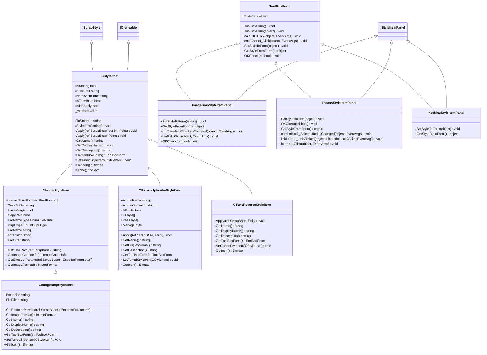
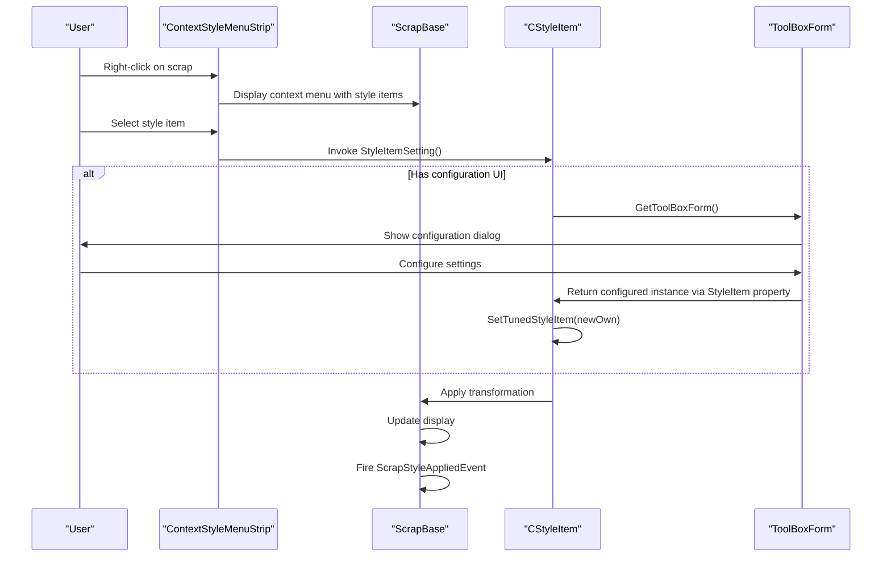

# Style Item Extension System

<cite>
**Referenced Files in This Document**   
- [CStyleItem.cs](file://SETUNA/Main/StyleItems/CStyleItem.cs)
- [IScrapStyle.cs](file://SETUNA/Main/StyleItems/IScrapStyle.cs)
- [IStyleItemPanel.cs](file://SETUNA/Main/StyleItems/IStyleItemPanel.cs)
- [CImageStyleItem.cs](file://SETUNA/Main/StyleItems/CImageStyleItem.cs)
- [CPicasaUploaderStyleItem.cs](file://SETUNA/Main/StyleItems/CPicasaUploaderStyleItem.cs)
- [CImageBmpStyleItem.cs](file://SETUNA/Main/StyleItems/CImageBmpStyleItem.cs)
- [ImageBmpStyleItemPanel.cs](file://SETUNA/Main/StyleItems/ImageBmpStyleItemPanel.cs)
- [PicasaStyleItemPanel.cs](file://SETUNA/Main/StyleItems/PicasaStyleItemPanel.cs)
- [ToolBoxForm.cs](file://SETUNA/Main/StyleItems/ToolBoxForm.cs)
- [NothingStyleItemPanel.cs](file://SETUNA/Main/StyleItems/NothingStyleItemPanel.cs)
- [StyleItemDictionary.cs](file://SETUNA/Main/StyleItems/StyleItemDictionary.cs)
- [ContextStyleMenuStrip.cs](file://SETUNA/Main/ContextStyleMenuStrip.cs)
- [ScrapBase.cs](file://SETUNA/Main/ScrapBase.cs)
</cite>

## Table of Contents
1. [Introduction](#introduction)
2. [Core Architecture](#core-architecture)
3. [CStyleItem Base Class](#cstyleitem-base-class)
4. [Key Methods and Lifecycle](#key-methods-and-lifecycle)
5. [UI Integration with IStyleItemPanel](#ui-integration-with-istyleitempanel)
6. [Concrete Implementation Examples](#concrete-implementation-examples)
7. [Extension Patterns](#extension-patterns)
8. [Lifecycle Flow](#lifecycle-flow)
9. [Troubleshooting Guide](#troubleshooting-guide)
10. [Conclusion](#conclusion)

## Introduction
The Style Item Extension System provides a plugin architecture for image transformation operations in the SETUNA application. This system enables extensible functionality through a well-defined class hierarchy and interface contract, allowing developers to create custom image effects, file export formats, and third-party service integrations. The architecture centers around the CStyleItem abstract base class which implements both IScrapStyle and ICloneable interfaces, forming the foundation for all style plugins.

## Core Architecture

**Diagram sources**
- [CStyleItem.cs](file://SETUNA/Main/StyleItems/CStyleItem.cs#L8-L101)
- [CImageStyleItem.cs](file://SETUNA/Main/StyleItems/CImageStyleItem.cs#L10-L276)
- [CPicasaUploaderStyleItem.cs](file://SETUNA/Main/StyleItems/CPicasaUploaderStyleItem.cs#L9-L147)
- [CToneReverseStyleItem.cs](file://SETUNA/Main/StyleItems/CToneReverseStyleItem.cs#L7-L63)
- [CImageBmpStyleItem.cs](file://SETUNA/Main/StyleItems/CImageBmpStyleItem.cs#L10-L78)
- [ToolBoxForm.cs](file://SETUNA/Main/StyleItems/ToolBoxForm.cs#L7-L64)
- [ImageBmpStyleItemPanel.cs](file://SETUNA/Main/StyleItems/ImageBmpStyleItemPanel.cs#L8-L141)
- [PicasaStyleItemPanel.cs](file://SETUNA/Main/StyleItems/PicasaStyleItemPanel.cs#L8-L112)
- [NothingStyleItemPanel.cs](file://SETUNA/Main/StyleItems/NothingStyleItemPanel.cs#L4-L26)

**Section sources**
- [CStyleItem.cs](file://SETUNA/Main/StyleItems/CStyleItem.cs#L8-L101)
- [IScrapStyle.cs](file://SETUNA/Main/StyleItems/IScrapStyle.cs#L6-L20)
- [IStyleItemPanel.cs](file://SETUNA/Main/StyleItems/IStyleItemPanel.cs#L4-L12)

## CStyleItem Base Class

The CStyleItem class serves as the abstract base class for all image transformation plugins in the SETUNA application. It implements two key interfaces: IScrapStyle for style application functionality and ICloneable for object duplication. This class provides a consistent interface for all style items while allowing specific implementations to define their unique behavior.

Key architectural features include:
- Abstract methods that must be implemented by derived classes
- Virtual properties with default implementations that can be overridden
- Protected fields for state management across the inheritance hierarchy
- A standardized pattern for UI integration and configuration

The class hierarchy enables polymorphic behavior where the application can treat all style items uniformly while allowing each specific implementation to provide its own transformation logic, UI representation, and configuration persistence.

**Section sources**
- [CStyleItem.cs](file://SETUNA/Main/StyleItems/CStyleItem.cs#L8-L101)
- [IScrapStyle.cs](file://SETUNA/Main/StyleItems/IScrapStyle.cs#L6-L20)

## Key Methods and Lifecycle

### Apply Method
The Apply method is the core transformation logic for style items. It exists in two overloads:
- `Apply(ref ScrapBase scrap, out int waitinterval, Point clickpoint)` - The public entry point that manages wait intervals
- `Apply(ref ScrapBase scrap, Point clickpoint)` - The abstract method that must be implemented by derived classes

This dual-method pattern allows the base class to handle common concerns like wait interval management while delegating the specific transformation logic to concrete implementations.

### GetToolBoxForm Method
The GetToolBoxForm method provides UI integration by returning a ToolBoxForm instance that allows users to configure the style item. This method follows the Factory pattern, creating and returning the appropriate configuration form for the specific style item.

### SetTunedStyleItem Method
The SetTunedStyleItem method handles configuration persistence by transferring settings from a configured instance (obtained from the UI) back to the original style item. This enables the "Apply" pattern where users configure settings in a dialog and those settings are then applied to the actual style item.

### Clone Method
The Clone method, inherited from ICloneable, uses MemberwiseClone to create shallow copies of style items. This is essential for maintaining independent instances of style items with their own configuration states.

**Section sources**
- [CStyleItem.cs](file://SETUNA/Main/StyleItems/CStyleItem.cs#L37-L95)
- [ToolBoxForm.cs](file://SETUNA/Main/StyleItems/ToolBoxForm.cs#L44-L62)

## UI Integration with IStyleItemPanel

### IStyleItemPanel Interface Contract
The IStyleItemPanel interface defines a bidirectional communication contract between style items and their configuration UI:
- `SetStyleItem(CStyleItem item)` - Transfers the current style item state to the UI for display
- `GetStyleItem()` - Retrieves the configured state from the UI to apply back to the style item

This interface ensures consistent UI integration patterns across all style items while allowing each to have a custom user interface.

### ToolBoxForm Base Class
The ToolBoxForm class serves as the base class for all style item configuration panels. It provides:
- Standardized OK/Cancel button handling
- Virtual methods for form-to-object and object-to-form data binding
- Validation through the OKCheck method
- Property access to retrieve the configured style item

Derived classes implement the abstract SetStyleToForm and GetStyleFromForm methods to handle the specific data binding for their associated style items.

**Section sources**
- [IStyleItemPanel.cs](file://SETUNA/Main/StyleItems/IStyleItemPanel.cs#L4-L12)
- [ToolBoxForm.cs](file://SETUNA/Main/StyleItems/ToolBoxForm.cs#L7-L64)
- [ImageBmpStyleItemPanel.cs](file://SETUNA/Main/StyleItems/ImageBmpStyleItemPanel.cs#L8-L141)
- [PicasaStyleItemPanel.cs](file://SETUNA/Main/StyleItems/PicasaStyleItemPanel.cs#L8-L112)

## Concrete Implementation Examples

### Image Filter Example: CToneReverseStyleItem
The CToneReverseStyleItem demonstrates a simple image transformation that inverts pixel colors. Key characteristics:
- Implements Apply using GDI+ ColorMatrix to perform the inversion
- Uses NothingStyleItemPanel since no configuration is needed
- Empty SetTunedStyleItem implementation as there are no settings to persist

### File Export Example: CImageBmpStyleItem
The CImageBmpStyleItem shows a file export implementation with configurable options:
- Inherits from CImageStyleItem which provides common image saving functionality
- Implements GetEncoderParams and GetImageFormat for BMP-specific settings
- Uses ImageBmpStyleItemPanel for UI with options for save location, filename, and duplication handling

### Third-Party Service Example: CPicasaUploaderStyleItem
The CPicasaUploaderStyleItem demonstrates integration with external services:
- Stores authentication credentials (ID, Pass) and upload settings
- Uses PicasaStyleItemPanel for credential input and management options
- Launches PicasaBar form to handle the actual upload process
- Implements SetTunedStyleItem to transfer credentials between instances

**Section sources**
- [CToneReverseStyleItem.cs](file://SETUNA/Main/StyleItems/CToneReverseStyleItem.cs#L7-L63)
- [CImageBmpStyleItem.cs](file://SETUNA/Main/StyleItems/CImageBmpStyleItem.cs#L10-L78)
- [ImageBmpStyleItemPanel.cs](file://SETUNA/Main/StyleItems/ImageBmpStyleItemPanel.cs#L8-L141)
- [CPicasaUploaderStyleItem.cs](file://SETUNA/Main/StyleItems/CPicasaUploaderStyleItem.cs#L9-L147)
- [PicasaStyleItemPanel.cs](file://SETUNA/Main/StyleItems/PicasaStyleItemPanel.cs#L8-L112)

## Extension Patterns

### Adding New Image Effects
To create a new image effect:
1. Derive from CStyleItem
2. Implement Apply with the transformation logic using GDI+ operations
3. Override GetName, GetDisplayName, and GetDescription
4. Return an appropriate icon in GetIcon
5. If no configuration is needed, use NothingStyleItemPanel in GetToolBoxForm

### Integrating Third-Party Services
For third-party service integration:
1. Store service-specific credentials and settings as properties
2. Implement Apply to launch a service-specific form or process
3. Use a custom ToolBoxForm derivative for configuration
4. Implement SetTunedStyleItem to transfer credentials and settings
5. Consider security implications of storing sensitive data

### Creating Composite Styles
Composite styles can be created by:
1. Creating a style item that applies multiple transformations sequentially
2. Using existing style items as building blocks
3. Managing the order of operations in the Apply method
4. Providing UI to configure each component transformation

**Section sources**
- [CStyleItem.cs](file://SETUNA/Main/StyleItems/CStyleItem.cs#L8-L101)
- [CImageStyleItem.cs](file://SETUNA/Main/StyleItems/CImageStyleItem.cs#L10-L276)
- [StyleItemDictionary.cs](file://SETUNA/Main/StyleItems/StyleItemDictionary.cs#L15-L34)

## Lifecycle Flow

**Diagram sources**
- [ContextStyleMenuStrip.cs](file://SETUNA/Main/ContextStyleMenuStrip.cs#L23-L42)
- [CStyleItem.cs](file://SETUNA/Main/StyleItems/CStyleItem.cs#L26-L34)
- [ScrapBase.cs](file://SETUNA/Main/ScrapBase.cs#L898-L943)

**Section sources**
- [ContextStyleMenuStrip.cs](file://SETUNA/Main/ContextStyleMenuStrip.cs#L23-L42)
- [CStyleItem.cs](file://SETUNA/Main/StyleItems/CStyleItem.cs#L26-L34)
- [ScrapBase.cs](file://SETUNA/Main/ScrapBase.cs#L898-L943)

## Troubleshooting Guide

### UI Binding Issues
Common problems and solutions:
- **NullReferenceException in SetStyleToForm**: Ensure InitializeComponent() is called before accessing UI controls
- **Settings not persisting**: Verify SetTunedStyleItem properly transfers all properties from the new instance
- **UI not reflecting current state**: Check that SetStyleToForm correctly populates all controls from the style item properties

### State Management Problems
- **Credentials not saved**: For sensitive data like passwords, ensure proper encryption/decryption is implemented (as seen in PicasaBar.Encrypto/Decrypto)
- **Configuration lost after application restart**: Verify that style item state is properly serialized in the application's persistence mechanism
- **Inconsistent behavior between instances**: Ensure Clone creates independent copies and doesn't share references to mutable objects

### Performance Considerations
- **Long-running operations blocking UI**: Use waitinterval to indicate operations that require user wait time
- **Memory leaks in image processing**: Always dispose of Graphics and Bitmap objects in try-finally blocks
- **Slow Apply operations**: Consider implementing asynchronous processing for complex transformations

**Section sources**
- [ToolBoxForm.cs](file://SETUNA/Main/StyleItems/ToolBoxForm.cs#L47-L62)
- [ImageBmpStyleItemPanel.cs](file://SETUNA/Main/StyleItems/ImageBmpStyleItemPanel.cs#L21-L69)
- [PicasaStyleItemPanel.cs](file://SETUNA/Main/StyleItems/PicasaStyleItemPanel.cs#L59-L74)
- [CImageStyleItem.cs](file://SETUNA/Main/StyleItems/CImageStyleItem.cs#L24-L102)

## Conclusion
The Style Item Extension System provides a robust and extensible architecture for image transformation plugins. By leveraging the CStyleItem base class and its associated interfaces, developers can create a wide variety of plugins including image filters, file exporters, and third-party service integrations. The consistent pattern of Apply for transformation logic, GetToolBoxForm for UI integration, and SetTunedStyleItem for configuration persistence creates a maintainable and scalable plugin system. Understanding the lifecycle from user interaction through context menu to Apply invocation is essential for developing effective style items that integrate seamlessly with the application.