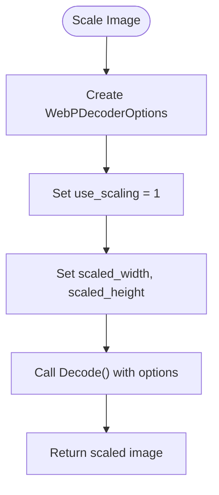

# Advanced WebP Decoding Options

<cite>
**Referenced Files in This Document**   
- [WebPWrapper.cs](file://SETUNA/Plugins/WebPWrapper.cs)
</cite>

## Table of Contents
1. [Introduction](#introduction)
2. [WebPDecoderOptions Structure](#webpdecoderoptions-structure)
3. [Decoding Pipeline](#decoding-pipeline)
4. [Advanced Features Implementation](#advanced-features-implementation)
5. [Error Handling and Validation](#error-handling-and-validation)
6. [Performance Considerations](#performance-considerations)
7. [Code Examples](#code-examples)
8. [Version Compatibility](#version-compatibility)

## Introduction
The WebPWrapper class provides advanced WebP decoding capabilities through the Decode method with WebPDecoderOptions. This document details the implementation of advanced features such as cropping, scaling, threading, and dithering control. The WebPDecoderConfig structure enables these advanced features by configuring the decoding process according to specific requirements. This comprehensive guide covers the complete decoding pipeline from options configuration to WebPDecode invocation, including validation of crop boundaries against image dimensions.

**Section sources**
- [WebPWrapper.cs](file://SETUNA/Plugins/WebPWrapper.cs#L125-L213)

## WebPDecoderOptions Structure
The WebPDecoderOptions structure contains various parameters that control the decoding process. Each option parameter serves a specific purpose in customizing the decoding behavior:

- **use_cropping**: Enables cropping functionality with specified crop dimensions (crop_left, crop_top, crop_width, crop_height)
- **use_scaling**: Enables scaling functionality with target dimensions (scaled_width, scaled_height)
- **bypass_filtering**: Skips the in-loop filtering process for faster decoding
- **no_fancy_upsampling**: Uses faster pointwise upsampling instead of more complex algorithms
- **dithering_strength**: Controls the dithering strength from 0 (off) to 100 (full)
- **use_threads**: Enables multi-threaded decoding for improved performance
- **flip**: Flips the output vertically
- **alpha_dithering_strength**: Controls alpha channel dithering strength from 0 to 100

These options are implemented as integer values where 0 represents false/disabled and 1 represents true/enabled, following the C-style boolean convention required by the native libwebp library.

**Diagram sources**
- [WebPWrapper.cs](file://SETUNA/Plugins/WebPWrapper.cs#L2097-L2138)

**Section sources**
- [WebPWrapper.cs](file://SETUNA/Plugins/WebPWrapper.cs#L2097-L2138)

## Decoding Pipeline
The decoding pipeline follows a structured sequence from options configuration to final image output. The process begins with initializing the WebPDecoderConfig structure using WebPInitDecoderConfig, which validates compatibility with the libwebp library version. The pipeline then proceeds through several key stages:

1. Input validation and feature extraction using WebPGetFeatures
2. Configuration of decoding options based on WebPDecoderOptions
3. Memory allocation and bitmap creation
4. Native WebPDecode invocation
5. Resource cleanup and error handling

The pipeline handles both cropping and scaling operations, with cropping applied first when both options are enabled. The output buffer is configured to match the input image dimensions initially, with scaling applied as a post-processing step.

**Diagram sources**
- [WebPWrapper.cs](file://SETUNA/Plugins/WebPWrapper.cs#L132-L210)

**Section sources**
- [WebPWrapper.cs](file://SETUNA/Plugins/WebPWrapper.cs#L125-L213)

## Advanced Features Implementation
The WebPWrapper implementation provides several advanced features through the WebPDecoderOptions structure. These features enable fine-grained control over the decoding process:

### Cropping Implementation
Cropping is implemented by setting use_cropping to 1 and specifying the crop dimensions. The implementation validates that crop boundaries do not exceed the image dimensions:

**Diagram sources**
- [WebPWrapper.cs](file://SETUNA/Plugins/WebPWrapper.cs#L150-L156)

### Scaling Implementation
Scaling is applied after cropping (if enabled) and is controlled by the use_scaling flag. The target dimensions are specified by scaled_width and scaled_height parameters. The implementation creates an output bitmap with the target dimensions and configures the decoder accordingly.

### Dithering Control
Dithering strength is controlled by the dithering_strength parameter (0-100) and alpha_dithering_strength for alpha channel dithering. These parameters allow balancing between visual quality and performance.

**Section sources**
- [WebPWrapper.cs](file://SETUNA/Plugins/WebPWrapper.cs#L141-L180)

## Error Handling and Validation
The implementation includes comprehensive error handling for invalid configurations and boundary conditions. Key validation checks include:

- Version compatibility between wrapper and native library
- Valid crop boundaries that do not exceed image dimensions
- Proper initialization of the decoder configuration
- Successful completion of the decoding process

When an error occurs, the implementation throws descriptive exceptions that include the specific error context. For example, if crop boundaries exceed image dimensions, an exception with the message "Crop options exceded WebP image dimensions" is thrown. The finally block ensures proper cleanup of allocated resources, including unlocking bitmap data and freeing pinned memory.

**Diagram sources**
- [WebPWrapper.cs](file://SETUNA/Plugins/WebPWrapper.cs#L134-L207)

**Section sources**
- [WebPWrapper.cs](file://SETUNA/Plugins/WebPWrapper.cs#L134-L207)

## Performance Considerations
The implementation offers several performance optimization options through the WebPDecoderOptions structure:

- **bypass_filtering**: Disabling in-loop filtering significantly improves decoding speed at the cost of reduced visual quality
- **no_fancy_upsampling**: Using simple upsampling instead of fancy algorithms provides faster decoding
- **use_threads**: Enabling multi-threaded decoding leverages multiple CPU cores for improved performance
- **dithering_strength**: Lower dithering values reduce processing overhead

The GetThumbnailFast method demonstrates an optimized configuration that prioritizes speed over quality by enabling bypass_filtering, no_fancy_upsampling, and multi-threading. In contrast, GetThumbnailQuality prioritizes visual quality by disabling these performance optimizations.

**Section sources**
- [WebPWrapper.cs](file://SETUNA/Plugins/WebPWrapper.cs#L236-L282)

## Code Examples
The implementation provides practical examples of advanced decoding scenarios:

### Region Extraction
For extracting a specific region from a WebP image, configure cropping parameters:

### Resolution Scaling
For scaling an image to specific dimensions:

**Section sources**
- [WebPWrapper.cs](file://SETUNA/Plugins/WebPWrapper.cs#L236-L365)

## Version Compatibility
The implementation includes version compatibility checks through the WEBP_DECODER_ABI_VERSION constant (0x0208). The WebPInitDecoderConfig function validates that the wrapper version matches the native library version. Additionally, the WebPGetDecoderVersion function allows runtime checking of the libwebp library version, enabling conditional feature usage based on version capabilities. This ensures backward compatibility while allowing access to newer features when available.

**Section sources**
- [WebPWrapper.cs](file://SETUNA/Plugins/WebPWrapper.cs#L1095-L1096)