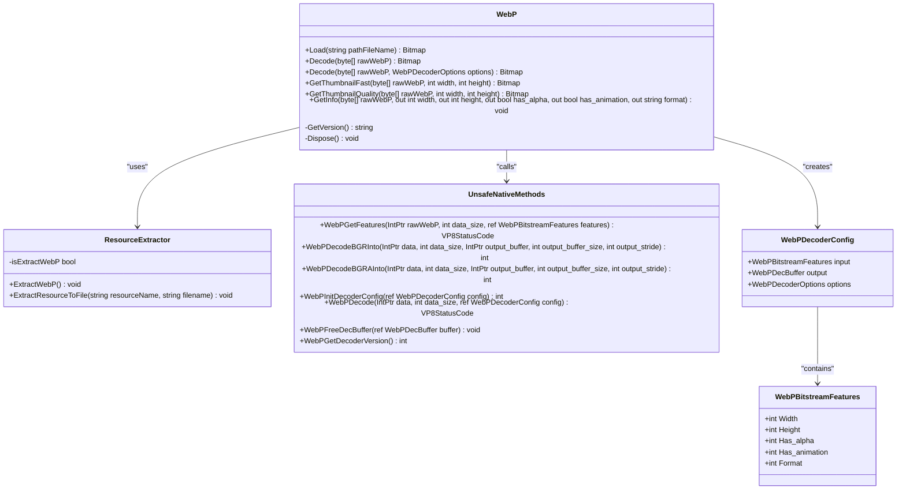
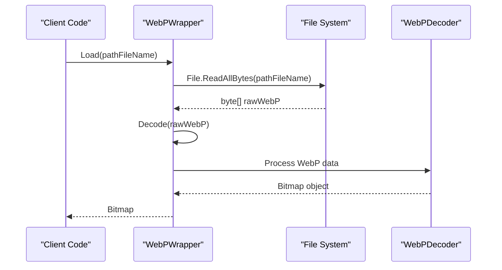
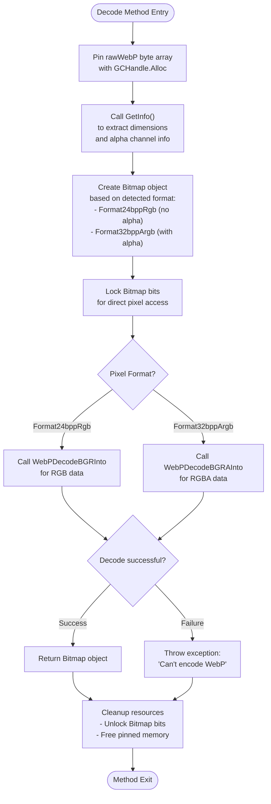
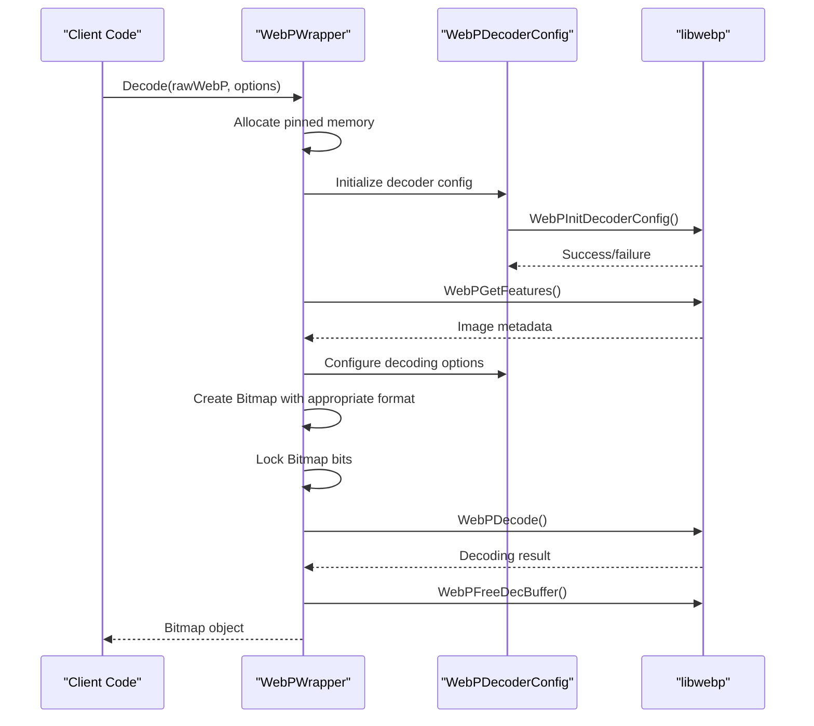
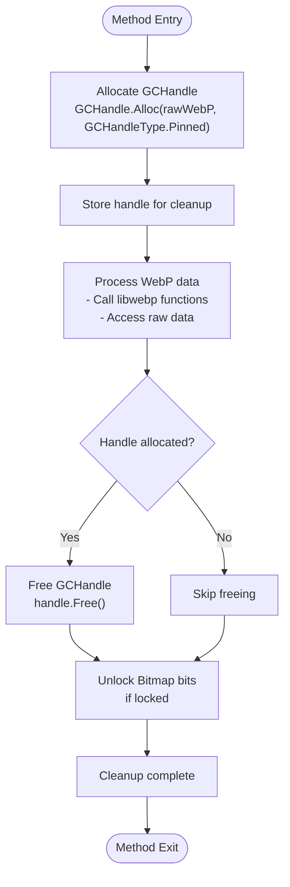
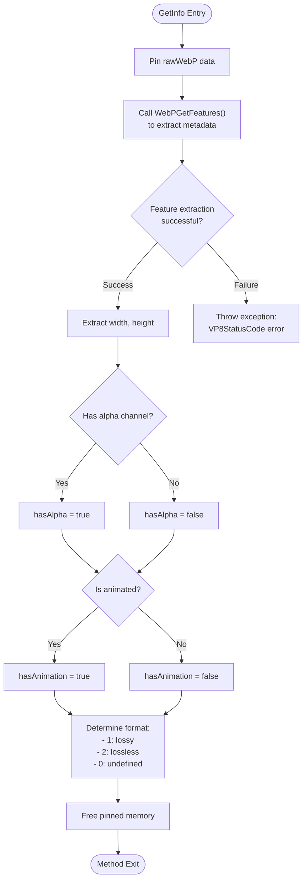
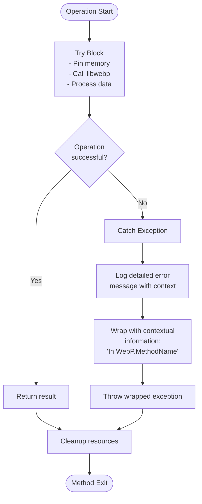
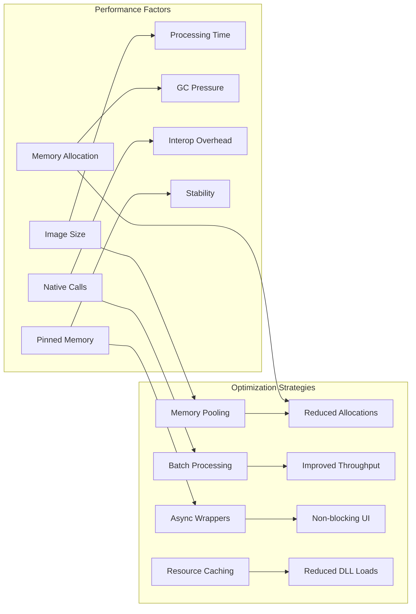
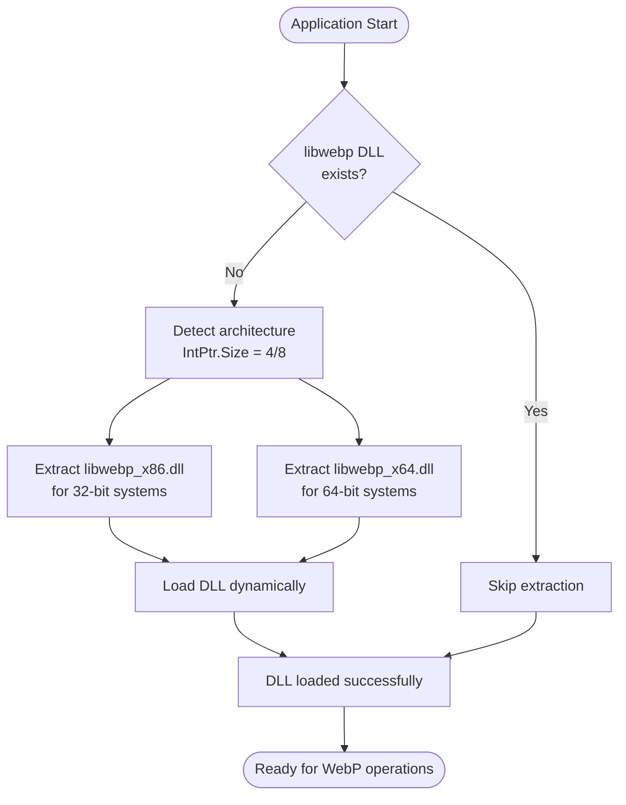
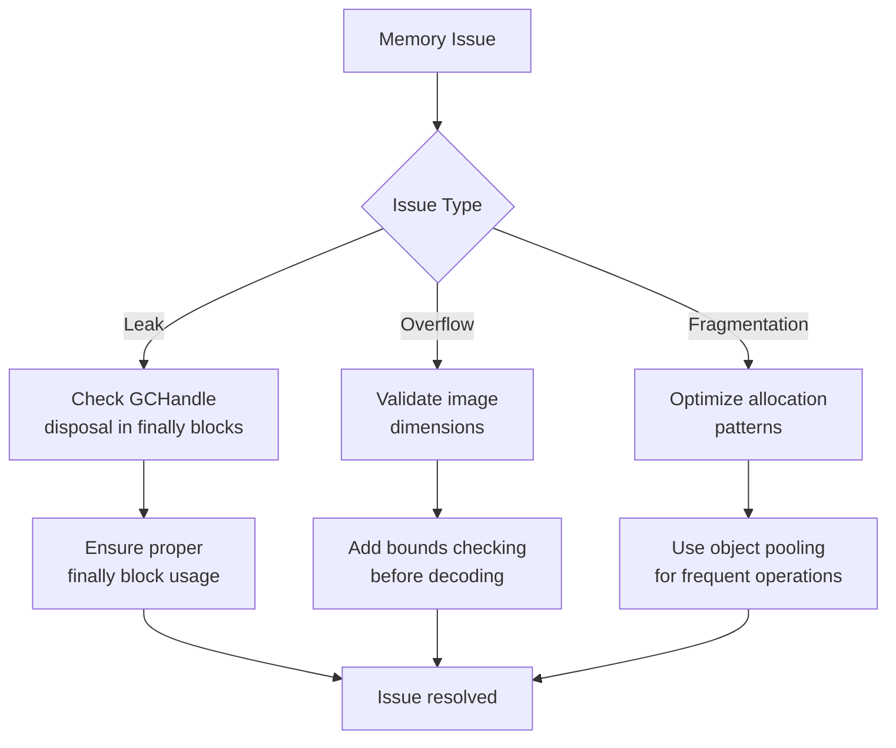

# Basic WebP Decoding

<cite>
**Referenced Files in This Document**
- [WebPWrapper.cs](file://SETUNA/Plugins/WebPWrapper.cs)
- [ResourceExtractor.cs](file://SETUNA/Plugins/ResourceExtractor.cs)
</cite>

## Table of Contents
1. [Introduction](#introduction)
2. [Architecture Overview](#architecture-overview)
3. [Core Decoding Methods](#core-decoding-methods)
4. [Memory Management Workflow](#memory-management-workflow)
5. [Internal Processing Pipeline](#internal-processing-pipeline)
6. [Practical Implementation Examples](#practical-implementation-examples)
7. [Exception Handling and Error Recovery](#exception-handling-and-error-recovery)
8. [Performance Considerations](#performance-considerations)
9. [Common Issues and Solutions](#common-issues-and-solutions)
10. [Best Practices](#best-practices)

## Introduction

The WebPWrapper class provides comprehensive WebP image decoding functionality for .NET applications, enabling seamless conversion of WebP format byte arrays into GDI+ Bitmap objects. Built on top of the native libwebp library, this wrapper offers both simple and advanced decoding capabilities with robust memory management and error handling.

The implementation focuses on efficient memory utilization through pinned memory management, automatic detection of image characteristics (dimensions, alpha channels), and direct pixel data copying to minimize overhead. The wrapper supports various decoding scenarios including file loading, clipboard data processing, and thumbnail generation.

## Architecture Overview

The WebPWrapper follows a layered architecture that bridges managed .NET code with native libwebp functionality:



**Diagram sources**
- [WebPWrapper.cs](file://SETUNA/Plugins/WebPWrapper.cs#L32-L339)
- [ResourceExtractor.cs](file://SETUNA/Plugins/ResourceExtractor.cs#L5-L44)

**Section sources**
- [WebPWrapper.cs](file://SETUNA/Plugins/WebPWrapper.cs#L1-L50)
- [ResourceExtractor.cs](file://SETUNA/Plugins/ResourceExtractor.cs#L1-L44)

## Core Decoding Methods

### Load Method

The Load method provides the simplest interface for decoding WebP files from disk:



**Diagram sources**
- [WebPWrapper.cs](file://SETUNA/Plugins/WebPWrapper.cs#L47-L54)

### Decode Method (Simple)

The primary Decode method handles raw WebP byte arrays with automatic format detection:



**Diagram sources**
- [WebPWrapper.cs](file://SETUNA/Plugins/WebPWrapper.cs#L61-L118)

### Decode Method (Advanced)

The advanced Decode method supports custom decoding options:



**Diagram sources**
- [WebPWrapper.cs](file://SETUNA/Plugins/WebPWrapper.cs#L125-L228)

**Section sources**
- [WebPWrapper.cs](file://SETUNA/Plugins/WebPWrapper.cs#L47-L228)

## Memory Management Workflow

The WebPWrapper implements a sophisticated memory management system to ensure optimal performance and prevent memory leaks:

### Pinned Memory Management



**Diagram sources**
- [WebPWrapper.cs](file://SETUNA/Plugins/WebPWrapper.cs#L65-L117)

### Automatic Resource Disposal

The wrapper ensures proper resource cleanup through structured exception handling:

| Resource Type | Allocation Method | Cleanup Method | Purpose |
|---------------|-------------------|----------------|---------|
| Pinned Memory | `GCHandle.Alloc()` | `GCHandle.Free()` | Prevent garbage collection during native calls |
| Bitmap Bits | `Bitmap.LockBits()` | `Bitmap.UnlockBits()` | Direct pixel access for performance |
| Native Buffers | libwebp allocation | `WebPFreeDecBuffer()` | Native memory management |
| Configuration Objects | Struct initialization | Automatic cleanup | Decoder configuration |

**Section sources**
- [WebPWrapper.cs](file://SETUNA/Plugins/WebPWrapper.cs#L65-L117)
- [WebPWrapper.cs](file://SETUNA/Plugins/WebPWrapper.cs#L127-L227)

## Internal Processing Pipeline

### WebPGetFeatures Detection

The GetInfo method serves as the foundation for subsequent decoding operations:



**Diagram sources**
- [WebPWrapper.cs](file://SETUNA/Plugins/WebPWrapper.cs#L685-L743)

### Pixel Data Processing

The core pixel processing utilizes direct memory copying for maximum efficiency:

| Operation | Native Function | Target Format | Performance Impact |
|-----------|----------------|---------------|-------------------|
| RGB Decoding | `WebPDecodeBGRInto()` | Format24bppRgb | Direct pixel copy, no color space conversion |
| RGBA Decoding | `WebPDecodeBGRAInto()` | Format32bppArgb | Direct pixel copy with alpha channel preservation |
| Buffer Validation | Bounds checking | N/A | Prevents buffer overruns |
| Stride Calculation | `stride * height` | Output buffer size | Ensures adequate memory allocation |

**Section sources**
- [WebPWrapper.cs](file://SETUNA/Plugins/WebPWrapper.cs#L71-L102)
- [WebPWrapper.cs](file://SETUNA/Plugins/WebPWrapper.cs#L138-L227)

## Practical Implementation Examples

### Loading WebP Files from Disk

```csharp
// Example usage pattern for loading WebP files
public static Bitmap LoadWebPFromFile(string filePath)
{
    using (var webp = new WebPWrapper.WebP())
    {
        try
        {
            return webp.Load(filePath);
        }
        catch (Exception ex)
        {
            // Handle WebP loading errors
            Console.WriteLine($"WebP loading failed: {ex.Message}");
            return null;
        }
    }
}
```

### Decoding Clipboard Image Data

```csharp
// Example for handling clipboard WebP data
public static Bitmap LoadWebPFromClipboard()
{
    using (var webp = new WebPWrapper.WebP())
    {
        if (Clipboard.ContainsData(DataFormats.Dib))
        {
            var data = Clipboard.GetData(DataFormats.Dib) as byte[];
            if (data != null && IsWebPFormat(data))
            {
                try
                {
                    return webp.Decode(data);
                }
                catch (Exception ex)
                {
                    Console.WriteLine($"Clipboard WebP decode failed: {ex.Message}");
                }
            }
        }
        return null;
    }
}
```

### Thumbnail Generation

```csharp
// Example for creating WebP thumbnails
public static Bitmap CreateWebPThumbnail(byte[] webpData, int targetWidth, int targetHeight)
{
    using (var webp = new WebPWrapper.WebP())
    {
        try
        {
            // Use fast thumbnail mode for better performance
            return webp.GetThumbnailFast(webpData, targetWidth, targetHeight);
        }
        catch (Exception ex)
        {
            Console.WriteLine($"Thumbnail creation failed: {ex.Message}");
            return null;
        }
    }
}
```

**Section sources**
- [WebPWrapper.cs](file://SETUNA/Plugins/WebPWrapper.cs#L47-L54)
- [WebPWrapper.cs](file://SETUNA/Plugins/WebPWrapper.cs#L236-L297)
- [WebPWrapper.cs](file://SETUNA/Plugins/WebPWrapper.cs#L305-L380)

## Exception Handling and Error Recovery

### Comprehensive Error Handling Strategy

The WebPWrapper implements multi-layered exception handling to provide meaningful error information:



**Diagram sources**
- [WebPWrapper.cs](file://SETUNA/Plugins/WebPWrapper.cs#L54-L56)
- [WebPWrapper.cs](file://SETUNA/Plugins/WebPWrapper.cs#L103-L105)
- [WebPWrapper.cs](file://SETUNA/Plugins/WebPWrapper.cs#L228-L230)

### Common Exception Scenarios

| Exception Type | Cause | Recovery Strategy | Prevention |
|----------------|-------|-------------------|------------|
| `OutOfMemoryException` | Large WebP image | Reduce image size or use streaming | Validate image dimensions before decoding |
| `ArgumentException` | Invalid byte array | Validate input data | Check array length and format |
| `NotSupportedException` | Unsupported pixel format | Convert to supported format | Verify PixelFormat compatibility |
| `InvalidOperationException` | Platform mismatch | Use correct libwebp DLL | Ensure proper architecture (x86/x64) |
| `Exception("Can't encode WebP")` | Decoding failure | Retry with different options | Check WebP validity |

**Section sources**
- [WebPWrapper.cs](file://SETUNA/Plugins/WebPWrapper.cs#L54-L56)
- [WebPWrapper.cs](file://SETUNA/Plugins/WebPWrapper.cs#L103-L105)
- [WebPWrapper.cs](file://SETUNA/Plugins/WebPWrapper.cs#L228-L230)

## Performance Considerations

### Synchronous Decoding Characteristics

The WebPWrapper performs synchronous decoding, which has specific performance implications:



### Memory Usage Patterns

| Operation Phase | Memory Type | Allocation Pattern | Peak Usage |
|-----------------|-------------|-------------------|------------|
| Initialization | Managed | Small, short-lived | Minimal |
| Data Pinning | Native | Fixed duration | Low |
| Decoding | Mixed | Variable, proportional to image size | High (image × bpp) |
| Bitmap Creation | Managed | Proportional to output size | Medium |
| Cleanup | Native | Automatic | Zero |

### Performance Optimization Recommendations

1. **Memory Management**: Use `using` statements to ensure proper disposal
2. **Batch Processing**: Group multiple decodes to amortize initialization costs
3. **Resource Reuse**: Reuse WebP instances for multiple operations
4. **Async Wrappers**: Implement async patterns for UI responsiveness
5. **Memory Monitoring**: Track memory usage for large-scale operations

**Section sources**
- [WebPWrapper.cs](file://SETUNA/Plugins/WebPWrapper.cs#L47-L297)

## Common Issues and Solutions

### libwebp DLL Availability

The ResourceExtractor ensures proper libwebp DLL availability:



**Diagram sources**
- [ResourceExtractor.cs](file://SETUNA/Plugins/ResourceExtractor.cs#L9-L25)

### Architecture Compatibility Issues

| Issue | Symptom | Solution | Prevention |
|-------|---------|----------|------------|
| Platform Mismatch | `InvalidOperationException` | Ensure correct DLL architecture | Use ResourceExtractor automatically |
| Missing Dependencies | `DllNotFoundException` | Install Visual C++ Redistributable | Bundle dependencies with application |
| Version Conflicts | `EntryPointNotFoundException` | Use compatible libwebp version | Test with target environments |
| Permission Issues | `UnauthorizedAccessException` | Run with appropriate permissions | Check file system permissions |

### Memory-Related Problems



**Section sources**
- [ResourceExtractor.cs](file://SETUNA/Plugins/ResourceExtractor.cs#L9-L44)
- [WebPWrapper.cs](file://SETUNA/Plugins/WebPWrapper.cs#L37-L39)

## Best Practices

### Implementation Guidelines

1. **Resource Management**: Always wrap WebP instances in `using` statements
2. **Error Handling**: Implement comprehensive exception handling with logging
3. **Memory Efficiency**: Use appropriate decoding methods based on requirements
4. **Thread Safety**: WebPWrapper instances are not thread-safe; create separate instances per thread
5. **Performance Monitoring**: Monitor memory usage for large-scale operations

### Code Quality Standards

```csharp
// Recommended implementation pattern
public class WebPProcessor : IDisposable
{
    private readonly WebPWrapper.WebP _webp;
    private bool _disposed;

    public WebPProcessor()
    {
        _webp = new WebPWrapper.WebP();
    }

    public Bitmap DecodeWebP(byte[] data)
    {
        if (_disposed) throw new ObjectDisposedException(nameof(WebPProcessor));
        
        try
        {
            return _webp.Decode(data);
        }
        catch (Exception ex)
        {
            // Log and rethrow with context
            throw new WebPDecodingException("Failed to decode WebP data", ex);
        }
    }

    public void Dispose()
    {
        if (!_disposed)
        {
            _webp.Dispose();
            _disposed = true;
        }
    }
}
```

### Testing and Validation

| Test Category | Validation Points | Expected Results |
|---------------|-------------------|------------------|
| Functional | Basic decoding works | Correct Bitmap output |
| Performance | Memory usage monitoring | Stable memory consumption |
| Error Handling | Invalid input scenarios | Proper exception handling |
| Resource Management | Memory leak detection | No lingering handles |
| Compatibility | Different WebP formats | Consistent behavior |

### Deployment Considerations

1. **Dependencies**: Ensure libwebp DLLs are included in deployment
2. **Permissions**: Verify file system permissions for DLL extraction
3. **Architecture**: Deploy appropriate DLL version (x86/x64)
4. **Testing**: Validate in target deployment environments
5. **Monitoring**: Implement telemetry for production monitoring

**Section sources**
- [WebPWrapper.cs](file://SETUNA/Plugins/WebPWrapper.cs#L1079-L1083)
- [ResourceExtractor.cs](file://SETUNA/Plugins/ResourceExtractor.cs#L9-L44)