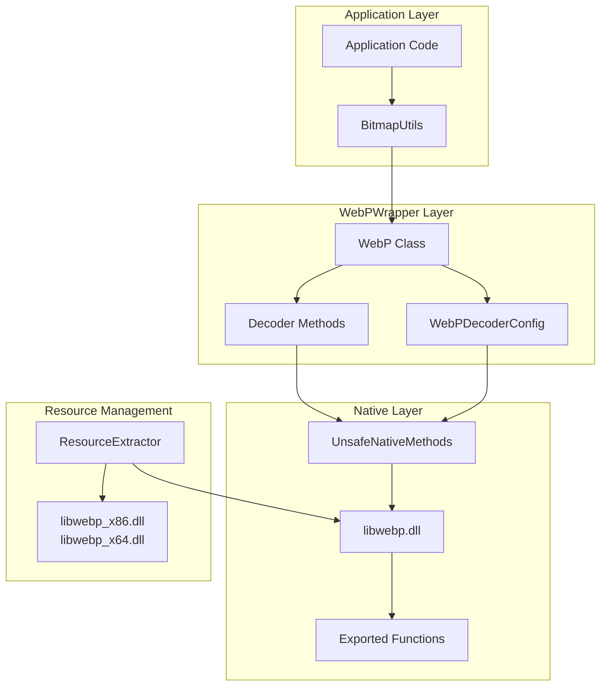
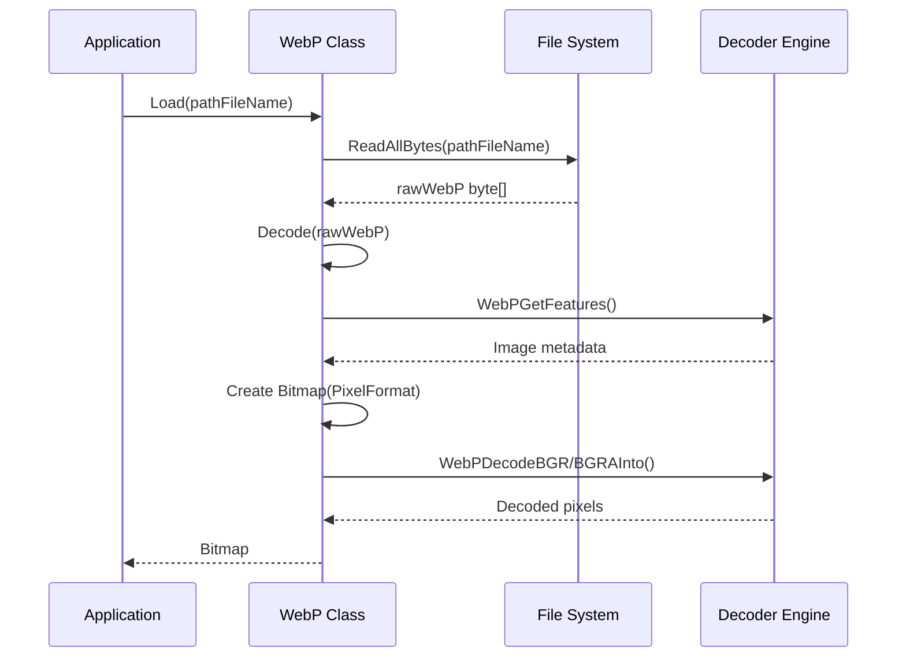
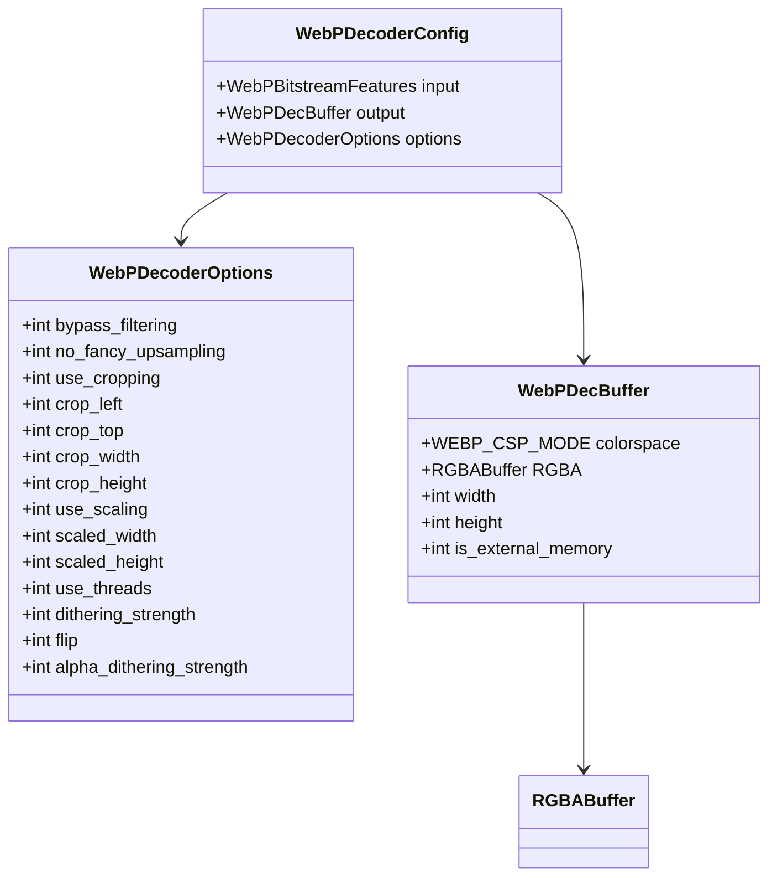
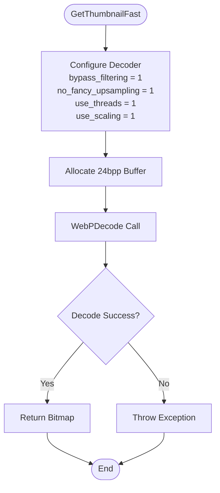
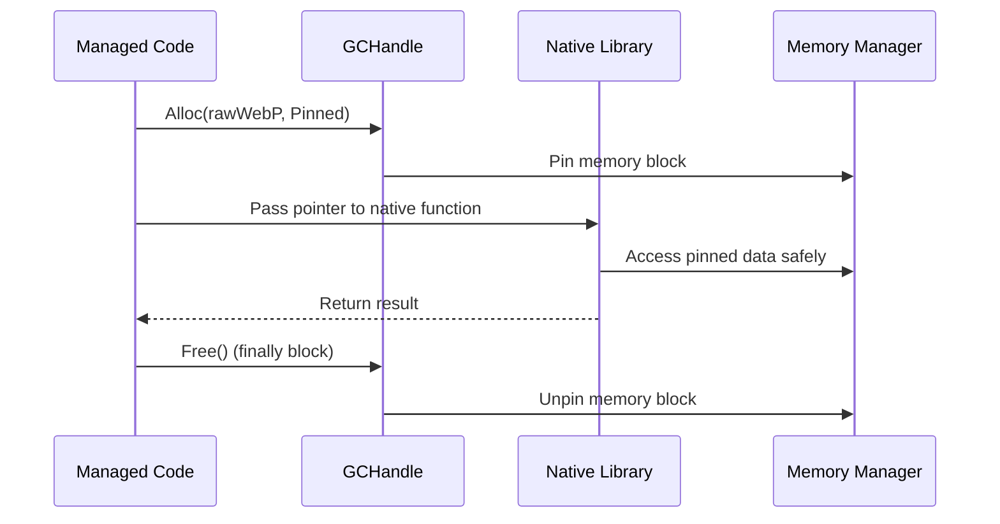

# WebP Decoding

<cite>
**Referenced Files in This Document**
- [WebPWrapper.cs](file://SETUNA/Plugins/WebPWrapper.cs)
- [Utils.cs](file://SETUNA/Main/Common/Utils.cs)
- [ResourceExtractor.cs](file://SETUNA/Plugins/ResourceExtractor.cs)
- [CPasteStyle.cs](file://SETUNA/Main/Style/CPasteStyle.cs)
- [CCopyStyleItem.cs](file://SETUNA/Main/StyleItems/CCopyStyleItem.cs)
</cite>

## Table of Contents
1. [Introduction](#introduction)
2. [Architecture Overview](#architecture-overview)
3. [Core WebPWrapper Class](#core-webpwrapper-class)
4. [Primary Decoding Methods](#primary-decoding-methods)
5. [Advanced Decoding with WebPDecoderConfig](#advanced-decoding-with-webpdecoderconfig)
6. [Thumbnail Generation Modes](#thumbnail-generation-modes)
7. [Memory Management and Performance](#memory-management-and-performance)
8. [Integration Examples](#integration-examples)
9. [Common Issues and Troubleshooting](#common-issues-and-troubleshooting)
10. [Version Compatibility](#version-compatibility)

## Introduction

The WebPWrapper class provides comprehensive WebP image decoding functionality for the SETUNA screenshot application. Built on top of Google's libwebp library, it offers multiple decoding approaches ranging from simple file loading to advanced configurations with cropping, scaling, and dithering capabilities. The wrapper handles the complexities of native library integration while providing a clean, managed interface for .NET applications.

The WebP format, developed by Google, offers superior compression efficiency compared to traditional formats like JPEG and PNG, making it ideal for modern image processing applications. This wrapper enables seamless integration of WebP support into Windows Forms applications with automatic resource extraction and robust error handling.

## Architecture Overview

The WebP decoding system follows a layered architecture that separates concerns between managed code and native library integration:

**Diagram sources**
- [WebPWrapper.cs](file://SETUNA/Plugins/WebPWrapper.cs#L32-L43)
- [ResourceExtractor.cs](file://SETUNA/Plugins/ResourceExtractor.cs#L5-L43)

**Section sources**
- [WebPWrapper.cs](file://SETUNA/Plugins/WebPWrapper.cs#L1-L50)
- [ResourceExtractor.cs](file://SETUNA/Plugins/ResourceExtractor.cs#L1-L43)

## Core WebPWrapper Class

The WebP class serves as the primary interface for WebP image operations, inheriting from IDisposable to ensure proper resource cleanup. The constructor automatically extracts the appropriate libwebp native library based on the platform architecture.

### Class Structure and Initialization

The WebP class maintains several key components:

- **Resource Extraction**: Automatic extraction of platform-specific libwebp DLLs
- **Memory Management**: Proper handling of GCHandle pinning for safe native interoperability
- **Exception Handling**: Comprehensive error reporting with contextual information
- **Platform Support**: Dual-architecture support for x86 and x64 platforms

### Internal Constants and Configuration

The class defines several important constants that govern operation limits and behavior:

- **WEBP_MAX_DIMENSION**: Maximum supported image dimensions (16,383 pixels)
- **WEBP_DECODER_ABI_VERSION**: Version compatibility marker for native library integration

**Section sources**
- [WebPWrapper.cs](file://SETUNA/Plugins/WebPWrapper.cs#L32-L43)

## Primary Decoding Methods

The WebPWrapper provides three primary decoding methods, each optimized for different use cases and performance requirements.

### Load Method

The Load method provides the simplest interface for reading WebP files from disk:

**Diagram sources**
- [WebPWrapper.cs](file://SETUNA/Plugins/WebPWrapper.cs#L47-L56)
- [WebPWrapper.cs](file://SETUNA/Plugins/WebPWrapper.cs#L61-L118)

### Decode Method

The basic Decode method handles raw WebP data with automatic pixel format detection:

**Key Features:**
- **Automatic Pixel Format Detection**: Determines Format24bppRgb or Format32bppArgb based on alpha channel presence
- **Direct Memory Copying**: Uses WebPDecodeBGRInto or WebPDecodeBGRAInto for optimal performance
- **Exception Context**: Provides detailed error messages with "In WebP.Decode" context
- **Resource Cleanup**: Ensures proper GCHandle and BitmapData disposal

### Decode with Options Method

The advanced Decode method accepts WebPDecoderOptions for fine-grained control:

**Advanced Capabilities:**
- **Cropping Support**: Precise region extraction with bounds checking
- **Scaling Operations**: Efficient resizing with configurable algorithms
- **Filter Control**: Bypass filtering for faster processing
- **Thread Utilization**: Multi-threaded decoding support
- **Dithering Options**: Alpha channel dithering for transparency effects

**Section sources**
- [WebPWrapper.cs](file://SETUNA/Plugins/WebPWrapper.cs#L47-L118)
- [WebPWrapper.cs](file://SETUNA/Plugins/WebPWrapper.cs#L125-L229)

## Advanced Decoding with WebPDecoderConfig

The WebPDecoderConfig structure enables sophisticated decoding scenarios through comprehensive configuration options.

### Configuration Structure

**Diagram sources**
- [WebPWrapper.cs](file://SETUNA/Plugins/WebPWrapper.cs#L2007-L2016)
- [WebPWrapper.cs](file://SETUNA/Plugins/WebPWrapper.cs#L2097-L2138)

### Decoding Process Flow

The advanced decoding process involves several critical steps:

1. **Configuration Initialization**: WebPInitDecoderConfig sets up the decoder structure
2. **Feature Detection**: WebPGetFeatures retrieves image metadata
3. **Option Validation**: Crop boundaries are verified against image dimensions
4. **Buffer Allocation**: Output buffer is prepared with appropriate pixel format
5. **Native Decoding**: WebPDecode performs the actual decompression
6. **Resource Cleanup**: Proper disposal of native resources

### Performance Characteristics

Advanced decoding offers several performance benefits:

- **Memory Efficiency**: External memory buffers reduce garbage collection pressure
- **Precision Control**: Fine-grained options enable optimal processing pipelines
- **Parallel Processing**: Thread utilization for multi-core systems
- **Optimized Algorithms**: Bypass filtering reduces computational overhead

**Section sources**
- [WebPWrapper.cs](file://SETUNA/Plugins/WebPWrapper.cs#L125-L229)

## Thumbnail Generation Modes

The WebPWrapper provides two distinct thumbnail generation approaches optimized for different quality/performance trade-offs.

### Fast Thumbnail Mode

Fast thumbnails prioritize processing speed over visual quality:

**Diagram sources**
- [WebPWrapper.cs](file://SETUNA/Plugins/WebPWrapper.cs#L236-L298)

**Fast Mode Characteristics:**
- **Bypass Filtering**: Eliminates post-processing for maximum speed
- **No Fancy Upsampling**: Uses nearest-neighbor interpolation
- **Single-threaded**: Minimal resource utilization
- **24-bit Color**: Reduced memory footprint

### Quality Thumbnail Mode

Quality thumbnails balance visual fidelity with reasonable performance:

**Quality Mode Features:**
- **Full Filtering**: Maintains image detail and smoothness
- **Fancy Upsampling**: Higher-quality scaling algorithms
- **Alpha Channel Support**: Preserves transparency when present
- **Dynamic Format Selection**: Chooses appropriate pixel format

### Performance Comparison

| Aspect | Fast Mode | Quality Mode |
|--------|-----------|--------------|
| Processing Speed | Very Fast | Moderate |
| Memory Usage | Lower | Higher |
| Visual Quality | Good | Excellent |
| Alpha Support | No | Yes |
| CPU Utilization | Single-threaded | Multi-threaded |

**Section sources**
- [WebPWrapper.cs](file://SETUNA/Plugins/WebPWrapper.cs#L236-L381)

## Memory Management and Performance

Effective memory management is crucial for WebP decoding operations, particularly when handling large images or batch processing scenarios.

### GCHandle Pinning Strategy

The WebPWrapper employs careful GCHandle management to ensure safe native interoperability:

**Diagram sources**
- [WebPWrapper.cs](file://SETUNA/Plugins/WebPWrapper.cs#L65-L118)
- [WebPWrapper.cs](file://SETUNA/Plugins/WebPWrapper.cs#L127-L229)

### BitmapData Locking Pattern

The wrapper uses a consistent pattern for managing BitmapData operations:

**Memory Safety Measures:**
- **Try-Finally Blocks**: Guaranteed cleanup regardless of exceptions
- **Null Checks**: Defensive programming against null references
- **Resource Disposal**: Proper release of unmanaged resources
- **Exception Context**: Detailed error reporting with operation identification

### Performance Optimization Techniques

Several optimization strategies enhance decoding performance:

- **Direct Memory Copying**: Minimizes managed/native boundary crossings
- **Pixel Format Optimization**: Selects optimal bit depths for target scenarios
- **Platform-Specific Libraries**: Architecture-aware native library selection
- **Buffer Reuse**: Minimizes allocation overhead in repeated operations

**Section sources**
- [WebPWrapper.cs](file://SETUNA/Plugins/WebPWrapper.cs#L65-L118)
- [WebPWrapper.cs](file://SETUNA/Plugins/WebPWrapper.cs#L127-L229)

## Integration Examples

The WebPWrapper integrates seamlessly with various application scenarios, from simple file operations to complex clipboard handling.

### Basic File Loading

Loading WebP images from disk follows a straightforward pattern:

**Usage Pattern:**
1. Instantiate WebP class
2. Call Load method with file path
3. Handle potential exceptions
4. Use resulting Bitmap object

### Clipboard Integration

The wrapper supports clipboard operations through integration with the broader application ecosystem:

**Clipboard Workflow:**
1. Check clipboard content availability
2. Extract image data
3. Detect WebP format
4. Decode using WebPWrapper
5. Present to user interface

### Utility Integration

The BitmapUtils class demonstrates practical WebP integration:

**Integration Benefits:**
- **Format Abstraction**: Unified interface across multiple image formats
- **Error Handling**: Graceful degradation for unsupported formats
- **Resource Management**: Consistent cleanup patterns
- **Performance Optimization**: Format-specific optimizations

**Section sources**
- [Utils.cs](file://SETUNA/Main/Common/Utils.cs#L40-L85)
- [CPasteStyle.cs](file://SETUNA/Main/Style/CPasteStyle.cs#L20-L26)
- [CCopyStyleItem.cs](file://SETUNA/Main/StyleItems/CCopyStyleItem.cs#L31-L35)

## Common Issues and Troubleshooting

Understanding common issues helps developers implement robust WebP decoding solutions.

### Memory Management Issues

**Problem**: Out-of-memory errors during large image processing
**Solution**: Implement streaming approaches or reduce image dimensions
**Prevention**: Monitor memory usage and implement proper disposal patterns

**Problem**: GCHandle leaks causing memory corruption
**Solution**: Ensure all GCHandle allocations are properly freed in finally blocks
**Prevention**: Use using statements and consistent cleanup patterns

### Version Compatibility Problems

**Problem**: Incompatible libwebp library versions
**Solution**: Verify library version compatibility and update as needed
**Prevention**: Implement version checking and graceful fallback mechanisms

**Problem**: Platform mismatches (x86 vs x64)
**Solution**: Ensure correct native library is extracted for target architecture
**Prevention**: Use automated resource extraction with architecture detection

### Decoding Failures

**Problem**: Invalid WebP data causing decode failures
**Solution**: Implement format validation before attempting decode
**Prevention**: Use WebPGetFeatures to verify data integrity

**Problem**: Unsupported WebP features causing decode errors
**Solution**: Implement feature detection and fallback strategies
**Prevention**: Test with various WebP variants and edge cases

### Performance Issues

**Problem**: Slow decoding for large images
**Solution**: Implement thumbnail generation or progressive loading
**Prevention**: Profile decoding performance and optimize accordingly

**Problem**: High memory usage during batch processing
**Solution**: Implement memory pooling and efficient resource management
**Prevention**: Monitor memory consumption and implement cleanup strategies

## Version Compatibility

The WebPWrapper maintains compatibility across multiple libwebp versions while providing graceful degradation for older implementations.

### Library Version Detection

The wrapper includes comprehensive version checking mechanisms:

**Version Features:**
- **ABI Version Checking**: Ensures compatible library interfaces
- **Feature Availability**: Detects advanced features in newer libraries
- **Graceful Degradation**: Falls back to simpler operations when needed
- **Error Reporting**: Clear messaging for version-related issues

### Supported Platforms

The wrapper supports multiple deployment scenarios:

**Platform Support:**
- **x86 Architecture**: Legacy system compatibility
- **x64 Architecture**: Modern system optimization
- **Mixed Mode**: Seamless operation across platform boundaries
- **Resource Extraction**: Automatic native library deployment

### Future Compatibility

The architecture supports future enhancements:

**Extensibility Features:**
- **Plugin Architecture**: Easy addition of new decoding methods
- **Configuration Expansion**: Flexible option system for new features
- **Performance Monitoring**: Built-in metrics for optimization
- **Error Recovery**: Robust error handling for unexpected conditions

**Section sources**
- [WebPWrapper.cs](file://SETUNA/Plugins/WebPWrapper.cs#L663-L676)
- [ResourceExtractor.cs](file://SETUNA/Plugins/ResourceExtractor.cs#L17-L25)