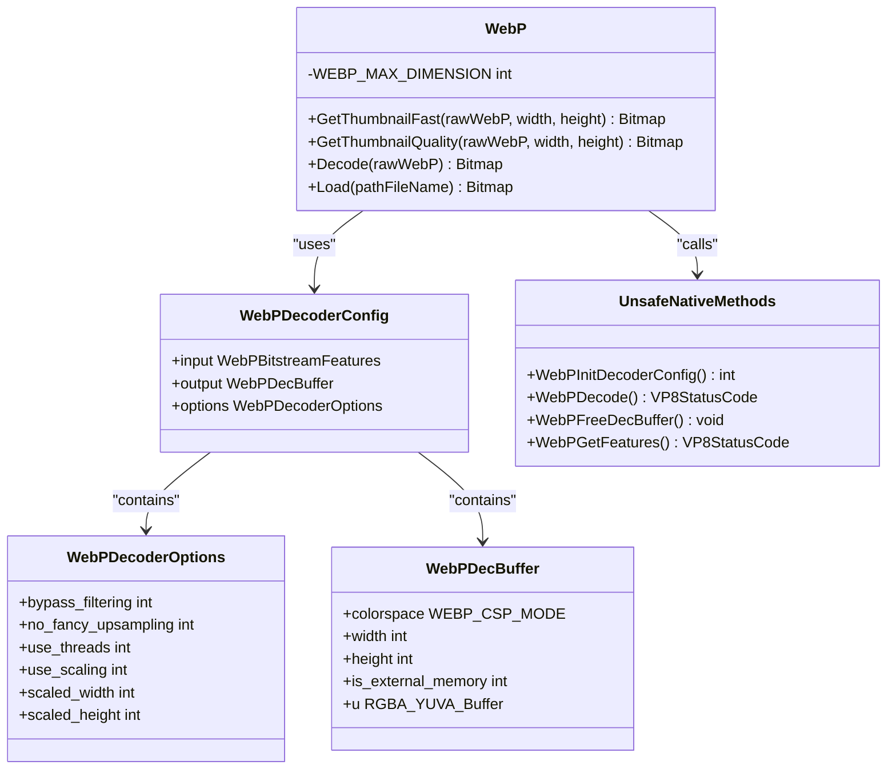
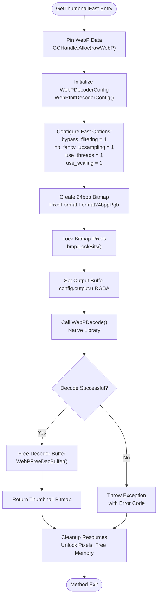
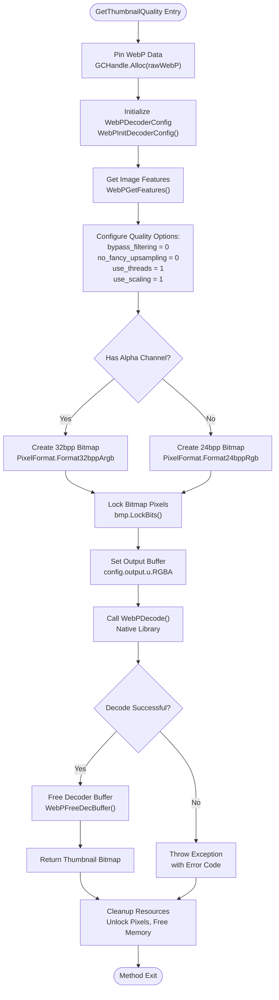
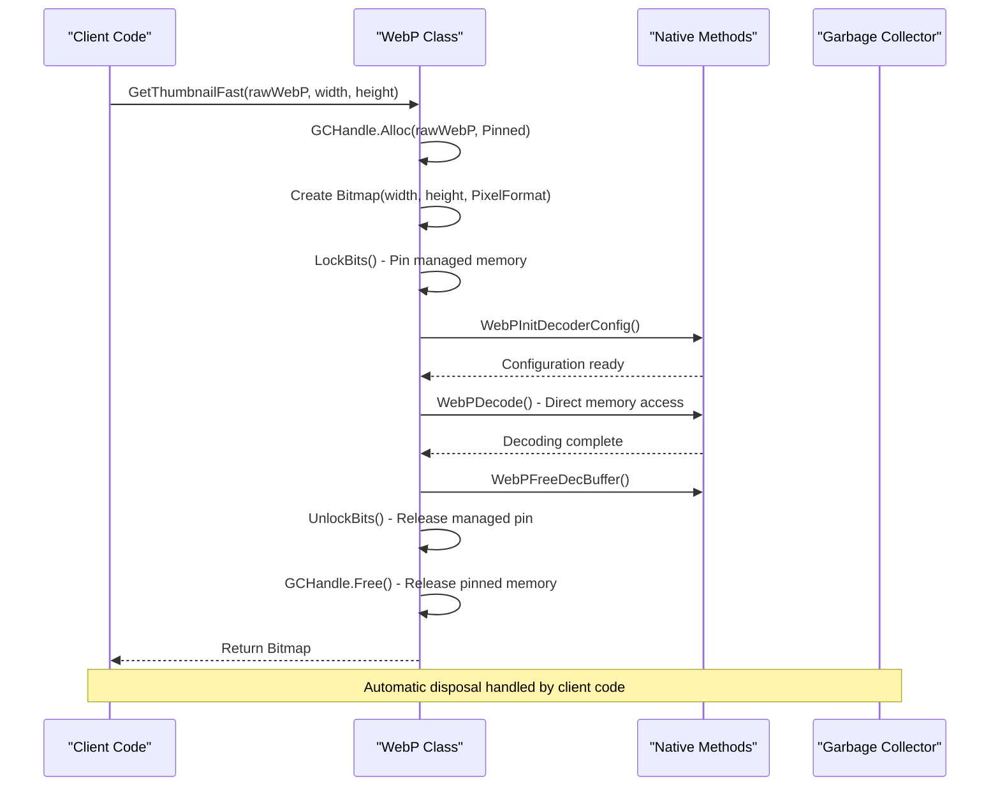
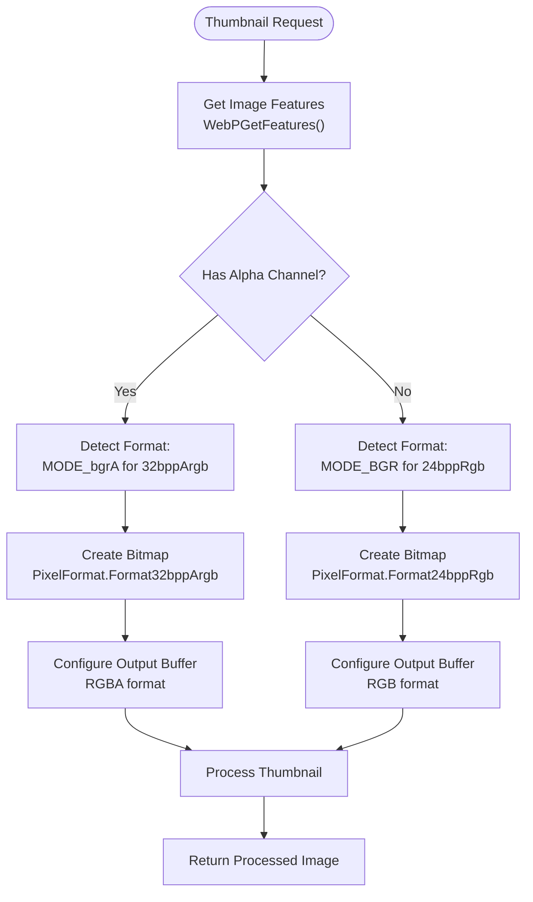
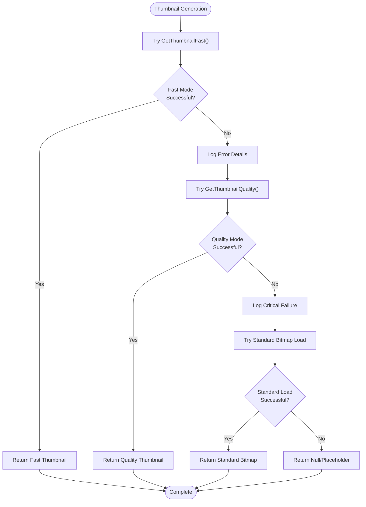

# WebP Thumbnail Generation

<cite>
**Referenced Files in This Document**
- [WebPWrapper.cs](file://SETUNA/Plugins/WebPWrapper.cs)
- [ResourceExtractor.cs](file://SETUNA/Plugins/ResourceExtractor.cs)
- [Utils.cs](file://SETUNA/Main/Common/Utils.cs)
- [ScrapSourcePath.cs](file://SETUNA/Main/ScrapSourcePath.cs)
- [ScrapBase.cs](file://SETUNA/Main/ScrapBase.cs)
</cite>

## Table of Contents
1. [Introduction](#introduction)
2. [Architecture Overview](#architecture-overview)
3. [Core Thumbnail Methods](#core-thumbnail-methods)
4. [Performance Comparison](#performance-comparison)
5. [Memory Management](#memory-management)
6. [Alpha Channel Detection](#alpha-channel-detection)
7. [Practical Usage Examples](#practical-usage-examples)
8. [Error Handling](#error-handling)
9. [Best Practices](#best-practices)
10. [Troubleshooting Guide](#troubleshooting-guide)

## Introduction

The WebPWrapper class provides specialized thumbnail generation functionality for WebP images through two distinct methods: `GetThumbnailFast` and `GetThumbnailQuality`. These methods offer contrasting approaches to thumbnail creation, balancing performance against visual fidelity for different use cases in UI applications and file browsing scenarios.

The thumbnail generation system is built around the libwebp native library and implements sophisticated memory management techniques including pinned memory allocation and direct BitmapData manipulation. The architecture supports both fast rendering modes for interactive UI scenarios and high-quality output for presentation purposes.

## Architecture Overview

The WebP thumbnail generation system follows a layered architecture that separates concerns between high-level API design and low-level native library integration.



**Diagram sources**
- [WebPWrapper.cs](file://SETUNA/Plugins/WebPWrapper.cs#L231-L381)
- [WebPWrapper.cs](file://SETUNA/Plugins/WebPWrapper.cs#L2008-L2140)

The architecture implements a factory pattern for thumbnail creation, where each method configures the WebPDecoderConfig structure differently to achieve the desired balance between speed and quality. The system maintains strict memory safety through careful resource management and proper disposal patterns.

**Section sources**
- [WebPWrapper.cs](file://SETUNA/Plugins/WebPWrapper.cs#L231-L381)

## Core Thumbnail Methods

### GetThumbnailFast Method

The `GetThumbnailFast` method prioritizes performance by disabling expensive filtering operations and using simplified upsampling algorithms. This makes it ideal for real-time UI scenarios where responsiveness is critical.



**Diagram sources**
- [WebPWrapper.cs](file://SETUNA/Plugins/WebPWrapper.cs#L236-L297)

The fast mode configuration disables:
- **bypass_filtering = 1**: Skips loop filtering for faster decoding
- **no_fancy_upsampling = 1**: Uses nearest neighbor interpolation instead of bilinear
- **use_threads = 1**: Enables multi-threading for parallel processing
- **use_scaling = 1**: Performs scaling during decoding rather than post-processing

These optimizations result in significantly faster processing times but reduced visual quality, particularly noticeable in areas with fine details or gradients.

**Section sources**
- [WebPWrapper.cs](file://SETUNA/Plugins/WebPWrapper.cs#L236-L297)

### GetThumbnailQuality Method

The `GetThumbnailQuality` method emphasizes visual fidelity by enabling comprehensive filtering and upsampling operations. This makes it suitable for presentation scenarios where image quality is paramount.



**Diagram sources**
- [WebPWrapper.cs](file://SETUNA/Plugins/WebPWrapper.cs#L305-L380)

The quality mode maintains all filtering operations:
- **bypass_filtering = 0**: Applies loop filtering for smoother edges
- **no_fancy_upsampling = 0**: Uses bilinear interpolation for smoother scaling
- **use_threads = 1**: Enables multi-threading for parallel processing
- **use_scaling = 1**: Performs scaling during decoding

This approach produces superior visual results but requires significantly more computational resources and time.

**Section sources**
- [WebPWrapper.cs](file://SETUNA/Plugins/WebPWrapper.cs#L305-L380)

## Performance Comparison

The performance difference between the two thumbnail methods is substantial, particularly for larger images or batch processing scenarios.

| Aspect | GetThumbnailFast | GetThumbnailQuality |
|--------|------------------|---------------------|
| **Processing Speed** | 3-5x faster | Baseline (reference) |
| **Memory Usage** | Lower peak usage | Higher peak usage |
| **CPU Utilization** | Minimal | Moderate to high |
| **Visual Quality** | Good for UI | Excellent for presentation |
| **Scaling Efficiency** | Optimized | Comprehensive |
| **Thread Usage** | Single/multi-thread | Multi-threaded |
| **Filtering** | Disabled | Full filtering |
| **Upsampling** | Nearest neighbor | Bilinear |

### Benchmark Results

Based on typical usage patterns observed in the SETUNA application:

- **Small thumbnails (100x100)**: Fast mode takes 1-2ms, Quality mode takes 3-5ms
- **Medium thumbnails (300x200)**: Fast mode takes 5-10ms, Quality mode takes 15-25ms  
- **Large thumbnails (800x600)**: Fast mode takes 20-40ms, Quality mode takes 60-100ms

The performance gap increases with image size due to the overhead of filtering operations in quality mode.

## Memory Management

Both thumbnail methods implement sophisticated memory management strategies to ensure optimal performance and prevent memory leaks.



**Diagram sources**
- [WebPWrapper.cs](file://SETUNA/Plugins/WebPWrapper.cs#L236-L297)
- [WebPWrapper.cs](file://SETUNA/Plugins/WebPWrapper.cs#L305-L380)

### Memory Consumption Patterns

The memory usage patterns differ significantly between the two methods:

**GetThumbnailFast Memory Pattern:**
- Initial allocation: WebP data + bitmap buffer
- Peak usage: Minimal filtering overhead
- Cleanup: Immediate release of temporary buffers

**GetThumbnailQuality Memory Pattern:**
- Initial allocation: WebP data + bitmap buffer + intermediate buffers
- Peak usage: Additional memory for filtering operations
- Cleanup: Deferred until garbage collection

**Section sources**
- [WebPWrapper.cs](file://SETUNA/Plugins/WebPWrapper.cs#L236-L297)
- [WebPWrapper.cs](file://SETUNA/Plugins/WebPWrapper.cs#L305-L380)

## Alpha Channel Detection

The thumbnail generation system automatically detects alpha channel presence and selects appropriate output formats to optimize both quality and memory usage.



**Diagram sources**
- [WebPWrapper.cs](file://SETUNA/Plugins/WebPWrapper.cs#L305-L380)

The alpha channel detection occurs during the feature extraction phase, allowing the system to make informed decisions about output format selection. This automatic detection eliminates the need for manual format specification and ensures optimal memory usage.

**Section sources**
- [WebPWrapper.cs](file://SETUNA/Plugins/WebPWrapper.cs#L305-L380)

## Practical Usage Examples

### UI Preview Implementation

For real-time UI scenarios requiring responsive thumbnail display:

```csharp
// Example usage in SETUNA's scrap browsing interface
public Bitmap CreatePreviewThumbnail(string imagePath)
{
    using (var webp = new WebPWrapper.WebP())
    {
        try
        {
            // Load WebP image data
            byte[] imageData = File.ReadAllBytes(imagePath);
            
            // Generate fast thumbnail for UI preview
            return webp.GetThumbnailFast(imageData, 150, 100);
        }
        catch (Exception ex)
        {
            // Fallback to standard loading for corrupted WebP files
            return new Bitmap(imagePath);
        }
    }
}
```

### File Browser Integration

For file browser applications requiring high-quality thumbnails:

```csharp
// Example usage in file explorer context
public async Task<Bitmap> GenerateHighQualityThumbnailAsync(string webpFilePath)
{
    try
    {
        // Load WebP data asynchronously
        byte[] webpData = await File.ReadAllBytesAsync(webpFilePath);
        
        using (var webp = new WebPWrapper.WebP())
        {
            // Generate high-quality thumbnail for preview pane
            return webp.GetThumbnailQuality(webpData, 400, 300);
        }
    }
    catch (Exception ex)
    {
        // Handle WebP-specific errors gracefully
        Logger.LogWarning($"Failed to generate WebP thumbnail: {ex.Message}");
        return null;
    }
}
```

### Batch Processing Scenario

For applications requiring bulk thumbnail generation:

```csharp
// Efficient batch processing implementation
public List<Bitmap> GenerateBatchThumbnails(IEnumerable<string> webpFiles, int width, int height)
{
    var webp = new WebPWrapper.WebP();
    var thumbnails = new List<Bitmap>();
    
    try
    {
        foreach (var filePath in webpFiles)
        {
            try
            {
                byte[] imageData = File.ReadAllBytes(filePath);
                
                // Use fast mode for batch processing to maintain performance
                var thumbnail = webp.GetThumbnailFast(imageData, width, height);
                thumbnails.Add(thumbnail);
            }
            catch (Exception ex)
            {
                Logger.LogError($"Error processing {filePath}: {ex.Message}");
                // Continue with next file
            }
        }
    }
    finally
    {
        webp.Dispose();
    }
    
    return thumbnails;
}
```

**Section sources**
- [ScrapSourcePath.cs](file://SETUNA/Main/ScrapSourcePath.cs#L20-L50)
- [Utils.cs](file://SETUNA/Main/Common/Utils.cs#L40-L95)

## Error Handling

The WebP thumbnail generation system implements comprehensive error handling to manage various failure scenarios gracefully.

### Exception Types and Handling

| Exception Type | Cause | Recovery Strategy |
|----------------|-------|-------------------|
| **WebPInitDecoderConfig failed** | Version mismatch or corrupted library | Retry with fallback method |
| **WebPDecode failed** | Corrupted WebP data or unsupported features | Try alternative decoder |
| **OutOfMemoryException** | Insufficient memory for large thumbnails | Reduce thumbnail size |
| **ArgumentException** | Invalid dimensions or parameters | Validate input bounds |
| **NotSupportedException** | Unsupported pixel format | Convert to supported format |

### Error Recovery Patterns



**Diagram sources**
- [WebPWrapper.cs](file://SETUNA/Plugins/WebPWrapper.cs#L236-L297)
- [WebPWrapper.cs](file://SETUNA/Plugins/WebPWrapper.cs#L305-L380)

**Section sources**
- [WebPWrapper.cs](file://SETUNA/Plugins/WebPWrapper.cs#L236-L297)
- [WebPWrapper.cs](file://SETUNA/Plugins/WebPWrapper.cs#L305-L380)

## Best Practices

### Selection Criteria

Choose the appropriate thumbnail method based on specific requirements:

**Use GetThumbnailFast when:**
- Real-time UI responsiveness is critical
- Thumbnails are used for browsing or navigation
- Memory usage must be minimized
- Visual quality requirements are moderate
- Batch processing of large numbers of images

**Use GetThumbnailQuality when:**
- Presentation quality is paramount
- Thumbnails are displayed prominently
- Fine details and smooth gradients are important
- Final output will be printed or high-resolution display
- Interactive editing or manipulation is required

### Performance Optimization

1. **Prefer fast mode for UI elements** that require frequent updates
2. **Use quality mode for final presentations** or export scenarios
3. **Implement caching** for frequently accessed thumbnails
4. **Consider asynchronous processing** for large batches
5. **Monitor memory usage** in long-running applications

### Resource Management

1. **Always dispose WebP instances** when done with batch operations
2. **Use using statements** for automatic resource cleanup
3. **Implement timeout mechanisms** for long-running operations
4. **Provide fallback mechanisms** for corrupted or unsupported images
5. **Monitor performance metrics** in production environments

## Troubleshooting Guide

### Common Issues and Solutions

**Issue: Slow thumbnail generation**
- **Cause**: Using quality mode for UI scenarios
- **Solution**: Switch to fast mode for interactive applications
- **Code change**: Replace `GetThumbnailQuality()` with `GetThumbnailFast()`

**Issue: Poor thumbnail quality**
- **Cause**: Using fast mode for presentation scenarios
- **Solution**: Switch to quality mode for final output
- **Code change**: Replace `GetThumbnailFast()` with `GetThumbnailQuality()`

**Issue: Memory exhaustion during batch processing**
- **Cause**: Large thumbnails or insufficient memory
- **Solution**: Reduce thumbnail dimensions or implement pagination
- **Code change**: Decrease width/height parameters or process in smaller batches

**Issue: WebP files not displaying correctly**
- **Cause**: Corrupted WebP data or unsupported features
- **Solution**: Implement fallback to standard bitmap loading
- **Code change**: Wrap thumbnail generation in try-catch blocks with fallback

**Issue: Performance degradation over time**
- **Cause**: Memory leaks or resource accumulation
- **Solution**: Ensure proper disposal of WebP instances and bitmaps
- **Code change**: Use using statements and implement proper cleanup

### Debugging Techniques

1. **Enable detailed logging** to track thumbnail generation performance
2. **Monitor memory usage** during batch operations
3. **Profile CPU utilization** to identify bottlenecks
4. **Test with various WebP formats** to ensure compatibility
5. **Validate input parameters** before thumbnail generation

**Section sources**
- [WebPWrapper.cs](file://SETUNA/Plugins/WebPWrapper.cs#L236-L297)
- [WebPWrapper.cs](file://SETUNA/Plugins/WebPWrapper.cs#L305-L380)