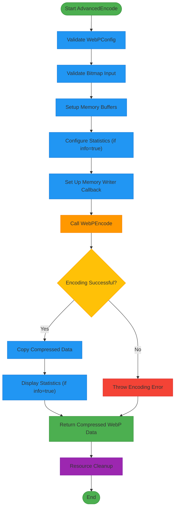
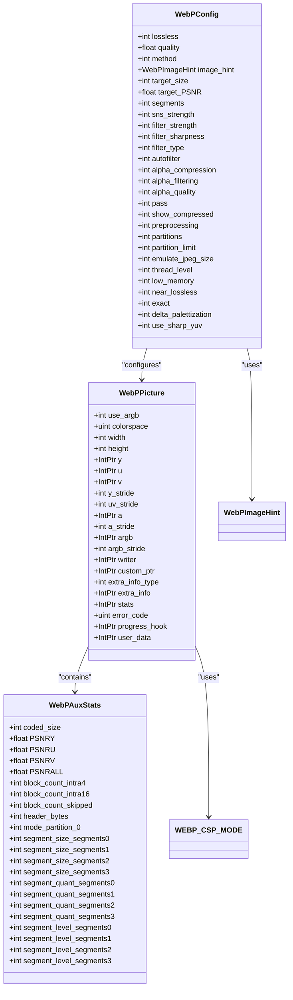
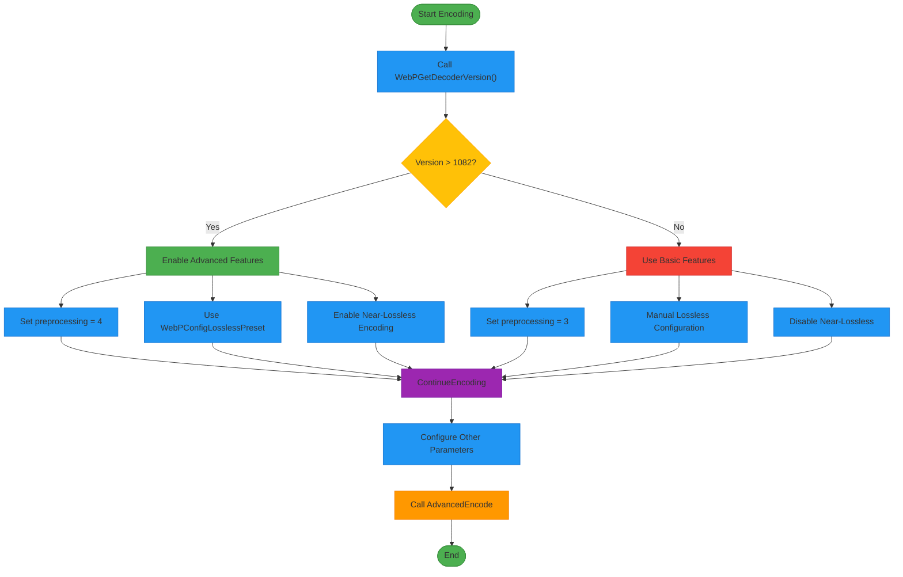
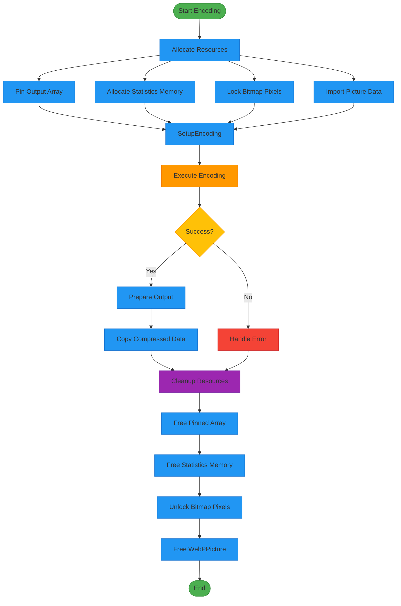

# Advanced Encoding Configuration

<cite>
**Referenced Files in This Document**   
- [WebPWrapper.cs](file://SETUNA/Plugins/WebPWrapper.cs)
</cite>

## Table of Contents
1. [Introduction](#introduction)
2. [Core Encoding Engine](#core-encoding-engine)
3. [WebP Configuration Structure](#webp-configuration-structure)
4. [Configuration Parameter Settings](#configuration-parameter-settings)
5. [Version Compatibility Logic](#version-compatibility-logic)
6. [Memory Management](#memory-management)
7. [Performance Characteristics](#performance-characteristics)
8. [Common Issues and Solutions](#common-issues-and-solutions)

## Introduction
The AdvancedEncode method serves as the central encoding engine for WebP image compression in the SETUNA application. This internal method provides a unified interface for both lossy and lossless encoding operations by accepting a WebPConfig structure that contains all compression parameters. The implementation leverages the libwebp library through P/Invoke calls to native functions, enabling high-performance image compression with extensive configurability. This document details the advanced configuration options available through the WebPConfig structure, the conditional logic based on libwebp version compatibility, and the memory management practices employed to ensure efficient resource utilization.

**Section sources**
- [WebPWrapper.cs](file://SETUNA/Plugins/WebPWrapper.cs#L888-L1064)

## Core Encoding Engine
The AdvancedEncode method is the primary encoding function that orchestrates the entire compression process. It accepts a Bitmap object, a WebPConfig structure containing compression parameters, and a boolean flag indicating whether to display compression statistics. The method first validates the configuration using WebPValidateConfig, ensuring all parameters are within acceptable ranges before proceeding with compression.

The encoding process follows a structured workflow: input validation, memory allocation, configuration setup, compression execution, and resource cleanup. The method handles both 24-bit RGB and 32-bit ARGB pixel formats, automatically detecting the appropriate format from the input bitmap. For ARGB images, the method sets the colorspace to MODE_bgrA to properly handle alpha channel data during compression.

**Diagram sources**
- [WebPWrapper.cs](file://SETUNA/Plugins/WebPWrapper.cs#L888-L1064)

**Section sources**
- [WebPWrapper.cs](file://SETUNA/Plugins/WebPWrapper.cs#L888-L1064)

## WebP Configuration Structure
The WebPConfig structure is the central configuration object that controls all aspects of the encoding process. This structure contains numerous parameters that influence compression quality, speed, and output characteristics. The structure is defined with LayoutKind.Sequential to ensure proper memory layout when passed to native code.

Key configuration parameters include:
- **lossless**: Flag to enable lossless compression (1) or lossy compression (0)
- **quality**: Quality setting from 0 (lowest quality, smallest file) to 100 (highest quality, largest file)
- **method**: Speed/quality trade-off from 0 (fastest) to 6 (slowest, best compression)
- **autofilter**: Auto-adjust filter strength (0=off, 1=on)
- **alpha_quality**: Quality setting specifically for alpha channel compression
- **preprocessing**: Preprocessing filter level (0=none, up to 4 for advanced preprocessing)

The structure also includes parameters for advanced features such as spatial noise shaping (sns_strength), filter strength and sharpness, entropy analysis passes, and thread-level parallelism. These parameters allow fine-grained control over the compression algorithm to optimize for specific use cases.

**Diagram sources**
- [WebPWrapper.cs](file://SETUNA/Plugins/WebPWrapper.cs#L1774-L1834)
- [WebPWrapper.cs](file://SETUNA/Plugins/WebPWrapper.cs#L1837-L1904)

**Section sources**
- [WebPWrapper.cs](file://SETUNA/Plugins/WebPWrapper.cs#L1774-L1834)

## Configuration Parameter Settings
The encoding methods in the WebP class set various configuration parameters in the WebPConfig structure before calling AdvancedEncode. These parameters control the compression behavior and allow users to balance between file size, quality, and encoding speed.

For lossy encoding, the EncodeLossy method sets several key parameters:
- **quality**: Directly set from the quality parameter (0-100)
- **autofilter**: Enabled (set to 1) to automatically adjust filter strength
- **pass**: Set to speed + 1 for entropy analysis passes
- **segments**: Fixed at 4 for maximum segmentation
- **partitions**: Set to 3 for token partitions
- **thread_level**: Enabled (1) for multi-threaded encoding
- **alpha_quality**: Set to the same value as quality for alpha channel
- **alpha_filtering**: Set to 2 (best) for optimal alpha compression
- **use_sharp_yuv**: Enabled (1) for sharp RGB to YUV conversion

The preprocessing parameter is particularly interesting as it's set conditionally based on the libwebp version. For versions greater than 1082, preprocessing is set to 4 (strongest), while older versions use preprocessing level 3. This demonstrates the library's ability to adapt to different version capabilities.

For lossless encoding, the EncodeLossless method with speed parameter configures the WebPConfig structure differently:
- **lossless**: Set to 1 to enable lossless compression
- **method**: Set to the speed parameter (clamped to maximum of 6)
- **quality**: Set to (speed + 1) * 10, creating a linear relationship between speed and quality
- **pass**: Set to speed + 1 for entropy analysis passes
- **alpha_filtering**: Set to 2 (best) for optimal alpha compression
- **exact**: Set to 0 to allow discarding invisible RGB information for better compression

Near-lossless encoding, available only in newer library versions, uses the near_lossless parameter to control the maximum loss allowed, with 0 being maximum loss and 100 being lossless.

**Section sources**
- [WebPWrapper.cs](file://SETUNA/Plugins/WebPWrapper.cs#L478-L517)
- [WebPWrapper.cs](file://SETUNA/Plugins/WebPWrapper.cs#L585-L622)
- [WebPWrapper.cs](file://SETUNA/Plugins/WebPWrapper.cs#L629-L659)

## Version Compatibility Logic
The WebPWrapper implementation includes sophisticated version compatibility logic to ensure functionality across different versions of the libwebp library. This is primarily achieved through the WebPGetDecoderVersion function, which returns the version of the libwebp library as an integer.

The version check is used in several critical places:
- **Preprocessing level selection**: For versions greater than 1082, preprocessing level 4 is used; otherwise, level 3 is used
- **Lossless preset configuration**: The WebPConfigLosslessPreset function is only called on versions greater than 1082
- **Near-lossless encoding**: This feature is only available on versions greater than 1082

The version number is encoded as a 24-bit integer with 8 bits each for major, minor, and revision numbers. For example, version 2.8.2 would be encoded as 0x020802. The code compares this value against 1082 (0x043A) to determine feature availability.

**Diagram sources**
- [WebPWrapper.cs](file://SETUNA/Plugins/WebPWrapper.cs#L506-L514)
- [WebPWrapper.cs](file://SETUNA/Plugins/WebPWrapper.cs#L597-L603)
- [WebPWrapper.cs](file://SETUNA/Plugins/WebPWrapper.cs#L631-L635)

**Section sources**
- [WebPWrapper.cs](file://SETUNA/Plugins/WebPWrapper.cs#L506-L514)

## Memory Management
The WebPWrapper implementation employs careful memory management practices to prevent leaks and ensure proper resource disposal. The encoding process involves several unmanaged resources that must be properly freed, including memory allocated by the libwebp library and pinned managed arrays.

The AdvancedEncode method uses a comprehensive try-finally block to ensure all resources are freed even if an exception occurs. The key memory management operations include:

1. **Pinned array handling**: The output data buffer is created as a managed byte array and pinned using GCHandle.Alloc to prevent the garbage collector from moving it. This pinned handle is always freed in the finally block.

2. **Statistics memory**: When compression statistics are requested, memory is allocated using Marshal.AllocHGlobal and must be freed with Marshal.FreeHGlobal.

3. **Bitmap data unlocking**: The input bitmap's pixel data is locked using LockBits and must be unlocked with UnlockBits to release the memory lock.

4. **WebPPicture cleanup**: The WebPPicture structure may contain allocated memory that must be freed using WebPPictureFree.

5. **Unmanaged data cleanup**: For simpler encoding methods, unmanaged memory returned by libwebp functions is freed using WebPFree.

The implementation also includes platform-specific handling through conditional compilation, with separate function imports for x86 and x64 architectures. The WebPFree method dispatches to the appropriate architecture-specific implementation based on IntPtr.Size.

**Diagram sources**
- [WebPWrapper.cs](file://SETUNA/Plugins/WebPWrapper.cs#L1039-L1063)
- [WebPWrapper.cs](file://SETUNA/Plugins/WebPWrapper.cs#L459-L469)

**Section sources**
- [WebPWrapper.cs](file://SETUNA/Plugins/WebPWrapper.cs#L1039-L1063)

## Performance Characteristics
The configuration parameters in the WebPConfig structure have significant impacts on both compression ratio and encoding time. Understanding these trade-offs is essential for optimizing the encoding process for specific use cases.

The **method** parameter provides the primary speed/quality trade-off, with values from 0 (fastest) to 6 (slowest, best compression). Higher method values enable more sophisticated compression techniques but significantly increase encoding time. The relationship between method and encoding time is non-linear, with each increment typically doubling the processing time.

The **quality** parameter directly affects the compression ratio, with higher values producing larger files with better visual quality. For lossy compression, quality values above 90 provide diminishing returns in visual quality while significantly increasing file size. For lossless compression, the quality parameter affects the compression effort, with higher values resulting in better compression ratios at the cost of longer encoding times.

The **autofilter** parameter can improve compression efficiency by automatically adjusting filter strength based on image content. While this adds some computational overhead, it often results in better compression ratios, particularly for images with mixed content types.

Multi-threading, controlled by the **thread_level** parameter, can significantly improve encoding performance on multi-core systems. With thread_level set to 1, the encoder can utilize multiple CPU cores, potentially reducing encoding time by 30-50% on modern hardware.

Preprocessing filters (controlled by the **preprocessing** parameter) can improve compression efficiency by preparing the image data before compression. Higher preprocessing levels (3-4) are particularly effective for images with text or sharp edges, improving compression ratios by 10-20% with minimal impact on encoding time.

**Section sources**
- [WebPWrapper.cs](file://SETUNA/Plugins/WebPWrapper.cs#L496-L514)
- [WebPWrapper.cs](file://SETUNA/Plugins/WebPWrapper.cs#L591-L614)

## Common Issues and Solutions
Several common issues can arise when using the advanced WebP encoding functionality, primarily related to version compatibility, memory management, and configuration errors.

**Version Compatibility Issues**: The most common issue is attempting to use features not available in the installed libwebp version. The near-lossless encoding feature, for example, is only available in versions greater than 1082. Applications should check the library version using GetVersion() before attempting to use advanced features.

**Memory Leaks**: Improper resource cleanup can lead to memory leaks, particularly when exceptions occur during encoding. The try-finally pattern used in the implementation helps prevent this, but applications should ensure they properly dispose of the WebP object.

**Configuration Errors**: Invalid configuration parameters can cause encoding to fail. The WebPValidateConfig function should be used to validate configurations before encoding. Common configuration issues include invalid quality values (outside 0-100 range) or incompatible parameter combinations.

**Platform Compatibility**: The implementation includes separate DLLs for x86 and x64 architectures. Applications must ensure the appropriate DLL is available for the target platform. The code automatically selects the correct version based on IntPtr.Size.

**Large Image Handling**: Images larger than WEBP_MAX_DIMENSION (16383 pixels in either dimension) cannot be encoded and will throw a NotSupportedException. Applications should resize large images before encoding.

**Alpha Channel Issues**: Images with alpha channels require special handling to ensure transparency is preserved correctly. The exact parameter controls whether RGB values under transparent areas are preserved (exact=1) or discarded for better compression (exact=0).

**Section sources**
- [WebPWrapper.cs](file://SETUNA/Plugins/WebPWrapper.cs#L631-L635)
- [WebPWrapper.cs](file://SETUNA/Plugins/WebPWrapper.cs#L900-L904)
- [WebPWrapper.cs](file://SETUNA/Plugins/WebPWrapper.cs#L912-L915)