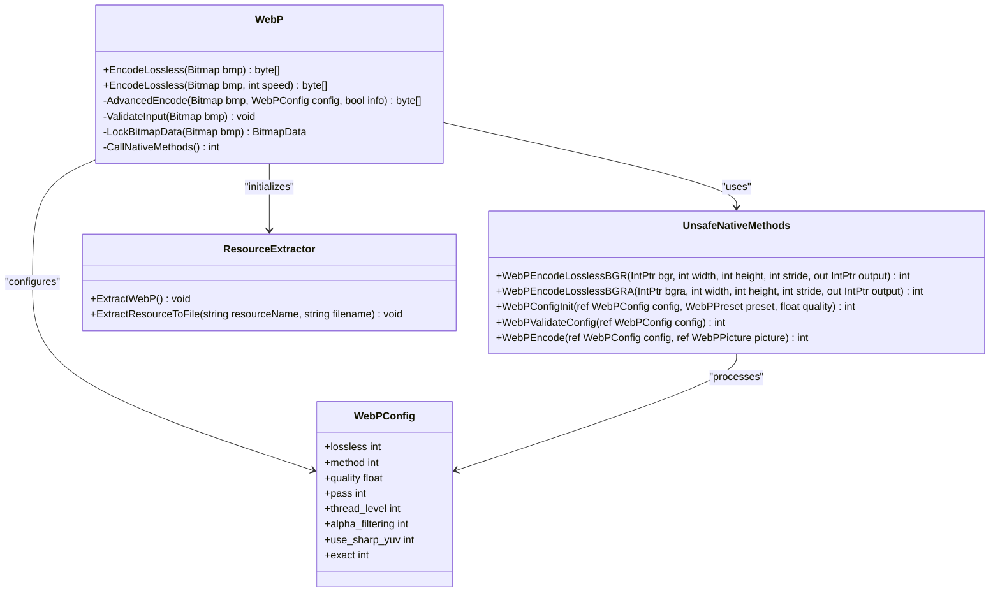
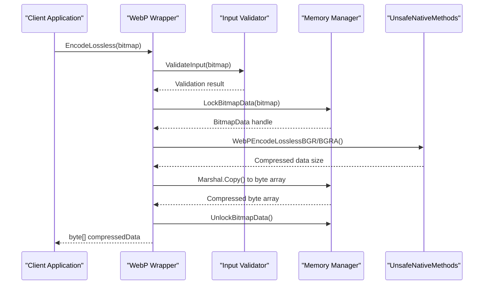
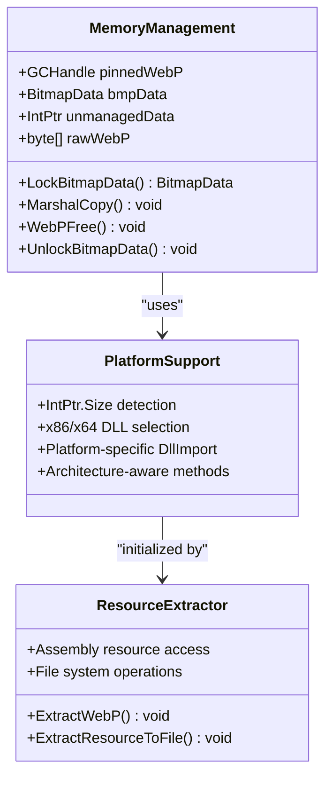

# Lossless Encoding

<cite>
**Referenced Files in This Document**
- [WebPWrapper.cs](file://SETUNA/Plugins/WebPWrapper.cs)
- [ResourceExtractor.cs](file://SETUNA/Plugins/ResourceExtractor.cs)
</cite>

## Table of Contents
1. [Introduction](#introduction)
2. [Architecture Overview](#architecture-overview)
3. [Core Lossless Encoding Methods](#core-lossless-encoding-methods)
4. [Implementation Details](#implementation-details)
5. [Performance Considerations](#performance-considerations)
6. [Practical Applications](#practical-applications)
7. [Common Issues and Solutions](#common-issues-and-solutions)
8. [Best Practices](#best-practices)
9. [Troubleshooting Guide](#troubleshooting-guide)
10. [Conclusion](#conclusion)

## Introduction

The WebP lossless encoding functionality in the SETUNA project provides pixel-perfect image compression using the libwebp library. Unlike lossy compression methods that sacrifice image quality for smaller file sizes, lossless encoding preserves all original image data while still achieving significant compression ratios. This makes it ideal for archival purposes, high-quality image storage, and scenarios where pixel-perfect reproduction is mandatory.

The implementation offers two primary encoding approaches: a simple overload for basic lossless compression and an advanced version with speed parameter control for optimizing compression efficiency. Both methods leverage the native libwebp library through a managed wrapper that handles memory management, platform-specific optimizations, and error handling.

## Architecture Overview

The lossless encoding functionality is built around a comprehensive wrapper architecture that bridges .NET managed code with native libwebp libraries. The system automatically extracts platform-specific DLLs and provides a clean API surface for developers.



**Diagram sources**
- [WebPWrapper.cs](file://SETUNA/Plugins/WebPWrapper.cs#L32-L2141)
- [ResourceExtractor.cs](file://SETUNA/Plugins/ResourceExtractor.cs#L6-L43)

**Section sources**
- [WebPWrapper.cs](file://SETUNA/Plugins/WebPWrapper.cs#L32-L2141)
- [ResourceExtractor.cs](file://SETUNA/Plugins/ResourceExtractor.cs#L6-L43)

## Core Lossless Encoding Methods

The WebP wrapper provides two distinct overloads for lossless encoding, each serving different use cases and performance requirements.

### Simple Lossless Encoding

The simplest form of lossless encoding requires only a Bitmap input and produces a compressed WebP byte array. This method is optimized for ease of use and covers most common scenarios where basic lossless compression is sufficient.



**Diagram sources**
- [WebPWrapper.cs](file://SETUNA/Plugins/WebPWrapper.cs#L522-L580)

### Advanced Lossless Encoding with Speed Control

The advanced encoding method provides fine-grained control over compression speed and efficiency through a speed parameter ranging from 0 (fastest, lowest compression) to 9 (slowest, best compression). This method utilizes the WebPConfig structure to optimize compression parameters based on the specified speed level.

```mermaid
flowchart TD
Start([EncodeLossless with Speed]) --> InitConfig["Initialize WebPConfig"]
InitConfig --> SetPreset["Set WebPConfigInit with preset"]
SetPreset --> CheckVersion{"Check libwebp version"}
CheckVersion --> |New Version (> 1082)| UseLosslessPreset["Use WebPConfigLosslessPreset()"]
CheckVersion --> |Old Version| ManualConfig["Manual configuration"]
UseLosslessPreset --> ConfigureParams["Configure compression parameters"]
ManualConfig --> ConfigureParams
ConfigureParams --> CallAdvanced["Call AdvancedEncode()"]
CallAdvanced --> Return([Return compressed data])
```

**Diagram sources**
- [WebPWrapper.cs](file://SETUNA/Plugins/WebPWrapper.cs#L585-L621)

**Section sources**
- [WebPWrapper.cs](file://SETUNA/Plugins/WebPWrapper.cs#L522-L621)

## Implementation Details

### Input Validation and Preprocessing

Both encoding methods begin with comprehensive input validation to ensure image integrity and compatibility with the libwebp library constraints.

| Validation Check | Purpose | Error Handling |
|------------------|---------|----------------|
| Dimension Limits | Enforce WEBP_MAX_DIMENSION (16383x16383) | NotSupportedException |
| Pixel Format | Require Format24bppRgb or Format32bppArgb | NotSupportedException |
| Size Validation | Verify non-zero dimensions | ArgumentException |
| Library Version | Ensure compatibility with features | Version-dependent exceptions |

### Memory Management and Platform Support

The implementation employs sophisticated memory management techniques to handle both managed and unmanaged resources efficiently across different platforms.



**Diagram sources**
- [WebPWrapper.cs](file://SETUNA/Plugins/WebPWrapper.cs#L540-L578)
- [ResourceExtractor.cs](file://SETUNA/Plugins/ResourceExtractor.cs#L9-L25)

### Native Method Calls

The core compression functionality relies on direct calls to libwebp native methods, which are dynamically selected based on the target platform architecture.

| Method | Purpose | Supported Formats |
|--------|---------|-------------------|
| WebPEncodeLosslessBGR | Lossless compression for RGB images | Format24bppRgb |
| WebPEncodeLosslessBGRA | Lossless compression for RGBA images | Format32bppArgb |
| WebPConfigInit | Initialize compression configuration | All methods |
| WebPValidateConfig | Validate configuration parameters | Advanced encoding |

**Section sources**
- [WebPWrapper.cs](file://SETUNA/Plugins/WebPWrapper.cs#L522-L621)
- [WebPWrapper.cs](file://SETUNA/Plugins/WebPWrapper.cs#L1511-L1550)

## Performance Considerations

### Speed Parameter Impact

The speed parameter significantly affects both compression ratio and processing time. Higher speed values prioritize faster encoding at the cost of slightly reduced compression efficiency.

| Speed Level | Compression Ratio | Processing Time | Use Case |
|-------------|------------------|-----------------|----------|
| 0-2 | Lower | Fastest | Real-time applications |
| 3-5 | Moderate | Medium | General purpose |
| 6-8 | Higher | Slower | Archive quality |
| 9 | Highest | Slowest | Maximum compression |

### Memory Usage Patterns

Lossless encoding requires careful memory management due to the nature of preserving all image data:

- **Temporary Buffer Allocation**: Up to 32 bits per pixel for intermediate processing
- **Managed Heap**: Original Bitmap data remains in managed memory until processed
- **Unmanaged Heap**: Native libwebp allocations for compression operations
- **Garbage Collection**: Automatic cleanup of managed resources after encoding completion

### Platform-Specific Optimizations

The implementation includes several platform-specific optimizations:

- **Architecture Detection**: Automatic selection of appropriate DLL (x86 vs x64)
- **Memory Alignment**: Platform-specific memory allocation strategies
- **Calling Conventions**: Proper CDECL calling convention for native interop
- **Error Handling**: Platform-consistent exception propagation

**Section sources**
- [WebPWrapper.cs](file://SETUNA/Plugins/WebPWrapper.cs#L585-L621)
- [ResourceExtractor.cs](file://SETUNA/Plugins/ResourceExtractor.cs#L17-L25)

## Practical Applications

### Archival Image Storage

Lossless WebP encoding excels in archival scenarios where maintaining original image fidelity is paramount. The combination of lossless compression and modern codec efficiency provides excellent storage density for historical image collections.

**Use Cases:**
- Digital preservation of photographs
- Scanned document archiving
- Historical image databases
- Legal and medical record storage

### High-Quality Image Workflows

Professional image editing workflows benefit from lossless WebP encoding when intermediate file formats are required:

**Workflow Benefits:**
- Preserved image quality through editing cycles
- Reduced storage requirements for temporary files
- Compatible with modern web standards
- Efficient batch processing capabilities

### Quality Assurance Testing

Lossless encoding enables pixel-perfect comparison between original and compressed images, essential for quality assurance in image processing pipelines.

**Testing Applications:**
- Compression algorithm validation
- Color accuracy verification
- Metadata preservation testing
- Bit-exact comparison systems

**Section sources**
- [WebPWrapper.cs](file://SETUNA/Plugins/WebPWrapper.cs#L11-L16)

## Common Issues and Solutions

### Larger File Sizes Compared to Lossy Encoding

**Problem**: Lossless WebP files may appear larger than expected compared to lossy alternatives.

**Root Cause**: Lossless encoding preserves all image data without quality reduction, which inherently requires more storage space than lossy compression that discards perceptually insignificant information.

**Solutions**:
- Evaluate whether lossy compression with acceptable quality thresholds meets requirements
- Consider hybrid approaches using near-lossless encoding
- Implement tiered storage strategies based on access patterns
- Use metadata to track compression type for intelligent retrieval

### Supported Pixel Format Limitations

**Problem**: Only specific pixel formats are supported for lossless encoding.

**Supported Formats**:
- Format24bppRgb (RGB without alpha channel)
- Format32bppArgb (RGBA with alpha transparency)

**Workarounds**:
- Convert unsupported formats before encoding
- Use Format32bppArgb for images requiring transparency
- Implement format conversion utilities in the application layer

### Dimension Limit Constraints

**Problem**: Images exceeding WEBP_MAX_DIMENSION (16383x16383) cannot be encoded.

**Solutions**:
- Implement image resizing or tiling for large images
- Use progressive loading techniques for display
- Consider alternative compression formats for extremely large images
- Implement automatic scaling based on image dimensions

### Performance Degradation with Large Images

**Problem**: Encoding very large images consumes excessive memory and processing time.

**Mitigation Strategies**:
- Implement image pyramid techniques for multi-resolution storage
- Use streaming approaches for very large images
- Apply spatial tiling to reduce memory footprint
- Consider asynchronous processing for background encoding

**Section sources**
- [WebPWrapper.cs](file://SETUNA/Plugins/WebPWrapper.cs#L524-L538)
- [WebPWrapper.cs](file://SETUNA/Plugins/WebPWrapper.cs#L421-L424)

## Best Practices

### When to Choose Lossless Encoding

**Recommended Scenarios**:
- Archival storage requiring permanent preservation
- Professional photography with color-critical requirements
- Medical imaging with diagnostic importance
- Legal documentation with evidentiary value
- Creative works requiring perfect reproduction

**Alternative Options**:
- Lossy encoding for web delivery with acceptable quality
- Near-lossless encoding for high-quality lossy alternatives
- Traditional formats (PNG, TIFF) for specialized applications

### Optimization Guidelines

**Memory Management**:
- Always wrap bitmap operations in using statements or try-finally blocks
- Monitor memory usage during batch processing operations
- Implement proper disposal patterns for large-scale operations

**Performance Tuning**:
- Use speed parameter 3-5 for general-purpose applications
- Reserve speed 9 for archive-quality compression
- Consider asynchronous encoding for user interface responsiveness

**Quality Verification**:
- Implement checksum validation for critical applications
- Use automated testing for regression detection
- Maintain quality metrics for batch operations

### Error Handling Strategies

**Robust Error Handling**:
- Catch specific exceptions (ArgumentException, NotSupportedException, Exception)
- Implement retry logic for transient failures
- Provide meaningful error messages with context information
- Log encoding operations for debugging and monitoring

**Resource Cleanup**:
- Ensure proper disposal of BitmapData objects
- Handle memory allocation failures gracefully
- Implement timeout mechanisms for long-running operations

**Section sources**
- [WebPWrapper.cs](file://SETUNA/Plugins/WebPWrapper.cs#L522-L621)
- [WebPWrapper.cs](file://SETUNA/Plugins/WebPWrapper.cs#L564-L578)

## Troubleshooting Guide

### Common Exception Scenarios

**ArgumentException: "Bitmap contains no data"**
- **Cause**: Attempting to encode empty or uninitialized Bitmap objects
- **Solution**: Verify bitmap dimensions and ensure proper initialization
- **Prevention**: Implement null and dimension checks before encoding

**NotSupportedException: "Bitmap's dimension is too large"**
- **Cause**: Image dimensions exceed WEBP_MAX_DIMENSION (16383x16383)
- **Solution**: Resize or tile large images before encoding
- **Prevention**: Implement dimension validation and automatic scaling

**NotSupportedException: "Only support Format24bppRgb and Format32bppArgb"**
- **Cause**: Using unsupported pixel formats
- **Solution**: Convert images to supported formats before encoding
- **Prevention**: Validate pixel format requirements early in the pipeline

### Performance Issues

**Slow Encoding Performance**
- **Diagnosis**: Profile memory usage and processing time
- **Solutions**: Reduce image resolution, increase speed parameter, implement parallel processing
- **Monitoring**: Track encoding metrics and implement performance alerts

**High Memory Consumption**
- **Diagnosis**: Monitor heap usage during encoding operations
- **Solutions**: Implement streaming techniques, reduce concurrent operations
- **Prevention**: Use appropriate memory management patterns

### Compatibility Problems

**Platform-Specific Issues**
- **x86/x64 Conflicts**: Ensure correct DLL extraction for target architecture
- **Version Mismatches**: Verify libwebp version compatibility
- **Missing Dependencies**: Confirm all required runtime libraries are available

**Integration Challenges**
- **Thread Safety**: Ensure proper synchronization for multi-threaded applications
- **Resource Contention**: Implement proper locking for shared resources
- **Exception Propagation**: Handle native code exceptions appropriately

**Section sources**
- [WebPWrapper.cs](file://SETUNA/Plugins/WebPWrapper.cs#L524-L538)
- [WebPWrapper.cs](file://SETUNA/Plugins/WebPWrapper.cs#L564-L578)

## Conclusion

The WebP lossless encoding functionality in the SETUNA project provides a robust, efficient solution for pixel-perfect image compression. Through its dual-method approach—simple encoding for basic requirements and advanced encoding with speed control for optimization—the implementation serves diverse use cases from archival storage to professional image workflows.

Key strengths of the implementation include comprehensive input validation, platform-aware resource management, and seamless integration with the native libwebp library. The automatic DLL extraction mechanism ensures cross-platform compatibility without manual intervention, while the managed wrapper abstraction provides .NET developers with a clean, intuitive API.

While lossless encoding inherently produces larger files than lossy alternatives, its value in preserving image fidelity makes it indispensable for critical applications. The performance characteristics, particularly with the speed parameter optimization, enable efficient processing even for demanding workloads.

For optimal results, developers should carefully evaluate their specific requirements against the trade-offs between file size, encoding speed, and quality preservation. The comprehensive error handling, memory management, and troubleshooting guidance provided in this documentation support successful implementation across various deployment scenarios.

Future enhancements could include support for additional pixel formats, improved streaming capabilities for very large images, and expanded metadata preservation features. The solid foundation provided by the current implementation facilitates such extensions while maintaining backward compatibility and performance standards.