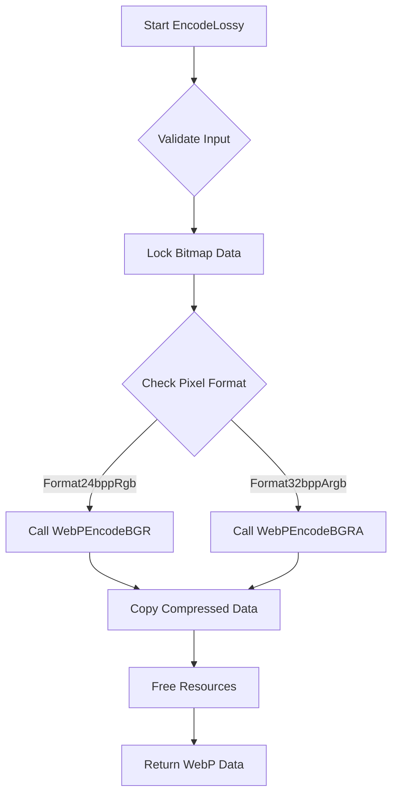

# Lossy Encoding

<cite>
**Referenced Files in This Document**   
- [WebPWrapper.cs](file://SETUNA/Plugins/WebPWrapper.cs#L408-L517)
- [CImageStyleItem.cs](file://SETUNA/Main/StyleItems/CImageStyleItem.cs#L1-L276)
</cite>

## Table of Contents
1. [Introduction](#introduction)
2. [Core Functionality](#core-functionality)
3. [Method Overloads](#method-overloads)
4. [Input Validation](#input-validation)
5. [Encoding Process](#encoding-process)
6. [Practical Examples](#practical-examples)
7. [Performance Guidance](#performance-guidance)
8. [Common Issues](#common-issues)

## Introduction
The lossy WebP encoding functionality in the SETUNA application provides a robust mechanism for compressing Bitmap objects using the libwebp library. This documentation details the implementation of the `EncodeLossy` methods, which offer quality-based compression for images. The functionality supports two overloads: a simple version with a quality parameter and an advanced version with additional speed and information parameters. The encoding process involves validating input parameters, locking bitmap data, and calling the appropriate native methods from the libwebp library to perform the compression.

**Section sources**
- [WebPWrapper.cs](file://SETUNA/Plugins/WebPWrapper.cs#L408-L517)

## Core Functionality
The lossy encoding functionality is implemented in the WebP class within the WebPWrapper plugin. The core methods, `EncodeLossy`, provide a managed interface to the libwebp library's lossy compression capabilities. These methods handle the conversion of Bitmap objects to WebP format by leveraging the native `WebPEncodeBGR` and `WebPEncodeBGRA` functions from the libwebp library. The implementation ensures efficient memory management and proper error handling throughout the encoding process.



**Diagram sources**
- [WebPWrapper.cs](file://SETUNA/Plugins/WebPWrapper.cs#L408-L471)

## Method Overloads
The `EncodeLossy` method is available in two overloads to accommodate different use cases and requirements:

### Simple Encoding API
The simple overload accepts a Bitmap and a quality parameter:
```csharp
public byte[] EncodeLossy(Bitmap bmp, int quality = 75)
```
This method provides a straightforward interface for lossy encoding with a default quality setting of 75. The quality parameter ranges from 0 (lowest quality, smallest file size) to 100 (highest quality, largest file size).

### Advanced Encoding API
The advanced overload includes additional parameters for speed and information display:
```csharp
public byte[] EncodeLossy(Bitmap bmp, int quality, int speed, bool info = false)
```
This version allows for fine-tuning of the compression process by specifying a speed parameter (0-9) and optionally displaying compression statistics. The speed parameter controls the trade-off between encoding speed and compression efficiency, with lower values representing faster encoding and higher values representing better compression.

**Section sources**
- [WebPWrapper.cs](file://SETUNA/Plugins/WebPWrapper.cs#L408-L517)

## Input Validation
Before initiating the encoding process, the `EncodeLossy` methods perform comprehensive input validation to ensure the integrity and compatibility of the input data:

### Dimension Validation
The methods verify that the bitmap dimensions are within acceptable limits:
- Minimum dimensions: 1x1 pixels
- Maximum dimensions: 16383x16383 pixels (defined by `WEBP_MAX_DIMENSION`)

### Pixel Format Validation
The implementation supports only two pixel formats:
- `PixelFormat.Format24bppRgb` (24-bit RGB)
- `PixelFormat.Format32bppArgb` (32-bit ARGB with alpha channel)

Any other pixel format will result in a `NotSupportedException` being thrown.

### Data Validation
The methods check for valid bitmap data:
- Bitmap width and height must be greater than zero
- Bitmap must contain valid image data

These validation steps ensure that only compatible and properly formatted images are processed, preventing potential errors during the encoding process.

**Section sources**
- [WebPWrapper.cs](file://SETUNA/Plugins/WebPWrapper.cs#L410-L424)

## Encoding Process
The encoding process follows a systematic approach to convert Bitmap objects to WebP format:

### Bitmap Data Locking
The process begins by locking the bitmap data using `LockBits`, which provides direct access to the pixel data in memory. This step is crucial for efficient data transfer to the native encoding functions.

### Native Method Invocation
Depending on the pixel format, the appropriate native method is called:
- For `Format24bppRgb`: `WebPEncodeBGR`
- For `Format32bppArgb`: `WebPEncodeBGRA`

These methods are platform-specific (x86/x64) and are invoked through P/Invoke calls to the libwebp library.

### Memory Management
The implementation carefully manages memory throughout the process:
- Unmanaged memory is allocated by the native encoding functions
- Compressed data is copied to a managed byte array
- All allocated resources are properly released in the `finally` block

### Error Handling
Comprehensive error handling is implemented:
- Validation exceptions for invalid input
- Encoding exceptions for failed compression
- Proper cleanup in case of errors

This ensures that the encoding process is both reliable and robust.

**Section sources**
- [WebPWrapper.cs](file://SETUNA/Plugins/WebPWrapper.cs#L430-L470)

## Practical Examples
The lossy encoding functionality is used in various scenarios within the application:

### File Saving
When saving images to disk, the `Save` method utilizes `EncodeLossy` to compress the bitmap before writing to a file:
```csharp
public void Save(Bitmap bmp, string pathFileName, int quality = 75)
{
    byte[] rawWebP = EncodeLossy(bmp, quality);
    File.WriteAllBytes(pathFileName, rawWebP);
}
```

### Clipboard Operations
For clipboard operations, the compressed WebP data can be directly transferred, reducing memory usage and improving performance when sharing images.

### Image Processing Pipeline
The encoding functionality is integrated into the image processing pipeline, allowing for efficient storage and transmission of captured screenshots and other images.

**Section sources**
- [WebPWrapper.cs](file://SETUNA/Plugins/WebPWrapper.cs#L389-L402)
- [CImageStyleItem.cs](file://SETUNA/Main/StyleItems/CImageStyleItem.cs#L71-L72)

## Performance Guidance
To optimize the use of lossy encoding, consider the following guidelines:

### Quality Settings
- **High Quality (90-100)**: Suitable for images requiring excellent visual fidelity, such as professional photography
- **Medium Quality (70-89)**: Balanced choice for general use, providing good quality with reasonable file sizes
- **Low Quality (50-69)**: Appropriate for web images and thumbnails where file size is critical
- **Very Low Quality (0-49)**: Use only when minimal file size is the primary concern

### Speed Settings
- **Speed 0-3**: Fast encoding with lower compression ratios, ideal for real-time applications
- **Speed 4-6**: Balanced speed and compression, suitable for most use cases
- **Speed 7-9**: Slower encoding with higher compression, best for archival purposes

### Memory Considerations
- Ensure sufficient memory is available for large images
- Consider processing large images in smaller chunks when possible
- Monitor memory usage during batch encoding operations

**Section sources**
- [WebPWrapper.cs](file://SETUNA/Plugins/WebPWrapper.cs#L490-L504)

## Common Issues
Several common issues may arise when using the lossy encoding functionality:

### Quality vs. File Size Trade-offs
Finding the optimal balance between quality and file size requires experimentation. Higher quality settings result in larger files, while lower settings may introduce visible artifacts.

### Supported Pixel Formats
Only `Format24bppRgb` and `Format32bppArgb` are supported. Images with other pixel formats must be converted before encoding.

### Maximum Image Dimensions
The maximum supported dimension is 16383x16383 pixels. Larger images must be resized or processed in sections.

### Platform Compatibility
The implementation includes separate DLLs for x86 and x64 platforms, ensuring compatibility across different system architectures.

**Section sources**
- [WebPWrapper.cs](file://SETUNA/Plugins/WebPWrapper.cs#L416-L424)
- [WebPWrapper.cs](file://SETUNA/Plugins/WebPWrapper.cs#L490-L494)