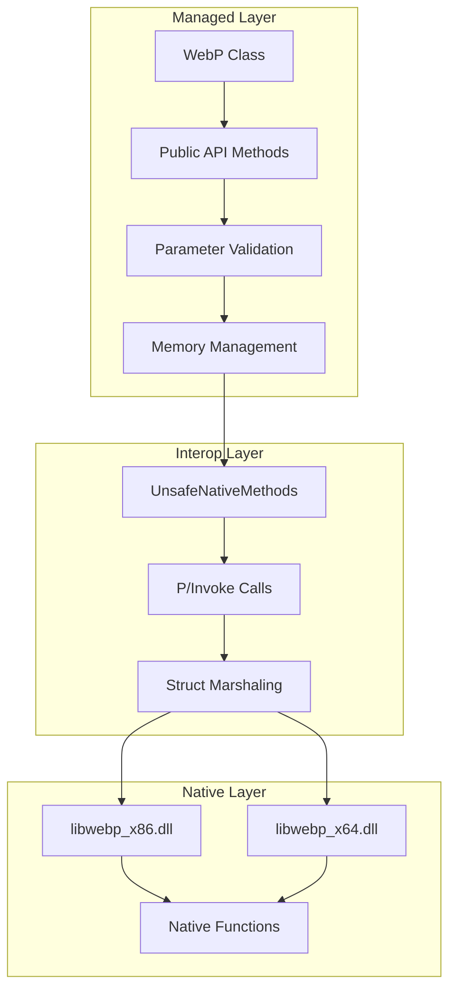
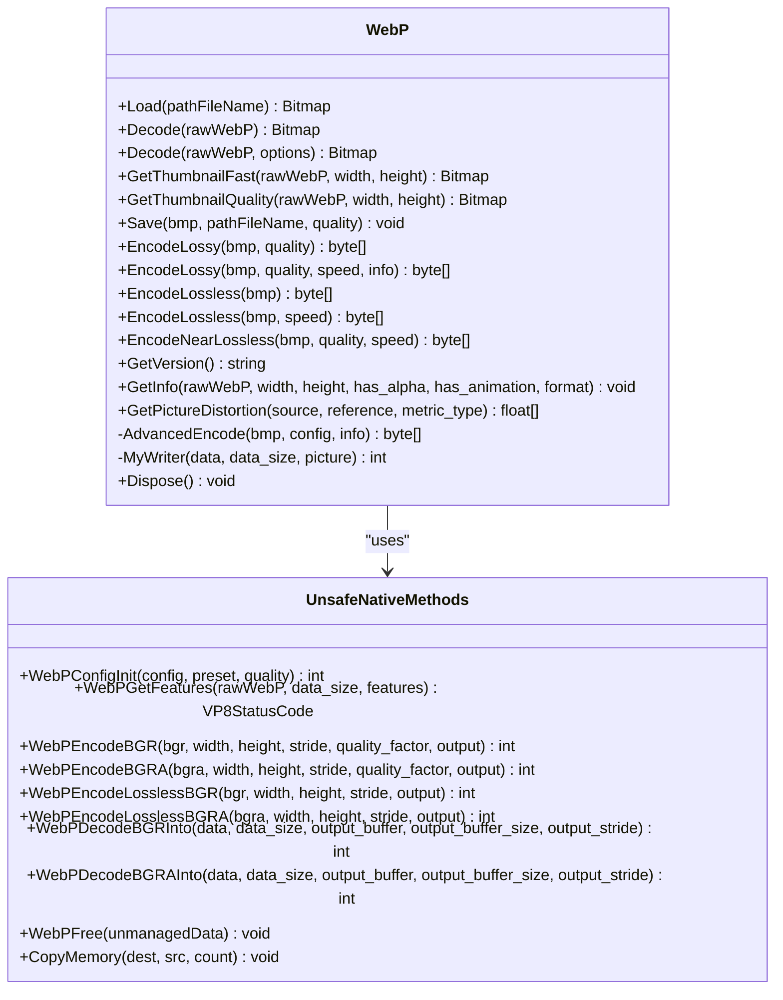
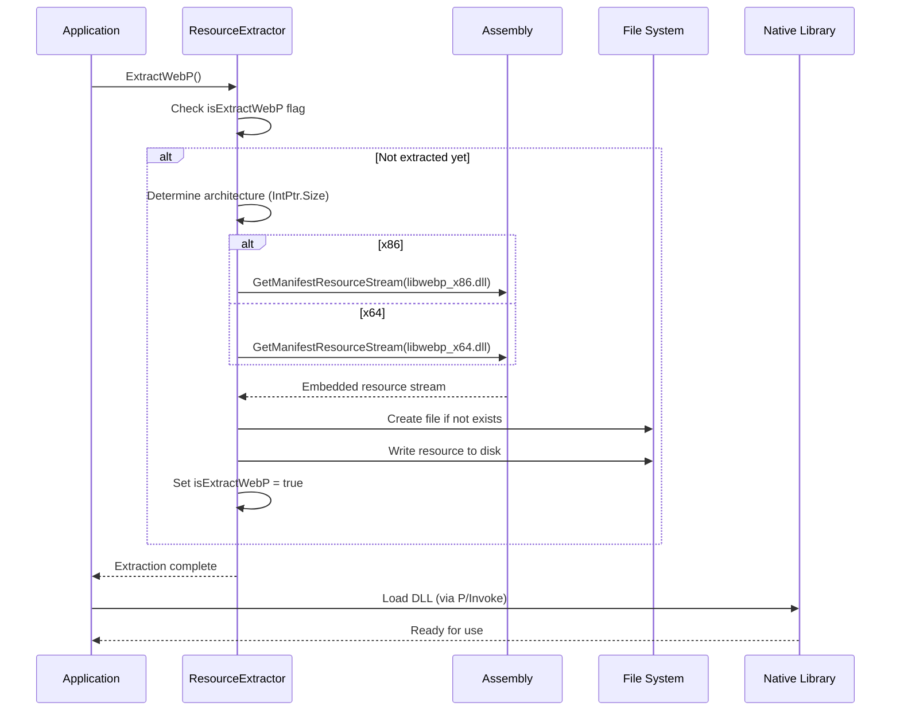
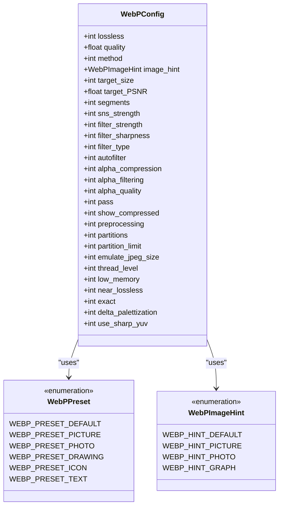
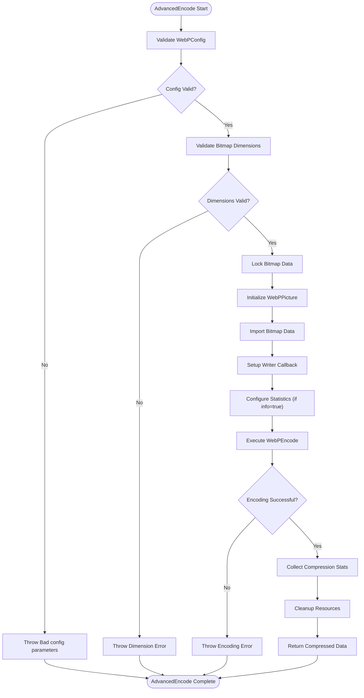
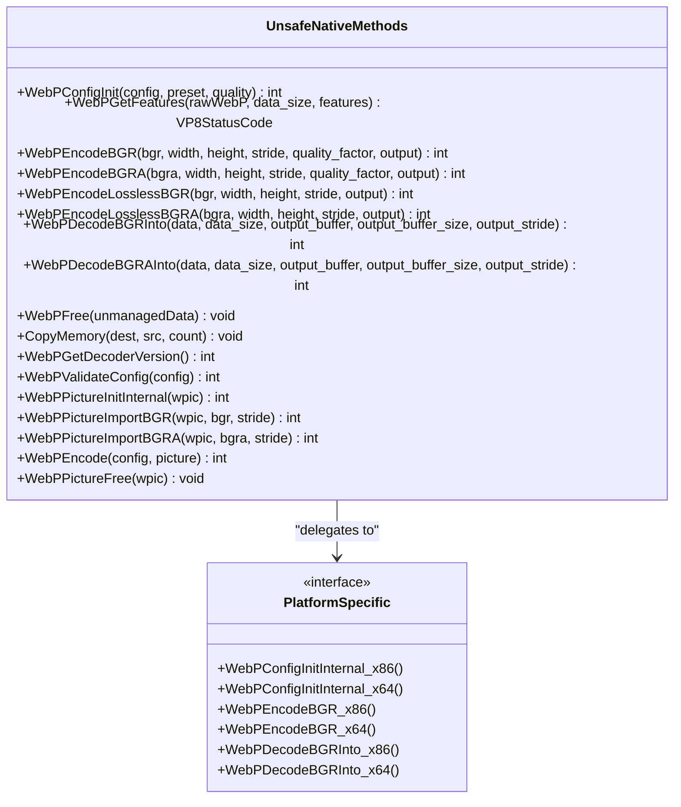
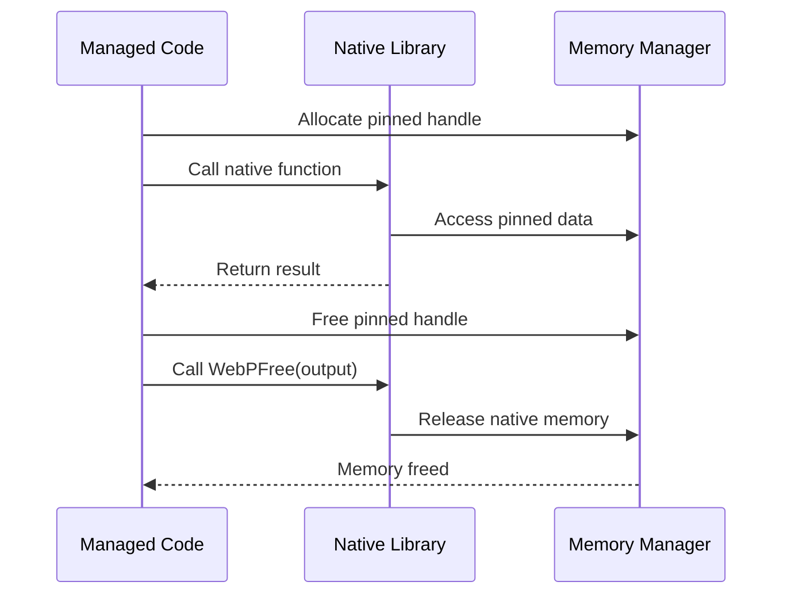
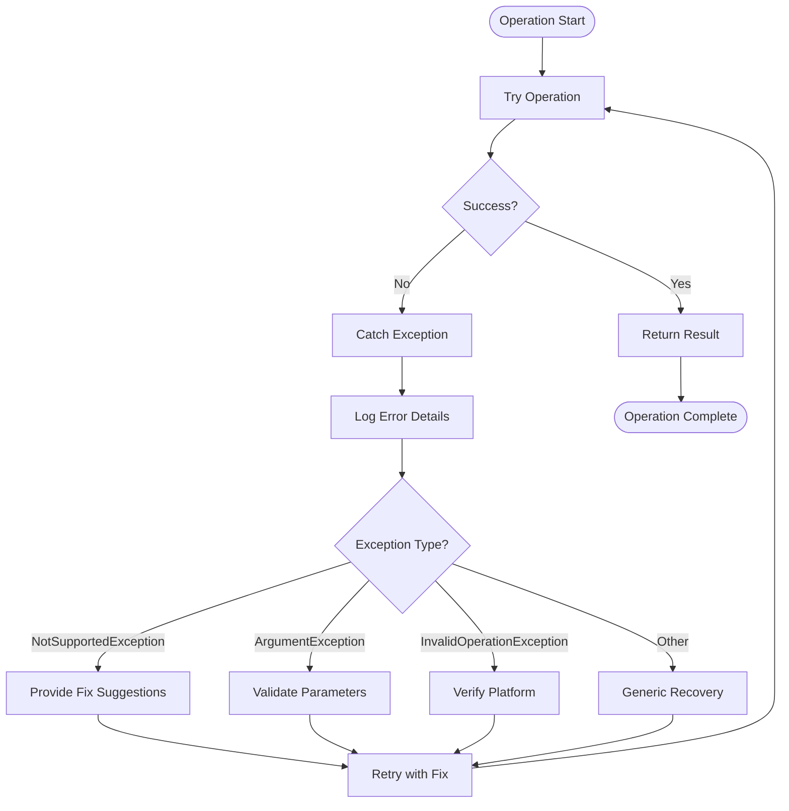

# WebP Encoding

<cite>
**Referenced Files in This Document**
- [WebPWrapper.cs](file://SETUNA/Plugins/WebPWrapper.cs)
- [ResourceExtractor.cs](file://SETUNA/Plugins/ResourceExtractor.cs)
</cite>

## Table of Contents
1. [Introduction](#introduction)
2. [Architecture Overview](#architecture-overview)
3. [Core Components](#core-components)
4. [Public API Methods](#public-api-methods)
5. [Advanced Encoding Configuration](#advanced-encoding-configuration)
6. [Native Library Interoperability](#native-library-interoperability)
7. [Practical Implementation Examples](#practical-implementation-examples)
8. [Performance Considerations](#performance-considerations)
9. [Error Handling and Troubleshooting](#error-handling-and-troubleshooting)
10. [Best Practices](#best-practices)

## Introduction

The WebPWrapper class provides comprehensive WebP image format support for the SETUNA application through seamless interoperability with the libwebp native library. This wrapper implements lossy, lossless, and near-lossless encoding capabilities, offering developers flexible options for image compression with varying quality and performance trade-offs.

The implementation leverages P/Invoke technology to bridge managed C# code with native libwebp functions, providing both simple and advanced encoding APIs. The wrapper handles pixel format restrictions, maximum image dimensions, and architecture-specific DLL loading automatically.

## Architecture Overview

The WebP encoding system follows a layered architecture that separates concerns between managed code and native library interactions:



**Diagram sources**
- [WebPWrapper.cs](file://SETUNA/Plugins/WebPWrapper.cs#L32-L40)
- [WebPWrapper.cs](file://SETUNA/Plugins/WebPWrapper.cs#L1088-L1614)

**Section sources**
- [WebPWrapper.cs](file://SETUNA/Plugins/WebPWrapper.cs#L32-L40)
- [WebPWrapper.cs](file://SETUNA/Plugins/WebPWrapper.cs#L1088-L1614)

## Core Components

### WebP Class Structure

The WebP class serves as the primary interface for WebP operations, encapsulating both encoding and decoding functionality:



**Diagram sources**
- [WebPWrapper.cs](file://SETUNA/Plugins/WebPWrapper.cs#L34-L1086)
- [WebPWrapper.cs](file://SETUNA/Plugins/WebPWrapper.cs#L1088-L1614)

### Resource Extraction System

The ResourceExtractor class manages dynamic loading of architecture-specific libwebp DLLs:



**Diagram sources**
- [ResourceExtractor.cs](file://SETUNA/Plugins/ResourceExtractor.cs#L9-L25)
- [WebPWrapper.cs](file://SETUNA/Plugins/WebPWrapper.cs#L36-L40)

**Section sources**
- [ResourceExtractor.cs](file://SETUNA/Plugins/ResourceExtractor.cs#L1-L43)
- [WebPWrapper.cs](file://SETUNA/Plugins/WebPWrapper.cs#L36-L40)

## Public API Methods

### Save Method

The Save method provides a simple interface for converting Bitmap objects to WebP format and writing them to disk:

| Parameter | Type | Description | Constraints |
|-----------|------|-------------|-------------|
| bmp | Bitmap | Source image to encode | Must be Format24bppRgb or Format32bppArgb |
| pathFileName | string | Output file path | Must be writable location |
| quality | int | Compression quality (0-100) | Default: 75 |

**Method Signature:**
```csharp
public void Save(Bitmap bmp, string pathFileName, int quality = 75)
```

**Implementation Details:**
- Validates bitmap dimensions (≤ 16383×16383 pixels)
- Supports only Format24bppRgb and Format32bppArgb pixel formats
- Uses EncodeLossy internally with specified quality
- Handles file I/O exceptions gracefully

### EncodeLossy Methods

Two overloaded versions of EncodeLossy provide different levels of control over lossy compression:

#### Simple EncodeLossy
```csharp
public byte[] EncodeLossy(Bitmap bmp, int quality = 75)
```

#### Advanced EncodeLossy
```csharp
public byte[] EncodeLossy(Bitmap bmp, int quality, int speed, bool info = false)
```

**Parameter Comparison:**

| Parameter | Simple Version | Advanced Version |
|-----------|----------------|------------------|
| quality | Required (0-100) | Required (0-100) |
| speed | Not available | Optional (0-9) |
| info | Not available | Optional (bool) |

**Speed Parameter Impact:**
- 0-3: Faster encoding, larger file size
- 4-6: Balanced approach
- 7-9: Slower encoding, smaller file size

### EncodeLossless Methods

Provides lossless compression options with varying levels of control:

#### Simple EncodeLossless
```csharp
public byte[] EncodeLossless(Bitmap bmp)
```

#### Advanced EncodeLossless
```csharp
public byte[] EncodeLossless(Bitmap bmp, int speed)
```

**Lossless Encoding Characteristics:**
- Preserves all image data without quality loss
- Higher file sizes compared to lossy encoding
- Suitable for screenshots, graphics, and archival purposes
- Speed parameter affects compression efficiency (0-9)

### EncodeNearLossless Method

Combines lossy and lossless techniques for optimal quality-compression balance:

```csharp
public byte[] EncodeNearLossless(Bitmap bmp, int quality, int speed = 9)
```

**Near Lossless Features:**
- Applies slight lossy compression (controlled by quality parameter)
- Maintains perceptually lossless quality
- Best for photographic content with transparency
- Requires libwebp version > 1082

**Section sources**
- [WebPWrapper.cs](file://SETUNA/Plugins/WebPWrapper.cs#L385-L659)

## Advanced Encoding Configuration

### WebPConfig Structure

The AdvancedEncode method utilizes the WebPConfig structure for fine-grained control over encoding parameters:



**Diagram sources**
- [WebPWrapper.cs](file://SETUNA/Plugins/WebPWrapper.cs#L1774-L1835)

### Configuration Parameters

| Parameter | Range | Description | Impact |
|-----------|-------|-------------|---------|
| quality | 0-100 | Overall compression quality | Higher values = better quality, larger file size |
| method | 0-6 | Speed vs. compression trade-off | Higher values = better compression, slower encoding |
| lossless | 0/1 | Enable lossless mode | 1 disables quality-based compression |
| near_lossless | 0-100 | Near-lossless quality control | Lower values = more compression, potential artifacts |
| preprocessing | 0-4 | Image preprocessing level | Higher values = better compression, slower encoding |
| filter_strength | 0-100 | Filter intensity for lossy encoding | Higher values = stronger filtering, better compression |
| alpha_filtering | 0-2 | Alpha channel filtering method | 0=none, 1=fast, 2=best |

### AdvancedEncode Workflow

The AdvancedEncode method orchestrates complex encoding operations with comprehensive error handling:



**Diagram sources**
- [WebPWrapper.cs](file://SETUNA/Plugins/WebPWrapper.cs#L883-L1064)

**Section sources**
- [WebPWrapper.cs](file://SETUNA/Plugins/WebPWrapper.cs#L883-L1064)

## Native Library Interoperability

### UnsafeNativeMethods Class

The UnsafeNativeMethods class provides the bridge between managed C# code and native libwebp functions:



**Diagram sources**
- [WebPWrapper.cs](file://SETUNA/Plugins/WebPWrapper.cs#L1088-L1614)

### Architecture-Specific DLL Loading

The wrapper automatically selects the appropriate native library based on the runtime architecture:

| Architecture | DLL File | Calling Convention | Entry Points |
|--------------|----------|-------------------|--------------|
| x86 (32-bit) | libwebp_x86.dll | Cdecl | All exported functions |
| x64 (64-bit) | libwebp_x64.dll | Cdecl | All exported functions |

**Loading Mechanism:**
- Determined by `IntPtr.Size` property
- Automatic extraction from embedded resources
- Runtime function dispatch based on architecture
- Fallback exception for unsupported platforms

### Memory Management

The wrapper implements careful memory management to prevent leaks and ensure stability:



**Diagram sources**
- [WebPWrapper.cs](file://SETUNA/Plugins/WebPWrapper.cs#L426-L469)
- [WebPWrapper.cs](file://SETUNA/Plugins/WebPWrapper.cs#L540-L577)

**Section sources**
- [WebPWrapper.cs](file://SETUNA/Plugins/WebPWrapper.cs#L1088-L1614)

## Practical Implementation Examples

### Basic WebP Encoding

Converting a Bitmap to WebP byte array for clipboard operations:

```csharp
// Example: Convert screenshot to WebP for clipboard
using (var webp = new WebP())
{
    using (var screenshot = CaptureScreen())
    {
        // Encode with quality 85 for good balance
        byte[] webpData = webp.EncodeLossy(screenshot, 85);
        
        // Store in clipboard
        Clipboard.SetData(DataFormats.Bitmap, screenshot);
        Clipboard.SetData("image/webp", webpData);
    }
}
```

### Advanced Encoding with Custom Configuration

Creating optimized WebP images for web delivery:

```csharp
// Example: Optimize for web with advanced settings
using (var webp = new WebP())
{
    using (var image = Image.FromFile("large_photo.jpg"))
    {
        // Create custom configuration
        var config = new WebPConfig
        {
            lossless = 0,
            quality = 80,
            method = 4,  // Balanced speed/compression
            filter_strength = 60,
            alpha_filtering = 1,
            preprocessing = 2,  // Moderate preprocessing
            thread_level = 1
        };
        
        // Advanced encoding with statistics
        byte[] webpData = webp.EncodeLossy(image, config, true);
        
        // Save optimized file
        File.WriteAllBytes("optimized.webp", webpData);
    }
}
```

### Lossless Encoding for Graphics

Preserving quality for graphic assets:

```csharp
// Example: Lossless encoding for UI graphics
using (var webp = new WebP())
{
    using (var icon = Image.FromFile("icon.png"))
    {
        // Convert to compatible format
        using (var compatibleIcon = ConvertToFormat(icon, PixelFormat.Format32bppArgb))
        {
            // Lossless encoding with maximum compression
            byte[] webpData = webp.EncodeLossless(compatibleIcon, 6);
            
            // Verify quality
            webp.GetInfo(webpData, out _, out _, out _, out _, out string format);
            Console.WriteLine($"Encoded as {format} format");
            
            File.WriteAllBytes("icon_lossless.webp", webpData);
        }
    }
}
```

### Near-Lossless for Photographs

Balancing quality and file size for photographic content:

```csharp
// Example: Near-lossless encoding for photos
using (var webp = new WebP())
{
    using (var photo = Image.FromFile("photo.jpg"))
    {
        // Near-lossless encoding with quality control
        byte[] webpData = webp.EncodeNearLossless(photo, 90, 8);
        
        // Compare file sizes
        FileInfo original = new FileInfo("photo.jpg");
        FileInfo webpFile = new FileInfo("photo.webp");
        
        Console.WriteLine($"Original: {original.Length} bytes");
        Console.WriteLine($"WebP: {webpFile.Length} bytes");
        Console.WriteLine($"Compression: {(1.0 - (double)webpFile.Length / original.Length):P}");
        
        File.WriteAllBytes("photo_nearlossless.webp", webpData);
    }
}
```

**Section sources**
- [WebPWrapper.cs](file://SETUNA/Plugins/WebPWrapper.cs#L385-L659)

## Performance Considerations

### Speed vs. Compression Trade-offs

Understanding the performance characteristics of different encoding modes:

| Encoding Mode | Speed | Compression Ratio | Use Case |
|---------------|-------|-------------------|----------|
| EncodeLossy (simple) | Fast | Good | General purpose, quick encoding |
| EncodeLossy (advanced) | Variable | Excellent | Web delivery, storage optimization |
| EncodeLossless | Slow | Very High | Archival, graphics preservation |
| EncodeNearLossless | Medium | High | Photography, transparency preservation |

### Performance Optimization Guidelines

#### Quality Selection
- **Quality 0-30**: Fastest encoding, significant quality loss
- **Quality 31-70**: Balanced performance and quality
- **Quality 71-100**: Slower encoding, excellent quality retention

#### Speed Parameter Tuning
- **Speed 0-2**: Maximum compression, suitable for offline processing
- **Speed 3-5**: Good balance for interactive applications
- **Speed 6-9**: Minimal compression, fastest encoding

#### Memory Considerations
- Large images (>4096×4096) benefit from progressive encoding
- Use streaming for very large images to reduce memory footprint
- Monitor memory usage during batch processing operations

### Performance Monitoring

The AdvancedEncode method provides built-in statistics collection:

```csharp
// Example: Performance monitoring
byte[] encodedData = webp.EncodeLossy(image, config, true);
// Statistics dialog displays:
// - Dimension: Original dimensions
// - Output: Compressed size in bytes
// - PSNR Values: Quality metrics for each channel
// - Block statistics: Compression efficiency
// - Header size: Metadata overhead
```

**Section sources**
- [WebPWrapper.cs](file://SETUNA/Plugins/WebPWrapper.cs#L883-L1064)

## Error Handling and Troubleshooting

### Common Issues and Solutions

#### Pixel Format Restrictions

**Problem:** `NotSupportedException: Only support Format24bppRgb and Format32bppArgb pixelFormat`

**Solution:**
```csharp
// Convert to supported format before encoding
using (var converted = ConvertToFormat(original, PixelFormat.Format32bppArgb))
{
    byte[] webpData = webp.EncodeLossy(converted, 85);
}
```

#### Maximum Image Dimensions

**Problem:** `NotSupportedException: Bitmap's dimension is too large`

**Solution:**
```csharp
// Resize large images before encoding
if (image.Width > 16383 || image.Height > 16383)
{
    using (var resized = ResizeImage(image, 16383, 16383))
    {
        byte[] webpData = webp.EncodeLossy(resized, 85);
    }
}
```

#### Architecture-Specific DLL Issues

**Problem:** `InvalidOperationException: Invalid platform. Can not find proper function`

**Solution:**
- Verify architecture matches embedded DLL
- Check file permissions for DLL extraction
- Ensure libwebp DLLs are present in application directory

#### Memory Management Issues

**Problem:** Out-of-memory errors during large image processing

**Solution:**
```csharp
// Process large images in chunks
using (var webp = new WebP())
{
    // Use streaming or progressive encoding
    // Monitor memory usage with Process.GetCurrentProcess().WorkingSet64
}
```

### Error Recovery Strategies



**Diagram sources**
- [WebPWrapper.cs](file://SETUNA/Plugins/WebPWrapper.cs#L410-L470)
- [WebPWrapper.cs](file://SETUNA/Plugins/WebPWrapper.cs#L524-L580)

**Section sources**
- [WebPWrapper.cs](file://SETUNA/Plugins/WebPWrapper.cs#L410-L470)
- [WebPWrapper.cs](file://SETUNA/Plugins/WebPWrapper.cs#L524-L580)

## Best Practices

### Encoding Strategy Selection

Choose the appropriate encoding method based on content type:

#### Lossy Encoding (Recommended for most cases)
- **Photographs**: Use quality 70-90, speed 3-5
- **Screenshots**: Use quality 80-90, speed 4-6
- **Graphics**: Use quality 60-70, speed 2-4

#### Lossless Encoding
- **UI Elements**: Use for icons, buttons, and small graphics
- **Archival**: Preserve original quality for long-term storage
- **Transparency**: Maintain alpha channel fidelity

#### Near-Lossless Encoding
- **Photographic Content**: Balance quality and file size
- **Mixed Content**: Images with both photographic and graphic elements
- **Transparency**: Preserve alpha channels with minimal quality loss

### Resource Management

#### Proper Disposal Pattern
```csharp
// Recommended pattern for WebP operations
using (var webp = new WebP())
{
    using (var image = Image.FromFile("input.jpg"))
    {
        byte[] webpData = webp.EncodeLossy(image, 85);
        File.WriteAllBytes("output.webp", webpData);
    }
}
// Automatic cleanup of native resources
```

#### Memory Optimization
- Process images in batches for large-scale operations
- Use streaming for very large images
- Monitor memory usage during encoding operations
- Dispose of intermediate Bitmap objects promptly

### Quality Assurance

#### Validation Techniques
```csharp
// Verify encoding results
using (var webp = new WebP())
{
    // Encode and verify format
    byte[] webpData = webp.EncodeLossy(image, 85);
    
    webp.GetInfo(webpData, out int width, out int height, 
                out bool hasAlpha, out bool hasAnimation, out string format);
    
    Debug.Assert(format == "lossy", "Expected lossy format");
    Debug.Assert(width == image.Width, "Width mismatch");
    Debug.Assert(height == image.Height, "Height mismatch");
}
```

#### Performance Testing
- Benchmark different quality settings for target use cases
- Test encoding performance with various image sizes
- Measure memory usage patterns during batch operations
- Validate compression ratios against requirements

### Integration Patterns

#### Web Application Integration
```csharp
// ASP.NET Core middleware for WebP conversion
public async Task ConvertToWebP(HttpContext context)
{
    var webp = new WebP();
    var originalImage = await LoadImageFromRequest(context.Request);
    
    byte[] webpData = webp.EncodeLossy(originalImage, 80);
    
    context.Response.ContentType = "image/webp";
    await context.Response.Body.WriteAsync(webpData, 0, webpData.Length);
}
```

#### Desktop Application Integration
```csharp
// WinForms/PresentationFramework integration
private void SaveAsWebP_Click(object sender, EventArgs e)
{
    using (var webp = new WebP())
    using (var saveDialog = new SaveFileDialog())
    {
        saveDialog.Filter = "WebP Images (*.webp)|*.webp";
        
        if (saveDialog.ShowDialog() == DialogResult.OK)
        {
            byte[] webpData = webp.EncodeLossy(currentImage, 90);
            File.WriteAllBytes(saveDialog.FileName, webpData);
        }
    }
}
```

**Section sources**
- [WebPWrapper.cs](file://SETUNA/Plugins/WebPWrapper.cs#L385-L659)