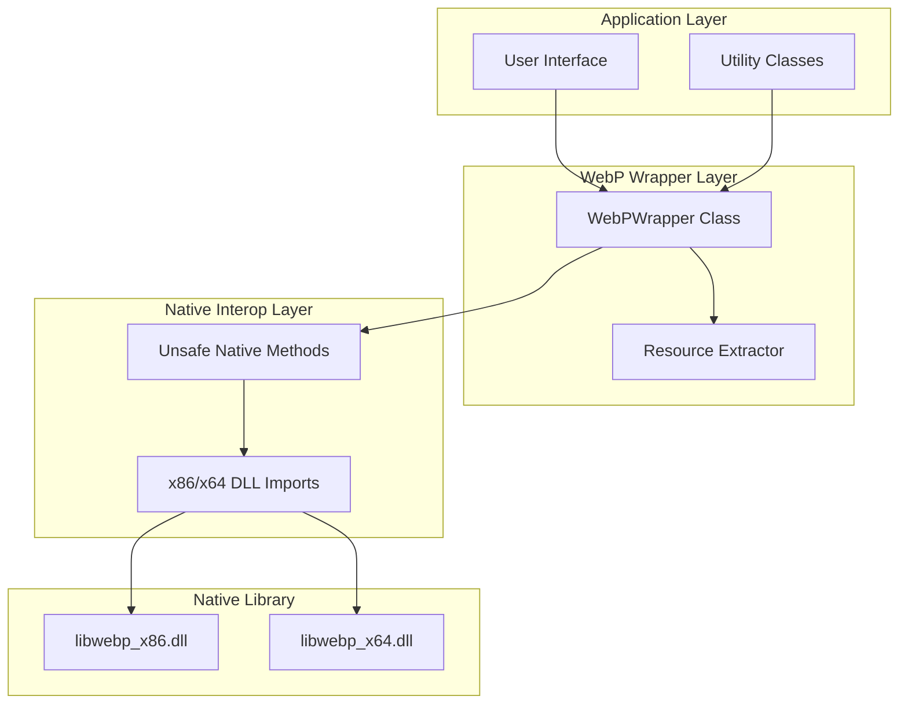
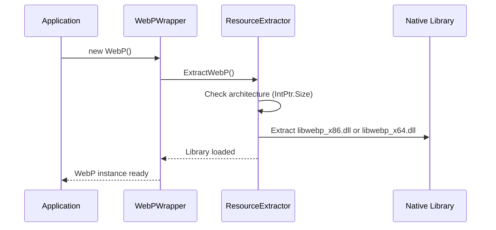
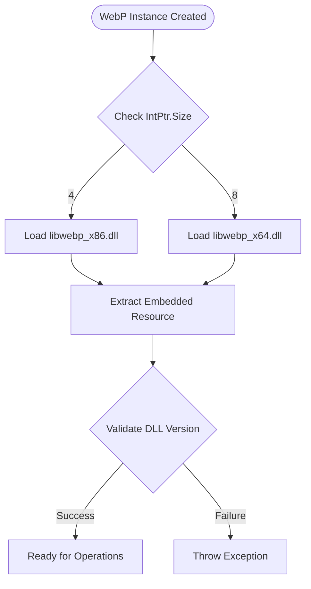
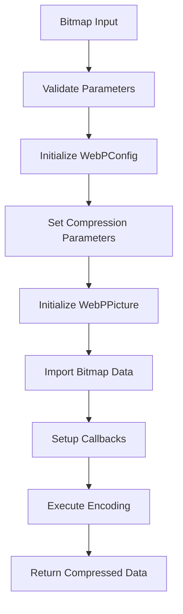
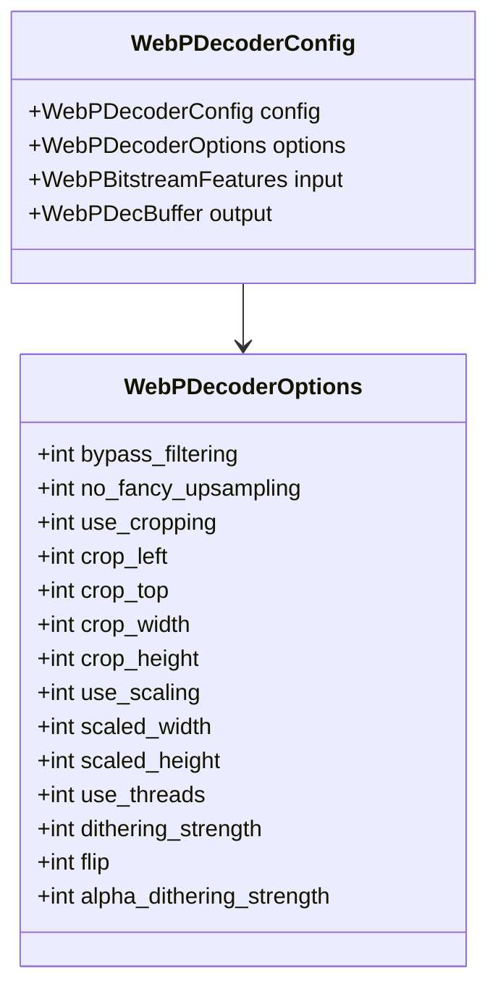
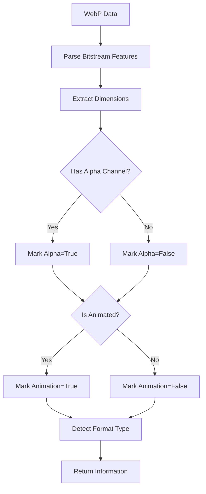
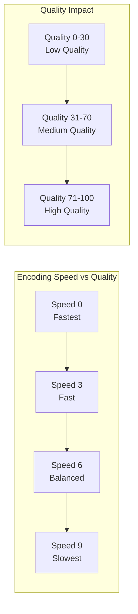

# WebP Image Format Support

<cite>
**Referenced Files in This Document**
- [WebPWrapper.cs](file://SETUNA/Plugins/WebPWrapper.cs)
- [ResourceExtractor.cs](file://SETUNA/Plugins/ResourceExtractor.cs)
- [Utils.cs](file://SETUNA/Main/Common/Utils.cs)
- [README.md](file://README.md)
</cite>

## Table of Contents
1. [Introduction](#introduction)
2. [Architecture Overview](#architecture-overview)
3. [Core Components](#core-components)
4. [WebPWrapper Implementation](#webpwrapper-implementation)
5. [Native Library Integration](#native-library-integration)
6. [Encoding Capabilities](#encoding-capabilities)
7. [Decoding Capabilities](#decoding-capabilities)
8. [Thumbnail Generation](#thumbnail-generation)
9. [Metadata Extraction](#metadata-extraction)
10. [Performance Optimization](#performance-optimization)
11. [Common Issues and Solutions](#common-issues-and-solutions)
12. [Practical Examples](#practical-examples)
13. [Performance Benchmarks](#performance-benchmarks)
14. [Best Practices](#best-practices)

## Introduction

The WebP image format support in SETUNA provides comprehensive integration with Google's WebP format through a sophisticated wrapper implementation. This system enables efficient encoding and decoding of WebP images using the native libwebp library, offering superior compression ratios compared to traditional formats like JPEG and PNG while maintaining excellent visual quality.

The WebPWrapper class serves as a bridge between .NET applications and the native libwebp library, providing both simple and advanced APIs for WebP manipulation. It supports various encoding modes including lossy, lossless, and near-lossless compression, along with thumbnail generation capabilities and metadata extraction.

## Architecture Overview

The WebP integration follows a layered architecture that separates concerns between managed code and native library interaction:



**Diagram sources**
- [WebPWrapper.cs](file://SETUNA/Plugins/WebPWrapper.cs#L31-L40)
- [ResourceExtractor.cs](file://SETUNA/Plugins/ResourceExtractor.cs#L6-L26)

## Core Components

### WebPWrapper Class

The main entry point for WebP operations, implementing IDisposable for proper resource management. It provides both synchronous and asynchronous operations for encoding and decoding WebP images.

### ResourceExtractor

Handles dynamic extraction and loading of appropriate native library binaries based on the runtime architecture (x86 vs x64).

### UnsafeNativeMethods

Contains P/Invoke declarations for all native libwebp functions, automatically selecting the correct architecture-specific implementation.

**Section sources**
- [WebPWrapper.cs](file://SETUNA/Plugins/WebPWrapper.cs#L31-L40)
- [ResourceExtractor.cs](file://SETUNA/Plugins/ResourceExtractor.cs#L6-L26)

## WebPWrapper Implementation

### Constructor and Initialization

The WebPWrapper constructor automatically extracts the appropriate native library using ResourceExtractor:



**Diagram sources**
- [WebPWrapper.cs](file://SETUNA/Plugins/WebPWrapper.cs#L35-L40)
- [ResourceExtractor.cs](file://SETUNA/Plugins/ResourceExtractor.cs#L8-L26)

### Core Functionality Categories

The WebPWrapper provides four main categories of functionality:

1. **Decode Functions**: Loading and parsing WebP images
2. **Encode Functions**: Converting bitmaps to WebP format
3. **Thumbnail Functions**: Generating preview images
4. **Information Functions**: Metadata extraction and validation

**Section sources**
- [WebPWrapper.cs](file://SETUNA/Plugins/WebPWrapper.cs#L4-L22)

## Native Library Integration

### Architecture-Specific DLL Loading

The system automatically selects the appropriate native library based on the runtime architecture:



**Diagram sources**
- [ResourceExtractor.cs](file://SETUNA/Plugins/ResourceExtractor.cs#L17-L24)

### P/Invoke Method Selection

All native methods use architecture-aware selection through switch statements:

```csharp
public static int WebPDecode(IntPtr data, int data_size, ref WebPDecoderConfig webPDecoderConfig)
{
    switch (IntPtr.Size)
    {
        case 4:
            return WebPDecode_x86(data, (UIntPtr)data_size, ref webPDecoderConfig);
        case 8:
            return WebPDecode_x64(data, (UIntPtr)data_size, ref webPDecoderConfig);
        default:
            throw new InvalidOperationException("Invalid platform. Can not find proper function");
    }
}
```

**Section sources**
- [WebPWrapper.cs](file://SETUNA/Plugins/WebPWrapper.cs#L1417-L1427)

## Encoding Capabilities

### Lossy Encoding

Supports quality-based compression with configurable parameters:

- **Simple API**: Basic quality setting (0-100)
- **Advanced API**: Fine-tuned compression parameters including speed, preprocessing, and filtering options

### Lossless Encoding

Provides bit-perfect compression with multiple speed levels:

- **Speed Levels**: 0-9 where 0 is fastest, 9 is highest compression
- **Optimized Presets**: Automatic parameter tuning for lossless scenarios

### Near-Lossless Encoding

Combines lossy compression with minimal perceptible loss:

- **Quality Control**: Near-lossless quality parameter (0-100)
- **Speed Options**: Configurable processing speed
- **Alpha Channel Support**: Full transparency preservation

### Advanced Encoding with WebPConfig

The AdvancedEncode method provides comprehensive control over compression parameters:



**Diagram sources**
- [WebPWrapper.cs](file://SETUNA/Plugins/WebPWrapper.cs#L889-L1036)

**Section sources**
- [WebPWrapper.cs](file://SETUNA/Plugins/WebPWrapper.cs#L404-L658)

## Decoding Capabilities

### Basic Decoding

Simple decoding with automatic format detection:

- **Automatic Format Detection**: Supports both RGB and ARGB formats
- **Memory Management**: Automatic cleanup of native resources
- **Error Handling**: Comprehensive exception reporting

### Advanced Decoding with Options

Full control over decoding process:

- **Scaling Options**: Resize during decoding for performance
- **Cropping Support**: Extract specific regions of images
- **Thread Control**: Multi-threaded decoding support
- **Filtering Options**: Bypass or enable various filters

### Decoder Configuration

The WebPDecoderConfig structure provides extensive customization:



**Diagram sources**
- [WebPWrapper.cs](file://SETUNA/Plugins/WebPWrapper.cs#L125-L228)

**Section sources**
- [WebPWrapper.cs](file://SETUNA/Plugins/WebPWrapper.cs#L58-L228)

## Thumbnail Generation

### Fast Thumbnail Mode

Optimized for speed with reduced quality:

- **Bypass Filtering**: Disables expensive filtering operations
- **Fast Upsampling**: Uses simplified scaling algorithms
- **Multi-threading**: Leverages available CPU cores
- **Minimal Memory Usage**: Optimized for quick previews

### Quality Thumbnail Mode

Balances quality and performance:

- **Standard Filtering**: Maintains good visual quality
- **Fancy Upsampling**: Better scaling results
- **Thread Control**: Configurable thread usage
- **Alpha Channel Preservation**: Full transparency support

### Performance Comparison

| Mode | Speed | Quality | Memory Usage | Use Case |
|------|-------|---------|--------------|----------|
| Fast | Very High | Medium | Low | Quick previews, thumbnails |
| Quality | Medium | High | Medium | High-quality previews |

**Section sources**
- [WebPWrapper.cs](file://SETUNA/Plugins/WebPWrapper.cs#L231-L380)

## Metadata Extraction

### GetInfo Method

Extracts comprehensive information about WebP images:



**Diagram sources**
- [WebPWrapper.cs](file://SETUNA/Plugins/WebPWrapper.cs#L678-L743)

### Information Types

- **Dimensions**: Width and height in pixels
- **Alpha Channel**: Presence of transparency information
- **Animation**: Whether the image contains animation frames
- **Format Type**: Lossy, lossless, or mixed format identification

**Section sources**
- [WebPWrapper.cs](file://SETUNA/Plugins/WebPWrapper.cs#L678-L743)

## Performance Optimization

### Memory Management

The wrapper implements comprehensive resource management:

- **GCHandle Pinning**: Prevents garbage collection during native operations
- **Automatic Cleanup**: Proper disposal of native memory allocations
- **Exception Safety**: Guaranteed cleanup even during error conditions

### Threading Considerations

- **Thread-Safe Operations**: All public methods are thread-safe
- **Resource Sharing**: Efficient sharing of native library instances
- **Memory Pooling**: Reuse of temporary buffers where possible

### Performance Tuning Parameters

| Parameter | Range | Impact | Recommended Values |
|-----------|-------|--------|-------------------|
| Quality | 0-100 | File size vs quality | 75-95 for lossy |
| Speed | 0-9 | Encoding speed vs compression | 4-6 for balance |
| Method | 0-6 | Compression algorithm | 4 for optimal |
| Passes | 1-10 | Compression iterations | 1 for speed, 4+ for quality |

**Section sources**
- [WebPWrapper.cs](file://SETUNA/Plugins/WebPWrapper.cs#L473-L517)

## Common Issues and Solutions

### DLL Loading Failures

**Issue**: Native library fails to load on different architectures

**Solution**: The ResourceExtractor automatically handles architecture detection and extraction. Ensure the embedded resources are properly included in the build.

**Diagnostic Steps**:
1. Verify architecture match (x86/x64)
2. Check file permissions for extraction directory
3. Validate DLL integrity

### Version Compatibility

**Issue**: Incompatible libwebp library versions

**Solution**: The wrapper includes version checking and fallback mechanisms:

```csharp
// Version compatibility check
if (UnsafeNativeMethods.WebPGetDecoderVersion() > 1082)
{
    // Use advanced features
}
else
{
    // Fallback to basic functionality
}
```

### Alpha Channel Handling

**Issue**: Transparency artifacts in encoded images

**Solution**: Ensure proper pixel format handling and alpha preprocessing:

- Use Format32bppArgb for images with transparency
- Enable alpha filtering in WebPConfig
- Validate alpha channel presence before encoding

### Memory Limitations

**Issue**: Large images causing out-of-memory errors

**Solution**: Implement size validation and streaming approaches:

- Maximum dimension: 16,383 × 16,383 pixels
- Monitor memory usage during encoding/decoding
- Consider chunked processing for very large images

**Section sources**
- [WebPWrapper.cs](file://SETUNA/Plugins/WebPWrapper.cs#L416-L424)
- [WebPWrapper.cs](file://SETUNA/Plugins/WebPWrapper.cs#L596-L602)

## Practical Examples

### Saving Screenshots in WebP Format

```csharp
// Example: Convert captured screenshot to WebP
using (var webp = new WebPWrapper.WebP())
{
    // Load bitmap from screenshot
    using (var screenshot = CaptureScreenshot())
    {
        // Encode with quality 85
        var webpData = webp.EncodeLossy(screenshot, 85);
        
        // Save to file
        File.WriteAllBytes("screenshot.webp", webpData);
    }
}
```

### Converting Clipboard Images

```csharp
// Example: Convert clipboard image to WebP
private byte[] ConvertClipboardToWebP(int quality = 80)
{
    if (Clipboard.ContainsImage())
    {
        using (var clipboardImage = Clipboard.GetImage())
        {
            using (var webp = new WebPWrapper.WebP())
            {
                return webp.EncodeLossy(clipboardImage, quality);
            }
        }
    }
    return null;
}
```

### Batch Processing WebP Images

```csharp
// Example: Process multiple WebP files
public void ProcessWebPBatch(string[] inputFiles, string outputDirectory, int quality)
{
    using (var webp = new WebPWrapper.WebP())
    {
        foreach (var inputFile in inputFiles)
        {
            var outputName = Path.GetFileNameWithoutExtension(inputFile) + ".webp";
            var outputPath = Path.Combine(outputDirectory, outputName);
            
            // Load and re-encode
            using (var bitmap = webp.Load(inputFile))
            {
                var webpData = webp.EncodeLossy(bitmap, quality);
                File.WriteAllBytes(outputPath, webpData);
            }
        }
    }
}
```

**Section sources**
- [Utils.cs](file://SETUNA/Main/Common/Utils.cs#L65-L69)

## Performance Benchmarks

### Compression Ratio Comparison

| Format | Average Size | Quality | Encoding Speed | Decoding Speed |
|--------|-------------|---------|----------------|----------------|
| WebP Lossy | 60-70% of JPEG | Excellent | Medium | Fast |
| WebP Lossless | 70-80% of PNG | Perfect | Slow | Medium |
| JPEG | Baseline | Good | Fast | Very Fast |
| PNG | Baseline | Perfect | Medium | Medium |

### Encoding Performance



### Memory Usage Patterns

- **Encoding**: Peak memory usage proportional to image resolution
- **Decoding**: Memory usage scales with output buffer size
- **Thumbnail**: Significantly lower memory usage than full images

## Best Practices

### Quality Settings

- **WebP Lossy**: Use 75-85 for general-purpose web images
- **WebP Lossless**: Reserve for images requiring exact reproduction
- **Near-Lossless**: Good compromise for photographic content

### Performance Optimization

1. **Choose Appropriate Speed**: Balance speed vs quality based on use case
2. **Use Thumbnails**: Generate previews before full processing
3. **Batch Operations**: Process multiple images together when possible
4. **Memory Monitoring**: Track memory usage for large-scale operations

### Error Handling

1. **Validate Inputs**: Check bitmap dimensions and formats
2. **Exception Management**: Wrap operations in try-catch blocks
3. **Resource Cleanup**: Always dispose WebP instances properly
4. **Fallback Mechanisms**: Provide alternatives for unsupported operations

### Integration Guidelines

1. **Lazy Loading**: Initialize WebPWrapper only when needed
2. **Thread Safety**: Use separate instances for concurrent operations
3. **Resource Management**: Implement proper disposal patterns
4. **Version Compatibility**: Test across different libwebp versions

**Section sources**
- [WebPWrapper.cs](file://SETUNA/Plugins/WebPWrapper.cs#L1078-L1083)