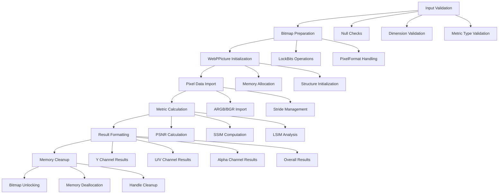
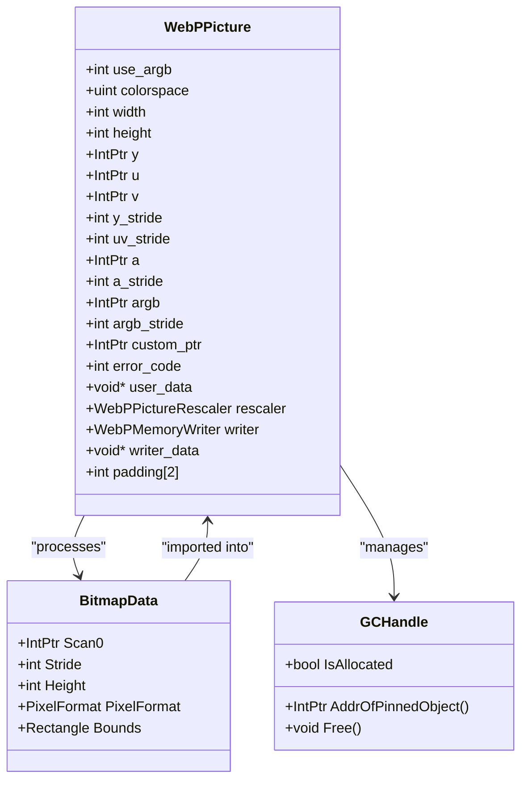
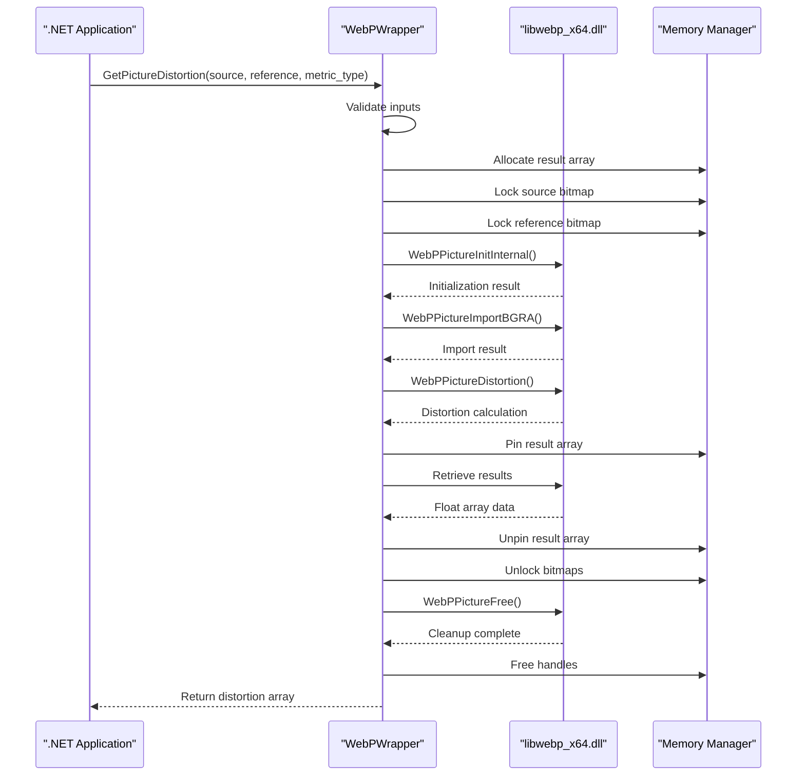
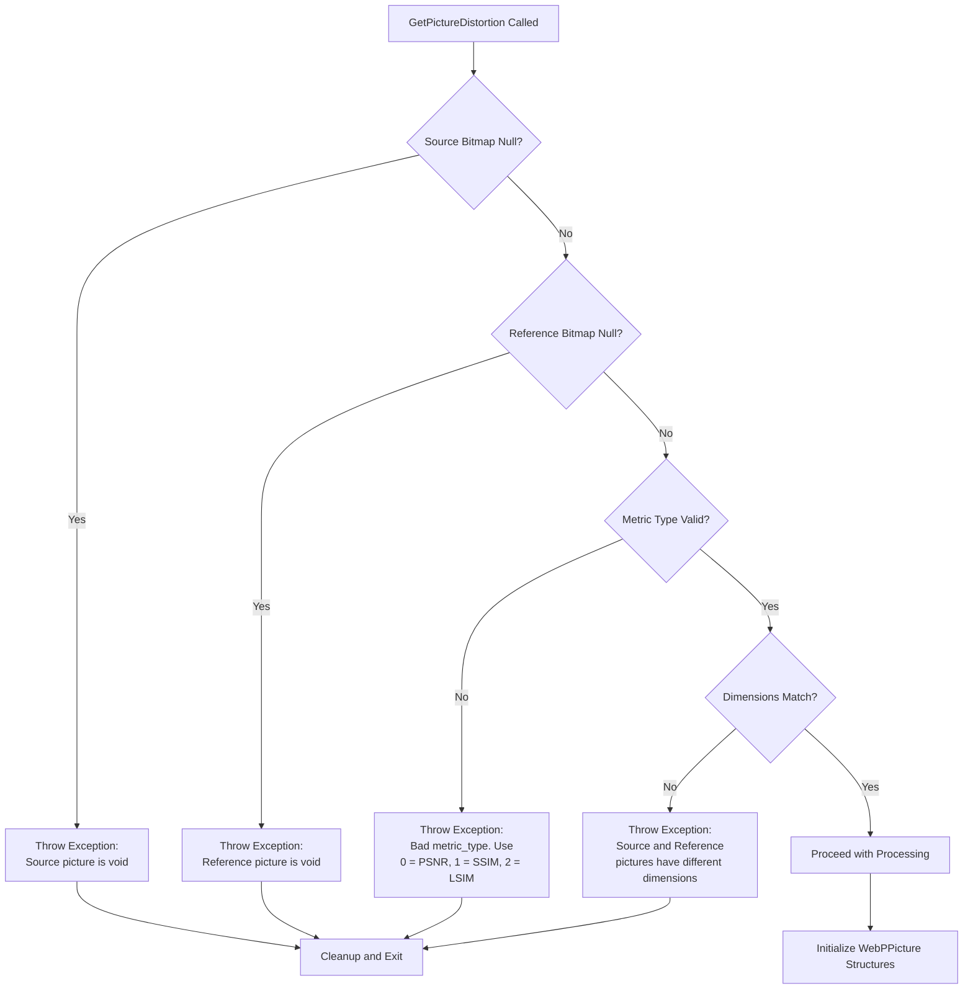
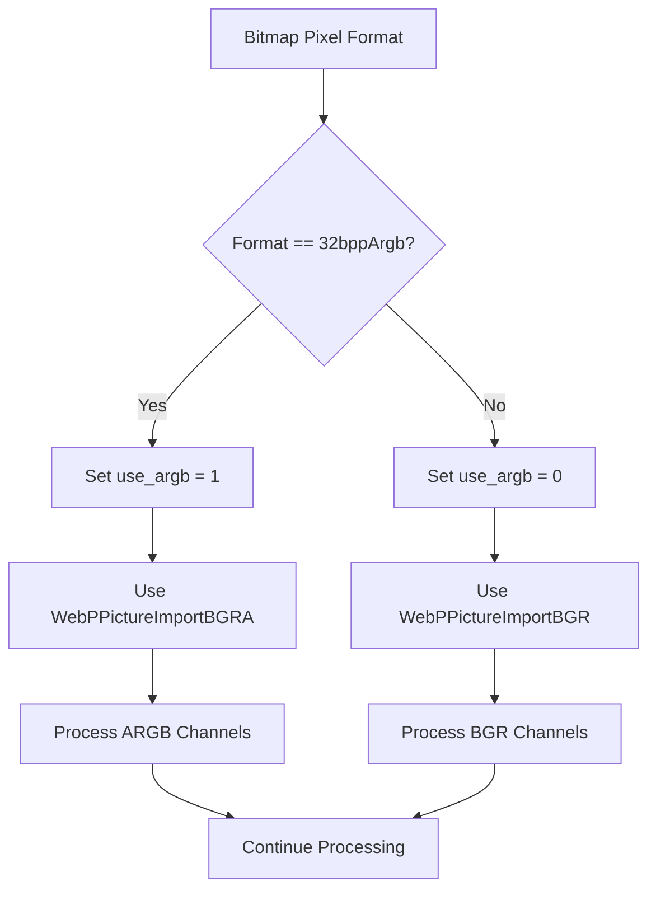

# Image Distortion Metrics

<cite>
**Referenced Files in This Document**
- [WebPWrapper.cs](file://SETUNA/Plugins/WebPWrapper.cs)
</cite>

## Table of Contents
1. [Introduction](#introduction)
2. [Method Overview](#method-overview)
3. [Technical Architecture](#technical-architecture)
4. [Distortion Metrics Analysis](#distortion-metrics-analysis)
5. [Implementation Details](#implementation-details)
6. [Performance Considerations](#performance-considerations)
7. [Usage Examples](#usage-examples)
8. [Quality Assurance Applications](#quality-assurance-applications)
9. [Common Issues and Solutions](#common-issues-and-solutions)
10. [Best Practices](#best-practices)
11. [Troubleshooting Guide](#troubleshooting-guide)

## Introduction

The GetPictureDistortion method represents a sophisticated image quality assessment tool within the WebPWrapper library, designed to quantify differences between source and reference images using three distinct mathematical metrics. This method serves as a critical component for evaluating encoding quality, enabling developers to objectively measure the impact of compression algorithms and encoding parameters on visual fidelity.

The method's primary purpose is to compute distortion metrics that provide quantitative feedback on how closely encoded images resemble their original counterparts. By supporting three different measurement approaches (PSNR, SSIM, and LSIM), it offers flexibility for various image processing applications, from basic quality assessment to advanced compression optimization workflows.

## Method Overview

The GetPictureDistortion method operates as a bridge between managed .NET code and native WebP library functionality, utilizing the WebPPicture structure for efficient image data handling. The method accepts two Bitmap objects and a metric type parameter, returning a five-element float array containing distortion measurements across different color channels and overall quality.



**Section sources**
- [WebPWrapper.cs](file://SETUNA/Plugins/WebPWrapper.cs#L750-L879)

## Technical Architecture

### WebPPicture Structure Foundation

The GetPictureDistortion method relies on the WebPPicture structure, which serves as the fundamental container for image data within the WebP ecosystem. This structure encapsulates both YUV and ARGB representations, enabling efficient processing across different color spaces.



**Diagram sources**
- [WebPWrapper.cs](file://SETUNA/Plugins/WebPWrapper.cs#L1838-L1870)

### Native Library Integration

The method leverages native WebP functions through P/Invoke declarations, ensuring optimal performance while maintaining .NET accessibility. The native functions handle the computationally intensive aspects of distortion calculation, with the managed wrapper providing safe memory management and error handling.



**Diagram sources**
- [WebPWrapper.cs](file://SETUNA/Plugins/WebPWrapper.cs#L750-L879)
- [WebPWrapper.cs](file://SETUNA/Plugins/WebPWrapper.cs#L1590-L1615)

**Section sources**
- [WebPWrapper.cs](file://SETUNA/Plugins/WebPWrapper.cs#L1180-L1320)

## Distortion Metrics Analysis

### PSNR (Peak Signal-to-Noise Ratio)

PSNR represents the traditional metric for measuring image quality, expressed in decibels (dB). It calculates the ratio between the maximum possible power of the signal and the power of corrupting noise, providing a straightforward measure of reconstruction quality.

**Mathematical Foundation:**
- PSNR = 10 × log₁₀((MAXᵢ²) / MSE)
- Where MAXᵢ is the maximum possible pixel value and MSE is the mean squared error

**Characteristics:**
- Higher values indicate better quality
- Range: Typically 20-60 dB for good quality images
- Sensitive to large errors but less perceptually meaningful
- Computed across Y (luminance), U (chrominance blue), V (chrominance red), and Alpha channels

### SSIM (Structural Similarity Index)

SSIM evaluates image quality based on structural information preservation, considering luminance, contrast, and structural correlation between images.

**Mathematical Foundation:**
- SSIM(x,y) = (2μₓμᵧ + c₁)(2σₓᵧ + c₂)/((μₓ² + μᵧ² + c₁)(σₓ² + σᵧ² + c₂)
- Where μ represents mean, σ² represents variance, and σₓᵧ represents covariance

**Characteristics:**
- Normalized scale: 0 to 1 (higher is better)
- More perceptually aligned than PSNR
- Considers local image patches
- Better correlation with human visual perception

### LSIM (Local Similarity Index)

LSIM extends SSIM by focusing on local neighborhood similarities, providing fine-grained quality assessment particularly useful for detecting localized distortions.

**Characteristics:**
- Patch-based computation
- High sensitivity to spatial variations
- Excellent for detecting compression artifacts
- Computed across multiple scales

**Section sources**
- [WebPWrapper.cs](file://SETUNA/Plugins/WebPWrapper.cs#L746-L750)

## Implementation Details

### Input Validation and Error Handling

The method implements comprehensive input validation to prevent runtime exceptions and ensure reliable operation:



**Diagram sources**
- [WebPWrapper.cs](file://SETUNA/Plugins/WebPWrapper.cs#L761-L779)

### Memory Management Strategy

The implementation employs careful memory management to prevent leaks and ensure optimal performance:

| Resource Type | Management Strategy | Cleanup Location |
|---------------|-------------------|------------------|
| BitmapData | Manual locking/unlocking | Finally block |
| WebPPicture | Automatic cleanup via WebPPictureFree | Finally block |
| Result Array | GCHandle pinning for native access | Finally block |
| Native Handles | Automatic freeing via GCHandle | Finally block |

### Pixel Format Handling

The method supports multiple pixel formats, automatically detecting and handling Format32bppArgb and other supported formats:



**Diagram sources**
- [WebPWrapper.cs](file://SETUNA/Plugins/WebPWrapper.cs#L793-L838)

**Section sources**
- [WebPWrapper.cs](file://SETUNA/Plugins/WebPWrapper.cs#L750-L879)

## Performance Considerations

### CPU-Intensive Nature

The GetPictureDistortion method is inherently CPU-intensive due to the mathematical computations involved in calculating distortion metrics. Several factors influence performance:

**Processing Complexity:**
- PSNR: O(n) operations per pixel
- SSIM: O(n×k²) operations where k is the patch size
- LSIM: O(n×k²×s) operations where s is the scale count

**Memory Access Patterns:**
- Sequential access for small images
- Cache-friendly operations for moderate sizes
- Potential cache misses for large images

### Optimization Strategies

**Sampling Subsets:**
For large images, consider processing representative regions rather than entire images:

```csharp
// Example optimization approach
public float[] GetPictureDistortionOptimized(Bitmap source, Bitmap reference, int metric_type)
{
    // Sample 1/4 of the image for faster processing
    int sampleWidth = source.Width / 2;
    int sampleHeight = source.Height / 2;
    
    // Extract central region
    Rectangle region = new Rectangle(
        (source.Width - sampleWidth) / 2,
        (source.Height - sampleHeight) / 2,
        sampleWidth, sampleHeight);
    
    // Process smaller region
    using (Bitmap sourceSample = CropBitmap(source, region))
    using (Bitmap referenceSample = CropBitmap(reference, region))
    {
        return GetPictureDistortion(sourceSample, referenceSample, metric_type);
    }
}
```

**Parallel Processing:**
For batch operations, leverage parallel processing capabilities:

```csharp
// Parallel processing example
public List<float[]> BatchCalculateDistortion(
    List<Bitmap> sources, 
    List<Bitmap> references, 
    int metricType)
{
    var results = new List<float[]>();
    
    Parallel.For(0, sources.Count, i =>
    {
        var distortion = GetPictureDistortion(sources[i], references[i], metricType);
        lock (results)
        {
            results.Add(distortion);
        }
    });
    
    return results;
}
```

**Section sources**
- [WebPWrapper.cs](file://SETUNA/Plugins/WebPWrapper.cs#L746)

## Usage Examples

### Basic Quality Assessment

```csharp
// Load source and reference images
using (var sourceImage = Image.FromFile("original.png") as Bitmap)
using (var compressedImage = Image.FromFile("compressed.webp") as Bitmap)
{
    // Calculate PSNR
    var psnrResults = webpWrapper.GetPictureDistortion(sourceImage, compressedImage, 0);
    
    Console.WriteLine($"PSNR Results:");
    Console.WriteLine($"Y Channel: {psnrResults[0]:F2} dB");
    Console.WriteLine($"U Channel: {psnrResults[1]:F2} dB");
    Console.WriteLine($"V Channel: {psnrResults[2]:F2} dB");
    Console.WriteLine($"Alpha Channel: {psnrResults[3]:F2} dB");
    Console.WriteLine($"Overall: {psnrResults[4]:F2} dB");
}
```

### Comparative Analysis Across Metrics

```csharp
public void CompareMetrics(Bitmap source, Bitmap compressed)
{
    var metrics = new Dictionary<string, float[]>
    {
        { "PSNR", webpWrapper.GetPictureDistortion(source, compressed, 0) },
        { "SSIM", webpWrapper.GetPictureDistortion(source, compressed, 1) },
        { "LSIM", webpWrapper.GetPictureDistortion(source, compressed, 2) }
    };
    
    foreach (var kvp in metrics)
    {
        Console.WriteLine($"{kvp.Key}:");
        Console.WriteLine($"  Y: {kvp.Value[0]:F2}");
        Console.WriteLine($"  U: {kvp.Value[1]:F2}");
        Console.WriteLine($"  V: {kvp.Value[2]:F2}");
        Console.WriteLine($"  Alpha: {kvp.Value[3]:F2}");
        Console.WriteLine($"  Overall: {kvp.Value[4]:F2}");
        Console.WriteLine();
    }
}
```

### Compression Parameter Optimization

```csharp
public void OptimizeCompressionParameters(Bitmap source)
{
    var qualityScores = new Dictionary<int, float[]>();
    
    // Test different quality settings
    for (int quality = 10; quality <= 100; quality += 10)
    {
        // Encode with current quality
        byte[] compressedData = webpWrapper.EncodeLossy(source, quality);
        using (var compressedImage = webpWrapper.Decode(compressedData))
        {
            // Calculate distortion
            var distortion = webpWrapper.GetPictureDistortion(source, compressedImage, 0);
            qualityScores[quality] = distortion;
            
            Console.WriteLine($"Quality {quality}: Overall PSNR = {distortion[4]:F2} dB");
        }
    }
    
    // Find optimal quality
    var bestQuality = qualityScores
        .OrderByDescending(kvp => kvp.Value[4])
        .First()
        .Key;
        
    Console.WriteLine($"Optimal quality setting: {bestQuality}");
}
```

**Section sources**
- [WebPWrapper.cs](file://SETUNA/Plugins/WebPWrapper.cs#L1012-L1015)

## Quality Assurance Applications

### Regression Testing Pipeline

```csharp
public class ImageQualityRegressionTester
{
    private readonly WebP webpWrapper;
    private readonly string baselineImagePath;
    
    public ImageQualityRegressionTester(string baselinePath)
    {
        webpWrapper = new WebP();
        baselineImagePath = baselinePath;
    }
    
    public TestResult RunRegressionTest(Bitmap currentImage)
    {
        using (var baselineImage = Image.FromFile(baselineImagePath) as Bitmap)
        {
            var results = new TestResult();
            
            // Compare across all metrics
            for (int metric = 0; metric <= 2; metric++)
            {
                var currentDistortion = webpWrapper.GetPictureDistortion(currentImage, baselineImage, metric);
                
                // Store results
                results.MetricResults[metric] = currentDistortion;
                
                // Evaluate against thresholds
                results.PassThresholds[metric] = EvaluateThresholds(metric, currentDistortion);
            }
            
            return results;
        }
    }
    
    private bool EvaluateThresholds(int metricType, float[] distortion)
    {
        // Define quality thresholds based on metric type
        switch (metricType)
        {
            case 0: // PSNR
                return distortion[4] >= 30.0f; // Minimum acceptable overall PSNR
            case 1: // SSIM
                return distortion[4] >= 0.8f; // Minimum acceptable overall SSIM
            case 2: // LSIM
                return distortion[4] >= 0.75f; // Minimum acceptable overall LSIM
            default:
                return false;
        }
    }
}
```

### Automated Encoding Quality Monitoring

```csharp
public class EncodingQualityMonitor
{
    public void MonitorEncodingQuality(
        List<Bitmap> testImages, 
        Action<Bitmap, float[]> onQualityReport)
    {
        foreach (var testImage in testImages)
        {
            // Test lossy encoding at different qualities
            for (int quality = 10; quality <= 100; quality += 10)
            {
                byte[] encodedData = webpWrapper.EncodeLossy(testImage, quality);
                using (var decodedImage = webpWrapper.Decode(encodedData))
                {
                    var distortion = webpWrapper.GetPictureDistortion(testImage, decodedImage, 0);
                    
                    // Report quality metrics
                    onQualityReport(decodedImage, distortion);
                    
                    // Log significant quality drops
                    if (distortion[4] < 25.0f)
                    {
                        LogWarning($"Low quality detected for {quality}%: {distortion[4]:F2} dB");
                    }
                }
            }
        }
    }
}
```

## Common Issues and Solutions

### Dimension Mismatch Errors

**Problem:** "Source and Reference pictures have different dimensions"

**Cause:** Images must have identical width and height for comparison.

**Solution:**
```csharp
public bool ResizeForComparison(ref Bitmap image1, ref Bitmap image2)
{
    if (image1.Width == image2.Width && image1.Height == image2.Height)
        return true;
        
    // Resize smaller image to match larger one
    int targetWidth = Math.Max(image1.Width, image2.Width);
    int targetHeight = Math.Max(image1.Height, image2.Height);
    
    // Create resized copies
    using (var resized1 = new Bitmap(targetWidth, targetHeight))
    using (var resized2 = new Bitmap(targetWidth, targetHeight))
    {
        using (var graphics = Graphics.FromImage(resized1))
        {
            graphics.DrawImage(image1, 0, 0, targetWidth, targetHeight);
        }
        using (var graphics = Graphics.FromImage(resized2))
        {
            graphics.DrawImage(image2, 0, 0, targetWidth, targetHeight);
        }
        
        // Replace original images
        image1.Dispose();
        image2.Dispose();
        
        image1 = new Bitmap(resized1);
        image2 = new Bitmap(resized2);
    }
    
    return true;
}
```

### Memory Management Issues

**Problem:** Out-of-memory exceptions during processing

**Cause:** Large images consuming excessive memory

**Solution:**
```csharp
public float[] ProcessLargeImage(Bitmap largeImage, Bitmap reference, int metricType)
{
    // Process in tiles for large images
    const int tileWidth = 1024;
    const int tileHeight = 1024;
    
    int tilesX = (largeImage.Width + tileWidth - 1) / tileWidth;
    int tilesY = (largeImage.Height + tileHeight - 1) / tileHeight;
    
    // Collect results from all tiles
    var tileResults = new List<float[]>();
    
    for (int y = 0; y < tilesY; y++)
    {
        for (int x = 0; x < tilesX; x++)
        {
            // Calculate tile bounds
            int startX = x * tileWidth;
            int startY = y * tileHeight;
            int tileW = Math.Min(tileWidth, largeImage.Width - startX);
            int tileH = Math.Min(tileHeight, largeImage.Height - startY);
            
            // Extract tile
            Rectangle tileRect = new Rectangle(startX, startY, tileW, tileH);
            
            using (Bitmap sourceTile = CropBitmap(largeImage, tileRect))
            using (Bitmap referenceTile = CropBitmap(reference, tileRect))
            {
                try
                {
                    var tileResult = webpWrapper.GetPictureDistortion(sourceTile, referenceTile, metricType);
                    tileResults.Add(tileResult);
                }
                catch (Exception ex)
                {
                    // Handle tile-specific errors
                    Console.WriteLine($"Tile error at ({x},{y}): {ex.Message}");
                }
            }
        }
    }
    
    // Combine results (simple average for demonstration)
    return CombineTileResults(tileResults);
}
```

### Platform Compatibility Issues

**Problem:** "Invalid platform. Can not find proper function"

**Cause:** Incorrect DLL loading or architecture mismatch

**Solution:**
```csharp
public bool InitializeWebPWrapper()
{
    try
    {
        // Verify DLL availability
        if (!File.Exists("libwebp_x64.dll"))
        {
            Console.WriteLine("Required DLL not found");
            return false;
        }
        
        // Check architecture
        if (IntPtr.Size == 4 && !File.Exists("libwebp_x86.dll"))
        {
            Console.WriteLine("32-bit DLL required but not found");
            return false;
        }
        
        // Initialize wrapper
        webpWrapper = new WebP();
        return true;
    }
    catch (Exception ex)
    {
        Console.WriteLine($"Initialization failed: {ex.Message}");
        return false;
    }
}
```

**Section sources**
- [WebPWrapper.cs](file://SETUNA/Plugins/WebPWrapper.cs#L777-L779)

## Best Practices

### Metric Selection Guidelines

**Choose PSNR when:**
- Need quick, simple quality assessment
- Working with technical applications requiring precise numerical values
- Comparing images with uniform content

**Choose SSIM when:**
- Human visual perception is the primary concern
- Evaluating compression artifacts in natural scenes
- Need perceptually meaningful quality scores

**Choose LSIM when:**
- Detecting localized distortions is critical
- Analyzing fine texture details
- Identifying specific compression artifacts

### Performance Optimization

**Memory Management:**
- Always dispose of Bitmap objects promptly
- Use using statements for automatic cleanup
- Consider image tiling for large datasets

**Processing Efficiency:**
- Process images in batches when possible
- Use appropriate sampling strategies for large images
- Implement caching for repeated comparisons

**Resource Utilization:**
- Monitor memory usage during batch processing
- Consider parallel processing for independent comparisons
- Implement progress reporting for long-running operations

### Error Handling Strategies

```csharp
public float[] SafeGetPictureDistortion(
    Bitmap source, 
    Bitmap reference, 
    int metricType)
{
    try
    {
        // Validate inputs
        if (source == null || reference == null)
            throw new ArgumentNullException("Source and reference images must not be null");
            
        if (source.Width != reference.Width || source.Height != reference.Height)
        {
            // Attempt automatic resizing
            using (var resizedSource = new Bitmap(reference.Width, reference.Height))
            using (var resizedRef = new Bitmap(reference.Width, reference.Height))
            {
                using (var g = Graphics.FromImage(resizedSource))
                {
                    g.DrawImage(source, 0, 0, reference.Width, reference.Height);
                }
                using (var g = Graphics.FromImage(resizedRef))
                {
                    g.DrawImage(reference, 0, 0, reference.Width, reference.Height);
                }
                
                return webpWrapper.GetPictureDistortion(resizedSource, resizedRef, metricType);
            }
        }
        
        return webpWrapper.GetPictureDistortion(source, reference, metricType);
    }
    catch (Exception ex)
    {
        // Log error and return conservative estimate
        Console.WriteLine($"Distortion calculation failed: {ex.Message}");
        
        // Return worst-case scenario for quality assessment
        return new float[] { 0, 0, 0, 0, 0 };
    }
}
```

## Troubleshooting Guide

### Diagnostic Information Collection

```csharp
public class DistortionDiagnostic
{
    public static void LogSystemInfo()
    {
        Console.WriteLine("=== System Information ===");
        Console.WriteLine($"Platform: {(Environment.Is64BitProcess ? "x64" : "x86")}");
        Console.WriteLine($"Available Memory: {GC.GetTotalMemory(false) / 1024 / 1024} MB");
        Console.WriteLine($"Processor Count: {Environment.ProcessorCount}");
        Console.WriteLine($"OS Version: {Environment.OSVersion}");
        Console.WriteLine($"Framework: {Environment.Version}");
        Console.WriteLine();
    }
    
    public static void LogImageInfo(Bitmap image, string label)
    {
        Console.WriteLine($"=== {label} Image Info ===");
        Console.WriteLine($"Dimensions: {image.Width}x{image.Height}");
        Console.WriteLine($"PixelFormat: {image.PixelFormat}");
        Console.WriteLine($"Size: {GetImageFileSize(image)} bytes");
        Console.WriteLine($"Has Alpha: {image.PixelFormat.ToString().Contains("Alpha")}");
        Console.WriteLine();
    }
    
    private static long GetImageFileSize(Bitmap image)
    {
        using (var ms = new MemoryStream())
        {
            image.Save(ms, ImageFormat.Png);
            return ms.Length;
        }
    }
}
```

### Common Error Scenarios

**Exception: "Can't init WebPPictureInit"**
- **Cause:** Native library initialization failure
- **Solution:** Verify DLL integrity and architecture compatibility
- **Prevention:** Implement DLL validation before usage

**Exception: "Can't allocate memory in WebPPictureImportBGR"**
- **Cause:** Insufficient memory or corrupted image data
- **Solution:** Check available memory and validate image integrity
- **Prevention:** Implement memory monitoring and image validation

**Exception: "Can't measure"**
- **Cause:** Internal calculation failure
- **Solution:** Verify image data consistency and try alternative metrics
- **Prevention:** Implement fallback mechanisms and comprehensive validation

### Performance Monitoring

```csharp
public class PerformanceMonitor
{
    private readonly Stopwatch stopwatch = new Stopwatch();
    private readonly List<long> timingResults = new List<long>();
    
    public float MeasureDistortionWithTiming(
        Bitmap source, 
        Bitmap reference, 
        int metricType)
    {
        stopwatch.Restart();
        
        try
        {
            var result = webpWrapper.GetPictureDistortion(source, reference, metricType);
            stopwatch.Stop();
            
            timingResults.Add(stopwatch.ElapsedMilliseconds);
            
            // Log performance information
            LogPerformanceMetrics(metricType, stopwatch.ElapsedMilliseconds);
            
            return result[4]; // Return overall score
        }
        catch (Exception ex)
        {
            stopwatch.Stop();
            LogErrorMetrics(metricType, stopwatch.ElapsedMilliseconds, ex);
            throw;
        }
    }
    
    private void LogPerformanceMetrics(int metricType, long elapsedMs)
    {
        Console.WriteLine($"Metric {metricType}: {elapsedMs}ms processing time");
        
        // Calculate average performance
        double avgTime = timingResults.Average();
        Console.WriteLine($"Average: {avgTime:F2}ms");
        
        // Identify performance outliers
        if (elapsedMs > avgTime * 1.5)
        {
            Console.WriteLine("WARNING: Slow processing detected");
        }
    }
}
```

**Section sources**
- [WebPWrapper.cs](file://SETUNA/Plugins/WebPWrapper.cs#L849-L850)