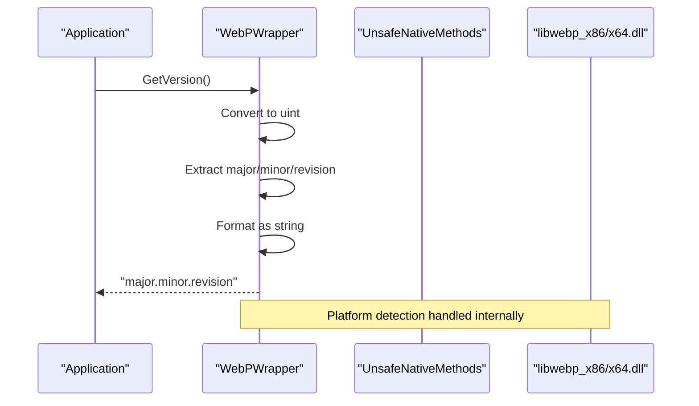
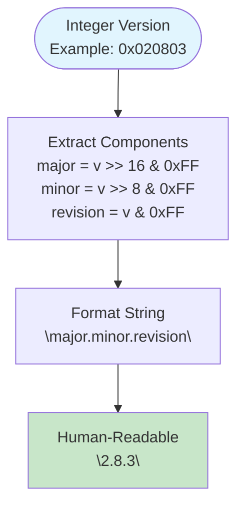
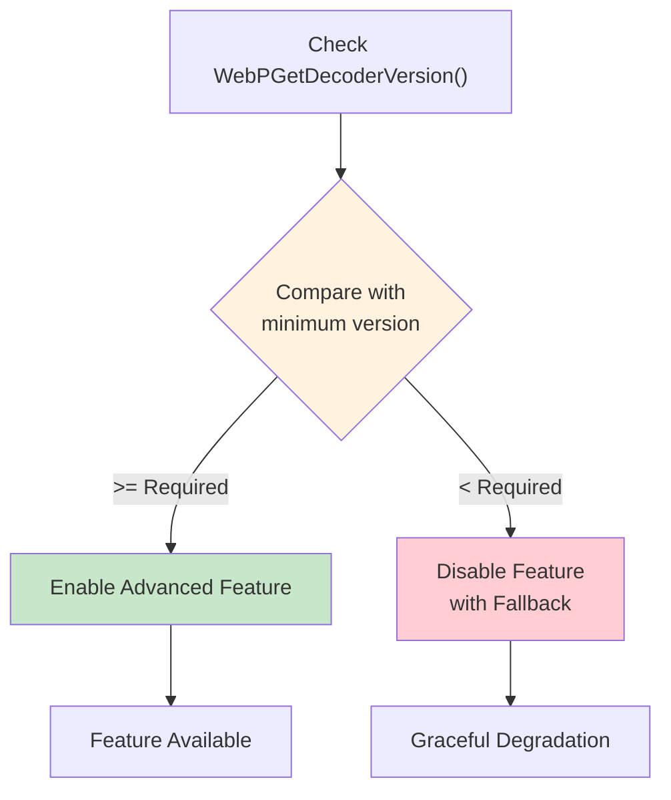
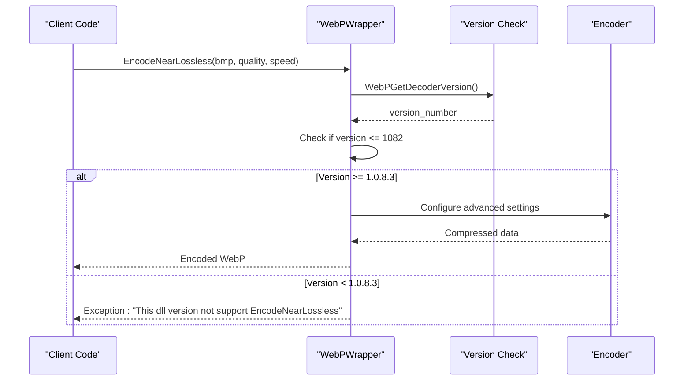
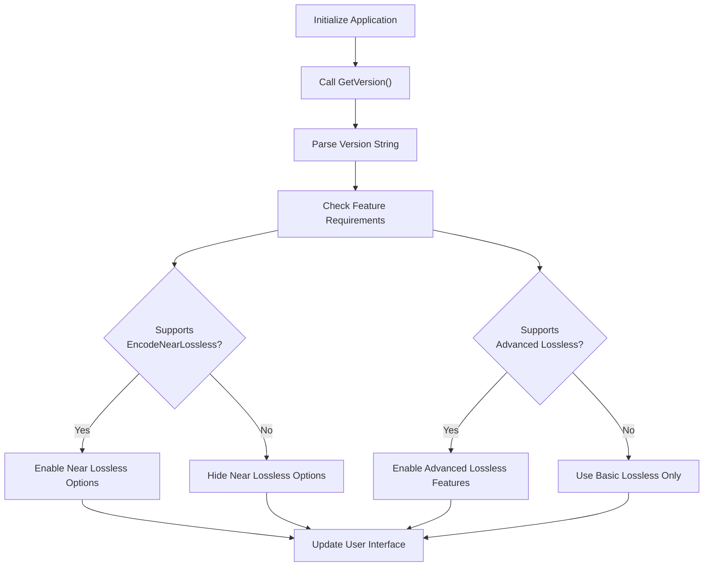
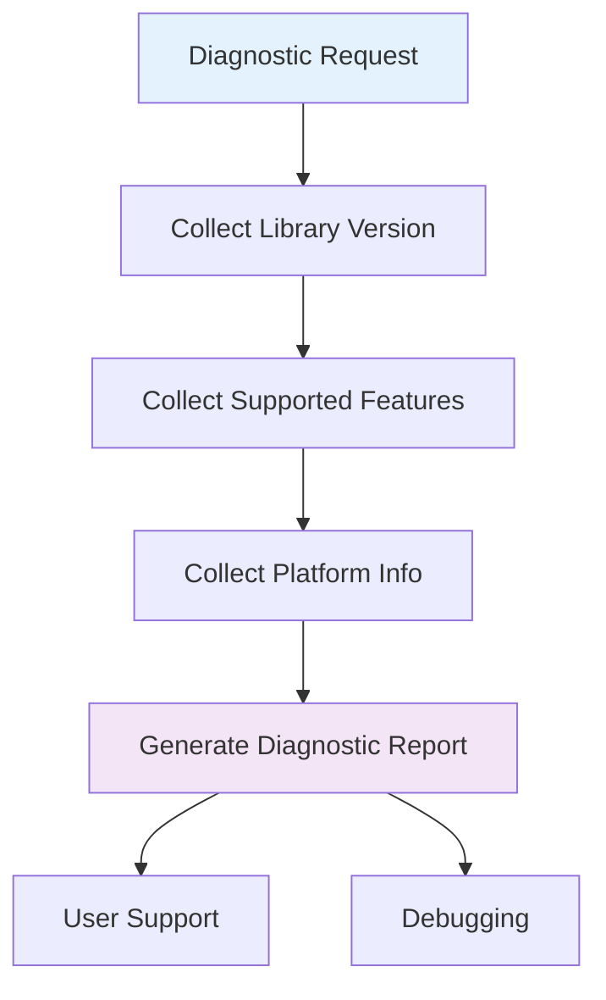
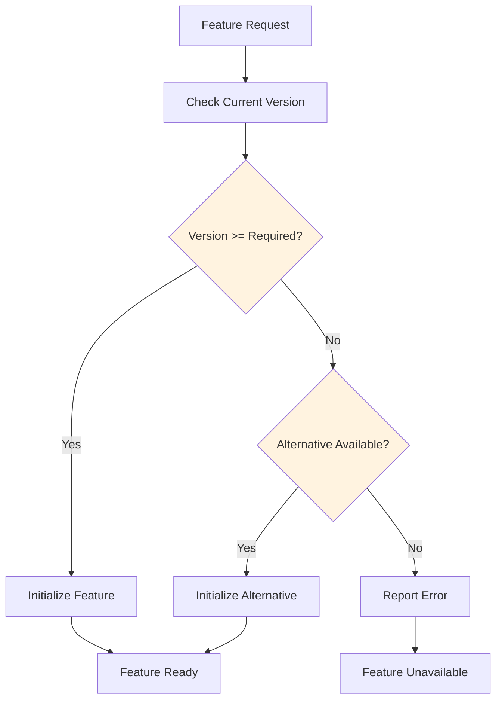

# Library Version Management

<cite>
**Referenced Files in This Document**
- [WebPWrapper.cs](file://SETUNA/Plugins/WebPWrapper.cs)
- [ResourceExtractor.cs](file://SETUNA/Plugins/ResourceExtractor.cs)
- [SetunaOption.cs](file://SETUNA/Main/Option/SetunaOption.cs)
- [Program.cs](file://SETUNA/Program.cs)
- [README.md](file://README.md)
</cite>

## Table of Contents
1. [Introduction](#introduction)
2. [GetVersion Method Implementation](#getversion-method-implementation)
3. [Version Number Format and Conversion](#version-number-format-and-conversion)
4. [Feature Compatibility and Version Checking](#feature-compatibility-and-version-checking)
5. [Practical Implementation Examples](#practical-implementation-examples)
6. [Common Issues and Troubleshooting](#common-issues-and-troubleshooting)
7. [Diagnostic Reporting and User Support](#diagnostic-reporting-and-user-support)
8. [Best Practices](#best-practices)
9. [Conclusion](#conclusion)

## Introduction

The SETUNA application implements sophisticated library version management for the embedded libwebp library, which is crucial for maintaining feature compatibility and enabling advanced functionality based on runtime capabilities. The version management system centers around the `GetVersion()` method, which retrieves the embedded libwebp library version and converts it into a human-readable format for application logic and user diagnostics.

This documentation provides comprehensive coverage of the version management implementation, focusing on the `GetVersion()` method, its role in feature compatibility, and practical guidance for implementing version-aware functionality in applications.

## GetVersion Method Implementation

The `GetVersion()` method serves as the primary interface for retrieving the embedded libwebp library version information. It operates through a platform-specific wrapper that handles both 32-bit and 64-bit library variants.

**Diagram sources**
- [WebPWrapper.cs](file://SETUNA/Plugins/WebPWrapper.cs#L663-L676)

The method follows a straightforward implementation pattern that ensures cross-platform compatibility:

1. **Platform Detection**: Automatically determines whether to use the 32-bit or 64-bit library variant
2. **Raw Value Retrieval**: Calls the native `WebPGetDecoderVersion()` function
3. **Type Conversion**: Casts the integer return value to unsigned integer for bit manipulation
4. **Format Conversion**: Extracts individual version components and formats as a readable string

**Section sources**
- [WebPWrapper.cs](file://SETUNA/Plugins/WebPWrapper.cs#L663-L676)

## Version Number Format and Conversion

The libwebp library returns version information as a packed integer value where each byte represents a different version component. Understanding this format is essential for proper version interpretation and comparison.

### Bit-Level Version Structure

The version number is encoded using a packed integer format where:
- **Major version**: Upper 8 bits (bits 24-31)
- **Minor version**: Middle 8 bits (bits 16-23)
- **Revision**: Lower 8 bits (bits 0-7)

**Diagram sources**
- [WebPWrapper.cs](file://SETUNA/Plugins/WebPWrapper.cs#L669-L673)

### Implementation Details

The conversion process involves bitwise operations to extract each version component:

- **Major version extraction**: `(v >> 16) & 0xFF`
- **Minor version extraction**: `(v >> 8) & 0xFF`
- **Revision extraction**: `v & 0xFF`

This approach ensures accurate parsing regardless of the underlying integer representation and provides consistent results across different platforms.

**Section sources**
- [WebPWrapper.cs](file://SETUNA/Plugins/WebPWrapper.cs#L669-L673)

## Feature Compatibility and Version Checking

Version checking is fundamental for determining feature availability and enabling graceful degradation when advanced functionality is not supported by the current library version.

### Minimum Version Requirements

Different libwebp features require specific minimum library versions:

| Feature | Minimum Version | Purpose |
|---------|----------------|---------|
| EncodeNearLossless | 1.0.8.3 (0x020803) | Near-lossless compression |
| Advanced Lossless Presets | 1.0.8.3 (0x020803) | Enhanced lossless compression |
| Preprocessing 4 | 1.0.8.3 (0x020803) | Advanced compression optimization |

### Version Guard Implementation Patterns

The application implements several patterns for version-based feature control:

**Diagram sources**
- [WebPWrapper.cs](file://SETUNA/Plugins/WebPWrapper.cs#L506-L516)
- [WebPWrapper.cs](file://SETUNA/Plugins/WebPWrapper.cs#L596-L606)
- [WebPWrapper.cs](file://SETUNA/Plugins/WebPWrapper.cs#L631-L635)

**Section sources**
- [WebPWrapper.cs](file://SETUNA/Plugins/WebPWrapper.cs#L506-L516)
- [WebPWrapper.cs](file://SETUNA/Plugins/WebPWrapper.cs#L596-L606)
- [WebPWrapper.cs](file://SETUNA/Plugins/WebPWrapper.cs#L631-L635)

## Practical Implementation Examples

### Example 1: EncodeNearLossless Feature Guard

The `EncodeNearLossless` method demonstrates comprehensive version checking with fallback mechanisms:

**Diagram sources**
- [WebPWrapper.cs](file://SETUNA/Plugins/WebPWrapper.cs#L629-L658)

### Example 2: Dynamic Feature Availability

Applications can implement dynamic feature detection based on version information:

**Diagram sources**
- [WebPWrapper.cs](file://SETUNA/Plugins/WebPWrapper.cs#L629-L658)

**Section sources**
- [WebPWrapper.cs](file://SETUNA/Plugins/WebPWrapper.cs#L629-L658)

## Common Issues and Troubleshooting

### Version Mismatch Between Components

One of the most common issues occurs when encoder and decoder components have different version levels, leading to compatibility problems.

#### Symptoms
- Encoding works but decoding fails
- Unexpected compression artifacts
- Runtime exceptions during feature usage

#### Solutions
1. **Consistent Version Policy**: Ensure all libwebp components use the same version
2. **Version Validation**: Implement checks to verify component compatibility
3. **Fallback Mechanisms**: Provide alternative compression methods when advanced features are unavailable

### Backward Compatibility Considerations

Understanding version compatibility helps prevent breaking changes:

| Version Range | Compatibility Notes |
|---------------|-------------------|
| 1.0.0.0 - 1.0.8.2 | Basic functionality only |
| 1.0.8.3+ | Supports advanced features |
| 1.1.0.0+ | Additional optimizations and bug fixes |

### Diagnostic Information Collection

The application provides comprehensive diagnostic information for troubleshooting:

**Diagram sources**
- [WebPWrapper.cs](file://SETUNA/Plugins/WebPWrapper.cs#L663-L676)

**Section sources**
- [WebPWrapper.cs](file://SETUNA/Plugins/WebPWrapper.cs#L663-L676)

## Diagnostic Reporting and User Support

The version management system integrates with the application's diagnostic capabilities to provide comprehensive support information.

### Built-in Diagnostic Features

The application includes several diagnostic tools that leverage version information:

1. **Version Display**: Shows both application and library versions
2. **Feature Availability**: Lists supported compression features
3. **Compatibility Warnings**: Alerts users to potential issues

### User Support Scenarios

Common support scenarios where version information is crucial:

| Scenario | Required Information | Action Steps |
|----------|---------------------|--------------|
| Encoding Failures | Library version, feature support | Check minimum version requirements |
| Performance Issues | Compression settings vs. version | Recommend optimal settings |
| Compatibility Problems | Both client and server versions | Verify version compatibility |

**Section sources**
- [SetunaOption.cs](file://SETUNA/Main/Option/SetunaOption.cs#L601-L624)
- [Program.cs](file://SETUNA/Program.cs#L1-L33)

## Best Practices

### Version Checking Implementation

1. **Centralized Version Management**: Use a single point of truth for version information
2. **Graceful Degradation**: Always provide fallback options when features are unavailable
3. **Clear Error Messages**: Provide actionable feedback when version requirements aren't met
4. **Documentation**: Clearly document minimum version requirements for all features

### Feature Detection Strategies

### Testing and Validation

Implement comprehensive testing for version-dependent functionality:

1. **Version Matrix Testing**: Test all combinations of supported versions
2. **Edge Case Handling**: Test with boundary versions and unexpected inputs
3. **Regression Testing**: Ensure version checks don't break existing functionality

## Conclusion

The library version management system in SETUNA demonstrates sophisticated approach to handling dynamic library capabilities. The `GetVersion()` method provides essential functionality for feature compatibility, enabling applications to adapt to varying library versions while maintaining robust operation.

Key takeaways for implementing version management:

- **Centralized Version Access**: Provide a single, reliable method for version information
- **Comprehensive Feature Detection**: Enable fine-grained feature availability checking
- **Graceful Degradation**: Always provide fallback options for unsupported features
- **User-Friendly Diagnostics**: Make version information accessible for troubleshooting

The system's design patterns and implementation strategies serve as excellent examples for applications requiring dynamic feature adaptation based on external library capabilities. Proper version management ensures reliable operation across diverse deployment environments while enabling users to access advanced functionality when available.