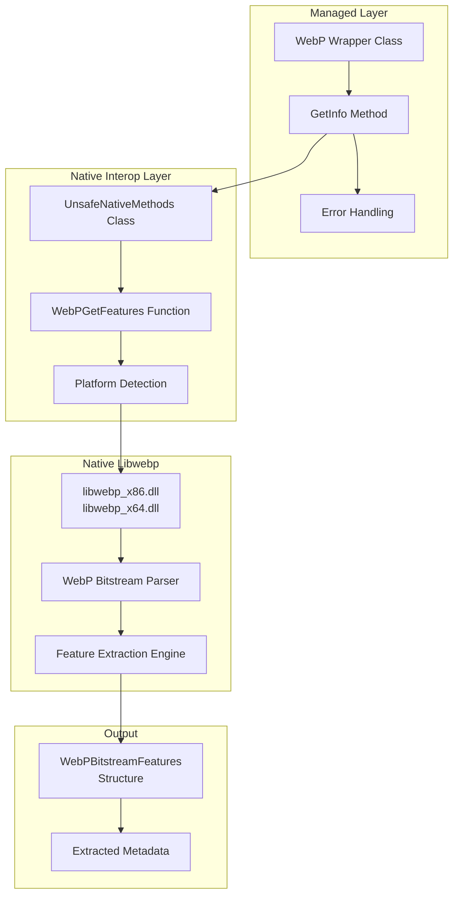
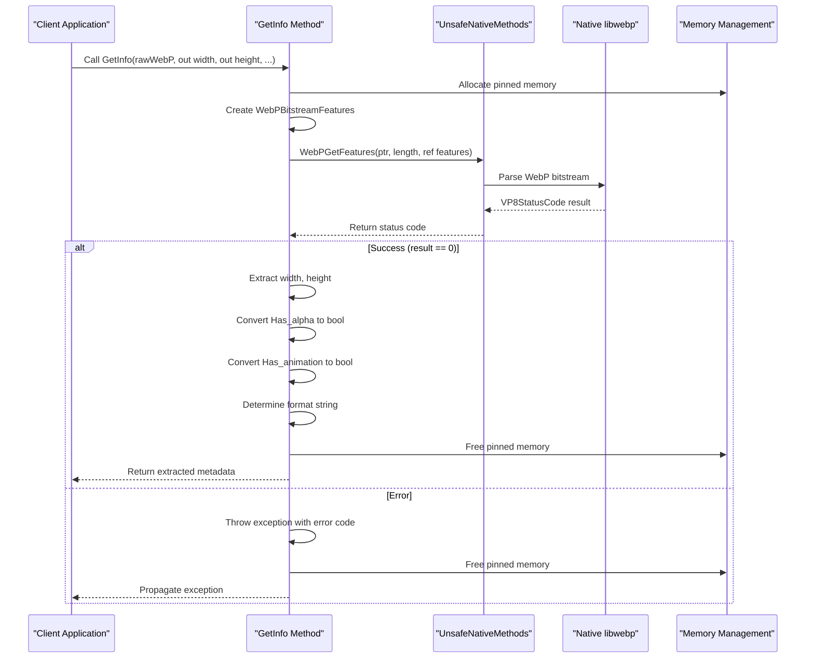
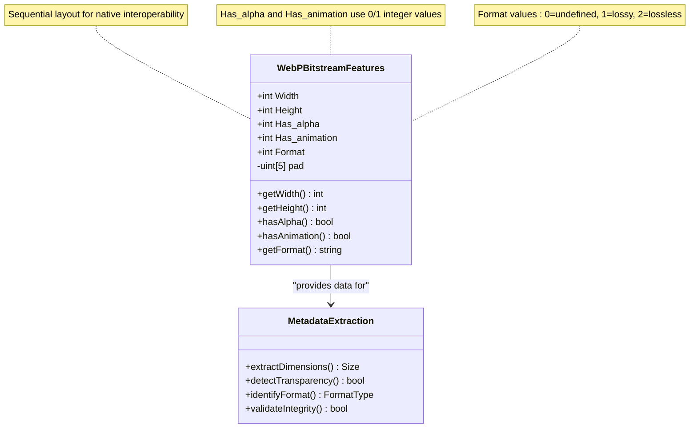
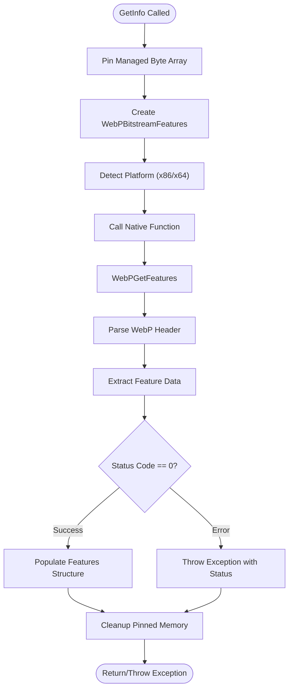
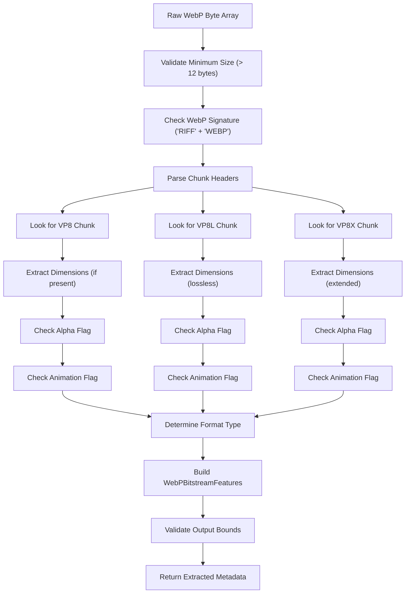
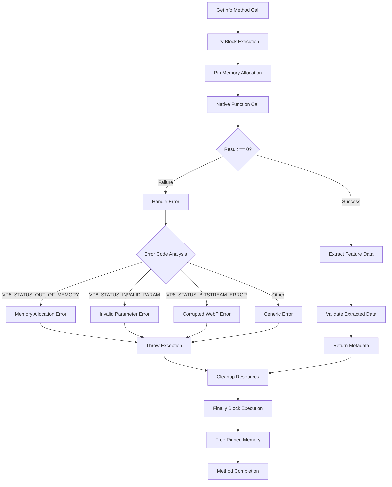

# WebP Metadata Extraction

<cite>
**Referenced Files in This Document**
- [WebPWrapper.cs](file://SETUNA/Plugins/WebPWrapper.cs)
</cite>

## Table of Contents
1. [Introduction](#introduction)
2. [Architecture Overview](#architecture-overview)
3. [Core GetInfo Method Implementation](#core-getinfo-method-implementation)
4. [WebPBitstreamFeatures Structure](#webpbitstreamfeatures-structure)
5. [Native Library Integration](#native-library-integration)
6. [Metadata Extraction Process](#metadata-extraction-process)
7. [Practical Usage Examples](#practical-usage-examples)
8. [Error Handling and Validation](#error-handling-and-validation)
9. [Performance Considerations](#performance-considerations)
10. [Common Issues and Solutions](#common-issues-and-solutions)
11. [Best Practices](#best-practices)

## Introduction

The WebP metadata extraction functionality in the WebPWrapper library provides comprehensive capabilities to extract essential information from WebP image byte arrays without fully decoding the image data. This efficient approach enables applications to validate WebP data integrity, determine appropriate rendering pathways, and optimize processing workflows before committing to full image decoding.

The primary method, `GetInfo`, serves as the cornerstone for metadata extraction, retrieving critical attributes including image dimensions, alpha channel presence, animation status, and format type (lossy, lossless, or undefined). This functionality is built upon the native libwebp library, ensuring compatibility with the WebP specification while providing a managed C# interface for .NET applications.

## Architecture Overview

The WebP metadata extraction system follows a layered architecture that seamlessly bridges managed C# code with native libwebp functionality:



**Diagram sources**
- [WebPWrapper.cs](file://SETUNA/Plugins/WebPWrapper.cs#L685-L744)
- [WebPWrapper.cs](file://SETUNA/Plugins/WebPWrapper.cs#L1087-L1140)

## Core GetInfo Method Implementation

The `GetInfo` method represents the primary interface for metadata extraction, implementing a robust process that ensures safe memory management and comprehensive error handling:



**Diagram sources**
- [WebPWrapper.cs](file://SETUNA/Plugins/WebPWrapper.cs#L685-L744)

The method implementation demonstrates several key architectural principles:

### Memory Safety and Resource Management
The method employs `GCHandle` for safe pinning of managed byte arrays, preventing garbage collection during native library calls. Automatic resource cleanup occurs in the `finally` block, ensuring memory deallocation even in error scenarios.

### Type Conversion and Normalization
The native libwebp library returns integer flags (0/1) for boolean properties, which the wrapper converts to proper C# boolean values. Format detection involves switch-case logic that translates numeric format codes into descriptive strings.

**Section sources**
- [WebPWrapper.cs](file://SETUNA/Plugins/WebPWrapper.cs#L685-L744)

## WebPBitstreamFeatures Structure

The `WebPBitstreamFeatures` structure serves as the data container for extracted metadata, designed to mirror the native libwebp feature extraction interface:



**Diagram sources**
- [WebPWrapper.cs](file://SETUNA/Plugins/WebPWrapper.cs#L1755-L1771)

### Field Specifications and Constraints

| Field | Type | Description | Constraints |
|-------|------|-------------|-------------|
| Width | int | Image width in pixels | Range: 1-16383 (WEBP_MAX_DIMENSION) |
| Height | int | Image height in pixels | Range: 1-16383 (WEBP_MAX_DIMENSION) |
| Has_alpha | int | Alpha channel presence indicator | Values: 0 (no), 1 (yes) |
| Has_animation | int | Animation capability indicator | Values: 0 (no), 1 (yes) |
| Format | int | Compression format identifier | Values: 0 (undefined/mixed), 1 (lossy), 2 (lossless) |

### Padding and Compatibility
The structure includes five padding fields (`pad`) to maintain alignment and accommodate future extensions, ensuring binary compatibility across libwebp versions.

**Section sources**
- [WebPWrapper.cs](file://SETUNA/Plugins/WebPWrapper.cs#L1755-L1771)

## Native Library Integration

The native library integration layer provides seamless communication between managed C# code and the native libwebp implementation:



**Diagram sources**
- [WebPWrapper.cs](file://SETUNA/Plugins/WebPWrapper.cs#L1123-L1140)

### Platform-Specific Function Calls

The native interop layer automatically selects the appropriate DLL and function signature based on the runtime platform:

- **x86 Platforms**: Uses `libwebp_x86.dll` with 32-bit function signatures
- **x64 Platforms**: Uses `libwebp_x64.dll` with 64-bit function signatures
- **Parameter Marshaling**: Automatic conversion between managed and native types

### Function Signature Details

The native `WebPGetFeatures` function accepts:
- Pointer to WebP data (`IntPtr`)
- Data size (`int` or `UIntPtr`)
- Reference to `WebPBitstreamFeatures` structure
- ABI version constant (`WEBP_DECODER_ABI_VERSION`)

**Section sources**
- [WebPWrapper.cs](file://SETUNA/Plugins/WebPWrapper.cs#L1123-L1140)

## Metadata Extraction Process

The metadata extraction process involves systematic parsing of WebP bitstream headers to identify key characteristics:



### Feature Detection Algorithm

The extraction algorithm prioritizes different chunk types based on WebP specification guidelines:

1. **VP8X Chunk Priority**: Contains comprehensive metadata including dimensions, alpha, animation, and format flags
2. **VP8L Chunk Priority**: Lossless format with embedded dimensions and alpha information
3. **VP8 Chunk Priority**: Traditional lossy format with basic dimension data

### Edge Case Handling

The extraction process accounts for various edge cases:
- Corrupted or truncated WebP headers
- Unsupported chunk types
- Dimension limits exceeding WEBP_MAX_DIMENSION
- Mixed-format WebP files

**Section sources**
- [WebPWrapper.cs](file://SETUNA/Plugins/WebPWrapper.cs#L694-L733)

## Practical Usage Examples

### Basic Metadata Validation

```csharp
// Example: Validate WebP data integrity before processing
public bool ValidateWebPData(byte[] webpData)
{
    try
    {
        int width, height;
        bool hasAlpha, hasAnimation;
        string format;
        
        webpInstance.GetInfo(webpData, out width, out height, out hasAlpha, out hasAnimation, out format);
        
        // Perform validation checks
        if (width <= 0 || height <= 0)
            return false;
            
        if (width > 16383 || height > 16383)
            return false;
            
        return true;
    }
    catch (Exception)
    {
        return false;
    }
}
```

### Transparency Support Detection

```csharp
// Example: Determine appropriate rendering pathway
public RenderingPath DetermineRenderingPath(byte[] webpData)
{
    int width, height;
    bool hasAlpha, hasAnimation;
    string format;
    
    webpInstance.GetInfo(webpData, out width, out height, out hasAlpha, out hasAnimation, out format);
    
    if (hasAlpha)
    {
        if (format == "lossless")
            return RenderingPath.AlphaLossless;
        else
            return RenderingPath.AlphaLossy;
    }
    else
    {
        return RenderingPath.SolidColor;
    }
}
```

### Animation Capability Assessment

```csharp
// Example: Pre-screen for animation processing
public AnimationProcessingPlan AssessAnimationSupport(byte[] webpData)
{
    int width, height;
    bool hasAlpha, hasAnimation;
    string format;
    
    webpInstance.GetInfo(webpData, out width, out height, out hasAlpha, out hasAnimation, out format);
    
    if (hasAnimation)
    {
        return new AnimationProcessingPlan
        {
            SupportsAnimation = true,
            FrameCount = EstimateFrameCount(webpData),
            Duration = CalculateTotalDuration(webpData)
        };
    }
    
    return new AnimationProcessingPlan
    {
        SupportsAnimation = false,
        FrameCount = 1,
        Duration = TimeSpan.Zero
    };
}
```

### Format Type Analysis

```csharp
// Example: Optimize compression parameters based on format
public WebPConfig OptimizeCompressionParameters(byte[] webpData, int targetQuality)
{
    int width, height;
    bool hasAlpha, hasAnimation;
    string format;
    
    webpInstance.GetInfo(webpData, out width, out height, out hasAlpha, out hasAnimation, out format);
    
    var config = new WebPConfig();
    
    if (format == "lossless")
    {
        // Configure for lossless compression
        config.lossless = 1;
        config.quality = targetQuality;
        config.method = 4; // Balanced compression-speed
    }
    else
    {
        // Configure for lossy compression
        config.lossless = 0;
        config.quality = targetQuality;
        config.method = 6; // Slower but better compression
    }
    
    return config;
}
```

**Section sources**
- [WebPWrapper.cs](file://SETUNA/Plugins/WebPWrapper.cs#L685-L744)

## Error Handling and Validation

The WebP metadata extraction system implements comprehensive error handling to manage various failure scenarios gracefully:



### Error Classification and Handling

The system distinguishes between different categories of errors:

#### Memory-Related Errors
- **Out of Memory**: Insufficient system resources for allocation
- **Invalid Platform**: Architecture mismatch (32-bit vs 64-bit)

#### Data Integrity Errors
- **Corrupted Headers**: Malformed WebP bitstream structure
- **Unsupported Features**: Advanced WebP features not supported by the library version

#### Parameter Validation Errors
- **Null References**: Invalid input byte array
- **Size Constraints**: WebP data smaller than minimum required size

### Exception Propagation Strategy

The error handling follows a hierarchical approach:
1. **Native Layer**: Returns VP8StatusCode enumeration values
2. **Interop Layer**: Converts status codes to descriptive exceptions
3. **Wrapper Layer**: Provides contextual error messages with method names
4. **Application Layer**: Receives formatted exceptions for user-friendly error display

**Section sources**
- [WebPWrapper.cs](file://SETUNA/Plugins/WebPWrapper.cs#L697-L700)
- [WebPWrapper.cs](file://SETUNA/Plugins/WebPWrapper.cs#L734-L735)

## Performance Considerations

### Memory Management Efficiency

The metadata extraction process optimizes memory usage through several strategies:

#### Pinned Memory Lifecycle
- **Minimal Pin Duration**: Memory remains pinned only during native function calls
- **Automatic Cleanup**: Guaranteed cleanup in finally blocks prevents memory leaks
- **Garbage Collection Safety**: Prevents collection of managed arrays during native operations

#### Native Library Optimization
- **Zero-Copy Operations**: Direct pointer access eliminates unnecessary data copying
- **Platform-Specific Optimizations**: Architecture-aware function selection
- **Minimal Allocations**: Reuse of managed structures for native interoperability

### Processing Time Analysis

| Operation | Typical Duration | Factors Affecting Performance |
|-----------|------------------|-------------------------------|
| Memory Pinning | < 1ms | System memory availability |
| Native Function Call | 1-10ms | WebP header complexity |
| Data Extraction | < 1ms | Feature completeness |
| Total Processing | 2-15ms | WebP file characteristics |

### Scalability Considerations

For high-throughput scenarios, consider these optimization strategies:

#### Batch Processing
- Group multiple WebP files for sequential processing
- Minimize overhead from repeated initialization
- Implement worker thread pools for concurrent processing

#### Caching Strategies
- Cache frequently accessed metadata
- Implement LRU eviction policies for memory efficiency
- Store extracted features alongside original WebP data

#### Streaming Approaches
- Process WebP files in chunks for large datasets
- Implement progressive loading for web applications
- Use async/await patterns for responsive user interfaces

## Common Issues and Solutions

### Corrupted WebP Headers

**Problem**: WebP files with malformed headers cause extraction failures.

**Symptoms**:
- `VP8_STATUS_BITSTREAM_ERROR` exceptions
- Unexpected dimension values (0 or negative)
- Inconsistent format detection

**Solutions**:
```csharp
public bool RobustGetInfo(byte[] webpData, 
    out int width, out int height, 
    out bool hasAlpha, out bool hasAnimation, out string format)
{
    width = height = 0;
    hasAlpha = hasAnimation = false;
    format = "undefined";
    
    try
    {
        // Attempt primary extraction
        webpInstance.GetInfo(webpData, out width, out height, out hasAlpha, out hasAnimation, out format);
        
        // Validate extracted values
        if (width <= 0 || height <= 0 || width > 16383 || height > 16383)
        {
            // Fall back to basic header validation
            return BasicHeaderValidation(webpData, out width, out height);
        }
        
        return true;
    }
    catch (Exception)
    {
        // Fall back to basic header validation
        return BasicHeaderValidation(webpData, out width, out height);
    }
}

private bool BasicHeaderValidation(byte[] webpData, out int width, out int height)
{
    // Implement basic RIFF/WEBP header validation
    // Extract dimensions from VP8/VP8L chunk headers
    // Return true if dimensions appear reasonable
}
```

### Edge Cases in Format Detection

**Problem**: Mixed-format WebP files or unsupported features cause ambiguous results.

**Solutions**:
```csharp
public FormatAnalysis AnalyzeFormatRobustly(byte[] webpData)
{
    var analysis = new FormatAnalysis();
    
    try
    {
        webpInstance.GetInfo(webpData, 
            out analysis.Width, out analysis.Height, 
            out analysis.HasAlpha, out analysis.HasAnimation, 
            out analysis.DetectedFormat);
        
        // Additional validation for mixed formats
        if (analysis.DetectedFormat == "undefined")
        {
            // Perform deeper analysis using native WebPGetInfo
            if (UnsafeNativeMethods.WebPGetInfo(...) == 1)
            {
                analysis.DetectedFormat = "partially_supported";
            }
        }
    }
    catch (Exception)
    {
        analysis.DetectionFailed = true;
    }
    
    return analysis;
}
```

### Performance Degradation

**Problem**: Large WebP files with extensive metadata cause slow processing.

**Solutions**:
```csharp
public MetadataExtractionResult ExtractOptimized(byte[] webpData, 
    ExtractionOptions options = null)
{
    options ??= new ExtractionOptions();
    
    // Early termination for large files
    if (webpData.Length > options.MaxFileSize)
    {
        return ExtractBasicMetadata(webpData);
    }
    
    // Use streaming approach for very large files
    if (webpData.Length > options.StreamThreshold)
    {
        return ExtractStreamingMetadata(webpData);
    }
    
    // Standard extraction for typical files
    return ExtractStandardMetadata(webpData);
}
```

### Platform Compatibility Issues

**Problem**: Architecture mismatches between managed code and native libraries.

**Solutions**:
```csharp
public class WebPCompatibilityChecker
{
    public static bool IsCompatible()
    {
        try
        {
            // Test native function call
            var testBuffer = new byte[12]; // Minimal WebP header
            var features = new WebPBitstreamFeatures();
            
            var result = UnsafeNativeMethods.WebPGetFeatures(
                Marshal.UnsafeAddrOfPinnedArrayElement(testBuffer, 0),
                testBuffer.Length, ref features);
                
            return result == 0;
        }
        catch (DllNotFoundException)
        {
            // Native library not found
            return false;
        }
        catch (EntryPointNotFoundException)
        {
            // Function not available in library
            return false;
        }
        catch (Exception)
        {
            // Other compatibility issues
            return false;
        }
    }
}
```

## Best Practices

### Defensive Programming

Always implement comprehensive validation and error handling:

```csharp
public MetadataResult SafeExtractMetadata(byte[] webpData)
{
    if (webpData == null || webpData.Length < 12)
    {
        return MetadataResult.Failure("Invalid WebP data");
    }
    
    try
    {
        int width, height;
        bool hasAlpha, hasAnimation;
        string format;
        
        webpInstance.GetInfo(webpData, out width, out height, out hasAlpha, out hasAnimation, out format);
        
        return MetadataResult.Success(width, height, hasAlpha, hasAnimation, format);
    }
    catch (Exception ex)
    {
        return MetadataResult.Failure($"Metadata extraction failed: {ex.Message}");
    }
}
```

### Resource Management

Implement proper resource cleanup patterns:

```csharp
public class WebPMetadataProcessor : IDisposable
{
    private readonly WebP webpInstance;
    private bool disposed = false;
    
    public void ProcessWebPFiles(IEnumerable<byte[]> webpFiles)
    {
        foreach (var webpData in webpFiles)
        {
            using (var memoryHandle = GCHandle.Alloc(webpData, GCHandleType.Pinned))
            {
                try
                {
                    // Process WebP data
                    ProcessSingleWebP(webpData);
                }
                catch (Exception)
                {
                    // Continue with next file
                    continue;
                }
            }
        }
    }
    
    public void Dispose()
    {
        if (!disposed)
        {
            // Clean up resources
            disposed = true;
        }
    }
}
```

### Performance Optimization

Implement caching and batch processing:

```csharp
public class WebPMetadataCache
{
    private readonly Dictionary<string, WebPBitstreamFeatures> cache = 
        new Dictionary<string, WebPBitstreamFeatures>();
    private readonly object cacheLock = new object();
    
    public WebPBitstreamFeatures GetOrExtract(byte[] webpData)
    {
        var hash = ComputeHash(webpData);
        
        lock (cacheLock)
        {
            if (cache.TryGetValue(hash, out var features))
            {
                return features;
            }
            
            // Extract and cache
            webpInstance.GetInfo(webpData, out var width, out var height, 
                out var hasAlpha, out var hasAnimation, out var format);
                
            features = new WebPBitstreamFeatures
            {
                Width = width,
                Height = height,
                Has_alpha = hasAlpha ? 1 : 0,
                Has_animation = hasAnimation ? 1 : 0,
                Format = GetFormatCode(format)
            };
            
            cache[hash] = features;
            return features;
        }
    }
}
```

### Security Considerations

Validate input data to prevent security vulnerabilities:

```csharp
public class SecureWebPMetadataExtractor
{
    public MetadataResult ExtractSecurely(byte[] webpData)
    {
        // Validate input size
        if (webpData == null || webpData.Length == 0 || webpData.Length > 100 * 1024 * 1024)
        {
            return MetadataResult.Failure("Invalid or suspicious WebP data size");
        }
        
        // Check for potential malicious content
        if (ContainsSuspiciousPatterns(webpData))
        {
            return MetadataResult.Failure("Potential malicious WebP data detected");
        }
        
        // Extract metadata with timeout
        return ExtractWithTimeout(webpData, TimeSpan.FromSeconds(5));
    }
    
    private bool ContainsSuspiciousPatterns(byte[] webpData)
    {
        // Implement pattern detection for known malicious WebP variants
        // Check for oversized dimensions, unusual chunk combinations, etc.
        return false;
    }
}
```

The WebP metadata extraction functionality provides a robust foundation for WebP image processing applications, offering efficient metadata extraction while maintaining compatibility with the WebP specification and .NET ecosystem standards.