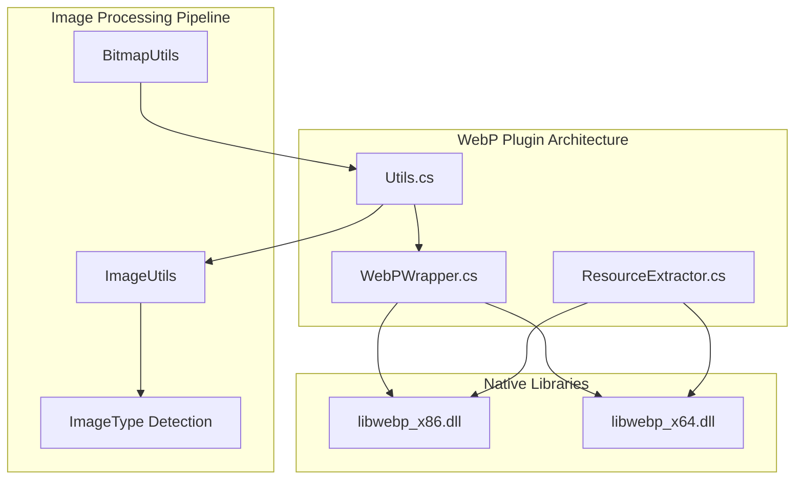
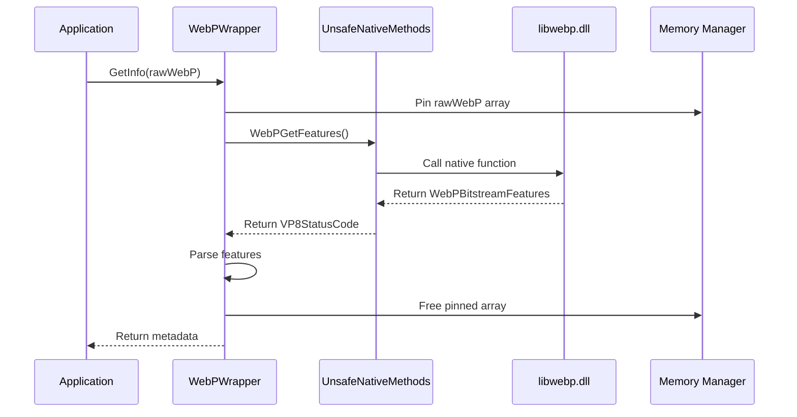
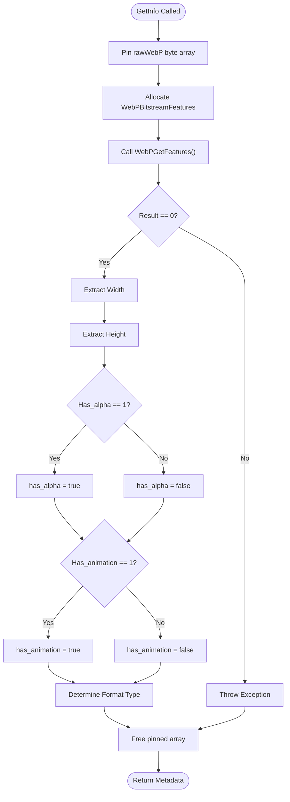
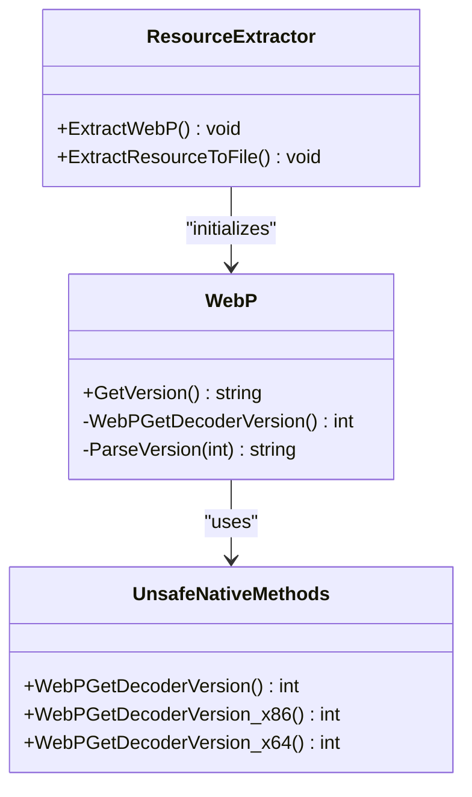
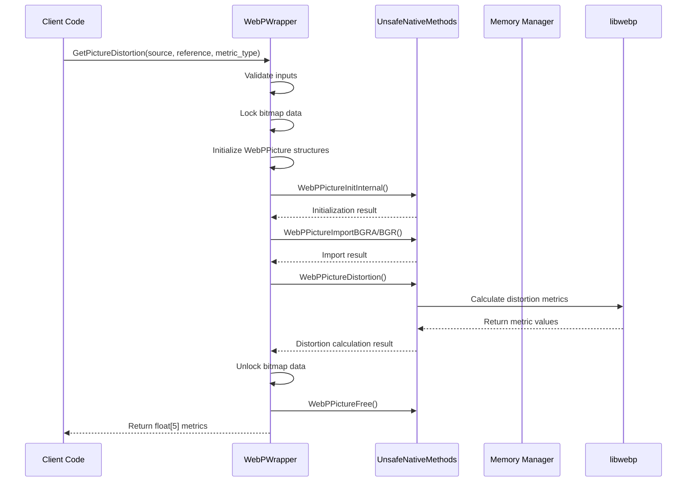
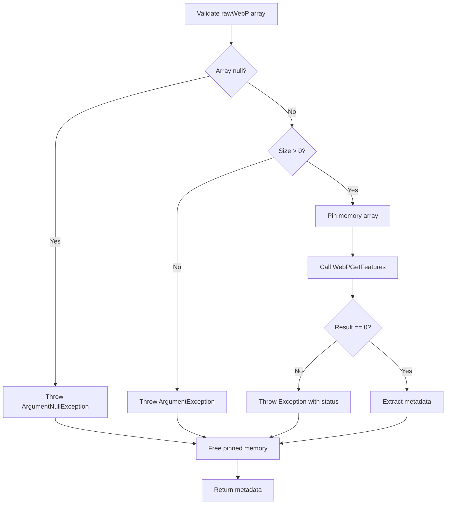
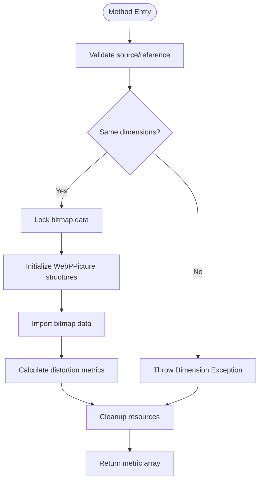
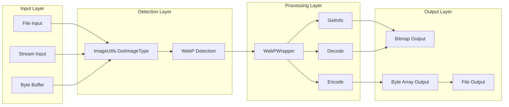

# WebP Utilities and Metadata Operations

<cite>
**Referenced Files in This Document**
- [WebPWrapper.cs](file://SETUNA/Plugins/WebPWrapper.cs)
- [Utils.cs](file://SETUNA/Main/Common/Utils.cs)
- [ResourceExtractor.cs](file://SETUNA/Plugins/ResourceExtractor.cs)
</cite>

## Table of Contents
1. [Introduction](#introduction)
2. [Project Structure](#project-structure)
3. [Core Components](#core-components)
4. [Architecture Overview](#architecture-overview)
5. [Detailed Component Analysis](#detailed-component-analysis)
6. [Metadata Extraction Operations](#metadata-extraction-operations)
7. [Version Management](#version-management)
8. [Quality Measurement Tools](#quality-measurement-tools)
9. [Integration Patterns](#integration-patterns)
10. [Performance Considerations](#performance-considerations)
11. [Troubleshooting Guide](#troubleshooting-guide)
12. [Best Practices](#best-practices)
13. [Conclusion](#conclusion)

## Introduction

The WebP utilities in the SETUNA project provide comprehensive functionality for working with WebP image format data. This documentation covers the essential utility functions for metadata extraction, version management, and quality measurement operations. The WebP wrapper serves as a bridge between the managed C# environment and the native libwebp library, enabling efficient WebP image processing capabilities within the application.

The utility functions are designed to handle various WebP operations including metadata extraction, version checking, and distortion measurements for quality assessment. These tools are integral to the image processing pipeline, providing validation, compatibility checking, and quality assurance capabilities.

## Project Structure

The WebP utilities are organized within the SETUNA project's plugin architecture, with dedicated components for wrapping native library functionality and integrating with the broader image processing system.



**Diagram sources**
- [WebPWrapper.cs](file://SETUNA/Plugins/WebPWrapper.cs#L32-L40)
- [ResourceExtractor.cs](file://SETUNA/Plugins/ResourceExtractor.cs#L8-L25)
- [Utils.cs](file://SETUNA/Main/Common/Utils.cs#L172-L236)

**Section sources**
- [WebPWrapper.cs](file://SETUNA/Plugins/WebPWrapper.cs#L1-L50)
- [ResourceExtractor.cs](file://SETUNA/Plugins/ResourceExtractor.cs#L1-L44)

## Core Components

The WebP utilities consist of several key components that work together to provide comprehensive WebP image processing capabilities:

### WebPWrapper Class
The primary interface that encapsulates all WebP functionality, providing methods for encoding, decoding, metadata extraction, and quality measurement.

### ResourceExtractor
Handles dynamic loading of native libwebp libraries based on the target platform architecture (x86/x64).

### Native Library Bridge
Provides P/Invoke declarations for accessing libwebp functions from managed code.

### Utility Integration Layer
Integrates WebP operations with the broader image processing pipeline through utility classes.

**Section sources**
- [WebPWrapper.cs](file://SETUNA/Plugins/WebPWrapper.cs#L34-L40)
- [ResourceExtractor.cs](file://SETUNA/Plugins/ResourceExtractor.cs#L8-L25)

## Architecture Overview

The WebP utilities follow a layered architecture that separates concerns between native library interaction, managed code abstraction, and application integration.



**Diagram sources**
- [WebPWrapper.cs](file://SETUNA/Plugins/WebPWrapper.cs#L685-L734)
- [WebPWrapper.cs](file://SETUNA/Plugins/WebPWrapper.cs#L1118-L1138)

## Detailed Component Analysis

### GetInfo Method Implementation

The GetInfo method serves as the primary metadata extraction utility, providing comprehensive information about WebP image data without full decoding.



**Diagram sources**
- [WebPWrapper.cs](file://SETUNA/Plugins/WebPWrapper.cs#L685-L734)

The GetInfo method extracts the following metadata:
- **Image Dimensions**: Width and height in pixels
- **Alpha Channel Presence**: Boolean indicating transparency support
- **Animation Status**: Boolean indicating animated WebP format
- **Format Type**: Lossy, lossless, or undefined classification

**Section sources**
- [WebPWrapper.cs](file://SETUNA/Plugins/WebPWrapper.cs#L685-L734)

### Version Management System

The version management system provides access to the embedded libwebp library version information, enabling feature compatibility checks and version-specific optimizations.



**Diagram sources**
- [WebPWrapper.cs](file://SETUNA/Plugins/WebPWrapper.cs#L665-L673)
- [WebPWrapper.cs](file://SETUNA/Plugins/WebPWrapper.cs#L1574-L1591)
- [ResourceExtractor.cs](file://SETUNA/Plugins/ResourceExtractor.cs#L8-L25)

**Section sources**
- [WebPWrapper.cs](file://SETUNA/Plugins/WebPWrapper.cs#L665-L673)
- [WebPWrapper.cs](file://SETUNA/Plugins/WebPWrapper.cs#L1574-L1591)

### PictureDistortion Calculation

The PictureDistortion method provides sophisticated quality measurement capabilities using PSNR, SSIM, or LSIM metrics.



**Diagram sources**
- [WebPWrapper.cs](file://SETUNA/Plugins/WebPWrapper.cs#L751-L848)
- [WebPWrapper.cs](file://SETUNA/Plugins/WebPWrapper.cs#L1593-L1611)

**Section sources**
- [WebPWrapper.cs](file://SETUNA/Plugins/WebPWrapper.cs#L751-L848)

## Metadata Extraction Operations

### GetInfo Method Details

The GetInfo method provides comprehensive metadata extraction from WebP byte arrays without requiring full image decoding. This operation is lightweight and efficient for preliminary image validation.

#### Method Signature and Parameters

| Parameter | Type | Description | Direction |
|-----------|------|-------------|-----------|
| rawWebP | byte[] | WebP image data byte array | Input |
| width | out int | Output parameter for image width | Output |
| height | out int | Output parameter for image height | Output |
| has_alpha | out bool | Output parameter for alpha channel detection | Output |
| has_animation | out bool | Output parameter for animation detection | Output |
| format | out string | Output parameter for format classification | Output |

#### Metadata Classification System

The GetInfo method categorizes WebP images into distinct format types:

| Format Value | Classification | Description |
|--------------|----------------|-------------|
| 0 | undefined/mixed | Images with mixed characteristics or corrupted data |
| 1 | lossy | Compressed with quality loss, typically smaller file size |
| 2 | lossless | Compressed without quality loss, larger file size |

#### Error Handling and Validation

The method implements robust error handling for malformed WebP data:



**Diagram sources**
- [WebPWrapper.cs](file://SETUNA/Plugins/WebPWrapper.cs#L685-L734)

**Section sources**
- [WebPWrapper.cs](file://SETUNA/Plugins/WebPWrapper.cs#L685-L734)

## Version Management

### GetVersion Method Implementation

The GetVersion method retrieves the embedded libwebp library version in human-readable format (major.minor.revision) and provides the underlying version number for programmatic compatibility checks.

#### Version Format and Interpretation

The native WebPGetDecoderVersion function returns a packed integer where each byte represents a version component:

| Byte Position | Component | Range | Example |
|---------------|-----------|-------|---------|
| MSB (Most Significant Byte) | Major Version | 0-255 | 0x02 for version 2 |
| Middle Byte | Minor Version | 0-255 | 0x05 for version 2.5 |
| LSB (Least Significant Byte) | Revision | 0-255 | 0x07 for version 2.5.7 |

#### Compatibility Matrix

Understanding version compatibility is crucial for feature availability:

| Feature Category | Minimum Version | Description |
|------------------|-----------------|-------------|
| Basic Decoding | 0.1.0+ | Core WebP format support |
| Alpha Channel | 0.2.0+ | Transparency support |
| Animation | 0.3.0+ | Animated WebP support |
| Lossless Encoding | 0.4.0+ | Lossless compression support |
| Advanced Metrics | 0.5.0+ | PSNR/SSIM/LSIM calculations |

**Section sources**
- [WebPWrapper.cs](file://SETUNA/Plugins/WebPWrapper.cs#L665-L673)

## Quality Measurement Tools

### PictureDistortion Method Capabilities

The PictureDistortion method provides sophisticated quality assessment through multiple distortion metrics, enabling comprehensive image comparison and encoding quality evaluation.

#### Supported Metric Types

| Metric Type | Constant | Description | Use Case |
|-------------|----------|-------------|----------|
| PSNR | 0 | Peak Signal-to-Noise Ratio | General quality assessment |
| SSIM | 1 | Structural Similarity Index | Perceptual quality measurement |
| LSIM | 2 | Luma + Chroma Similarity | Color fidelity assessment |

#### Distortion Metric Output Format

The method returns an array of floating-point values representing distortion metrics across different color channels:

| Index | Channel | Description | Units |
|-------|---------|-------------|-------|
| 0 | Y (Luminance) | Brightness distortion | dB |
| 1 | U (Chroma Blue) | Blue chrominance distortion | dB |
| 2 | V (Chroma Red) | Red chrominance distortion | dB |
| 3 | Alpha | Transparency distortion | dB |
| 4 | All | Combined distortion metric | dB |

#### Performance Characteristics

The PictureDistortion method is computationally intensive due to the mathematical operations involved in metric calculation:



**Diagram sources**
- [WebPWrapper.cs](file://SETUNA/Plugins/WebPWrapper.cs#L751-L848)

**Section sources**
- [WebPWrapper.cs](file://SETUNA/Plugins/WebPWrapper.cs#L751-L848)

## Integration Patterns

### Image Processing Pipeline Integration

The WebP utilities integrate seamlessly with the broader image processing pipeline through established patterns and conventions.



**Diagram sources**
- [Utils.cs](file://SETUNA/Main/Common/Utils.cs#L64-L69)
- [Utils.cs](file://SETUNA/Main/Common/Utils.cs#L40-L95)

### Validation Pipeline Pattern

The WebP utilities support comprehensive validation pipelines for image processing workflows:

#### Pre-processing Validation
- **Format Verification**: Confirm WebP format compliance
- **Metadata Extraction**: Retrieve image characteristics
- **Compatibility Checking**: Verify feature availability

#### Processing Validation
- **Quality Assessment**: Measure encoding quality
- **Feature Validation**: Confirm capability support
- **Error Detection**: Identify malformed data

#### Post-processing Validation
- **Integrity Verification**: Ensure data consistency
- **Performance Monitoring**: Track computational costs
- **Result Validation**: Verify processing outcomes

**Section sources**
- [Utils.cs](file://SETUNA/Main/Common/Utils.cs#L40-L95)

## Performance Considerations

### Memory Management

The WebP utilities implement careful memory management to prevent leaks and optimize performance:

#### Pinned Memory Usage
- **Temporary Pinning**: Minimize pin duration
- **Automatic Cleanup**: Ensure resource release
- **Exception Safety**: Handle cleanup in error scenarios

#### Native Library Loading
- **Lazy Loading**: Load libraries only when needed
- **Platform Detection**: Automatic architecture selection
- **Resource Extraction**: Dynamic DLL extraction

### Computational Complexity

Different operations have varying computational requirements:

| Operation | Complexity | Notes |
|-----------|------------|-------|
| GetInfo | O(1) | Header parsing only |
| GetVersion | O(1) | Library function call |
| PictureDistortion | O(n×m) | n×m = pixel count |
| Encoding | O(n×m×log n) | Variable complexity |
| Decoding | O(n×m) | Standard complexity |

### Optimization Strategies

#### Batch Processing
- Process multiple images efficiently
- Reuse native library instances
- Minimize DLL loading overhead

#### Memory Pooling
- Reuse WebPPicture structures
- Optimize bitmap data handling
- Reduce garbage collection pressure

#### Platform-Specific Optimizations
- Leverage SIMD instructions where available
- Optimize for target architecture
- Use appropriate threading models

## Troubleshooting Guide

### Common Issues and Solutions

#### Malformed WebP Data Handling

**Problem**: Invalid WebP format causing exceptions
**Solution**: Implement robust error handling with fallback mechanisms

```csharp
// Example error handling pattern
try
{
    webp.GetInfo(rawWebP, out width, out height, out hasAlpha, out hasAnimation, out format);
}
catch (Exception ex)
{
    // Log error and provide fallback
    Logger.LogError($"WebP validation failed: {ex.Message}");
    return false;
}
```

#### Version Compatibility Issues

**Problem**: Feature unavailable in older library versions
**Solution**: Implement version checking and graceful degradation

```csharp
// Version compatibility check
string version = webp.GetVersion();
if (IsVersionCompatible(version, "0.5.0"))
{
    // Use advanced features
    float[] metrics = webp.GetPictureDistortion(source, reference, 0);
}
else
{
    // Fallback to basic functionality
    webp.Decode(rawWebP);
}
```

#### Performance Degradation

**Problem**: Slow distortion calculations affecting user experience
**Solution**: Implement asynchronous processing and progress reporting

```csharp
// Asynchronous distortion calculation
public async Task<float[]> CalculateDistortionAsync(
    Bitmap source, Bitmap reference, int metricType)
{
    return await Task.Run(() => 
        webp.GetPictureDistortion(source, reference, metricType));
}
```

### Debugging Techniques

#### Native Library Diagnostics
- Enable verbose logging for native calls
- Monitor memory usage patterns
- Track library loading events

#### Metadata Validation
- Compare extracted metadata with expected values
- Validate dimensional constraints
- Check format compatibility

#### Performance Profiling
- Measure operation timing
- Monitor memory allocation
- Profile CPU utilization

**Section sources**
- [WebPWrapper.cs](file://SETUNA/Plugins/WebPWrapper.cs#L697-L700)
- [WebPWrapper.cs](file://SETUNA/Plugins/WebPWrapper.cs#L762-L770)

## Best Practices

### Integration Guidelines

#### Resource Management
- Always dispose WebPWrapper instances properly
- Use try-finally blocks for resource cleanup
- Implement IDisposable pattern correctly

#### Error Handling
- Catch specific exception types
- Provide meaningful error messages
- Implement retry mechanisms for transient failures

#### Performance Optimization
- Cache frequently accessed metadata
- Use appropriate threading models
- Monitor resource usage patterns

### Quality Assurance

#### Testing Strategies
- Unit test individual utility methods
- Integration test with real WebP data
- Performance test under load conditions

#### Validation Procedures
- Verify metadata accuracy against reference implementations
- Test edge cases and boundary conditions
- Validate cross-platform compatibility

### Maintenance Considerations

#### Library Updates
- Monitor libwebp releases for new features
- Test compatibility with updated versions
- Plan migration strategies for breaking changes

#### Code Evolution
- Maintain backward compatibility where possible
- Document API changes clearly
- Provide migration guides for deprecated features

## Conclusion

The WebP utilities provide a comprehensive foundation for WebP image processing within the SETUNA application. Through the GetInfo method, developers can efficiently extract metadata without full image decoding, enabling robust validation and preprocessing workflows. The GetVersion method ensures compatibility across different library versions, while the PictureDistortion method offers sophisticated quality measurement capabilities.

These utilities demonstrate best practices in native library integration, memory management, and error handling. Their integration with the broader image processing pipeline showcases effective architectural patterns for combining managed and unmanaged code.

The performance characteristics and optimization strategies outlined in this documentation enable developers to leverage these utilities effectively while maintaining responsive user experiences. The comprehensive troubleshooting guide and best practices ensure reliable operation across diverse deployment scenarios.

Future enhancements may include additional quality metrics, batch processing capabilities, and expanded format support, building upon the solid foundation established by these core WebP utilities.