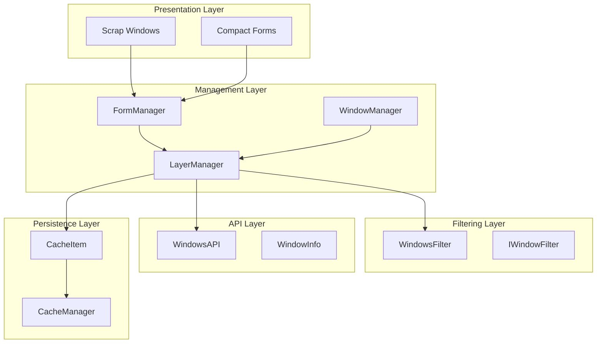
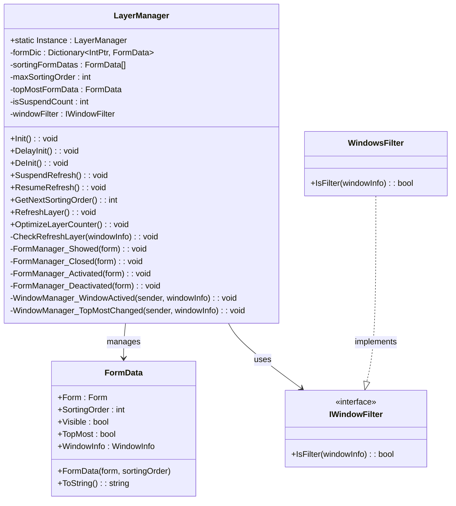
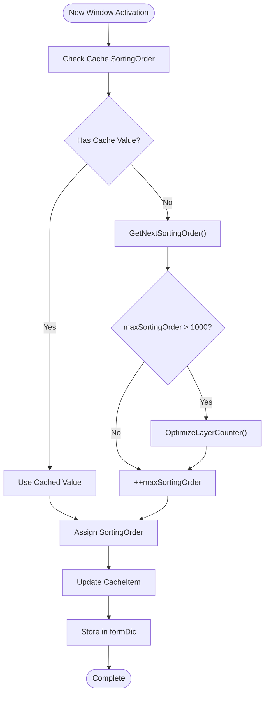
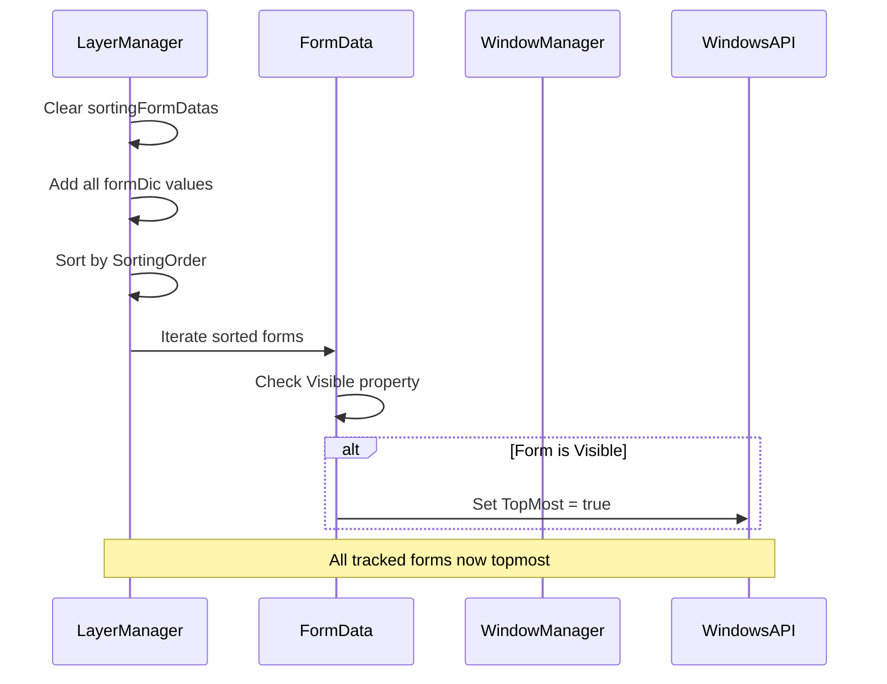
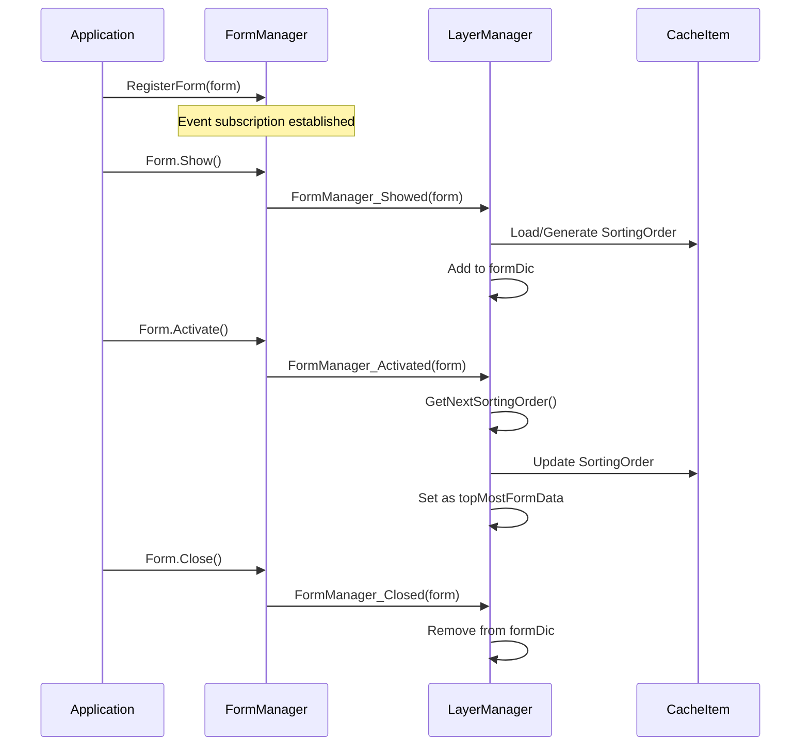
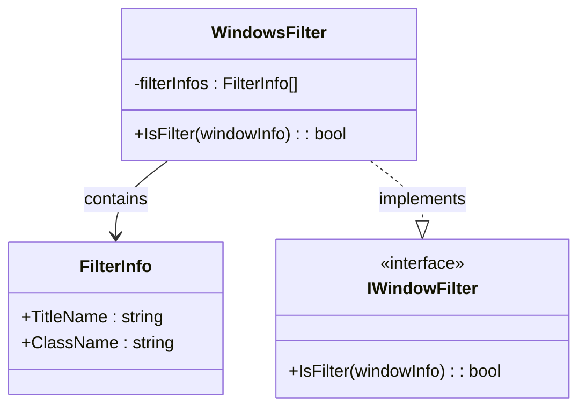
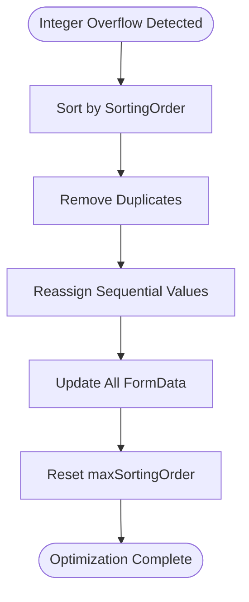

# Layer System

<cite>
**Referenced Files in This Document**
- [LayerManager.cs](file://SETUNA/Main/Layer/LayerManager.cs)
- [FormManager.cs](file://SETUNA/Main/Window/FormManager.cs)
- [WindowManager.cs](file://SETUNA/Main/Window/WindowManager.cs)
- [WindowsFilter.cs](file://SETUNA/Main/Layer/WindowsFilter.cs)
- [IWindowFilter.cs](file://SETUNA/Main/Layer/IWindowFilter.cs)
- [WindowsAPI.cs](file://SETUNA/Main/Common/WindowsAPI.cs)
- [CacheItem.cs](file://SETUNA/Main/Cache/CacheItem.cs)
- [CompactScrap.cs](file://SETUNA/Main/StyleItems/CompactScrap.cs)
- [LayerManagerTests.cs](file://SETUNATests/Main/Layer/LayerManagerTests.cs)
</cite>

## Table of Contents
1. [Introduction](#introduction)
2. [System Architecture](#system-architecture)
3. [Core Components](#core-components)
4. [Layer Management Mechanism](#layer-management-mechanism)
5. [Event-Driven Integration](#event-driven-integration)
6. [Window Filtering System](#window-filtering-system)
7. [Performance Optimization](#performance-optimization)
8. [Practical Usage Examples](#practical-usage-examples)
9. [Common Issues and Solutions](#common-issues-and-solutions)
10. [Best Practices](#best-practices)

## Introduction

The Layer System in SETUNA is a sophisticated z-order management solution designed to control the stacking behavior of scrap windows within the application. It ensures that user-created scrap windows maintain proper visibility and interaction priority while preventing conflicts with external applications and system windows.

The system operates as a singleton pattern with centralized control over window layering, utilizing a combination of dictionary-based tracking, sorting mechanisms, and event-driven updates to maintain optimal window positioning.

## System Architecture

The Layer System follows a layered architecture with clear separation of concerns:



**Diagram sources**
- [LayerManager.cs](file://SETUNA/Main/Layer/LayerManager.cs#L8-L320)
- [FormManager.cs](file://SETUNA/Main/Window/FormManager.cs#L7-L54)
- [WindowManager.cs](file://SETUNA/Main/Window/WindowManager.cs#L7-L106)

## Core Components

### LayerManager - Central Control Hub

The LayerManager serves as the singleton controller for all layer-related operations, maintaining comprehensive state management for window ordering and visibility.



**Diagram sources**
- [LayerManager.cs](file://SETUNA/Main/Layer/LayerManager.cs#L8-L319)
- [WindowsFilter.cs](file://SETUNA/Main/Layer/WindowsFilter.cs#L3-L75)

**Section sources**
- [LayerManager.cs](file://SETUNA/Main/Layer/LayerManager.cs#L8-L320)

### FormManager - Event Coordination

The FormManager acts as an intermediary between Windows Forms events and the LayerManager, providing centralized event registration and deregistration.

**Section sources**
- [FormManager.cs](file://SETUNA/Main/Window/FormManager.cs#L7-L54)

### WindowManager - System Integration

The WindowManager provides low-level Windows API integration for monitoring system-wide window changes and retrieving window information.

**Section sources**
- [WindowManager.cs](file://SETUNA/Main/Window/WindowManager.cs#L7-L106)

## Layer Management Mechanism

### Dictionary-Based Tracking

The LayerManager maintains two primary data structures for efficient window management:

| Data Structure | Purpose | Capacity | Type |
|----------------|---------|----------|------|
| formDic | Track all open scrap windows by handle | 50 initial | Dictionary\<IntPtr, FormData\> |
| sortingFormDatas | Maintain sorted list for layering | 50 initial | List\<FormData\> |

### Sorting Order Management

The system employs a monotonically increasing sorting order mechanism:



**Diagram sources**
- [LayerManager.cs](file://SETUNA/Main/Layer/LayerManager.cs#L70-L78)
- [LayerManager.cs](file://SETUNA/Main/Layer/LayerManager.cs#L99-L122)

**Section sources**
- [LayerManager.cs](file://SETUNA/Main/Layer/LayerManager.cs#L70-L78)
- [LayerManager.cs](file://SETUNA/Main/Layer/LayerManager.cs#L99-L122)

### RefreshLayer Method

The RefreshLayer method orchestrates the complete reordering process:



**Diagram sources**
- [LayerManager.cs](file://SETUNA/Main/Layer/LayerManager.cs#L80-L97)

**Section sources**
- [LayerManager.cs](file://SETUNA/Main/Layer/LayerManager.cs#L80-L97)

## Event-Driven Integration

### Form Lifecycle Events

The system responds to various form lifecycle events through the FormManager:



**Diagram sources**
- [FormManager.cs](file://SETUNA/Main/Window/FormManager.cs#L17-L51)
- [LayerManager.cs](file://SETUNA/Main/Layer/LayerManager.cs#L194-L278)

**Section sources**
- [FormManager.cs](file://SETUNA/Main/Window/FormManager.cs#L17-L51)
- [LayerManager.cs](file://SETUNA/Main/Layer/LayerManager.cs#L194-L278)

### System Window Events

External window changes trigger automatic layer refreshes:

```mermaid
flowchart TD
WMChange[System Window Change] --> CheckSuspend{isSuspendCount > 0?}
CheckSuspend --> |Yes| Skip[Skip Processing]
CheckSuspend --> |No| CheckHandle{formDic.ContainsKey(handle)?}
CheckHandle --> |Yes| Skip
CheckHandle --> |No| CheckFilter{windowFilter.IsFilter(windowInfo)?}
CheckFilter --> |Yes| Skip
CheckFilter --> |No| CheckZOrder{topMostInfo.ZOrder >= windowInfo.ZOrder?}
CheckZOrder --> |Yes| Skip
CheckZOrder --> |No| CheckIntersection{Has intersecting scrap windows?}
CheckIntersection --> |No| Skip
CheckIntersection --> |Yes| Refresh[RefreshLayer]
Refresh --> Complete[Processing Complete]
Skip --> Complete
```

**Diagram sources**
- [LayerManager.cs](file://SETUNA/Main/Layer/LayerManager.cs#L134-L192)

**Section sources**
- [LayerManager.cs](file://SETUNA/Main/Layer/LayerManager.cs#L134-L192)

## Window Filtering System

### IWindowFilter Interface

The filtering system prevents interference with specific external applications:



**Diagram sources**
- [IWindowFilter.cs](file://SETUNA/Main/Layer/IWindowFilter.cs#L3-L8)
- [WindowsFilter.cs](file://SETUNA/Main/Layer/WindowsFilter.cs#L3-L75)

### Predefined Filters

The system includes filters for popular screenshot and chat applications:

| Application | Title Pattern | Class Name | Purpose |
|-------------|---------------|------------|---------|
| QQ Chat | Empty | TXGuiFoundation | Prevent interference |
| QQ Menu | TXMenuWindow | TXGuiFoundation | Menu handling |
| WeChat | SnapshotWnd | N/A | Screen capture |
| WeChat Toolbar | CToolBarWnd | N/A | Toolbars |

**Section sources**
- [WindowsFilter.cs](file://SETUNA/Main/Layer/WindowsFilter.cs#L24-L35)

## Performance Optimization

### Integer Overflow Prevention

The OptimizeLayerCounter method prevents integer overflow by:

1. **Deduplication**: Removing duplicate sorting orders
2. **Reindexing**: Assigning sequential values from 0 to count-1
3. **Memory Efficiency**: Reducing unnecessary large integers



**Diagram sources**
- [LayerManager.cs](file://SETUNA/Main/Layer/LayerManager.cs#L99-L122)

**Section sources**
- [LayerManager.cs](file://SETUNA/Main/Layer/LayerManager.cs#L99-L122)

### Suspend/Resume Mechanism

The system provides suspension capabilities to batch operations:

| Method | Purpose | Usage Scenario |
|--------|---------|----------------|
| SuspendRefresh() | Increment suspend counter | Batch window operations |
| ResumeRefresh() | Decrement suspend counter | End batch operations |
| isSuspendCount | Monitor suspension state | Conditional processing |

**Section sources**
- [LayerManager.cs](file://SETUNA/Main/Layer/LayerManager.cs#L60-L68)

## Practical Usage Examples

### Scrap Window Activation

When a user clicks on a scrap window:

1. **Activation Event**: FormManager sends activation notification
2. **Order Assignment**: LayerManager generates new sorting order
3. **Cache Update**: Sorting order persisted in CacheItem
4. **Topmost Setting**: Window promoted to topmost status
5. **Layer Refresh**: All windows reordered appropriately

### External Window Interference

When an external application window appears:

1. **System Detection**: WindowManager detects window change
2. **Filter Check**: WindowsFilter determines if interference occurs
3. **Intersection Analysis**: System checks for overlapping scrap windows
4. **Layer Refresh**: Affected scrap windows repositioned
5. **Focus Management**: Maintains proper window hierarchy

### Compact Form Integration

Compact forms demonstrate dual-window management:

1. **Primary Window**: Hidden ScrapBase form
2. **Compact Form**: Visible thumbnail representation
3. **Coordinate Sync**: Position changes synchronized between forms
4. **Event Propagation**: Location changes trigger scrap updates

**Section sources**
- [LayerManager.cs](file://SETUNA/Main/Layer/LayerManager.cs#L244-L271)
- [CompactScrap.cs](file://SETUNA/Main/StyleItems/CompactScrap.cs#L158-L171)

## Common Issues and Solutions

### Window Focus Conflicts

**Problem**: External applications stealing focus from scrap windows
**Solution**: Window filtering prevents interference from screenshot/chat applications

**Problem**: Multiple scrap windows competing for focus
**Solution**: Sorting order mechanism ensures consistent stacking

### Performance Degradation

**Problem**: Large number of scrap windows causing slow layer updates
**Solution**: Suspend/Resume mechanism for batch operations

**Problem**: Integer overflow in sorting order
**Solution**: Automatic optimization through OptimizeLayerCounter

### Memory Management

**Problem**: Memory leaks from disposed forms
**Solution**: FormData checks Form.IsDisposed before accessing properties

**Problem**: Excessive memory usage from large form dictionaries
**Solution**: Efficient cleanup in FormManager_Closed handler

### Cross-Platform Compatibility

**Problem**: Windows API differences affecting layer behavior
**Solution**: Abstraction through WindowsAPI class with platform-specific implementations

## Best Practices

### Initialization Sequence

1. **Early Initialization**: Call LayerManager.Instance.Init() during application startup
2. **Delayed Setup**: Use DelayInit() after main form initialization
3. **Proper Cleanup**: Call DeInit() during application shutdown

### Event Management

1. **Registration**: Use FormManager.RegisterForm() for all scrap windows
2. **Cleanup**: Always call FormManager.DeregisterForm() when forms close
3. **Thread Safety**: LayerManager operations are thread-safe

### Performance Optimization

1. **Batch Operations**: Use SuspendRefresh()/ResumeRefresh() for multiple changes
2. **Filtering**: Leverage window filters to reduce unnecessary processing
3. **Cache Utilization**: Rely on CacheItem for persistent sorting order storage

### Error Handling

1. **Null Checks**: Verify form existence before layer operations
2. **Exception Safety**: LayerManager methods handle potential exceptions gracefully
3. **Resource Cleanup**: Proper disposal of graphics resources in compact forms

The Layer System provides a robust foundation for managing complex window hierarchies while maintaining performance and usability. Its event-driven architecture ensures responsive behavior, while the filtering system prevents conflicts with external applications. The optimization mechanisms handle edge cases gracefully, making it suitable for applications with extensive scrap window management requirements.