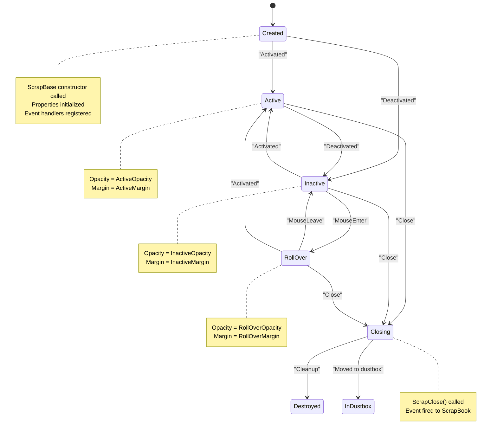

# Scrap Lifecycle Management

<cite>
**Referenced Files in This Document**   
- [ScrapBook.cs](file://SETUNA/Main/ScrapBook.cs)
- [ScrapBase.cs](file://SETUNA/Main/ScrapBase.cs)
- [ScrapEventArgs.cs](file://SETUNA/Main/ScrapEventArgs.cs)
- [CacheItem.cs](file://SETUNA/Main/Cache/CacheItem.cs)
- [CacheManager.cs](file://SETUNA/Main/Cache/CacheManager.cs)
- [ScrapSourceImage.cs](file://SETUNA/Main/ScrapSourceImage.cs)
- [ScrapSourcePath.cs](file://SETUNA/Main/ScrapSourcePath.cs)
- [ScrapSourceUrl.cs](file://SETUNA/Main/ScrapSourceUrl.cs)
- [Mainform.cs](file://SETUNA/Mainform.cs)
</cite>

## Table of Contents
1. [Introduction](#introduction)
2. [Scrap Creation and Persistence](#scrap-creation-and-persistence)
3. [ScrapBook: Central Registry Management](#scrapbook-central-registry-management)
4. [ScrapBase: Individual Scrap Window Management](#scrapbase-individual-scrap-window-management)
5. [Event Registration and Lifecycle Coordination](#event-registration-and-lifecycle-coordination)
6. [Dustbox (Recycle Bin) Management](#dustbox-recycle-bin-management)
7. [Practical Examples of Scrap Creation](#practical-examples-of-scrap-creation)
8. [Memory Management and Cleanup](#memory-management-and-cleanup)
9. [Common Issues and Edge Cases](#common-issues-and-edge-cases)
10. [Conclusion](#conclusion)

## Introduction
The scrap lifecycle management system in SETUNA provides a comprehensive framework for handling captured images throughout their entire lifecycle, from creation and persistence to eventual destruction. This document details the architecture and implementation of this system, focusing on the interaction between the ScrapBook registry and individual ScrapBase windows. The system enables users to capture, manipulate, and manage image scraps while providing robust persistence through caching and a sophisticated dustbox (recycle bin) mechanism for temporary storage of deleted items.

**Section sources**
- [ScrapBook.cs](file://SETUNA/Main/ScrapBook.cs#L1-L373)
- [ScrapBase.cs](file://SETUNA/Main/ScrapBase.cs#L1-L800)

## Scrap Creation and Persistence
The scrap creation process begins with image capture and continues through persistence mechanisms that ensure scraps survive application restarts. When a user captures an image, the system creates a new scrap instance and stores it in both memory and persistent storage. The persistence mechanism is handled by the CacheManager, which automatically creates cache entries for each scrap, storing both the image data and metadata such as position, applied styles, and creation time.

The system supports multiple methods of scrap creation:
- Direct capture from screen selection
- Restoration from cached items
- Import from file paths
- Download from URLs

Each scrap is assigned a unique identifier based on its creation timestamp, ensuring consistent naming and ordering. The cache system organizes scraps into timestamp-named directories containing both the image file (Image.png) and metadata (Info.json) in JSON format, enabling reliable restoration across sessions.

**Diagram sources**
- [ScrapBook.cs](file://SETUNA/Main/ScrapBook.cs#L114-L131)
- [CacheManager.cs](file://SETUNA/Main/Cache/CacheManager.cs#L74-L92)
- [CacheItem.cs](file://SETUNA/Main/Cache/CacheItem.cs#L43-L56)

**Section sources**
- [ScrapBook.cs](file://SETUNA/Main/ScrapBook.cs#L114-L166)
- [CacheItem.cs](file://SETUNA/Main/Cache/CacheItem.cs#L43-L56)
- [CacheManager.cs](file://SETUNA/Main/Cache/CacheManager.cs#L74-L92)

## ScrapBook: Central Registry Management
The ScrapBook class serves as the central registry for all active scraps in the application, maintaining references to both currently displayed scraps and those in the dustbox (recycle bin). It provides the primary interface for scrap management operations, including addition, removal, and enumeration of scraps.

The ScrapBook maintains two primary collections:
- `_scraps`: An ArrayList containing all active scraps currently displayed to the user
- `_dustbox`: A Queue containing scraps that have been closed but are retained in the recycle bin

Key methods for scrap management include:
- `AddScrap`: Creates a new scrap from an image and coordinates its initialization
- `AddScrapFromCache`: Restores a scrap from cached data, including position and style information
- `ScrapClose`: Handles the removal of a scrap from active display, either moving it to the dustbox or destroying it completely
- `EraseDustBox`: Permanently removes all scraps from the dustbox and triggers their cleanup

The ScrapBook also manages event propagation, notifying listeners when scraps are added or removed through the `ScrapAdded` and `ScrapRemoved` events. This event system enables other components, such as the CacheManager, to respond appropriately to changes in the scrap collection.

**Diagram sources**
- [ScrapBook.cs](file://SETUNA/Main/ScrapBook.cs#L10-L373)
- [ScrapBase.cs](file://SETUNA/Main/ScrapBase.cs#L16-L800)

**Section sources**
- [ScrapBook.cs](file://SETUNA/Main/ScrapBook.cs#L10-L373)

## ScrapBase: Individual Scrap Window Management
The ScrapBase class represents individual scrap windows and manages their lifecycle, appearance, and interaction with the user. Each scrap window is a specialized form that displays a captured image and provides various manipulation capabilities.

The ScrapBase constructor initializes the scrap window with default properties and sets up the basic UI components. Key initialization steps include:
- Setting up the key preview to handle keyboard events
- Initializing opacity and margin values
- Setting the creation timestamp and default name
- Configuring interpolation mode for image rendering

The ScrapBase class manages several visual states based on user interaction:
- Active state: When the scrap window has focus, it displays with the ActiveOpacity and ActiveMargin values
- Inactive state: When the window is not focused and the mouse is not hovering, it displays with the InactiveOpacity and InactiveMargin values
- Roll-over state: When the mouse hovers over an inactive window, it displays with the RollOverOpacity and RollOverMargin values

The class also handles user interactions such as dragging the window (which temporarily reduces opacity) and closing the window through the ScrapClose method. The ScrapClose method coordinates with the ScrapBook registry to properly remove the scrap from the active collection and either move it to the dustbox or destroy it completely.

**Diagram sources**
- [ScrapBase.cs](file://SETUNA/Main/ScrapBase.cs#L156-L173)
- [ScrapBase.cs](file://SETUNA/Main/ScrapBase.cs#L555-L562)
- [ScrapBase.cs](file://SETUNA/Main/ScrapBase.cs#L69-L92)

**Section sources**
- [ScrapBase.cs](file://SETUNA/Main/ScrapBase.cs#L156-L173)
- [ScrapBase.cs](file://SETUNA/Main/ScrapBase.cs#L555-L562)

## Event Registration and Lifecycle Coordination
The scrap lifecycle is coordinated through a sophisticated event system that enables components to respond to changes in scrap state. The ScrapBase class defines multiple events that are triggered at key points in the scrap lifecycle:

- `ScrapCreateEvent`: Fired when a scrap is created and added to the ScrapBook
- `ScrapCloseEvent`: Fired when a scrap is about to be closed
- `ScrapActiveEvent` and `ScrapInactiveEvent`: Fired when a scrap gains or loses focus
- `ScrapInactiveEnterEvent` and `ScrapInactiveOutEvent`: Fired when the mouse enters or leaves an inactive scrap
- Various change events: `ScrapLocationChangedEvent`, `ScrapImageChangedEvent`, `ScrapStyleAppliedEvent`, and `ScrapStyleRemovedEvent`

The ScrapBook automatically registers itself as a listener for the `ScrapCloseEvent` when a scrap is added to its collection. This registration is established in the `Manager` property setter of ScrapBase, which adds the ScrapBook's `ScrapClose` method as an event handler. When a scrap is closed, this event triggers the removal process in the ScrapBook, which either moves the scrap to the dustbox or destroys it completely.

The CacheManager also registers as a listener for various scrap events, allowing it to maintain synchronization between the in-memory scrap state and the persistent cache. For example, when a scrap's location changes, the `ScrapLocationChanged` event triggers an update to the cached position data.

**Diagram sources**
- [ScrapBase.cs](file://SETUNA/Main/ScrapBase.cs#L21-L60)
- [ScrapBook.cs](file://SETUNA/Main/ScrapBook.cs#L204-L226)
- [CacheManager.cs](file://SETUNA/Main/Cache/CacheManager.cs#L94-L105)

**Section sources**
- [ScrapBase.cs](file://SETUNA/Main/ScrapBase.cs#L21-L60)
- [ScrapBook.cs](file://SETUNA/Main/ScrapBook.cs#L204-L226)
- [CacheManager.cs](file://SETUNA/Main/Cache/CacheManager.cs#L94-L105)

## Dustbox (Recycle Bin) Management
The dustbox serves as a recycle bin for closed scraps, providing a safety mechanism that allows users to recover recently deleted items. The dustbox is implemented as a Queue within the ScrapBook, with configurable capacity managed by the `DustBoxCapacity` property.

When a scrap is closed, the ScrapBook checks the dustbox capacity:
- If the dustbox is not at capacity, the scrap is enqueued and hidden from view
- If the dustbox is at capacity, the oldest scrap is dequeued and permanently destroyed before the new scrap is enqueued

The `DustBoxCapacity` setter includes automatic cleanup logic that ensures the dustbox never exceeds its specified capacity. When the capacity is reduced, excess scraps are automatically closed and removed from the queue. This design prevents memory leaks while providing a predictable user experience.

The dustbox supports several operations:
- `EraseDustBox`: Permanently removes all scraps from the dustbox and triggers their cleanup
- `DustCount`: Returns the current number of scraps in the dustbox
- Automatic persistence: Scraps in the dustbox are still maintained in the cache system

This implementation provides a balance between memory usage and user convenience, allowing temporary retention of deleted scraps while preventing unbounded memory growth.

**Diagram sources**
- [ScrapBook.cs](file://SETUNA/Main/ScrapBook.cs#L28-L40)
- [ScrapBook.cs](file://SETUNA/Main/ScrapBook.cs#L204-L226)
- [ScrapBook.cs](file://SETUNA/Main/ScrapBook.cs#L90-L101)

**Section sources**
- [ScrapBook.cs](file://SETUNA/Main/ScrapBook.cs#L28-L40)
- [ScrapBook.cs](file://SETUNA/Main/ScrapBook.cs#L204-L226)

## Practical Examples of Scrap Creation
The system provides multiple pathways for scrap creation, each serving different use cases and user workflows.

### Creation from Capture
When a user captures a screen region, the Mainform coordinates the process:
1. The capture operation begins with `StartCapture`
2. Upon completion, `EndCapture` is called with the captured image
3. The image is passed to `ScrapBook.AddScrap` with position information
4. A new ScrapBase instance is created and initialized
5. The scrap is added to the active collection and displayed

### Creation from Cache Restoration
When restoring scraps from cache (typically at application startup), the process is more complex as it must reconstruct the scrap's state:
1. CacheManager reads cached items from disk
2. Items are sorted by creation time
3. `AddScrapFromCache` is called for each item
4. The scrap is created with original position and style
5. The appropriate style is applied asynchronously
6. The scrap is added to the active collection

This process ensures that users see their previous session's scraps exactly as they left them, maintaining position, applied styles, and other state information.

**Section sources**
- [Mainform.cs](file://SETUNA/Mainform.cs#L116-L190)
- [ScrapBook.cs](file://SETUNA/Main/ScrapBook.cs#L134-L166)
- [CacheManager.cs](file://SETUNA/Main/Cache/CacheManager.cs#L31-L70)

## Memory Management and Cleanup
The system employs several strategies to manage memory usage and prevent leaks throughout the scrap lifecycle.

### Scrap Destruction
When a scrap is permanently destroyed (not moved to the dustbox), the cleanup process involves:
1. The `ScrapClose` method sets `closePrepare = true` and calls `base.Close()`
2. The `OnFormClosing` override cancels the close if `closePrepare` is false
3. The `OnClosed` method disposes of image resources and nulls references
4. The finalizer (`~ScrapBase`) calls `ImageAllDispose` as a safety measure

The `ImageAllDispose` method ensures that the image resource is properly disposed, preventing GDI object leaks. This is critical as each scrap holds a reference to an Image object, which wraps unmanaged resources.

### Dustbox Management
The dustbox provides a controlled environment for temporary scrap retention:
- Scraps in the dustbox are hidden but remain in memory
- The Queue structure ensures FIFO (first-in, first-out) behavior
- Capacity limits prevent unbounded memory growth
- Manual or automatic cleanup removes excess scraps

### Garbage Collection
The system explicitly calls `GC.Collect()` in several places:
- After closing all scraps in the ScrapBook finalizer
- After individual scrap closure in the `ScrapClose` method
- After erasing the entire dustbox

While explicit garbage collection is generally discouraged, it is used here to ensure prompt cleanup of image resources, which can be substantial in size.

**Section sources**
- [ScrapBase.cs](file://SETUNA/Main/ScrapBase.cs#L176-L180)
- [ScrapBase.cs](file://SETUNA/Main/ScrapBase.cs#L555-L562)
- [ScrapBase.cs](file://SETUNA/Main/ScrapBase.cs#L536-L535)
- [ScrapBook.cs](file://SETUNA/Main/ScrapBook.cs#L71-L87)
- [ScrapBook.cs](file://SETUNA/Main/ScrapBook.cs#L90-L101)

## Common Issues and Edge Cases
Several potential issues and edge cases require careful handling in the scrap lifecycle management system.

### Memory Leaks During Disposal
The primary risk for memory leaks occurs when image resources are not properly disposed. The system mitigates this through:
- Explicit disposal in `OnClosed` and finalizer
- Cloning images during construction to ensure ownership
- Nulling references after disposal
- Using `using` statements when appropriate

Despite these measures, improper event deregistration could still lead to leaks, as event handlers maintain references to their targets.

### Event Deregistration Edge Cases
The system does not appear to have explicit event deregistration logic, which could lead to:
- Memory leaks if event handlers are not properly cleaned up
- Unexpected behavior if stale handlers receive events
- Cross-talk between components after scrap destruction

The current implementation relies on the fact that when a scrap is destroyed, all references to it are removed, allowing the garbage collector to reclaim it even if event handlers still reference it.

### Cache Synchronization Issues
Potential race conditions exist between:
- Scrap state changes and cache updates
- Multiple simultaneous scrap operations
- Application shutdown during cache operations

The system addresses some of these through the event-driven architecture, but edge cases like power loss during cache writes could result in data corruption.

### Dustbox Capacity Transitions
When the dustbox capacity is changed, the system must handle the transition carefully:
- Reducing capacity triggers immediate cleanup of excess scraps
- Increasing capacity has no immediate effect but allows more future retention
- Zero capacity means no temporary retention (immediate destruction)

The current implementation handles these cases correctly but could benefit from user confirmation when reducing capacity would result in data loss.

**Section sources**
- [ScrapBase.cs](file://SETUNA/Main/ScrapBase.cs#L176-L180)
- [ScrapBase.cs](file://SETUNA/Main/ScrapBase.cs#L555-L562)
- [CacheManager.cs](file://SETUNA/Main/Cache/CacheManager.cs#L94-L105)
- [ScrapBook.cs](file://SETUNA/Main/ScrapBook.cs#L28-L40)

## Conclusion
The scrap lifecycle management system in SETUNA provides a robust framework for handling captured images from creation through to destruction. The central ScrapBook registry coordinates the lifecycle of individual ScrapBase windows, managing their addition, persistence, and removal. The system employs a sophisticated event-driven architecture to coordinate state changes across components, ensuring consistency between the in-memory representation and persistent storage.

Key strengths of the system include:
- Comprehensive persistence through the CacheManager
- Safety-oriented dustbox mechanism for temporary retention
- Flexible creation pathways for different use cases
- Event-driven coordination between components

Areas for potential improvement include:
- Explicit event deregistration to prevent memory leaks
- Enhanced error handling for cache operations
- User confirmation for destructive operations
- More granular control over garbage collection

Overall, the system provides a solid foundation for scrap management that balances functionality, performance, and user experience.