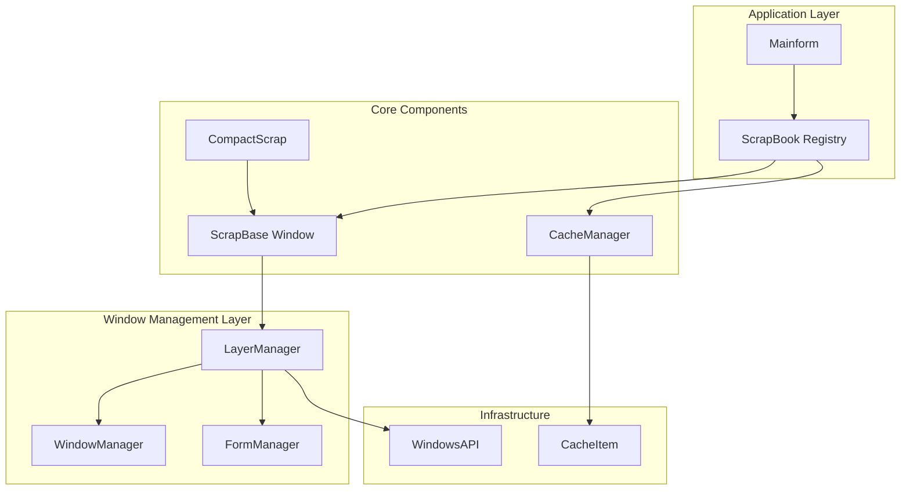
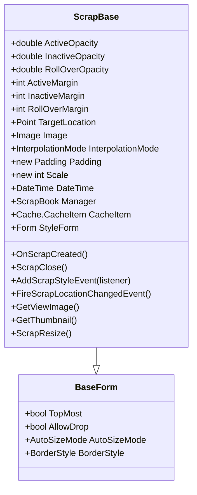
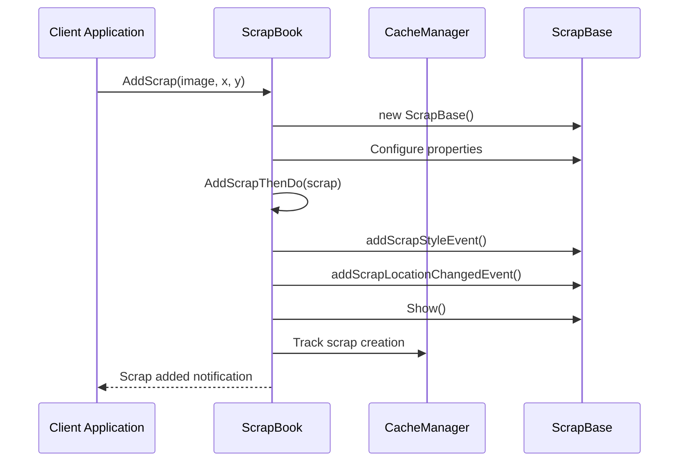
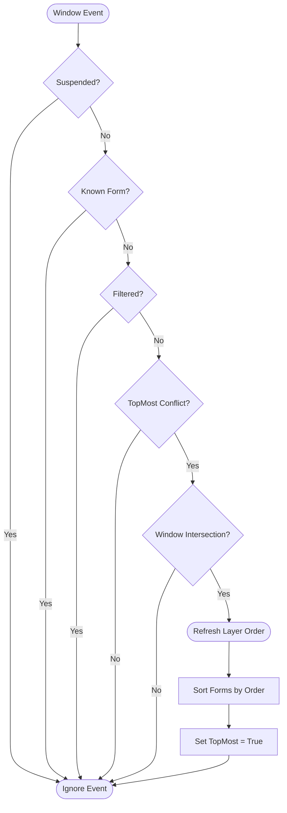
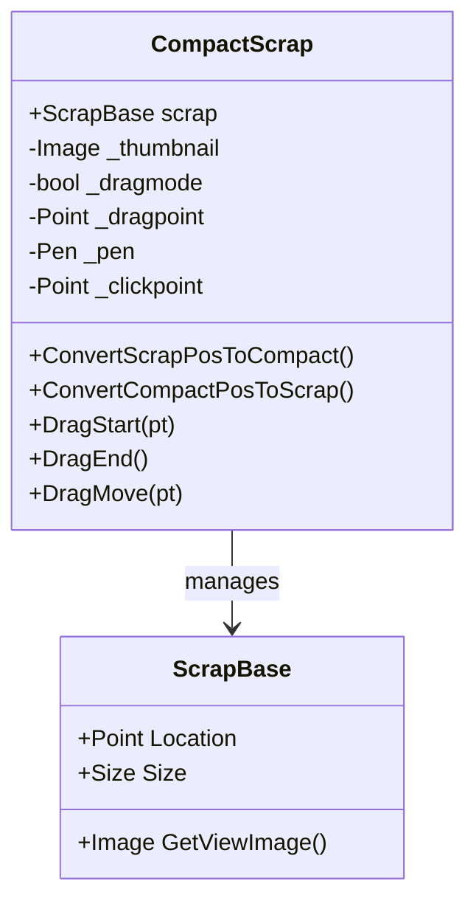
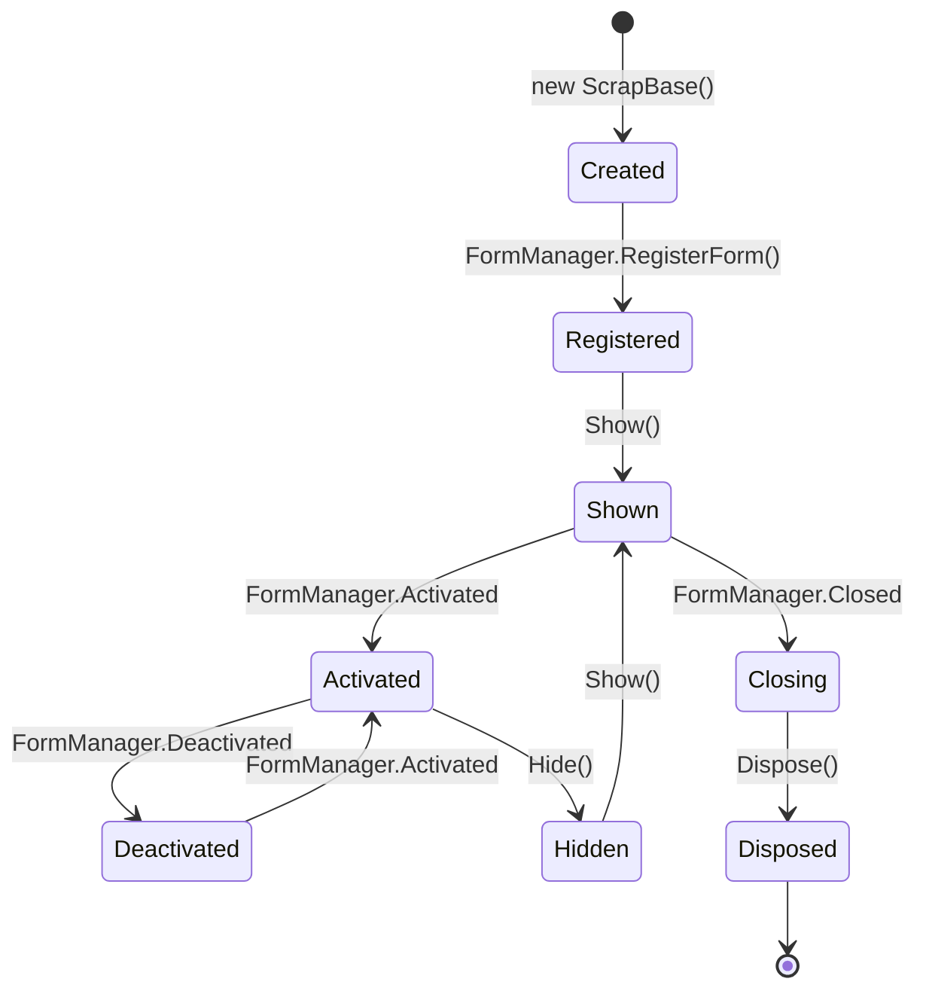

# Scrap Management

<cite>
**Referenced Files in This Document**
- [ScrapBase.cs](file://SETUNA/Main/ScrapBase.cs)
- [LayerManager.cs](file://SETUNA/Main/Layer/LayerManager.cs)
- [WindowManager.cs](file://SETUNA/Main/Window/WindowManager.cs)
- [WindowsAPI.cs](file://SETUNA/Main/Common/WindowsAPI.cs)
- [ScrapBook.cs](file://SETUNA/Main/ScrapBook.cs)
- [FormManager.cs](file://SETUNA/Main/Window/FormManager.cs)
- [CacheManager.cs](file://SETUNA/Main/Cache/CacheManager.cs)
- [CacheItem.cs](file://SETUNA/Main/Cache/CacheItem.cs)
- [CompactScrap.cs](file://SETUNA/Main/StyleItems/CompactScrap.cs)
- [CCompactStyleItem.cs](file://SETUNA/Main/StyleItems/CCompactStyleItem.cs)
</cite>

## Table of Contents
1. [Introduction](#introduction)
2. [System Architecture Overview](#system-architecture-overview)
3. [ScrapBase - The Foundation Class](#scrapbase---the-foundation-class)
4. [ScrapBook - Registry Management](#scrapbook---registry-management)
5. [LayerManager - Window Hierarchy Control](#layermanager---window-hierarchy-control)
6. [Cache System - Persistent Storage](#cache-system---persistent-storage)
7. [Compact Mode Implementation](#compact-mode-implementation)
8. [Window Lifecycle Management](#window-lifecycle-management)
9. [Performance Considerations](#performance-considerations)
10. [Common Issues and Solutions](#common-issues-and-solutions)
11. [Best Practices](#best-practices)

## Introduction

Scrap Management in SETUNA is a sophisticated system designed to handle the lifecycle and window management of captured images. The system maintains a registry of all active scraps, coordinates their behavior through a hierarchical layer management system, and provides persistent storage capabilities across application restarts. This comprehensive solution manages everything from basic window positioning and opacity controls to complex layer reordering and compact mode functionality.

The scrap management system operates on several key principles: maintaining a centralized registry of all active scraps, providing seamless persistence across sessions, enabling efficient window hierarchy management, and offering flexible customization options through various style applications.

## System Architecture Overview

The scrap management system follows a layered architecture with clear separation of concerns:



**Diagram sources**
- [ScrapBook.cs](file://SETUNA/Main/ScrapBook.cs#L1-L50)
- [LayerManager.cs](file://SETUNA/Main/Layer/LayerManager.cs#L1-L40)
- [WindowManager.cs](file://SETUNA/Main/Window/WindowManager.cs#L1-L30)

The architecture consists of four primary layers:

1. **Application Layer**: Contains the main application logic and scrap registry
2. **Window Management Layer**: Handles window hierarchy and lifecycle events
3. **Core Components**: Individual scrap windows and specialized scrap types
4. **Infrastructure**: Low-level Windows API calls and caching mechanisms

**Section sources**
- [ScrapBook.cs](file://SETUNA/Main/ScrapBook.cs#L1-L100)
- [LayerManager.cs](file://SETUNA/Main/Layer/LayerManager.cs#L1-L50)

## ScrapBase - The Foundation Class

ScrapBase serves as the foundational class for all scrap windows, inheriting from BaseForm and providing comprehensive window management capabilities. It maintains essential properties for window behavior including location, size, opacity, and z-order positioning.

### Core Properties and Behavior

ScrapBase manages several critical properties that control window appearance and behavior:



**Diagram sources**
- [ScrapBase.cs](file://SETUNA/Main/ScrapBase.cs#L60-L200)

### Opacity and Transparency Management

The system provides sophisticated opacity control with different states:

- **ActiveOpacity**: Controls transparency when the window is active
- **InactiveOpacity**: Manages transparency when inactive and mouse not over
- **RollOverOpacity**: Provides hover effects when mouse enters the window

Each opacity property automatically updates the window's transparency based on its current state, with smooth transitions handled through the timOpacity timer mechanism.

### Location and Positioning

ScrapBase implements intelligent positioning with target location support:

- **TargetLocation**: Allows smooth animated movement to desired positions
- **Automatic Resize**: Adjusts window size based on image dimensions and padding
- **Bounds Management**: Maintains proper window boundaries during resize operations

**Section sources**
- [ScrapBase.cs](file://SETUNA/Main/ScrapBase.cs#L60-L300)

## ScrapBook - Registry Management

ScrapBook acts as the central registry for all active scraps, maintaining an ArrayList of ScrapBase instances and coordinating their behavior across the application lifecycle.

### Registry Operations



**Diagram sources**
- [ScrapBook.cs](file://SETUNA/Main/ScrapBook.cs#L168-L192)

### Scrap Lifecycle Management

ScrapBook handles the complete lifecycle of scraps:

1. **Creation**: Adds new scraps to the registry and initializes event listeners
2. **Management**: Provides methods for showing, hiding, and closing scraps
3. **Cleanup**: Properly disposes of resources when scraps are removed
4. **Persistence**: Coordinates with CacheManager for persistent storage

### Event Coordination

The registry maintains event handlers for various scrap operations:

- **ScrapAdded**: Notifies when new scraps are added
- **ScrapRemoved**: Handles removal and cleanup
- **KeyPress**: Manages keyboard shortcuts across all scraps

**Section sources**
- [ScrapBook.cs](file://SETUNA/Main/ScrapBook.cs#L60-L200)

## LayerManager - Window Hierarchy Control

LayerManager provides sophisticated window hierarchy management using WindowsAPI calls to control z-order and topmost behavior. It maintains a registry of all managed windows and ensures proper layering across the desktop.

### Layer Management Architecture



**Diagram sources**
- [LayerManager.cs](file://SETUNA/Main/Layer/LayerManager.cs#L134-L192)

### Window Filtering and Management

LayerManager implements intelligent window filtering to distinguish between application windows and system windows:

- **Window Filter**: Uses IWindowFilter interface to identify application windows
- **Z-Order Tracking**: Monitors window activation and topmost changes
- **Intersection Detection**: Ensures proper layering based on window overlap

### Sorting and Ordering

The system maintains a sophisticated sorting mechanism:

1. **Sorting Order**: Assigns unique integer values for ordering
2. **Optimization**: Periodically optimizes sorting values to prevent overflow
3. **Refresh Cycle**: Automatically refreshes layer order when needed

**Section sources**
- [LayerManager.cs](file://SETUNA/Main/Layer/LayerManager.cs#L80-L150)

## Cache System - Persistent Storage

The caching system provides persistent storage for scrap properties across application restarts, ensuring that user preferences and window positions are maintained.

### Cache Architecture

```mermaid
erDiagram
CacheManager ||--o{ CacheItem : manages
CacheItem ||--|| Image : stores
CacheItem ||--|| Style : contains
CacheItem {
datetime CreateTime PK
point Position
style Style
int SortingOrder
}
Style {
int ID
point ClickPoint
}
CacheManager {
string Path
bool IsInit
}
CacheItem {
string FolderPath
bool IsValid
}
```

**Diagram sources**
- [CacheManager.cs](file://SETUNA/Main/Cache/CacheManager.cs#L1-L50)
- [CacheItem.cs](file://SETUNA/Main/Cache/CacheItem.cs#L1-L50)

### Cache Operations

The cache system handles three primary operations:

1. **Creation**: Creates cache entries when new scraps are added
2. **Restoration**: Loads cached scraps during application startup
3. **Updates**: Updates cache when scraps are modified

### Persistence Mechanism

Each cache item creates a dedicated folder containing:

- **Image.png**: The cached image data
- **Info.json**: Metadata including position, style, and sorting information

**Section sources**
- [CacheManager.cs](file://SETUNA/Main/Cache/CacheManager.cs#L30-L80)
- [CacheItem.cs](file://SETUNA/Main/Cache/CacheItem.cs#L40-L120)

## Compact Mode Implementation

Compact mode provides a space-efficient representation of scraps that can be easily moved and resized while maintaining the original content.

### CompactScrap Architecture



**Diagram sources**
- [CompactScrap.cs](file://SETUNA/Main/StyleItems/CompactScrap.cs#L1-L50)

### Compact Mode Features

Compact mode offers several advantages:

- **Space Efficiency**: Reduces screen real estate while maintaining content
- **Drag-and-Drop**: Enables easy repositioning of scraps
- **Visual Feedback**: Provides clear visual indicators of the compact state
- **Smooth Transition**: Seamlessly converts between normal and compact modes

### Position Synchronization

The system maintains synchronization between normal and compact modes:

- **Position Conversion**: Calculates equivalent positions between modes
- **Event Propagation**: Notifies scrap of location changes during drag operations
- **State Management**: Tracks which mode the scrap is currently in

**Section sources**
- [CompactScrap.cs](file://SETUNA/Main/StyleItems/CompactScrap.cs#L150-L193)

## Window Lifecycle Management

The window lifecycle management system handles the complete lifecycle of scrap windows from creation to destruction, with proper event coordination and resource management.

### Lifecycle Events



**Diagram sources**
- [FormManager.cs](file://SETUNA/Main/Window/FormManager.cs#L17-L30)

### Event Coordination

The system coordinates multiple event streams:

1. **Form Events**: Show, Close, Activate, Deactivate
2. **Window Events**: Foreground window changes, topmost modifications
3. **Layer Events**: Layer manager notifications and refresh cycles

### Resource Management

Proper resource management ensures optimal performance:

- **Memory Cleanup**: Automatic disposal of image resources
- **Event Unregistration**: Proper cleanup of event handlers
- **Cache Synchronization**: Updates cache when windows are modified

**Section sources**
- [FormManager.cs](file://SETUNA/Main/Window/FormManager.cs#L1-L54)
- [LayerManager.cs](file://SETUNA/Main/Layer/LayerManager.cs#L230-L280)

## Performance Considerations

Managing numerous scraps efficiently requires careful attention to performance bottlenecks and optimization strategies.

### Memory Management

The system implements several memory optimization techniques:

- **Lazy Loading**: Images are loaded only when needed
- **Resource Disposal**: Automatic cleanup of GDI+ resources
- **Cache Limits**: Configurable limits on cache size and retention

### Rendering Optimization

Rendering performance is optimized through:

- **Double Buffering**: Prevents flicker during redraw operations
- **Incremental Updates**: Only redraws changed areas
- **Interpolation Modes**: Configurable quality vs. performance trade-offs

### Layer Management Performance

Layer management operations are optimized for:

- **Minimal API Calls**: Reduces Windows API overhead
- **Batch Updates**: Groups multiple layer changes together
- **Intelligent Refresh**: Only refreshes when necessary

## Common Issues and Solutions

### Window Focus Conflicts

**Issue**: Scrolling through scraps causes focus conflicts with other applications.

**Solution**: The LayerManager implements intelligent filtering to distinguish between application windows and system windows, preventing unnecessary layer refreshes.

### Performance Degradation with Many Scraps

**Issue**: Large numbers of scraps cause performance degradation.

**Solution**: 
- Implement cache suspension during bulk operations
- Use lazy loading for image data
- Optimize layer counter to prevent integer overflow

### Position Persistence Failures

**Issue**: Scrap positions are not restored correctly after restart.

**Solution**: The cache system implements robust error handling and fallback mechanisms to ensure position data is preserved even in failure scenarios.

### Memory Leaks with Long Sessions

**Issue**: Memory usage grows over time with extended application use.

**Solution**: Comprehensive resource cleanup through proper disposal patterns and periodic garbage collection triggers.

## Best Practices

### Scrap Creation and Management

1. **Always use AddScrapFromCache()**: For persistent scraps that need to survive application restarts
2. **Implement proper event handling**: Subscribe to relevant scrap events for custom behavior
3. **Manage resource disposal**: Ensure proper cleanup of image resources

### Layer Management

1. **Use layer suspension during bulk operations**: Prevents unnecessary refresh cycles
2. **Implement intelligent filtering**: Only manage application windows in the layer system
3. **Monitor performance impact**: Regular testing with large numbers of scraps

### Cache Management

1. **Configure appropriate cache limits**: Balance between performance and persistence
2. **Implement cache validation**: Verify cache integrity on startup
3. **Handle cache corruption gracefully**: Provide fallback mechanisms for corrupted cache data

### User Experience

1. **Provide visual feedback**: Clear indicators for scrap states and actions
2. **Maintain consistent behavior**: Ensure predictable interactions across all scrap types
3. **Support keyboard navigation**: Full keyboard accessibility for all operations

The scrap management system in SETUNA demonstrates sophisticated window management capabilities with robust persistence, efficient resource management, and flexible customization options. Its layered architecture ensures maintainability while providing powerful functionality for managing digital scrap collections.