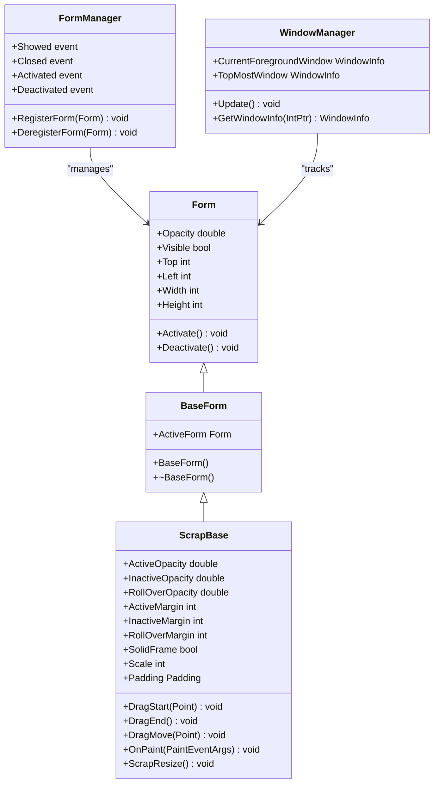
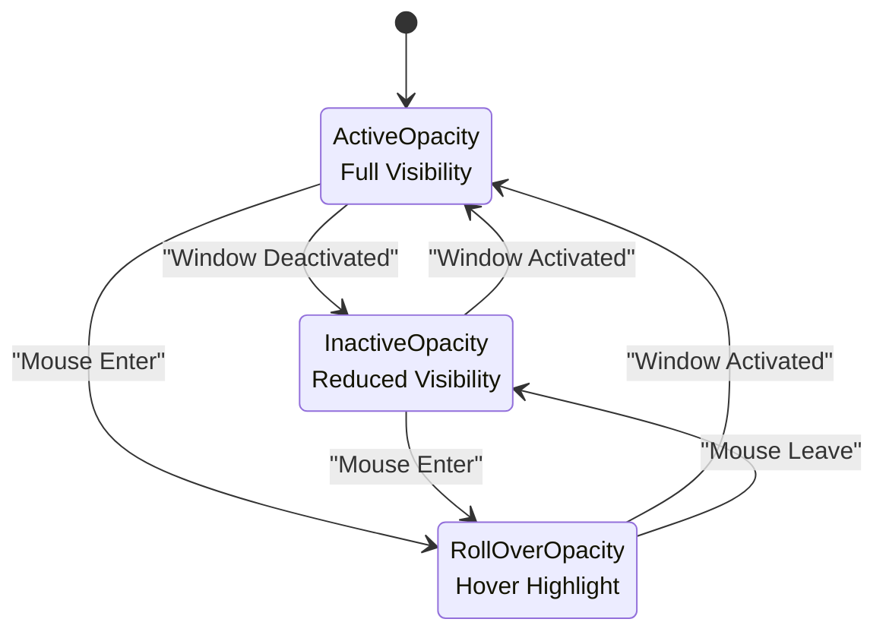
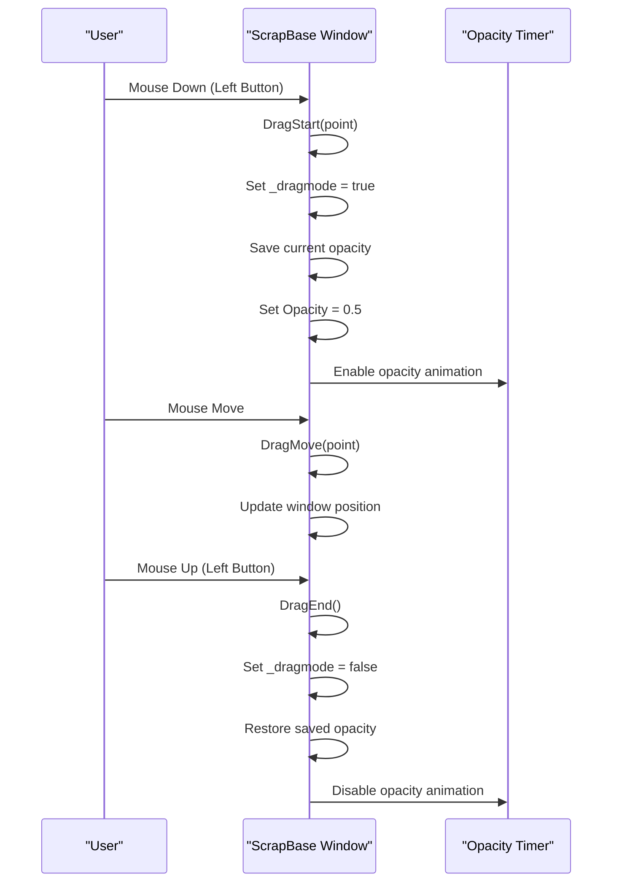
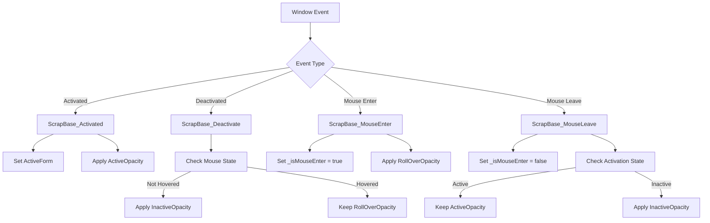
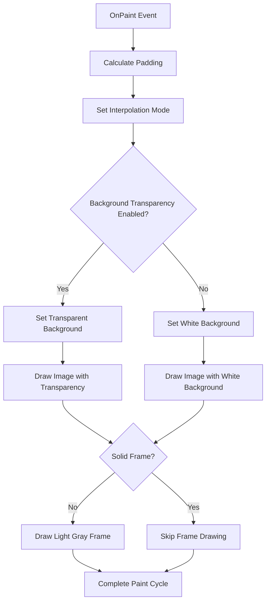
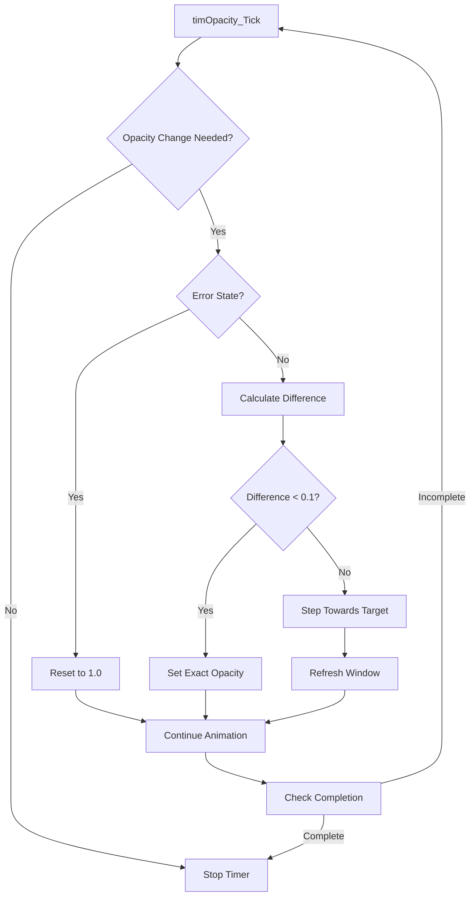

# Window Management

<cite>
**Referenced Files in This Document**
- [ScrapBase.cs](file://SETUNA/Main/ScrapBase.cs)
- [BaseForm.cs](file://SETUNA/Main/Common/BaseForm.cs)
- [FormManager.cs](file://SETUNA/Main/Window/FormManager.cs)
- [WindowManager.cs](file://SETUNA/Main/Window/WindowManager.cs)
- [Mainform.cs](file://SETUNA/Mainform.cs)
- [SetunaOption.cs](file://SETUNA/Main/Option/SetunaOption.cs)
- [COpacityStyleItem.cs](file://SETUNA/Main/StyleItems/COpacityStyleItem.cs)
- [OpacityStyleItemPanel.cs](file://SETUNA/Main/StyleItems/OpacityStyleItemPanel.cs)
- [CMoveStyleItem.cs](file://SETUNA/Main/StyleItems/CMoveStyleItem.cs)
- [CompactScrap.cs](file://SETUNA/Main/StyleItems/CompactScrap.cs)
</cite>

## Table of Contents
1. [Introduction](#introduction)
2. [Architecture Overview](#architecture-overview)
3. [Core Window Management Components](#core-window-management-components)
4. [Visual Appearance Properties](#visual-appearance-properties)
5. [Drag-and-Drop Functionality](#drag-and-drop-functionality)
6. [Window State Management](#window-state-management)
7. [Painting and Rendering System](#painting-and-rendering-system)
8. [Animation and Transition System](#animation-and-transition-system)
9. [Practical Implementation Examples](#practical-implementation-examples)
10. [Common Issues and Solutions](#common-issues-and-solutions)
11. [Best Practices](#best-practices)

## Introduction

The window management system in SETUNA revolves around the `ScrapBase` class, which serves as the foundation for all scrap windows in the application. This sophisticated system provides dynamic visual feedback, smooth animations, and intuitive user interaction through a comprehensive property-based architecture that controls opacity, positioning, margins, and frame appearance.

The system is built on a hierarchical inheritance model where `ScrapBase` derives from `BaseForm`, which in turn inherits from the standard Windows Forms `Form` class. This architecture enables centralized window management while maintaining flexibility for specialized scrap window behaviors.

## Architecture Overview

The window management system follows a layered architecture that separates concerns between window lifecycle management, visual presentation, and user interaction handling.



**Diagram sources**
- [BaseForm.cs](file://SETUNA/Main/Common/BaseForm.cs#L3-L18)
- [ScrapBase.cs](file://SETUNA/Main/ScrapBase.cs#L16-L17)
- [FormManager.cs](file://SETUNA/Main/Window/FormManager.cs#L8-L54)
- [WindowManager.cs](file://SETUNA/Main/Window/WindowManager.cs#L8-L106)

## Core Window Management Components

### ScrapBase Class Foundation

The `ScrapBase` class serves as the primary window management component, extending the standard Windows Forms functionality with specialized scrap window behaviors. It maintains several critical state variables that control window appearance and interaction:

- `_opacity`: Current opacity level of the window
- `_activeOpacity`, `_inactiveOpacity`, `_rolloverOpacity`: Different opacity states based on window focus
- `_activeMargin`, `_inactiveMargin`, `_rolloverMargin`: Padding values for different states
- `_dragmode`: Indicates whether the window is currently being dragged
- `_solidframe`: Controls whether the window has a solid border

### Form Lifecycle Management

The window management system integrates with Windows Forms lifecycle events through the `FormManager` class, which provides centralized event handling for form visibility, activation, and closure events.

**Section sources**
- [ScrapBase.cs](file://SETUNA/Main/ScrapBase.cs#L155-L173)
- [BaseForm.cs](file://SETUNA/Main/Common/BaseForm.cs#L3-L18)
- [FormManager.cs](file://SETUNA/Main/Window/FormManager.cs#L17-L31)

## Visual Appearance Properties

### Opacity Control System

The opacity system provides three distinct states that respond to different window conditions:



**Diagram sources**
- [ScrapBase.cs](file://SETUNA/Main/ScrapBase.cs#L65-L108)
- [Mainform.cs](file://SETUNA/Mainform.cs#L545-L590)

The opacity properties are implemented with automatic synchronization logic that ensures immediate visual updates when the window state changes:

- **ActiveOpacity**: Full opacity when the window is active and has focus
- **InactiveOpacity**: Reduced opacity when the window is inactive but visible
- **RollOverOpacity**: Intermediate opacity when the mouse hovers over an inactive window

### Margin and Padding System

The margin system works in conjunction with opacity to provide visual feedback about window state:

- **ActiveMargin**: Larger padding when the window is active
- **InactiveMargin**: Smaller padding when the window is inactive
- **RollOverMargin**: Intermediate padding when hovering

These margins are automatically applied to the `Padding` property, affecting the window's content area and providing visual cues about the window's interaction state.

**Section sources**
- [ScrapBase.cs](file://SETUNA/Main/ScrapBase.cs#L65-L153)
- [Mainform.cs](file://SETUNA/Mainform.cs#L545-L590)

## Drag-and-Drop Functionality

### Drag Operation Implementation

The drag-and-drop system provides seamless window movement with visual feedback through the `DragStart`, `DragEnd`, and `DragMove` methods:



**Diagram sources**
- [ScrapBase.cs](file://SETUNA/Main/ScrapBase.cs#L637-L688)

### Drag Event Handlers

The drag functionality is implemented through mouse event handlers that track the drag operation state:

- **Mouse Down Handler**: Initiates drag mode and saves the current opacity
- **Mouse Move Handler**: Updates window position based on mouse movement
- **Mouse Up Handler**: Terminates drag mode and restores original opacity

During drag operations, the window's opacity is temporarily reduced to 0.5, providing visual feedback that the window is being moved. This opacity change is animated smoothly through the timer system.

**Section sources**
- [ScrapBase.cs](file://SETUNA/Main/ScrapBase.cs#L637-L688)

## Window State Management

### Focus and Activation Events

The window management system responds to various focus and activation events to maintain appropriate visual states:



**Diagram sources**
- [ScrapBase.cs](file://SETUNA/Main/ScrapBase.cs#L711-L761)

### State Synchronization Logic

The system maintains strict synchronization between window state and visual properties:

- **Active State**: Window has focus, full opacity, and active margins
- **Inactive State**: Window lacks focus, reduced opacity, and inactive margins  
- **Hover State**: Mouse cursor over window, intermediate opacity, and roll-over margins

Each state transition triggers immediate visual updates to ensure consistency between the window's logical state and its visual representation.

**Section sources**
- [ScrapBase.cs](file://SETUNA/Main/ScrapBase.cs#L711-L761)

## Painting and Rendering System

### Custom Paint Implementation

The `OnPaint` method provides sophisticated rendering capabilities with support for transparency and scaling:



**Diagram sources**
- [ScrapBase.cs](file://SETUNA/Main/ScrapBase.cs#L456-L485)

### Image Scaling and Transparency

The painting system handles image scaling with configurable interpolation modes and supports transparent backgrounds when enabled. The rendering process considers:

- **Interpolation Mode**: Configurable quality setting for image scaling
- **Background Handling**: Support for both opaque white backgrounds and transparent backgrounds
- **Frame Rendering**: Conditional drawing of light gray frames when solid frames are disabled

The transparency key mechanism allows windows to appear transparent against specific background colors, enabling seamless integration with desktop environments.

**Section sources**
- [ScrapBase.cs](file://SETUNA/Main/ScrapBase.cs#L456-L485)

## Animation and Transition System

### Opacity Animation Timer

The opacity animation system uses a dedicated timer (`timOpacity`) to provide smooth transitions between opacity states:



**Diagram sources**
- [ScrapBase.cs](file://SETUNA/Main/ScrapBase.cs#L221-L340)

### Animation Quality and Performance

The animation system balances visual quality with performance through several mechanisms:

- **Gradual Transitions**: Opacity changes occur in small increments (0.1 units) for smooth visual effects
- **Error Recovery**: Automatic fallback to full opacity if animation errors occur
- **Target Positioning**: Smooth movement towards target locations with easing calculations
- **Resource Management**: Proper cleanup of animation resources and state variables

**Section sources**
- [ScrapBase.cs](file://SETUNA/Main/ScrapBase.cs#L221-L340)

## Practical Implementation Examples

### Basic Window Creation and Configuration

Creating a new scrap window involves setting up the basic properties and establishing event handlers:

```csharp
// Example: Creating a new scrap window with custom opacity settings
var scrap = new ScrapBase();
scrap.ActiveOpacity = 0.95;      // Full opacity when active
scrap.InactiveOpacity = 0.7;     // Reduced opacity when inactive
scrap.RollOverOpacity = 0.85;    // Hover opacity
scrap.SolidFrame = false;        // Enable transparent borders
scrap.Scale = 100;               // 100% scale
```

### Dynamic Opacity Adjustment

The system supports runtime modification of opacity properties with immediate visual feedback:

```csharp
// Example: Adjusting opacity based on user preferences
public void UpdateOpacitySettings(bool enableTransparency, int hoverOpacity)
{
    if (enableTransparency)
    {
        scrap.RollOverOpacity = hoverOpacity / 100.0;
        scrap.InactiveOpacity = 0.5; // Fixed inactive opacity
    }
    else
    {
        scrap.RollOverOpacity = scrap.ActiveOpacity;
        scrap.InactiveOpacity = scrap.ActiveOpacity;
    }
}
```

### Drag Operation Integration

The drag system integrates seamlessly with the window management framework:

```csharp
// Example: Custom drag behavior with visual feedback
private void SetupCustomDragBehavior()
{
    scrap.pnlImg_MouseDown += (sender, e) =>
    {
        if (e.Button == MouseButtons.Left)
        {
            scrap.DragStart(e.Location);
            
            // Additional visual feedback
            scrap.BackColor = Color.LightBlue;
            scrap.Opacity = 0.8;
        }
    };
    
    scrap.pnlImg_MouseUp += (sender, e) =>
    {
        if (e.Button == MouseButtons.Left)
        {
            scrap.DragEnd();
            scrap.BackColor = Color.Transparent;
        }
    };
}
```

**Section sources**
- [ScrapBase.cs](file://SETUNA/Main/ScrapBase.cs#L637-L688)
- [COpacityStyleItem.cs](file://SETUNA/Main/StyleItems/COpacityStyleItem.cs#L27-L62)

## Common Issues and Solutions

### Flickering During Drag Operations

**Problem**: Windows may flicker during drag operations due to rapid opacity changes and repainting.

**Solution**: The system addresses this through several mechanisms:

- **Suspended Layout**: Calls to `base.SuspendLayout()` and `base.ResumeLayout()` prevent unnecessary layout recalculations during drag
- **Smooth Transitions**: Gradual opacity changes reduce visual artifacts
- **Target Positioning**: Smooth movement towards target positions prevents jerky motion

### Incorrect Opacity States

**Problem**: Opacity may not update correctly when window states change rapidly.

**Solution**: The system implements robust state synchronization:

- **Immediate Updates**: Opacity changes are applied immediately when state changes occur
- **Error Recovery**: Automatic reset to full opacity if animation errors occur
- **State Validation**: Checks ensure opacity values remain within valid ranges (0.01 to 1.0)

### Memory Leaks in Long-Running Applications

**Problem**: Extended use of scrap windows may lead to memory leaks if resources aren't properly disposed.

**Solution**: The system implements proper resource management:

- **Destructor Cleanup**: Finalizers dispose of image resources
- **Event Handler Cleanup**: Proper removal of event handlers during window closure
- **Timer Management**: Timers are stopped and disposed appropriately

**Section sources**
- [ScrapBase.cs](file://SETUNA/Main/ScrapBase.cs#L175-L179)
- [ScrapBase.cs](file://SETUNA/Main/ScrapBase.cs#L221-L340)

## Best Practices

### Performance Optimization

1. **Minimize Repaints**: Use the opacity animation system instead of manual repaint loops
2. **Efficient Event Handling**: Implement selective event handlers to avoid unnecessary processing
3. **Resource Management**: Dispose of images and graphics resources promptly

### User Experience Guidelines

1. **Consistent Feedback**: Maintain consistent opacity and margin changes across all window states
2. **Smooth Animations**: Use the built-in animation system for all visual transitions
3. **Responsive Design**: Ensure visual feedback appears immediately when window states change

### Code Organization

1. **Separation of Concerns**: Keep window management logic separate from business logic
2. **Event-Driven Architecture**: Use events for communication between components
3. **Configuration Management**: Centralize opacity and margin settings in configuration classes

The window management system in SETUNA demonstrates sophisticated visual feedback mechanisms combined with responsive user interaction. Through careful implementation of opacity transitions, drag operations, and state management, it creates an intuitive and visually appealing user experience that enhances productivity while maintaining system performance and stability.