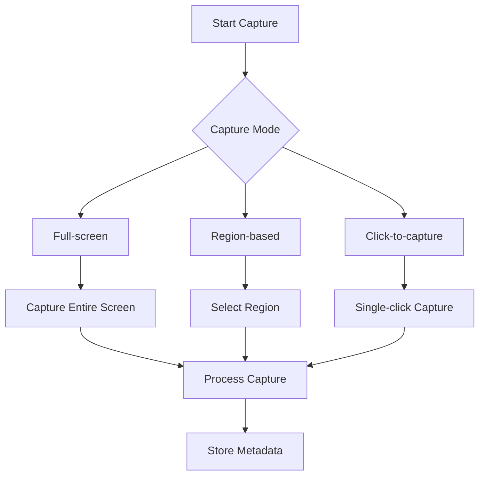
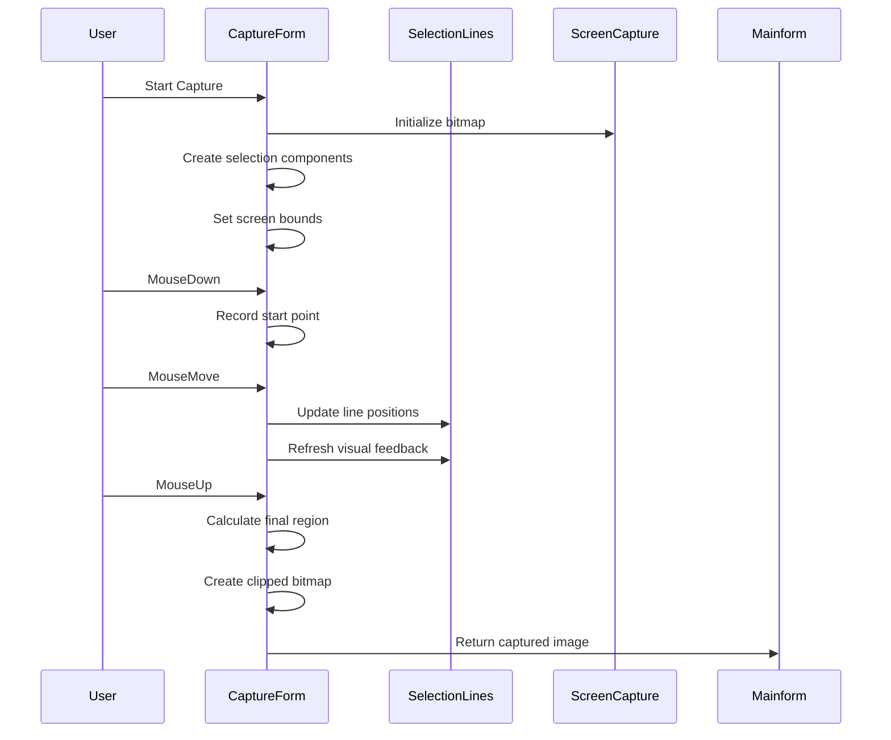
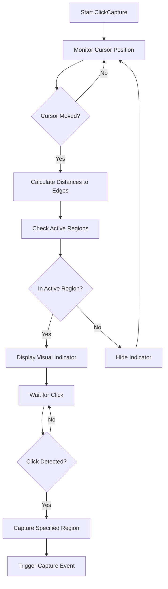
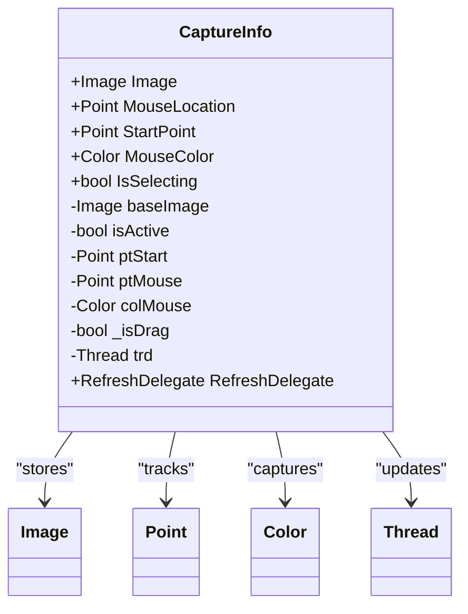
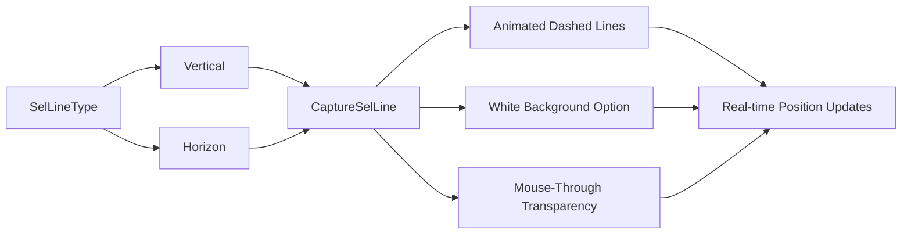
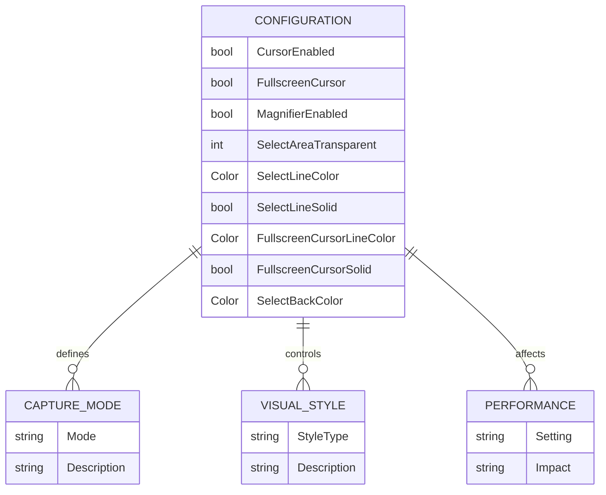

# Capture Modes

<cite>
**Referenced Files in This Document**   
- [CaptureForm.cs](file://SETUNA/Main/CaptureForm.cs)
- [ClickCapture.cs](file://SETUNA/ClickCapture.cs)
- [CaptureInfo.cs](file://SETUNA/Main/CaptureInfo.cs)
- [SelLineType.cs](file://SETUNA/Main/SelLineType.cs)
- [CaptureSelLine.cs](file://SETUNA/Main/CaptureSelLine.cs)
- [Magnifier.cs](file://SETUNA/Main/Magnifier.cs)
- [Mainform.cs](file://SETUNA/Mainform.cs)
</cite>

## Table of Contents
1. [Introduction](#introduction)
2. [Capture Modes Overview](#capture-modes-overview)
3. [CaptureForm Implementation](#captureform-implementation)
4. [ClickCapture Workflow](#clickcapture-workflow)
5. [CaptureInfo Metadata Management](#captureinfo-metadata-management)
6. [Visual Feedback with SelLineType](#visual-feedback-with-sellinetype)
7. [Configuration Options](#configuration-options)
8. [Troubleshooting Guide](#troubleshooting-guide)

## Introduction
This document details the capture modes and implementation logic in the SETUNA screenshot application. The system supports multiple capture workflows including full-screen, region-based, and click-to-capture modes. The architecture is designed to provide flexible screenshot capabilities with configurable visual feedback and metadata tracking. The core components work together to handle capture triggers, selection strategies, and post-capture processing.

## Capture Modes Overview

The SETUNA application implements three primary capture modes:

1. **Full-screen capture**: Captures the entire screen of the current monitor
2. **Region-based capture**: Allows users to select a rectangular region for capture
3. **Click-to-capture**: Enables single-click screenshot capture without manual region selection

These modes are coordinated through the main application flow in Mainform.cs, which manages the state transitions between different capture operations. The CaptureForm class serves as the central component for handling all capture operations, while specialized classes like ClickCapture provide specific functionality for different capture workflows.

**Diagram sources**
- [Mainform.cs](file://SETUNA/Mainform.cs#L116-L156)
- [CaptureForm.cs](file://SETUNA/Main/CaptureForm.cs#L192-L286)

**Section sources**
- [Mainform.cs](file://SETUNA/Mainform.cs#L116-L156)
- [CaptureForm.cs](file://SETUNA/Main/CaptureForm.cs#L116-L286)

## CaptureForm Implementation

The CaptureForm class handles the implementation logic for different capture triggers and selection strategies. When a capture operation is initiated, the form creates several auxiliary components to manage the visual feedback during selection:

- **Selection area**: A semi-transparent form (selArea) that highlights the selected region
- **Selection lines**: Four CaptureSelLine instances that form the boundary of the selection rectangle
- **Fullscreen cursor**: Optional horizontal and vertical lines that follow the cursor in fullscreen mode
- **Magnifier**: An optional magnification window that shows cursor position details

The capture process begins with the ShowCapture method, which initializes the capture environment by creating a bitmap of the current screen and setting up the selection components. The form uses a separate thread to capture the screen content, ensuring the UI remains responsive during the capture process.

The selection process is handled through mouse event handlers:
- **MouseDown**: Records the starting point of the selection
- **MouseMove**: Updates the selection rectangle as the user drags the mouse
- **MouseUp**: Finalizes the selection and triggers the capture operation

**Diagram sources**
- [CaptureForm.cs](file://SETUNA/Main/CaptureForm.cs#L192-L286)
- [CaptureForm.cs](file://SETUNA/Main/CaptureForm.cs#L525-L634)

**Section sources**
- [CaptureForm.cs](file://SETUNA/Main/CaptureForm.cs#L116-L871)

## ClickCapture Workflow

The ClickCapture class enables single-click screenshot capture without requiring manual region selection. This feature uses a proximity-based algorithm to determine capture regions based on the cursor's position relative to screen edges and corners.

The implementation works as follows:
1. A timer continuously monitors the cursor position
2. For each screen, the system calculates the distance from the cursor to each edge and corner
3. Based on configurable flags (CC1-CC9), the system determines which capture regions are active
4. When the cursor enters an active region, a visual indicator is displayed
5. Clicking in the active region triggers a capture of the corresponding screen area

The ClickPositionType enum defines nine possible capture positions (CP1-CP9) corresponding to the eight compass points and center, allowing for precise control over which screen regions can be captured with a single click.

**Diagram sources**
- [ClickCapture.cs](file://SETUNA/ClickCapture.cs#L47-L205)
- [ClickCapture.cs](file://SETUNA/ClickCapture.cs#L245-L251)

**Section sources**
- [ClickCapture.cs](file://SETUNA/ClickCapture.cs#L1-L339)
- [Mainform.cs](file://SETUNA/Mainform.cs#L124-L127)

## CaptureInfo Metadata Management

The CaptureInfo class is responsible for storing and displaying metadata about the capture operation. This includes information such as:

- **Capture source**: The origin of the capture operation
- **Timestamp**: When the capture was initiated
- **Screen resolution**: The dimensions of the captured screen area
- **Mouse position**: The cursor coordinates during capture
- **Color information**: The RGB values of pixels under the cursor

The class implements a real-time display that shows the current cursor position and color values as the user moves the mouse. This information is updated through a background thread that periodically refreshes the display, providing immediate feedback during the capture process.

The metadata is stored in the CaptureInfo instance and can be accessed by other components for logging, debugging, or display purposes. The class also handles the visual representation of this metadata through its paint event handler, which draws the information overlay on the capture interface.

**Diagram sources**
- [CaptureInfo.cs](file://SETUNA/Main/CaptureInfo.cs#L10-L220)
- [CaptureInfo.cs](file://SETUNA/Main/CaptureInfo.cs#L80-L114)

**Section sources**
- [CaptureInfo.cs](file://SETUNA/Main/CaptureInfo.cs#L1-L220)

## Visual Feedback with SelLineType

The SelLineType enum and CaptureSelLine class work together to provide visual feedback during the selection process. The SelLineType enum defines two line orientations:

- **Vertical**: Lines that run vertically along the selection boundary
- **Horizontal**: Lines that run horizontally along the selection boundary

The CaptureSelLine class implements animated dashed lines that form the selection rectangle. The visual feedback includes:

- **Dashed pattern animation**: The dash offset increments over time, creating a moving effect
- **White background**: An optional white line behind the colored selection line for better visibility
- **Transparency**: The lines use transparency keying to allow mouse events to pass through

The selection lines are updated in real-time as the user drags the mouse, providing immediate visual feedback about the selected region. The lines are positioned at the edges of the selection rectangle, with two horizontal lines (top and bottom) and two vertical lines (left and right).

**Diagram sources**
- [SelLineType.cs](file://SETUNA/Main/SelLineType.cs#L1-L12)
- [CaptureSelLine.cs](file://SETUNA/Main/CaptureSelLine.cs#L1-L173)

**Section sources**
- [SelLineType.cs](file://SETUNA/Main/SelLineType.cs#L1-L12)
- [CaptureSelLine.cs](file://SETUNA/Main/CaptureSelLine.cs#L1-L173)

## Configuration Options

The capture functionality supports several configuration options that can be customized through the application settings:

### Mouse Cursor Inclusion
The application can optionally include the mouse cursor in captured screenshots. This is controlled by the `CursorEnabled` property in the SetunaOption configuration, which is checked during the screen capture process in the CopyFromScreen method.

### Multi-monitor Support
The system handles multi-monitor setups by:
- Detecting the current screen based on cursor position
- Creating capture bitmaps with appropriate dimensions for each screen
- Managing screen bounds and coordinates correctly across multiple displays

### Visual Customization
Users can customize the appearance of capture elements:
- **Selection line style**: Solid or dashed lines
- **Selection line color**: Customizable color for selection boundaries
- **Selection area transparency**: Adjustable opacity for the selection overlay
- **Fullscreen cursor**: Optional crosshair display in fullscreen mode
- **Magnifier**: Optional magnification window with position options

### Performance Settings
The application includes settings that affect performance:
- **Magnifier refresh rate**: Controls how frequently the magnifier updates
- **Selection animation speed**: Affects the dash offset animation rate
- **Thread priority**: Background capture thread runs as a background thread to minimize impact on system performance

**Diagram sources**
- [CaptureForm.cs](file://SETUNA/Main/CaptureForm.cs#L145-L173)
- [Mainform.cs](file://SETUNA/Mainform.cs#L35-L39)

**Section sources**
- [CaptureForm.cs](file://SETUNA/Main/CaptureForm.cs#L145-L173)
- [Mainform.cs](file://SETUNA/Mainform.cs#L35-L39)

## Troubleshooting Guide

### Incorrect Screen Bounds Detection
**Symptoms**: Capture operations include wrong screen areas or fail to detect multi-monitor setups correctly.

**Solutions**:
1. Verify that Screen.AllScreens returns the expected number of screens
2. Check that GetCurrentScreen correctly identifies the active screen based on cursor position
3. Ensure that targetScreen.Bounds is properly updated when switching between monitors
4. Validate that the capture bitmap dimensions match the current screen dimensions

**Section sources**
- [CaptureForm.cs](file://SETUNA/Main/CaptureForm.cs#L288-L298)
- [CaptureForm.cs](file://SETUNA/Main/CaptureForm.cs#L201-L204)

### Performance Bottlenecks During High-frequency Capture
**Symptoms**: Application becomes unresponsive or capture operations are delayed when performing frequent captures.

**Solutions**:
1. Optimize the screen capture thread to minimize resource usage
2. Adjust the magnifier refresh rate to reduce CPU usage
3. Implement capture request queuing to prevent thread overload
4. Consider using hardware-accelerated graphics operations when available
5. Monitor memory usage and ensure proper disposal of bitmap resources

**Section sources**
- [CaptureForm.cs](file://SETUNA/Main/CaptureForm.cs#L205-L209)
- [CaptureForm.cs](file://SETUNA/Main/CaptureForm.cs#L461-L469)

### Selection Visual Feedback Issues
**Symptoms**: Selection lines don't appear, don't animate properly, or don't update in real-time.

**Solutions**:
1. Verify that the CaptureSelLine instances are properly initialized with correct line types
2. Check that the dash offset animation is incrementing correctly
3. Ensure that the selection lines are set to visible when selection is active
4. Validate that the parent form's opacity settings don't interfere with selection line visibility

**Section sources**
- [CaptureSelLine.cs](file://SETUNA/Main/CaptureSelLine.cs#L11-L18)
- [CaptureForm.cs](file://SETUNA/Main/CaptureForm.cs#L145-L160)

### ClickCapture Region Detection Problems
**Symptoms**: Click-to-capture doesn't trigger in expected regions or triggers in wrong areas.

**Solutions**:
1. Verify that the ClickFlags are properly configured for the desired capture regions
2. Check that the distance calculations in timer1_Tick are correct for the current screen dimensions
3. Ensure that the cursor position is properly mapped to screen coordinates
4. Validate that the ClickPositionType transitions occur at the correct thresholds

**Section sources**
- [ClickCapture.cs](file://SETUNA/ClickCapture.cs#L47-L205)
- [ClickCapture.cs](file://SETUNA/ClickCapture.cs#L21-L23)