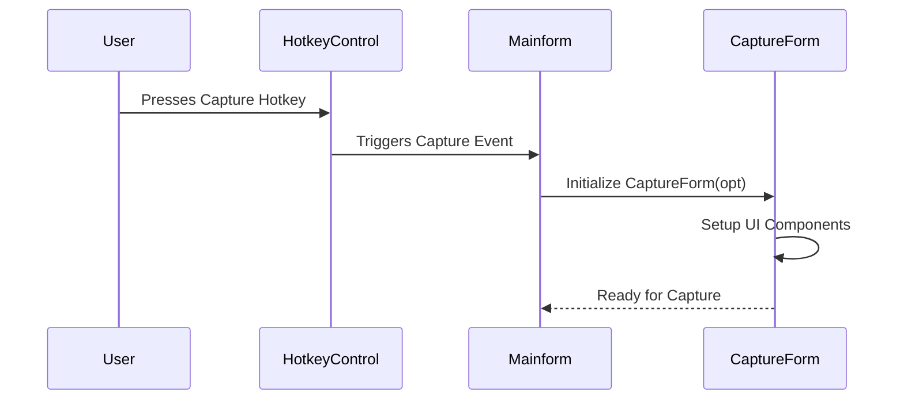
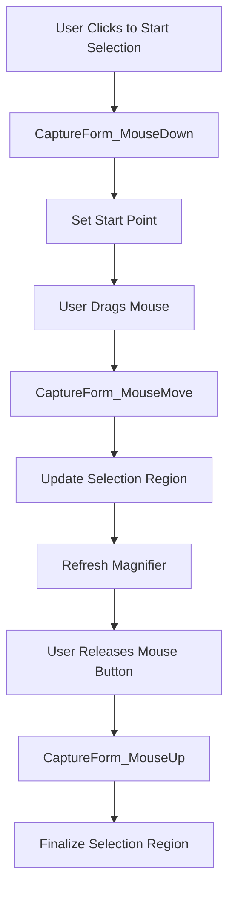
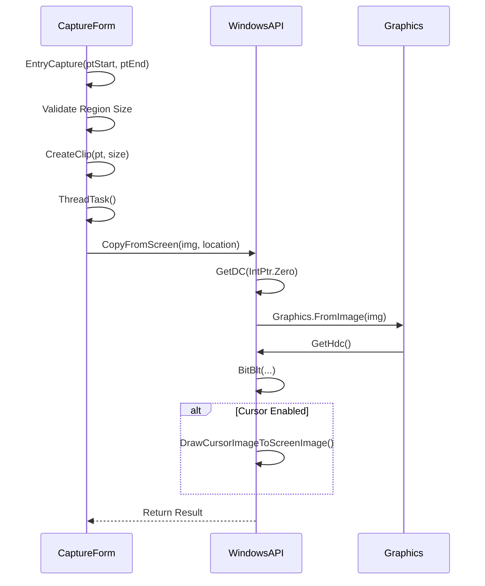
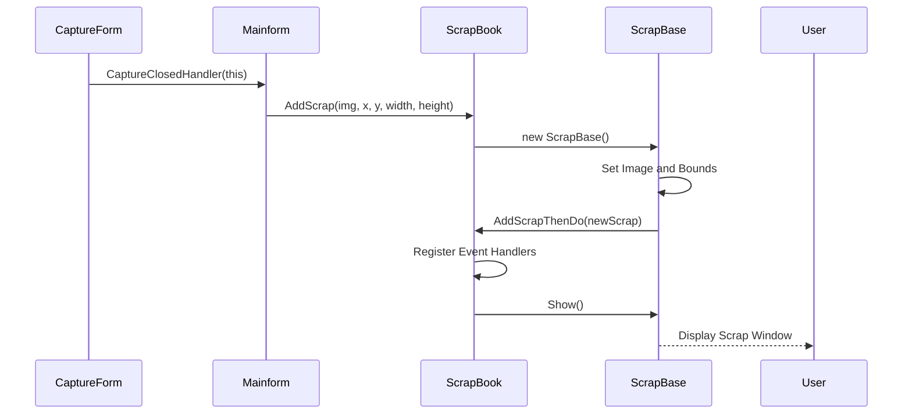
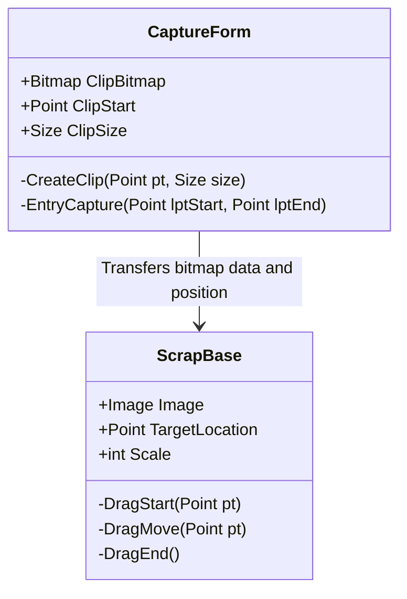

# Capture Workflow

<cite>
**Referenced Files in This Document**   
- [CaptureForm.cs](file://SETUNA/Main/CaptureForm.cs)
- [Mainform.cs](file://SETUNA/Mainform.cs)
- [ScrapBook.cs](file://SETUNA/Main/ScrapBook.cs)
- [ScrapBase.cs](file://SETUNA/Main/ScrapBase.cs)
- [WindowsAPI.cs](file://SETUNA/Main/Common/WindowsAPI.cs)
- [HotKeyID.cs](file://SETUNA/Main/HotKeyID.cs)
</cite>

## Table of Contents
1. [Introduction](#introduction)
2. [Hotkey Activation and Capture Initialization](#hotkey-activation-and-capture-initialization)
3. [Screen Overlay and User Input Handling](#screen-overlay-and-user-input-handling)
4. [Region Selection and Image Extraction](#region-selection-and-image-extraction)
5. [Scrap Creation and Registration](#scrap-creation-and-registration)
6. [Bitmap Data Transfer and Window Positioning](#bitmap-data-transfer-and-window-positioning)
7. [Error Handling and Memory Management](#error-handling-and-memory-management)
8. [Troubleshooting Guide](#troubleshooting-guide)

## Introduction
This document details the end-to-end capture workflow in the SETUNA application, from hotkey activation to scrap creation. The workflow involves capturing screen regions, processing the captured images, and registering them as scrap items that can be manipulated and stored. The system uses Windows API functions for screen capture and implements a robust event-driven architecture to handle user interactions and maintain application state.

**Section sources**
- [CaptureForm.cs](file://SETUNA/Main/CaptureForm.cs#L1-L871)
- [Mainform.cs](file://SETUNA/Mainform.cs#L1-L1000)

## Hotkey Activation and Capture Initialization
The capture workflow begins when a user triggers a hotkey event, typically configured to initiate a screen capture. The `Mainform` class listens for these hotkey events through the `HotkeyControl` component, which captures keyboard input and translates it into application commands. When the capture hotkey (defined in `HotKeyID.Capture`) is pressed, the `StartCapture` method in `Mainform` is invoked.

This method initializes the `CaptureForm`, which serves as the primary interface for the capture process. The `CaptureForm` constructor sets up the necessary components, including selection lines, a magnifier tool, and fullscreen cursor indicators, based on user preferences stored in `SetunaOption.SetunaOptionData`. The form is configured to be transparent, topmost, and borderless to provide an unobtrusive overlay during capture.

**Diagram sources**
- [Mainform.cs](file://SETUNA/Mainform.cs#L115-L120)
- [CaptureForm.cs](file://SETUNA/Main/CaptureForm.cs#L116-L180)
- [HotKeyID.cs](file://SETUNA/Main/HotKeyID.cs#L5)

**Section sources**
- [Mainform.cs](file://SETUNA/Mainform.cs#L115-L120)
- [CaptureForm.cs](file://SETUNA/Main/CaptureForm.cs#L116-L180)
- [HotKeyID.cs](file://SETUNA/Main/HotKeyID.cs#L5)

## Screen Overlay and User Input Handling
Once initialized, the `CaptureForm` displays a screen overlay that enables user interaction for region selection. The overlay consists of semi-transparent selection areas and crosshair lines that guide the user in defining the capture region. The `ShowCapture` method configures the overlay based on the current screen dimensions and user preferences, setting the opacity and color of the selection area.

User input is handled through mouse events. When the user clicks and drags, the `CaptureForm_MouseDown`, `CaptureForm_MouseMove`, and `CaptureForm_MouseUp` methods work together to update the selection region in real-time. The magnifier tool, when enabled, provides a zoomed view of the cursor area to assist with precise selection. The `CaptureForm_MouseMove` method updates the position of the selection lines and refreshes the magnifier display accordingly.

**Diagram sources**
- [CaptureForm.cs](file://SETUNA/Main/CaptureForm.cs#L525-L531)
- [CaptureForm.cs](file://SETUNA/Main/CaptureForm.cs#L597-L616)
- [CaptureForm.cs](file://SETUNA/Main/CaptureForm.cs#L588-L594)

**Section sources**
- [CaptureForm.cs](file://SETUNA/Main/CaptureForm.cs#L193-L285)
- [CaptureForm.cs](file://SETUNA/Main/CaptureForm.cs#L525-L594)

## Region Selection and Image Extraction
After the user defines the capture region, the system extracts the image using Windows API functions. The `EntryCapture` method validates the selection region, ensuring it meets minimum size requirements before proceeding. If valid, it calls `CreateClip` to extract the image from the screen buffer.

The actual screen capture is performed in a background thread via the `ThreadTask` method, which calls `CopyFromScreen` to capture the entire screen into a bitmap buffer (`ImgSnap`). This method uses `GetDC` and `BitBlt` Windows API functions to copy the screen content to a bitmap. If the cursor is enabled in settings, `DrawCursorImageToScreenImage` overlays the current cursor position onto the captured image using `DrawIcon`.

**Diagram sources**
- [CaptureForm.cs](file://SETUNA/Main/CaptureForm.cs#L637-L659)
- [CaptureForm.cs](file://SETUNA/Main/CaptureForm.cs#L708-L719)
- [WindowsAPI.cs](file://SETUNA/Main/Common/WindowsAPI.cs#L141-L148)

**Section sources**
- [CaptureForm.cs](file://SETUNA/Main/CaptureForm.cs#L637-L719)
- [WindowsAPI.cs](file://SETUNA/Main/Common/WindowsAPI.cs#L141-L148)

## Scrap Creation and Registration
Once the image is captured, it is registered with the `ScrapBook` for management and display. The `CaptureForm` invokes the `EndCapture` method, which hides the capture overlay and triggers the `CaptureClosedHandler` delegate. This handler, typically set to a method in `Mainform`, creates a new `ScrapBase` instance and adds it to the `ScrapBook` via `AddScrap`.

The `ScrapBook.AddScrap` method initializes a new `ScrapBase` form with the captured image, sets its position and size, and registers event handlers for scrap lifecycle management. The scrap is then added to the internal collection and displayed to the user. The `ScrapBook` maintains references to all active scraps and manages their lifecycle, including moving deleted scraps to a dustbox for potential recovery.

**Diagram sources**
- [CaptureForm.cs](file://SETUNA/Main/CaptureForm.cs#L668-L674)
- [ScrapBook.cs](file://SETUNA/Main/ScrapBook.cs#L115-L132)
- [ScrapBook.cs](file://SETUNA/Main/ScrapBook.cs#L169-L192)

**Section sources**
- [CaptureForm.cs](file://SETUNA/Main/CaptureForm.cs#L668-L674)
- [ScrapBook.cs](file://SETUNA/Main/ScrapBook.cs#L115-L192)

## Bitmap Data Transfer and Window Positioning
The captured bitmap data is transferred from the `CaptureForm` to the `ScrapBase` through direct assignment of the `Image` property. The `CreateClip` method generates a bitmap of the selected region by drawing from the screen buffer (`ImgSnap`) to a new bitmap (`bmpClip`). This bitmap is then accessed via the `ClipBitmap` property and passed to `ScrapBook.AddScrap`.

Window positioning is calculated based on the capture region coordinates. The `EntryCapture` method converts screen coordinates to window positions, ensuring the scrap appears at the correct location on the desktop. The `ScrapBase` constructor sets the initial position using `SetBounds`, and subsequent movements are handled through drag operations that update the `Left` and `Top` properties relative to the mouse position.

**Diagram sources**
- [CaptureForm.cs](file://SETUNA/Main/CaptureForm.cs#L71-L89)
- [CaptureForm.cs](file://SETUNA/Main/CaptureForm.cs#L637-L659)
- [ScrapBase.cs](file://SETUNA/Main/ScrapBase.cs#L388-L407)
- [ScrapBase.cs](file://SETUNA/Main/ScrapBase.cs#L638-L665)

**Section sources**
- [CaptureForm.cs](file://SETUNA/Main/CaptureForm.cs#L71-L89)
- [CaptureForm.cs](file://SETUNA/Main/CaptureForm.cs#L637-L659)
- [ScrapBase.cs](file://SETUNA/Main/ScrapBase.cs#L388-L407)
- [ScrapBase.cs](file://SETUNA/Main/ScrapBase.cs#L638-L665)

## Error Handling and Memory Management
The capture workflow implements comprehensive error handling and memory management to ensure stability and prevent resource leaks. In the `CopyFromScreen` method, exceptions during screen capture are caught and logged, with the operation gracefully failing by returning `false`. The method ensures proper disposal of GDI resources through try-finally blocks, releasing device contexts and graphics objects even if an exception occurs.

Memory management is critical when handling large images. The `CaptureForm` reuses the `ImgSnap` bitmap when possible, only recreating it when screen dimensions change. The `ScrapBase` class implements proper disposal patterns, with `ImageAllDispose` ensuring all image resources are released in the destructor. The `ScrapBook` manages the lifecycle of all scraps, ensuring they are properly disposed when closed or moved to the dustbox.

For thread safety during UI updates, the `ThreadTask` method uses `Invoke` to marshal calls to `ShowForm` and `CancelForm` back to the UI thread, preventing cross-thread exceptions. The opacity animation timer in `ScrapBase` includes error handling for Win32 exceptions that might occur during opacity changes, falling back to full opacity if necessary.

**Section sources**
- [CaptureForm.cs](file://SETUNA/Main/CaptureForm.cs#L319-L364)
- [ScrapBase.cs](file://SETUNA/Main/ScrapBase.cs#L222-L240)
- [ScrapBase.cs](file://SETUNA/Main/ScrapBase.cs#L222-L240)
- [ScrapBase.cs](file://SETUNA/Main/ScrapBase.cs#L249-L258)

## Troubleshooting Guide
This section addresses common issues encountered during the capture workflow and provides solutions.

### Black Screenshots
Black screenshots typically occur when the screen capture fails due to permission issues or graphics driver problems. Ensure the application has the necessary permissions to capture the screen, and verify that the `User32.dll` and `Gdi32.dll` functions are accessible. Check that `Mainform.Instance.optSetuna.Setuna.CursorEnabled` is properly configured, as cursor drawing can sometimes interfere with capture.

**Section sources**
- [CaptureForm.cs](file://SETUNA/Main/CaptureForm.cs#L328-L334)
- [WindowsAPI.cs](file://SETUNA/Main/Common/WindowsAPI.cs#L141-L148)

### Incorrect Positioning
Incorrect scrap positioning can result from coordinate miscalculations between screen and window coordinates. Verify that `ptStart` and `ptEnd` in `EntryCapture` are correctly adjusted by `targetScreen.Bounds.X` and `targetScreen.Bounds.Y`. Ensure that `SetBounds` in `ScrapBase` uses the correct coordinates derived from the capture region.

**Section sources**
- [CaptureForm.cs](file://SETUNA/Main/CaptureForm.cs#L527-L528)
- [CaptureForm.cs](file://SETUNA/Main/CaptureForm.cs#L643-L646)

### Resource Leaks
Resource leaks may occur if bitmap objects are not properly disposed. Ensure that `bmpClip` in `CaptureForm` is disposed in `OnClosing` and that `ImageAllDispose` is called in `ScrapBase`. Monitor the `ScrapBook` lifecycle to ensure scraps are properly removed from collections and disposed when closed.

**Section sources**
- [CaptureForm.cs](file://SETUNA/Main/CaptureForm.cs#L464-L468)
- [ScrapBase.cs](file://SETUNA/Main/ScrapBase.cs#L182-L185)
- [ScrapBook.cs](file://SETUNA/Main/ScrapBook.cs#L75-L81)