# Magnifier Tool

<cite>
**Referenced Files in This Document**   
- [Magnifier.cs](file://SETUNA/Main/Magnifier.cs)
- [Magnifier.Designer.cs](file://SETUNA/Main/Magnifier.Designer.cs)
- [CaptureForm.cs](file://SETUNA/Main/CaptureForm.cs)
- [CaptureForm.Designer.cs](file://SETUNA/Main/CaptureForm.Designer.cs)
- [Utils.cs](file://SETUNA/Main/Common/Utils.cs)
</cite>

## Table of Contents
1. [Introduction](#introduction)
2. [Core Components](#core-components)
3. [Architecture Overview](#architecture-overview)
4. [Detailed Component Analysis](#detailed-component-analysis)
5. [Rendering Techniques and Performance Optimization](#rendering-techniques-and-performance-optimization)
6. [Integration with CaptureForm](#integration-with-captureform)
7. [Common Issues and Compatibility Considerations](#common-issues-and-compatibility-considerations)
8. [Performance Trade-offs](#performance-trade-offs)

## Introduction
The Magnifier tool is a real-time screen magnification component designed to assist users in precise region selection during screenshot capture operations. Integrated within the SETUNA screenshot application, this tool captures a small area around the mouse cursor and scales it for detailed viewing. The implementation leverages Windows Forms, GDI+ graphics operations, and efficient bitmap manipulation to provide a live preview functionality that enhances accuracy in region selection. This document details the technical implementation, integration points, rendering techniques, and performance characteristics of the Magnifier tool.

## Core Components

The Magnifier tool consists of two primary components: the `Magnifier` class that handles the magnification functionality and the `CaptureForm` class that manages the overall capture interface. The `Magnifier` class operates as a separate form that displays a scaled view of the screen region around the cursor, while `CaptureForm` orchestrates the capture process and integrates the magnifier into the selection workflow.

**Section sources**
- [Magnifier.cs](file://SETUNA/Main/Magnifier.cs#L8-L123)
- [CaptureForm.cs](file://SETUNA/Main/CaptureForm.cs#L15-L871)

## Architecture Overview

The Magnifier tool follows a client-server architecture where the `CaptureForm` acts as the controller and the `Magnifier` serves as a visual feedback component. The architecture is event-driven, responding to mouse movements and visibility changes to update the magnified view.

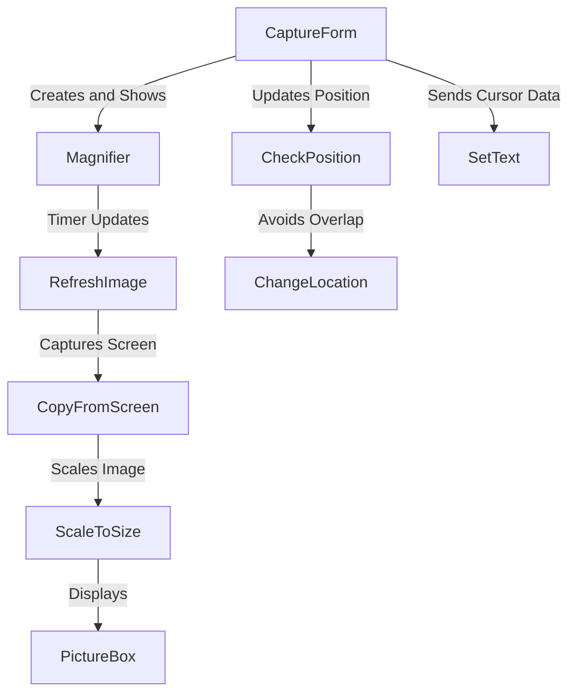

**Diagram sources**
- [Magnifier.cs](file://SETUNA/Main/Magnifier.cs#L8-L123)
- [CaptureForm.cs](file://SETUNA/Main/CaptureForm.cs#L15-L871)

## Detailed Component Analysis

### Magnifier Class Implementation
The `Magnifier` class implements a real-time magnification window that follows the cursor position. It uses a timer-driven update mechanism to periodically capture and display a scaled view of the screen region around the cursor.

#### Magnifier Class Structure
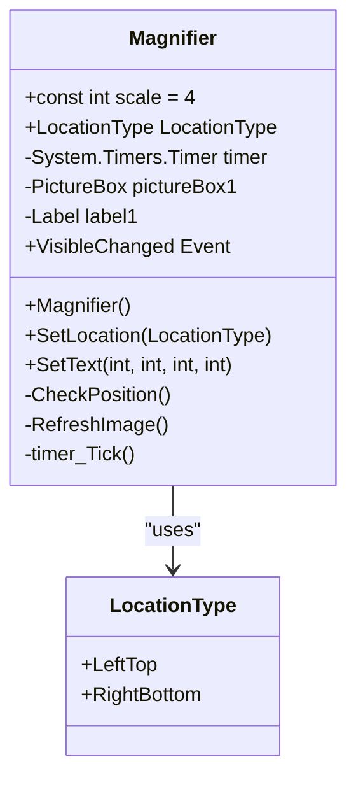

**Diagram sources**
- [Magnifier.cs](file://SETUNA/Main/Magnifier.cs#L8-L123)
- [Magnifier.Designer.cs](file://SETUNA/Main/Magnifier.Designer.cs#L4-L79)

#### Update Flow Sequence
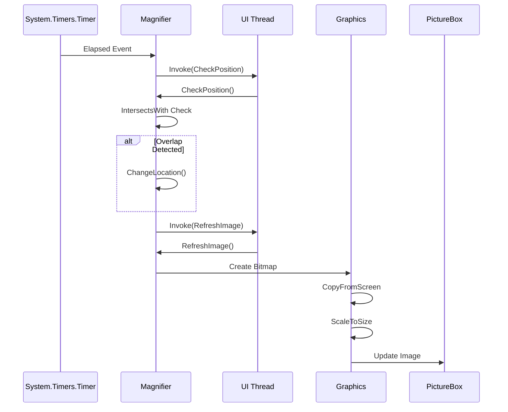

**Diagram sources**
- [Magnifier.cs](file://SETUNA/Main/Magnifier.cs#L8-L123)

### CaptureForm Integration
The `CaptureForm` class integrates the Magnifier tool into the screenshot capture workflow, managing its lifecycle and data flow.

#### Integration Flow
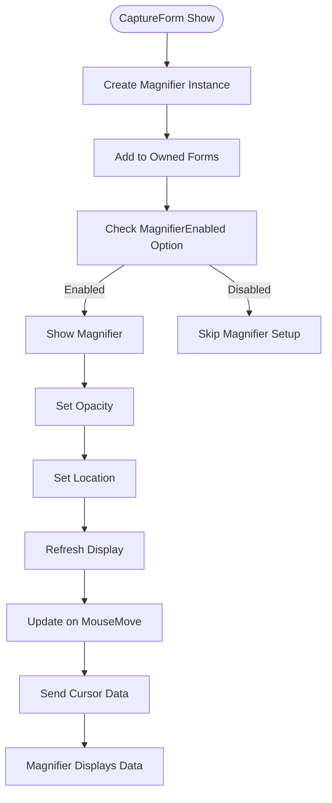

**Diagram sources**
- [CaptureForm.cs](file://SETUNA/Main/CaptureForm.cs#L15-L871)

**Section sources**
- [CaptureForm.cs](file://SETUNA/Main/CaptureForm.cs#L15-L871)
- [CaptureForm.Designer.cs](file://SETUNA/Main/CaptureForm.Designer.cs#L1-L53)

## Rendering Techniques and Performance Optimization

### Bitmap and Graphics Implementation
The Magnifier tool employs efficient bitmap manipulation techniques to capture and render screen content. The rendering pipeline involves capturing a small region at native resolution and scaling it for display.

#### Rendering Process Flow
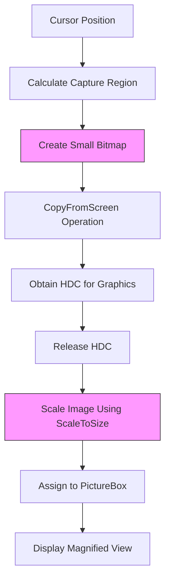

**Diagram sources**
- [Magnifier.cs](file://SETUNA/Main/Magnifier.cs#L80-L94)
- [Utils.cs](file://SETUNA/Main/Common/Utils.cs#L22-L38)

### Scaling Algorithm Analysis
The scaling functionality is implemented through the `ScaleToSize` extension method, which uses nearest-neighbor interpolation for performance optimization.

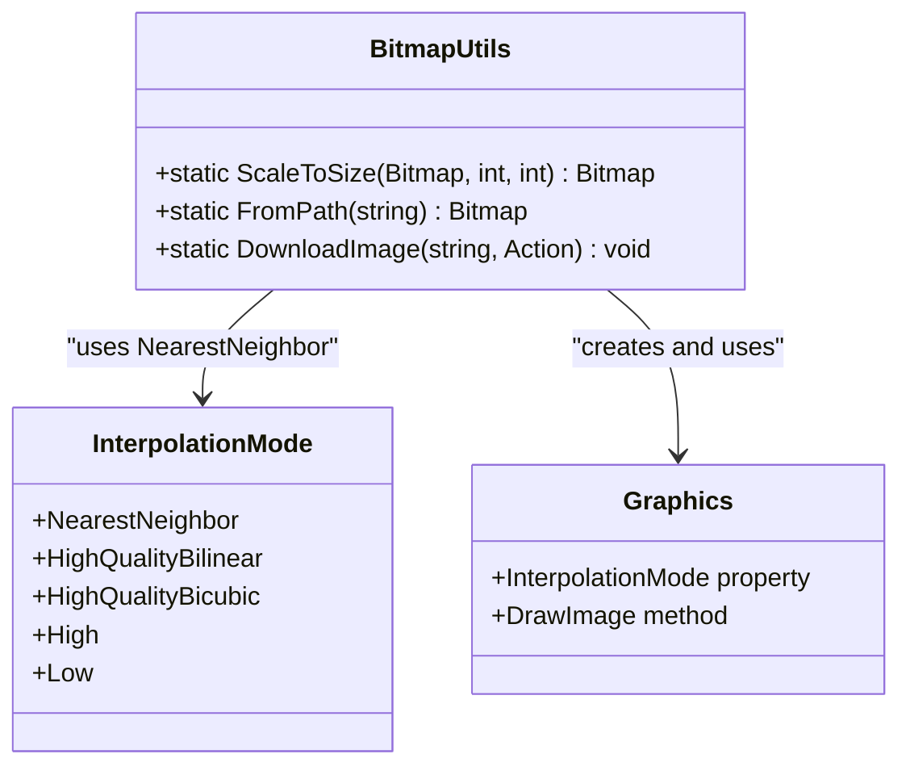

**Diagram sources**
- [Utils.cs](file://SETUNA/Main/Common/Utils.cs#L22-L38)

**Section sources**
- [Utils.cs](file://SETUNA/Main/Common/Utils.cs#L22-L38)

## Integration with CaptureForm

The Magnifier tool is tightly integrated with the `CaptureForm` to provide a seamless user experience during region selection. The integration involves lifecycle management, position coordination, and data synchronization.

### Lifecycle Management
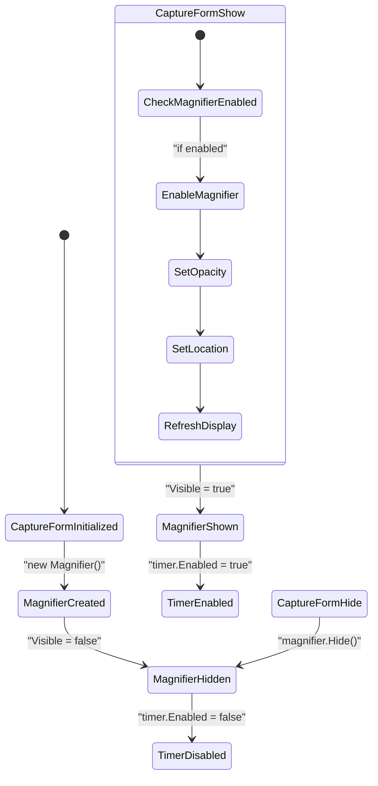

**Diagram sources**
- [CaptureForm.cs](file://SETUNA/Main/CaptureForm.cs#L174-L178)
- [Magnifier.cs](file://SETUNA/Main/Magnifier.cs#L96-L105)

### Data Flow Between Components
The `CaptureForm` and `Magnifier` exchange data through method calls and property updates, enabling real-time feedback during the selection process.

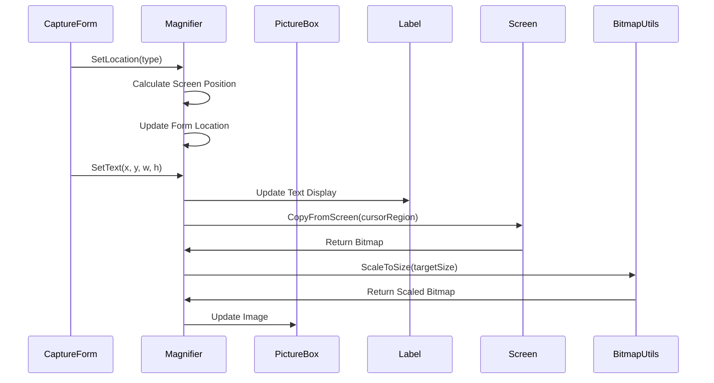

**Diagram sources**
- [CaptureForm.cs](file://SETUNA/Main/CaptureForm.cs#L618-L633)
- [Magnifier.cs](file://SETUNA/Main/Magnifier.cs#L47-L51)

**Section sources**
- [CaptureForm.cs](file://SETUNA/Main/CaptureForm.cs#L618-L633)
- [Magnifier.cs](file://SETUNA/Main/Magnifier.cs#L47-L51)

## Common Issues and Compatibility Considerations

### Lag During Rapid Cursor Movement
The Magnifier tool may experience lag during rapid cursor movements due to the timer-based update mechanism with a 100ms interval. This creates a trade-off between CPU usage and responsiveness.

#### Performance Bottlenecks
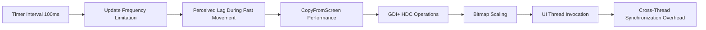

**Section sources**
- [Magnifier.cs](file://SETUNA/Main/Magnifier.cs#L25-L26)
- [Magnifier.cs](file://SETUNA/Main/Magnifier.cs#L107-L114)

### Color Distortion and Scaling Artifacts
The use of nearest-neighbor interpolation in the `ScaleToSize` method can lead to pixelation and jagged edges in the magnified view, particularly noticeable with text and diagonal lines.

#### Scaling Algorithm Characteristics
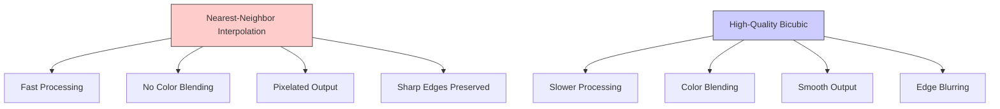

**Section sources**
- [Utils.cs](file://SETUNA/Main/Common/Utils.cs#L33-L34)

### High-DPI Display Compatibility
The current implementation does not explicitly handle high-DPI scaling, which may result in incorrect sizing or positioning on high-resolution displays.

#### DPI-Related Challenges
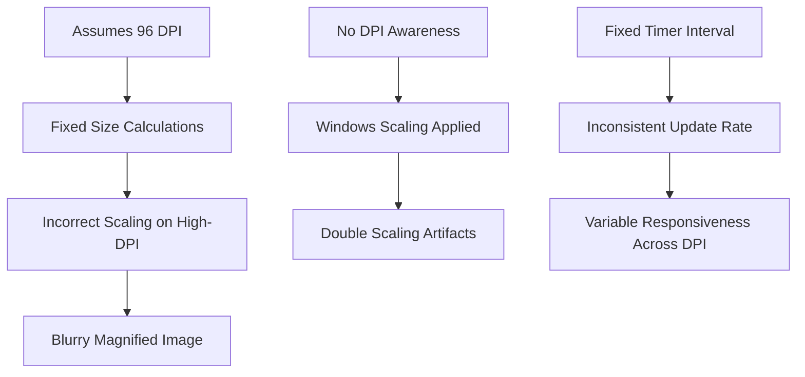

**Section sources**
- [Magnifier.Designer.cs](file://SETUNA/Main/Magnifier.Designer.cs#L63-L64)
- [CaptureForm.Designer.cs](file://SETUNA/Main/CaptureForm.Designer.cs#L23-L24)

## Performance Trade-offs

The Magnifier tool implementation involves several performance trade-offs between update speed, visual quality, and system resource usage.

### Update Frequency vs. System Load
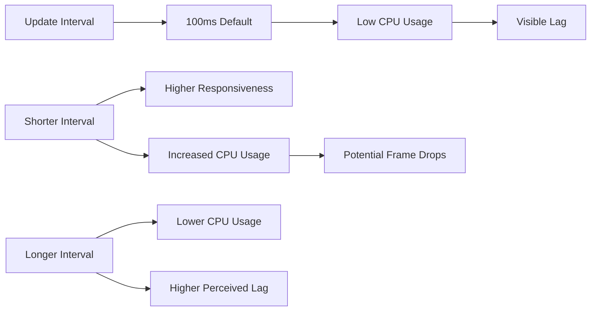

**Section sources**
- [Magnifier.cs](file://SETUNA/Main/Magnifier.cs#L25-L26)

### Visual Quality vs. Performance
The choice of nearest-neighbor interpolation represents a deliberate performance optimization that sacrifices visual quality for speed.

```mermaid
table[Performance Trade-offs]
| Interpolation Mode | Performance | Visual Quality | Use Case |
|---|---|---|---|
| NearestNeighbor | High | Low | Real-time magnification |
| HighQualityBilinear | Medium | Medium | Balanced use |
| HighQualityBicubic | Low | High | Static image viewing |
| High | Medium-High | Medium-High | General purpose |
```

**Section sources**
- [Utils.cs](file://SETUNA/Main/Common/Utils.cs#L33-L34)

### Memory Management Considerations
The implementation creates new bitmap objects on each update cycle, which could lead to memory pressure during extended use.

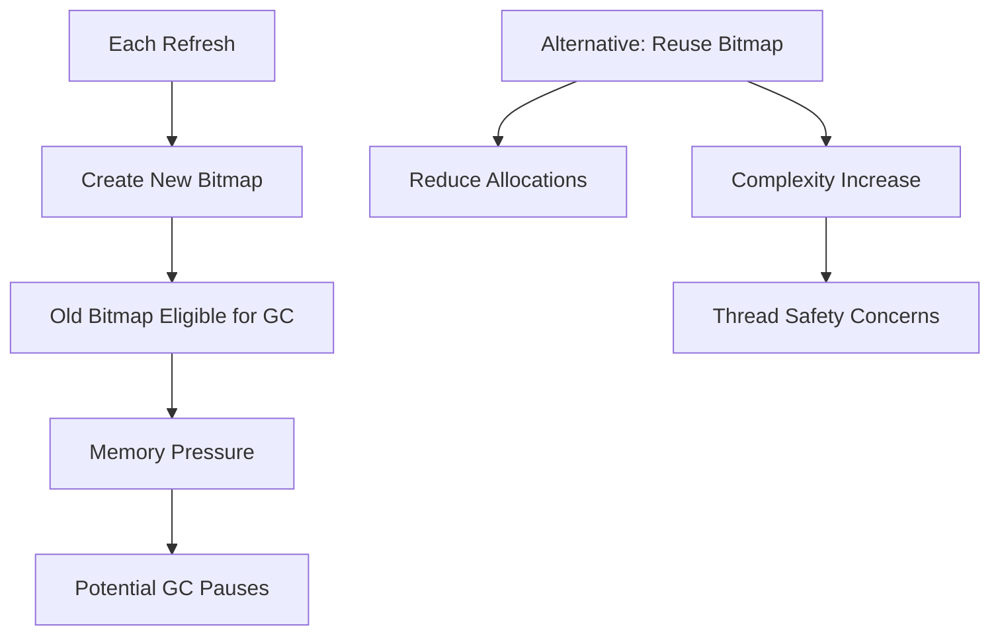

**Section sources**
- [Magnifier.cs](file://SETUNA/Main/Magnifier.cs#L85-L93)